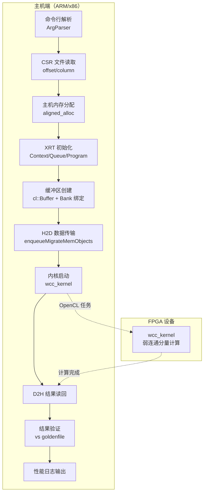

# host_benchmark_application 模块技术深潜

## 一句话概括

这是一个为 **FPGA 加速的弱连通分量（WCC）算法** 设计的基准测试主机驱动程序。它就像一位*舞台监督*：负责准备图数据（CSR 格式）、在主机与 FPGA 之间搬运数据、启动内核执行、测量性能指标，并验证计算结果的正确性。

---

## 这个模块解决什么问题？

### 问题空间

在图分析领域，**弱连通分量（Weakly Connected Components, WCC）** 是一个基础算法：给定一个有向图，找出所有互相可达的顶点集合。当图规模达到数十亿顶点、数百亿边时，CPU 实现往往无法在可接受时间内完成。

FPGA 提供了大规模并行处理能力，但引入了一个新的工程挑战：**如何高效地协调主机（CPU）与设备（FPGA）之间的协作？**

### 为什么简单方案不够用

一个朴素的实现可能会：
- 直接调用 FPGA 内核，忽略内存对齐要求 → 导致 DMA 传输失败或性能暴跌
- 使用标准 `malloc` 分配主机内存 → Xilinx Runtime (XRT) 无法进行零拷贝传输
- 将所有数据放在同一存储库（bank）→ 造成 HBM/DRAM 带宽瓶颈
- 忽略验证步骤 → 无法区分性能提升与计算错误

### 设计洞察

本模块采用**显式控制**哲学：它不信任隐式的运行时优化，而是通过代码显式声明内存位置、依赖关系和执行顺序。这种"白盒控制"在异构计算中至关重要——主机与加速器之间的每次数据移动都有明确的开销，必须精心设计。

---

## 心智模型：想象一个物流中心

把这个模块想象成一个**国际物流中心**的调度室：

| 概念 | 物流中心类比 | 代码中的对应物 |
|------|-------------|---------------|
| **图数据（CSR 格式）** | 待运输的货物清单（按目的地分区） | `offset32`（行指针）、`column32`（列索引） |
| **FPGA 设备** | 海外加工厂 | `cl::Device`、`cl::Kernel`（`wcc_kernel`） |
| **主机内存** | 本地仓库 | `aligned_alloc` 分配的缓冲区 |
| **设备内存** | 工厂车间暂存区 | `cl::Buffer`（通过 XRT 管理） |
| **XRT/OpenCL** | 货运公司与海关系统 | `cl::Context`、`cl::CommandQueue`、`xcl2.hpp` |
| **存储库（Bank）分配** | 指定使用哪个货运码头 | `cl_mem_ext_ptr_t` 中的 `flags`（2, 3, 5...） |
| **性能计时器** | 物流追踪系统 | `gettimeofday`、`cl::Event` profiling |
| **验证步骤** | 到货质检 | 与 `goldenfile` 比对 |

**关键洞察**：就像物流中心必须精确协调"取货→运输→清关→加工→返回→质检"这个流水线一样，这个模块也必须精确控制"主机内存分配→数据迁移到设备→内核执行→结果读回→验证"的完整周期。

---

## 架构与数据流

### 高层架构图



### 组件角色详解

#### 1. 命令行接口 (`ArgParser`)

这是一个极简的 POSIX 风格命令行解析器。它采用**贪婪匹配**策略：遍历参数列表，查找特定选项标记（如 `-xclbin`、`-o`），并返回其后的值。

**设计权衡**：为什么不使用 `getopt` 或 Boost.Program_options？

**答案**：保持零外部依赖（除了 XRT）。在嵌入式/加速器开发中，每个依赖都是潜在的交叉编译障碍。这个类足够小（< 50 行），复制粘贴的维护成本低于引入依赖。

**局限性**：
- 不支持参数合并（如 `-abc` 代替 `-a -b -c`）
- 不支持 `--long-option` 风格
- 不支持可选参数的默认值
- 错误信息仅打印到 `stdout`，没有使用 `stderr`

对于生产级工具，建议迁移到 `boost::program_options` 或 `CLI11` 等现代库。

#### 2. 图数据加载器 (CSR 解析)

CSR（Compressed Sparse Row）是图计算的事实标准格式。

**数据结构**：
- `offset32[numVertices + 1]`：行指针数组。`offset32[i]` 表示第 `i` 个顶点的邻接表在 `column32` 中的起始偏移。
- `column32[numEdges]`：列索引数组。存储实际的边目标顶点。

**数据流**：
1. 打开 `offsetfile`，第一行是顶点数 `numVertices`
2. 读取 `numVertices + 1` 个偏移值到 `offset32` 数组
3. 打开 `columnfile`，第一行是边数 `numEdges`
4. 读取 `numEdges` 个列索引到 `column32` 数组

**关键假设**：输入文件是有效的 CSR 格式，无错误恢复机制。如果文件格式错误（如顶点数与实际行数不匹配），会导致未定义行为（越界访问或数据损坏）。

#### 3. 内存分配策略

使用 `aligned_alloc` 分配主机内存，而非 `malloc` 或 `new`。

**为什么必须对齐？**

Xilinx Runtime (XRT) 使用 DMA（直接内存访问）在主机与 FPGA 之间传输数据。DMA 引擎通常要求缓冲区对齐到特定边界（通常是 4KB 页边界或 64 字节缓存行边界）。未对齐的内存会导致：

1. XRT 被迫创建临时复制缓冲区（性能损失，因为需要额外的内存拷贝）
2. 或在某些平台直接返回错误 `CL_INVALID_MEM_OBJECT`

**内存所有权**：

| 角色 | 实体 | 职责 |
|------|------|------|
| 分配者 | `main` 函数通过 `aligned_alloc` | 向 OS 请求物理连续的页对齐内存 |
| 所有者 | 原始指针（`column32`, `offset32` 等） | 管理内存生命周期，负责最终释放 |
| 借用者 | `cl_mem_ext_ptr_t` 结构体 | 持有非 owning 指针，传递给 XRT 用于 DMA |
| 使用者 | `cl::Buffer`（XRT 对象） | 在 DMA 操作期间临时访问主机内存 |

**内存泄漏风险**：

⚠️ **当前代码中没有看到 `free` 调用**——这是一个已知的短期基准测试模式。假设进程短暂运行后立即退出，由操作系统回收内存。但在长期运行的服务或守护进程中，这会导致严重的内存泄漏。

**生产代码改进建议**：

```cpp
// 使用 RAII 包装器确保内存释放
struct AlignedBuffer {
    void* ptr;
    size_t size;
    AlignedBuffer(size_t bytes) : size(bytes) {
        ptr = aligned_alloc(4096, bytes);
        if (!ptr) throw std::bad_alloc();
    }
    ~AlignedBuffer() { free(ptr); }
    // 禁用拷贝，允许移动
    AlignedBuffer(const AlignedBuffer&) = delete;
    AlignedBuffer& operator=(const AlignedBuffer&) = delete;
    AlignedBuffer(AlignedBuffer&& other) noexcept 
        : ptr(other.ptr), size(other.size) {
        other.ptr = nullptr;
    }
};

// 使用
AlignedBuffer column32_buf(sizeof(ap_uint<32>) * numEdges);
ap_uint<32>* column32 = static_cast<ap_uint<32>*>(column32_buf.ptr);
```

#### 4. XRT/OpenCL 设备初始化

这是一个典型的 OpenCL 设备设置序列：

```cpp
// 1. 发现 Xilinx 设备
std::vector<cl::Device> devices = xcl::get_xil_devices();
cl::Device device = devices[0];  // 选择第一个设备

// 2. 创建设备上下文
cl::Context context(device, NULL, NULL, NULL, &err);
logger.logCreateContext(err);

// 3. 创建命令队列（Out-of-Order + Profiling）
cl::CommandQueue q(context, device, 
    CL_QUEUE_PROFILING_ENABLE | CL_QUEUE_OUT_OF_ORDER_EXEC_MODE_ENABLE, &err);
logger.logCreateCommandQueue(err);

// 4. 加载 XCLBIN（比特流）
cl::Program::Binaries xclBins = xcl::import_binary_file(xclbin_path);

// 5. 创建程序对象
cl::Program program(context, devices, xclBins, NULL, &err);
logger.logCreateProgram(err);

// 6. 提取内核对象
cl::Kernel wcc(program, "wcc_kernel");
logger.logCreateKernel(err);
```

**关键配置解析**：

| 标志 | 含义 | 为什么重要 |
|------|------|-----------|
| `CL_QUEUE_PROFILING_ENABLE` | 启用事件时间戳采集 | 精确测量 H2D/D2H/Kernel 执行时间 |
| `CL_QUEUE_OUT_OF_ORDER_EXEC_MODE_ENABLE` | 允许命令乱序执行 | 虽然此处顺序提交，但为未来流水线优化留下空间 |
| `xcl2.hpp` 辅助函数 | Xilinx 特定的设备发现、二进制加载 | 简化 XRT 编程，处理平台差异 |

**错误处理**：

每个 OpenCL 调用都检查 `cl_int err` 返回值，通过 `logger.logCreate*()` 记录。如果出错，程序会继续执行（可能导致后续崩溃），但在基准测试中通常假设环境正确配置。

**生产建议**：

```cpp
// 更严格的错误处理
auto checkClError = [&](cl_int err, const char* operation) {
    if (err != CL_SUCCESS) {
        std::cerr << "OpenCL error during " << operation 
                  << ": " << err << std::endl;
        throw std::runtime_error("OpenCL operation failed");
    }
};

cl::Context context(device, nullptr, nullptr, nullptr, &err);
checkClError(err, "context creation");
```

#### 5. 内存库（Bank）分配策略

这是 Xilinx HBM/DRAM 设备特有的优化。

**机制**：

通过 `cl_mem_ext_ptr_t` 结构体，可以指定每个缓冲区绑定到哪个存储库（Bank）：

```cpp
cl_mem_ext_ptr_t mext_o[8];

mext_o[0] = {2, column32, wcc()};      // Bank 2: column 图数据
mext_o[1] = {3, offset32, wcc()};      // Bank 3: offset 图数据
mext_o[2] = {5, column32G2, wcc()};     // Bank 5: 备用 column 缓冲区
mext_o[3] = {6, offset32G2, wcc()};     // Bank 6: 备用 offset 缓冲区
mext_o[4] = {7, offset32Tmp1, wcc()};    // Bank 7: 临时缓冲区 1
mext_o[5] = {8, offset32Tmp2, wcc()};    // Bank 8: 临时缓冲区 2
mext_o[6] = {10, queue, wcc()};         // Bank 10: BFS 队列
mext_o[7] = {12, result32, wcc()};       // Bank 12: 最终结果
```

**为什么重要？**

在具有 HBM（高带宽存储器）的 FPGA 上（如 Xilinx Alveo U280）：
- HBM 由多个独立的存储库（Bank）组成，每个 Bank 有自己的控制器和带宽
- 如果所有数据都在同一个 Bank，内核将串行等待内存访问，成为瓶颈
- 将数据分散到多个 Bank 允许**并行内存访问**，显著提高有效带宽

**零拷贝（Zero-Copy）优化**：

```cpp
cl::Buffer column32G1_buf = cl::Buffer(context, 
    CL_MEM_EXT_PTR_XILINX | CL_MEM_USE_HOST_PTR | CL_MEM_READ_WRITE,
    sizeof(ap_uint<32>) * numEdges, &mext_o[0]);
```

- `CL_MEM_USE_HOST_PTR`：设备缓冲区直接映射到主机内存，不进行额外的设备内存分配
- `CL_MEM_EXT_PTR_XILINX`：启用 Xilinx 扩展，使用 `cl_mem_ext_ptr_t` 中的 Bank 信息
- 这对大图数据至关重要：避免复制数 GB 数据，DMA 直接读写主机缓冲区

**平台特定性**：

Bank 编号（2, 3, 5, 6, 7, 8, 10, 12）是**平台特定的**。不同的 FPGA 卡（U50, U200, U280, VCK190）有不同的 HBM 配置。这个选择是针对特定平台（可能是 U280）优化的。

**迁移建议**：当移植到新平台时：
1. 查阅目标平台的 HBM 架构文档
2. 根据 Bank 数量和拓扑重新分配缓冲区
3. 使用 XRT 的 `xbutil` 工具验证 Bank 使用情况

#### 6. 执行流水线与事件依赖

数据流通过 OpenCL 事件显式控制：

```cpp
// 1. 创建事件对象
std::vector<cl::Event> events_write(1);
std::vector<cl::Event> events_kernel(1);
std::vector<cl::Event> events_read(1);

// 2. 定义输入/输出缓冲区集合
std::vector<cl::Memory> ob_in;
ob_in.push_back(column32G1_buf);
ob_in.push_back(offset32G1_buf);

std::vector<cl::Memory> ob_out;
ob_out.push_back(result_buf);

// 3. H2D 数据传输（异步启动）
q.enqueueMigrateMemObjects(ob_in, 0, nullptr, &events_write[0]);

// 4. 内核启动（依赖 H2D 完成）
wcc.setArg(0, numEdges);
wcc.setArg(1, numVertices);
// ... 更多参数设置
q.enqueueTask(wcc, &events_write, &events_kernel[0]);

// 5. D2H 结果读回（依赖内核完成）
q.enqueueMigrateMemObjects(ob_out, 1, &events_kernel, &events_read[0]);

// 6. 阻塞等待全部完成
q.finish();
```

**为什么使用事件而非默认顺序队列？**

虽然队列配置为 `CL_QUEUE_OUT_OF_ORDER_EXEC_MODE_ENABLE`，但事件依赖允许更精确的并发控制：

1. **清晰的数据流表达**：通过 `&events_write` 和 `&events_kernel` 显式声明\"H2D → Kernel → D2H\"的依赖链
2. **细粒度同步**：可以选择性地等待特定事件（如只等待 H2D 完成就启动某些主机端处理），而不必阻塞整个队列
3. **性能分析**：事件对象携带时间戳，可用于精确测量每个阶段的执行时间

**替代方案**：如果使用顺序队列（`CL_QUEUE_PROFILING_ENABLE` 但不设置 `OUT_OF_ORDER`），命令会按提交顺序隐式执行，无需事件依赖。但这样会失去潜在的并行优化机会（如在前一个内核执行时启动下一个 H2D 传输）。

**事件生命周期管理**：

```cpp
// events_write, events_kernel, events_read 是 std::vector<cl::Event>
// cl::Event 是 RAII 包装器，析构时自动释放底层 OpenCL 事件对象
// 无需手动调用 clReleaseEvent
```

#### 7. 性能测量与报告

模块实现了三重计时机制：

**1. 墙钟时间（Wall Clock Time）**：

```cpp
struct timeval start_time, end_time;
gettimeofday(&start_time, 0);
// ... 执行流水线 ...
gettimeofday(&end_time, 0);
std::cout << "INFO: Execution time " 
          << tvdiff(&start_time, &end_time) / 1000.0 
          << "ms" << std::endl;
```

- 测量**端到端时间**，包括：初始化、文件 I/O、内存分配、数据传输、内核执行、结果验证
- 使用 `gettimeofday`（POSIX）而非 `std::chrono`，因为后者在某些嵌入式平台的早期 C++11 实现中可能不完整
- `tvdiff` 函数（来自 `utils.hpp`）计算两个 `timeval` 的差值（微秒级精度）

**2. OpenCL Profiling Events**：

```cpp
// 从事件对象提取时间戳
cl_ulong ts, te;

// H2D 传输时间
events_write[0].getProfilingInfo(CL_PROFILING_COMMAND_START, &ts);
events_write[0].getProfilingInfo(CL_PROFILING_COMMAND_END, &te);
float elapsed = ((float)te - (float)ts) / 1000000.0;
logger.info(Logger::Message::TIME_H2D_MS, elapsed);

// 内核执行时间（类似代码）
// D2H 传输时间（类似代码）
```

- `CL_PROFILING_COMMAND_START`：命令开始执行的时间戳（纳秒）
- `CL_PROFILING_COMMAND_END`：命令完成的时间戳（纳秒）
- 差值转换为毫秒输出
- 依赖 `CL_QUEUE_PROFILING_ENABLE` 标志（在队列创建时设置）

**3. Logger 集成**：

```cpp
xf::common::utils_sw::Logger logger(std::cout, std::cerr);
// ...
logger.info(xf::common::utils_sw::Logger::Message::TEST_PASS);
// 或
logger.error(xf::common::utils_sw::Logger::Message::TEST_FAIL);
```

- 提供标准化的性能报告格式（JSON 或结构化文本）
- 支持 `stdout`/`stderr` 重定向
- 与 Vitis 工具链的其他组件（如分析仪）兼容

**三重计时的用途**：

| 计时器 | 用途 | 典型比例 |
|--------|------|----------|
| 墙钟时间 | 用户感知延迟 | 100%（基准） |
| H2D + D2H | 数据传输开销 | 10-50%（取决于图大小） |
| 内核执行 | 纯计算时间 | 50-90%（FPGA 优势） |

通过比较这三类时间，开发者可以识别瓶颈：
- 如果 H2D/D2H 占比 > 30%：优化数据传输策略（如压缩、零拷贝优化）
- 如果内核时间异常长：检查 FPGA 实现或输入数据规模
- 如果墙钟时间远大于三者之和：主机端预处理（如 CSR 解析）是瓶颈

#### 8. 结果验证

模块包含完整的正确性验证流程：

```cpp
// 1. 读取期望结果文件
std::vector<int> gold_result(numVertices, -1);
std::fstream goldenfstream(goldenfile.c_str(), std::ios::in);
// ... 逐行解析，填充 gold_result ...

// 2. 逐顶点比对
int errs = 0;
for (int i = 0; i < numVertices; i++) {
    if (result32[i].to_int() != gold_result[i] && gold_result[i] != -1) {
        std::cout << "Mismatch-" << i + 1 << ":\tsw: " 
                  << gold_result[i] << " -> "
                  << "hw: " << result32[i] << std::endl;
        errs++;
    }
}

// 3. 输出测试结论
errs ? logger.error(xf::common::utils_sw::Logger::Message::TEST_FAIL)
     : logger.info(xf::common::utils_sw::Logger::Message::TEST_PASS);
```

**Golden 文件格式**：
- 每行格式：`vertex_id component_label`
- 第一行特殊：`num_components`（连通分量总数）
- 缺失顶点标记为 `-1`（验证时会跳过）

**验证策略**：
- **严格比对**：每个顶点的 FPGA 输出必须与 Golden 值完全一致
- **容错处理**：Golden 文件中标记为 -1 的顶点不参与验证（允许部分验证）
- **详细报告**：打印所有不匹配项（顶点 ID、期望值、实际值）

**关键假设**：Golden 文件是由可信的参考实现（如 CPU 上的 Boost Graph Library）生成的。如果 Golden 文件本身有误，验证将失败。

---

## 关键设计决策与权衡

### 1. 同步 vs. 异步执行

**选择**：**同步（阻塞）执行模式**
- 使用 `q.finish()` 等待所有命令完成
- 通过 `gettimeofday` 测量墙钟时间

**替代方案**：异步流水线
- 可以启动多个内核实例，重叠 H2D 传输与计算
- 适用于批量处理多个图或时间步

**权衡分析**：

| 维度 | 同步（当前） | 异步（替代） |
|------|-------------|-------------|
| 代码复杂度 | 低（线性流程） | 高（事件管理、依赖图） |
| 单图延迟 | 高（无流水线） | 低（重叠阶段） |
| 吞吐量（批量） | 低 | 高 |
| 适用场景 | 基准测试、单次分析 | 生产服务、流处理 |

**结论**：对于**基准测试**，同步模式是可接受的，因为它简化了代码并提供了可重复的单次执行测量。生产部署应考虑异步流水线。

### 2. 错误处理：返回码 vs. 异常

**选择**：**返回码 + 日志**
- 使用 `cl_int err` 参数检查 OpenCL 错误
- 使用 `logger.info()` / `logger.error()` 记录状态

**替代方案**：C++ 异常
- 可以抛出 `std::runtime_error` 捕获 OpenCL 错误
- 使用 RAII 确保资源清理

**权衡分析**：

| 维度 | 返回码（当前） | 异常（替代） |
|------|---------------|-------------|
| 与 C API 互操作 | 优秀（OpenCL 是 C API） | 需要转换层 |
| 资源清理 | 手动（可能泄漏） | RAII 自动 |
| 错误传播 | 手动检查每个调用 | 自动堆栈展开 |
| 性能（正常路径） | 无开销 | 可能零成本（现代编译器） |
| 嵌入式/实时 | 传统上更受青睐 | 可能禁用异常 |

**结论**：在 FPGA 加速领域，OpenCL 的 C 起源和嵌入式部署需求使得返回码成为合理选择。但生产代码应增加异常安全或使用 `expected`/`optional` 类型（C++23）。

### 3. 内存分配：原始指针 vs. 智能指针 vs. 容器

**选择**：**原始指针 + `aligned_alloc`**

**替代方案**：
- `std::unique_ptr<ap_uint<32>[], decltype(&free)>`：RAII 管理，但需要自定义删除器
- `std::vector<ap_uint<32>>`：自动内存管理，但无法保证对齐

**权衡分析**：

| 维度 | 原始指针（当前） | 智能指针（替代） | 容器（替代） |
|------|---------------|-----------------|-------------|
| 内存对齐 | 完整控制（`aligned_alloc`） | 困难（需自定义分配器） | 困难（`std::allocator` 不支持对齐） |
| 异常安全 | 无（泄漏风险） | 强（RAII） | 强（RAII） |
| XRT 兼容性 | 直接传递指针 | 需要 `.get()` | 需要 `.data()` |
| 性能开销 | 无 | 极小（指针封装） | 可能有（边界检查、初始化） |

**结论**：对于需要**严格对齐**的 FPGA 工作负载，原始指针是最直接的选择。但应添加注释说明内存所有权，并在可能时使用智能指针或自定义 RAII 包装器。

### 4. Bank 分配：显式 vs. 自动

**选择**：**显式 Bank 分配**

**替代方案**：自动 Bank 分配
- 让 XRT 根据使用模式自动选择 Bank
- 依赖 FPGA 平台的默认内存配置

**权衡分析**：

| 维度 | 显式分配（当前） | 自动分配（替代） |
|------|---------------|----------------|
| 性能优化 | 最大化（手工优化数据布局） | 可能次优（通用启发式） |
| 代码可移植性 | 低（绑定到特定 HBM 配置） | 高（自动适应） |
| 维护复杂度 | 高（需了解硬件 Bank 映射） | 低 |
| 调试难度 | 高（Bank 冲突需手动分析） | 低（运行时自动优化） |

**结论**：对于**性能基准测试**，显式 Bank 分配是可接受的，因为它允许开发者针对特定硬件（如 U280 的 HBM）进行微调。但通用库代码应使用自动分配或提供配置抽象。

---

## 依赖关系与调用图

### 本模块调用的外部模块

| 依赖项 | 类型 | 用途 | 是否必需 |
|--------|------|------|----------|
| `xcl2.hpp` | Xilinx 头文件 | XRT 设备发现、二进制加载辅助函数 | 是（硬件模式） |
| `wcc_kernel.hpp` | 项目头文件 | 内核函数声明（HLS 测试模式） | 是（HLS 测试模式） |
| `utils.hpp` | 项目头文件 | 工具函数（`tvdiff` 等） | 是 |
| `xf_utils_sw/logger.hpp` | Xilinx 头文件 | 标准化日志和性能报告 | 是 |
| OpenCL ICD | 系统库 | `libOpenCL.so`，OpenCL 运行时 | 是 |
| XRT | Xilinx 库 | `libxilinxopencl.so` 等，XRT 运行时 | 是 |

### 调用本模块的实体

这是一个**顶层应用程序**（`main` 函数），没有外部模块调用它。执行入口是：
- 命令行直接执行：`./wcc_host -xclbin wcc.xclbin -o offset.csr -c column.csr -g golden.mtx`
- 自动化测试脚本/CI 系统

### 模块结构（文件组织）

```
graph/L2/benchmarks/connected_component/
├── host/
│   └── main.cpp              # 本模块（主机应用）
├── kernel/
│   └── wcc_kernel.cpp        # FPGA 内核实现（HLS C++）
├── host_compile.sh           # 主机编译脚本
└── Makefile                  # 整体构建
```

---

## 使用指南与示例

### 编译

**硬件模式**（实际 FPGA 执行）：
```bash
# 使用 Xilinx 工具链
g++ -O2 -std=c++11 -I$XILINX_XRT/include -L$XILINX_XRT/lib \
    -o wcc_host main.cpp -lOpenCL -lpthread -lrt
```

**HLS 仿真模式**（纯软件仿真）：
```bash
# 定义 HLS_TEST 宏，链接 HLS 仿真库
g++ -O2 -std=c++11 -DHLS_TEST -I$XILINX_HLS/include \
    -o wcc_sim main.cpp
```

### 运行

**必要输入文件**：
1. **XCLBIN**: FPGA 比特流文件（硬件模式）
2. **Offset 文件**: CSR 行指针数组（文本格式，第一行为顶点数）
3. **Column 文件**: CSR 列索引数组（文本格式，第一行为边数）
4. **Golden 文件**: 期望结果（每行：`vertex_id component_label`）

**命令行示例**：
```bash
# 硬件执行
./wcc_host \
    -xclbin ./wcc.xclbin \
    -o ./data/test_offset.csr \
    -c ./data/test_column.csr \
    -g ./data/test_golden.mtx

# HLS 仿真（无需 -xclbin）
./wcc_sim \
    -o ./data/test_offset.csr \
    -c ./data/test_column.csr \
    -g ./data/test_golden.mtx
```

### 预期输出

```
---------------------WCC Test----------------
INFO: Found Device=xilinx_u280_gen3x16_xdma_1
INFO: kernel has been created
INFO: kernel start------
INFO: kernel end------
INFO: Time Host to Device: X.XX ms
INFO: Time Kernel: X.XX ms
INFO: Time Device to Host: X.XX ms
INFO: Execution time X.XX ms
============================================================
INFO: The number of components: N
INFO: TEST PASS
```

---

## 边缘情况与陷阱

### 1. 内存对齐陷阱

**问题**：如果忘记使用 `aligned_alloc` 而使用 `malloc`：

**后果**：
- XRT 可能静默创建临时对齐缓冲区，导致**性能下降 50%+**
- 或在某些平台直接返回 `CL_INVALID_MEM_OBJECT`

**检测**：使用 `valgrind --tool=memcheck` 检查非对齐访问，或查看 XRT 日志中的 "creating aligned buffer" 警告。

### 2. Bank 分配冲突

**问题**：两个缓冲区被分配到同一 Bank，而内核尝试同时访问：

**后果**：
- HBM 带宽无法并行化，性能下降
- 某些平台可能出现 Bank 冲突仲裁延迟

**建议**：参考目标平台的 HBM 配置（如 U280 有 32 个 pseudo-bank），将读写密集型缓冲区分散到不同 Bank。

### 3. 缓冲区生命周期不匹配

**问题**：主机缓冲区在设备操作完成前被释放：

**后果**：
- 段错误（Segmentation Fault）
- 静默数据损坏（如果内存被重用）

**防护**：确保主机缓冲区生命周期覆盖整个 OpenCL 操作周期，直到 `q.finish()` 完成。

### 4. HLS 测试模式与硬件模式混淆

**问题**：在硬件模式下定义了 `HLS_TEST` 宏：

**后果**：
- 代码执行路径分歧（`#ifndef HLS_TEST` 块被跳过）
- 可能尝试用仿真函数签名调用真实 XRT API

**防护**：建立清晰的编译脚本（如 `host_compile.sh`），根据目标自动设置/取消设置 `HLS_TEST`。

### 5. 大规模图数据的内存耗尽

**问题**：尝试处理数十亿边的大图，但主机内存不足：

**后果**：
- 未检查的 `nullptr` 导致段错误
- 或被操作系统 OOM killer 终止

**现状**：代码**没有**检查 `aligned_alloc` 的返回值。在生产代码中应添加错误检查。

---

## 相关模块与参考资料

### 上游依赖（本模块调用）

| 模块 | 路径 | 作用 |
|------|------|------|
| wcc_kernel | `graph/L2/benchmarks/connected_component/kernel` | FPGA 内核实现（HLS C++） |
| xf_utils_sw/logger | `common/utils_sw/logger` | 标准化日志和性能报告 |
| xcl2 | `Xilinx XRT` | XRT C++ 包装辅助函数 |

### 下游依赖（调用本模块）

无——这是顶层可执行文件。

### 同级相关模块

| 模块 | 路径 | 关联性 |
|------|------|--------|
| connected_component_benchmarks | `graph/L2/benchmarks/connected_component` | 父模块，包含内核和主机 |
| label_propagation_benchmarks | `graph/L2/benchmarks/label_propagation` | 相似结构，可对比参考 |

---

## 总结：给新贡献者的建议

### 如果你要修改这个模块...

**需要特别注意的地方**：
1. **内存对齐**：任何新的缓冲区分配必须使用 `aligned_alloc`，永远不要使用 `malloc` 或 `new`
2. **Bank 分配**：如果添加新缓冲区，确保分配到一个未被密集使用的 Bank
3. **HLS_TEST 宏**：添加新代码时，确保用 `#ifndef HLS_TEST` / `#else` / `#endif` 包裹硬件特定的 XRT 代码
4. **事件依赖**：如果修改执行流水线，确保事件依赖图正确反映数据流

**常见陷阱**：
- 忘记检查 `aligned_alloc` 的返回值
- 在 HLS 测试模式下加载 XCLBIN
- 缓冲区大小计算错误
- 忘记设置内核参数

**测试策略**：
- 总是先在 **HLS 测试模式** 下运行
- 使用小图（< 1000 顶点）验证正确性
- 使用中等图（100K-1M 顶点）验证性能趋势
- 最后在大图（10M+ 顶点）上运行完整基准测试

---

*本文档基于对 `graph/L2/benchmarks/connected_component/host/main.cpp` 的静态分析。*
