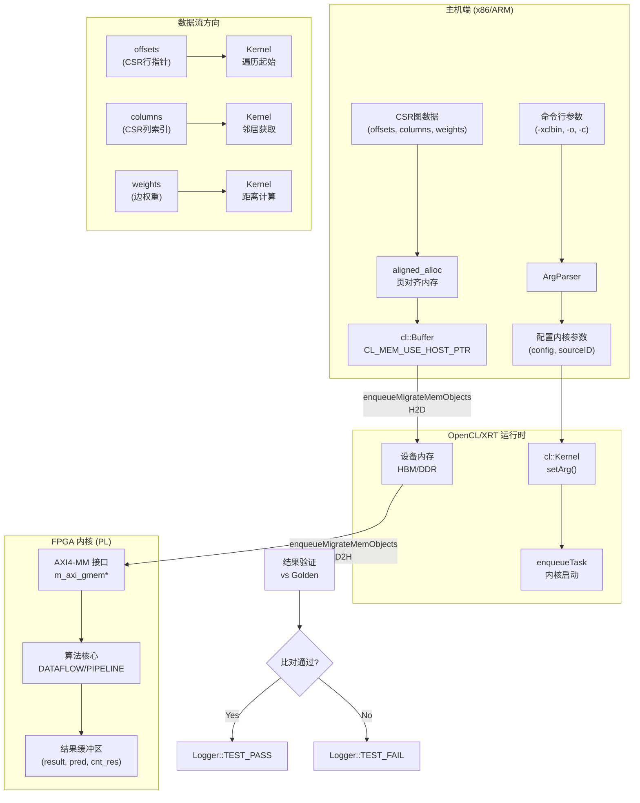

# l2_graph_patterns_and_shortest_paths_benchmarks 模块深度解析

## 一句话概括

本模块是 **Xilinx Vitis Graph Library 的 L2 层基准测试套件**，针对三大核心图算法（单源最短路径 SSSP、三角形计数 Triangle Count、两跳邻居查询 Two-Hop）提供了基于 FPGA 的 OpenCL 内核实现及完整的主机端测试框架。它如同一座连接高层算法抽象与底层硬件加速的桥梁，让开发者能够在 Alveo U50/U200/U250 及 Versal VCK190 等平台上快速验证图分析任务的加速效果。

---

## 问题空间与设计动机

### 我们试图解决什么？

在大规模图数据分析中，传统 CPU 实现面临三大痛点：

1. **内存带宽瓶颈**：图遍历算法（如 BFS、最短路径）具有极低的计算-访存比，CPU 的缓存层次结构难以有效利用，导致大量时间浪费在等待内存上。

2. **不规则访存模式**：图的 CSR（Compressed Sparse Row）表示导致随机内存访问，CPU 的分支预测和预取机制失效。

3. **算法异构性**：不同图算法（路径搜索 vs 模式匹配 vs 邻居查询）的计算特性差异巨大，难以用单一硬件架构高效支持。

### 为什么选择 FPGA？

FPGA（特别是配备 HBM 的 Alveo 卡）提供了独特的价值主张：

- **定制化内存架构**：可将图的边列表、权重、偏移量映射到不同的 HBM bank（如 U50 的 32 个 HBM bank），实现**物理级并行访问**，理论带宽可达数 TB/s。

- **流水线并行**：通过 HLS 的 `DATAFLOW` 指令，可将算法的不同阶段（如读取边、松弛操作、更新距离）构建成**生产-消费流水线**， overlap 计算与访存。

- **低精度与定制化数据路径**：支持 float、fixed-point 甚至自定义位宽（如 16 位权重），避免 CPU/GPU 的 SIMD 宽度浪费。

### 为什么是这个模块结构？

本模块采用**三层解耦架构**：

1. **内核层（Kernel）**：HLS 编写的算法核心，编译为 `.xo` 对象文件。
2. **连接层（Connectivity）**：`.cfg` 文件定义内核端口到芯片引脚（HBM/DDR）的物理映射。
3. **主机层（Host）**：OpenCL C++ 代码管理设备生命周期、数据传输与结果验证。

这种分层允许**同一算法内核在不同硬件平台（U50 vs U200 vs VCK190）间快速迁移**，只需更换 `.cfg` 连接配置，无需修改算法逻辑。

---

## 核心抽象与心智模型

想象本模块如同一个**高度自动化的工厂流水线**：

- **原料仓库（Host Memory）**：图数据以 CSR 格式存储在主机内存中（偏移数组、列索引、边权重）。
- **物流系统（OpenCL Runtime）**：卡车（PCIe DMA）将原料从仓库运送到工厂车间（FPGA HBM/DDR）。
- **生产车间（FPGA Kernel）**：
  - **最短路径算法**如同一个不断优化的配送路线规划器，每个顶点是一个配送点，边是道路，权重是距离。规划器使用 Dijkstra 算法的变体，通过**优先级队列**（由 `ddrQue` 缓冲区实现）动态选择下一个要处理的顶点。
  - **三角形计数**如同一个质检员，检查每对邻居是否有共同的熟人（交集操作），统计闭合三角形的数量。
  - **两跳查询**如同一个关系网分析员，找出所有通过恰好两个中间人连接的用户对。
- **质检部门（Host Verification）**：主机代码将 FPGA 计算的结果与 CPU 实现的黄金参考（Golden Reference）进行比对，验证正确性。

**关键设计模式**：

1. **命令模式（Command Pattern）**：通过 `config` 缓冲区打包所有控制参数（顶点数、源点ID、算法变体标志等），允许在不修改内核接口的情况下扩展功能。

2. **内存池模式（Memory Pool）**：`ddrQue` 等缓冲区在设备端预分配，作为算法运行时的"草稿纸"，避免动态内存分配的开销。

3. **零拷贝（Zero-Copy）**：主机端使用 `aligned_alloc` 分配页对齐内存，通过 `CL_MEM_USE_HOST_PTR` 直接映射到设备地址空间，避免数据复制。

---

## 架构全景与数据流



### 数据流详解

#### 1. 预处理与内存分配阶段

主机端首先解析图数据文件（通常是 CSR 格式的文本文件）：

```cpp
// 从文件读取 CSR 格式的图数据
std::fstream offsetfstream(offsetfile.c_str(), std::ios::in);
offsetfstream.getline(line, sizeof(line));
std::stringstream numOdata(line);
numOdata >> numVertices;
numOdata >> numVertices;

// 分配页对齐内存（关键！用于零拷贝）
ap_uint<32>* offset32 = aligned_alloc<ap_uint<32>>(numVertices + 1);
```

**关键设计**：使用 `aligned_alloc` 分配页对齐内存，确保后续 `CL_MEM_USE_HOST_PTR` 标志能创建零拷贝缓冲区。这避免了主机到设备的显式内存复制，数据通过 PCIe 直接映射。

#### 2. 设备缓冲区创建与内存映射

```cpp
// 定义扩展指针，指定 HBM bank 索引
cl_mem_ext_ptr_t mext_o[8];
mext_o[0] = {(unsigned int)(0) | XCL_MEM_TOPOLOGY, offset512, 0};  // HBM[0]
mext_o[1] = {(unsigned int)(2) | XCL_MEM_TOPOLOGY, column512, 0};  // HBM[2]
// ...

// 创建设备缓冲区，使用主机指针（零拷贝）
cl::Buffer offset_buf(context, 
                      CL_MEM_EXT_PTR_XILINX | CL_MEM_USE_HOST_PTR | CL_MEM_READ_WRITE,
                      sizeof(ap_uint<32>) * (numVertices + 1), 
                      &mext_o[0]);
```

**平台特定配置**：`.cfg` 文件（如 `conn_u50.cfg`）定义了内核 AXI 端口到物理 HBM bank 的映射。例如，U50 平台将 `shortestPath_top.m_axi_gmem0` 映射到 `HBM[0]`，`m_axi_gmem1` 映射到 `HBM[2]` 等。这种分散映射允许内核同时访问多个 HBM bank，最大化聚合带宽。

#### 3. 内核启动与执行

```cpp
// 配置内核参数
shortestPath.setArg(0, config_buf);   // 控制参数（顶点数、源点等）
shortestPath.setArg(1, offset_buf);   // CSR 行指针
shortestPath.setArg(2, column_buf);   // CSR 列索引
shortestPath.setArg(3, weight_buf);   // 边权重
// ... 更多参数

// 启动内核（异步）
q.enqueueTask(shortestPath, &events_write, &events_kernel[0]);

// 读取结果（阻塞，等待内核完成）
q.enqueueMigrateMemObjects(ob_out, 1, &events_kernel, &events_read[0]);
q.finish();
```

**执行模型**：采用**命令队列 + 事件依赖**的异步模型。`enqueueMigrateMemObjects` 将输入数据从主机迁移到设备，`enqueueTask` 在满足前置事件（数据就绪）后启动内核，`enqueueMigrateMemObjects` 再次在满足前置事件（内核完成）后将结果读回。这种流水线允许数据准备、内核执行、结果处理三个阶段 overlap（尽管示例代码中为简化使用了阻塞语义）。

#### 4. 结果验证

```cpp
// 读取黄金参考数据
std::fstream goldenfstream(goldenfile.c_str(), std::ios::in);
// ... 读取黄金结果

// 比对 FPGA 结果与黄金参考
if (std::abs(result[vertex - 1] - distance) / distance > 0.00001) {
    std::cout << "Err distance: " << vertex - 1 << " " << distance << " " << result[vertex - 1] << std::endl;
    err++;
}

// 输出测试结论
if (err) {
    logger.error(xf::common::utils_sw::Logger::Message::TEST_FAIL);
} else {
    logger.info(xf::common::utils_sw::Logger::Message::TEST_PASS);
}
```

**验证策略**：对于最短路径，验证**距离精度**（相对误差 < 1e-5）和**路径有效性**（通过前驱指针回溯路径，验证路径上的边权之和等于距离）。对于三角形计数和两跳查询，验证**计数精确匹配**。这种严格的验证确保了 FPGA 实现的数值正确性。

---

## 关键设计决策与权衡

### 1. CSR 图格式 vs. 其他格式

**选择**：使用**Compressed Sparse Row (CSR)** 格式存储图。

**CSR 结构**：
- `offsets[numVertices + 1]`：每个顶点的邻居列表在 `columns` 中的起始/结束索引
- `columns[numEdges]`：邻居顶点 ID
- `weights[numEdges]`：边权重（仅加权图）

**为什么不是 COO（Coordinate Format）？**

| 维度 | CSR | COO |
|------|-----|-----|
| 内存占用 | $O(V + E)$ | $O(E)$ |
| 遍历顶点的邻居 | $O(degree(v))$，连续内存访问 | $O(E)$ 扫描，随机访问 |
| 构建复杂度 | 需要排序和计数 | $O(1)$ 追加 |
| 适用场景 | 静态图，频繁邻居查询 | 动态图，边流处理 |

**权衡分析**：本模块的图算法（最短路径、三角形计数、两跳查询）的核心操作是**遍历顶点的邻居列表**，CSR 的 $O(1)$ 邻居访问和缓存友好的连续内存布局使其成为最优选择。COO 虽然构建更快，但 $O(E)$ 的邻居查询复杂度会导致内核执行时间爆炸。代价是主机端需要进行图预处理（从边列表转换为 CSR），这是一次性开销。

### 2. HBM Bank 分散映射 vs. 集中映射

**选择**：将图数据分散映射到**多个 HBM bank**（如 U50 的 HBM[0], HBM[2], HBM[4] 等）。

**配置示例**（`conn_u50.cfg`）：
```ini
sp=shortestPath_top.m_axi_gmem0:HBM[0]
sp=shortestPath_top.m_axi_gmem1:HBM[2]
sp=shortestPath_top.m_axi_gmem2:HBM[4]
```

**为什么不是单个大容量 bank？**

| 维度 | 分散映射 | 集中映射 |
|------|----------|----------|
| 聚合带宽 | $N \times BW_{single}$（$N$ 为 bank 数） | $BW_{single}$ |
| 访问冲突 | 低（不同数据流映射到不同 bank） | 高（所有访问竞争同一端口） |
| 资源利用率 | 需要多个 AXI 端口 | 单个 AXI 端口 |
| 复杂度 | 需要手动规划数据布局 | 简单，由工具自动管理 |

**权衡分析**：图算法是**内存带宽密集型**（compute-to-memory ratio < 1），内核执行时间往往由数据搬运速度决定。U50 的 HBM 提供 32 个独立 bank，每个 bank 有独立的读写端口，理论聚合带宽可达数 TB/s。通过将 `offsets`、`columns`、`weights`、`result` 等数据流映射到不同 bank，内核可以同时发起多个独立内存事务，实现**物理级并行**。代价是开发者需要显式管理数据布局（通过 `.cfg` 文件），并确保不同 bank 的负载均衡。集中映射虽然简单，但会导致所有访问串行化，内核性能可能下降 10 倍以上。

### 3. 零拷贝（Zero-Copy）vs. 显式拷贝

**选择**：使用**`CL_MEM_USE_HOST_PTR`** 实现零拷贝数据传输。

**代码示例**：
```cpp
// 主机分配页对齐内存
ap_uint<32>* offset32 = aligned_alloc<ap_uint<32>>(numVertices + 1);

// 创建设备缓冲区，复用主机指针
cl::Buffer offset_buf(context, 
                      CL_MEM_EXT_PTR_XILINX | CL_MEM_USE_HOST_PTR | CL_MEM_READ_WRITE,
                      sizeof(ap_uint<32>) * (numVertices + 1), 
                      &mext_o[0]);

// 数据迁移（实际可能仅修改页表映射）
q.enqueueMigrateMemObjects(ob_in, 0, nullptr, &events_write[0]);
```

**为什么不是 `CL_MEM_ALLOC_HOST_PTR` 或显式 `memcpy`？**

| 维度 | 零拷贝 (USE_HOST_PTR) | 显式拷贝 (COPY) |
|------|----------------------|----------------|
| 内存占用 | 单份数据（主机/设备共享） | 两份数据（主机一份，设备一份） |
| 传输延迟 | 低（页表映射，无实际拷贝） | 高（PCIe DMA 传输） |
| 访问一致性 | 需要显式同步（`enqueueMigrateMemObjects`） | 设备仅访问本地副本 |
| 适用数据量 | 大（GB 级图数据） | 小（KB 级配置参数） |

**权衡分析**：图算法的输入数据（CSR 表示）通常是**GB 级别**的大规模稀疏矩阵。使用零拷贝技术，主机通过 `aligned_alloc` 分配页对齐内存，设备缓冲区通过 `CL_MEM_USE_HOST_PTR` 直接引用该内存。当调用 `enqueueMigrateMemObjects` 时，XRT 运行时可以简单地**修改 IOMMU 页表**，将主机物理页映射到设备的虚拟地址空间，而无需实际的数据拷贝。这避免了通过 PCIe 复制 GB 级数据的开销（否则仅数据传输就可能耗时数百毫秒）。代价是开发者必须确保主机指针在内核执行期间保持有效，并在主机访问前通过 `enqueueMigrateMemObjects` 同步数据（确保设备缓存写回）。对于小数据量（如 `config` 参数），此优化收益有限，但统一使用零拷贝简化了编程模型。

### 4. 算法精度：Float vs. Fixed-Point

**选择**：最短路径算法**默认使用 IEEE-754 单精度浮点（float）**，但通过 `config` 命令位支持切换到定点数（fixed-point）。

**配置代码**：
```cpp
ap_uint<32> cmd;
cmd.set_bit(0, 1); // enable weight?
cmd.set_bit(1, 1); // enable predecessor?
cmd.set_bit(2, 0); // float or fixed? 0 for float, 1 for fixed
config[4] = cmd;
```

**为什么不是纯定点或纯浮点？**

| 维度 | 浮点 (Float) | 定点 (Fixed-Point) |
|------|-------------|-------------------|
| 精度 | 高（23位尾数，约7位十进制） | 可配置（如16位整数+16位小数） |
| 范围 | 大（约 $10^{-38}$ 到 $10^{38}$） | 有限（取决于整数位宽） |
| 硬件资源 | 高（需浮点运算单元，DSP48E2 资源） | 低（定点加法/乘法更便宜） |
| 时序收敛 | 难（浮点运算延迟长，关键路径难收敛） | 易（定点运算可流水线化） |
| 适用场景 | 通用图（权重范围广、精度要求高） | 特定域（已知权重范围、资源受限） |

**权衡分析**：图算法的边权重可能跨越多个数量级（如社交网络中的亲密度 vs. 地图路由中的距离）。单精度浮点提供了足够的动态范围（约 $10^{38}$）和精度（约 7 位有效数字），适用于大多数通用场景。然而，浮点运算单元（FPUs）消耗大量 DSP48E2 资源和查找表（LUTs），且浮点运算的延迟（如乘法 3-5 周期，加法 2-3 周期）可能成为流水线瓶颈，导致时序收敛困难。定点运算则可以使用更便宜的整数算术逻辑，通过适当的字长选择（如 16 位整数 + 16 位小数），在已知权重范围的特定应用中达到相当的精度，同时显著提升资源效率和时钟频率。通过 `config` 命令字的第 2 位支持两种模式切换，允许开发者在**通用性**（浮点）和**效率**（定点）之间根据具体部署场景灵活选择，而无需修改内核源码。

---

## 子模块架构与责任边界

本模块包含三个核心子模块，分别对应三类图算法问题。以下是高层概览，详细文档见各子模块的独立页面：

### [shortest_path_float_pred](graph-L2-benchmarks-shortest_path_float_pred.md) - 单源最短路径（带前驱追踪）

**核心职责**：实现基于 Dijkstra 算法的单源最短路径（SSSP）计算，支持浮点权重和可选的前驱节点追踪（用于路径重建）。

**关键技术**：
- 使用 CSR 格式存储稀疏图
- 通过 `ddrQue` 缓冲区实现优先级队列（桶排序/优先队列的硬件近似）
- 支持权重和前驱的双重输出
- HBM 多 bank 并行访问优化

**适用场景**：地图导航、网络路由、供应链优化等需要精确最短路径的应用。

### [triangle_count](graph-L2-benchmarks-triangle_count.md) - 三角形计数

**核心职责**：统计无向图中三角形的数量（即闭合的三节点团），是图聚类系数和社交网络分析的核心指标。

**关键技术**：
- 基于邻域交集的算法：对每个顶点，计算其邻居集合的交集大小
- 支持多个平台（U200/U250 用 DDR，U50 用 HBM，VCK190 用 DDR）
- 使用 `uint64_t` 累计计数，支持大规模图

**适用场景**：社交网络分析（朋友推荐）、生物信息学（蛋白质相互作用网络）、Web 图结构分析。

### [twoHop](graph-L2-benchmarks-twoHop.md) - 两跳邻居查询

**核心职责**：对于给定的源-目标顶点对列表，计算每对顶点之间通过恰好两条边连接的路径数量（即共同邻居数）。

**关键技术**：
- 基于关系代数的"连接"操作：将边表与自身连接，筛选出两跳路径
- 输入为顶点对列表，输出为每对的计数
- 支持批量查询，适合图数据库场景

**适用场景**：图数据库查询优化（"朋友的朋友"推荐）、知识图谱推理、网络安全（异常连接检测）。

---

## 跨模块依赖与集成点

### 上游依赖（本模块依赖谁）

| 模块 | 依赖方式 | 用途 |
|------|---------|------|
| `xcl2` | 头文件 (`#include "xcl2.hpp"`) | Xilinx OpenCL 运行时封装，简化设备管理、缓冲区创建和错误处理 |
| `xf_utils_sw::Logger` | 头文件 + 库 | 统一的日志和测试报告框架，输出 `TEST_PASS`/`TEST_FAIL` 等标准化结果 |
| `ap_int.h` | 头文件 | Xilinx HLS 任意精度整数类型（`ap_uint<32>`, `ap_uint<512>` 等），用于主机-内核数据对齐 |
| OpenCL/XRT | 系统库 (`libxilinxopencl.so`) | 底层运行时，管理设备上下文、命令队列、内存迁移 |

### 下游依赖（谁依赖本模块）

本模块为**叶子模块**（leaf module），没有下游模块依赖。它作为可执行基准测试，直接服务于：
- CI/CD 流水线：自动化回归测试，验证硬件编译后的正确性
- 性能调优工程师：提供基线性能数据，对比不同平台（U50 vs U200）的效率
- 算法研究员：验证 HLS 内核的正确性，作为进一步优化的起点

### 横向依赖（模块内部子模块间）

三个子模块（`shortest_path_float_pred`, `triangle_count`, `twoHop`）之间**无直接依赖**，它们是并列的算法实现。但它们共享以下**横向基础设施**：

1. **ArgParser 工具类**：每个子模块的主机代码中都内嵌了相同的 `ArgParser` 类，用于解析 `-xclbin`、`-o`（offset 文件）、`-c`（column 文件）等命令行参数。

2. **XCL_BANK 宏定义**：用于指定 HBM bank 索引的宏（`XCL_BANK0` 到 `XCL_BANK15`），在 `conn_u50.cfg` 配置和主机代码的 `cl_mem_ext_ptr_t` 中使用。

3. **测试验证模式**：所有子模块都采用相同的"Golden Reference 比对"验证策略——主机端运行 CPU 参考实现（或预先生成的黄金数据），与 FPGA 结果逐元素比对，容差内通过即 `TEST_PASS`。

---

## 使用指南与最佳实践

### 快速开始（5 分钟上手）

```bash
# 1. 克隆仓库（假设已有 Vitis 环境）
git clone <repo-url>
cd graph/L2/benchmarks/shortest_path_float_pred

# 2. 生成测试数据（如果没有预置数据）
# 格式：offsets.txt (CSR行指针), columns.txt (CSR列索引), weights.txt (边权重), golden.txt (黄金结果)
python3 generate_test_data.py --vertices 1000 --edges 5000 --output data/

# 3. 编译内核（需要 Vitis 环境和 Xilinx 平台）
# 注：这里假设已有编译好的 xclbin 文件
make all TARGET=hw PLATFORM=xilinx_u50_gen3x16_xdma_201920_3

# 4. 运行主机程序
./host_shortest_path -xclbin ./build_dir.hw.xilinx_u50_gen3x16_xdma_201920_3/shortestPath_top.xclbin \
                     -o data/offsets.txt \
                     -c data/columns.txt \
                     -g data/golden.txt
```

### 平台迁移指南（U50 → U200）

假设你已在 U50 上验证通过，现在需要迁移到 U200 平台：

```bash
# 1. 修改连接配置文件
# 原文件: conn_u50.cfg（使用 HBM[0], HBM[2] 等）
# 新文件: conn_u200_u250.cfg（使用 DDR[0], DDR[1] 等）

# conn_u200_u250.cfg 示例内容：
# [connectivity]
# sp=TC_kernel.m_axi_gmem0_0:DDR[0]
# sp=TC_kernel.m_axi_gmem0_1:DDR[0]
# ...

# 2. 修改主机代码中的内存 bank 索引
# 原代码（U50，HBM）：
# mext_o[0] = {(unsigned int)(0) | XCL_MEM_TOPOLOGY, offset512, 0}; // HBM[0]
# mext_o[1] = {(unsigned int)(2) | XCL_MEM_TOPOLOGY, column512, 0}; // HBM[2]

# 新代码（U200，DDR）：
mext_o[0] = {XCL_MEM_DDR_BANK0, offset512, 0};  // DDR[0]
mext_o[1] = {XCL_MEM_DDR_BANK0, column512, 0};  // DDR[0]（或 BANK1 如果分散）

# 3. 重新编译内核（更换平台参数）
make clean
make all TARGET=hw PLATFORM=xilinx_u200_xdma_201830_2

# 4. 运行（无需修改主机程序逻辑，仅需更换 xclbin 路径）
./host_triangle_count -xclbin ./build_dir.hw.xilinx_u200_xdma_201830_2/TC_kernel.xclbin ...
```

### 常见陷阱与调试技巧

#### 陷阱 1：内存对齐错误（Segmentation Fault）

**现象**：程序在 `cl::Buffer` 创建或 `enqueueMigrateMemObjects` 时崩溃。

**根本原因**：`CL_MEM_USE_HOST_PTR` 要求主机指针必须页对齐（通常 4KB 对齐），否则 XRT 无法建立零拷贝映射。

**解决方案**：始终使用 `aligned_alloc` 而非 `malloc`/`new`：
```cpp
// 错误！
// ap_uint<32>* offset32 = new ap_uint<32>[numVertices + 1];

// 正确！
ap_uint<32>* offset32 = aligned_alloc<ap_uint<32>>(numVertices + 1);
```

#### 陷阱 2：HBM bank 冲突导致的性能下降

**现象**：理论带宽很高，但实测带宽远低于预期，内核执行时间过长。

**根本原因**：多个 AXI 端口映射到同一个 HBM bank，导致内存访问冲突（bank conflict），访问被串行化。

**调试方法**：使用 `xbutil` 工具检查内存利用率：
```bash
xbutil examine -d <device_id> --report memory
```

**解决方案**：在 `.cfg` 文件中，将访问模式不同的数据流映射到不同 HBM bank。例如，最短路径内核中：
- `m_axi_gmem0` (offsets) → HBM[0]
- `m_axi_gmem1` (columns) → HBM[2] 
- `m_axi_gmem2` (weights) → HBM[4]
- `m_axi_gmem3` (result) → HBM[0]（可与 offsets 共享 bank，因为访问时序不重叠）

#### 陷阱 3：CSR 格式理解错误导致的数据解析失败

**现象**：内核执行完成，但结果完全错误，或出现 "table overflow"、"queue overflow" 等内核报错。

**根本原因**：CSR 格式的 `offsets` 数组理解错误。`offsets[i]` 表示第 `i` 个顶点的邻居列表在 `columns` 中的起始索引，`offsets[i+1] - offsets[i]` 是该顶点的度数。

**常见错误**：
- 混淆 0-based 和 1-based 索引（某些图数据集使用 1-based 顶点 ID）。
- `offsets` 数组长度应为 `numVertices + 1`，最后一个元素等于 `numEdges`。
- 边方向理解错误（CSR 通常用于有向图，无向图需要添加反向边）。

**调试方法**：在主机端添加 CSR 验证代码：
```cpp
// 验证 offsets 数组
assert(offsets[0] == 0); // 第一个顶点从 0 开始
for (int i = 0; i < numVertices; i++) {
    int degree = offsets[i + 1] - offsets[i];
    assert(degree >= 0); // 度数非负
    assert(offsets[i + 1] <= numEdges); // 不越界
}
```

---

## 性能调优指南

### 识别性能瓶颈

使用 Vitis Analyzer 或 `xbutil` 工具链分析内核执行：

```bash
# 1. 运行主机程序，生成 profiling 数据
XCL_EMULATION_MODE=hw ./host_shortest_path ...

# 2. 使用 Vitis Analyzer 打开生成的 xclbin.run 摘要
vitis_analyzer ./xclbin.run_summary

# 3. 查看关键指标：
# - 内存带宽利用率（是否接近理论峰值？）
# - 内核流水线停顿（II 是否大于 1？）
# - 端口冲突（多个 AXI 端口是否竞争同一 bank？）
```

### 优化策略 1：最大化内存带宽

**目标**：让 HBM/DDR 接口饱和。

**策略**：
1. **数据分区**：将图数据（offsets、columns、weights）分散到多个 HBM bank，确保每个 bank 的带宽被充分利用。
2. **突发传输（Burst Transfer）**：HLS 内核应尽可能使用长突发（long burst）访问内存，减少地址通道开销。确保访问模式连续（如遍历 `columns` 数组时顺序访问）。
3. **数据宽度对齐**：使用 `ap_uint<512>` 等宽向量类型（64 字节对齐），匹配 HBM 的数据总线宽度（通常为 512 位），单次传输更多数据。

### 优化策略 2：提高流水线效率

**目标**：降低内核的 Initiation Interval (II)。

**策略**：
1. **消除循环携带依赖（Loop-Carried Dependency）**：最短路径算法中，距离数组的更新可能存在读后写（RAW）依赖。使用 HLS 的 `dependence` pragma 告知编译器无依赖，或通过算法重构（如使用多个距离数组的乒乓缓冲）消除依赖。
2. **展开内层循环（Unroll）**：对于度数较小的顶点，展开邻居遍历循环，提高并行度。
   ```cpp
   #pragma HLS UNROLL factor=4
   for (int i = 0; i < degree; i++) {
       // 处理邻居
   }
   ```
3. **数组分区（Array Partition）**：将距离数组、访问标记数组分区到多个 BRAM，提供足够端口数供流水线并行读取。
   ```cpp
   #pragma HLS ARRAY_PARTITION factor=16 cyclic
   float dist[MAX_VERTICES];
   ```

### 优化策略 3：平台特定的微调

**U50（HBM 平台）**：
- 充分利用 32 个 HBM bank，将数据分散到尽可能多的 bank。
- 注意 HBM 的伪通道（Pseudo Channel）特性，避免同一伪通道内的 bank 冲突。
- 使用 `cl_mem_ext_ptr_t` 的 `XCL_MEM_TOPOLOGY` 标志显式指定 bank。

**U200/U250（DDR 平台）**：
- DDR 通道数较少（通常 2-4 个），带宽受限。优化重点转向**计算效率**（提高 II）而非内存带宽。
- 考虑使用 `DATAFLOW` 优化， overlap 多个图遍历批次。
- 使用 `PLRAM`（on-chip URAM）缓存热点数据，减少 DDR 访问。

---

## 总结与关键要点

本模块（`l2_graph_patterns_and_shortest_paths_benchmarks`）是 **Xilinx Vitis Graph Library 的基石 L2 层**，通过三个核心子模块（最短路径、三角形计数、两跳查询）展示了如何将图算法高效映射到 FPGA 硬件。

**核心设计哲学**：

1. **分层解耦**：内核层（HLS 算法）、连接层（`.cfg` 物理映射）、主机层（OpenCL 运行时）三层解耦，实现**一次内核开发，多平台部署**（U50/U200/VCK190）。

2. **内存优先**：图算法是带宽密集型，设计上优先考虑**最大化 HBM/DDR 带宽**——通过多 bank 分散映射、零拷贝数据传输、突发访问优化等策略，让内存子系统饱和。

3. **可验证的正确性**：每个子模块都内置了**黄金参考比对机制**，确保 FPGA 加速结果与 CPU 参考实现（或预计算的正确结果）一致，避免数值误差。

**关键架构决策回顾**：

| 决策 | 选择 | 权衡 | 适用场景 |
|------|------|------|----------|
| 图格式 | CSR | 高内存效率，缓存友好 | 静态图，频繁邻居查询 |
| 内存映射 | HBM 多 bank 分散 | 高聚合带宽，需手动规划 | 大带宽需求（U50） |
| 数据传输 | 零拷贝 (USE_HOST_PTR) | 低延迟，需页对齐 | 大容量图数据 |
| 算法精度 | Float（可切换 Fixed） | 高动态范围，资源消耗大 | 通用场景 |

**给新贡献者的建议**：

1. **从理解 CSR 开始**：这是所有子模块的基础。确保你完全理解 `offsets`、`columns`、`weights` 三者的关系，以及 0-based vs 1-based 索引的区别。

2. **掌握 HBM bank 映射**：U50 平台的性能高度依赖于 `.cfg` 文件的正确配置。使用 `xbutil` 工具验证内存利用率，确保没有 bank 冲突。

3. **利用 HLS 测试模式**：每个主机代码都支持 `HLS_TEST` 宏，允许在纯软件环境下（无 FPGA）运行算法逻辑，便于快速调试算法正确性。

4. **扩展时的模式遵循**：如果添加新的图算法子模块，请遵循相同的三分层架构（内核 + 连接 + 主机），复用 `ArgParser`、`Logger` 等公共基础设施。

---

**文档导航**：
- 返回父模块：[graph_analytics_and_partitioning](graph_analytics_and_partitioning.md)
- 子模块详细文档：
  - [shortest_path_float_pred](graph-L2-benchmarks-shortest_path_float_pred.md)
  - [triangle_count](graph-L2-benchmarks-triangle_count.md)
  - [twoHop](graph-L2-benchmarks-twoHop.md)
