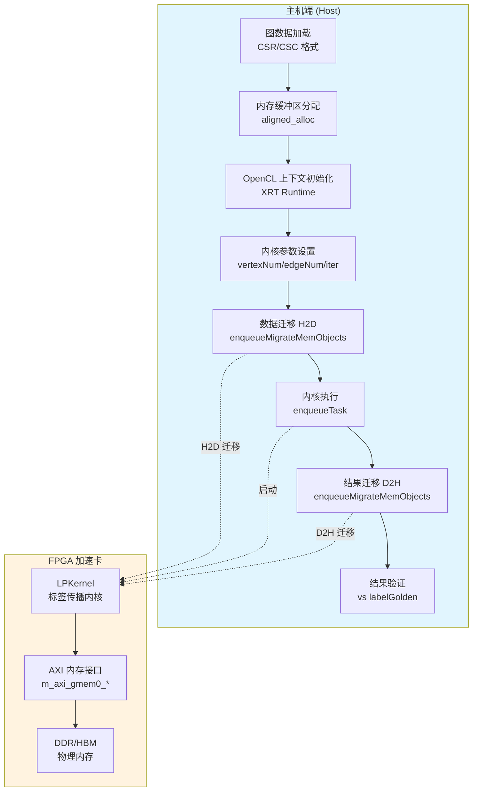

# Label Propagation Benchmarks 模块深度解析

## 概述：图神经网络的原子操作

想象你正在参加一场巨大的"意见传播"游戏：每个人初始时持有一种颜色的标签，每一轮中，每个人都会观察周围邻居最流行的颜色，然后改变自己的颜色去追随大多数人。经过足够多的轮次后，拥有相同颜色的人自然会聚集成社区——这就是**标签传播算法（Label Propagation）**的本质。

在 FPGA 加速的图分析领域，标签传播是社区发现（Community Detection）的基石算法。本模块 `label_propagation_benchmarks` 提供了一个**多平台基准测试框架**，用于在 Xilinx Alveo（U200/U250/U50）和 Versal（VCK190）加速卡上评估标签传播内核的性能。它不仅仅是一个测试工具，更是连接算法理论、硬件架构和实际部署的桥梁。

本模块的核心价值在于：
1. **平台抽象**：通过不同的 connectivity 配置文件，同一套内核代码可以无缝适配 DDR-based（U200/U250/VCK190）和 HBM-based（U50）内存架构
2. **双缓冲策略**：利用 CSR（Compressed Sparse Row）和 CSC（Compressed Sparse Column）两种图表示，实现高效的邻居遍历
3. **Ping-Pong 标签更新**：通过两个标签缓冲区的交替读写，避免数据竞争，同时最大化内存访问并行度

---

## 架构全景：从主机到内核的数据流

### 数据流详解

整个基准测试的执行流程如同一条精心编排的流水线，分为**主机端准备**、**FPGA 内核执行**和**结果验证**三个阶段：

#### 阶段 1：主机端准备（图的预处理与内存分配）

1. **图数据加载**：从文件系统读取图数据，构建 **CSR（Compressed Sparse Row）** 和 **CSC（Compressed Sparse Column）** 两种表示。CSR 用于快速遍历出边（out-neighbors），CSC 用于快速遍历入边（in-neighbors）——在标签传播中，每个顶点需要知道其所有邻居的标签，双格式支持确保内存访问的连续性。

2. **内存缓冲区分配**：使用 `aligned_alloc<DT>()` 为主机端内存分配对齐的缓冲区。关键缓冲区包括：
   - `offsetsCSR` / `columnsCSR`：CSR 格式的偏移和列索引
   - `offsetsCSC` / `rowsCSC`：CSC 格式的偏移和行索引  
   - `labelPing` / `labelPong`：**Ping-Pong 双缓冲**，交替存储当前和下一轮的标签
   - `bufPing` / `bufPong`：临时工作缓冲区
   - `labelGolden`：用于验证的黄金标准结果

3. **XRT 运行时初始化**：创建 OpenCL 上下文、命令队列和程序对象，从 `.xclbin` 文件加载 FPGA 比特流。启用性能分析（`CL_QUEUE_PROFILING_ENABLE`）和无序执行模式（`CL_QUEUE_OUT_OF_ORDER_EXEC_MODE_ENABLE`）以最大化吞吐。

#### 阶段 2：FPGA 内核执行（标签传播加速）

4. **设备缓冲区创建**：通过 `cl::Buffer` 和 `cl_mem_ext_ptr_t` 将主机缓冲区映射到 FPGA 的 AXI 内存接口。每个缓冲区通过扩展指针指定其在 FPGA 物理内存中的位置（DDR bank 或 HBM channel）。

5. **数据迁移（H2D）**：`enqueueMigrateMemObjects` 将 CSR/CSC 图数据从主机内存异步传输到 FPGA 设备内存。这是流水线中的第一个同步点。

6. **内核启动**：配置 `LPKernel` 参数（`vertexNum`, `edgeNum`, `iter` 等）并调用 `enqueueTask`。FPGA 内核开始执行标签传播算法，利用并行流水线处理顶点更新。

7. **数据迁移（D2H）**：内核完成后，`enqueueMigrateMemObjects` 将结果标签从设备内存读回主机。这是第二个同步点，标志计算完成。

#### 阶段 3：结果验证与性能分析

8. **正确性验证**：将 FPGA 计算结果与 `labelGolden` 逐顶点比较。任何不匹配都会输出详细的诊断信息（顶点 ID、度数、计算标签、期望标签），便于调试内核逻辑。

9. **性能剖析**：从 OpenCL 事件对象中提取详细的性能指标：
   - **H2D 传输时间**：主机到设备的数据迁移耗时
   - **内核执行时间**：FPGA 实际计算耗时
   - **D2H 传输时间**：设备到主机的数据迁移耗时
   - **端到端延迟**：包含所有开销的总执行时间

---

## 核心组件与子模块

本模块由三个紧密协作的子模块构成，每个子模块负责特定的平台抽象或功能域：

### 1. Alveo 内核连接配置（`alveo_kernel_connectivity_profiles`）

针对 **Alveo 数据中心加速卡**（U200、U250、U50）的连接配置文件集合，定义了 `LPKernel` 的 AXI 内存接口到物理内存子系统的映射关系。

**关键设计决策**：
- **U200/U250（DDR 架构）**：使用 8 个独立的 DDR bank（`DDR[0]`），每个 AXI 接口绑定到同一个 bank，适合延迟敏感但带宽需求适中的场景
- **U50（HBM 架构）**：利用 16 个 HBM 通道（`HBM[0:15]`）的并发访问能力，将不同的 AXI 接口分散到独立的通道对，最大化聚合带宽

[详细文档 →](graph-L2-benchmarks-label_propagation_benchmarks-alveo_kernel_connectivity_profiles.md)

### 2. Versal VCK190 连接配置（`vck190_kernel_connectivity_profile`）

针对 **Versal VCK190 评估平台** 的连接配置文件，适配 DDR 内存架构。VCK190 代表了从传统 Alveo 向自适应计算加速平台（ACAP）的演进，本配置简化了内存接口映射，适用于边缘推理和嵌入式图分析场景。

[详细文档 →](graph-L2-benchmarks-label_propagation_benchmarks-vck190_kernel_connectivity_profile.md)

### 3. 主机基准测试与计时结构（`host_benchmark_timing_structs`）

包含主机端基准测试应用的核心实现（`main.cpp`），负责图数据加载、XRT 运行时管理、内核执行编排和性能计时。该子模块定义了端到端测试流程，包括：

- **图数据解析**：CSR/CSC 双格式构建
- **内存管理**：对齐分配与设备缓冲区映射
- **OpenCL/XRT 编排**：命令队列、内核启动、事件同步
- **计时与验证**：`timeval` 结构用于 wall-clock 计时，OpenCL profiling 用于精确内核性能分析

[详细文档 →](graph-L2-benchmarks-label_propagation_benchmarks-host_benchmark_timing_structs.md)

---

## 设计权衡与架构决策

### 1. 内存架构选择：DDR vs HBM

**权衡**：U200/U250 使用 DDR4，U50 使用 HBM2

**决策依据**：
- **DDR 方案**：延迟较低（~80ns），适合随机访问密集的图遍历。但带宽受限（~77GB/s 聚合），成为大规模图处理的瓶颈。
- **HBM 方案**：提供超高带宽（~460GB/s），适合带宽密集型的大规模图分析。但访问延迟较高，且需要精心设计数据布局以避免 channel 冲突。

本模块通过不同的 connectivity 配置文件，让同一内核逻辑无缝适配两种架构，用户可根据图规模和工作负载特征选择合适平台。

### 2. CSR + CSC 双格式：空间换时间的经典权衡

**权衡**：存储开销翻倍 vs 访问模式优化

**决策依据**：
标签传播算法中，每个顶点需要读取其所有邻居的标签。如果只存储 CSR，遍历出边高效，但遍历入边需要全图扫描。通过同时维护 CSR 和 CSC，我们确保无论邻居方向如何，都能实现 O(degree) 的连续内存访问，而非 O(V+E) 的全局扫描。

**成本**：内存占用翻倍（约 2×(V+E)×sizeof(DT)），但对于现代 FPGA 加速卡的 GB 级内存容量，这是可接受的权衡。

### 3. Ping-Pong 双缓冲：避免读写冲突

**权衡**：内存占用翻倍 vs 无锁并行更新

**决策依据**：
标签传播是迭代算法，每轮更新必须基于上一轮的全局一致状态。如果使用单缓冲区，读写竞争会导致非确定性结果（某些顶点看到旧标签，某些看到新标签）。通过 `labelPing` 和 `labelPong` 交替作为读写目标，我们确保每轮迭代的原子性：读自一个缓冲区，写入另一个，完成后交换角色。

这种设计消除了对顶点级同步原语的需求，允许 FPGA 内核以最大并行度流水线执行，同时保证算法正确性。

### 4. 平台配置分离：可移植性 vs 维护复杂度

**权衡**：代码重复（多个 .cfg 文件）vs 平台特定优化

**决策依据**：
不同 FPGA 平台的物理内存架构差异显著（DDR bank 数量、HBM channel 配置、SLR 布局）。通过为每个平台维护独立的 `.cfg` 文件，我们可以精确控制：
- AXI 接口到物理内存端口的映射
- SLR（Super Logic Region）分配，确保内核靠近其访问的内存控制器
- HBM channel 交错策略，最大化带宽利用率

这种显式配置牺牲了一定的维护便利性（修改接口需要更新多个文件），换取了跨平台的最优性能。

---

## 新贡献者必读：陷阱与最佳实践

### 1. 内存对齐要求

**陷阱**：`aligned_alloc` 分配的主机内存必须按页对齐（通常 4KB），否则 `cl::Buffer` 创建失败或性能暴跌。

**最佳实践**：始终使用 `aligned_alloc<DT>(size)` 而非裸 `malloc`，并确保 `size` 是页大小的整数倍。

### 2. 图数据格式契约

**陷阱**：输入文件必须是严格的文本格式，第一行是顶点数/边数，后续每行一个整数。任何格式偏差（如空行、注释）会导致 `std::stringstream` 解析错误，产生未定义行为。

**最佳实践**：在加载前验证文件头，使用更健壮的解析器（如内存映射 + 自定义快速解析器）处理大规模图。

### 3. HBM Channel 冲突（U50 平台）

**陷阱**：U50 的 `conn_u50.cfg` 将 9 个 AXI 接口映射到 16 个 HBM 通道。如果内核访问模式导致多个接口同时访问同一 channel，会发生 bank conflict，带宽骤降。

**最佳实践**：分析内核的内存访问模式，确保热点数据均匀分布在不同 channel。必要时调整 `.cfg` 中的 `sp=` 映射关系。

### 4. Ping-Pong 缓冲区交换逻辑

**陷阱**：主机代码中的 `if (iter % 2)` 决定从 `labelPing` 还是 `labelPong` 读取最终结果。如果内核实际执行的迭代次数与主机预期不符（如内核提前收敛），验证逻辑会检查错误的缓冲区。

**最佳实践**：确保内核和主机对迭代次数的理解一致，或使用显式的完成标志而非奇偶判断。

### 5. XCL_BIN 与平台匹配

**陷阱**：`.xclbin` 文件是针对特定平台（U200 vs U50 vs VCK190）编译的。加载错误的比特流会导致硬件初始化失败或静默的数据损坏。

**最佳实践**：在 `main.cpp` 中通过 `device.getInfo<CL_DEVICE_NAME>()` 检查设备型号，与 `xclbin` 元数据交叉验证，拒绝不匹配的组合。

---

## 跨模块依赖关系

本模块在更广泛的图分析生态系统中扮演"原子基准"的角色，与以下模块存在交互或概念继承关系：

### 上游依赖（输入/控制流）

- **[graph_analytics_and_partitioning](../graph_analytics_and_partitioning/graph_analytics_and_partitioning.md)**：本模块是其 L2 层（kernel-level）基准测试的具体实现。`label_propagation_benchmarks` 依赖于 L2 层的通用基础设施（如 host 端 timing utilities、logger 框架），并特化为标签传播算法。

- **[l3_openxrm_algorithm_operations](../graph_analytics_and_partitioning/l3_openxrm_algorithm_operations/l3_openxrm_algorithm_operations.md)**：在更高层次的抽象中，标签传播作为 `op_labelpropagation` 操作被封装。本模块的基准测试结果直接支撑 L3 层对算法性能的建模和优化决策。

### 同级交互（数据/配置流）

- **connected_component_benchmarks** / **maximal_independent_set_benchmarks** / **strongly_connected_component_benchmarks**：这些同级模块共享相同的代码结构和设计模式（`main.cpp` 模板、`.cfg` 配置语法、XRT 运行时封装）。本模块的设计决策（如 ping-pong buffering、双 CSR/CSC 格式）往往作为最佳实践被其他图算法基准复用或参考。

### 子模块文档

本模块包含三个子模块，分别负责平台特定的连接配置和主机端测试编排：

- **[Alveo 内核连接配置](graph_analytics_and_partitioning-l2_connectivity_and_labeling_benchmarks-label_propagation_benchmarks-alveo_kernel_connectivity_profiles.md)**：涵盖 U200/U250（DDR）和 U50（HBM）平台的 connectivity 配置，定义 AXI 接口到物理内存的映射策略。

- **[Versal VCK190 连接配置](graph_analytics_and_partitioning-l2_connectivity_and_labeling_benchmarks-label_propagation_benchmarks-vck190_kernel_connectivity_profile.md)**：针对 Versal VCK190 平台的 DDR-based connectivity 配置，支持自适应计算加速平台（ACAP）架构。

- **[主机基准测试与时序结构](graph_analytics_and_partitioning-l2_connectivity_and_labeling_benchmarks-label_propagation_benchmarks-host_benchmark_timing_structs.md)**：主机端基准测试应用的核心实现，包括图数据加载、XRT 运行时管理、Ping-Pong 缓冲区管理和性能计时分析。

### 下游影响（输出/验证流）

- **community_detection_louvain_partitioning**：在更高层的社区发现流程中，标签传播常作为预处理步骤或对比基线。本模块的基准数据用于验证更复杂 Louvain 算法的加速比和精度权衡。

---

## 总结：为什么这个模块重要

`label_propagation_benchmarks` 不仅仅是一个测试程序——它是 **FPGA 图计算的"金丝雀"**。当硬件团队推出新的内存架构（如从 DDR 迁移到 HBM）、当编译器团队优化 HLS 数据流、当算法团队探索新的并行策略时，标签传播基准提供了一个稳定、可复现的评估基线。

理解本模块的设计，意味着理解如何在 FPGA 上高效处理**不规则内存访问模式**（图遍历）、如何权衡**存储冗余与计算并行度**、以及如何构建**跨硬件代际可移植**的加速框架。这些技能正是从实验室原型走向生产级部署的关键。
