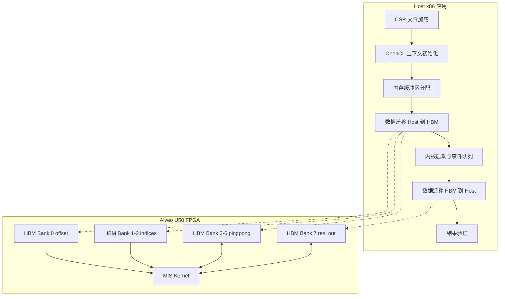

# Maximal Independent Set 基准测试模块 (maximal_independent_set_benchmarks)

在图分析领域，**最大独立集（Maximal Independent Set, MIS）**是一个经典问题：给定一个图，找出一个顶点集合，使得集合中任意两个顶点之间没有边相连，且该集合无法再扩展（加入任何其他顶点都会破坏独立性）。这类问题在任务调度、无线频谱分配、基因组分析和网络资源优化等领域有着广泛应用。

然而，MIS 计算是典型的**不规则计算模式**——顶点度数差异巨大，内存访问模式高度随机，传统 CPU 架构的缓存层次结构和顺序执行模型在此面临严峻挑战。本模块提供了一套基于 **Xilinx FPGA（Alveo U50/U51）** 的硬件加速基准测试方案，利用 **HBM（高带宽内存）** 和 **OpenCL 内核** 将 MIS 计算性能提升一到两个数量级。

## 架构全景

将本模块想象为一个**精密编排的交响乐团**：

- **乐谱（CSR 图数据）**：压缩稀疏行格式的图结构定义了演奏的"乐章"
- **指挥家（Host 主程序）**：负责协调各声部的进场时机，管理乐手状态，最终评判演奏质量
- **舞台（FPGA 硬件平台）**：8 个 HBM 内存通道如同 8 个并行的音轨，可同时传输不同声部的数据
- **演奏家（MIS Kernel）**：在 FPGA 逻辑上实现的硬件算法，以流水线方式并行处理顶点状态更新



### 数据流详解

1. **图数据注入阶段**：Host 从文本文件解析 CSR 格式的图结构（`offset` 数组和 `indices` 数组），并将其映射到 HBM Bank 0 和 Bank 1-2。这种分离存储允许内核以突发模式（burst）高效读取顶点邻接表。

2. **算法执行阶段**：MIS Kernel 实现了一种**并行的 Luby 算法变体**。它维护两组 ping-pong 缓冲区（`C_group_0/1` 和 `S_group_0/1`，映射到 HBM Bank 3-6），分别存储候选集（Candidate Set）和独立集（Independent Set）的双缓冲状态。每轮迭代，内核读取当前状态，并行计算邻居冲突，更新另一组缓冲区，然后交换读写指针。

3. **结果回收阶段**：当算法收敛（或达到最大迭代次数），最终的独立集顶点被写入 HBM Bank 7（`res_out`），并通过 DMA 回传到 Host 内存进行正确性验证。

## 关键设计决策

### 1. HBM 多通道内存架构 vs 传统 DDR

**选择**：将图的不同数据流分散到 8 个 HBM 伪通道（Pseudo Channels），而非使用单一的 DDR4 内存。

**权衡分析**：
- **优势**：HBM2 提供约 460 GB/s 的聚合带宽，是 DDR4 的 10 倍以上。MIS 算法的随机访问模式会彻底打乱 DDR4 的行缓冲局部性，但在 HBM 的交叉访问模式下，仍可维持较高有效带宽。
- **代价**：HBM 容量通常较小（U50 为 8GB），限制了可处理的图规模；且不同 Bank 间的数据移动需要显式的 Host 端管理，代码复杂度高于统一内存模型。

**为何适合此场景**：图分析是典型的**带宽受限型**工作负载，而非计算受限。将预算花在 HBM 硬件和相应的 Bank 级并行控制上，ROI 远高于增加 DSP 计算单元。

### 2. Ping-Pong 双缓冲机制

**选择**：为算法状态维护两组独立的 HBM 内存区域（C_group_0/1 和 S_group_0/1），实现读写分离。

**权衡分析**：
- **优势**：消除了读写竞争，允许内核在读取上一轮状态的同时写入本轮结果，实现了**数据流流水线（Dataflow Pipeline）**。这对于需要多轮迭代的贪心 MIS 算法至关重要。
- **代价**：内存占用翻倍（4 个 HBM Bank 被占用用于状态存储）；Host 代码需要在每轮迭代后交换缓冲区指针，增加了控制逻辑复杂度。

**设计意图**：这本质上是用**空间换时间**的经典策略。在 FPGA 拥有充足 HBM 资源的前提下，通过增加内存占用换取迭代间零停顿的流水线并行，显著降低端到端延迟。

### 3. OpenCL 1.2 Host API 与现代 XRT 运行时

**选择**：使用传统的 OpenCL 1.2 C++ API（`cl::Context`, `cl::CommandQueue`, `cl::Kernel`）而非 Xilinx 最新的 XRT Native API。

**权衡分析**：
- **优势**：OpenCL 是跨平台标准，代码可在不同厂商（Intel, Xilinx, 甚至 GPU）的平台上编译运行，具有更好的**可移植性**；且 OpenCL 的内存对象（`cl::Buffer`）与 HBM Bank 的映射通过 `sp` 指令在配置文件中显式控制，逻辑清晰。
- **代价**：OpenCL 的编程模型较为底层，手动管理 `cl_mem` 对象、事件依赖（`cl::Event`）和内存映射（`enqueueMapBuffer`）容易出错；XRT Native API 提供了更现代的 C++ 封装（`xrt::device`, `xrt::kernel`）和自动内存管理，代码更简洁。

**为何在此保留**：作为**基准测试（Benchmark）**模块，可移植性和对底层执行细节的精确控制（如精确测量 PCIe 传输时间 vs Kernel 执行时间）比开发效率更重要。OpenCL 的事件分析（`CL_PROFILING_COMMAND_START/END`）提供了纳秒级精度的性能数据，这是评估硬件加速收益的关键。

## 子模块概述

本模块由两个紧密协作的子模块构成，分别负责**硬件平台抽象**与**主机端编排逻辑**：

### [内核连接配置 (conn_u50.cfg)](graph_analytics_and_partitioning-l2_connectivity_and_labeling_benchmarks-maximal_independent_set_benchmarks-connectivity_config.md)

该文件是 FPGA 硬件设计的**部署蓝图**，采用 Xilinx Vitis 连接配置语法。它定义了如何将 HLS 编译生成的 `mis_kernel` 逻辑单元映射到 Alveo U50 卡的物理资源上，特别是指定了 8 个 HBM 内存 Bank 与 Kernel 端口的绑定关系。理解此配置是分析内存带宽瓶颈和优化数据布局的前提。

### [主机基准测试应用 (host/main.cpp)](graph_analytics_and_partitioning-l2_connectivity_and_labeling_benchmarks-maximal_independent_set_benchmarks-host_benchmark.md)

这是整个加速系统的**指挥中枢**，实现了从图数据加载、FPGA 上下文初始化、内存缓冲区分配、内核执行调度到结果验证的完整流程。代码展示了如何使用 OpenCL API 与 FPGA 硬件交互，如何通过 `enqueueMigrateMemObjects` 高效地在 Host 与 HBM 间传输数据，以及如何利用 OpenCL 事件对象精确测量端到端延迟和内核执行时间。对于希望集成此 MIS 加速器到更大图分析流水线中的开发者，这是关键的参考实现。

## 依赖与集成

### 上游依赖（本模块依赖谁）

- **HLS 内核源码 (`mis_kernel.hpp`)**：Host 代码通过 `mis_kernel.hpp` 获取内核的函数签名和参数列表，确保 Host 与 Kernel 的接口契约一致。
- **Xilinx OpenCL 扩展库 (`xcl2.hpp`)**：提供设备枚举、二进制文件导入等便利封装，位于 `common` 模块。
- **通用日志工具 (`xf_utils_sw/logger.hpp`)**：来自 Vitis Libraries 的标准化日志与错误报告基础设施。
- **工具链与运行时**：依赖 Xilinx Vitis 2022.1+ 工具链编译 Host 代码，以及对应的 XRT 运行时库驱动 FPGA。

### 下游依赖（谁依赖本模块）

本模块作为 **L2 级基准测试**，是**叶节点**模块，通常不被其他模块直接链接或包含。其设计意图是作为：
- **性能回归测试**：用于 CI/CD 流程中验证 FPGA 编译工具链更新是否引入性能退化
- **集成模板**：开发者可复制此模块结构，修改内核调用逻辑以适配新的图算法
- **教学示例**：展示 OpenCL Host 编程模型和 HBM 内存优化的最佳实践

上层图分析框架（如 `graph/L3/openxrm` 或 `graph/L2/connectivity_and_labeling_benchmarks` 中的其他模块）可能会参考本模块的 API 设计模式，但不会直接依赖其构建产物。

## 新手指南：开发注意事项与常见陷阱

### 1. 内存容量与图规模限制

本模块使用编译时常量 `M_VERTEX` 和 `M_EDGE`（定义在 `utils.hpp` 或编译命令中）分配 Host 和 Device 缓冲区。**如果输入图的顶点数或边数超过这些预设值，将导致静默的内存越界或内核崩溃**。在运行前务必检查：
```bash
# 检查输入图规模
head -n 1 graph.offset  # 查看顶点数
head -n 1 graph.indices # 查看边数
```

### 2. HBM Bank 对齐与数据布局

配置文件中指定了 8 个 HBM Bank（0-7），每个 Bank 有独立的地址空间。**Host 代码通过 `cl::Buffer` 创建的对象默认按页对齐，但逻辑上必须确保数据访问模式与 Bank 映射一致**。特别是 `indices` 数组跨 HBM[1:2] 两个 Bank，Host 端代码创建的是单个 `cl::Buffer` 对象，但在内核侧被视为跨 Bank 的连续空间。修改连接配置（`.cfg` 文件）而不同步更新 Host 代码的缓冲区大小计算，将导致内核访问越界。

### 3. 双缓冲指针交换的隐含契约

代码中为 `C_group` 和 `S_group` 分配了两组缓冲区（0 和 1），这是为了支持**迭代算法**的 ping-pong 操作。然而，**当前 Host 代码示例仅执行单次内核调用**（`enqueueTask` 一次），并未展示如何在多次迭代间交换读写指针。如果开发者基于此模板实现多轮迭代 MIS 算法，必须在 Host 端显式管理：
- 每轮迭代前更新 Kernel 参数（通过 `setArg` 交换 C_group_0/1 和 S_group_0/1 的索引或指针）
- 确保前一轮的写操作完成后（`cl::Event` 同步），下一轮才开始读取

### 4. OpenCL 事件与性能分析的时序陷阱

代码展示了使用 `cl::Event` 和 `getProfilingInfo` 测量数据传输和内核执行时间。**但需注意 OpenCL 事件的时间戳基于设备时钟，而 Host 端的 `gettimeofday` 基于系统时钟**。两者无法直接比较，且存在时钟漂移。在报告端到端延迟时，应明确区分：
- `exec_timeE2E`：Host 视角的 wall-clock 时间（包含 OpenCL 运行时开销）
- `exec_time0`（Kernel execution）：设备实际执行时间（不含 PCIe 传输）

如果内核执行时间远小于数据传输时间，说明算法受限于**内存带宽**而非计算单元，此时优化方向应转向数据复用或压缩，而非增加流水线并行度。

### 5. 结果验证的严格性假设

验证代码假设 Golden Reference 文件（`-mis` 参数指定）中的顶点 ID 与内核输出 `hb_res_out` 的数组索引**一一对应且顺序一致**。它逐行读取参考文件，并与 `hb_res_out[i]` 直接比较。如果算法实现改变了顶点 ID 的输出顺序（例如按 ID 排序 vs 按发现顺序输出），即使数学上是正确的 MIS，验证也会失败。开发者修改内核算法后，若遇到"case error"，应首先检查输出格式是否保持数组索引与顶点 ID 的映射关系，而非立即假设算法逻辑错误。
