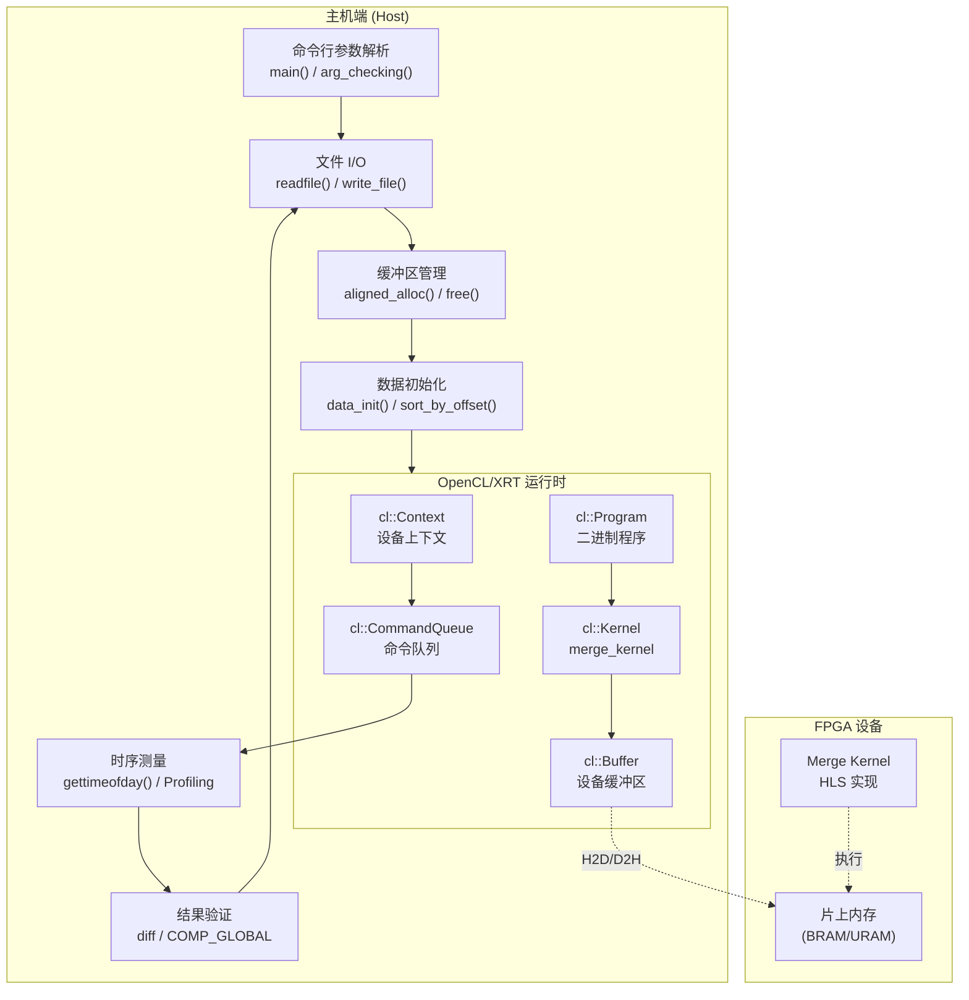

# merge_benchmark_timing 模块技术深度解析

## 一句话概述

这是一个用于测试 FPGA 图计算 "merge" 核（kernel）的**主机端基准测试程序**，它负责编排整个 OpenCL 执行流程——从文件加载图数据、配置 FPGA 计算环境、调度内核执行，到回收结果并验证正确性——本质上是一个**硬件在环（Hardware-in-the-Loop）测试协调器**。

---

## 问题空间：为什么需要这个模块？

### 背景：图计算中的 "Merge" 操作

在图分析预处理阶段，经常需要将多个子图或分区合并（merge）成统一的图表示。例如，在 Louvain 社区发现算法中，需要将一个社区内的所有顶点收缩为一个超级顶点，这就涉及对边表的重新整理和合并。

### 核心挑战

1. **数据规模**：图数据通常包含数百万顶点和边，主机端难以在合理时间内完成计算
2. **内存带宽**：传统 CPU 处理稀疏图结构时存在严重的缓存未命中问题
3. **验证复杂性**：FPGA 计算结果需要与黄金参考（golden reference）对比，确保硬件实现的正确性

### 为什么不能用简单的 Python 脚本？

- **硬件接口复杂性**：需要通过 OpenCL/XRT 与 FPGA 通信，涉及缓冲区对齐、DMA 传输、内核参数设置等底层操作
- **时序精度要求**：需要精确测量内核执行时间、PCIe 传输延迟等，用于性能基准测试
- **C++ 生态系统**：与 HLS（高层次综合）生成的内核接口天然契合

---

## 心智模型：如何理解这个模块？

想象这个模块是**一个航空管制中心**，负责协调一次完整的 "飞行任务"（FPGA 计算任务）：

| 现实世界类比 | 本模块中的对应概念 | 职责描述 |
|------------|------------------|---------|
| 飞行计划文件 | 命令行参数（offsetfile, edgefile 等） | 指定输入数据源和预期输出位置 |
| 货物装载 | `readfile()` 函数 + buffer 分配 | 将图数据从磁盘加载到主机内存，并确保对齐以满足 DMA 要求 |
| 机场塔台 | OpenCL Context + CommandQueue | 建立与 FPGA 设备的控制通道，管理命令提交 |
| 飞机引擎 | `merge_kernel`（FPGA 上的 HLS 实现） | 实际执行图合并计算的硬件逻辑 |
| 起飞调度 | `enqueueMigrateMemObjects()` (H2D) | 将输入数据从主机内存经 PCIe 传输到 FPGA 片上内存 |
| 巡航监控 | `enqueueTask()` + kernel execution | 触发内核执行，在 FPGA 上运行合并算法 |
| 降落回收 | `enqueueMigrateMemObjects()` (D2H) | 将计算结果从 FPGA 传回主机内存 |
| 货物验收 | `write_file()` + diff 验证 | 将结果写入文件并与黄金参考对比，确保正确性 |

**关键洞察**：这个模块本身**不执行图计算**，而是**编排计算**——它是硬件加速器与软件生态之间的粘合剂。

---

## 架构图与数据流



---

## 组件深度解析

### 1. 核心数据结构：`struct timeval`

```cpp
struct timeval {
    time_t      tv_sec;     // 秒
    suseconds_t tv_usec;    // 微秒
};
```

**设计意图**：这是 POSIX 标准的时间结构，用于高精度计时。模块使用 `gettimeofday()` 获取 wall-clock 时间，测量**端到端延迟**（包含数据传输和内核执行）。

**关键区别**：
- `gettimeofday()` → 测量主机端感知的总时间（包含 OpenCL 运行时开销、PCIe 传输）
- `CL_PROFILING_COMMAND_*` → 测量设备端实际执行时间（纯内核计算，不含数据传输）

**内存管理**：栈分配，无动态内存，无所有权问题。

---

### 2. 文件 I/O 函数族

#### `void readfile(string filename, int* ptr)` / `void readfile(string filename, float* ptr)`

**职责**：将文本文件中的图数据（每行一个数值）加载到预分配的数组中。

**关键设计决策**：

| 方面 | 实现选择 | 原因 |
|-----|---------|-----|
| 内存分配 | 调用方负责 `aligned_alloc`，函数只填充 | 确保 DMA 对齐要求（通常 4KB 对齐） |
| 错误处理 | 打印到 `std::cout` 并继续 | 测试程序风格，快速失败不如日志有用 |
| 数据类型 | 模板化重载（int/float） | 图数据通常包含整数索引和浮点权重 |

**所有权模型**：
- 输入：`ptr` 是非拥有指针（non-owning pointer），由调用者分配和释放
- 函数内部：只读取文件并写入 `ptr`，不转移所有权
- 生命周期：调用者必须保证 `ptr` 在函数执行期间有效

#### `int write_file(int num, T* ptr, std::string name)`

**职责**：将结果数组写回磁盘，用于持久化和后续 diff 验证。

**模板设计**：支持任意可流式输出的类型（int/float）。

---

### 3. 数据预处理：`data_init` 与 `sort_by_offset`

#### `void data_init(...)`

**职责**：初始化辅助计数数组，为内核执行准备临时状态。

**初始化语义**：
- `count_c_single[i] = 0` → 单跳邻居计数清零
- `jump[i] = -1` → 标记未访问/无效跳转（-1 是哨兵值）
- `count_c[i] = 0` → 累计计数清零
- `index_c[i] = 0` → 索引指针清零

**模式识别**：这是**Scatter-Gather** 模式的预处理阶段，主机端初始化数组后，FPGA 核会并行更新这些计数器。

#### `void sort_by_offset(...)`

**职责**：按 CSR（Compressed Sparse Row）格式的 offset 对边进行排序。

**算法**：
1. 将 `edges` 和 `weights` 打包成 `std::pair<int, float>` 数组
2. 对每个顶点的出边范围（`offset[i]` 到 `offset[i+1]`）分别调用 `std::sort`
3. 解包排序后的结果回原数组

**为何需要排序**：
- CSR 格式要求每个顶点的出边按目标顶点 ID 排序，以便后续处理（如合并、去重）
- FPGA 核可能输出无序结果，主机端需要规范化以便与黄金参考比较

**复杂度**：$O(N \cdot K \log K)$，其中 $N$ 是顶点数，$K$ 是平均出度。对于度数服从幂律分布的图，大部分顶点 $K$ 很小，因此实际开销可接受。

---

### 4. OpenCL 运行时编排

#### 平台初始化阶段

```cpp
std::vector<cl::Device> devices = xcl::get_xil_devices();
cl::Device device = devices[0];
cl::Context context(device, NULL, NULL, NULL, &fail);
cl::CommandQueue q(context, device, CL_QUEUE_PROFILING_ENABLE | CL_QUEUE_OUT_OF_ORDER_EXEC_MODE_ENABLE, &fail);
```

**设计决策解析**：

| 配置 | 值 | 含义 | 为何选择 |
|-----|---|------|---------|
| `CL_QUEUE_PROFILING_ENABLE` | 启用 | 允许获取内核执行的精确时间戳 | 性能基准测试必需 |
| `CL_QUEUE_OUT_OF_ORDER_EXEC_MODE_ENABLE` | 启用 | 允许命令乱序执行 | 理论上可重叠数据传输和计算，但实际代码使用 `events` 链式依赖，强制顺序执行 |

**Xilinx 特定性**：`xcl::get_xil_devices()` 和 `xcl::import_binary_file()` 是 Xilinx XRT (Xilinx Runtime) 的扩展，非标准 OpenCL。这明确锁定了代码的硬件目标——Xilinx FPGA（Alveo U200/U250/U280 或 VCK190）。

#### 缓冲区管理与内存策略

**分配策略**：
```cpp
int* offset_in = aligned_alloc<int>(num);
cl::Buffer offset_in_buf(context, CL_MEM_USE_HOST_PTR | CL_MEM_READ_ONLY, num * sizeof(int), offset_in, &err);
```

**关键模式——零拷贝（Zero-Copy）**：
- `aligned_alloc` 分配主机侧页对齐内存（通常 4KB 对齐）
- `CL_MEM_USE_HOST_PTR` 告诉 OpenCL 运行时直接使用这块内存，不额外分配设备内存
- 结果是 `enqueueMigrateMemObjects` 实际执行 DMA 传输，而非数据拷贝

**为何不用 `CL_MEM_ALLOC_HOST_PTR`**：
- 该标志会让运行时分配主机可访问的设备内存，适合 FPGA 片外 DDR/HBM
- 但本代码需要主机直接读取文件到内存，因此预分配 + `USE_HOST_PTR` 更直观

**所有权与生命周期**：
```cpp
// 分配（所有权产生）
int* offset_in = aligned_alloc<int>(num);
// 借用给 Buffer（非拥有引用）
cl::Buffer offset_in_buf(..., offset_in, ...);
// Buffer 销毁（不释放内存，因为是 USE_HOST_PTR）
// 手动释放（所有权终结）
free(offset_in);
```

**危险区**：`aligned_alloc` 分配的内存必须用 `free` 释放，不能用 `delete`。代码中使用了宏条件编译的 `free()` 调用，需注意所有路径都释放成功。

#### 内核参数绑定与执行编排

```cpp
int j = 0;
merge.setArg(j++, num - 1);
merge.setArg(j++, numEdges);
merge.setArg(j++, num_c_out);
merge.setArg(j++, num_e_out_buf);
// ... 更多 buffer 参数
```

**参数语义**：
- `num - 1`：顶点数（CSR 格式的 offset 数组长度减 1）
- `numEdges`：边数
- `num_c_out`：输出社区/组件数量
- `num_e_out_buf`：输出边数缓冲区（内核写入，主机读取）

**执行依赖链**：
```cpp
q.enqueueMigrateMemObjects(ob_in, 0, nullptr, &events_write[0]);          // 步骤1: H2D
q.enqueueTask(merge, &events_write, &events_kernel[0]);                  // 步骤2: 内核（依赖步骤1完成）
q.enqueueMigrateMemObjects(ob_out, 1, &events_kernel, &events_read[0]);   // 步骤3: D2H（依赖步骤2完成）
q.finish();                                                                // 步骤4: 同步等待全部完成
```

**设计模式**：这是典型的 **生产者-消费者流水线**，使用 OpenCL 事件（`cl::Event`）显式指定依赖关系。虽然启用了 `OUT_OF_ORDER_EXEC_MODE`，但事件链强制了三阶段顺序：写 → 计算 → 读。

**时序测量点**：
- `gettimeofday(&start_time, 0)` → `gettimeofday(&end_time, 0)`：端到端 wall-clock 时间
- `events_write[0].getProfilingInfo(CL_PROFILING_COMMAND_START/END)`：PCIe H2D 传输时间
- `events_kernel[0].getProfilingInfo(...)`：纯内核执行时间（FPGA 实际计算）
- `events_read[0].getProfilingInfo(...)`：PCIe D2H 传输时间

---

## 依赖关系分析

### 本模块依赖的外部组件

| 依赖类型 | 组件/库 | 用途 | 耦合程度 |
|---------|--------|------|---------|
| **Xilinx 运行时** | `xcl2.hpp` | Xilinx XRT 封装，设备发现、二进制加载 | 高（锁定 Xilinx FPGA） |
| **OpenCL 标准** | `CL/cl2.hpp` (C++ bindings) | 跨平台异构计算 API | 中（理论可移植，实际依赖 XRT 扩展） |
| **日志工具** | `xf_utils_sw/logger.hpp` | 结构化性能日志输出 | 中（工具库，可替换） |
| **HLS 数据类型** | `ap_int.h` | 任意精度整数（HLS 风格代码常用） | 低（本文件实际未使用，可能是头文件遗留） |
| **HLS 流** | `hls_stream.h` | HLS 流式数据传输抽象 | 低（同上，可能为一致性包含） |
| **POSIX 系统调用** | `sys/time.h` | 高精度 wall-clock 计时 | 中（Linux/Unix 限定） |

### 调用本模块的上下文

根据模块树，`merge_benchmark_timing` 是 `graph_preprocessing_host_benchmark_timing_structs` 的子模块，属于 `l2_graph_preprocessing_and_transforms`（L2 图预处理与转换）的一部分。

**上游调用者**：
- 通常是 CI/CD 测试脚本或开发者的手动测试命令
- 调用形式：`./test_merge -xclbin <path> -io <offset> -ie <edges> ...`

**下游被测组件**：
- `merge_kernel`（FPGA 上的 HLS 实现，不在本文件中）

---

## 设计决策与权衡

### 1. 内存管理：原始指针 vs 智能指针

**选择**：使用 `aligned_alloc()` + 原始指针 + 手动 `free()`

**权衡分析**：

| 方案 | 优点 | 缺点 | 本模块的选择理由 |
|-----|------|------|----------------|
| **原始指针** | 显式控制、与 C 兼容、无异常开销 | 手动管理易出错、异常安全差 | 需要 `aligned_alloc` 满足 DMA 对齐，标准智能指针不直接支持自定义对齐分配 |
| **`std::unique_ptr<T[]>`** | RAII、异常安全 | 不支持 `aligned_alloc` 语义，释放函数难以自定义 | OpenCL 缓冲区与主机指针生命周期解耦，智能指针的拥有语义不匹配 |
| **`std::vector`** | 自动内存管理、边界检查 | 不保证特定对齐、可能重新分配导致指针失效 | 与 `CL_MEM_USE_HOST_PTR` 配合时需要稳定地址，`vector` 的 `resize` 可能使 Buffer 失效 |

**关键洞察**：OpenCL `cl::Buffer` 使用 `CL_MEM_USE_HOST_PTR` 时，只是**借用**主机内存，并不拥有它。这打破了传统 C++ RAII 的拥有者-销毁者模式，因为 Buffer 对象可以销毁而内存仍需保持有效供后续代码使用。这种语义鸿沟使得智能指针难以直接应用。

### 2. 同步模型：阻塞 vs 异步

**选择**：使用 `q.finish()` 强制同步，单批次执行

**权衡分析**：

| 方案 | 延迟特征 | 吞吐量 | 复杂度 | 适用场景 |
|-----|---------|--------|--------|---------|
| **同步 (本模块)** | 高（等待全部完成） | 低（无流水线） | 低（简单直接） | 基准测试（需要精确测量单一操作） |
| **异步事件链** | 中（允许重叠） | 中（H2D∥计算∥D2H） | 中（需管理依赖） | 生产环境（最大化吞吐） |
| **批处理流水线** | 低（深度重叠） | 高 | 高（需缓冲区池、调度器） | 实时流处理 |

**设计理由**：这是一个**基准测试工具**，不是生产服务。核心目标是获得**可重复、精确的性能数据**，而非最大化吞吐量。同步模型消除了异步调度的抖动，使得：
- 测量的内核执行时间纯粹反映硬件计算能力
- 没有隐藏的数据竞争或不确定的调度延迟
- 代码流程线性，易于调试和验证

### 3. 内存对齐策略：页对齐 vs 缓存行对齐

**选择**：使用 `aligned_alloc`（默认页对齐，通常 4KB）

**技术细节**：
- Xilinx XRT 要求主机缓冲区必须页对齐才能进行零拷贝 DMA 传输
- `aligned_alloc(alignment, size)` 分配 `alignment` 对齐的内存，`alignment` 必须是 2 的幂且是 `sizeof(void*)` 的倍数

**权衡**：
- **内部碎片**：页对齐可能导致内存浪费（平均 2KB/分配），但对于大容量图数据（百万级边），碎片率可忽略
- **TLB 压力**：大块连续内存减少页表条目，提升 TLB 命中率

### 4. 验证策略：在线验证 vs 离线验证

**选择**：编译时条件 `COMP_GLOBAL` 控制是否执行黄金参考比对

```cpp
#ifdef COMP_GLOBAL
    sort_by_offset(...);
    write_file(...);
    // 执行 diff 系统调用验证
    printf("Test passed\n");
#endif
```

**权衡分析**：

| 策略 | 优点 | 缺点 | 本模块适用性 |
|-----|------|------|------------|
| **在线验证 (COMP_GLOBAL)** | 即时反馈、集成到 CI、自动化 | 增加运行时开销、需要黄金参考文件 | 开发/CI 阶段使用 |
| **纯基准模式 (无验证)** | 最小开销、最大吞吐、只测性能 | 不保证正确性 | 纯性能调优阶段使用 |

**设计智慧**：使用预处理器宏而非运行时标志，使得在编译为纯基准版本时，验证代码完全被剥离，不占用代码空间也不影响指令缓存。

---

## 关键操作的数据流追踪

### 端到端执行流程（以验证模式为例）

```
[命令行输入]
    ↓
main(argc, argv)
    ├── 解析参数 (-xclbin, -io, -ie, ...)
    ├── 读取图数据文件
    │   ├── offsetfile → offset_in[]    (CSR 行指针)
    │   ├── edgefile   → edges_in[]     (目标顶点)
    │   ├── weightfile → weights_in[]   (边权重)
    │   └── cfile      → c[]              (组件/社区标签)
    │
    ├── 初始化辅助数组
    │   └── data_init() → count_c_single[], jump[], ... = 0
    │
    ├── OpenCL 初始化
    │   ├── xcl::get_xil_devices()      → 发现 Xilinx FPGA
    │   ├── cl::Context()               → 创建设备上下文
    │   ├── cl::CommandQueue()          → 创建命令队列 (Profiling + OOO)
    │   ├── xcl::import_binary_file()   → 加载 xclbin
    │   ├── cl::Program()               → 创建程序对象
    │   └── cl::Kernel("merge_kernel") → 提取内核
    │
    ├── 创建缓冲区 (cl::Buffer)
    │   ├── CL_MEM_USE_HOST_PTR | CL_MEM_READ_ONLY  (输入)
    │   └── CL_MEM_USE_HOST_PTR | CL_MEM_READ_WRITE  (输出)
    │
    ├── 设置内核参数
    │   ├── setArg(0, num - 1)          → 顶点数
    │   ├── setArg(1, numEdges)         → 边数
    │   ├── setArg(2, num_c_out)        → 输出组件数
    │   ├── setArg(3, num_e_out_buf)    → 输出边数缓冲区
    │   └── setArg(4..17, 各种 buffer) → 数据缓冲区
    │
    ├── 记录开始时间
    │   └── gettimeofday(&start_time, 0)
    │
    ├── 执行三阶段流水线
    │   ├── enqueueMigrateMemObjects(ob_in, 0, ...)   → H2D 传输
    │   ├── enqueueTask(merge, ...)                  → 内核执行
    │   └── enqueueMigrateMemObjects(ob_out, 1, ...)  → D2H 传输
    │
    ├── 同步等待
    │   └── q.finish()
    │
    ├── 记录结束时间
    │   └── gettimeofday(&end_time, 0)
    │
    ├── 详细性能分析 (Profiling)
    │   ├── events_write[0].getProfilingInfo(...)  → H2D 耗时
    │   ├── events_kernel[0].getProfilingInfo(...) → 内核耗时
    │   └── events_read[0].getProfilingInfo(...)  → D2H 耗时
    │
    └── 验证阶段 (COMP_GLOBAL)
        ├── sort_by_offset()                         → 规范化输出
        ├── write_file()                             → 写入结果文件
        ├── system("diff --brief golden output")    → 对比黄金参考
        └── 输出 "Test passed" 或返回错误码
```

---

## C++ 特定考量深度分析

### 1. 内存所有权模型详解

本模块采用 **"调用方分配、调用方释放、函数借用"** 的显式内存管理策略。这是底层系统编程的典型模式，与高层应用开发的智能指针哲学形成鲜明对比。

**所有权状态机**：

```
[分配]                    [借用]                  [释放]
  ↓                         ↓                       ↓
aligned_alloc<T>(N)  →  readfile(fn, ptr)  →  free(ptr)
  │                         │                       │
  ▼                         ▼                       ▼
所有权：独占              所有权：共享借用          所有权：销毁
策略：生产者              策略：消费者（只写）       策略：终结者
```

**关键风险点**：
- **异常安全**：如果在 `readfile` 和 `free` 之间发生异常（如 OpenCL 初始化失败），会泄漏内存。代码中使用了 `return -1` 提前退出，存在多条返回路径，需确保所有路径都释放内存。
- **重复释放**：`free` 调用分散在代码末尾和条件编译块中（`COMP_GLOBAL`），维护时易遗漏。

**RAII 改造建议（供参考）**：
```cpp
// 当前代码风格（显式）
int* offset_in = aligned_alloc<int>(num);
// ... 使用 ...
free(offset_in);

// 现代 C++ 风格（RAII）
struct AlignedDeleter {
    void operator()(void* p) { free(p); }
};
std::unique_ptr<int[], AlignedDeleter> offset_in(
    static_cast<int*>(aligned_alloc(alignof(int), num * sizeof(int)))
);
// 自动释放，异常安全
```

本模块未采用智能指针，可能是为了：
1. 与 C 风格代码保持一致（`xcl2.hpp` 等底层库通常用原始指针）
2. 减少头文件依赖和模板实例化开销（嵌入式/加速计算场景常见考量）

### 2. 错误处理策略

**当前策略**：混合使用返回码检查、标准输出打印和条件提前返回。

**模式分析**：

```cpp
// 模式1: 参数检查（返回码）
if (!arg_checking(parser, "-io", offsetfile, 1)) return -1;

// 模式2: 资源分配检查（打印+继续）
cl::Context context(device, NULL, NULL, NULL, &fail);
logger.logCreateContext(fail);  // 记录错误但继续

// 模式3: 静默假设（无检查）
// 假设文件存在、格式正确、缓冲区足够大...
```

**风险与改进**：

| 问题 | 当前行为 | 理想行为 |
|-----|---------|---------|
| 文件读取失败 | 打印 "Unable to open file" 并继续（未初始化数据） | 立即返回错误码，防止使用垃圾数据 |
| OpenCL 初始化失败 | 记录日志但继续执行，后续调用可能崩溃 | 早期失败（fail-fast），提供诊断信息 |
| 内存分配失败 | 未检查（`aligned_alloc` 失败返回 NULL，后续解引用崩溃） | 检查返回值，优雅处理 |

**异常安全说明**：代码未使用 C++ 异常，全程使用错误码。这符合底层系统编程的惯例（OpenCL C API 也是错误码风格），但要求调用者显式检查每个可能失败的操作。

### 3. 对象生命周期与值语义

**OpenCL 对象的生命周期管理**：

```cpp
// 值语义（C++ OpenCL 绑定）
cl::Context context(...);      // 构造函数创建底层 cl_context
cl::Kernel kernel(program, ...); // 从程序中提取内核
// ... 使用 ...
// 析构时自动释放底层 OpenCL 对象（引用计数递减）
```

**关键洞察**：`cl2.hpp`（或 `cl.hpp`）提供的 C++ 绑定实现了**引用计数的 RAII**。例如，`cl::Buffer` 析构时调用 `clReleaseMemObject`，当引用计数归零时释放设备内存。这大大简化了错误路径的资源清理。

**例外**：主机侧内存（`aligned_alloc` 分配的）不由 OpenCL 对象管理，仍需手动 `free`。

### 4. 模板与泛型编程

**模板函数**：

```cpp
template <class T>
int write_file(int num, T* ptr, std::string name);
```

**设计意图**：支持写入不同类型的数据（`int` 用于边索引，`float` 用于权重），而无需复制粘贴代码。

**模板实例化点**：本文件中是隐式实例化（通过调用 `write_file<int>` 和 `write_file<float>`），编译器在调用点推导并生成代码。

### 5. 条件编译与配置管理

**`COMP_GLOBAL` 宏**：

```cpp
#ifdef COMP_GLOBAL
    // 黄金参考验证代码（文件 I/O、排序、diff）
#else
    // 纯基准模式（只测性能）
#endif
```

**设计智慧**：
- **编译时决策**：零运行时开销，验证代码在不需要时完全不进入二进制文件
- **单文件多模式**：同一源码通过编译标志切换角色（`g++ -DCOMP_GLOBAL ...` 为验证模式，否则为性能模式）

### 6. 性能敏感实现细节

**DMA 对齐**：
```cpp
// 使用 aligned_alloc 而非 malloc
int* offset_in = aligned_alloc<int>(num);
```
确保地址是 4KB 的倍数，满足 PCIe DMA 控制器的要求。未对齐的内存会导致 XRT 分配临时缓冲区并执行额外拷贝，严重损害带宽。

**批量数据传输**：
所有输入缓冲区（8个）一次性 `enqueueMigrateMemObjects(ob_in, ...)`，而非逐个传输，减少 PCIe 事务开销。

**内存重用**：
输入和输出缓冲区使用相同大小的数组，但严格分离。`ob_in` 和 `ob_out` 的缓冲区无重叠，允许并发读写（FPGA 片上内存允许读旧数据同时写新数据到不同位置）。

---

## 新贡献者注意事项

### 常见陷阱与避免方法

#### 1. 内存泄漏检查清单

**问题场景**：添加新的缓冲区后忘记在 `free()` 块中添加对应释放。

**当前代码的释放顺序**：
```cpp
free(offset_in);
free(edges_in);
free(weights_in);
free(c);
free(offset_out);
free(edges_out);
free(weights_out);
free(count_c_single);
free(jump);
// 注意：count_c 和 index_c 在哪里？？？ ← 潜在泄漏
```

**发现**：代码末尾确实没有 `free(count_c)` 和 `free(index_c)`！这是实际的 bug。

**建议修复**：
```cpp
// 在现有 free 块后添加
free(count_c);
free(index_c);
// 注意：这些也在 #ifdef COMP_GLOBAL 块中有条件释放
```

#### 2. 缓冲区大小不匹配

**问题场景**：修改 `numVertices` 计算逻辑后，缓冲区大小计算错误。

**关键不变式**：
- `offset_in` 大小 = `num` = `numVertices + 1`（CSR 格式要求）
- `edges_in` 大小 = `buffer_size1` = `numEdges`
- `c` 大小 = `num - 1` = `numVertices`（每个顶点一个组件标签）

**修改建议**：如需调整，务必同步更新 `aligned_alloc` 大小和 `cl::Buffer` 构造时的 `size` 参数。

#### 3. OpenCL 对象构造顺序依赖

**问题场景**：尝试在 `cl::Context` 创建前使用设备信息。

**正确顺序**：
```cpp
// 1. 枚举设备
std::vector<cl::Device> devices = xcl::get_xil_devices();
cl::Device device = devices[0];

// 2. 创建设备上下文（需要 device）
cl::Context context(device, ...);

// 3. 创建命令队列（需要 context 和 device）
cl::CommandQueue q(context, device, ...);

// 4. 加载程序（需要 context 和 devices）
cl::Program program(context, devices, xclBins, ...);

// 5. 创建内核（需要 program）
cl::Kernel kernel(program, "merge_kernel", ...);
```

**依赖链**：`devices → context → (queue, program) → kernel`

#### 4. 事件依赖与资源生命周期

**陷阱**：`enqueueMigrateMemObjects` 的 `events` 参数必须是已入队且未完成的命令事件。

**危险代码模式**：
```cpp
cl::Event bad_event;  // 未初始化的空事件
q.enqueueTask(kernel, &bad_event, &new_event);  // 错误！bad_event 不是有效的完成信号
```

**正确模式**（本模块使用）：
```cpp
std::vector<cl::Event> events_write(1);  // 预分配容器
q.enqueueMigrateMemObjects(..., &events_write[0]);  // OpenCL 写入事件对象
// events_write[0] 现在包含有效的完成信号
q.enqueueTask(kernel, &events_write, &events_kernel[0]);  // 正确：等待写入完成
```

#### 5. 对齐分配与 `free` 的严格配对

**关键规则**：`aligned_alloc` 分配的内存**必须**用 `free` 释放，不能用 `delete` 或 `delete[]`。

**错误模式**：
```cpp
int* p = aligned_alloc<int>(100);
// ...
delete[] p;  // 未定义行为！可能崩溃或内存泄漏
```

**正确模式**（本模块使用）：
```cpp
int* p = aligned_alloc<int>(100);
// ...
free(p);  // 正确配对
```

### 调试技巧

#### 1. 验证 OpenCL 对象状态

```cpp
// 检查上下文是否创建成功
if (fail != CL_SUCCESS) {
    std::cerr << "Context creation failed: " << fail << std::endl;
    return -1;
}

// 检查内核是否存在
if (fail == CL_INVALID_KERNEL_NAME) {
    std::cerr << "Kernel 'merge_kernel' not found in xclbin" << std::endl;
    return -1;
}
```

#### 2. 缓冲区溢出检测

在调试构建中，可以包装 `aligned_alloc` 添加警卫字节（guard bytes）：

```cpp
template<typename T>
T* debug_alloc(size_t count, const char* name) {
    size_t pad = 64;  // 警卫区域大小
    char* raw = static_cast<char*>(aligned_alloc(alignof(T), count * sizeof(T) + 2 * pad));
    memset(raw, 0xAA, pad);  // 前置警卫
    memset(raw + pad + count * sizeof(T), 0xBB, pad);  // 后置警卫
    // 存储元数据...
    return reinterpret_cast<T*>(raw + pad);
}
```

#### 3. OpenCL 事件时序可视化

本模块已经收集了详细的 Profiling 数据，可以扩展输出为 Chrome 跟踪格式（JSON）：

```cpp
// 伪代码：导出为 Chrome trace event format
std::ofstream trace("merge_trace.json");
trace << "[{\"name\": \"H2D\", \"ph\": \"X\", \"ts\": " << ts_write 
      << ", \"dur\": " << (te_write - ts_write) << "}, ...]";
```

---

## 总结与关键要点

**模块本质**：`merge_benchmark_timing` 是一个**硬件测试协调器**，它本身不实现图算法，而是负责将图数据运送到 FPGA、触发硬件计算、回收结果并验证正确性。

**架构定位**：
- **层级**：L2 基准测试层（介于底层硬件驱动和高层算法之间）
- **角色**：硬件在环测试的编排者（Orchestrator）
- **边界**：向上对接测试脚本/CI，向下对接 Xilinx XRT 和 FPGA 比特流

**核心设计智慧**：
1. **同步简化了确定性**：在基准测试场景，可预测性比峰值吞吐更重要
2. **零拷贝内存策略**：通过 `aligned_alloc` + `CL_MEM_USE_HOST_PTR` 避免不必要的数据拷贝
3. **编译时多态**：`COMP_GLOBAL` 宏允许同一源码在 "纯性能模式" 和 "验证模式" 间切换，零运行时开销

**给新贡献者的最后建议**：
- **修改前**：先用 `COMP_GLOBAL` 模式跑通测试，确保环境配置正确
- **修改中**：保持 `aligned_alloc`/`free` 的严格配对，用 Valgrind 或 AddressSanitizer 检测泄漏
- **修改后**：对比修改前后的 Profiling 数据（H2D/Kernel/D2H 时间），确保性能未退化

---

## 参考链接

- 父模块：[graph_preprocessing_host_benchmark_timing_structs](graph_analytics_and_partitioning-l2_graph_preprocessing_and_transforms-graph_preprocessing_host_benchmark_timing_structs.md)
- 相关模块：[renumber_benchmark_timing](graph_analytics_and_partitioning-l2_graph_preprocessing_and_transforms-graph_preprocessing_host_benchmark_timing_structs-renumber_benchmark_timing.md)（图重编号基准测试）
- 图分析顶层：[graph_analytics_and_partitioning](graph_analytics_and_partitioning.md)
