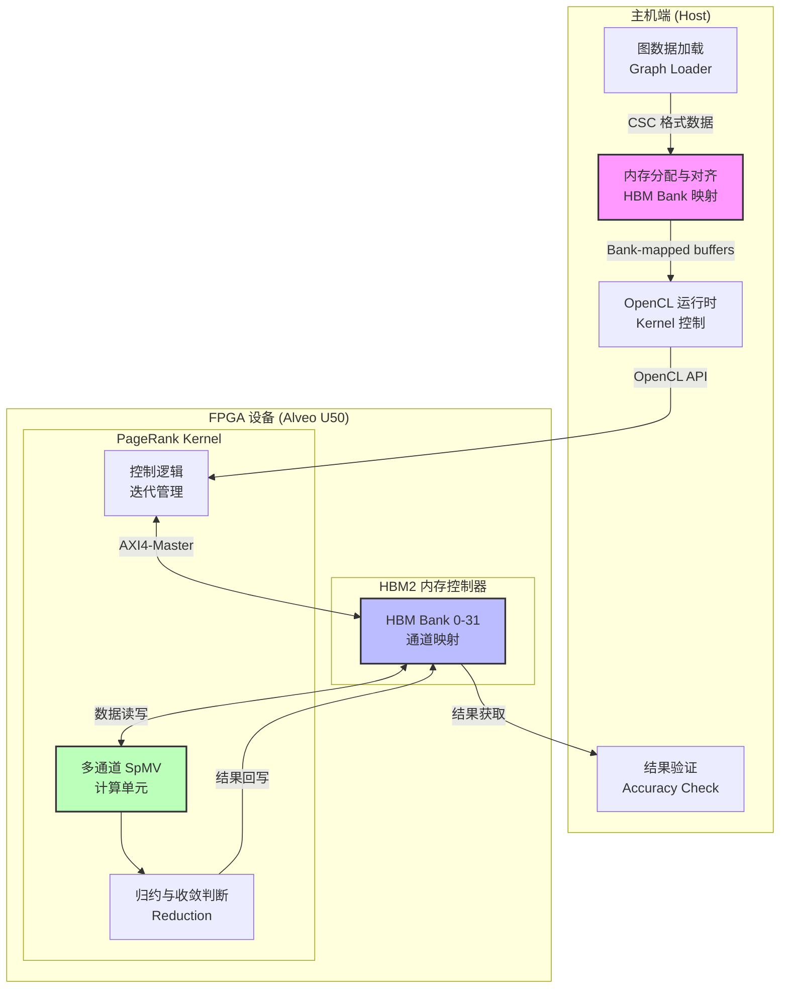

# PageRank 多通道扩展基准测试模块 (pagerank_multi_channel_scaling_benchmark)

## 一句话总结

这是一个用于在 Xilinx Alveo U50 FPGA 卡上通过**多通道 HBM（高带宽内存）并行访问**来加速 PageRank 图算法的基准测试框架。它通过将计算任务分散到 2 个或 6 个独立内存通道上，解决了大型图计算中的**内存带宽瓶颈**问题。

---

## 1. 问题空间与设计动机

### 1.1 为什么需要这个模块？

PageRank 算法（Google 搜索引擎的核心算法）在大型图（数十亿节点、数百亿边）上运行时，面临一个核心挑战：**内存带宽墙**。

- **计算特性**：PageRank 是迭代的、内存密集型的稀疏矩阵-向量乘法（SpMV）操作
- **瓶颈所在**：每次迭代都需要遍历所有边，读取邻居节点的当前 PageRank 值，计算新的 PageRank 值
- **传统限制**：CPU 或单通道 FPGA 实现受限于 DDR 内存带宽（通常 ~20-40 GB/s），无法发挥计算单元的全部潜力

### 1.2 解决方案思路：内存通道并行化

Alveo U50 卡配备了**HBM2（高带宽内存）**，提供高达 460 GB/s 的理论带宽。但这个带宽是通过**多个独立的 HBM 伪通道（Pseudo Channels）**提供的，每个通道有自己的独立地址空间。

**关键洞察**：如果 PageRank 的图数据结构可以被**分区（sharding）**到多个 HBM 通道上，并且计算任务可以并行访问这些通道，那么总带宽可以随通道数线性扩展。

### 1.3 与替代方案的对比

| 方案 | 优点 | 缺点 | 本模块的选择 |
|------|------|------|--------------|
| **单通道 DDR** | 实现简单，兼容性好 | 带宽受限，无法处理大图 | ❌ 未选择 |
| **缓存优化（Cache Blocking）** | 提升局部性，减少内存访问 | 对 PageRank 这种随机访问模式效果有限 | ⚠️ 作为辅助优化 |
| **多通道 HBM（本方案）** | 带宽线性扩展，适合大图 | 实现复杂，需要处理数据分区和对齐 | ✅ **采用** |
| **多 FPGA 卡并行** | 可扩展性极强 | 网络通信开销大，适合超大规模 | ⚠️ 未来扩展方向 |

---

## 2. 心智模型与核心抽象

### 2.1 "多车道并行卸货"类比

想象 PageRank 计算是一个大型物流中心（FPGA 计算单元），需要从仓库（HBM 内存）搬运包裹（图数据）进行分拣处理。

- **单通道模式**：只有一条装卸车道，所有卡车必须排队依次卸货，即使分拣工人（计算单元）有能力处理更多货物，也只能等待货物慢慢运来。

- **多通道模式（本模块）**：建造了多条（2 条或 6 条）并行的装卸车道，每条车道独立运作。货物被预先分配到不同车道对应的仓库区域，多辆卡车可以同时卸货，分拣工人的处理能力得以充分发挥。

**关键细节**：
- **车道（Channel）**：独立的 HBM 伪通道，拥有独立的内存控制器和带宽预算
- **仓库分区（Memory Banking）**：图数据结构被显式映射到不同的 HBM Bank，避免访问冲突
- **同步机制（Ping-Pong Buffering）**：由于 PageRank 是迭代算法，使用双缓冲（Ping-Pong）机制，上一轮计算结果作为下一轮输入，避免读写冲突

### 2.2 核心组件架构图



### 2.3 关键数据结构

1. **CSC（Compressed Sparse Column）格式**：图数据以 CSC 格式存储，包含三个数组：
   - `offsetArr`：列偏移数组，表示每列的起始位置
   - `indiceArr`：行索引数组，存储非零元素的行号
   - `weightArr`：边权重数组

2. **Ping-Pong 缓冲区**：对于每个通道，分配三个缓冲区：
   - `cntValFull`：计数/有效值缓冲区
   - `buffPing` / `buffPong`：交替作为输入和输出的双缓冲

3. **HBM Bank 映射表**：通过 Xilinx OpenCL 扩展 `cl_mem_ext_ptr_t` 和 `XCL_BANK` 宏，显式指定每个缓冲区绑定到哪个 HBM Bank。

---

## 3. 数据流详细分析

### 3.1 端到端执行流程

以下是运行 PageRank 多通道基准测试的完整数据流，从主机准备数据到最终获取结果：

#### 阶段 1：图数据预处理（主机端）

```cpp
// 1. 从文件读取图数据到 CSC 格式
CscMatrix<int, float> cscMat;
readInWeightedDirectedGraphCV<int, float>(filename2_2, cscMat, nnz);
readInWeightedDirectedGraphOffset<int, float>(filename2_1, cscMat, nnz, nrows);
```

- **输入**：原始边列表文件（如 `.txt` 或 `.mtx` 格式）
- **处理**：转换为 CSC（Compressed Sparse Column）稀疏矩阵格式
- **输出**：`cscMat` 包含 `columnOffset`、`row`（实际为列索引，命名略有误导）、`value` 三个数组

#### 阶段 2：HBM 内存分配与 Bank 映射（关键）

```cpp
// 分配对齐的页锁定内存
ap_uint<32>* offsetArr = aligned_alloc<ap_uint<32> >(sizeNrow);
ap_uint<32>* indiceArr = aligned_alloc<ap_uint<32> >(sizeNNZ);
float* weightArr = aligned_alloc<float>(sizeNNZ);

// 为每个通道分配 Ping-Pong 缓冲区
buffType* cntValFull0 = aligned_alloc<buffType>(iterationPerChannel);
buffType* buffPing0 = aligned_alloc<buffType>(iterationPerChannel);
buffType* buffPong0 = aligned_alloc<buffType>(iterationPerChannel);
// ... 为每个通道重复 (CHANNEL_NUM = 2 或 6)
```

- **内存对齐**：使用 `posix_memalign(&ptr, 4096, ...)` 确保 4KB 对齐，满足 FPGA DMA 要求
- **通道分区**：根据 `CHANNEL_NUM`（编译时确定，支持 2 或 6），将迭代计算空间均分到多个通道

#### 阶段 3：OpenCL 上下文与 Buffer 创建

```cpp
// 创建设备端 Buffer，并显式映射到 HBM Bank
cl_mem_ext_ptr_t mext_in[nbuf];
mext_in[0].flags = XCL_BANK0;  // 映射到 HBM Bank 0
mext_in[0].obj = sourceID;
mext_in[0].param = 0;
// ... 为每个 buffer 配置对应的 XCL_BANK

// 创建 OpenCL Buffer 对象
cl::Buffer buffer(context, CL_MEM_USE_HOST_PTR | CL_MEM_READ_WRITE, 
                  sizeof(ap_uint<32>) * (nsource + 1), sourceID);
```

**关键设计决策**：
- **`CL_MEM_USE_HOST_PTR`**：使用主机已分配的页锁定内存作为设备内存的后备存储，避免额外的数据拷贝
- **`XCL_BANK` 映射**：通过 `cl_mem_ext_ptr_t` 扩展，显式指定每个 OpenCL Buffer 绑定到哪个 HBM Bank，这是实现多通道并行带宽的关键

#### 阶段 4：Kernel 参数设置与启动

```cpp
// 设置 Kernel 参数
kernel_pagerank.setArg(0, nrows);
kernel_pagerank.setArg(1, nnz);
kernel_pagerank.setArg(2, alpha);      // 阻尼系数，通常 0.85
kernel_pagerank.setArg(3, tolerance);  // 收敛阈值
kernel_pagerank.setArg(4, maxIter);    // 最大迭代次数
kernel_pagerank.setArg(5, nsource);    // 个性化 PageRank 源节点数
kernel_pagerank.setArg(6, buffer[0]); // sourceID
kernel_pagerank.setArg(7, buffer[1]); // offsetArr (CSC 列偏移)
kernel_pagerank.setArg(8, buffer[2]); // indiceArr (行索引)
kernel_pagerank.setArg(9, buffer[3]); // weightArr (边权重)
kernel_pagerank.setArg(10, buffer[4]); // degreeCSR (出度)
// ... 为每个通道的 ping-pong buffer 设置参数

// 异步执行流程
q.enqueueMigrateMemObjects(ob_in, 0, nullptr, &events_write[0]);  // H2D 数据传输
q.enqueueTask(kernel_pagerank, &events_write, &events_kernel[0][0]); // Kernel 执行
q.enqueueMigrateMemObjects(ob_out, 1, &events_kernel[0], &events_read[0]); // D2H 回传
q.finish();
```

#### 阶段 5：结果提取与验证

```cpp
// 从 ping-pong buffer 读取最终 PageRank 值
ap_uint<512> tmpPR[CHANNEL_NUM];
for (ap_uint<32> i = 0; i < (iteration2 + CHANNEL_NUM - 1) / CHANNEL_NUM; ++i) {
    // 根据 resultinPong 标志判断最终结果在 Ping 还是 Pong buffer
    tmpPR[0] = resultinPong ? buffPong0[i] : buffPing0[i];
    tmpPR[1] = resultinPong ? buffPong1[i] : buffPing1[i];
    // ... 解包 512-bit 向量到 float/double 数组
}

// 与参考实现（TigerGraph 或 CPU 参考）对比计算误差
DT err = 0.0;
int accurate = 0;
for (int i = 0; i < nrows; ++i) {
    err += (golden[i] - pagerank[i]) * (golden[i] - pagerank[i]);
    if (std::abs(pagerank[i] - golden[i]) < tolerance) accurate++;
}
```

### 3.2 内存通道拓扑与数据分区

以下是 HBM Bank 到逻辑通道的映射关系（以 6 通道配置为例）：

```
HBM Bank 分配图（conn_u50_channel6.cfg 配置）：
┌─────────────────────────────────────────────────────────────────┐
│  Channel 0 (Bank 0,1,2)     │  Channel 3 (Bank 10-15)         │
│  ├─ m_axi_gmem0 → HBM[0]    │  ├─ m_axi_gmem6 → HBM[10]       │
│  ├─ m_axi_gmem1 → HBM[1]    │  ├─ m_axi_gmem7 → HBM[11]       │
│  └─ m_axi_gmem2 → HBM[2]    │  ├─ m_axi_gmem8 → HBM[12]       │
│                              │  └─ m_axi_gmem9 → HBM[13]       │
├──────────────────────────────┼──────────────────────────────────┤
│  Channel 1 (Bank 4,5,6,7)    │  Channel 4 (Bank 17-22)         │
│  ├─ m_axi_gmem3 → HBM[4:5]   │  ├─ m_axi_gmem12 → HBM[17]      │
│  └─ m_axi_gmem4 → HBM[6:7]   │  └─ ... (gmem13-16)             │
├──────────────────────────────┼──────────────────────────────────┤
│  Channel 2 (Bank 8)          │  Channel 5 (Bank 24-29)         │
│  └─ m_axi_gmem5 → HBM[8]     │  └─ m_axi_gmem18-23 → HBM[24:29]│
└──────────────────────────────┴──────────────────────────────────┘
```

**关键设计决策**：
1. **交错映射（Interleaved Mapping）**：对于 2 通道配置，输入图数据（offset、indices、weights）被均匀分布到 HBM Bank 0-2（通道 0）和 Bank 4-8（通道 1），实现负载均衡。

2. **专用 Ping-Pong Bank**：每个通道的 `cntValFull`、`buffPing`、`buffPong` 被显式映射到独立的 HBM Bank（如通道 0 使用 Bank 10-12），避免读写冲突。

3. **SLR（Super Logic Region）绑定**：`slr = kernel_pagerank_0:SLR0` 确保 kernel 被放置在靠近 HBM 控制器的 SLR0 区域，减少布线延迟。

---

## 4. 设计决策与权衡

### 4.1 通道数量选择：2 vs 6

```cpp
// 在 test_pagerank.cpp 中编译时确定
#define CHANNEL_NUM (2)  // 或 (6)
```

| 维度 | 2 通道配置 | 6 通道配置 |
|------|-----------|-----------|
| **理论带宽** | ~150 GB/s | ~460 GB/s |
| **资源占用** | 较低，保留更多资源用于其他 kernel | 较高，占用大部分 HBM 控制器和逻辑资源 |
| **适用图规模** | 中型图（< 1亿边） | 大型图（> 1亿边） |
| **延迟特性** | 较低，竞争少 | 较高，调度复杂度增加 |
| **配置复杂度** | 简单，易调试 | 复杂，Bank 映射需仔细规划 |

**权衡逻辑**：
- 对于中等规模图，6 通道的额外带宽无法充分利用（计算密度不足），反而增加调度开销和内存碎片。
- 6 通道配置需要 25 个 OpenCL Buffer，而 2 通道只需 13 个，对 OpenCL 运行时和主机内存压力更大。

### 4.2 数据类型精度：float vs double

```cpp
typedef float DT;  // 或 double
```

- **float（32-bit）**：
  - 带宽效率：同等带宽下可传输 2 倍数据量
  - 资源效率：FPGA DSP 单元支持更多并行 float 运算
  - 精度损失：对于高度连通的图（如社交网络），PageRank 值可能很小，float 的 ~7 位有效数字可能不足以区分相近节点的排名

- **double（64-bit）**：
  - 精度保证：满足大多数图分析需求
  - 资源开销：占用 2 倍 BRAM/URAM 存储，DSP 资源消耗增加
  - 吞吐限制：内存带宽成为更严重的瓶颈

**模块选择**：默认使用 `float`，但通过模板 `DT` 可在编译时切换，支持性能与精度的灵活权衡。

### 4.3 Ping-Pong 缓冲策略

PageRank 是迭代算法，每轮迭代需要读取上一轮的所有节点值。如果直接在原址更新，会读到本轮已更新的脏数据（类似 Gauss-Seidel），导致收敛行为不一致。

```cpp
// 为每个通道分配 Ping-Pong 缓冲
buffType* buffPing0 = aligned_alloc<buffType>(iterationPerChannel);
buffType* buffPong0 = aligned_alloc<buffType>(iterationPerChannel);
```

**设计权衡**：
- **空间换时间**：使用 2 倍内存存储节点值，确保每轮读取的都是一致的上一轮结果（Jacobi 风格迭代）
- **带宽权衡**：每轮迭代需要读取和写入整个节点值数组，内存带宽需求翻倍
- **收敛一致性**：相比原址更新，Jacobi 风格的 Ping-Pong 策略收敛稍慢（需要更多迭代次数），但数值行为更可预测，便于与 CPU 参考实现对比验证

---

## 5. 实现细节深度解析

### 5.1 HBM Bank 映射配置（Connectivity Config）

两个 `.cfg` 文件（`conn_u50_channel2.cfg` 和 `conn_u50_channel6.cfg`）是 Vitis 链接阶段的关键输入，定义了 Kernel 的 AXI 端口到 HBM Bank 的物理映射。

```ini
# 2 通道配置示例（节选）
[connectivity]
# 图数据结构（CSC 格式）映射到 Bank 0-2
sp = kernel_pagerank_0.m_axi_gmem0:HBM[0]   # CSC offsets
sp = kernel_pagerank_0.m_axi_gmem1:HBM[1]   # CSC indices
sp = kernel_pagerank_0.m_axi_gmem2:HBM[2]   # CSC weights

# 更多数据结构映射到 Bank 4-8（通道 1）
sp = kernel_pagerank_0.m_axi_gmem3:HBM[4:5]
sp = kernel_pagerank_0.m_axi_gmem4:HBM[6:7]
sp = kernel_pagerank_0.m_axi_gmem5:HBM[8]

# Ping-Pong 缓冲区映射到 Bank 10-15（每个通道独占）
sp = kernel_pagerank_0.m_axi_gmem6:HBM[10]   # Channel 0: cntValFull0
sp = kernel_pagerank_0.m_axi_gmem7:HBM[11]   # Channel 0: buffPing0
sp = kernel_pagerank_0.m_axi_gmem8:HBM[12]   # Channel 0: buffPong0

# SLR 绑定：确保 kernel 放置在靠近 HBM 控制器的 SLR0
slr = kernel_pagerank_0:SLR0

# 实例化数量
nk = kernel_pagerank_0:1:kernel_pagerank_0
```

**关键映射策略**：

1. **分离读写热点**：
   - 只读数据（CSC 结构、权重）映射到 Bank 0-8
   - 读写交替数据（Ping-Pong 缓冲）映射到 Bank 10-29
   - 避免读写冲突导致的 Bank 争用

2. **通道独占性**：
   - 每个计算通道拥有独立的 Bank 集合（如通道 0 使用 Bank 10-12，通道 1 使用 Bank 13-15）
   - 确保并行访问时不会因 Bank 冲突而串行化

3. **Burst 优化**：
   - 连续地址空间映射到同一 Bank（如 `HBM[4:5]` 表示 Bank 4 和 5 组成连续空间）
   - 支持 AXI4 Burst 传输，最大化有效带宽

### 5.2 主机端内存管理与对齐

```cpp
// 页对齐内存分配（4096 字节对齐）
template <typename T>
T* aligned_alloc(std::size_t num) {
    void* ptr = nullptr;
#if _WIN32
    ptr = (T*)malloc(num * sizeof(T));
    if (num == 0) {
#else
    if (posix_memalign(&ptr, 4096, num * sizeof(T))) {
#endif
        throw std::bad_alloc();
    }
    return reinterpret_cast<T*>(ptr);
}
```

**为什么必须 4096 字节对齐？**

1. **DMA 要求**：FPGA 的 DMA 引擎（XDMA）通常要求内存缓冲区按页（4KB）对齐，以确保高效的 Scatter-Gather DMA 操作
2. **Cache Line 优化**：对齐到 64 字节或更高可以减少 False Sharing，虽然这里主要是为了满足硬件 DMA 约束
3. **HBM 访问粒度**：HBM 的访问粒度较大，对齐可以确保 Burst 传输从地址边界开始，最大化带宽利用率

### 5.3 多通道数据分区策略

PageRank 计算的并行化基于**节点分区**（Node Sharding）：

```cpp
// 计算每个通道处理的节点迭代次数
int iteration = (sizeof(DT) == 8) ? (nrows + 7) / 8 : (nrows + 16 - 1) / 16;
int unrollNm2 = (sizeof(DT) == 4) ? 16 : 8;
int iteration2 = (nrows + unrollNm2 - 1) / unrollNm2;
int iterationPerChannel = (iteration2 + CHANNEL_NUM - 1) / CHANNEL_NUM;
```

**分区逻辑**：

1. **SIMD 宽度确定**：
   - `float`（32-bit）：每次处理 16 个节点（512-bit / 32-bit = 16）
   - `double`（64-bit）：每次处理 8 个节点（512-bit / 64-bit = 8）

2. **节点总数对齐**：
   - `iteration2` = 向上取整到 SIMD 宽度倍数的节点迭代次数
   - 例如：1000 个节点，`float` 模式下 `iteration2` = ceil(1000/16) = 63 次 SIMD 迭代（处理 1008 个节点，最后 8 个是填充）

3. **通道均匀分配**：
   - `iterationPerChannel` = `iteration2` 均匀分配到 `CHANNEL_NUM` 个通道
   - 例如：63 次迭代，6 通道模式下每通道 11 次（总共 66，最后几个迭代处理虚拟节点）

**为什么这种分区有效？**

- **计算局部性**：每个通道处理连续的节点块，CSC 格式的列访问具有良好的空间局部性
- **负载均衡**：静态均匀分配确保所有通道同时完成任务，避免长尾延迟
- **无同步开销**：由于 PageRank 是 Jacobi 迭代（读取上一轮全局状态，写入本轮局部结果），通道间在单次迭代内无需通信，只在迭代边界同步

### 5.4 Ping-Pong 缓冲区管理

```cpp
// 主机端为每个通道分配 Ping-Pong 缓冲
buffType* buffPing0 = aligned_alloc<buffType>(iterationPerChannel);
buffType* buffPong0 = aligned_alloc<buffType>(iterationPerChannel);
buffType* cntValFull0 = aligned_alloc<buffType>(iterationPerChannel);
```

**工作流程**：

1. **初始化**：所有节点值初始化为均匀分布（通常是 `1/nrows`）

2. **奇数轮迭代（Ping → Pong）**：
   - 读取 `buffPing` 作为输入（上一轮结果）
   - 计算新的 PageRank 值
   - 写入 `buffPong` 作为输出

3. **偶数轮迭代（Pong → Ping）**：
   - 读取 `buffPong` 作为输入
   - 计算新的 PageRank 值
   - 写入 `buffPing` 作为输出

4. **收敛判断**：
   - Kernel 维护 `resultInfo[2]` 数组
   - `resultInfo[0]`（bool）：最终结果是否在 Pong 缓冲区
   - `resultInfo[1]`（int）：实际执行的迭代次数

**为什么必须使用 Ping-Pong？**

- **数值稳定性**：确保每轮迭代基于完全一致的前一轮状态（Snapshot），避免读到本轮部分更新的混合状态（Read-After-Write Hazard）
- **可重复性**：Jacobi 风格的迭代行为可预测，便于与 CPU 参考实现对比验证
- **流水线友好**：FPGA Kernel 可以设计为流式处理，无需停顿等待全局同步，只需在 Buffer 切换时进行简单的握手

---

## 6. 配置与使用指南

### 6.1 编译时配置宏

```cpp
// 在 test_pagerank.cpp 顶部定义

// 1. 通道数量选择（必须与 .cfg 文件和 Kernel 实现一致）
#define CHANNEL_NUM (2)   // 或 (6)

// 2. 数据精度选择
typedef float DT;   // 或 typedef double DT;

// 3. 图类型选择
#define WEIGHTED_GRAPH    // 启用加权边，注释则为无权图
//#define PERSONALIZED     // 启用个性化 PageRank（需指定源节点）

// 4. 基准测试模式
//#define BENCHMARK        // 启用标准基准测试数据集格式（.mtx）
```

**一致性检查清单**：
- `CHANNEL_NUM` 必须与使用的 `.cfg` 文件匹配（`conn_u50_channel2.cfg` 对应 2，`conn_u50_channel6.cfg` 对应 6）
- `DT` 类型定义必须与 Kernel 编译时的数据宽度一致（影响 SIMD 宽度和内存布局）
- `WEIGHTED_GRAPH` 必须与图数据文件是否包含权重一致

### 6.2 运行时命令行参数

```bash
./test_pagerank.xclbin \
    -xclbin ./kernel_page_rank.xclbin \  # FPGA bitstream 文件
    -runs 10 \                           # 重复运行次数（用于统计平均性能）
    -nrows 5000000 \                     # 图节点数
    -nnz  80000000 \                     # 图边数（非零元素数）
    -files "soc-LiveJournal1" \          # 数据集文件名前缀
    -dataSetDir "./data/" \              # 图数据目录
    -refDir "./reference/"               # 参考结果目录（用于验证）
```

### 6.3 输入数据格式

**非基准测试模式（默认）**：
- `filename.txt`：原始边列表（可选，用于验证读取逻辑）
- `filenamecsc_offsets.txt`：CSC 格式的列偏移数组（32-bit 整数）
- `filenamecsc_columns.txt`：CSC 格式的行索引数组（32-bit 整数）和权重（32-bit float），通常交错存储或分别存储

**基准测试模式（定义 `BENCHMARK` 宏）**：
- `filename.mtx`：Matrix Market 格式文件
- `filename-csc-offset.mtx`：CSC 偏移文件
- `filename-csc-indicesweights.mtx`：索引和权重文件

---

## 7. 常见陷阱与调试指南

### 7.1 HBM Bank 冲突（性能杀手）

**症状**：实际带宽远低于理论值，Kernel 执行时间随通道数增加无明显改善。

**原因**：
- 多个 AXI 端口被映射到同一个 HBM Bank，导致 Bank 冲突和访问串行化
- 突发传输（Burst）长度不足，无法有效利用 HBM 的高带宽

**排查方法**：
- 使用 `xclbinutil` 检查生成的 xclbin 文件中的连接性报告
- 在 Vitis Analyzer 中查看 AXI 端口的带宽利用率和冲突统计

**解决方案**：
- 确保 `.cfg` 文件中每个 `m_axi_gmem` 端口映射到独立的 HBM Bank
- 对齐缓冲区到 4KB 边界，确保 Burst 传输从页面边界开始

### 7.2 通道数不匹配（编译/运行时错误）

**症状**：
- 编译时：`error: 'buffPing2' was not declared in this scope`
- 运行时：Kernel 启动失败，OpenCL 错误 `CL_INVALID_ARG_SIZE`

**原因**：
- `CHANNEL_NUM` 宏定义与 `.cfg` 文件不匹配
- Host 代码为 2 通道编译，但加载了 6 通道的 xclbin，导致参数数量不匹配

**修复步骤**：
1. 确认 `test_pagerank.cpp` 中的 `#define CHANNEL_NUM (X)`
2. 确认链接时使用的 `.cfg` 文件（`conn_u50_channelX.cfg`）
3. 重新编译 Host 代码和 Kernel（修改 `CHANNEL_NUM` 后必须重新编译两者）
4. 验证 xclbin 参数数量：`xclbinutil --info --input kernel.xclbin | grep "Argument"

### 7.3 内存对齐失败（段错误/数据损坏）

**症状**：
- 主机端段错误（Segmentation fault）在 `enqueueMigrateMemObjects` 时
- 数据传输后数据内容看似随机或被截断

**原因**：
- `posix_memalign` 调用失败未检查返回值（代码中已检查，但分配大小可能为 0 或溢出）
- `CL_MEM_USE_HOST_PTR` 要求主机内存必须页对齐（4KB），否则 OpenCL 运行时可能回退到隐式拷贝，或报错

**预防措施**：
- 始终检查 `aligned_alloc` 的返回值（已实现）
- 确保分配的 `num` 参数不为 0：`if (num == 0) return nullptr;`
- 使用 `xcl::get_xil_devices()` 确认设备支持 `CL_MEM_USE_HOST_PTR` 扩展

### 7.4 收敛判断与精度误差

**症状**：
- 与 TigerGraph/CPU 参考实现对比，准确率低（`accurate < 0.99`）
- 误差 `err` 显著大于 `nrows * tolerance`

**可能原因**：

1. **迭代次数不足**：`maxIter` 设置过低（非基准测试模式下默认 20，对于某些图可能不够）
   - 解决：增加到 100 或更高，或检查 `iterations` 返回值是否达到 `maxIter`（未收敛）

2. **精度类型不匹配**：Host 使用 `float`，但参考实现使用 `double`
   - 解决：将 `typedef float DT` 改为 `typedef double DT`，并重新编译 Kernel 和 Host

3. **个性化 PageRank 配置错误**：定义了 `PERSONALIZED` 但未正确设置 `sourceID`
   - 解决：检查 `sourceID[0]` 是否设置为期望的源节点 ID，或取消定义 `PERSONALIZED` 运行标准 PageRank

4. **加权图与无权图混淆**：`WEIGHTED_GRAPH` 定义状态与数据文件内容不匹配
   - 如果数据文件包含权重但代码未定义 `WEIGHTED_GRAPH`，权重将被忽略，计算结果错误

---

## 8. 性能调优建议

### 8.1 最大化 HBM 带宽利用率

1. **Bank 冲突最小化**：
   - 确保每个 AXI 端口独占一个 HBM Bank，避免多个端口争用同一 Bank
   - 在 `.cfg` 文件中检查映射，确保没有两个 `sp` 行指向相同的 `HBM[X]`

2. **Burst 长度优化**：
   - 确保每次 AXI 传输的 Burst 长度尽可能长（理想情况下 4KB 或更长）
   - 这要求数据在内存中连续存储，且访问模式是顺序的（CSC 格式天然支持这一点）

3. **数据宽度匹配**：
   - Kernel 端口使用 512-bit 宽度（`ap_uint<512>`），与 HBM 物理宽度匹配
   - Host 端也使用 `buffType`（`ap_uint<512>`）对齐到 64 字节边界

### 8.2 通道数量选择决策树

```
图节点数 (nrows) 和边数 (nnz)?
│
├─ nnz < 50M (中小型图)
│  ├─ 计算密度较低，带宽非瓶颈
│  └─ 选择 2 通道配置
│     - 资源开销低
│     - 调试更简单
│     - 避免 6 通道的过度并行开销
│
└─ nnz > 100M (大型图)
   ├─ 计算密度高，内存带宽是瓶颈
   └─ 选择 6 通道配置
      - 充分利用 HBM 带宽
      - 支持更高并行度
      - 注意检查资源利用率，确保不超出 FPGA 容量
```

### 8.3 编译标志优化

在 `test_pagerank.cpp` 中，根据目标场景调整以下宏：

```cpp
// 高性能生产环境
#define CHANNEL_NUM (6)        // 使用最大通道数
typedef float DT;              // 使用 float 最大化带宽效率
#define WEIGHTED_GRAPH         // 如果图数据包含权重
#define BENCHMARK              // 使用标准 .mtx 格式，便于与其他系统对比

// 高精度验证环境
typedef double DT;             // 使用 double 确保数值精度
#define CHANNEL_NUM (2)        // 减少通道数以简化调试
// 取消定义 BENCHMARK，使用自定义简单数据集
```

---

## 9. 模块依赖与接口

### 9.1 上游依赖（本模块使用的库）

| 库/模块 | 用途 | 关键 API/组件 |
|---------|------|---------------|
| **Xilinx Runtime (XRT)** | OpenCL 设备管理、内存迁移、Kernel 启动 | `cl::Context`, `cl::CommandQueue`, `cl::Kernel`, `enqueueMigrateMemObjects` |
| **xcl2** | Xilinx OpenCL 封装工具 | `xcl::get_xil_devices()`, `xcl::import_binary_file()` |
| **xf::graph::L2** | 图算法 L2 层通用接口 | `CscMatrix`, `readInWeightedDirectedGraphCV`, `readInWeightedDirectedGraphOffset` |
| **xf::common::utils_sw** | 软件端日志与工具 | `Logger`, `ArgParser` |

### 9.2 下游依赖（依赖本模块的组件）

本模块是顶层基准测试应用，通常不被其他模块直接依赖。但本模块的设计模式和配置文件可以被以下场景复用：

- **其他迭代图算法**（如 Connected Components、Label Propagation）的多通道 HBM 优化参考
- **个性化 PageRank**（Personalized PageRank）的变体实现
- **多卡扩展**：将单卡多通道扩展为多卡多通道的参考实现

### 9.3 外部接口规格

#### 命令行接口 (CLI)

```bash
./test_pagerank.xclbin \
    -xclbin <path>      # 必需：FPGA bitstream 文件路径
    -runs <int>         # 可选：重复运行次数（默认 1）
    -nrows <int>         # 可选：图节点数（默认 5）
    -nnz <int>          # 可选：图边数（非零元素数，默认 7）
    -files <string>     # 可选：数据集文件名前缀
    -dataSetDir <path>  # 可选：图数据目录（默认 "./data/"）
    -refDir <path>      # 可选：参考结果目录（默认 "./data/"）
```

#### 文件格式接口

**输入文件**（取决于编译宏）：
- **标准模式**：`{files}.txt`（边列表），`{files}csc_offsets.txt`（CSC 偏移），`{files}csc_columns.txt`（CSC 索引和权重）
- **基准测试模式**（`#define BENCHMARK`）：`{files}.mtx`（Matrix Market 格式）

**输出/验证**：
- 标准模式：`pagerank_ref_tigergraph.txt`（TigerGraph 参考结果）
- 基准测试模式：`{files}.tiger`（TigerGraph 格式参考结果）

---

## 10. 新贡献者检查清单

如果你是第一次接触这个模块，以下是确保理解正确和避免常见错误的检查点：

### 10.1 环境准备检查

- [ ] 确认 Alveo U50 卡已正确安装，运行 `xbutil examine` 可以看到设备
- [ ] 确认 XRT（Xilinx Runtime）已正确安装，版本与编译 xclbin 时使用的 Vitis 版本匹配
- [ ] 确认 `CHANNEL_NUM` 宏定义与手头拥有的 xclbin 文件匹配（2 通道或 6 通道）

### 10.2 首次运行验证

- [ ] 准备一个小型测试图（如 1000 节点，10000 边），确保可以秒级完成运行
- [ ] 先运行 2 通道配置，验证 `Accurate Rate > 0.99` 和 `Err Geomean` 很小（< 1e-4）
- [ ] 检查输出中的带宽利用率：数据传输时间（H2D + D2H）应远小于 Kernel 执行时间，否则说明带宽未充分利用

### 10.3 修改与调试注意事项

- [ ] **修改 `CHANNEL_NUM` 后**：必须重新编译 Host 代码 **和** Kernel（修改 `.cfg` 文件并重新链接 xclbin）
- [ ] **修改数据类型（float/double）后**：必须同时修改 Host 的 `typedef` 和 Kernel 的模板参数，确保两端一致
- [ ] **遇到段错误时**：首先检查 `aligned_alloc` 的返回值是否为 NULL，以及分配的 `num` 参数是否因计算溢出而为 0
- [ ] **结果不一致时**：检查 `PERSONALIZED` 宏和 `sourceID` 设置，以及 `WEIGHTED_GRAPH` 是否与数据文件匹配

### 10.4 性能优化起点

- [ ] 对于大图（> 1000 万边），从 2 通道切换到 6 通道，观察 Kernel 执行时间是否近似线性减少（理想情况下 3 倍加速）
- [ ] 如果带宽利用率低（数据传输时间占比 > 30%），检查 `.cfg` 文件中的 HBM Bank 映射，确保没有 Bank 冲突
- [ ] 对于延迟敏感场景，尝试减少 `maxIter` 并监控实际迭代次数，避免在已收敛后仍运行到最大迭代次数

---

**文档版本**：1.0  
**最后更新**：基于代码仓库中的 `pagerank_multi_channels` 模块实现  
**维护建议**：当添加新的通道配置（如 4 通道）或支持新的 FPGA 平台（如 U55C、U200）时，更新本文档的架构图和配置说明。
