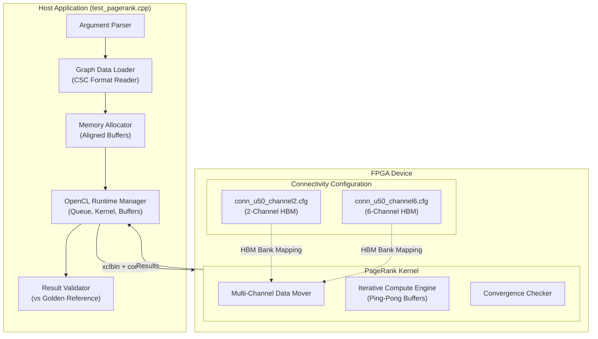
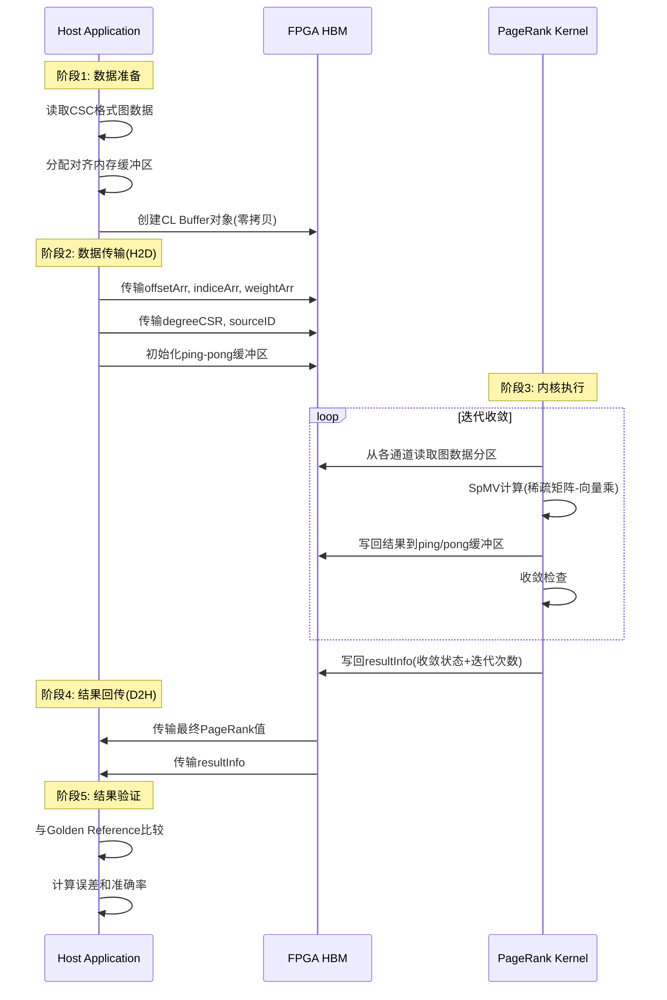

# Personalized PageRank Multi-Channel Benchmark 模块技术深度解析

## 1. 模块定位：解决什么问题？

想象你正在开发一个社交网络的推荐系统，需要计算"从用户A出发，随机游走时到达各个节点的概率"——这就是**个性化PageRank（Personalized PageRank）**的核心需求。与标准PageRank不同，个性化版本以特定源节点为起点，计算有偏的随机游走路径。

本模块`pagerank_personalized_multi_channel_benchmark`解决的**核心挑战**是：

> **如何在FPGA加速器上高效实现大规模图的个性化PageRank计算，并通过多通道HBM（High Bandwidth Memory）架构突破内存带宽瓶颈？**

具体来说，该模块提供了：
1. **多通道并行架构**：支持2通道或6通道HBM数据访问配置，通过增加内存通道数线性扩展带宽
2. **个性化PageRank内核**：针对特定源节点的PageRank计算优化
3. **完整的基准测试框架**：从图数据加载、FPGA内核执行到结果验证的全流程支持

## 2. 核心概念与心智模型

### 2.1 多通道数据并行架构（类比：多车道高速公路）

想象图数据是一辆辆需要运输的货物卡车。单通道架构就像单车道公路——所有卡车必须排队依次通过。而多通道架构将数据分散到多条并行车道（HBM bank），每条车道独立服务一部分数据：

```
单通道架构：
Host Memory → [单一AXI接口] → 计算单元 → [单一AXI接口] → Host Memory
                    ↑
              带宽瓶颈点

多通道架构（6通道）：
Host Memory → [AXI0] → HBM[0-1]  → 计算通道0 ─┐
            → [AXI1] → HBM[2-3]  → 计算通道1  │
            → [AXI2] → HBM[4-5]  → 计算通道2  ├→ 聚合结果 → Host
            → [AXI3] → HBM[6-7]  → 计算通道3  │
            → [AXI4] → HBM[8-9]  → 计算通道4  │
            → [AXI5] → HBM[10-11]→ 计算通道5 ─┘
```

每个通道管理图数据的一个分区（vertices partition），通过空间划分实现并行处理。

### 2.2 个性化PageRank的迭代计算模型

个性化PageRank的核心数学公式：

$$\mathbf{pr}^{(t+1)} = \alpha P^T \mathbf{pr}^{(t)} + (1-\alpha) \mathbf{e}_s$$

其中：
- $P$ 是转移概率矩阵（列归一化的邻接矩阵）
- $\alpha$ 是阻尼因子（通常0.85）
- $\mathbf{e}_s$ 是指示向量（源节点位置为1，其余为0）
- $t$ 是迭代次数

这个迭代过程在FPGA上通过**ping-pong缓冲区机制**实现：
1. 当前迭代值存储在`buffPing`缓冲区
2. 下一轮迭代计算结果写入`buffPong`缓冲区
3. 迭代完成后交换指针，新的"ping"变为旧的"pong"

### 2.3 CSC稀疏图存储格式

模块使用**Compressed Sparse Column (CSC)**格式存储图数据：
- `offsetArr`：每列（顶点）的非零元素起始位置偏移
- `indiceArr`：非零元素的行索引（即边连接的源顶点）
- `weightArr`：边的权重值

CSC格式优化了列优先的访问模式，与PageRank中矩阵-向量乘法的列遍历模式匹配。

## 3. 架构设计与组件交互

### 3.1 模块架构图



### 3.2 核心组件详解

#### 3.2.1 主机端测试框架 (`test_pagerank.cpp`)

主机端代码是一个完整的基准测试应用，主要责任包括：

1. **命令行参数解析**：支持 `-xclbin`（比特流路径）、`-runs`（运行次数）、`-nrows`/`-nnz`（图规模）、`-dataSetDir`（数据集目录）等参数

2. **图数据加载**：从CSC格式文件读取图结构：
   ```cpp
   readInWeightedDirectedGraphCV<int, float>(filename2_2, cscMat, nnz);
   readInWeightedDirectedGraphOffset<int, float>(filename2_1, cscMat, nnz, nrows);
   ```

3. **内存分配与对齐**：使用 `aligned_alloc` 分配4096字节对齐的内存缓冲区，确保DMA传输效率：
   ```cpp
   ap_uint<32>* sourceID = aligned_alloc<ap_uint<32>>(sizeNrow);
   buffType* buffPing0 = aligned_alloc<buffType>(iterationPerChannel);
   ```

4. **OpenCL运行时管理**：
   - 创建设备上下文和命令队列（支持Out-of-Order执行和性能分析）
   - 加载xclbin比特流并创建kernel对象
   - 创建CL buffer对象并与主机内存关联（使用`CL_MEM_USE_HOST_PTR`实现零拷贝）
   - 设置kernel参数并执行数据传输（Host→Device）、kernel执行、结果回传（Device→Host）

5. **结果验证**：将FPGA计算结果与Golden Reference（来自TigerGraph或其他参考实现）对比，计算误差和准确率：
   ```cpp
   for (int i = 0; i < nrows; ++i) {
       err += (golden[i] - pagerank[i]) * (golden[i] - pagerank[i]);
       if (std::abs(pagerank[i] - golden[i]) < tolerance) accurate++;
   }
   ```

#### 3.2.2 多通道连接配置 (`conn_u50_channel2.cfg` 与 `conn_u50_channel6.cfg`)

这两个配置文件定义了FPGA kernel的内存端口到HBM（High Bandwidth Memory）物理bank的映射关系。这是实现多通道并行架构的关键。

**2通道配置分析**：
```
sp = kernel_pagerank_0.m_axi_gmem0:HBM[0]   // 源节点ID
sp = kernel_pagerank_0.m_axi_gmem1:HBM[1]   // 偏移数组
sp = kernel_pagerank_0.m_axi_gmem2:HBM[2]   // 索引数组
sp = kernel_pagerank_0.m_axi_gmem3:HBM[4:5] // 权重数组（跨2个bank）
sp = kernel_pagerank_0.m_axi_gmem4:HBM[6:7] // 度数组（跨2个bank）
sp = kernel_pagerank_0.m_axi_gmem5:HBM[8]   // 通道0常量缓冲区

sp = kernel_pagerank_0.m_axi_gmem6:HBM[10]  // 通道0 Ping缓冲区
sp = kernel_pagerank_0.m_axi_gmem7:HBM[11]  // 通道0 Pong缓冲区
sp = kernel_pagerank_0.m_axi_gmem8:HBM[12]  // 通道1常量缓冲区
sp = kernel_pagerank_0.m_axi_gmem9:HBM[13]  // 通道1 Ping缓冲区
sp = kernel_pagerank_0.m_axi_gmem10:HBM[14] // 通道1 Pong缓冲区
sp = kernel_pagerank_0.m_axi_gmem11:HBM[15] // 结果信息
```

**6通道配置分析**：
在6通道配置中，每个通道拥有独立的内存端口映射（`gmem5-gmem7`对应通道0，`gmem8-gmem10`对应通道1，以此类推直到`gmem23`对应通道5）。这允许每个通道独立地读写其本地HBM bank，实现真正的并行数据访问。

**关键设计决策**：
1. **空间局部性优化**：每个通道的ping-pong缓冲区（`buffPing`/`buffPong`）和常量缓冲区（`cntValFull`）映射到独立的HBM bank，避免bank冲突
2. **负载均衡**：图数据按顶点分区，每个通道处理`iterationPerChannel = (iteration2 + CHANNEL_NUM - 1) / CHANNEL_NUM`个顶点
3. **跨bank扩展**：对于较大的数组（如权重数组），使用`HBM[4:5]`语法跨多个bank分布存储，提供额外带宽

### 3.3 数据流分析

**端到端数据流（一次完整的PageRank计算）**：



**关键数据结构映射**：

| 数据数组 | HBM Bank(s) | 用途 | 访问模式 |
|---------|------------|------|---------|
| `sourceID` | HBM[0] | 源节点ID（个性化PR） | 只读 |
| `offsetArr` | HBM[1] | CSC列偏移数组 | 只读 |
| `indiceArr` | HBM[2] | CSC行索引数组 | 只读 |
| `weightArr` | HBM[4:5] | 边权重数组 | 只读 |
| `degreeCSR` | HBM[6:7] | 节点度数数组 | 读/写 |
| `cntValFull` | HBM[8,12,...] | 通道常量缓冲区 | 只读 |
| `buffPing`/`buffPong` | HBM[10,11,13,14,...] | 迭代ping-pong缓冲区 | 读/写 |

**分区策略**：
图顶点被划分为`CHANNEL_NUM`个分区，每个分区包含`iterationPerChannel`个顶点。每个通道独立处理其分区内的顶点，通过独立的AXI端口并发访问HBM，实现真正的数据并行。

## 4. 设计决策与权衡分析

### 4.1 为什么选择多通道架构？

**问题背景**：
PageRank算法属于内存密集型工作负载，其性能通常受限于内存带宽而非计算能力。在单个HBM bank上，带宽受限于该bank的物理接口速度（通常为几GB/s）。

**选择的权衡**：

| 方案 | 优点 | 缺点 | 本模块选择 |
|-----|------|------|---------|
| **单通道高频率** | 逻辑简单，无分区开销 | 带宽受限，无法扩展 | ❌ |
| **多通道分区** | 线性扩展带宽，适合大图 | 需要数据分区，增加复杂性 | ✅ |
| **缓存层次** | 减少HBM访问，降低延迟 | 需要大容量片上缓存，成本高 | ⚠️（其他模块） |

**设计原理**：
通过`CHANNEL_NUM`宏（2或6）在编译时确定通道数，每个通道对应独立的AXI master接口。这种设计允许：
1. **带宽聚合**：6通道配置可提供单通道6倍的理论带宽
2. **工作负载隔离**：每个通道处理不相交的顶点分区，无跨通道同步需求（除最终收敛检查外）
3. **模块化扩展**：通过修改`conn_u50_channel*.cfg`文件，可轻松适配不同HBM配置的FPGA板卡

### 4.2 HBM Bank分配策略

**策略选择**：
在连接配置文件（`.cfg`）中，关键决策是如何将24个AXI端口映射到32个HBM bank（Alveo U50配置）。观察到的模式：

```
图结构数据（只读）→ 映射到独立bank避免冲突：
  - gmem0(sourceID): HBM[0]
  - gmem1(offset): HBM[1]
  - gmem2(indices): HBM[2]
  
大图数组（需要高带宽）→ 跨bank条带化：
  - gmem3(weights): HBM[4:5]  // 跨2个bank
  - gmem4(degrees): HBM[6:7] // 跨2个bank

多通道缓冲区（每个通道独立）→ 独占bank：
  通道0: gmem5-gmem7 → HBM[8], HBM[10], HBM[11]
  通道1: gmem8-gmem10 → HBM[12], HBM[13], HBM[14]
  ...
```

**设计权衡**：
- **独立bank分配**：避免bank冲突，但限制了单个数组的大小（不能超过单个HBM bank容量）
- **跨bank扩展**：对于大图（数百万顶点/边），通过`HBM[start:end]`语法跨多个bank分布存储，提供额外带宽和容量
- **Bank间距**：配置中使用了间隔（如HBM[8]之后跳到HBM[10]而非HBM[9]），可能是为了避免某些bank的物理缺陷或热分布考虑

### 4.3 编译时可配置性

模块通过C预处理器宏实现编译时多态，关键配置点：

```cpp
#define CHANNEL_NUM (2)  // 可选：2 或 6
// typedef double DT;  // 可选：float 或 double
typedef float DT;       // 当前选择：float
```

**设计理由**：
- **编译时确定**：HLS（高层次综合）需要在编译时知道确切的端口数量和数据宽度，以生成正确的RTL
- **代码复用**：通过条件编译（`#if (CHANNEL_NUM == 6)`），同一套源代码支持两种硬件配置，减少维护负担
- **精度选择**：`float`（32位）vs `double`（64位）影响DSP资源使用和收敛速度，对于大规模图通常选择`float`以节省资源

**权衡分析**：
- 编译时配置的缺点是灵活性降低——生成后的比特流无法动态改变通道数
- 优点是能生成高度优化的专用硬件，无运行时分支开销

## 5. 关键实现细节与潜在陷阱

### 5.1 内存分配与对齐要求

**严格的对齐要求**：
```cpp
// 使用 posix_memalign 确保 4096 字节对齐
if (posix_memalign(&ptr, 4096, num * sizeof(T))) {
    throw std::bad_alloc();
}
```

**为什么这很重要**：
1. **DMA效率**：FPGA的DMA引擎通常需要数据对齐到cache line（通常是64字节）或page边界（4096字节）以实现burst传输
2. **零拷贝优化**：当使用`CL_MEM_USE_HOST_PTR`创建CL buffer时，主机指针直接映射到设备地址空间，对齐确保无额外的拷贝开销
3. **HLS编译器假设**：HLS生成的RTL通常假设`m_axi`接口的数据是对齐的，未对齐访问可能导致错误或性能下降

**陷阱警告**：
- 使用标准`malloc`分配的内存可能只对齐到8或16字节，不满足FPGA DMA要求
- 在Windows上需要使用`_aligned_malloc`而非`posix_memalign`

### 5.2 多通道缓冲区管理

**ping-pong缓冲区模式**：
每个通道有3个关键缓冲区：
- `cntValFull`：常量数据（如随机跳转概率向量）
- `buffPing`：当前迭代的PageRank值
- `buffPong`：下一迭代的计算结果

**代码中的模式**：
```cpp
// 为每个通道分配独立的缓冲区
buffType* buffPing0 = aligned_alloc<buffType>(iterationPerChannel);
buffType* buffPong0 = aligned_alloc<buffType>(iterationPerChannel);
buffType* buffPing1 = aligned_alloc<buffType>(iterationPerChannel);
buffType* buffPong1 = aligned_alloc<buffType>(iterationPerChannel);
#if (CHANNEL_NUM == 6)
// 为通道2-5重复上述模式...
#endif
```

**陷阱警告**：
1. **缓冲区大小计算**：`iterationPerChannel`必须在编译时正确计算，若大小不足会导致越界访问
   ```cpp
   int iterationPerChannel = (iteration2 + CHANNEL_NUM - 1) / CHANNEL_NUM;
   ```
   
2. **条件编译一致性**：`CHANNEL_NUM`宏在主机代码、内核代码和连接配置中必须完全一致。如果内核编译为6通道但主机代码以2通道运行，将导致参数不匹配和未定义行为

3. **Bank分配冲突**：在`.cfg`文件中，每个缓冲区的HBM bank分配必须不重叠。如果两个缓冲区映射到同一bank的同一区域，将导致数据竞争

### 5.3 OpenCL运行时细节

**异步执行与事件依赖**：
```cpp
// 创建事件对象
std::vector<cl::Event> events_write(1);
std::vector<std::vector<cl::Event>> events_kernel(1);
std::vector<cl::Event> events_read(1);

// 1. 启动H2D传输，记录到events_write[0]
q.enqueueMigrateMemObjects(ob_in, 0, nullptr, &events_write[0]);

// 2. 启动kernel，依赖events_write完成
q.enqueueTask(kernel_pagerank, &events_write, &events_kernel[0][0]);

// 3. 启动D2H传输，依赖events_kernel完成
q.enqueueMigrateMemObjects(ob_out, 1, &events_kernel[0], &events_read[0]);

// 4. 等待所有操作完成
q.finish();
```

**陷阱警告**：
1. **事件生命周期**：`events_write`、`events_kernel`等必须在`q.finish()`调用前保持有效，否则将导致未定义行为

2. **缓冲区方向标记**：
   - `enqueueMigrateMemObjects(ob_in, 0, ...)`：第2个参数`0`表示Host→Device
   - `enqueueMigrateMemObjects(ob_out, 1, ...)`：参数`1`表示Device→Host
   混淆方向将导致数据竞争或计算错误

3. **Out-of-Order队列**：虽然代码创建了`CL_QUEUE_OUT_OF_ORDER_EXEC_MODE_ENABLE`队列，但实际通过显式事件依赖（`events_write`→`events_kernel`→`events_read`）强制了执行顺序。充分利用OOO队列需要更复杂的事件图构建

### 5.4 数据类型与精度处理

**浮点精度选择**：
```cpp
// 可配置的数据类型（编译时选择）
// typedef double DT;  // 64位双精度
typedef float DT;      // 32位单精度（当前配置）
```

**512位宽向量类型**：
```cpp
typedef ap_uint<512> buffType;  // 512位宽缓冲区类型
```

512位宽度选择原因：
1. **HBM接口宽度**：Alveo U50的HBM接口通常以512位（64字节）为单位进行burst传输
2. **向量处理效率**：对于`float`类型（32位），512位可同时处理16个元素；对于`double`类型，可同时处理8个元素
3. **HLS优化**：使用`ap_uint<512>`类型允许HLS编译器生成高效的axi接口逻辑，利用宽数据路径

**陷阱警告**：
1. **类型宽度一致性**：`ap_uint<32>`用于索引和偏移数组，而`float`或`double`用于PageRank值。在 reinterpret cast 时必须确保对齐：
   ```cpp
   ap_uint<512>* degree = reinterpret_cast<ap_uint<512>*>(degreeCSR);
   ```
   这假设`degreeCSR`指向的内存是512位对齐的（通过`aligned_alloc(4096, ...)`保证）

2. **通道数与缓冲区关系**：代码中通过条件编译区分2通道和6通道的缓冲区分配和内核参数设置。确保`CHANNEL_NUM`宏在所有编译单元（主机代码、内核代码、头文件）中定义一致至关重要

## 6. 跨模块依赖关系

本模块位于图分析算法库的中层（L2），依赖和关联关系如下：

### 6.1 向上依赖（父模块/框架）

- **[graph_analytics_and_partitioning](graph_analytics_and_partitioning.md)**：本模块所属的顶层图分析模块
- **[pagerank_base_benchmark](graph-L2-benchmarks-pagerank_base_benchmark.md)**：基础PageRank实现，提供基准对比
- **[pagerank_multi_channel_scaling_benchmark](graph-L2-benchmarks-pagerank_multi_channel_scaling_benchmark.md)**：多通道扩展的通用框架

### 6.2 横向关联（同级模块）

- **[pagerank_cache_optimized_benchmark](graph-L2-benchmarks-pagerank_cache_optimized_benchmark.md)**：使用缓存优化的变体，与本模块的"多通道带宽优化"形成设计对比

### 6.3 向下依赖（基础库/工具）

- **xf::graph::CscMatrix**：L1层提供的CSC稀疏矩阵数据结构
- **xcl2.hpp**：Xilinx OpenCL运行时封装库
- **xf_utils_sw::Logger**：软件端日志和结果验证工具

## 7. 使用指南与最佳实践

### 7.1 快速开始

构建和运行本基准测试的基本流程：

```bash
# 1. 设置Vitis环境
source /opt/xilinx/vitis/2023.1/settings64.sh

# 2. 编译主机代码（以2通道配置为例）
g++ -O3 -DCHANNEL_NUM=2 -I$XILINX_XRT/include \
    -o test_pagerank test_pagerank.cpp \
    -L$XILINX_XRT/lib -lOpenCL -lpthread

# 3. 生成FPGA比特流（需要Vitis编译流程）
v++ -t hw -f xilinx_u50_gen3x16_xdma_201920_3 \
    --config conn_u50_channel2.cfg \
    -o kernel_pagerank.xclbin kernel_pagerank.cpp

# 4. 运行测试
./test_pagerank -xclbin kernel_pagerank.xclbin \
    -dataSetDir ./data/ -files test_graph \
    -nrows 100000 -nnz 500000 -runs 10
```

### 7.2 性能调优建议

1. **通道数选择**：
   - 对于顶点数<100K的小图，2通道可能已足够，6通道的额外开销（更多缓冲区、更多CL buffer对象）可能抵消带宽优势
   - 对于顶点数>1M的大图，6通道能显著提升带宽受限场景的性能

2. **HBM bank分配优化**：
   - 在`.cfg`文件中，确保高访问频率的数组（如`buffPing`/`buffPong`）映射到独立的HBM bank
   - 避免将两个高并发访问的数组映射到同一bank（即使是同一bank的不同地址范围），因为这会争用bank的物理访问端口

3. **数据类型选择**：
   - 默认使用`float`（32位）通常已足够满足PageRank的精度需求（容差通常设为1e-3或1e-4）
   - 仅当图规模极小且精度要求极高时才考虑`double`，因为这会将内存带宽需求翻倍，且HLS生成的DSP使用率也会显著增加

### 7.3 常见陷阱与调试建议

1. **宏定义不一致错误**：
   ```cpp
   // 危险：主机代码和内核代码中的CHANNEL_NUM定义不同
   ```
   如果主机代码用`-DCHANNEL_NUM=2`编译，而内核比特流用`CHANNEL_NUM=6`生成，将导致OpenCL参数不匹配（`setArg`调用尝试设置不存在的参数索引）。
   
   **解决方案**：在Makefile或构建脚本中定义单一的`CHANNEL_NUM`变量，确保同时传递给主机编译器和Vitis内核编译流程。

2. **HBM bank映射冲突**：
   如果在`.cfg`文件中不小心将两个缓冲区映射到同一HBM bank的同一地址范围（例如两个`sp`指令都指向`HBM[10]`），Vitis链接器可能不报错，但在运行时会出现数据竞争，导致非确定性错误结果。
   
   **解决方案**：仔细检查`.cfg`文件，确保每个HBM bank（或地址范围）只被一个`sp`指令使用。使用Vitis的`--save-temps`选项和生成的内存映射报告进行验证。

3. **对齐分配不足**：
   如果误用标准`malloc`而非`aligned_alloc(4096, ...)`分配主机缓冲区，然后使用`CL_MEM_USE_HOST_PTR`创建CL buffer，OpenCL运行时可能被迫创建内部影子缓冲区并进行额外的拷贝，隐藏了性能瓶颈。
   
   **解决方案**：始终使用`aligned_alloc`或`posix_memalign`确保至少4096字节（页大小）对齐。在代码审查中搜索所有缓冲区分配点，确保没有遗漏。

4. **CSC文件格式混淆**：
   本模块使用CSC（Compressed Sparse Column）格式，但某些图数据集可能以CSR（Compressed Sparse Row）格式提供。混淆两者将导致错误的图拓扑解释和错误的PageRank结果。
   
   **解决方案**：在加载图数据时添加验证代码，检查偏移数组的单调性和边界。确保文件扩展名和文档明确指示CSC格式。如果可能，添加自动格式检测（检查偏移数组是否按行或列排序）。

## 8. 总结

`pagerank_personalized_multi_channel_benchmark`模块是Xilinx图分析库中用于评估**多通道内存架构对个性化PageRank算法加速效果**的基准测试平台。其核心贡献包括：

1. **可扩展的多通道架构**：通过编译时可配置的通道数（2或6通道）和对应的HBM bank映射策略，实现了内存带宽的线性扩展，解决了大规模图迭代计算中的内存瓶颈问题。

2. **完整的软硬件协同设计**：不仅包含优化的FPGA内核（通过HLS C++编写，本模块中以比特流形式使用），还提供了功能完整的主机端测试框架，涵盖数据加载、内存管理、OpenCL运行时操作和结果验证全流程。

3. **工程实践的参考范式**：通过严谨的内存对齐分配、零拷贝数据传输、显式事件依赖管理和多缓冲区（ping-pong）技术，展示了高性能FPGA异构计算的最佳实践。

对于希望在该模块基础上进行开发或调优的工程师，关键要点是：**确保CHANNEL_NUM宏的一致性、验证HBM bank映射无冲突、使用aligned_alloc分配主机内存**。这些细节虽然琐碎，却是实现预期性能的必要条件。
