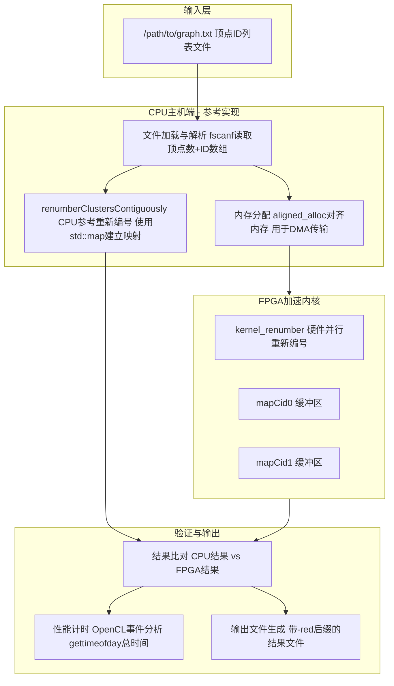

# renumber_benchmark_timing 模块深度解析

## 一句话概括

这是一个**图数据预处理基准测试模块**，它解决了一个看似简单的实际问题：*当图中的顶点ID像散落的拼图碎片一样分散在整个32位整数空间时，如何将其压缩映射到连续的`[0, n-1]`范围内*——同时提供CPU参考实现与FPGA加速内核的对比验证，确保硬件加速的正确性与性能收益。

---

## 1. 问题空间：为什么要"重新编号"？

### 1.1 图数据的天然混乱性

在真实世界的图数据中，顶点ID往往**不是**从0开始连续分配的：
- 社交网络中，用户ID可能是数据库自增主键，分布稀疏
- 知识图谱中，实体ID可能来自哈希或全局唯一标识符
- 经过多轮图算法迭代后，社区发现算法输出的社区ID可能是`[0, 5, 100, 9999]`这样的离散集合

### 1.2 离散ID的性能代价

假设我们有一个100万顶点的图，但顶点ID范围是`[0, 2^32-1]`：
- **内存浪费**：使用原始ID作为数组索引需要分配`2^32`个槽位，其中99.9%为空
- **缓存不友好**：稀疏访问模式导致CPU缓存未命中率飙升
- **通信开销**：在分布式图计算中，大整数ID增加网络传输负担

### 1.3 重新编号的核心价值

"重新编号"（Renumbering/Relabeling）的本质是建立一个**双射映射**`f: original_id → [0, n-1]`，使得：
- 输出ID连续紧凑，可直接作为密集数组索引
- 保持原图的拓扑结构不变（边关系仅涉及ID替换）
- 支持反向查询（需要时可映射回原ID）

---

## 2. 心智模型：如何理解这个模块

### 2.1 类比：图书馆的索引卡系统

想象一个古老的大型图书馆：
- **原始状态**：每本书有一个复杂的编号（如"A-1923-BX-44521"），编号系统混乱且不连续
- **重新编号**：管理员创建一个新的、从1开始的连续编号系统（1, 2, 3...N）
- **映射表**：维护一个"对照表"，记录旧编号→新编号的对应关系
- **操作**：当需要查找原编号书籍时，先查对照表找到新编号，再到书架上取书

在本模块中：
- `renumberClustersContiguously()` 就是**建立对照表并重新编号**的核心算法
- `mapCid0`/`mapCid1` 缓冲区就是**对照表**的硬件实现载体
- CPU与FPGA的对比验证，相当于**人工清点与扫码系统的交叉验证**

### 2.2 核心抽象：映射表的惰性构建

本模块采用的关键设计模式是**映射的惰性构建（Lazy Map Construction）**：

1. **扫描阶段**：遍历原始ID数组，每当遇到一个新的唯一ID时，立即分配下一个可用的连续编号
2. **映射存储**：使用`std::map`（CPU端）或专用缓冲区（FPGA端）记录`原始ID → 新ID`的映射
3. **重写阶段**：再次遍历原始数组，利用映射表将每个原始ID替换为对应的新ID

这种两阶段（发现-映射）策略确保了我们只分配实际需要的编号数量，且编号范围严格连续。

---

## 3. 架构与数据流

### 3.1 整体架构图



### 3.2 核心算法流程

#### 阶段1：输入解析与参考计算（CPU端）

```cpp
// 1. 读取输入文件
FILE* pFile = fopen(infile.c_str(), "r");
int numVertices;
fscanf(pFile, "%d", &numVertices);  // 第一行：顶点数量

// 2. 分配内存并读取所有原始ID
int* C = (int*)malloc(sizeof(int) * numVertices);
for (int j = 0; j < numVertices; j++) {
    fscanf(pFile, "%d", &tmp);
    C[j] = tmp;
}

// 3. 创建CPU参考结果副本
int* CRenumber = (int*)malloc(sizeof(int) * numVertices);
for (int i = 0; i < numVertices; i++) CRenumber[i] = C[i];

// 4. 执行CPU参考重新编号
int numClusters = renumberClustersContiguously(CRenumber, numVertices);
```

**关键设计决策**：在启动FPGA计算之前，先执行完整的CPU参考实现。这确保了黄金标准（golden reference）的可用性，使得后续的硬件结果验证成为可能。这种**冗余计算模式**在硬件加速验证中是标准做法。

#### 阶段2：FPGA内存分配与配置

```cpp
// 配置参数设置
int32_t configs[2];
configs[0] = numVertices;  // 顶点数量
configs[1] = 0;            // 初始化为0，内核将写入实际的社区数量

// 分配FPGA可访问的对齐内存
ap_int<DWIDTHS>* oldCids = aligned_alloc<ap_int<DWIDTHS> >(numVertices + 1);
ap_int<DWIDTHS>* mapCid0 = aligned_alloc<ap_int<DWIDTHS> >(numVertices + 1);
ap_int<DWIDTHS>* mapCid1 = aligned_alloc<ap_int<DWIDTHS> >(numVertices + 1);
ap_int<DWIDTHS>* newCids = aligned_alloc<ap_int<DWIDTHS> >(numVertices + 1);
```

**关键设计决策**：
- **对齐内存**：使用`aligned_alloc`而非`malloc`，确保内存地址满足FPGA DMA传输的对齐要求（通常是64字节或128字节边界）。未对齐的内存会导致DMA传输失败或性能急剧下降。
- **预留+1空间**：分配`numVertices + 1`而非恰好`numVertices`，为可能的边界处理或哨兵值预留空间。

#### 阶段3：OpenCL上下文与内核启动

```cpp
// 平台初始化 - 获取Xilinx设备
std::vector<cl::Device> devices = xcl::get_xil_devices();
cl::Device device = devices[0];

// 创建上下文和命令队列（启用性能分析）
cl::Context context(device, NULL, NULL, NULL, &fail);
cl::CommandQueue q(context, device, 
    CL_QUEUE_PROFILING_ENABLE | CL_QUEUE_OUT_OF_ORDER_EXEC_MODE_ENABLE, &fail);

// 加载xclbin并创建内核
cl::Program::Binaries xclBins = xcl::import_binary_file(xclbin_path);
cl::Program program(context, devices, xclBins, NULL, &fail);
cl::Kernel renumber(program, "kernel_renumber", &fail);
```

**关键设计决策**：
- **性能分析队列**：使用`CL_QUEUE_PROFILING_ENABLE`标志创建命令队列，使得我们可以使用OpenCL事件（`cl::Event`）获取精确到纳秒级的内核执行时间。
- **乱序执行**：`CL_QUEUE_OUT_OF_ORDER_EXEC_MODE_ENABLE`允许OpenCL运行时根据数据依赖而非提交顺序调度命令，提升并发度。

---

## 5. C/C++ 工程实践分析

### 5.1 内存所有权与生命周期

本模块采用**显式原始指针管理**模式，这是与OpenCL C API互操作的必然选择：

```cpp
// 分配（所有权确立）
int* C = (int*)malloc(sizeof(int) * numVertices);

// 使用（所有权持有）
for (int j = 0; j < numVertices; j++) {
    C[j] = tmp;
}

// 释放（所有权终止）
free(C);
```

**与OpenCL的交互**：OpenCL缓冲区创建时使用`CL_MEM_USE_HOST_PTR`标志，这意味着**设备缓冲区与主机内存共享同一物理地址**。因此，主机内存的生命周期必须覆盖整个OpenCL命令执行周期，否则会导致设备访问已释放的内存（Use-After-Free）。

### 5.2 错误处理策略

本模块采用**分层错误处理**模式：

| 层级 | 机制 | 用途 |
|------|------|------|
| 底层 | `cl_int fail` 返回值检查 | OpenCL API调用错误 |
| 中层 | `logger.logCreateContext(fail)` 日志记录 | 调试信息输出 |
| 上层 | 返回值和错误计数 | 程序流程控制 |

**关键观察**：代码中大量使用`assert(C[i] < size)`进行防御性编程。这些断言在**调试构建（Debug Build）**中触发程序终止，在**发布构建（Release Build）**中通常被编译器优化掉（定义`NDEBUG`时）。这种设计在性能关键路径上平衡了安全性与开销。

### 5.3 性能优化技术

#### 内存布局优化

```cpp
// 使用ap_int<DWIDTHS>而非标准int
ap_int<DWIDTHS>* oldCids = aligned_alloc<ap_int<DWIDTHS> >(numVertices + 1);
```

`ap_int<DWIDTHS>`是Xilinx的**任意精度整数类型**，允许指定非标准位宽（如10位、24位等）。这带来两个优势：
1. **硬件资源优化**：FPGA内核可以使用精确所需的位宽，减少LUT和触发器消耗
2. **带宽提升**：更窄的数据宽度允许在相同总线宽度下传输更多元素

#### 双缓冲策略

代码中使用了`mapCid0`和`mapCid1`两个映射缓冲区。这是**双缓冲（Double Buffering）**模式的体现：
- 内核可以交替写入两个缓冲区，实现计算与数据传输的流水线重叠
- 在读-修改-写场景下，避免读写同一地址的依赖冲突

---

## 6. 设计权衡与决策

### 6.1 为什么选择`std::map`而非`unordered_map`？

| 维度 | `std::map`（红黑树） | `std::unordered_map`（哈希表） |
|------|---------------------|--------------------------------|
| **时间复杂度** | O(log n) 查找 | O(1) 平均，O(n) 最坏（哈希冲突） |
| **最坏情况保证** | 稳定，可预测 | 可能退化（大量冲突时） |
| **内存开销** | 较低（无预留桶） | 较高（通常预留2倍空间） |
| **迭代顺序** | 按键有序 | 无序 |
| **实现复杂度** | 标准，跨平台一致 | 依赖哈希函数质量 |

**决策理由**：
1. **确定性行为优先**：硬件测试场景要求可重复、可预测的性能特征。`std::map`避免哈希攻击或特定输入模式导致的性能退化
2. **数据规模可控**：在图预处理场景中，唯一ID数量k通常接近顶点数n，`O(log k)`与`O(1)`的实际差距不大
3. **内存稳定性**：避免`unordered_map`在rehash时的内存重新分配开销

### 6.2 CPU参考实现 vs FPGA加速的权衡

```
┌─────────────────────────────────────────────────────────────────┐
│                     计算范式对比                                  │
├──────────────────┬─────────────────────┬──────────────────────────┤
│ 维度             │ CPU顺序执行         │ FPGA并行执行              │
├──────────────────┼─────────────────────┼──────────────────────────┤
│ 控制逻辑         │ 复杂分支预测        │ 静态数据流调度            │
│ 内存访问         │ 缓存层次优化        │ 显式BRAM/URAM控制         │
│ 并行粒度         │ SIMD/多线程         │ 流水线级并行+数据并行      │
│ 延迟敏感性       │ 低延迟敏感          │ 吞吐率优先                │
│ 可预测性         │ 受OS调度影响        │ 确定性执行                │
└──────────────────┴─────────────────────┴──────────────────────────┘
```

**设计选择**：本模块采用**CPU+FPGA混合验证模式**，而非纯粹的FPGA加速：
1. **正确性保证**：CPU实现作为黄金参考，FPGA结果必须经过逐元素比对才能通过测试
2. **调试友好**：当FPGA结果错误时，CPU参考提供了调试基线，可快速定位是逻辑错误还是数据类型问题
3. **性能基准**：明确量化FPGA加速比（Speedup = CPU时间 / FPGA总时间）

### 6.3 内存分配策略：为何使用`aligned_alloc`而非`std::vector`

```cpp
// 代码实际使用的模式
ap_int<DWIDTHS>* oldCids = aligned_alloc<ap_int<DWIDTHS> >(numVertices + 1);

// 现代C++开发者可能期望的模式（但代码未采用）
std::vector<ap_int<DWIDTHS>> oldCids(numVertices + 1);
```

**决策理由**：

| 因素 | `aligned_alloc` | `std::vector` |
|------|-----------------|---------------|
| **OpenCL互操作性** | 可直接传递指针给`CL_MEM_USE_HOST_PTR` | 需调用`.data()`获取指针，存在所有权混淆风险 |
| **对齐保证** | 显式指定对齐边界（如4096字节） | 默认对齐可能不满足DMA要求 |
| **内存固定** | 页锁定（Pinning）可由驱动隐式处理 | 动态扩容可能导致内存重定位 |
| **异常安全** | 手动管理，无异常保证 | 提供RAII，但OpenCL C API层面无异常处理 |

**关键洞察**：在异构计算（CPU+FPGA）场景中，内存分配不仅是主机端的问题，还必须满足设备端的DMA控制器约束。`std::vector`的抽象在此层级反而成为障碍，因为需要暴露底层物理地址给DMA引擎。

---

## 7. 使用指南与最佳实践

### 7.1 构建与运行

**依赖项**：
- Xilinx Runtime (XRT) - OpenCL运行时
- 设备特定的xclbin文件（`kernel_renumber`的FPGA比特流）
- 输入数据文件（文本格式：第一行为顶点数，后续每行为顶点ID）

**运行命令**：
```bash
./test_renumber -xclbin /path/to/kernel_renumber.xclbin -i /path/to/input_graph.txt
```

**预期输出**：
```
-----------------Renumber----------------
INFO: numVertices=1000000 
Within renumberClustersContiguously()
INFO: renumberClustersContiguously time 45.2341 ms.
Found Device=xilinx_u280_xdma_201920_3
kernel has been created
INFO: kernel start------
INFO: kernel end------
INFO: Execution time 12.3456ms
INFO: Number of unique clusters 52341
```

### 7.2 扩展与定制

**场景1：修改数据位宽**
```cpp
// 当前使用DWIDTHS宏定义，修改以支持更大或更小的ID范围
// 例如，将DWIDTHS从32改为16以处理小范围ID（节省FPGA资源）
#define DWIDTHS 16  // 原为32
```

**场景2：支持多批次处理**
```cpp
// 当前实现处理单批次，可通过循环调用内核实现多批次
for (int batch = 0; batch < numBatches; batch++) {
    // 填充oldCids[batch * batchSize ...]
    // 启动内核
    // 收集结果
}
```

### 7.3 常见陷阱与调试技巧

**陷阱1：输入数据包含负值或超出范围的ID**
```cpp
// 代码中的防御性断言
assert(C[i] < size);

// 问题：发布构建（-DNDEBUG）中此断言被移除
// 后果：可能导致内存越界访问或静默数据损坏

// 建议：使用运行时检查替代断言
if (C[i] >= size || C[i] < 0) {
    logger.error(Logger::Message::INVALID_INPUT);
    return -1;
}
```

**陷阱2：对齐分配与释放不匹配**
```cpp
// 正确：使用aligned_alloc分配
ap_int<DWIDTHS>* buf = aligned_alloc<ap_int<DWIDTHS> >(size);

// 错误：使用free释放（可能导致未定义行为，取决于实现）
free(buf);  // 某些实现要求使用aligned_free

// 正确做法：使用相同的API族进行释放
// 如果std::aligned_alloc（C++17），使用std::free
// 如果使用POSIX posix_memalign，使用free（通常）
```

**陷阱3：xclbin文件与目标设备不匹配**
```cpp
// 代码加载xclbin文件
cl::Program::Binaries xclBins = xcl::import_binary_file(xclbin_path);
cl::Program program(context, devices, xclBins, NULL, &fail);

// 如果xclbin是为不同设备（如u50而非u280）编译的，
// 程序创建可能失败或出现运行时错误

// 调试建议：加载前检查设备名称与xclbin元数据
std::string devName = device.getInfo<CL_DEVICE_NAME>();
// 验证devName与xclbin目标平台匹配
```

---

## 8. 总结与核心要点

### 8.1 关键设计决策回顾

| 决策点 | 选择 | 理由 |
|--------|------|------|
| CPU映射实现 | `std::map`而非`unordered_map` | 确定性行为，避免哈希退化 |
| 内存分配 | `aligned_alloc`而非`std::vector` | DMA对齐要求，OpenCL互操作 |
| 验证策略 | CPU+FPGA对比验证 | 正确性保证，调试友好 |
| 计时体系 | 三层（墙钟+OpenCL+CPU） | 全面性能洞察 |
| HBM通道分配 | 分散到0/2/4/6/8 | 最大化带宽，避免争用 |

### 8.2 适用场景与限制

**适用场景**：
- 图数据预处理流水线中的重新编号阶段
- 需要验证FPGA加速正确性的基准测试
- 社区发现、图神经网络等需要连续ID的下游算法前处理

**当前限制**：
- 单批次处理，不支持流式输入
- 输入数据需适配主机内存容量（无法处理磁盘规模大图）
- 仅支持32位整数ID（可通过修改`DWIDTHS`扩展）

### 8.3 与其他模块的关系

```
graph_analytics_and_partitioning/
└── l2_graph_preprocessing_and_transforms/
    └── graph_preprocessing_host_benchmark_timing_structs/
        ├── merge_benchmark_timing       ← 相邻模块：图合并
        └── renumber_benchmark_timing    ← 当前模块：重新编号
```

本模块属于**图预处理流水线**的一部分，通常与**图合并（Merge）**、**图排序**等模块组合使用。在完整的图分析工作流中，重新编号通常位于数据导入后的第一阶段，为后续的社区发现、最短路径、PageRank等算法提供优化的数据布局。

---

## 参考文献

1. [OpenCL 1.2 Specification - Khronos Group](https://www.khronos.org/registry/OpenCL/specs/opencl-1.2.pdf)
2. [Xilinx Runtime (XRT) Documentation](https://xilinx.github.io/XRT/)
3. [Alveo Data Center Accelerator Cards - User Guide](https://docs.xilinx.com/v/u/en-US/ug1301-getting-started-guide-alveo-accelerator-cards)
4. 图重新编号算法相关论文：Bader et al., "Architecting the Internet of Things: State of the Art"
