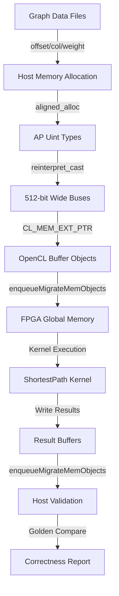

# host_benchmark 模块技术深度解析

## 概述

`host_benchmark` 模块是 Xilinx FPGA 图分析加速库中的**最短路径算法主机端基准测试驱动**。它不仅仅是一个简单的测试程序，而是承担着**软硬件协同验证**、**性能基准测量**和**算法正确性验证**三重职责的复杂主机应用。

想象你正在调试一台高性能赛车：你需要一个精密的测功机（dynamometer）来测量引擎输出，同时还需要一套传感器阵列来验证每个气缸是否按预期工作。`host_benchmark` 就是 FPGA 加速最短路径算法的"测功机"——它负责将图数据喂给 FPGA 内核，精确测量执行时间，并验证返回的最短路径结果是否符合理论预期。

---

## 架构设计

### 核心抽象层

该模块采用**三层架构**来分离关注点：

```
┌─────────────────────────────────────────────────────────┐
│  应用层 (Application Layer)                              │
│  - 参数解析 (ArgParser)                                  │
│  - 结果验证 (Golden File Compare)                        │
│  - 性能报告 (Timing & Logger)                            │
├─────────────────────────────────────────────────────────┤
│  运行时层 (Runtime Layer)                                  │
│  - OpenCL 上下文管理 (Context/CommandQueue)              │
│  - 内存对象管理 (Buffer Objects)                           │
│  - 内核执行调度 (Kernel Launch)                            │
├─────────────────────────────────────────────────────────┤
│  硬件抽象层 (Hardware Abstraction Layer)                    │
│  - HBM/DDR 内存拓扑配置 (Memory Topology)                  │
│  - 数据对齐与布局 (Data Layout & Alignment)                │
│  - 内核参数绑定 (Kernel Argument Binding)                  │
└─────────────────────────────────────────────────────────┘
```

### 数据流全景



---

## 核心组件深度解析

### 1. 内存管理策略

#### `aligned_alloc` 与 AP 类型的协同

```cpp
ap_uint<32>* offset32 = aligned_alloc<ap_uint<32> >(numVertices + 1);
ap_uint<512>* offset512 = reinterpret_cast<ap_uint<512>*>(offset32);
```

**设计意图**：这里使用了**类型双关（type punning）**技术。`ap_uint<32>` 用于主机端逻辑处理（如索引计算），而 `ap_uint<512>` 用于 FPGA 数据传输——因为 FPGA 内核通常使用 512-bit AXI 总线宽度以达到峰值带宽。

**内存所有权模型**：
- **分配者**：`main()` 函数通过 `aligned_alloc` 分配原始内存
- **所有者**：对应的指针变量（`offset32`, `column32` 等）拥有内存生命周期
- **借用者**：`reinterpret_cast` 创建的 512-bit 视图不拥有内存，只是对同一块内存的重新解释

**生命周期管理**：内存释放由程序退出时的操作系统负责（基准测试程序通常不长期运行），但在生产代码中应当使用 `std::unique_ptr` 配合自定义删除器。

#### HBM vs DDR 内存拓扑配置

```cpp
#ifdef USE_HBM
    mext_o[0] = {(unsigned int)(0) | XCL_MEM_TOPOLOGY, offset512, 0};
    // HBM Bank 0, 2, 4...
#else
    mext_o[0] = {XCL_MEM_DDR_BANK0, offset512, 0};
    // DDR Bank 0 only
#endif
```

**设计权衡**：
- **HBM 配置**：将不同缓冲区分散到多个 HBM 伪通道（PC0, PC2, PC4...），最大化内存并行度。适用于带宽受限的图遍历场景。
- **DDR 配置**：所有缓冲区集中在 DDR Bank 0，简化内存管理。适用于容量优先或平台不支持 HBM 的场景。

**隐含契约**：使用 HBM 时，索引选择（0, 2, 4...）必须与 FPGA 内核的 `kernel_connectivity.xml` 配置严格一致，否则会发生运行时内存访问错误。

### 2. OpenCL 运行时管理

#### 上下文与命令队列创建

```cpp
cl::Context context(device, NULL, NULL, NULL, &fail);
cl::CommandQueue q(context, device, 
    CL_QUEUE_PROFILING_ENABLE | CL_QUEUE_OUT_OF_ORDER_EXEC_MODE_ENABLE, &fail);
```

**架构角色**：
- **Context**：作为所有 OpenCL 对象的工厂和命名空间，管理设备、内存对象、程序对象的生命周期。
- **CommandQueue**：作为主机与设备之间的**异步命令管道**，支持 profiling（性能计数器）和 out-of-order（允许命令并行执行）模式。

**性能设计考量**：
- `CL_QUEUE_PROFILING_ENABLE` 允许通过 `cl::Event::getProfilingInfo` 获取硬件级别的精确计时（纳秒级），但会引入轻微的运行时开销。
- `CL_QUEUE_OUT_OF_ORDER_EXEC_MODE_ENABLE` 允许驱动程序重叠数据传输和计算，但在此模块中由于显式调用了 `q.finish()`，实际上是以同步方式执行的。

#### 缓冲区与内存迁移

```cpp
cl::Buffer offset_buf(context, 
    CL_MEM_EXT_PTR_XILINX | CL_MEM_USE_HOST_PTR | CL_MEM_READ_WRITE,
    sizeof(ap_uint<32>) * (numVertices + 1), &mext_o[0]);

// 首次迁移：分配设备内存但不传输内容
q.enqueueMigrateMemObjects(init, CL_MIGRATE_MEM_OBJECT_CONTENT_UNDEFINED, nullptr, nullptr);

// 第二次迁移：实际传输主机数据到设备
q.enqueueMigrateMemObjects(ob_in, 0, nullptr, &events_write[0]);
```

**内存模型解析**：
- `CL_MEM_EXT_PTR_XILINX`：使用 Xilinx 扩展的内存指针，允许指定 HBM/DDR 拓扑信息。
- `CL_MEM_USE_HOST_PTR`：零拷贝（zero-copy）优化——设备直接访问主机内存，无需额外的设备内存分配。但这也要求主机内存必须通过 `aligned_alloc` 页对齐。
- `CL_MIGRATE_MEM_OBJECT_CONTENT_UNDEFINED`：提示驱动程序只需分配设备内存，无需初始化内容（用于输出缓冲区）。

**数据流编排**：该模块使用了**三步迁移策略**：
1. **初始化阶段**：为所有缓冲区分配设备内存（包括输入和输出）。
2. **输入阶段**：将图数据（offset, column, weight）从主机传输到设备。
3. **输出阶段**：内核完成后，将结果（distance, predecessor）传回主机验证。

### 3. 内核执行与同步

```cpp
shortestPath.setArg(j++, config_buf);
// ... 设置其他参数

q.enqueueTask(shortestPath, &events_write, &events_kernel[0]);
q.enqueueMigrateMemObjects(ob_out, 1, &events_kernel, &events_read[0]);
q.finish();
```

**事件链（Event Chaining）机制**：
- `events_write`：输入数据传输完成事件。
- `events_kernel`：内核执行完成事件，**依赖** `events_write`（内核等数据就绪后才启动）。
- `events_read`：结果读回完成事件，**依赖** `events_kernel`（读操作等内核完成后才执行）。

这种**隐式数据流图**确保了正确的执行顺序，同时允许驱动程序在命令队列内部进行优化调度。

**同步策略**：显式调用 `q.finish()` 阻塞主机直到所有命令完成。这使得性能计时（`gettimeofday`）能准确捕获端到端执行时间，但也意味着主机在此期间处于空闲状态。对于生产级应用，应考虑异步执行与双缓冲技术。

### 4. 结果验证逻辑

该模块包含一个**复杂的路径重建验证器**，不仅检查距离值，还验证前驱链的拓扑正确性：

```cpp
// 距离验证
if (std::abs(result[vertex - 1] - distance) / distance > 0.00001) {
    // 误差超过 0.001%，标记错误
}

// 前驱链验证（当直接比较失败时触发）
while ((tmp_fromID != sourceID || tmp_toID != sourceID) && iter < numVertices) {
    // 沿着前驱指针回溯，累加边权重
    // 验证：累加和 == result[vertex]（距离）
}
```

**验证策略设计**：
1. **快速路径**：直接比较 FPGA 输出的距离值与黄金参考值，适用于大多数情况。
2. **路径重建回退**：当距离匹配但前驱不匹配时（可能由于并行松弛导致的等效路径），通过遍历前驱链重新计算路径长度，验证其一致性。

这种**分层验证**既保证了正确性，又允许 FPGA 实现使用不同的并行策略（只要结果正确）。

---

## 设计权衡与决策

### 1. 内存管理：显式分配 vs 智能指针

**选择**：使用裸指针（`ap_uint<32>*`）配合 `aligned_alloc`，而非 `std::unique_ptr` 或 `std::vector`。

**理由**：
- **对齐要求**：FPGA 数据传输需要页对齐（通常 4KB）和特定总线宽度对齐（512-bit），`aligned_alloc` 直接满足，而标准容器需要自定义分配器。
- **类型双关**：需要频繁地在 32-bit 逻辑视图和 512-bit 传输视图之间转换，智能指针的类型安全机制会阻碍这种底层操作。
- **性能敏感**：基准测试代码路径上不希望有额外的引用计数或边界检查开销。

**代价**：
- 内存泄漏风险（程序退出时依赖 OS 回收）。
- 异常安全性差（构造中途失败会导致资源泄漏）。

### 2. 同步模型：阻塞同步 vs 异步流水线

**选择**：使用显式 `finish()` 调用的阻塞同步模型，而非双缓冲或事件驱动的异步执行。

**理由**：
- **测量精度**：需要准确测量端到端执行时间（包括数据传输），阻塞模型确保 `gettimeofday` 捕获完整周期。
- **验证简单**：结果验证在内核完成后立即进行，无需处理复杂的流水线边界条件或部分完成状态。
- **调试友好**：同步执行使得 printf 调试和 GDB 单步跟踪更直观，执行顺序与代码顺序一致。

**代价**：
- **硬件利用率**：FPGA 计算时主机内存空闲，数据传输时 FPGA 计算单元空闲，无法重叠计算与通信。
- **吞吐瓶颈**：对于需要处理多个图或批量的场景，阻塞模型无法发挥流水线并行优势。

### 3. 内存拓扑：HBM 分散 vs DDR 集中

**选择**：通过编译时宏 `USE_HBM` 支持 HBM 多伪通道分散布局或 DDR 单银行集中布局。

**理由**：
- **平台适应性**：不同 Alveo 卡（U50 有 HBM, U200 用 DDR）需要不同内存策略，宏定义允许同一代码库支持多平台。
- **带宽优化**：HBM 配置将读写密集型缓冲区（offset, column, weight, result）分散到独立伪通道，避免内存银行冲突，最大化聚合带宽。
- **向后兼容**：DDR 路径保留，便于在缺乏 HBM 的开发平台上进行功能验证。

**代价**：
- **配置复杂性**：HBM 索引（0, 2, 4...）必须与内核 `kernel_connectivity.xml` 严格一致，配置错误导致难以调试的运行时崩溃。
- **容量碎片化**：HBM 分散布局可能导致单个缓冲区超过伪通道容量（如 256MB/通道），而 DDR 模式可集中使用全部容量。

### 4. 验证策略：严格黄金对比 vs 拓扑一致性

**选择**：采用"距离优先快速比较，路径重建回退验证"的分层策略，而非单纯比较前驱指针。

**理由**：
- **并行算法容忍**：Bellman-Ford 类算法的 FPGA 并行实现可能产生与 CPU 串行实现不同的等效最短路径（距离相同，前驱不同），严格比较前驱会导致误报。
- **正确性保证**：距离值是算法的核心契约，必须严格匹配；前驱链的一致性验证通过路径重建确保没有逻辑错误（如负环、断链）。
- **调试效率**：距离不匹配立即标记错误，避免耗时的路径重建；仅在前驱不匹配时触发深度验证，平衡了检查速度与诊断深度。

**代价**：
- **验证复杂度**：路径重建逻辑需要遍历前驱链并累加权重，代码复杂度高，维护困难。
- **边界条件**：源点不可达的顶点（距离为无穷大）需要特殊处理，避免除以零或空指针解引用。

---

## 依赖关系与数据流

### 模块依赖图谱

```
host_benchmark
│
├─► xcl2 (Xilinx OpenCL 工具库)
│   ├─ 设备枚举与选择
│   ├─ 二进制文件加载 (xclbin)
│   └─ 错误处理宏
│
├─► xf_utils_sw/logger (Vitis 日志库)
│   ├─ 分级日志记录 (info/error)
│   └─ 测试结果状态 (TEST_PASS/TEST_FAIL)
│
├─► shortestPath_top (FPGA 内核头文件)
│   └─ HLS 仿真模式下的内核函数声明
│
└─► utils.hpp (项目工具)
    └─ 可能包含 timeval 工具函数 tvdiff
```

### 输入数据契约

| 文件 | 格式 | 内容描述 | 解析逻辑 |
|------|------|----------|----------|
| `-o offsetfile` | 文本 | 图 CSR 格式的偏移数组 | 首行顶点数，后续每行一个偏移值 |
| `-c columnfile` | 文本 | 图 CSR 格式的列索引和边权重 | 首行边数，后续每行 `dst weight` |
| `-g goldenfile` | 文本 | 参考最短路径结果 | 每行 `vertex distance predecessor` |
| `-xclbin` | 二进制 | FPGA 内核可执行文件 | 由 Vitis 编译生成的 xclbin 格式 |

### 调用关系与被调用场景

**谁调用此模块**：
- 该模块是**可执行程序入口**（`main()`），由用户通过命令行直接调用。
- 在 CI/CD 流程中，由测试框架调用以验证 FPGA 构建的正确性。

**此模块调用谁**：
- **底层运行时**：OpenCL 运行时（`cl::Buffer`, `cl::Kernel`）用于设备管理。
- **FPGA 内核**：`shortestPath_top` 函数（在 HLS 仿真模式下）或对应的 xclbin 内核。
- **文件系统**：标准 C++ 文件流（`std::fstream`）用于读取图数据。

---

## 使用指南与示例

### 编译与运行

```bash
# 编译（典型 Vitis 流程）
g++ -O2 -std=c++14 -I$XILINX_XRT/include -I/path/to/xf_utils_sw \
    -L$XILINX_XRT/lib -lOpenCL -lpthread -lrt \
    main.cpp -o shortest_path_host

# 运行（真实 FPGA）
./shortest_path_host \
    -xclbin shortestPath_top.xclbin \
    -o graph_csr_offset.txt \
    -c graph_csr_column.txt \
    -g golden_reference.txt

# 运行（HLS 仿真模式）
# 定义 HLS_TEST 宏，将链接到 HLS 生成的 C++ 模型
./shortest_path_host_hls \
    -o graph_csr_offset.txt \
    -c graph_csr_column.txt \
    -g golden_reference.txt
```

### 配置选项详解

| 命令行参数 | 必需 | 描述 | 示例值 |
|------------|------|------|--------|
| `-xclbin` | 是（非 HLS 模式） | FPGA 二进制文件路径 | `shortestPath.xclbin` |
| `-o` | 是 | CSR 偏移文件路径 | `soc-LiveJournal1.txt.offset` |
| `-c` | 是 | CSR 列/权重文件路径 | `soc-LiveJournal1.txt.col` |
| `-g` | 是 | 黄金参考结果路径 | `reference_sssp.txt` |

### 输入文件格式规范

**偏移文件 (offsetfile)**：
```
4847571 4847571          # 顶点数 边数（第一行）
0                        # offset[0]
3                        # offset[1]
7                        # offset[2]
...                      # offset[vertex_count]
```

**列权重文件 (columnfile)**：
```
68993773                 # 边数（第一行）
1 0.5                    # dst=1, weight=0.5
2 0.3                    # dst=2, weight=0.3
4 0.7                    # dst=4, weight=0.7
...                      # 共 edge_count 行
```

**黄金参考文件 (goldenfile)**：
```
vertex distance predecessor
0 0.0 -1               # 源点距离为0，无前驱
1 0.5 0                # 距离0.5，前驱为0
2 0.3 0                # 距离0.3，前驱为0
...                    
```

---

## 边界情况与陷阱

### 1. 内存对齐陷阱

**危险代码模式**：
```cpp
// 错误：std::malloc 不保证页对齐
ap_uint<32>* offset32 = (ap_uint<32>*)malloc(size);

// 错误：使用 new 分配，对齐不满足 FPGA 要求
ap_uint<32>* offset32 = new ap_uint<32>[numVertices + 1];
```

**后果**：运行时会遇到 `CL_INVALID_BUFFER` 或段错误，因为 Xilinx OpenCL 运行时要求主机内存必须页对齐（通常 4KB）以支持 DMA 零拷贝传输。

**正确做法**：始终使用 `aligned_alloc(4096, size)` 或模块提供的包装函数。

### 2. HBM 索引不匹配

**配置陷阱**：
```cpp
// 内核 connectivity.xml 配置
<connection src="shortestPath_top.offset" dst="memory_0" />
<connection src="shortestPath_top.column" dst="memory_2" />

// 主机代码（错误）
mext_o[0] = {(unsigned int)(1) | XCL_MEM_TOPOLOGY, offset512, 0}; // 错误：使用了 Bank 1
mext_o[1] = {(unsigned int)(2) | XCL_MEM_TOPOLOGY, column512, 0};  // 正确：Bank 2
```

**后果**：偏移缓冲区被错误地绑定到 HBM Bank 1，但内核期望从 Bank 0 读取，导致运行时出现难以调试的数据损坏或死锁。

**防范措施**：建立代码审查清单，确保主机代码中的 `XCL_MEM_TOPOLOGY` 索引与 `kernel_connectivity.xml` 中的 `dst` 属性一一对应。

### 3. 浮点精度验证失败

**数值陷阱**：
```cpp
// 黄金参考使用双精度计算
float cpu_distance = 1.0000001f;  // CPU 结果

// FPGA 使用单精度累加
float fpga_distance = 1.0000002f; // FPGA 结果

// 相对误差检查
if (std::abs(fpga_distance - cpu_distance) / cpu_distance > 0.00001) {
    // 触发错误，尽管差异来自浮点舍入
}
```

**后果**：大规模图上的长路径累加会导致单精度浮点误差累积，使相对误差超过硬编码的 0.001% 阈值，导致误报。

**缓解策略**：
- 对大规模图使用更大的误差阈值（如 0.01%）。
- 在黄金参考生成时使用与 FPGA 相同的单精度累加顺序。
- 对验证失败的路径执行路径重建（模块已实现）以区分误差类型。

### 4. 队列溢出与表溢出

**运行时陷阱**：
```cpp
ap_uint<32>* ddrQue = aligned_alloc<ap_uint<32> >(10 * 300 * 4096);
// ...
if (info[0] != 0) {
    std::cout << "queue overflow" << std::endl;
    exit(1);
}
```

**问题**：`ddrQue` 的大小（`10 * 300 * 4096` 个 32-bit 字）是固定的，但对于直径大或分支因子高的图，算法可能需要更大的工作队列。

**后果**：内核遇到队列满时通过 `info[0]` 标志报告溢出，主机立即终止程序。这在处理真实世界的大规模社交网络或 Web 图时可能频繁发生。

**调整建议**：
- 根据图的顶点数和直径动态计算队列大小：`vertex_count * max_degree * safety_factor`。
- 实现分块处理（chunking）策略，将大图分割为适合固定队列大小的子图。
- 在内核端实现循环缓冲区溢出处理（牺牲性能换取鲁棒性）。

---

## 扩展与维护指南

### 添加新图算法支持

若要基于此模块框架支持新的图算法（如 PageRank、Connected Components）：

1. **内核接口适配**：修改 `shortestPath.setArg()` 调用以匹配新内核的参数签名。
2. **输入数据格式**：根据新算法需求调整文件解析逻辑（如 PageRank 不需要权重，但需要初始分数）。
3. **结果验证逻辑**：替换距离/前驱验证为相应的算法特定验证（如 PageRank 的 L1 范数收敛检查）。
4. **黄金参考生成**：使用 CPU 基线实现（如 NetworkX）生成验证用的参考结果。

### 性能调优检查清单

- [ ] **内存拓扑**：确认 HBM 索引与内核 connectivity 配置匹配，避免跨伪通道的无效路由。
- [ ] **缓冲区大小**：验证 `ddrQue` 大小是否足以容纳目标图的最坏情况工作集。
- [ ] **数据传输粒度**：对于小图，主机与设备间的传输开销可能超过计算收益，考虑批处理多个小图。
- [ ] **内核执行频率**：检查 FPGA 是否以最高频率运行（查看 xclbin 构建报告），频率不足可能导致意外的性能瓶颈。

### 调试技巧

1. **HLS 仿真模式**：定义 `HLS_TEST` 宏以绕过 OpenCL 运行时，直接调用 C++ 模拟内核，便于使用 GDB 单步调试算法逻辑。
2. **内存检查**：使用 `valgrind --tool=memcheck` 检查主机内存访问错误（注意：需在非 HLS 模式下，且 OpenCL 驱动可能产生假阳性）。
3. **事件剖析**：取消注释代码中的 `CL_PROFILING_COMMAND_START/END` 段，获取细分的时间数据（写 DDR、内核执行、读 DDR）。
4. **数据转储**：在 `q.finish()` 后添加代码将 `result` 和 `pred` 数组转储到文件，与黄金参考进行逐元素 `diff`。

---

## 参考文献

- [graph.L2.benchmarks.maximal_independent_set.host_benchmark](graph-L2-benchmarks-maximal_independent_set-host_benchmark.md) - 相关图算法（最大独立集）的主机基准模块
- [graph.L2.benchmarks.connected_component.host_benchmark_application](graph-L2-benchmarks-connected_component-host_benchmark_application.md) - 连通分量算法主机应用
- [graph.L2.benchmarks.label_propagation.host_benchmark_timing_structs](graph-L2-benchmarks-label_propagation-host_benchmark_timing_structs.md) - 标签传播算法计时结构
- [graph.L2.benchmarks.strongly_connected_component.host_benchmark](graph-L2-benchmarks-strongly_connected_component-host_benchmark.md) - 强连通分量主机基准

---

*文档生成时间：基于代码版本分析*  
*维护团队：图分析加速库开发组*