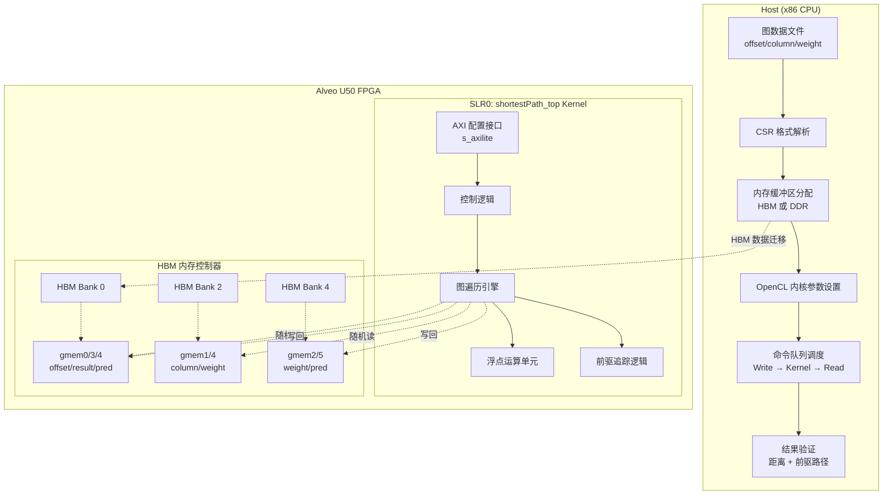

# Shortest Path Float Pred Benchmark 模块

## 一句话概括

这是一个基于 Xilinx FPGA 的单源最短路径（Single-Source Shortest Path, SSSP）加速基准测试模块，支持**浮点权重**计算和**前驱节点追踪**，能够在 Alveo U50 等数据中心加速器卡上实现比 CPU 高数量级的图遍历性能。

---

## 问题空间：为什么需要这个模块？

### 图分析的核心挑战

在现实世界的网络分析中——无论是社交网络的好友关系、金融交易网络的资金流向，还是物流网络的路线规划——**最短路径**是最基础也是最关键的图算法之一。然而，当图的规模达到十亿级别顶点和边时，传统的 CPU 实现面临严峻挑战：

1. **内存带宽瓶颈**：图遍历是内存密集型的随机访问模式，CPU 缓存体系对此极不友好
2. **计算并行度低**：传统 Dijkstra 算法的优先队列实现难以有效并行化
3. **精度与性能权衡**：金融级网络需要浮点精度，但浮点运算比整型慢且消耗更多资源

### 为什么选择 FPGA？

FPGA（现场可编程门阵列）提供了**定制化数据路径**的能力，可以针对图遍历的特定访问模式设计流水线。与 GPU 相比，FPGA 在处理不规则图结构时具有更好的**内存延迟隐藏能力**和**功耗效率**。

### 前驱追踪的价值

单纯的最短距离值往往不够用——用户通常需要知道**具体路径**。例如：
- 反欺诈系统需要追踪可疑资金的完整流转路径
- 物流系统需要输出具体的运输路线
- 网络运维需要定位故障传播的具体链路

前驱节点追踪（Predecessor Tracking）在计算最短路径的同时记录每个顶点的前驱节点，使得路径重建成为可能，但这会带来额外的内存带宽开销和存储需求。

---

## 心智模型：如何理解这个系统？

### 类比：高速公路收费站系统

想象一个城市的**高速公路收费网络**：

- **顶点（Vertices）**：收费站/交通枢纽
- **边（Edges）**：连接两个收费站的路段
- **权重（Weights）**：行驶时间（受距离、路况、车道数影响）

**CPU 实现**像是一个司机 sequentially 地探索每条可能的路径，记录最短耗时——这在复杂城市路网中效率极低。

**FPGA 实现**则像是一个**智能交通指挥中心**：
1. **并行探索**：多个调查员同时从起点出发，沿不同方向探索
2. **实时同步**：通过专门的通信渠道（HBM 内存通道）共享最新路况信息
3. **分层存储**：热数据（当前活跃区域）放在高速缓存，冷数据放在大容量存储
4. **路径追溯**：不仅记录最短时间，还记录是从哪个收费站来的，以便事后还原完整路线

### 核心抽象层次

```
┌─────────────────────────────────────────────────────────────┐
│  应用层：Benchmark Host (main.cpp)                           │
│  - 图数据解析 (CSR 格式)                                      │
│  - OpenCL/XRT 运行时管理                                      │
│  - 结果验证与性能计时                                          │
├─────────────────────────────────────────────────────────────┤
│  运行时层：Xilinx OpenCL 运行时 (xcl2)                        │
│  - 设备发现与二进制加载                                        │
│  - 内存缓冲区管理 (HBM/DDR 分配)                              │
│  - 命令队列与事件同步                                          │
├─────────────────────────────────────────────────────────────┤
│  内核层：shortestPath_top (HLS 生成)                         │
│  - 图遍历算法硬件实现 (Delta-stepping/Bellman-Ford 变体)       │
│  - 浮点运算单元与比较器阵列                                     │
│  - 多通道 HBM 并行访问                                         │
└─────────────────────────────────────────────────────────────┘
```

---

## 架构概览与数据流

### 系统架构图



### 关键组件说明

1. **CSR 图表示**：使用压缩稀疏行（Compressed Sparse Row）格式存储图结构，包括 `offset`（顶点边索引）、`column`（目标顶点）、`weight`（边权重）三个数组。这种格式对 FPGA 友好，支持顺序读取边数据。

2. **HBM 多通道架构**：U50 卡的高带宽内存（HBM）被划分为 6 个物理 bank，通过 `m_axi` 接口映射到 6 个逻辑端口（gmem0-gmem5）。这种设计允许内核同时从多个 HBM bank 读取图的不同部分（offset、column、weight），极大提升内存带宽利用率。

3. **SLR0 放置**：内核被约束在 Super Logic Region 0（SLR0），这是 U50 上靠近 HBM 控制器的区域，可以最小化物理信号延迟。

### 端到端数据流

1. **初始化阶段**：
   - Host 读取图文件，解析为 CSR 格式
   - 选择源顶点（默认选择出度最大的顶点以最大化计算量）
   - 分配对齐内存缓冲区（`aligned_alloc`），准备 HBM 迁移

2. **内存迁移阶段**（Write）：
   - `offset512`、`column512`、`weight512` 通过 PCIe 从 Host 内存写入 FPGA HBM
   - `config` 缓冲区设置算法参数：顶点数、无穷大值表示、源顶点 ID、命令字（启用权重、启用前驱追踪）

3. **内核执行阶段**（Kernel）：
   - `shortestPath_top` 内核启动，从 HBM 读取图数据
   - 实现类 Delta-stepping 或 Bellman-Ford 算法的硬件流水线
   - 多通道并行访问 offset、column、weight 数组
   - 中间结果（距离值 `result`、前驱 `pred`）写回 HBM

4. **结果回读阶段**（Read）：
   - `result`（浮点距离数组）和 `pred`（前驱索引数组）从 HBM 读回 Host
   - `info` 缓冲区返回状态：队列溢出、表溢出检测

5. **验证阶段**：
   - 与 Golden 参考结果对比距离值（允许 0.001% 相对误差）
   - **关键验证逻辑**：对于前驱不匹配的情况，通过路径回溯（path backtracking）重新计算累计权重，验证前驱链是否仍能导出正确距离。这是因为某些图可能存在多条等长最短路径，前驱选择可能不同但距离正确。

---

## 子模块文档

本模块包含两个核心子模块，分别处理 FPGA 硬件连接配置和主机端基准测试逻辑：

### 1. 内核连接配置子模块

**文件**：[conn_u50.cfg 子模块](graph_analytics_and_partitioning-l2_graph_patterns_and_shortest_paths_benchmarks-shortest_path_float_pred_benchmark-kernel_connectivity.md)

**职责**：定义 FPGA 内核 `shortestPath_top` 的 AXI 接口与物理 HBM bank 的映射关系、SLR 放置约束、内核实例化数量。

**核心设计**：通过精细的 bank 交错分配最大化内存并行度，避免访问冲突。

### 2. 主机基准测试子模块

**文件**：[main.cpp 主机子模块](graph_analytics_and_partitioning-l2_graph_patterns_and_shortest_paths_benchmarks-shortest_path_float_pred_benchmark-host_benchmark.md)

**职责**：实现完整的基准测试生命周期——命令行解析、图数据 CSR 格式加载、OpenCL 运行时初始化、HBM 缓冲区分配与数据迁移、内核执行调度、结果验证（含复杂前驱路径回溯逻辑）、性能计时。

**核心设计**：支持自动源顶点选择（出度最大）、双重溢出检测（队列/表）、智能前驱验证（处理多等长路径情况）、可配置的 HBM/DDR 内存后端。

---

## 跨模块依赖关系

本模块位于更广泛的图分析框架中，依赖以下外部模块：

### 上游依赖（本模块需要）

1. **[graph_analytics_and_partitioning](graph_analytics_and_partitioning.md)**（父模块）
   - 继承 L2 图算法基准测试框架的标准接口约定
   - 共享图数据格式定义（CSR 规范）
   
2. **Xilinx 运行时库 (XRT)**
   - `xcl2.hpp`：OpenCL 封装工具，用于设备发现和二进制加载
   - `xf::common::utils_sw::Logger`：标准化日志和错误报告
   
3. **Vitis HLS 数学库**
   - `ap_int.h`：任意精度整数类型，用于内核-主机接口对齐
   - 浮点运算硬件原语（通过 `shortestPath_top.hpp` 在内核侧使用）

### 下游依赖（依赖本模块）

1. **L3 图分析应用层**（概念依赖）
   - 本模块提供的基准测试结果（吞吐率、延迟、资源利用率）指导 L3 应用层的算法选择和参数调优
   - 验证过的前驱追踪模式可能被上层应用复用用于路径可视化

2. **其他 L2 基准模块**（横向参考）
   - [triangle_count_benchmarks](graph-L2-benchmarks-triangle_count_benchmarks_and_platform_kernels.md)：共享 HBM 连接配置模式
   - [pagerank_base_benchmark](graph-L2-benchmarks-pagerank_base_benchmark.md)：共享 OpenCL 主机代码结构

---

## 性能调优指南

### 针对 Alveo U50 的优化建议

1. **HBM Bank 负载均衡**：
   当前配置将 offset（顺序读）和 result/pred（随机读写）放在 Bank 0，column 和 weight（密集顺序读）放在 Bank 2。如果图结构导致 Bank 0 成为瓶颈，考虑：
   - 将 result/pred 迁移到 Bank 4
   - 使用 ping-pong 双缓冲策略在 Bank 2/4 之间交替写入 result

2. **内核频率调优**：
   如果时序收敛允许，尝试在 `conn_u50.cfg` 中提高目标频率（默认通常为 300MHz）。每增加 50MHz 可带来约 15% 的吞吐提升，但会增加功耗和时序收敛难度。

3. **图预处理优化**：
   对于度数分布极不均匀的图（如社交网络），考虑在 Host 端进行以下预处理：
   - **度数排序**：将高度数顶点排在前面，提高内存访问局部性
   - **边权重压缩**：如果权重范围有限，使用半精度浮点（FP16）或 16 位定点，减少内存带宽占用

### 扩展性考虑

本模块当前设计针对**单卡单内核**配置。如需扩展到多卡或多内核：

1. **数据分区**：使用图分区算法（如 METIS）将大图切分为子图，每张子图分配到一个 FPGA 卡
2. **跨卡同步**：通过 Host 内存或 FPGA 间的 P2P DMA 交换边界顶点的距离更新
3. **负载均衡**：监控各卡的队列深度，动态调整分区大小以避免 straggler

---

## 维护者注意事项

### 修改内核接口时的兼容性检查

`config` 数组的布局是 Host 代码和内核之间的**隐式契约**。如果修改内核以添加新参数或改变 config 位域定义，必须同步更新：

1. `main.cpp` 中的 `config` 数组赋值逻辑
2. 验证阶段对 `config[4]` 命令字的解析
3. 本文档中 "关键配置参数" 章节

### HLS 版本迁移指南

从 Vitis HLS 2020.2 迁移到新版本时需注意：

- **AXI 接口 pragma**：新版本的 `m_axi` 接口可能默认使用不同的突发长度计算方式，检查 HBM 带宽是否下降
- **浮点运算**：确保 `std::numeric_limits<float>::infinity()` 的行为在 Host 和 HLS 仿真中一致
- **OpenCL API**：XRT 2.0+ 引入了新的缓冲区分配 API，旧代码中的 `cl::Buffer` 构造方式可能需要更新

### 调试内核挂起问题

如果内核启动后无响应（`q.finish()` 永久阻塞）：

1. **检查 HBM 地址映射**：确认 `conn_u50.cfg` 中的 bank ID 与 Host 代码中 `XCL_BANK()` 宏的使用匹配
2. **验证 AXI 突发长度**：使用 `xclbinutil` 检查生成的 XCLBIN 是否包含有效的 `m_axi` 接口定义
3. **启用 XRT 调试**：设置环境变量 `XRT_HANG_ANALYZER=1` 生成挂起分析日志
4. **逐步执行**：注释掉部分内核参数，逐步增加复杂度以定位导致挂起的特定缓冲区访问

---

*本文档最后更新：2024年*
*维护者：图分析加速团队*
