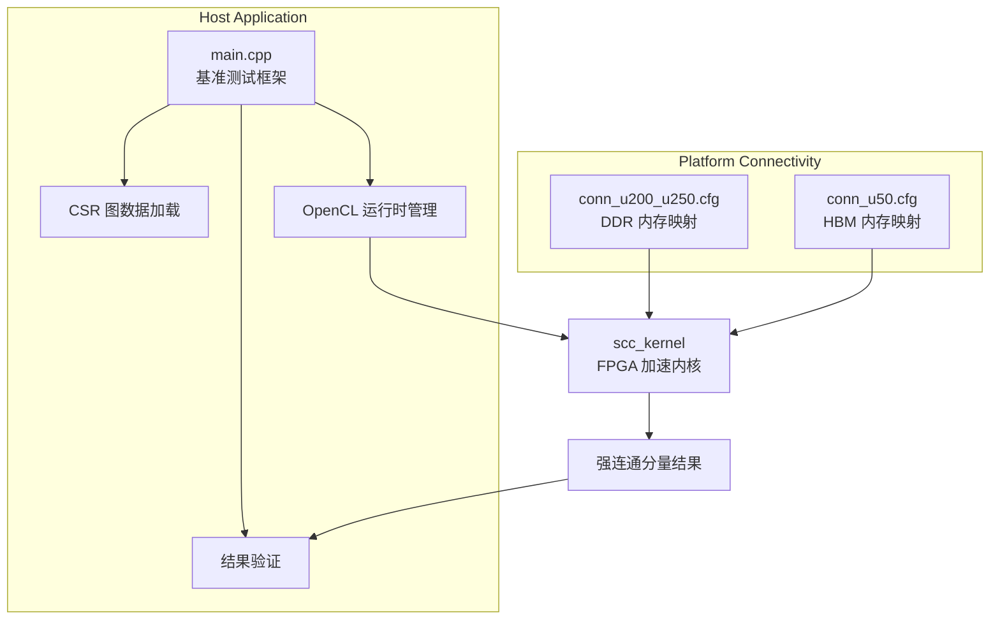
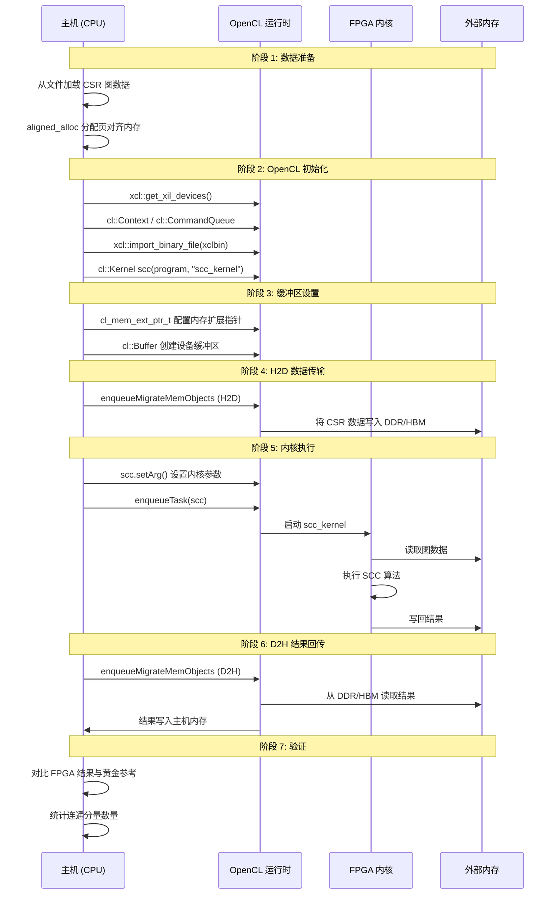

# Strongly Connected Component Benchmarks 技术深度解析

> **模块定位**: 图分析库中的强连通分量检测基准测试  
> **目标平台**: Xilinx Alveo (U200/U250/U50) 加速卡  
> **核心算法**: Tarjan/Forward-Backward 强连通分量检测的 FPGA 加速实现

---

## 1. 问题空间与设计动机

### 1.1 什么是强连通分量？

想象你正在分析一个社交网络：用户 A 关注用户 B，B 又关注 C，C 再关注 A —— 这三个人形成了一个**强连通分量**（Strongly Connected Component, SCC）。在这个子图中，每个人都可以通过某种路径到达其他人。

形式化地说，SCC 是有向图中的**极大子图**，其中任意两个顶点互相可达。SCC 检测是许多图分析任务的基石：
- **社区发现**: 识别紧密联系的社交圈
- **网页排名**: 消除垃圾网页的链接农场
- **编译优化**: 死代码消除和控制流分析
- **生物信息学**: 基因调控网络中的功能模块

### 1.2 为什么是 FPGA？

传统的 SCC 算法（如 Tarjan 或 Kosaraju）在最坏情况下需要 $O(V+E)$ 时间，但在实际的大规模图（十亿级顶点和边）上，内存访问模式成为瓶颈。图的遍历具有**不规则内存访问**特征 —— 你无法预测下一个要访问的顶点在哪里。

FPGA 提供的价值主张：
1. **内存带宽聚合**: 通过 HBM/DDR 的多通道并行访问，FPGA 可以提供数百 GB/s 的聚合带宽
2. **自定义数据路径**: 为图遍历的特定访问模式定制流水线
3. **低延迟执行**: 避免 CPU 缓存未命中和上下文切换的开销
4. **能效比**: 每瓦特性能显著优于通用处理器

### 1.3 本模块的设计目标

本模块是 **Xilinx Vitis 图分析库** 的一部分，其设计目标包括：
- **可移植性**: 支持多代 Alveo 卡（U200/U250 使用 DDR，U50 使用 HBM）
- **易用性**: 提供完整的主机端基准测试框架
- **性能可观察性**: 内置详细的性能剖析（H2D/D2H 传输、内核执行时间）
- **正确性验证**: 自动生成参考结果并对比验证

---

## 2. 心智模型：理解本模块的抽象

### 2.1 双缓冲图遍历架构

本模块的核心抽象是**双缓冲图遍历**（Double-Buffering Graph Traversal）。想象两个仓库（G1 和 G2）：
- **G1**: 当前轮次需要遍历的"活跃"图结构
- **G2**: 下一轮次将使用的"工作"图结构

算法在迭代过程中**交换**这两个缓冲区的角色，实现无锁的流水线并行。

### 2.2 CSR 稀疏矩阵表示

图数据以**压缩稀疏行**（Compressed Sparse Row, CSR）格式存储 —— 这是图分析领域的标准表示：
- `offset` 数组：长度为 `numVertices + 1`，`offset[i]` 表示第 i 个顶点的邻接表在 `column` 数组中的起始位置
- `column` 数组：长度为 `numEdges`，按顺序存储所有边的终点

这种表示的空间复杂度为 $O(V+E)$，且对图遍历非常友好：访问顶点 i 的所有邻居只需读取 `column[offset[i]]` 到 `column[offset[i+1]-1]`。

### 2.3 OpenCL 异构计算模型

本模块采用**主机-设备**异构编程模型：
- **主机端**: 在 x86 CPU 上运行，负责任务编排、数据预处理和结果验证
- **设备端**: 在 FPGA 上运行，执行核心的 SCC 检测算法

数据通过 PCIe 总线传输，使用 OpenCL 的 `cl::Buffer` 和 `enqueueMigrateMemObjects` API 管理。

---

## 3. 架构详解与数据流

### 3.1 模块组成



### 3.2 关键组件说明

#### 3.2.1 主机应用 (`main.cpp`)

主机应用是基准测试的入口，其主要职责包括：

**命令行参数解析**
- `-xclbin`: FPGA 比特流文件路径
- `-o`: CSR offset 文件路径
- `-c`: CSR column 文件路径
- `-g`: 黄金参考结果文件路径

**内存分配策略**

主机端使用 `aligned_alloc` 分配页对齐内存，确保 DMA 传输效率：

```cpp
// 图结构双缓冲
ap_uint<32>* offset32G1 = aligned_alloc<ap_uint<32>>(numVertices + 1);
ap_uint<32>* column32G1 = aligned_alloc<ap_uint<32>>(numEdges);
ap_uint<32>* offset32G2 = aligned_alloc<ap_uint<32>>(numVertices + 1);
ap_uint<32>* column32G2 = aligned_alloc<ap_uint<32>>(numEdges);

// 算法工作区
ap_uint<32>* offset32Tmp1G2 = aligned_alloc<ap_uint<32>>(numVertices + 1);
ap_uint<32>* offset32Tmp2G2 = aligned_alloc<ap_uint<32>>(numVertices + 1);
ap_uint<32>* colorMap32 = aligned_alloc<ap_uint<32>>(numVertices);
ap_uint<32>* queueG1 = aligned_alloc<ap_uint<32>>(numVertices);
ap_uint<32>* queueG2 = aligned_alloc<ap_uint<32>>(numVertices);
ap_uint<32>* result = aligned_alloc<ap_uint<32>>(numVertices);
```

**OpenCL 运行时管理**

主机代码遵循标准 Xilinx OpenCL 流程：
1. 设备发现与上下文创建
2. 命令队列配置（支持剖析和乱序执行）
3. 程序编译（加载 xclbin）
4. 内核对象创建
5. 缓冲区创建与内存扩展指针配置
6. 数据传输（H2D → Kernel → D2H）

**扩展指针配置**（关键设计）

```cpp
cl_mem_ext_ptr_t mext_o[10];
mext_o[0] = {2, column32G1, scc()};   // Bank 2
mext_o[1] = {3, offset32G1, scc()};   // Bank 3
// ...
```

扩展指针将主机缓冲区映射到特定的 FPGA 内存 bank，实现内存访问的物理分区。

**性能剖析**

代码内置了三段式计时：
- **H2D**: 主机到设备的数据传输时间
- **Kernel**: FPGA 内核执行时间
- **D2H**: 设备到主机的结果回传时间

使用 `gettimeofday` 进行粗粒度计时，`cl::Event` 的剖析信息进行细粒度分析。

**结果验证**

主机代码将 FPGA 结果与黄金参考文件对比，统计连通分量数量并逐顶点验证：

```cpp
std::unordered_map<int, int> map;
for (int i = 0; i < numVertices; i++) {
    map[result[i].to_int()] = 1;
}
std::cout << "HW components:" << map.size() << std::endl;
```

#### 3.2.2 平台连接配置 (`conn_u200_u250.cfg` 和 `conn_u50.cfg`)

这两个配置文件定义了 FPGA 内核与外部内存之间的物理连接关系。

**U200/U250 配置 (DDR)**

```ini
[connectivity]
sp=scc_kernel.m_axi_gmem0_0:DDR[0]
sp=scc_kernel.m_axi_gmem0_1:DDR[0]
...
nk=scc_kernel:1:scc_kernel
```

- `sp` (slot port): 将内核的 AXI 主接口映射到 DDR bank
- `nk` (num kernel): 实例化一个 `scc_kernel`
- U200/U250 有多个 DDR bank（通常是 4 个），配置将 16 个 `gmem0` 端口分配到 DDR[0] 和 DDR[1]

**U50 配置 (HBM)**

```ini
[connectivity]
sp=scc_kernel.m_axi_gmem0_0:HBM[0:1]
sp=scc_kernel.m_axi_gmem0_1:HBM[2:3]
...
```

- U50 使用 HBM2（High Bandwidth Memory），提供更高的聚合带宽
- 配置使用 HBM 的 pseudo-channel 机制（例如 `HBM[0:1]` 表示使用第 0 和第 1 通道）
- 这种设计允许内核以更高的并发度访问内存，充分发挥 HBM 的带宽优势

**设计意图**

这两个配置体现了**平台抽象**的设计思想：同一套内核代码通过不同的连接配置，可以适配具有不同内存架构的 FPGA 卡。这种灵活性对于产品化部署至关重要。

### 3.3 数据流全景



---

## 4. 设计决策与权衡

### 4.1 双缓冲 vs 单缓冲

**决策**: 为主图结构使用双缓冲（G1/G2）以及工作队列（queueG1/queueG2）。

**权衡分析**:

| 方案 | 优点 | 缺点 |
|------|------|------|
| **双缓冲** (当前) | 允许流水线并行；读写分离避免数据竞争；支持迭代算法的原位更新 | 2x 内存占用；更复杂的缓冲区管理 |
| **单缓冲** | 内存效率高；实现简单 | 无法并行读写；迭代算法需要额外的临时存储 |

**设计意图**: SCC 算法（特别是基于 Forward-Backward 的方法）本质上是迭代的：每一轮遍历都会更新顶点的状态，下一轮需要基于更新后的图结构。双缓冲让内核可以在一个缓冲区上读取的同时，在另一个缓冲区上写入，形成流水线。

### 4.2 DDR vs HBM 内存架构适配

**决策**: 通过连接配置文件支持两种内存架构，而不是条件编译。

**权衡分析**:

| 方案 | 优点 | 缺点 |
|------|------|------|
| **连接配置** (当前) | 内核代码完全不变；清晰的硬件抽象；易于添加新平台 | 需要为每种平台维护独立的 .cfg 文件 |
| **条件编译** | 单一文件；编译时优化 | 代码可读性下降；平台逻辑侵入算法实现 |
| **运行时检测** | 最大灵活性 | 运行时开销；需要动态内存管理 |

**设计意图**: 将**平台连接**与**算法逻辑**解耦是 HLS 设计的核心原则。`conn_u200_u250.cfg` 和 `conn_u50.cfg` 作为"硬件清单"，告诉 v++ 链接器如何将内核端口映射到物理内存控制器。内核代码只看到抽象的 `m_axi_gmem0_X` 接口。

### 4.3 OpenCL 主机代码 vs 裸机驱动

**决策**: 使用基于 OpenCL 的 Xilinx 运行时（XRT）而不是裸机驱动。

**权衡分析**:

| 方案 | 优点 | 缺点 |
|------|------|------|
| **OpenCL/XRT** (当前) | 跨平台兼容；成熟的内存管理；内置剖析工具；与 Vitis 工具链集成 | 运行时开销；依赖 Xilinx 库 |
| **裸机驱动** | 最低延迟；完全控制；零依赖 | 需要重新实现内存管理；平台绑定；调试困难 |

**设计意图**: 对于**基准测试**场景，可移植性和可维护性优先于极限性能。OpenCL 提供了标准化的方式来查询设备、管理内存队列和执行内核。`xcl2.hpp` 和 `xf_utils_sw/logger.hpp` 是 Xilinx 提供的标准辅助库。

### 4.4 扩展指针 vs 普通缓冲区

**决策**: 使用 `cl_mem_ext_ptr_t` 将主机缓冲区显式映射到 FPGA 内存 bank。

**设计意图**: 这是 FPGA 异构计算的关键优化。通过扩展指针，我们告诉 XRT："这个缓冲区应该分配到特定的内存 bank"。这使得：
- **显式内存分区**: 不同的数据流可以被路由到不同的内存通道，避免争用
- **物理亲和性**: 内核端口可以直接连接到最近的内存控制器
- **可预测性能**: 消除运行时内存分配的不可预测性

### 4.5 HLS 仿真 vs 硬件执行

**决策**: 通过 `HLS_TEST` 宏支持纯 C++ 仿真和 FPGA 硬件执行两种模式。

**代码体现**:
```cpp
#ifndef HLS_TEST
    // OpenCL 硬件执行路径
    cl::Kernel scc(program, "scc_kernel", &err);
    // ... 缓冲区设置、数据传输、内核执行 ...
#else
    // HLS 纯 C++ 仿真路径
    scc_kernel(numEdges, numVertices, (ap_uint<512>*)column32G1, ...);
#endif
```

**设计意图**: 这是 HLS 开发的最佳实践。`HLS_TEST` 模式允许：
- **快速迭代**: 在不编译 FPGA 比特流的情况下验证算法逻辑
- **调试友好**: 使用 GDB 等标准工具单步调试内核代码
- **功能验证**: 确保算法正确性后再投入长时间的 FPGA 编译

---

## 5. 代码深度分析

### 5.1 内存所有权与生命周期

**主机端缓冲区**:

| 缓冲区 | 分配者 | 所有者 | 用途 | 生命周期 |
|--------|--------|--------|------|----------|
| `offset32G1`, `column32G1` | `main()` | 主机 | 原始 CSR 图数据 | 从文件加载到程序结束 |
| `offset32G2`, `column32G2` | `main()` | 主机 | 双缓冲的第二副本 | 同 G1 |
| `offset32Tmp1/2G2` | `main()` | 主机 | 临时偏移量缓冲区 | 内核执行期间 |
| `colorMap32` | `main()` | 主机 | 顶点着色/状态映射 | 内核执行期间 |
| `queueG1`, `queueG2` | `main()` | 主机 | BFS/遍历队列 | 内核执行期间 |
| `result` | `main()` | 主机 | SCC 检测结果 | 内核执行到验证结束 |

**关键设计**: 所有主机缓冲区都使用 `aligned_alloc` 分配，确保 4KB 页对齐，满足 XRT 对 DMA 缓冲区的要求。

**OpenCL 缓冲区所有权**:

```cpp
cl::Buffer columnG1_buf = cl::Buffer(
    context, 
    CL_MEM_EXT_PTR_XILINX | CL_MEM_USE_HOST_PTR | CL_MEM_READ_WRITE,
    sizeof(ap_uint<32>) * numEdges, 
    &mext_o[0]
);
```

- `CL_MEM_USE_HOST_PTR`: OpenCL 缓冲区不分配新内存，而是"借用"主机已分配的缓冲区
- 所有权：主机仍然负责 `free()`，OpenCL 只获得访问权
- 生命周期：OpenCL 缓冲区对象必须在所有命令（如 `enqueueMigrateMemObjects`）完成后才能销毁

### 5.2 错误处理策略

**错误处理模式**: 本模块采用**立即失败**（fail-fast）策略，结合日志记录：

**文件 I/O 错误**:
```cpp
std::fstream offsetfstream(offsetfile.c_str(), std::ios::in);
if (!offsetfstream) {
    std::cout << "Error : " << offsetfile << " file doesn't exist !" << std::endl;
    exit(1);  // 立即终止
}
```

**OpenCL 错误**:
```cpp
cl::CommandQueue q(context, device, CL_QUEUE_PROFILING_ENABLE | CL_QUEUE_OUT_OF_ORDER_EXEC_MODE_ENABLE, &err);
logger.logCreateCommandQueue(err);  // 使用 logger 记录错误
```

使用 `xf::common::utils_sw::Logger` 提供标准化的错误分类：
- `TEST_PASS` / `TEST_FAIL`: 功能验证结果
- `TIME_H2D_MS`: H2D 传输时间
- `TIME_KERNEL_MS`: 内核执行时间
- `TIME_D2H_MS`: D2H 传输时间

**设计意图**: 作为基准测试程序，严格的错误处理确保测试结果的可靠性。任何异常（文件缺失、OpenCL 错误、验证失败）都会立即报告，防止静默错误影响基准测试的有效性。

### 5.3 并发与线程安全

**线程模型**: 本模块是**单线程**设计。虽然 OpenCL 命令队列配置了 `CL_QUEUE_OUT_OF_ORDER_EXEC_MODE_ENABLE`，但这仅允许命令之间的并行，不涉及主机端多线程。

**无并发风险**: 所有状态（命令队列、缓冲区、内核对象）都在单线程上下文中操作，无需锁保护。

**设计意图**: 基准测试程序的首要目标是**可重复性**和**简单性**。引入多线程会增加不确定性（如调度抖动），影响性能测量的准确性。

### 5.4 性能架构

**热路径识别**:

1. **文件 I/O 路径**（冷路径）:
   ```cpp
   while (offsetfstream.getline(line, sizeof(line))) {
       std::stringstream data(line);
       data >> offset32G1[index];
       index++;
   }
   ```
   - 仅在初始化时执行一次
   - 使用标准 C++ I/O，非性能关键

2. **OpenCL 执行路径**（热路径）:
   ```cpp
   q.enqueueMigrateMemObjects(ob_in, 0, nullptr, &events_write[0]);
   q.enqueueTask(scc, &events_write, &events_kernel[0]);
   q.enqueueMigrateMemObjects(ob_out, 1, &events_kernel, &events_read[0]);
   q.finish();
   ```
   - 这是核心性能路径
   - 使用事件依赖链（`&events_write` → `&events_kernel`）实现流水线

**数据布局**:

- **页对齐**: `aligned_alloc` 确保 DMA 传输效率
- **交错访问**: 不同缓冲区映射到不同内存 bank，避免银行冲突
- **宽度优化**: 使用 `ap_uint<512>` 在 HLS 模式下最大化内存带宽利用率

**算法复杂度**:

SCC 检测的算法复杂度为 $O(V+E)$，但本模块的核心价值在于**常数因子优化** —— 通过 FPGA 的并行流水线和 HBM/DDR 的高带宽，将理论复杂度转化为实际的吞吐率（edges/second）。

---

## 6. 子模块分解

本模块包含三个核心文件，每个承担不同的职责：

### 6.1 `main.cpp` - 基准测试框架

**职责**: 提供完整的主机端基准测试环境，包括数据加载、设备管理、执行调度和结果验证。

**关键抽象**:
- `ArgParser`: 命令行参数解析
- OpenCL 对象生命周期管理（Context/CommandQueue/Program/Kernel）
- 事件驱动的异步执行模型

**依赖关系**:
- 外部: `xcl2.hpp`, `xf_utils_sw/logger.hpp` (Xilinx 运行时库)
- 内部: `scc_kernel.hpp` (内核头文件，定义内核接口)

### 6.2 `conn_u200_u250.cfg` - DDR 平台连接配置

**职责**: 为 Alveo U200/U250 卡定义内核到 DDR 内存的物理连接映射。

**关键决策**:
- 使用 DDR[0] 和 DDR[1] 两个 bank 分散负载
- 16 个 `gmem0` 端口分配到两个 bank，实现并行访问

**适用场景**: 需要大容量内存（DDR 通常提供 64GB+）的图分析任务。

### 6.3 `conn_u50.cfg` - HBM 平台连接配置

**职责**: 为 Alveo U50 卡定义内核到 HBM 内存的物理连接映射。

**关键决策**:
- 使用 HBM 的 pseudo-channel 机制（如 `HBM[0:1]` 表示连续的两个通道）
- 16 个 `gmem0` 端口分散到多个 HBM 通道，最大化带宽利用率
- 独立的 `gmem1` 端口用于结果输出

**适用场景**: 需要高带宽（HBM 提供 460GB/s+）的内存密集型图遍历任务。

---

## 7. 关键设计模式

### 7.1 平台抽象模式

```cpp
// 相同的内核接口，不同的物理连接
// U200/U250: sp=scc_kernel.m_axi_gmem0_0:DDR[0]
// U50:       sp=scc_kernel.m_axi_gmem0_0:HBM[0:1]
```

**价值**: 内核代码 100% 复用，通过配置实现多平台支持。

### 7.2 零拷贝内存模式

```cpp
// 主机分配页对齐内存
ap_uint<32>* buffer = aligned_alloc<ap_uint<32>>(size);

// OpenCL 缓冲区使用主机指针，不额外分配
cl::Buffer cl_buf(context, CL_MEM_USE_HOST_PTR, size, buffer);

// DMA 直接在主机内存和设备间传输
enqueueMigrateMemObjects(...);
```

**价值**: 避免主机-设备间的额外内存拷贝，降低延迟和内存占用。

### 7.3 事件链流水线模式

```cpp
std::vector<cl::Event> events_write(1);
std::vector<cl::Event> events_kernel(1);
std::vector<cl::Event> events_read(1);

// H2D → Kernel → D2H 依赖链
q.enqueueMigrateMemObjects(ob_in, 0, nullptr, &events_write[0]);
q.enqueueTask(scc, &events_write, &events_kernel[0]);
q.enqueueMigrateMemObjects(ob_out, 1, &events_kernel, &events_read[0]);
```

**价值**: 自动流水线化，Kernel 执行可以与 D2H 传输重叠（对于多图处理场景）。

---

## 8. 使用指南与注意事项

### 8.1 构建与运行

**前提条件**:
- Xilinx Vitis 工具链（2020.2 或更新版本）
- Alveo 目标平台（U200/U250/U50）及对应 shell
- XRT（Xilinx Runtime）安装

**构建流程**:
```bash
# 设置环境
source /opt/xilinx/xrt/setup.sh
source /opt/xilinx/vitis/202x.x/settings64.sh

# 编译主机代码
g++ -O2 -std=c++14 -I$XILINX_XRT/include main.cpp -o scc_host \
    -L$XILINX_XRT/lib -lOpenCL -lpthread

# 编译 FPGA 内核（以 U250 为例）
v++ -t hw -f xilinx_u250_gen3x16_xdma_3_1_202020_1 \
    --config conn_u200_u250.cfg -k scc_kernel -o scc.xclbin scc_kernel.cpp
```

**运行基准测试**:
```bash
./scc_host -xclbin ./scc.xclbin \
           -o ./data/test_offset.csr \
           -c ./data/test_column.csr \
           -g ./data/test_golden.mtx
```

### 8.2 输入数据格式

**CSR Offset 文件** (`.csr`):
```
6               # 第一行：顶点数
0               # offset[0]
2               # offset[1]
3               # offset[2]
5               # offset[3]
...
```

**CSR Column 文件** (`.csr`):
```
8               # 第一行：边数
1               # column[0]: 顶点 0 的第一个邻居
3               # column[1]: 顶点 0 的第二个邻居
2               # column[2]: 顶点 1 的第一个邻居
...
```

**黄金参考文件** (`.mtx`):
```
3               # 第一行：连通分量数量
1 1             # 顶点 1 属于分量 1
2 1             # 顶点 2 属于分量 1
3 2             # 顶点 3 属于分量 2
...
```

### 8.3 性能调优建议

**1. 图数据预处理**:
- 确保图数据已经过**重编号**（renumbering），使顶点 ID 连续，最大化 CSR 的空间局部性
- 对于高度数顶点，考虑使用 CSR 的变体（如 CSR Segmented）以优化负载均衡

**2. 内存布局优化**:
- 如果有多个图需要连续处理，考虑使用**双缓冲**或**乒乓缓冲**重叠数据传输和计算
- 利用 `enqueueMigrateMemObjects` 的异步特性，在 FPGA 执行当前图的同时预取下一个图

**3. 内核参数调优**:
- 内核的 `ap_uint<512>` 数据宽度暗示了 512-bit AXI 总线宽度；确保图数据在内存中 64-byte 对齐
- 如果图较小，考虑批处理多个图以摊销 PCIe 传输开销

### 8.4 常见陷阱与排查

**问题 1: "ERROR: xclbin path is not set!"**
- **原因**: 未提供 `-xclbin` 参数
- **解决**: 确保指定了正确的 `.xclbin` 文件路径

**问题 2: "CL_INVALID_DEVICE" 或类似 OpenCL 错误**
- **原因**: XRT 环境未设置，或目标 FPGA 卡未正确安装
- **解决**: 运行 `source /opt/xilinx/xrt/setup.sh`，检查 `xbutil examine` 输出

**问题 3: 验证失败（Mismatch）**
- **原因**: 输入数据格式错误，或内核实现存在 bug
- **排查**:
  1. 检查 CSR 文件的第一行是否正确（顶点数/边数）
  2. 使用 `HLS_TEST` 模式运行纯软件仿真，确认算法正确性
  3. 对比 FPGA 输出和黄金参考的详细差异模式

**问题 4: 性能远低于预期**
- **排查步骤**:
  1. 检查日志中的 H2D/Kernel/D2H 时间比例；如果 H2D 占主导，图数据可能过小或 PCIe 带宽受限
  2. 确认使用了正确的内存配置（U50 的 HBM 应比 U250 的 DDR 带宽更高）
  3. 使用 `xbutil examine -d 0 --report memory` 检查内存拓扑是否匹配配置

---

## 9. 与系统其他部分的交互

### 9.1 上游依赖

**Xilinx 运行时库 (XRT)**:
- `xcl2.hpp`: Xilinx OpenCL 封装库，提供设备枚举、二进制导入等便捷接口
- `xf_utils_sw/logger.hpp`: 标准化的日志和性能剖析工具

**Vitis 图分析库**:
- `scc_kernel.hpp`: 内核接口定义（本模块外部提供）
- `utils.hpp`: 通用工具函数（如 `tvdiff` 时间差计算）

### 9.2 同层模块

**连通性分析基准测试族**:
- [Connected Component Benchmarks](graph-L2-benchmarks-connected_component_benchmarks.md): 无向图的连通分量检测
- [Label Propagation Benchmarks](graph-L2-benchmarks-label_propagation_benchmarks.md): 社区发现的标签传播算法
- [Maximal Independent Set Benchmarks](graph-L2-benchmarks-maximal_independent_set_benchmarks.md): 最大独立集检测

**关系**: 本模块与上述模块共享相同的基准测试框架设计模式（`main.cpp` 结构、OpenCL 管理模式、CSR 输入格式），区别仅在于内核实现的算法不同。

### 9.3 下游使用

本模块作为**基准测试**存在，主要面向：
- **性能工程师**: 评估不同 FPGA 平台的图分析性能
- **算法研究员**: 验证 SCC 算法的硬件实现正确性
- **系统集成商**: 作为参考设计集成到更大的图分析流程中

---

## 10. 扩展与定制

### 10.1 添加新平台支持

要为新的 Alveo 卡（如 U55C）添加支持：

1. **创建新的连接配置** `conn_u55c.cfg`:
```ini
[connectivity]
sp=scc_kernel.m_axi_gmem0_0:HBM[0:1]
sp=scc_kernel.m_axi_gmem0_1:HBM[2:3]
# ... 根据 U55C 的内存拓扑配置
nk=scc_kernel:1:scc_kernel
```

2. **更新构建脚本**以支持新平台:
```bash
v++ -t hw -f xilinx_u55c_gen3x16_xdma_base_1 \
    --config conn_u55c.cfg -k scc_kernel -o scc_u55c.xclbin scc_kernel.cpp
```

3. **验证内存拓扑**: 使用 `platforminfo` 工具检查目标平台的内存 bank 数量和类型。

### 10.2 集成到更大工作流

本模块的 `main.cpp` 设计为**独立可执行文件**，但可以改造为**库函数**供其他应用调用：

**改造为库接口**:
```cpp
// scc_benchmark.hpp
struct SCCResult {
    std::vector<uint32_t> component_ids;
    double execution_time_ms;
    double h2d_time_ms;
    double d2h_time_ms;
};

SCCResult run_scc_fpga(const std::string& xclbin_path,
                       const CSRGraph& graph,
                       cl::Device& device);
```

**批处理支持**: 修改 `main.cpp` 接受多个图输入文件，利用双缓冲重叠 FPGA 执行与文件 I/O：
```cpp
// 图 1 的 D2H 与图 2 的 H2D 重叠
for (int i = 0; i < num_graphs; i++) {
    enqueueMigrateMemObjects(prev_ob_out, 1, &prev_events_kernel, &events_read[i]);
    enqueueMigrateMemObjects(curr_ob_in, 0, &events_read[i], &events_write[i]);
    enqueueTask(scc, &events_write[i], &events_kernel[i]);
}
```

---

## 11. 总结

`strongly_connected_component_benchmarks` 模块是 Xilinx Vitis 图分析库中的一个**典范性基准测试实现**。它展示了如何：

1. **架构层面**: 通过连接配置实现跨平台（DDR vs HBM）支持，保持内核代码不变
2. **性能层面**: 利用双缓冲、扩展指针和异步事件链最大化 FPGA 执行效率
3. **工程层面**: 通过 `HLS_TEST` 宏支持软硬件协同开发，通过详细的日志系统支持性能剖析
4. **可靠性层面**: 严格的输入验证、黄金参考对比和详细的错误报告

对于新加入团队的工程师，理解本模块的关键在于把握**异构计算的协同设计**思想：不是简单地将 CPU 代码移植到 FPGA，而是重新思考数据流、内存层次和执行模型，让硬件的并行性和带宽优势真正发挥出来。

---

## 附录 A: 关键术语表

| 术语 | 解释 |
|------|------|
| **SCC** | Strongly Connected Component，强连通分量 |
| **CSR** | Compressed Sparse Row，压缩稀疏行格式 |
| **HBM** | High Bandwidth Memory，高带宽内存 |
| **XRT** | Xilinx Runtime，Xilinx 运行时库 |
| **XCLBIN** | Xilinx Compiled Binary，FPGA 比特流文件 |
| **HLS** | High Level Synthesis，高层次综合 |
| **AXI** | Advanced eXtensible Interface，ARM 总线协议 |

---

## 附录 B: 相关资源

- **Xilinx Vitis 图分析库文档**: https://xilinx.github.io/Vitis_Libraries/graph/
- **Vitis HLS 用户指南**: https://docs.xilinx.com/r/en-US/ug1399-vitis-hls
- **XRT 文档**: https://xilinx.github.io/XRT/
- **强连通分量算法综述**: Tarjan (1972), Forward-Backward (FW-BW) algorithm by Fleischer et al. (2000)
