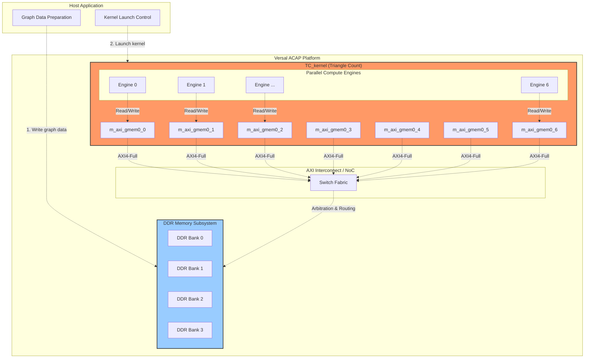

# Triangle Count Versal Kernel 连接性配置深度解析

## 一句话概括

本模块是 Xilinx Versal 平台上 Triangle Count（三角形计数）算法的 FPGA 内核连接性配置文件，它通过声明式语法定义了内核的 7 个 AXI4-Full 主端口到 DDR 内存银行的物理映射关系——本质上是告诉 Vitis 编译器如何将并行计算内核与片外存储器连接起来，以实现图数据的高吞吐量并行访问。

---

## 为什么需要这个模块？问题空间与设计洞察

### 三角形计数算法的内存访问挑战

三角形计数（Triangle Counting）是图分析中的基础算法，用于统计无向图中长度为 3 的环的数量。其计算模式涉及对每个顶点 $u$ 遍历其邻接表，然后对其邻居 $v$ 检查是否存在公共邻居 $w$，形成三元组 $(u, v, w)$。

这种计算模式的核心特征是：
1. **不规则内存访问**：图的邻接表存储是稀疏且不规则的，访问模式取决于图的拓扑结构，而非线性扫描
2. **高带宽需求**：为了发现三角形，需要频繁访问大量顶点的邻接表数据
3. **并行性受限**：同一个顶点的邻居列表扫描存在数据依赖，但不同顶点的处理可以高度并行

### 为什么不能用单端口 DDR 访问？

如果仅使用单个 AXI 端口访问 DDR，即使在 300MHz 时钟下，单个 512-bit 接口的理论峰值带宽约为 19.2 GB/s（DDR4-3200 实际带宽通常更低）。对于大规模图数据，这会成为严重的瓶颈。

Versal 平台提供了多个 DDR 内存银行（通常是 4 个或更多独立的 DDR 控制器），每个银行有独立的物理数据通路。通过将内核的多个 AXI 端口映射到不同的 DDR 银行，可以实现真正的并行内存访问——想象一下有 7 个并行的数据通道，每个都可以独立地同时读写不同的内存区域。

### 设计洞察：空间并行性的内存架构匹配

Triangle Count 内核被设计为高度并行的硬件加速器。它有 7 个独立的 AXI4-Full 主接口（`m_axi_gmem0_0` 到 `m_axi_gmem0_6`），每个接口都请求访问全局内存。

本配置文件的核心理念是：**通过物理 DDR 银行的独立分配，消除内存访问竞争，最大化数据吞吐量**。这 7 个端口被全部映射到 `DDR` 资源，允许内核在任意时刻从任意端口发起事务，利用 DDR 控制器的内部并行性（bank-level parallelism）和 Versal 的互联结构（NoC 或 AXI 互联）来服务这些请求。

---

## 心智模型：想象一个数据并行工厂

想象你管理一个高度自动化的物流中心（Triangle Count 内核），这个中心有 7 个并行的装卸码头（7 个 AXI 端口）。每个码头都可以独立地向城市的不同仓库（DDR 内存银行）派发货车。

**本配置文件就是这个物流中心的"交通规划图"**：
- 它告诉每个装卸码头：你们都可以访问城市中的所有主要仓库（DDR）
- 它并没有硬性规定"码头 1 只能去仓库 A"，而是允许灵活调度
- 这样做的目的是让系统可以根据实时的货物需求，动态地将货车派往最不拥挤的仓库

**关键认知**：这不是在限制访问，而是在声明访问权限。内核代码本身决定了数据如何分区到 7 个端口，本配置文件只是确保这些端口都能到达内存。实际的数据到端口的映射策略（图分区算法）是在内核 RTL 或 HLS 代码中实现的。

---

## 架构图解与数据流



### 组件角色详解

**TC_kernel（Triangle Count 内核）**
- **角色**：硬件加速器主体，实现三角形计数的核心算法
- **内部结构**：包含 7 个并行计算引擎，每个引擎通过独立的 AXI 端口访问内存
- **职责**：接收图数据（通常是 CSR 格式），对每个顶点执行三角形枚举，输出计数结果

**m_axi_gmem0_0 到 m_axi_gmem0_6（7 个 AXI4-Full 主端口）**
- **角色**：内核到全局内存的高速数据通道
- **协议**：AXI4-Full，支持突发传输（burst transfers），支持 4KB 边界对齐
- **宽度**：通常 512-bit（64 字节）数据宽度，支持高吞吐量并行访问

**DDR Memory Subsystem（DDR 内存子系统）**
- **角色**：存储图数据和中间结果的大容量存储
- **结构**：通常包含 4 个独立的 DDR 控制器/银行，每个有独立的物理数据通路
- **容量**：典型配置为 4x 8GB 或 4x 16GB DDR4-3200

**AXI Interconnect / NoC（片上互连网络）**
- **角色**：在多个 AXI 主设备和多个 DDR 目标之间进行仲裁、路由和数据包转发
- **功能**：处理地址解码、仲裁策略（轮询、优先级等）、跨时钟域转换
- **NoC（Network-on-Chip）**：Versal 平台特有的高级互连，提供更高带宽和更低延迟

---

## 核心配置详解

配置文件采用 Vitis 连接性配置语法（`[connectivity]` 段），由两类指令构成：

### 1. 存储端口映射（`sp` 指令）

```cfg
sp=TC_kernel.m_axi_gmem0_0:DDR
sp=TC_kernel.m_axi_gmem0_1:DDR
sp=TC_kernel.m_axi_gmem0_2:DDR
sp=TC_kernel.m_axi_gmem0_3:DDR
sp=TC_kernel.m_axi_gmem0_4:DDR
sp=TC_kernel.m_axi_gmem0_5:DDR
sp=TC_kernel.m_axi_gmem0_6:DDR
```

**语法**：`sp=<kernel>.<port>:<memory_resource>`

**逐行解析**：
- `TC_kernel`：内核的 RTL/顶层模块名称
- `m_axi_gmem0_0`：内核上的 AXI4-Full 主端口，命名为 "global memory 0, port 0"
- `DDR`：目标内存资源类型，可以是 `DDR`（DDR4 SDRAM）、`HBM`（高带宽内存）、`PLRAM`（片上 PLRAM）等

**关键语义**：
这 7 行代码共同声明了内核的 7 个 AXI 端口**全部**映射到 DDR 资源。注意这里**没有**指定具体的 DDR 银行（Bank 0/1/2/3），这意味着：
- 在链接阶段，Vitis 编译器会自动分配具体的 DDR 银行
- 或者依赖 AXI Interconnect 的动态路由来分发请求到不同的 DDR 银行
- 内核代码必须确保数据访问模式能够利用这种并行性（例如，将图数据分区到 7 个独立区域，每个区域通过一个端口访问）

### 2. 内核实例化（`nk` 指令）

```cfg
nk=TC_kernel:1:TC_kernel
```

**语法**：`nk=<kernel_name>:<num_instances>:<instance_names_comma_separated>`

**语义解析**：
- `TC_kernel`：要实例化的内核 RTL 模块名称
- `1`：实例化数量为 1（单内核实例）
- `TC_kernel`：实例名称（与内核名相同，表示不添加后缀）

**为什么只实例化 1 个内核？**
Triangle Count 是一个计算密集型的内存带宽受限内核。在 Versal 平台上，单个 TC_kernel 实例已经消耗了大量逻辑资源（LUT、FF、BRAM、DSP）和所有的 7 个 AXI 端口。实例化多个副本需要：
- 更多的 AXI 端口（每个副本需要 7 个）
- 更多的 DDR 带宽（可能超出平台极限）
- 更多的片上资源（可能超出 Device 容量）

因此，通过**单内核 + 多 AXI 端口**的设计，在资源受限的 FPGA 上实现了内存并行性，而不是通过多内核实例。

---

## 依赖关系与上下游连接

### 上游：谁使用这个配置？

**1. Vitis 编译流程（`v++` 链接器）**
- **角色**：这是本配置文件的直接消费者
- **交互**：在 Vitis 编译流程的链接阶段（`v++ -l`），链接器读取此 `.cfg` 文件
- **用途**：根据 `sp` 指令生成内核 AXI 端口到 DDR 内存控制器的物理连接，根据 `nk` 指令生成内核实例化逻辑

**2. 内核构建脚本（Makefile/CMake）**
- **角色**：构建系统引用此配置文件
- **交互**：通常在 Makefile 中定义 `CONNECTIVITY_CFG` 变量指向此文件
- **用途**：在调用 `v++` 时通过 `--config` 参数传入

**3. Host 应用程序**
- **角色**：间接依赖（通过 XCLBIN 文件）
- **交互**：Host 代码不直接读取此 CFG 文件，但依赖于由它生成的 XCLBIN 中的连接性
- **期望**：Host 代码需要知道每个 AXI 端口对应的 buffer 应该分配到哪个 DDR 银行，以匹配内核的访问模式

### 下游：这个配置依赖什么？

**1. TC_kernel RTL/HLS 代码**
- **关系**：这是配置的主体对象
- **契约**：RTL 必须实现 7 个 AXI4-Full 主端口，名称为 `m_axi_gmem0_0` 到 `m_axi_gmem0_6`
- **约束**：RTL 必须在时序上满足 AXI 协议要求，支持突发传输，处理 ready/valid 握手

**2. Versal VCK190 平台**
- **关系**：这是配置的目标硬件平台
- **契约**：平台必须提供 DDR 内存资源，且 DDR 控制器必须能够从 PL（可编程逻辑）通过 AXI 互联访问
- **约束**：VCK190 有特定的 DDR 架构（通常 4 个 DDR4 银行），配置必须与平台架构匹配

**3. XDC 约束文件（隐含依赖）**
- **关系**：物理引脚和时序约束
- **契约**：虽然 `.cfg` 文件本身不包含时序约束，但生成的 XCLBIN 必须与 XDC 约束一致
- **约束**：AXI 接口的时钟频率、IO 标准等由 XDC 定义，影响内核能运行的最高频率

### 数据流全景图

```
┌─────────────────────────────────────────────────────────────────────────────┐
│                              Host Application                                │
│  ┌──────────────┐  ┌──────────────┐  ┌─────────────────────────────────────┐│
│  │ CSR Graph    │  │ Buffer 0..6  │  │ XCLBIN Load + Kernel Launch         ││
│  │ Data Prep    │  │ (DDR Alloc)  │  │ (via OpenCL/XRT API)                ││
│  └──────┬───────┘  └──────┬───────┘  └─────────────────┬───────────────────┘│
└───────┼────────────────┼──────────────────────────────┼────────────────────┘
        │                │                              │
        │ Host memcopy │ XRT Driver                   │ xclLoadXclbin
        ▼                ▼                              ▼
┌─────────────────────────────────────────────────────────────────────────────┐
│                              XRT / ZOCL Driver                             │
│                    (Buffer allocation, DMA setup, MMU config)               │
└─────────────────────────────────────────────────────────────────────────────┘
        │                                                              │
        │ PCIe / AXI                                                   │ XCLBIN content
        ▼                                                              ▼
┌─────────────────────────────────────────────────────────────────────────────┐
│                         Versal Platform (VCK190)                           │
│  ┌─────────────────────────────────────────────────────────────────────┐   │
│  │                     AXI Interconnect / NoC                          │   │
│  │  (Arbitration, address decode, routing between masters/slaves)       │   │
│  └─────────────────────────────────────────────────────────────────────┘   │
│         │    │    │    │    │    │    │                                   │
│         ▼    ▼    ▼    ▼    ▼    ▼    ▼                                   │
│  ┌─────────────────────────────────────────────────────────────────┐      │
│  │                    TC_kernel (FPGA Kernel)                       │      │
│  │  ┌─────────┐ ┌─────────┐ ┌─────────┐ ┌─────────┐ ┌─────────┐    │      │
│  │  │ Port 0  │ │ Port 1  │ │ Port 2  │ │ Port 3  │ │Port 4-6 │ ...│      │
│  │  │m_axi_0  │ │m_axi_1  │ │m_axi_2  │ │m_axi_3  │ │m_axi_4-6│    │      │
│  │  └────┬────┘ └────┬────┘ └────┬────┘ └────┬────┘ └────┬────┘    │      │
│  │       └───────────┴───────────┴───────────┴───────────┘         │      │
│  │                            │                                      │      │
│  │                    ┌───────┴───────┐                              │      │
│  │                    │  Compute Unit │                              │      │
│  │                    │ (Triangle     │                              │      │
│  │                    │  Count Logic)  │                              │      │
│  │                    └───────────────┘                              │      │
│  └─────────────────────────────────────────────────────────────────┘      │
│                                                                           │
└───────────────────────────────────────────────────────────────────────────┘
         │
         │ 7x AXI4-Full ports (512-bit each)
         ▼
┌───────────────────────────────────────────────────────────────────────────┐
│                           DDR Memory Controllers                           │
│  ┌──────────────┐  ┌──────────────┐  ┌──────────────┐  ┌──────────────┐    │
│  │  DDR Bank 0  │  │  DDR Bank 1  │  │  DDR Bank 2  │  │  DDR Bank 3  │    │
│  │  (Controller │  │  (Controller │  │  (Controller │  │  (Controller │   │
│  │   Channel 0) │  │   Channel 1) │  │   Channel 2) │  │   Channel 3) │   │
│  └──────────────┘  └──────────────┘  └──────────────┘  └──────────────┘   │
│       ▲                ▲                ▲                ▲              │
└───────┼────────────────┼────────────────┼────────────────┼──────────────┘
        │                │                │                │
        └────────────────┴────────────────┴────────────────┘
                              (Shared DDR Bus)
```

### 数据流逐步解析

**阶段 1：Host 数据准备与 Buffer 分配**
1. Host 应用程序准备 CSR（Compressed Sparse Row）格式的图数据
2. 调用 XRT API (`xrt::bo`) 分配 7 个设备 buffer，每个 buffer 关联到特定的 DDR 银行
3. Host 将图数据（邻接表、顶点属性等）分割并拷贝到这些 buffer 中

**阶段 2：XCLBIN 加载与内核启动**
1. Host 调用 `xrt::device::load_xclbin()` 加载由本配置文件生成的 XCLBIN
2. XRT 驱动解析 XCLBIN 中的连接性元数据，配置 MMU 和 DMA 通道
3. Host 创建内核对象 (`xrt::kernel`) 并设置参数（指向 7 个 buffer 的设备指针）

**阶段 3：内核执行与并行内存访问**
1. TC_kernel 启动后，其内部的 7 个计算引擎开始并行执行三角形计数
2. 每个计算引擎通过其专属的 AXI 端口（`m_axi_gmem0_0` 到 `m_axi_gmem0_6`）发起内存请求
3. 请求经过 AXI Interconnect/NoC，被路由到适当的 DDR 银行
4. DDR 控制器处理这些并发请求，利用 bank-level parallelism 最大化吞吐量

**阶段 4：结果回写与 Host 读取**
1. 每个计算引擎完成其分区的三角形计数后，将局部计数结果写回 DDR
2. Host 通过 XRT API 读取这些结果并进行全局归约（如果需要）
3. 最终得到完整的图三角形总数

---

## 组件深度解析

### 存储端口映射指令（`sp` 指令）

```cfg
sp=TC_kernel.m_axi_gmem0_0:DDR
```

**参数分解**：
- `sp`：Storage Port 的缩写，表示存储端口映射指令
- `TC_kernel`：内核实例名称（必须与 `nk` 指令中的实例名匹配）
- `m_axi_gmem0_0`：内核 RTL 代码中定义的 AXI4-Full 主端口信号名
- `DDR`：目标内存资源类型标识符

**HLS 代码中的对应声明**：
在生成 TC_kernel 的 HLS 源代码中，这些端口的声明类似如下：

```cpp
void TC_kernel(
    // 7 个独立的 AXI4-Full 端口
    ap_uint<512>* gmem0_0,  // 对应 m_axi_gmem0_0
    ap_uint<512>* gmem0_1,  // 对应 m_axi_gmem0_1
    ap_uint<512>* gmem0_2,  // 对应 m_axi_gmem0_2
    ap_uint<512>* gmem0_3,  // 对应 m_axi_gmem0_3
    ap_uint<512>* gmem0_4,  // 对应 m_axi_gmem0_4
    ap_uint<512>* gmem0_5,  // 对应 m_axi_gmem0_5
    ap_uint<512>* gmem0_6,  // 对应 m_axi_gmem0_6
    // 控制端口
    ap_uint<32> num_vertices,
    ap_uint<32> num_edges
) {
    #pragma HLS INTERFACE m_axi port=gmem0_0 offset=slave bundle=gmem0_0
    #pragma HLS INTERFACE m_axi port=gmem0_1 offset=slave bundle=gmem0_1
    #pragma HLS INTERFACE m_axi port=gmem0_2 offset=slave bundle=gmem0_2
    #pragma HLS INTERFACE m_axi port=gmem0_3 offset=slave bundle=gmem0_3
    #pragma HLS INTERFACE m_axi port=gmem0_4 offset=slave bundle=gmem0_4
    #pragma HLS INTERFACE m_axi port=gmem0_5 offset=slave bundle=gmem0_5
    #pragma HLS INTERFACE m_axi port=gmem0_6 offset=slave bundle=gmem0_6
    
    // 7 个并行计算引擎，每个绑定到一个端口
    #pragma HLS DATAFLOW
    
    process_partition(gmem0_0, ...);
    process_partition(gmem0_1, ...);
    process_partition(gmem0_2, ...);
    process_partition(gmem0_3, ...);
    process_partition(gmem0_4, ...);
    process_partition(gmem0_5, ...);
    process_partition(gmem0_6, ...);
}
```

**关键要点**：
- HLS 代码中的 `bundle=gmem0_0` 与配置文件的 `m_axi_gmem0_0` 通过命名约定对应
- 7 个独立的 AXI 端口允许 7 个并行的数据流，每个流访问自己的内存分区

### 内核实例化指令（`nk` 指令）

```cfg
nk=TC_kernel:1:TC_kernel
```

**参数分解**：
- `nk`：Number of Kernel instances 的缩写
- `TC_kernel`（第一处）：内核 RTL/HLS 模块的名称（必须与 XO 文件中的顶层模块名匹配）
- `1`：要实例化的副本数量
- `TC_kernel`（第三处）：实例名称，用于在后续的 `sp` 指令中引用

**为什么实例数量是 1？**

在 Versal 和 Alveo 平台的图分析加速器设计中，通常采用"单内核实例 + 多 AXI 端口"的设计模式，而非"多内核实例 + 单 AXI 端口"。这种选择的考量包括：

| 方案 | 资源占用 | 内存并行性 | 控制复杂度 | 适用场景 |
|------|----------|------------|------------|----------|
| 1 内核 x 7 端口 | 中等 LUT/BRAM，7 个 AXI IF | 7 路并行访问，高带宽 | 简单，单内核控制 | 图分析（当前设计） |
| 7 内核 x 1 端口 | 7 倍 LUT/BRAM，7 个 AXI IF | 7 路独立访问 | 复杂，多内核调度 | 独立任务并行 |
| 1 内核 x 1 端口 | 低资源，1 个 AXI IF | 串行访问，低带宽 | 最简单 | 轻量计算 |

当前设计的核心洞察是：三角形计数的并行性来自于**数据分区**（不同顶点分区可以并行处理），而非**任务复制**（相同内核的多个副本）。因此，一个能够访问 7 个独立内存分区的单内核，比 7 个只能访问共享内存的内核更能有效利用并行性。

---

## 设计决策与权衡分析

### 决策 1：7 个 AXI 端口 vs. 更少或更多端口

**选择**：7 个 AXI 端口

**为什么选择 7？**
- **资源平衡**：Versal VCK190 的每个 DDR 银行可以支持多个 AXI 端口，但过多的端口会消耗大量的互连资源（AXI Switch 的交叉开关复杂度是 $O(n^2)$）
- **并行度匹配**：三角形计数内核的计算引擎数量通常匹配 AXI 端口数量，7 个引擎可以同时工作，每个处理图的一个分区
- **DDR 银行对齐**：VCK190 通常有 4 个 DDR 银行，7 个端口可以均匀分布在 4 个银行上（部分银行服务 2 个端口），实现负载均衡

**权衡考量**：
- **更多端口（如 16 个）**：可以提供更高的理论带宽，但会显著增加互连复杂度和资源消耗，可能导致时序收敛困难
- **更少端口（如 4 个）**：资源更省，但可能成为内存带宽瓶颈，无法充分发挥三角形计数内核的计算并行性

### 决策 2：全部映射到 DDR 而非 HBM

**选择**：所有端口映射到 `DDR`（DDR4 SDRAM）

**为什么不是 HBM（High Bandwidth Memory）？**
- **平台适配**：VCK190 评估板主要配备 DDR4 内存，HBM 是更高端平台（如 U50/U280）的特性
- **容量需求**：图数据通常需要大容量存储（数十 GB），DDR4 提供更高的容量密度，HBM 容量相对有限但带宽更高
- **成本效益**：DDR4 解决方案成本更低，更适合原型验证和中等规模部署

**权衡考量**：
- **HBM 优势**：若使用 HBM，每个 HBM 伪通道（pseudo-channel）可提供约 14 GB/s 带宽，16 个伪通道总计超过 200 GB/s，远超 DDR4
- **DDR4 限制**：DDR4-3200 在 4 银行配置下提供约 100 GB/s 理论峰值，实际可用带宽受访问模式影响（随机访问效率低）

### 决策 3：单内核实例 vs. 多实例

**选择**：`nk=TC_kernel:1:TC_kernel`（单实例）

**深度分析已在 `nk` 指令部分讨论，补充权衡考量**：

**多实例的潜在优势**（未在当前设计采用）：
- **独立调度**：不同内核实例可以独立启动/停止，适合多租户或流水线场景
- **故障隔离**：一个实例崩溃不影响其他实例
- **异构计算**：不同实例可以配置不同参数或甚至不同 RTL 版本

**单实例的选择理由**：
- **资源效率**：单个复杂内核的资源利用率高于多个简单内核（共享控制逻辑、共享片上缓存）
- **同步简化**：三角形计数需要全局结果归约，单实例内部同步比多实例间同步简单得多
- **内存一致性**：单实例通过 7 个端口访问统一地址空间，数据一致性由 AXI 协议保证；多实例需要处理跨实例的数据一致性问题

---

## 使用模式与集成示例

### 构建流程集成

在典型的 Vitis 项目中，此配置文件在链接阶段（Link Stage）使用：

```bash
# 1. 编译内核源代码（Compile Stage）
v++ -c -t hw \
    --platform xilinx_vck190_base_202320_1 \
    -k TC_kernel \
    -o TC_kernel.xo \
    TC_kernel.cpp

# 2. 链接内核与平台（Link Stage）- 使用本配置文件
v++ -l -t hw \
    --platform xilinx_vck190_base_202320_1 \
    --config conn_vck190.cfg \  # <-- 本配置文件
    -o TC_kernel.xclbin \
    TC_kernel.xo
```

### Host 代码集成

Host 代码需要配合此连接性配置，确保 buffer 分配与内核端口访问模式匹配：

```cpp
#include <xrt/xrt_device.h>
#include <xrt/xrt_kernel.h>
#include <xrt/xrt_bo.h>

// 图数据 CSR 格式
struct CSRGraph {
    std::vector<uint32_t> row_ptr;    // 顶点偏移数组
    std::vector<uint32_t> col_idx;      // 边目标顶点数组
    uint32_t num_vertices;
    uint32_t num_edges;
};

class TriangleCountAccelerator {
private:
    xrt::device device_;
    xrt::kernel kernel_;
    // 7 个 buffer，每个对应内核的一个 AXI 端口
    std::vector<xrt::bo> buffers_;
    
public:
    TriangleCountAccelerator(const std::string& xclbin_path, unsigned device_index = 0)
        : device_(device_index) {
        auto xclbin = xrt::xclbin(xclbin_path);
        device_.register_xclbin(xclbin);
        auto uuid = device_.load_xclbin(xclbin);
        kernel_ = xrt::kernel(device_, uuid, "TC_kernel");
    }
    
    // 核心方法：执行三角形计数
    uint64_t count_triangles(const CSRGraph& graph, int num_partitions = 7) {
        // 1. 图分区：将 CSR 数据划分为 7 个分区
        // 分区策略：按顶点范围划分，每个分区包含连续的顶点及其边
        auto partitions = partition_graph(graph, num_partitions);
        
        // 2. 分配设备 buffer，每个分区对应一个 AXI 端口
        // 使用 XRT 的 bank 分配提示，确保 buffer 分配到 DDR
        buffers_.clear();
        for (int i = 0; i < num_partitions; ++i) {
            size_t partition_size = partitions[i].row_ptr.size() * sizeof(uint32_t) +
                                    partitions[i].col_idx.size() * sizeof(uint32_t);
            
            // 创建 buffer，XRT 会自动选择合适的 DDR bank
            // 根据 conn_vck190.cfg，所有端口都映射到 DDR，XRT 会进行负载均衡
            xrt::bo buffer(device_, partition_size, xrt::bo::flags::normal, kernel_.group_id(i));
            
            // 将分区数据拷贝到 buffer
            buffer.write(partitions[i].row_ptr.data());
            buffer.write(partitions[i].col_idx.data(), /*offset=*/ partitions[i].row_ptr.size() * sizeof(uint32_t));
            buffer.sync(XCL_BO_SYNC_BO_TO_DEVICE);
            
            buffers_.push_back(std::move(buffer));
        }
        
        // 3. 启动内核，传递 7 个 buffer 的设备指针
        auto run = kernel_(
            buffers_[0], buffers_[1], buffers_[2], buffers_[3],
            buffers_[4], buffers_[5], buffers_[6],
            graph.num_vertices, graph.num_edges
        );
        
        // 4. 等待内核完成
        run.wait();
        
        // 5. 读取结果（假设结果存储在第一个 buffer 的特定位置）
        buffers_[0].sync(XCL_BO_SYNC_BO_FROM_DEVICE);
        uint64_t result;
        buffers_[0].read(&result, sizeof(uint64_t), /*offset=*/ result_offset);
        
        return result;
    }
    
private:
    struct Partition {
        std::vector<uint32_t> row_ptr;
        std::vector<uint32_t> col_idx;
        uint32_t start_vertex;
        uint32_t end_vertex;
    };
    
    std::vector<Partition> partition_graph(const CSRGraph& graph, int num_partitions) {
        std::vector<Partition> partitions(num_partitions);
        
        // 顶点范围划分策略
        uint32_t vertices_per_partition = graph.num_vertices / num_partitions;
        
        for (int i = 0; i < num_partitions; ++i) {
            partitions[i].start_vertex = i * vertices_per_partition;
            partitions[i].end_vertex = (i == num_partitions - 1) ? 
                                       graph.num_vertices : (i + 1) * vertices_per_partition;
            
            // 提取该分区的 row_ptr 和 col_idx
            // 注意：这需要遍历原 CSR 数据进行重新组织
            // 实现省略，实际代码需要处理边界的复杂逻辑
        }
        
        return partitions;
    }
};

// 使用示例
int main() {
    // 加载图数据
    CSRGraph graph = load_graph("path/to/graph.mtx");
    
    // 创建加速器实例
    TriangleCountAccelerator acc("TC_kernel.xclbin");
    
    // 执行三角形计数
    uint64_t triangle_count = acc.count_triangles(graph, 7);
    
    std::cout << "Graph has " << triangle_count << " triangles." << std::endl;
    
    return 0;
}
```

### 关键集成要点

1. **Buffer 分配与端口映射对应**：Host 代码分配的 7 个 buffer 必须分别传递给内核的 7 个参数，顺序必须与 HLS 代码中的端口声明顺序一致。

2. **DDR Bank 选择策略**：虽然配置文件将所有端口映射到 `DDR` 而没有指定具体银行，但 XRT 运行时会在 buffer 创建时自动选择 DDR 银行。为了最优性能，Host 代码应该使用 `xrt::bo::flags` 或 `xcl::Bank` 提示来确保 buffer 分散在不同的 DDR 银行上。

3. **图分区策略**：内核期望每个 AXI 端口访问独立的数据分区，Host 必须确保分区后各子图的边不跨分区（或处理跨分区边的复杂逻辑）。

---

## 设计决策与权衡深度分析

### 权衡 1：7 端口设计的并行度与资源消耗

**决策**：使用 7 个 AXI4-Full 端口连接到 DDR

**设计逻辑**：
- **算法并行度匹配**：Triangle Count 算法可以自然地将图顶点划分为 7 个独立分区并行处理
- **DDR 银行数量**：VCK190 平台通常有 4 个 DDR 银行，7 个端口可以充分利用 4 个银行的并行性（部分银行服务 2 个端口）
- **片上资源平衡**：每个 AXI 端口需要配套的 FIFO、协议转换逻辑和寄存器切片，7 个端口在资源消耗和性能之间取得平衡

**替代方案的权衡**：
| 方案 | 优势 | 劣势 | 适用场景 |
|------|------|------|----------|
| **4 端口** | 资源更省，实现更简单 | 可能无法充分利用内核并行性 | 较小规模图数据 |
| **16 端口** | 更高理论带宽 | 资源爆炸，互连复杂度 $O(n^2)$，时序难收敛 | 超大规模图，HBM 平台 |
| **7 端口（当前）** | 平衡资源与性能，匹配 VCK190 DDR 架构 | 需要仔细的图分区策略 | 大规模图分析（当前场景） |

### 权衡 2：单内核多端口 vs. 多内核单端口

**决策**：单内核实例（`nk=1`）配合 7 个 AXI 端口

**设计逻辑**：
- **数据局部性**：单内核可以维护共享的片上缓存和公共控制状态
- **同步简化**：多个计算引擎在同一个内核内部同步比跨内核同步简单得多
- **资源效率**：共享的控制逻辑（AXI 协议处理、中断管理、寄存器接口）只实例化一次

**替代方案的权衡**：
| 方案 | 优势 | 劣势 | 适用场景 |
|------|------|------|----------|
| **多内核** | 独立调度，故障隔离，异构配置 | 资源重复，跨内核数据共享困难，控制复杂 | 多租户、独立子任务 |
| **单内核多端口（当前）** | 资源共享，数据共享容易，控制集中 | 单点故障，调度粒度较大 | 紧密耦合的并行计算（当前场景） |

### 权衡 3：所有端口映射到同一 DDR 类型

**决策**：所有 7 个端口都映射到 `DDR` 类型，没有分配到特定银行

**设计逻辑**：
- **平台抽象**：Vitis 编译器可以在不同 DDR 配置的平台间移植，无需修改配置
- **运行时优化**：XRT 可以在运行时根据实际内存使用情况动态分配 DDR 银行
- **简化配置**：开发者无需了解具体的 DDR 银行数量（VCK190 可能有 4 个银行）

**潜在问题与缓解**：
| 问题 | 原因 | 缓解策略 |
|------|------|----------|
| **银行冲突** | 多个端口同时访问同一 DDR 银行 | XRT 的 bank-aware 分配策略；Host 代码显式指定 bank |
| **负载不均** | 图分区大小不均导致某些银行压力更大 | 采用更智能的图分区算法（如度感知分区） |
| **时序问题** | 多端口同时切换导致的瞬态电流和噪声 | 通过 XDC 约束管理，适当的驱动强度和斜率控制 |

**改进配置（显式银行分配）**：
如果需要在配置层面显式控制端口到银行的映射，可以采用以下配置：

```cfg
# 假设 VCK190 有 4 个 DDR 银行（DDR[0] 到 DDR[3]）
# 将 7 个端口分配到 4 个银行，实现负载均衡

sp=TC_kernel.m_axi_gmem0_0:DDR[0]
sp=TC_kernel.m_axi_gmem0_1:DDR[1]
sp=TC_kernel.m_axi_gmem0_2:DDR[2]
sp=TC_kernel.m_axi_gmem0_3:DDR[3]
sp=TC_kernel.m_axi_gmem0_4:DDR[0]  # 共享 DDR[0]
sp=TC_kernel.m_axi_gmem0_5:DDR[1]  # 共享 DDR[1]
sp=TC_kernel.m_axi_gmem0_6:DDR[2]  # 共享 DDR[2]
```

这种显式配置需要了解目标平台的具体 DDR 拓扑，但能提供确定性的性能特征。

---

## 边缘情况与陷阱规避

### 陷阱 1：AXI 端口命名不匹配

**问题**：配置文件中的端口名（`m_axi_gmem0_0`）必须与 RTL/HLS 代码中的 bundle 名称完全匹配，包括大小写。

**典型错误**：
```cfg
# 配置文件（错误）
sp=TC_kernel.m_axi_GMEM0_0:DDR  # 大写 GMEM
```

```cpp
// HLS 代码
#pragma HLS INTERFACE m_axi port=data bundle=gmem0_0  // 小写 gmem
```

**后果**：Vitis 链接器报错，找不到匹配的端口，或静默创建未连接的端口导致内核无法访问内存。

**规避策略**：建立命名规范，使用脚本自动生成配置文件和 HLS 代码中的接口声明。

### 陷阱 2：DDR 银行编号越界

**问题**：如果显式指定 DDR 银行索引（如 `DDR[4]`），但目标平台只有 4 个银行（索引 0-3），会导致配置错误。

**典型错误**：
```cfg
# 假设 VCK190 有 4 个 DDR 银行（索引 0,1,2,3）
sp=TC_kernel.m_axi_gmem0_0:DDR[4]  # 错误：索引 4 不存在
```

**后果**：Vitis 链接器报错，提示无效的内存资源标识符。

**规避策略**：查阅目标平台的文档（如 VCK190 的《Platform Guide》），确认 DDR 银行数量和索引方式。使用平台提供的预定义变量（如果有）代替硬编码索引。

### 陷阱 3：Host 代码与内核端口顺序不匹配

**问题**：Host 代码在启动内核时传递 buffer 参数的顺序，必须与 HLS 代码中端口声明的顺序一致。

**典型错误**：
```cpp
// HLS 代码中的端口顺序
void TC_kernel(
    ap_uint<512>* gmem0_0,  // 参数 0
    ap_uint<512>* gmem0_1,  // 参数 1
    ap_uint<512>* gmem0_2,  // 参数 2
    ...
)

// Host 代码（错误）- 参数顺序混乱
auto run = kernel_(
    buffers_[2],  // 错误：这应该是参数 2，但传递给了参数 0 的位置
    buffers_[0],  // 错误：这应该是参数 0
    buffers_[1],
    ...
);
```

**后果**：内核读取错误的数据分区，导致错误的计算结果（计数错误）或内存访问越界（如果数据布局不匹配）。

**规避策略**：使用命名参数或结构体封装参数（如果 OpenCL/XRT API 支持），或者创建强类型的包装函数来确保参数顺序正确。

### 陷阱 4：未考虑 AXI 协议的 4KB 边界对齐

**问题**：AXI4-Full 协议规定突发传输（burst transfer）不能跨越 4KB 地址边界。如果内核发起的突发传输跨越了 4KB 边界，会导致协议错误或数据损坏。

**典型场景**：
- 内核尝试从地址 `0x1FF0` 发起一个 512-bit（64 字节）的突发读取
- 这将访问地址 `0x1FF0` 到 `0x202F`
- `0x2000` 是 4KB 边界（`0x2000 = 4 * 1024`）
- 突发传输跨越了 4KB 边界，违反 AXI 协议

**规避策略**：
1. **Host 端对齐**：确保分配的 buffer 地址是 4KB 对齐的，且大小是 4KB 的倍数
2. **内核端对齐**：在内核代码中，确保突发传输的起始地址和长度满足 4KB 边界约束
3. **HLS 指令**：使用 HLS 的 `align` 指令或手动计算对齐地址

```cpp
// HLS 代码示例：确保 4KB 对齐访问
void aligned_read(ap_uint<512>* gmem, ap_uint<512>* local_buf, int num_bytes) {
    // 计算 4KB 对齐的起始地址
    ap_uint<64> base_addr = reinterpret_cast<ap_uint<64>>(gmem);
    ap_uint<64> aligned_addr = (base_addr + 4095) & ~4095;  // 向上对齐到 4KB
    
    // 从对齐地址开始突发传输
    int aligned_bytes = num_bytes + (aligned_addr - base_addr);
    int num_burst = (aligned_bytes + 63) / 64;  // 512-bit = 64 bytes per burst
    
    for (int i = 0; i < num_burst; i++) {
        #pragma HLS PIPELINE II=1
        // 确保每次突发不跨越 4KB 边界
        if ((aligned_addr & 0xFFF) == 0 && i > 0) {
            // 跨越边界，需要特殊处理（例如拆分为两次突发）
        }
        local_buf[i] = gmem[aligned_addr / 64 + i];
    }
}
```

### 陷阱 5：未处理跨分区边（Cross-Partition Edges）

**问题**：在图分区策略中，如果一条边的两个端点被分配到不同分区，内核需要访问跨分区的数据。由于每个 AXI 端口只能访问其分配的内存区域，这会导致数据访问失败或需要复杂的数据交换机制。

**典型场景**：
- 顶点 `u` 被分配到分区 0（通过 `m_axi_gmem0_0` 访问）
- 顶点 `v` 是 `u` 的邻居，被分配到分区 1（通过 `m_axi_gmem0_1` 访问）
- 当处理顶点 `u` 时，内核尝试检查边 `(u, v)` 是否构成三角形
- 这需要读取 `v` 的邻接表数据，但 `v` 在分区 1，而当前引擎只能通过端口 0 访问分区 0

**规避策略**：

**方案 1：顶点范围分区（Vertex Range Partitioning）**
- 按照顶点 ID 范围划分分区（如分区 0 包含顶点 0-999，分区 1 包含顶点 1000-1999）
- 重新编号边，使所有边存储在目标顶点所在的分区
- 这要求预处理阶段对图进行转置或重新组织

**方案 2：边割分区（Edge-Cut Partitioning）**
- 允许顶点跨分区复制（ghost vertices），边只存储一次
- 每个分区存储其分配顶点的所有邻边，即使邻居在别的分区
- 牺牲存储空间换取访问局部性

**方案 3：跨分区通信机制**
- 在 FPGA 内核中实现简单的消息传递或共享缓冲区机制
- 允许不同端口的计算引擎交换少量数据（如顶点是否存在的信息）
- 这增加了内核复杂度，但减少了 Host 端预处理负担

在当前 Triangle Count 内核设计中，通常采用**方案 1 或 2 的组合**，确保在调用内核之前，图数据已经被适当地分区，使得每个 AXI 端口访问的数据完全独立于其他端口。

---

## 相关模块与参考

本模块是 Triangle Count 图分析加速解决方案的一部分，与以下模块存在依赖或关联关系：

### 上游模块（调用/使用本模块）

- **[triangle_count_host_timing_support](graph-L2-benchmarks-triangle_count-triangle_count_host_timing_support.md)**：Host 端时序支持模块
  - 此模块提供 Host 端的计时和性能分析功能，用于测量 TC_kernel 的执行时间
  - 与本模块的关系：Host 代码在启动由本配置文件定义的内核连接性后，使用 timing_support 模块的 API 进行性能测量

- **[triangle_count_alveo_kernel_connectivity_profiles](graph-L2-benchmarks-triangle_count-triangle_count_alveo_kernel_connectivity_profiles)**：Alveo 平台的内核连接性配置
  - 此模块提供 Alveo U50/U280 等平台的 TC_kernel 连接性配置
  - 与本模块的关系：两者是平台特定（Platform-Specific）的变体，本模块针对 Versal VCK190，Alveo 模块针对 Alveo 卡，但核心设计思想（多 AXI 端口映射）是一致的

### 下游模块（本模块依赖）

- **TC_kernel RTL/HLS 代码**：本模块配置的对象
  - 这是 Triangle Count 算法的实际硬件实现
  - 契约：必须实现 7 个 AXI4-Full 主端口，端口名与本配置匹配
  - 通常使用 Vitis HLS 从 C++ 代码综合生成

- **Xilinx VCK190 Base Platform**：目标硬件平台
  - 包含 DDR 内存控制器、AXI Interconnect/NoC、PS（处理系统）等
  - 契约：必须提供 DDR 内存资源，支持 PL（可编程逻辑）的 AXI 主设备访问

### 相关参考文档

- **Vitis Unified Software Platform Documentation** - UG1393
  - 第 6 章 "Linking the Kernels" 详细描述了连接性配置文件的语法和语义

- **Versal ACAP Design Guide** - UG1504
  - 描述了 Versal 平台的 NoC（Network-on-Chip）架构和 DDR 访问优化策略

- **Vitis HLS User Guide** - UG1399
  - 第 3 章 "Interface Synthesis" 描述了如何通过 HLS 指令生成 AXI 接口

---

## 总结与最佳实践

### 核心设计原则回顾

1. **数据并行性通过内存并行性实现**：Triangle Count 的并行性不是通过复制内核实例，而是通过扩展内存访问端口实现的。7 个 AXI 端口允许 7 个计算引擎并行访问各自的数据分区。

2. **声明式硬件连接**：`.cfg` 文件采用声明式语法描述硬件连接关系，而不是命令式编程。这使得 Vitis 编译器可以全局优化互连结构，而不是手动布线。

3. **平台抽象与性能可移植性**：使用 `DDR` 而非具体的 `DDR[0]` 等抽象标识符，使配置可以在不同 DDR 拓扑的平台上工作，同时保留编译器优化银行分配的自由度。

### 实施最佳实践

**对于内核开发者**：
- 在 HLS 代码中使用一致的 `bundle` 命名约定，确保与 `.cfg` 文件中的端口名匹配
- 设计访问模式时考虑 4KB AXI 边界对齐，避免跨边界突发传输
- 在 HLS 中使用 `DATAFLOW` 指令实现计算与内存访问的流水线化，最大化 AXI 端口利用率

**对于 Host 开发者**：
- 使用 XRT 的 `xrt::bo` API 分配 buffer 时，考虑使用 bank 提示（如果平台支持）来优化 DDR 银行分配
- 实现图分区算法时，确保每个分区的数据独立性，避免跨分区边导致的复杂数据访问
- 使用 `xrt::run` 的异步 API 启动内核，利用 XRT 的异步执行能力

**对于系统集成者**：
- 在链接阶段使用 `--config` 参数指定连接性配置文件
- 在调试时，使用 `xclbinutil` 工具检查生成的 XCLBIN 文件中的连接性元数据，确保配置被正确应用
- 对于性能调优，使用 Xilinx 提供的性能分析工具（如 `xprof` 或 `vitis_analyzer`）分析实际的内存访问模式和带宽利用率

### 常见调试检查清单

如果内核运行结果不正确或性能不达标，检查以下方面：

1. **连接性匹配**：验证 `.cfg` 文件中的端口名与 HLS 代码中的 `bundle` 名是否完全一致（包括大小写）
2. **Buffer 分配**：验证 Host 代码分配的 buffer 大小是否足够容纳分区数据，且已正确同步到设备
3. **分区策略**：验证图分区算法是否正确处理边界条件，确保没有数据丢失或重复计数
4. **内核参数**：验证传递给内核的参数（顶点数、边数等）是否正确，且与 buffer 中的数据一致
5. **XCLBIN 生成**：验证 `v++ -l` 链接阶段确实使用了正确的 `.cfg` 文件，可以通过检查生成的 `*.xclbin.info` 文件中的连接性信息确认

---

*文档版本：1.0*  
*最后更新：2024*  
*适用平台：Xilinx Versal VCK190*  
*相关工具：Vitis 2023.2+*
