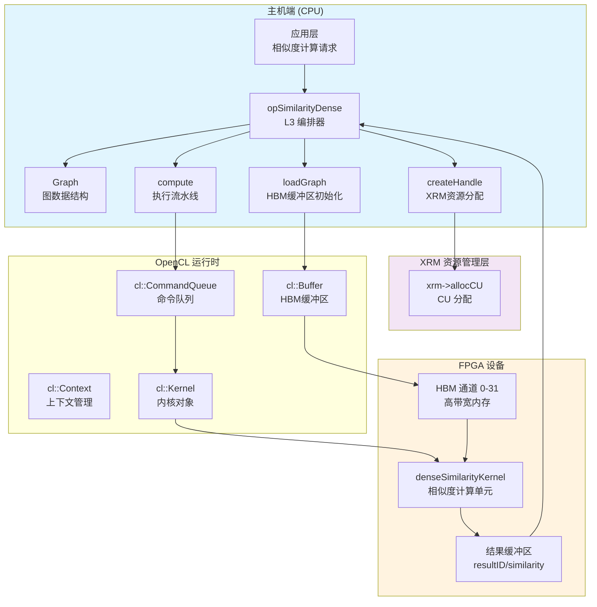

# op_similaritydense: 密集相似度计算引擎

## 概述

`op_similaritydense` 是 FPGA 加速图分析库中的 L3 层密集相似度计算操作符。它充当**主机端编排器**（Host-side Orchestrator），负责管理 FPGA 设备上的 OpenCL 上下文、内存缓冲区、计算单元（CU）资源，并执行余弦相似度、Jaccard 相似度等密集向量相似性计算任务。

想象它为一个**多车道高速公路的调度中心**：它不仅要确保数据（车辆）从主机内存（起点）高效地流入 FPGA 的 HBM 通道（高速公路），还要协调多个计算单元（收费站）并行处理不同批次的数据，最后将结果（目的地）有序地返回给调用者。

## 架构定位与依赖关系

### 模块层级

```
graph_analytics_and_partitioning
└── l3_openxrm_algorithm_operations
    └── similarity_and_twohop_operations
        └── op_similaritydense (当前模块)
            ├── 依赖上游: openXRM (Xilinx 资源管理器)
            ├── 依赖上游: xf::graph::Graph (图数据结构)
            ├── 依赖上游: clHandle (OpenCL 上下文句柄)
            └── 调用下游: denseSimilarityKernel (FPGA 内核)
```

### 架构数据流图



### 关键依赖模块说明

- **openXRM**: Xilinx 资源管理器，负责分配和释放 FPGA 计算单元（CU）。`op_similaritydense` 通过 `xrm->allocCU()` 获取硬件资源，通过 `xrmCuRelease()` 归还资源。
- **xf::graph::Graph**: 图数据结构模板类，承载密集图的权重矩阵、顶点数、边数、分割策略（splitNum）等元数据。
- **clHandle**: OpenCL 上下文封装结构体，包含 `cl::Device`、`cl::Context`、`cl::CommandQueue`、`cl::Kernel` 及 HBM 缓冲区数组。

## 核心概念与心智模型

### 1. 计算单元（CU）与虚拟化

物理 FPGA 上可能有多个物理计算单元（CU），但 `op_similaritydense` 通过 `dupNmSimDense` 参数引入**虚拟 CU** 概念。这类似于操作系统中的超线程——一个物理 CU 可以被虚拟化为多个逻辑 CU，用于负载均衡和流水线并行。

计算单元索引公式（关键理解点）：
```cpp
handleID = channelID + cuID * dupNmSimDense + deviceID * dupNmSimDense * cuPerBoardSimDense
```

这个公式将三维坐标（设备ID、CU ID、通道ID）映射到一维的 handle 数组索引，支持多卡、多 CU、多通道的复杂硬件拓扑。

### 2. 图分割与 HBM 通道映射

密集图通常太大，无法放入单一 HBM 通道。`op_similaritydense` 使用**图分割（Graph Splitting）**策略：

- `splitNum`: 图被分割成的处理单元（PU）数量
- `numVerticesPU[i]`: 第 i 个 PU 的顶点数
- `weightsDense[4*i..4*i+3]`: 第 i 个 PU 的权重矩阵（分为 4 个 HBM 通道）

内存扩展指针（`cl_mem_ext_ptr_t`）使用 `XCL_MEM_TOPOLOGY` 标志，明确指定数据应放置在 FPGA HBM 的特定通道（如 24、28 等），确保高带宽访问。

### 3. 操作模式抽象

模块支持多种相似度计算操作模式：

| 模式 | 描述 | 关键参数 |
|------|------|----------|
| `compute` | 基础相似度计算 | sourceNUM 个源向量 vs 全图 |
| `computeInt` | 整型数据版本 | 使用 int32_t 权重 |
| `computeKNN` | K近邻分类 | 基于已知标签投票 |
| `computeAP` | 亲和传播聚类 | 单个种子节点扩展 |
| `computeAPKNN` | AP+KNN混合 | 聚类后分类 |

## 组件深度剖析

### clHandle 结构体

`clHandle` 是 OpenCL 上下文的封装容器，理解它是掌握整个模块的关键：

```cpp
struct clHandle {
    cl::Device device;           // OpenCL 设备对象
    cl::Context context;         // OpenCL 上下文
    cl::CommandQueue q;          // 命令队列（带性能分析）
    cl::Program program;         // 已编译的内核程序
    cl::Kernel kernel;         // 内核实例
    cl::Buffer* buffer;          // HBM 缓冲区数组（动态分配）
    xrmCuResource* resR;         // XRM 资源句柄
    unsigned int deviceID;       // 设备索引
    unsigned int cuID;           // CU 索引
    unsigned int dupID;          // 虚拟 CU 重复 ID
    bool isBusy;                 // 忙闲状态标志
};
```

**所有权模型**：
- `buffer` 数组：由 `init()` 或 `initInt()` 分配（`new cl::Buffer[bufferNm]`），由 `freeSimDense()` 释放（`delete[] handles[i].buffer`）
- `resR`：由 `createHandle()` 通过 `malloc()` 分配，由 `freeSimDense()` 通过隐式释放（指针本身不 `free`，但 `xrmCuRelease` 释放资源）
- `cl::Buffer` 对象：遵循 OpenCL C++ 包装器的 RAII 语义，当 `cl::Buffer` 对象销毁时自动释放底层 OpenCL 内存对象

### createHandle() - 资源编排的入口

`createHandle()` 是建立 FPGA 计算环境的核心函数，它执行以下操作序列：

**1. OpenCL 上下文初始化**：
```cpp
std::vector<cl::Device> devices = xcl::get_xil_devices();
handle.device = devices[IDDevice];
handle.context = cl::Context(handle.device, NULL, NULL, NULL, &fail);
handle.q = cl::CommandQueue(handle.context, handle.device,
                            CL_QUEUE_PROFILING_ENABLE | CL_QUEUE_OUT_OF_ORDER_EXEC_MODE_ENABLE, &fail);
```

这里初始化了带性能分析（`PROFILING_ENABLE`）和乱序执行（`OUT_OF_ORDER_EXEC_MODE_ENABLE`）的命令队列，为后续内核执行时间测量和并行提交做准备。

**2. XRM 资源分配与内核实例命名**：
```cpp
handle.resR = (xrmCuResource*)malloc(sizeof(xrmCuResource));
int ret = xrm->allocCU(handle.resR, kernelName.c_str(), kernelAlias.c_str(), requestLoad);
```

`requestLoad` 参数（通常 1-100）请求特定负载百分比的 CU。成功分配后，根据 `cuPerBoardSimDense` 的值构建内核实例名称。这是关键的命名逻辑：

```cpp
if (cuPerBoardSimDense >= 2) {
    // 多 CU 模式：需要显式实例名限定
    instanceName0 = "denseSimilarityKernel:{" + instanceName0 + "}";
} else {
    // 单 CU 模式：使用默认实例名
    instanceName0 = "denseSimilarityKernel";
}
```

**3. 内核对象创建**：
```cpp
handle.kernel = cl::Kernel(handle.program, instanceName, &fail);
```

### loadGraphCoreSimDense() - HBM 内存布局的艺术

这是整个模块中最复杂的函数之一，它负责将密集图的权重矩阵映射到 FPGA 的 HBM（高带宽内存）通道。理解其内存布局策略是理解性能关键路径的核心。

**内存拓扑映射**：
```cpp
// 每个分割（split）占用 4 个 HBM 通道
for (int i = 0; i < splitNm; i++) {
    mext_o[4 * i + 0] = {(uint32_t)(8 * i) | XCL_MEM_TOPOLOGY, g.weightsDense[4 * i], 0};
    mext_o[4 * i + 1] = {(uint32_t)(8 * i + 1) | XCL_MEM_TOPOLOGY, g.weightsDense[4 * i + 1], 0};
    mext_o[4 * i + 2] = {(uint32_t)(8 * i + 2) | XCL_MEM_TOPOLOGY, g.weightsDense[4 * i + 2], 0};
    mext_o[4 * i + 3] = {(uint32_t)(8 * i + 3) | XCL_MEM_TOPOLOGY, g.weightsDense[4 * i + 3], 0};
}
```

这里的 `XCL_MEM_TOPOLOGY` 标志与通道编号（8*i, 8*i+1 等）组合，明确告知 Xilinx OpenCL 运行时将这些缓冲区分配到 FPGA HBM 的特定物理通道。这种显式映射是为了：

1. **最大化带宽**：分散到多个 HBM 通道并行访问
2. **避免端口争用**：不同 PU（处理单元）访问不同通道
3. **匹配内核架构**：FPGA 内核设计为从特定 HBM 通道读取

**缓冲区索引约定**：
```cpp
// buffer[0]: config 配置数组
// buffer[1]: sourceWeight 源向量权重
// buffer[2 + i] (i=0..4*splitNm-1): 图权重矩阵（分割到不同 HBM 通道）
// buffer[18]: resultID 结果顶点 ID 数组
// buffer[19]: similarity 相似度分数数组
```

这个索引方案是硬编码的约定，与 FPGA 内核的参数索引一一对应。修改任一端的索引都会破坏契约。

## 数据流全链路追踪

让我们追踪一次典型的 `compute()` 调用所经历的完整数据流：

### 阶段 1: 配置准备（主机端）
```cpp
uint32_t* config = aligned_alloc<uint32_t>(64);
config[0] = topK;                    // 输出 Top-K 结果
config[1] = sourceNUM;               // 源向量数量
config[2] = similarityType;          // 余弦/Jaccard/欧氏等
config[3] = dataType;                // float/int32 等
// ... 分割元数据填充
```

**所有权注意**：`config` 由 `aligned_alloc` 分配，必须在函数返回前 `free(config)`。遗漏会导致内存泄漏。

### 阶段 2: 缓冲区初始化（`bufferInit`）
1. 创建 `cl::Buffer` 对象，包装主机指针（`CL_MEM_USE_HOST_PTR`）
2. 配置扩展内存指针（`cl_mem_ext_ptr_t`）指定 HBM 通道
3. 构建 `ob_in`（输入对象列表）和 `ob_out`（输出对象列表）

**关键契约**：`CL_MEM_USE_HOST_PTR` 要求主机内存在缓冲区生存期内保持有效且**页对齐**。使用 `aligned_alloc` 满足此要求。

### 阶段 3: 数据迁移（`migrateMemObj`）
```cpp
// 首次迁移：分配设备内存（内容未定义）
q.enqueueMigrateMemObjects(init, CL_MIGRATE_MEM_OBJECT_CONTENT_UNDEFINED, nullptr, &eventFirst[0]);

// 第二次迁移：主机到设备（实际数据传输）
q.enqueueMigrateMemObjects(ob_in, 0, &eventFirst, &eventSecond[0]);
```

**性能洞见**：两步迁移是 Xilinx OpenCL 的优化模式。第一步在 HBM 预分配物理页，第二步执行实际 DMA。这隐藏了页表建立的开销。

### 阶段 4: 内核执行（`cuExecute`）
```cpp
hds[0].q.enqueueTask(kernel0, evIn, evOut);
```

`enqueueTask` 提交单工作项内核（类似 C 函数调用，非 NDRange）。依赖事件 `evIn` 确保数据传输完成前内核不启动。

### 阶段 5: 结果回传与后处理
```cpp
// 设备到主机传输
q.enqueueMigrateMemObjects(ob_out, 1, &events_kernel, &events_read[0]);
events_read[0].wait();

// KNN 后处理（如适用）
postProcessKNN(topK, knownLabels, resultID, similarity, label);
```

**注意**：`migrateMemObj` 的 `type=1` 表示设备到主机方向。`wait()` 阻塞主机线程直至数据就绪。

## 设计决策与权衡

### 1. 显式内存拓扑 vs 透明迁移

**决策**：代码显式使用 `XCL_MEM_TOPOLOGY` 和通道编号（24、28 等）将缓冲区绑定到特定 HBM 通道。

**权衡**：
- ✅ **性能**：最大化 HBM 带宽利用率，避免通道争用，匹配 FPGA 内核的数据并行架构
- ❌ **可移植性**：代码与特定 FPGA 平台（如 Alveo U50/U55）的 HBM 拓扑紧密耦合，更换平台需重新计算通道映射
- ❌ **复杂性**：开发者必须理解底层硬件内存架构

**原因**：对于 HPC/大数据场景，性能优先于可移植性。内存带宽通常是密集相似度计算的瓶颈，显式控制是必要的优化。

### 2. 同步 vs 异步执行 API

**决策**：模块同时提供阻塞（`loadGraphMultiCardBlocking`）和非阻塞（`loadGraphMultiCardNonBlocking`）API，以及基于 `std::future` 的并行图加载。

**权衡**：
- ✅ **灵活性**：调用者可根据流水线需求选择模式
- ✅ **并行性**：非阻塞 API 允许主机在数据传输时执行其他工作（如准备下一批数据）
- ❌ **复杂度**：需要管理 `std::thread` 和 `std::future` 生命周期，避免悬垂引用

**原因**：图分析工作流通常涉及大规模数据传输，隐藏传输延迟对整体吞吐量至关重要。使用 C++11 标准线程工具而非原始线程，确保可移植的线程管理。

### 3. 硬编码缓冲区索引 vs 动态映射

**决策**：缓冲区索引（0=config, 1=sourceWeight, 2+ = weights, 18=resultID, 19=similarity）是代码中硬编码的约定。

**权衡**：
- ✅ **零开销**：无需运行时查找或映射表，直接索引
- ✅ **内核契约清晰**：C++ 代码与 FPGA 内核（RTL/HLS）之间的接口明确且固定
- ❌ **脆弱性**：修改任一端的索引会破坏契约，且编译器无法检测此类不匹配
- ❌ **可扩展性限制**：添加新缓冲区需要修改多处代码，容易出错

**原因**：这是 HLS/RTL 协同设计的典型模式。FPGA 内核的参数索引在编译时确定，主机代码必须精确匹配。性能关键路径上避免间接层。

### 4. 主机指针缓冲区 vs 设备端分配

**决策**：使用 `CL_MEM_USE_HOST_PTR` 创建 OpenCL 缓冲区，复用已分配的主机内存，而非让 OpenCL 运行时隐式分配设备内存。

**权衡**：
- ✅ **零拷贝潜力**：如果设备和主机共享统一内存架构（如 Xilinx Alveo 的 SmartSSD 或特定配置），可避免实际数据复制
- ✅ **显式控制**：开发者完全控制内存对齐（使用 `aligned_alloc`）和生命周期
- ❌ **对齐要求**：必须使用页对齐内存（通常 4KB），否则 `CL_MEM_USE_HOST_PTR` 创建失败或性能下降
- ❌ **内存压力**：大型图数据必须常驻主机内存，同时设备端也占用物理页（即使零拷贝）

**原因**：密集相似度计算涉及大规模矩阵运算，内存带宽是瓶颈。`CL_MEM_USE_HOST_PTR` 结合显式迁移（`enqueueMigrateMemObjects`）允许精确控制数据移动时机，优化流水线。

## 关键实现细节与陷阱

### 1. 多 CU 资源索引计算

**陷阱**：计算目标 handle 的索引时，三维到一维的映射极易出错。

```cpp
// 正确公式
clHandle* hds = &handles[channelID + cuID * dupNmSimDense + 
                         deviceID * dupNmSimDense * cuPerBoardSimDense];
```

**关键理解**：
- `dupNmSimDense`: 每个物理 CU 的虚拟复制数（由 `100 / requestLoad` 计算）
- `cuPerBoardSimDense`: 每块 FPGA 板的物理 CU 数（由 `maxCU / deviceNm` 计算）

**错误模式**：混淆物理 CU ID 和逻辑 handle ID，或错误计算跨设备的偏移量。

### 2. 图加载中的线程安全

`loadGraph()` 使用 `std::packaged_task` 和 `std::future` 并行加载图数据：

```cpp
std::packaged_task<void(clHandle*, int, int, xf::graph::Graph<uint32_t, float>)> t(loadGraphCoreSimDense);
fut[j] = t.get_future();
th[j] = std::thread(std::move(t), &handles[j], nrows, nnz, g);
```

**陷阱**：
- `handles[j].buffer` 在子线程中被填充，主线程后续通过 `fut[j].get()` 同步
- 非 leader CU（`!(cuID==0 && dupID==0)`）的缓冲区通过指针共享直接引用 leader 的缓冲区：`handles[j].buffer[2+i] = handles[cnt].buffer[2+i]`
- **风险**：`freeSimDense()` 会遍历所有 CU 执行 `delete[] handles[i].buffer`。如果多个 CU handle 共享同一指针，会导致双重释放崩溃

**缓解措施**：代码通过 `freed` 标志确保只释放 leader 的缓冲区，但逻辑复杂容易出错。

### 3. 内核参数索引契约

`bufferInit()` 中设置的内核参数索引必须与 FPGA 内核的 RTL 接口严格一致：

```cpp
kernel0.setArg(0, hds[0].buffer[0]);  // config
kernel0.setArg(1, hds[0].buffer[1]);  // sourceWeight
for (int k = 0; k < 4 * splitNm; k++) {
    kernel0.setArg(2 + k, hds[0].buffer[2 + k]);  // weights (split across HBM)
}
kernel0.setArg(18, hds[0].buffer[18]); // resultID
kernel0.setArg(19, hds[0].buffer[19]); // similarity
```

**关键观察**：
- 索引 2-17 用于图权重矩阵（最多支持 4 个分割 × 4 通道 = 16 个缓冲区）
- 索引 18、19 是输出缓冲区
- 如果 `splitNm` 小于 4，部分索引可能未被设置，但内核仍需接收固定数量的参数

**陷阱**：如果 FPGA 内核设计变更了参数顺序，此代码将静默失败或产生错误结果，因为 OpenCL 运行时不验证参数语义，只验证类型和数量。

### 4. 内存对齐要求

代码使用 `aligned_alloc` 分配页对齐内存：

```cpp
uint32_t* config = aligned_alloc<uint32_t>(64);  // 64 字节对齐
```

**必要性**：
- `CL_MEM_USE_HOST_PTR` 要求主机指针在页边界对齐（通常 4KB，但 Xilinx 文档建议 64B 或更高）
- 未对齐的指针会导致 `cl::Buffer` 创建失败（返回 `CL_INVALID_VALUE`）或性能严重下降（运行时内部复制到对齐缓冲区）

**陷阱**：使用标准 `malloc` 或栈数组传递給 `CL_MEM_USE_HOST_PTR` 在大多数平台上会失败。

### 5. XRM 资源生命周期管理

`createHandle()` 分配 XRM 资源，`freeSimDense()` 释放：

```cpp
// 分配
handle.resR = (xrmCuResource*)malloc(sizeof(xrmCuResource));
xrm->allocCU(handle.resR, kernelName.c_str(), kernelAlias.c_str(), requestLoad);

// 释放
if (!xrmCuRelease(ctx, handles[i].resR)) {
    std::cout << "ERROR: xrmCuRelease failed" << std::endl;
}
```

**关键细节**：
- `resR` 指针本身由 `malloc` 分配，但代码中从不 `free(resR)`。这是故意的，因为 `xrmCuRelease` 释放的是 XRM 内部资源，而 `resR` 结构体在 `freeSimDense` 返回后不再使用（整个 handle 数组被 `delete[]`）
- `xrmCuRelease` 可能失败（如设备已被重置），代码检查返回值并记录错误，但不抛出异常或中止

**陷阱**：如果 `freeSimDense` 在 XRM 上下文已销毁后被调用，行为未定义。

## 使用模式与示例

### 基础使用流程

```cpp
#include "op_similaritydense.hpp"

// 1. 创建 XRM 上下文
openXRM xrm;

// 2. 实例化操作符
xf::graph::L3::opSimilarityDense similarityOp;

// 3. 设置硬件信息（假设 2 设备，每设备 4 CU）
similarityOp.setHWInfo(2, 8);

// 4. 初始化 CU 资源
uint32_t deviceIDs[8] = {0,0,0,0, 1,1,1,1};
uint32_t cuIDs[8]     = {0,1,2,3, 0,1,2,3};
similarityOp.init(&xrm, "denseSimilarityKernel", "denseSimilarityKernelAlias", 
                  "similarity.xclbin", deviceIDs, cuIDs, 50);  // 50% 负载

// 5. 加载图数据
xf::graph::Graph<uint32_t, float> graph;
// ... 填充 graph.weightsDense, graph.splitNum 等 ...
similarityOp.loadGraph(graph);

// 6. 执行相似度计算
uint32_t sourceWeight[graph.edgeNum];
// ... 填充源向量 ...
uint32_t resultID[topK];
float similarity[topK];

similarityOp.compute(deviceID, cuID, channelID, xrmContext, resR, instanceName,
                     handles, similarityType, dataType, sourceNUM, sourceWeight,
                     topK, graph, resultID, similarity);

// 7. 清理
similarityOp.freeSimDense(xrmContext);
```

### 异步任务提交模式

```cpp
// 使用 addwork 方法提交异步任务
event<int> evt = similarityOp.addwork(
    similarityType, dataType, sourceNUM, sourceWeight, 
    topK, graph, resultID, similarity
);

// 执行其他主机工作...

// 等待完成并检查结果
int result = evt.get();
if (result != 0) {
    std::cerr << "相似度计算失败，错误码: " << result << std::endl;
}
```

## 性能优化建议

### 1. 图分割策略

- 将 `splitNum` 设置为 HBM 通道数的倍数（通常为 4 或 8），确保负载均匀分布
- 每个分割的顶点数应足够大（>1000），以摊销内核启动开销
- 避免极端不平衡的分割，会导致某些 PU 成为瓶颈

### 2. CU 虚拟化调优

- `requestLoad` 参数决定虚拟 CU 数量（`dupNmSimDense = 100 / requestLoad`）
- 对于计算密集型任务，设置 `requestLoad=100`（无虚拟化），最大化单个物理 CU 的吞吐量
- 对于延迟敏感任务，设置 `requestLoad=25`（4x 虚拟化），增加流水线并行度

### 3. 批处理与流水线

- 使用 `addwork` 异步 API 提交多个相似度计算请求
- 确保主机端准备下一批数据时，前一批正在 FPGA 上执行
- 利用 `CL_QUEUE_OUT_OF_ORDER_EXEC_MODE_ENABLE` 允许运行时重叠数据传输和内核执行

## 常见问题与调试

### 问题 1: XRM 资源分配失败

**症状**: `xrm->allocCU()` 返回非零错误码，或实例名为空。

**排查步骤**:
1. 确认 FPGA 设备已正确编程（`xbutil examine` 显示 xclbin 已加载）
2. 检查 XRM 守护进程是否运行（`systemctl status xrm`）
3. 验证 `kernelName` 和 `kernelAlias` 与 xclbin 中定义的元数据匹配
4. 确认 `requestLoad` 不超过可用资源（100 = 独占一个 CU）

### 问题 2: 内核启动失败（CL_INVALID_KERNEL_ARGS）

**症状**: `enqueueTask` 抛出异常或返回 `CL_INVALID_KERNEL`。

**排查步骤**:
1. 验证所有 `setArg` 调用已执行，且索引连续（0-19 无遗漏）
2. 确认 `buffer[2+i]` 已分配（`loadGraph` 成功完成）
3. 检查 `instanceName` 格式：单 CU 为 `"denseSimilarityKernel"`，多 CU 为 `"denseSimilarityKernel:{instance_0}"`
4. 使用 `xbutil` 检查内核是否在设备上正确实例化

### 问题 3: 结果数据全为零或随机值

**症状**: `resultID` 和 `similarity` 数组返回全零、NaN 或看似随机的值。

**排查步骤**:
1. **数据迁移检查**: 确认 `enqueueMigrateMemObjects(ob_in, 0, ...)` 被调用且 `eventSecond[0].wait()` 完成
2. **图数据验证**: 打印 `g.weightsDense[0][0]` 等值，确认图数据已正确加载且非全零
3. **配置数组检查**: 验证 `config` 数组各字段（`topK`、`similarityType`、`sourceNUM` 等）设置正确
4. **HBM 对齐检查**: 确认 `weightsDense` 指针已使用 `aligned_alloc` 或 `posix_memalign` 进行页对齐（4KB 对齐）

### 问题 4: 双重释放崩溃（Double Free）

**症状**: 调用 `freeSimDense()` 时程序崩溃，错误信息包含 "double free or corruption"。

**根因分析**: `loadGraph()` 中，非 leader CU 的 `buffer` 指针被直接赋值为 leader 的缓冲区指针：
```cpp
handles[j].buffer[2 + i] = handles[cnt].buffer[2 + i];  // 共享指针！
```

**解决方案**: `freeSimDense()` 的实现确保只释放 leader CU 的缓冲区（通过检查 `cuID==0 && dupID==0` 的逻辑间接实现，因为非 leader 的 `buffer` 数组本身未被 `new[]` 分配，而是引用 leader 的）。

**注意**: 如果在 `freeSimDense()` 之前手动修改 `handles[i].buffer` 指针，可能破坏此保护机制。

## 总结

`op_similaritydense` 是一个精心设计的 FPGA 加速器编排层，它在以下方面做出了关键贡献：

1. **资源抽象**：将 XRM 资源管理、OpenCL 上下文、多 CU 调度等复杂性封装为统一的 C++ API
2. **内存优化**：通过显式 HBM 通道映射和页对齐主机缓冲区，最大化内存带宽利用率
3. **执行模型**：支持阻塞、非阻塞和异步批处理模式，适应不同延迟和吞吐量需求
4. **算法覆盖**：同一基础设施支持多种相似度算法（余弦、Jaccard）和应用模式（KNN、聚类）

理解此模块的关键在于把握**主机-设备协同设计**的哲学：主机代码不是简单的"驱动"，而是与 FPGA 内核架构紧密协作的"共同设计者"。HBM 通道映射、缓冲区索引约定、CU 虚拟化策略等设计决策都体现了对底层硬件能力的深刻理解和充分利用。
