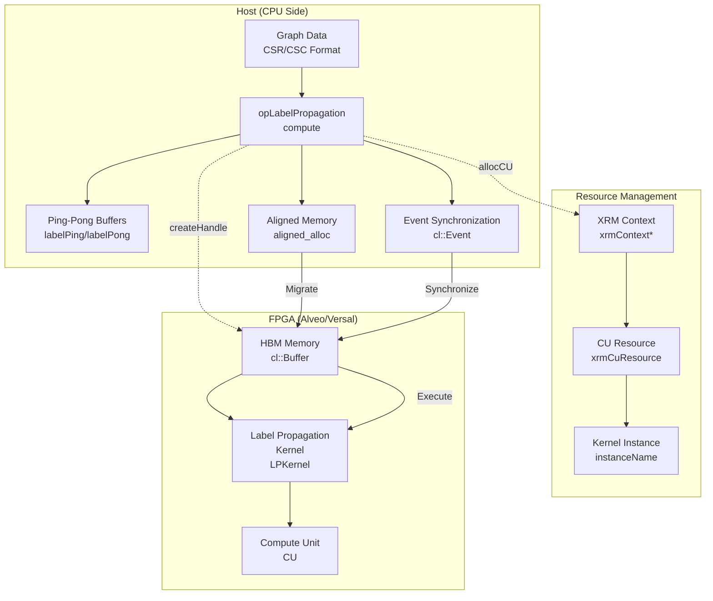

# op_labelpropagation 模块深度解析

## 概述：这个模块解决什么问题？

想象一下，你有一个庞大的社交网络——数十亿用户，数万亿条连接关系——你的任务是发现这个网络中的"社区"：哪些人属于同一个朋友圈、兴趣小组或组织。这是图计算中的**社区发现（Community Detection）**问题。

**标签传播算法（Label Propagation）** 是解决这一问题的经典方法：每个节点初始拥有唯一标签，在每次迭代中，节点会观察其邻居的标签，并切换到出现频率最高的标签。这个过程像传染病一样在图中扩散，直到收敛。

然而，当图规模达到数亿顶点和边时，CPU 上的迭代计算将成为瓶颈。`op_labelpropagation` 模块正是为了**在 FPGA 上加速标签传播算法**而设计的。它不仅仅是一个简单的 kernel 包装器——它是一个完整的**异构计算编排层**，负责管理 FPGA 计算单元（CU）、内存缓冲区、跨设备数据传输，以及迭代过程中的双缓冲（ping-pong）策略。

简单来说，这个模块是**连接高层图算法与底层 FPGA 加速器的桥梁**。它让上层开发者可以像调用普通函数一样执行标签传播，而底层则自动处理 OpenCL 上下文、Xilinx 资源管理（XRM）、HBM 内存分配，以及主机与 FPGA 之间的数据迁移。

---

## 架构心智模型：如何理解这个模块？

### 类比：工厂流水线与双仓库系统

想象一个智能工厂（FPGA），它有多个工作站（Compute Units, CU）。工厂要处理一种特殊的原料（图数据），并经过多次加工（迭代计算）才能产出成品（社区标签）。

这个模块扮演的是**工厂调度中心**的角色：

1. **资源租赁部门（XRM 集成）**：在工厂开始运转前，调度中心需要向"资源管理局"（XRM, Xilinx Resource Manager）申请具体的工作站（CU）使用权限。这涉及复杂的租赁协议（`xrmCuResource`），确保多个任务不会争抢同一个物理 CU。

2. **双仓库系统（Ping-Pong Buffering）**：标签传播是一个**迭代收敛**算法。想象工厂有两个完全相同的仓库 A 和 B（labelPing / labelPong）。第 1 轮迭代时，工人从仓库 A 读取原料，加工后存入仓库 B；第 2 轮则反过来，从 B 读，写入 A。这样交替进行，无需额外清空仓库，实现**零拷贝**的迭代切换。

3. **原料预处理和物流（CSR/CSC + Memory Migration）**：图数据在主机内存中以 CSR（Compressed Sparse Row）和 CSC（Compressed Sparse Column）格式存储。这些数据不能直接使用——它们需要被"装箱"（创建 `cl::Buffer`），并通过专用卡车（PCIe 总线）运输到工厂的 HBM（高带宽内存）仓库中。调度中心使用 OpenCL 的 `enqueueMigrateMemObjects` 来安排这些物流。

4. **工位协调（Multi-CU 与 Event Synchronization）**：当工厂有多个工作站时，调度中心需要确保原料按正确顺序到达，并且成品被正确收集。OpenCL 的 `cl::Event` 就是这里的"签收单"——一个 CU 的任务完成后，事件触发下一个 CU 开始工作。

### 核心抽象层

| 概念 | 对应代码实体 | 职责 |
|------|-------------|------|
| **资源句柄** | `clHandle` | 封装单个 CU 的所有 OpenCL 资源（Context, Queue, Kernel, Buffers, XRM 资源） |
| **资源管理器** | `openXRM` | Xilinx FPGA 资源分配与释放的封装 |
| **计算单元** | `cuPerBoardLabelPropagation` | 每块 FPGA 卡上的并行计算单元数量 |
| **任务队列** | `task_queue` (L3 层) | 异步任务调度队列（通过 `createL3` 宏/模板封装） |

---

## 架构图与数据流



### 端到端数据流详解

**阶段 1：初始化与资源申请（Setup Phase）**

1. **硬件信息配置**：调用 `setHWInfo(numDev, CUmax)` 计算每块 FPGA 卡的 CU 数量（`cuPerBoardLabelPropagation = maxCU / deviceNm`）。这决定了后续可以并行执行的 kernel 实例数。

2. **XRM 资源分配**：在 `createHandle` 中，通过 `xrm->allocCU()` 向 XRM 申请具体的 CU 资源。这是**阻塞式**的——如果资源不足，调用会失败。成功后会得到 `xrmCuResource`，其中包含 `instanceName`（如 "LPKernel:{instanceName}"），这是后续创建 OpenCL Kernel 的关键标识。

3. **OpenCL 上下文创建**：在 `createHandle` 中，依次创建 `cl::Device`、`cl::Context`、`cl::CommandQueue`。注意这里使用了 `CL_QUEUE_OUT_OF_ORDER_EXEC_MODE_ENABLE`，允许命令队列乱序执行，这对后续的事件链优化很重要。

**阶段 2：缓冲区初始化与数据传输（Data Preparation）**

1. **主机内存分配**：在 `compute` 方法中，使用 `aligned_alloc` 分配标签缓冲区（`labelP`）和临时缓冲区（`buffPing`, `buffPong`）。**对齐要求**是 FPGA 数据传输的硬性约束——未对齐的内存会导致迁移失败或性能骤降。

2. **扩展指针与 HBM 拓扑**：在 `bufferInit` 中，创建 `cl_mem_ext_ptr_t` 数组，每个指针通过 `XCL_MEM_TOPOLOGY` 标志指定目标 HBM 区段（如 `(unsigned int)(3) | XCL_MEM_TOPOLOGY`）。这相当于告诉 OpenCL 运行时：**将这些数据放到 FPGA 的特定 HBM 物理位置**，以最大化带宽利用率。

3. **Ping-Pong 双缓冲逻辑**：`bufferInit` 根据 `maxIter % 2` 决定初始标签数组的映射关系。如果迭代次数为奇数，最终结果会落在 `labelPong`；否则落在 `labelPing`。这种设计**消除了每轮迭代间的内存拷贝**，只需交换指针/缓冲区引用即可。

4. **内存迁移**：通过 `migrateMemObj`（内部调用 `enqueueMigrateMemObjects`），数据从主机内存（DDR）传输到 FPGA HBM。注意这里区分了输入迁移（`type=0`，Host to Device）和结果回读（`type=1`，Device to Host）。

**阶段 3：Kernel 执行与同步（Execution）**

1. **Kernel 参数绑定**：在 `bufferInit` 末尾，通过 `kernel0.setArg` 设置所有 12 个参数，包括图元数据（`nodeNum`, `edgeNum`）、迭代次数（`maxIter`），以及 8 个 `cl::Buffer` 对象（CSR/CSC 偏移与索引、Ping-Pong 缓冲区）。

2. **异步执行链**：在 `compute` 中，执行流程被组织为**事件链**：
   - `events_write`：数据写入完成事件
   - `events_kernel`：Kernel 执行完成事件（依赖于 `events_write`）
   - `events_read`：数据回读完成事件（依赖于 `events_kernel`）
   
   这种依赖关系通过 `enqueueTask` 和 `enqueueMigrateMemObjects` 的 `evIn` 参数建立，实现了**流水线化**执行（虽然当前代码 `num_runs=1`，但架构支持批量）。

3. **同步等待**：`events_read[0].wait()` 阻塞主机线程直到 FPGA 完成所有工作。这是**同步接口**设计，确保 `compute` 返回时结果已就绪。

**阶段 4：清理与资源释放（Teardown）**

1. **标记非繁忙**：`hds->isBusy = false` 释放 CU 的占用标记，允许其他任务复用该句柄。

2. **主机内存释放**：`free(buffPing)`, `free(buffPong)` 释放临时缓冲区（注意：`labelP` 未在此释放，可能由调用者管理或留在设备侧，这是**所有权转移**的体现）。

3. **资源释放（freeLabelPropagation）**：在模块生命周期结束时，遍历所有 CU 句柄，释放 XRM 资源（`xrmCuRelease`）并删除缓冲区数组。

---

## 核心组件深度剖析

### 1. `clHandle` —— OpenCL 资源的"集装箱"

虽然代码中没有显示 `clHandle` 的定义，但从使用方式可以推断其结构：

```cpp
struct clHandle {
    cl::Device device;              // FPGA 设备
    cl::Context context;            // OpenCL 上下文
    cl::CommandQueue q;             // 命令队列（带 Profiling 和 Out-of-Order 标志）
    cl::Program program;            // 已加载的二进制程序
    cl::Kernel kernel;              // 具体 Kernel 实例
    std::vector<cl::Buffer> buffer; // 设备内存缓冲区（固定 8 个）
    
    // XRM 资源管理
    xrmCuResource* resR;            // XRM 资源描述符
    
    // 状态管理
    bool isBusy;                    // CU 是否正在被使用
    unsigned int deviceID;          // 所属设备索引
    unsigned int cuID;              // 设备内 CU 索引
    unsigned int dupID;             // 复制 ID（用于 CU 虚拟化）
};
```

**设计意图**：
- **封装复杂性**：将 OpenCL 的 7-8 个核心对象捆绑在一起，避免在函数间传递长参数列表。
- **生命周期管理**：`clHandle` 遵循 **RAII 原则**（虽然代码中显式调用了 `malloc`/`free`，但逻辑上仍体现所有权）。
- **多路复用**：通过 `dupID` 和 `cuPerBoardLabelPropagation`，实现单个物理 CU 的**时间多路复用**（Time-slicing），提升资源利用率。

### 2. `createHandle` —— FPGA 资源的"启动序列"

这是模块最复杂的初始化逻辑，相当于 FPGA 应用的 **BIOS 启动过程**。

**关键步骤与陷阱**：

**a. 设备发现与上下文创建**
```cpp
std::vector<cl::Device> devices = xcl::get_xil_devices();
handle.device = devices[IDDevice];
handle.context = cl::Context(handle.device, NULL, NULL, NULL, &fail);
```
- **陷阱**：`IDDevice` 必须是有效的索引。如果上层传入越界值，这里会抛出 `std::out_of_range` 或未定义行为（`devices[IDDevice]` 引用越界）。
- **设计选择**：使用 `xcl::get_xil_devices` 而非标准 OpenCL `cl::Platform::get`，因为这是** Xilinx 特定扩展**，确保获取的是 Xilinx FPGA 设备而非其他 OpenCL 设备（如 GPU）。

**b. 乱序命令队列**
```cpp
handle.q = cl::CommandQueue(handle.context, handle.device,
                            CL_QUEUE_PROFILING_ENABLE | CL_QUEUE_OUT_OF_ORDER_EXEC_MODE_ENABLE, &fail);
```
- **关键标志**：`CL_QUEUE_OUT_OF_ORDER_EXEC_MODE_ENABLE` 允许 OpenCL 运行时**并行执行**独立的命令，即使它们在代码中顺序入队。这对于后续 `compute` 中的事件链优化至关重要。
- **Profiling**：`CL_QUEUE_PROFILING_ENABLE` 允许使用 `clGetEventProfilingInfo` 获取 kernel 执行时间，用于性能调试。

**c. XRM 资源分配**
```cpp
handle.resR = (xrmCuResource*)malloc(sizeof(xrmCuResource));
memset(handle.resR, 0, sizeof(xrmCuResource));
int ret = xrm->allocCU(handle.resR, kernelName.c_str(), kernelAlias.c_str(), requestLoad);
```
- **所有权模型**：`resR` 由 `createHandle` 通过 `malloc` 分配，由 `freeLabelPropagation` 或 `cuRelease` 通过 `free` 释放。这是一个**原始指针所有权**模式，在现代 C++ 中通常会用 `std::unique_ptr` 代替，但这里为了与 C 风格的 XRM API 兼容而使用裸指针。
- **逻辑**：`requestLoad` 表示请求的负载百分比（100 表示独占）。如果 `allocCU` 失败（`ret != 0`），代码会回退到使用默认实例名 "LPKernel"，但这通常意味着性能下降（共享 CU 或无法使用）。

### 3. `compute` —— 异构计算的"指挥中枢"

这是模块最核心的方法，实现了**主机端-设备端协同计算**的完整工作流。

**内存所有权与生命周期**：
```cpp
uint32_t* labelP = aligned_alloc<uint32_t>(maxVertices);
uint32_t* buffPing = aligned_alloc<uint32_t>(maxVertices);
uint32_t* buffPong = aligned_alloc<uint32_t>(maxVertices);
```
- **分配者**：`compute` 方法使用 `aligned_alloc` 在**主机堆**上分配内存。
- **释放责任**：
  - `buffPing` 和 `buffPong` 在 `compute` 末尾显式 `free`——**compute 拥有这些临时缓冲区的完整所有权**。
  - `labelP`（内部临时交换区）**未被释放**。根据 `maxIter % 2` 的逻辑，最终结果要么在 `labels`（外部传入的输出缓冲区），要么在 `labelP`。代码中缺乏对 `labelP` 的释放逻辑，这是**潜在的内存泄漏**或**设计缺陷**——调用者无法得知是否需要释放 `labelP`。

**Ping-Pong 双缓冲机制**：
```cpp
if (maxIter % 2) {
    bufferInit(hds, instanceName, maxIter, labelP, labels, buffPing, buffPong, g, kernel0, ob_in, ob_out);
} else {
    bufferInit(hds, instanceName, maxIter, labels, labelP, buffPing, buffPong, g, kernel0, ob_in, ob_out);
}
```
- **逻辑**：标签传播每轮迭代需要读取上一轮的所有邻居标签。如果只有一个缓冲区，本轮写入会覆盖上一轮数据，导致邻居读取错误。Ping-Pong 机制让两个缓冲区交替作为"源"和"目标"。
- **奇偶判断**：`maxIter % 2` 决定最终结果落在哪个缓冲区。如果迭代次数为奇数，结果在 `labelPong`（对应代码中的 `labels` 或 `labelP`，取决于哪个被传为 pong 参数）；偶数则在 `labelPing`。

**OpenCL 事件链与同步策略**：
```cpp
std::vector<cl::Event> events_write(1);
std::vector<cl::Event> events_kernel(num_runs);
std::vector<cl::Event> events_read(1);

migrateMemObj(hds, 0, num_runs, ob_in, nullptr, &events_write[0]);
int ret = cuExecute(hds, kernel0, num_runs, &events_write, &events_kernel[0]);
migrateMemObj(hds, 1, num_runs, ob_out, &events_kernel, &events_read[0]);
events_read[0].wait();
```
- **依赖图**：`migrate(H2D)` -> `kernel execute` -> `migrate(D2H)`。这是典型的**生产者-消费者流水线**。
- **事件对象**：`events_write[0]` 在数据迁移完成后触发，作为 `cuExecute` 的等待条件（`evIn`）。`cuExecute` 又生成 `events_kernel[0]`，作为结果回读的触发条件。
- **同步点**：`events_read[0].wait()` 是**硬同步点**，阻塞主机线程直到 FPGA 完成所有工作。这意味着 `compute` 方法是一个**同步阻塞 API**。

---

## 依赖关系与调用图谱

### 上游调用者（谁使用这个模块？）

`opLabelPropagation` 是 **L3 层（算法层）** 的组件，它向上暴露的接口是 `addwork` 方法：

```cpp
event<int> opLabelPropagation::addwork(uint32_t maxIter, 
                                       xf::graph::Graph<uint32_t, uint32_t> g, 
                                       uint32_t* labels);
```

这个方法被 **L4 层（应用层）** 或 **图分析工作流引擎** 调用。根据模块树结构，它属于 `graph_analytics_and_partitioning` -> `l3_openxrm_algorithm_operations` -> `ranking_and_propagation_operations` 路径。

典型的调用场景是：
1. 上层应用构造好图结构 `xf::graph::Graph`（包含 CSR/CSC 表示）
2. 调用 `addwork` 提交异步任务（通过 `createL3` 宏封装为 `event<int>` 返回）
3. L3 框架调度到具体的 `opLabelPropagation` 实例，最终调用 `compute` 方法执行同步计算

### 下游依赖（这个模块调用谁？）

**1. Xilinx 运行时与驱动层**
- `xcl::get_xil_devices()`：Xilinx 设备发现
- `xcl::import_binary_file(xclbinFile)`：加载 FPGA 二进制（xclbin）
- `cl::Context`, `cl::CommandQueue`, `cl::Buffer`, `cl::Kernel`：标准 OpenCL API
- `XCL_MEM_TOPOLOGY`：Xilinx 扩展，用于指定 HBM 内存拓扑位置

**2. XRM（Xilinx Resource Manager）**
- `xrmContext* ctx`：XRM 上下文，在模块外部创建并传入
- `xrm->allocCU()`：分配计算单元资源
- `xrmCuRelease()`：释放 CU 资源

**3. L3 基础设施**
- `xf::graph::Graph<uint32_t, uint32_t>`：图数据结构定义
- `createL3`：L3 层任务创建宏/模板，用于 `addwork`
- `event<int>`：L3 层事件/ future 封装

**4. 工具库**
- `xf::common::utils_sw::Logger`：Xilinx 日志工具，用于记录 OpenCL 错误

---

## 设计决策与权衡

### 1. 同步 API vs 异步 API

**现状**：`compute` 方法是同步阻塞的（通过 `events_read[0].wait()`），但 `addwork` 提供了异步接口（返回 `event<int>`）。

**权衡**：
- **同步内部实现**：简化错误处理和资源管理，确保 `compute` 返回时所有 OpenCL 资源处于确定状态。
- **异步外部接口**：允许上层应用批量提交多个 Label Propagation 任务，由 L3 框架调度到不同 CU，实现**任务级并行**。

**替代方案**：完全异步的 `compute`（返回 `cl::Event`），但这会增加调用者的复杂度——需要管理事件生命周期和错误回调。

### 2. 硬编码缓冲区大小 vs 动态分配

**现状**：代码中出现了 `800000 * 16` 的硬编码最大值：
```cpp
uint32_t V = 800000 * 16;  // 约 1280 万顶点
uint32_t E = 800000 * 16;  // 约 1280 万边
```

**权衡**：
- **优势**：简化 HBM 内存拓扑分配（`XCL_MEM_TOPOLOGY`），避免运行时复杂的内存分区计算。
- **劣势**：
  1. **内存浪费**：对于小图（如 100 万顶点），仍然分配 1280 万顶点的 HBM 空间。
  2. **可扩展性限制**：对于大图（超过 1280 万顶点），会静默截断或崩溃。

**建议改进**：从图结构 `g` 中动态获取 `V` 和 `E`，并向上对齐到 HBM 区段边界，实现按需分配。

### 3. 原始指针 vs 智能指针

**现状**：代码中大量使用裸指针（`malloc`/`free`）和原始数组：
```cpp
handle.resR = (xrmCuResource*)malloc(sizeof(xrmCuResource));
uint32_t* labelP = aligned_alloc<uint32_t>(maxVertices);
handles = new clHandle[CUmax];
```

**权衡**：
- **优势**：
  - 与 C 风格 API（XRM、OpenCL C API）无缝兼容。
  - 明确的内存布局控制，适合 FPGA 相关的对齐需求。
- **劣势**：
  - **异常不安全**：如果 `compute` 中间抛出异常，`labelP`、`buffPing` 等会泄漏。
  - **所有权模糊**：`labelP` 是否在 `compute` 后释放？代码中没有体现，导致维护者困惑。

**建议改进**：
- 使用 `std::unique_ptr` 管理主机内存（配合自定义 deleter 处理 `aligned_alloc`）。
- 或者使用 `std::vector` 并指定对齐分配器，自动管理生命周期。

### 4. 忙等待 vs 条件变量

**现状**：`cuRelease` 方法使用了忙等待：
```cpp
void opLabelPropagation::cuRelease(xrmContext* ctx, xrmCuResource* resR) {
    while (!xrmCuRelease(ctx, resR)) {
        // busy loop
    };
    free(resR);
}
```

**权衡**：
- **设计意图**：确保 CU 资源被强制释放，即使需要多次尝试。
- **风险**：
  - 如果 XRM 进入不可恢复的错误状态，`cuRelease` 将**无限循环**，导致整个应用挂起。
  - 忙等待消耗 100% CPU，直到释放成功。

**建议改进**：
- 添加最大重试次数，超过后抛出异常或返回错误码。
- 使用指数退避策略，在重试间添加短暂睡眠，降低 CPU 占用。

---

## 设计权衡与替代方案

### 1. 同步 API vs 异步 API

**现状**：`compute` 方法是同步阻塞的（通过 `events_read[0].wait()`），但 `addwork` 提供了异步接口（返回 `event<int>`）。

**权衡**：
- **同步内部实现**：简化错误处理和资源管理，确保 `compute` 返回时所有 OpenCL 资源处于确定状态。
- **异步外部接口**：允许上层应用批量提交多个 Label Propagation 任务，由 L3 框架调度到不同 CU，实现**任务级并行**。

**替代方案**：完全异步的 `compute`（返回 `cl::Event`），但这会增加调用者的复杂度——需要管理事件生命周期和错误回调。

### 2. 硬编码缓冲区大小 vs 动态分配

**现状**：代码中出现了 `800000 * 16` 的硬编码最大值：
```cpp
uint32_t V = 800000 * 16;  // 约 1280 万顶点
uint32_t E = 800000 * 16;  // 约 1280 万边
```

**权衡**：
- **优势**：简化 HBM 内存拓扑分配（`XCL_MEM_TOPOLOGY`），避免运行时复杂的内存分区计算。
- **劣势**：
  1. **内存浪费**：对于小图（如 100 万顶点），仍然分配 1280 万顶点的 HBM 空间。
  2. **可扩展性限制**：对于大图（超过 1280 万顶点），会静默截断或崩溃。

**建议改进**：从图结构 `g` 中动态获取 `V` 和 `E`，并向上对齐到 HBM 区段边界，实现按需分配。

### 3. 原始指针 vs 智能指针

**现状**：代码中大量使用裸指针（`malloc`/`free`）和原始数组：
```cpp
handle.resR = (xrmCuResource*)malloc(sizeof(xrmCuResource));
uint32_t* labelP = aligned_alloc<uint32_t>(maxVertices);
handles = new clHandle[CUmax];
```

**权衡**：
- **优势**：
  - 与 C 风格 API（XRM、OpenCL C API）无缝兼容。
  - 明确的内存布局控制，适合 FPGA 相关的对齐需求。
- **劣势**：
  - **异常不安全**：如果 `compute` 中间抛出异常，`labelP`、`buffPing` 等会泄漏。
  - **所有权模糊**：`labelP` 是否在 `compute` 后释放？代码中没有体现，导致维护者困惑。

**建议改进**：
- 使用 `std::unique_ptr` 管理主机内存（配合自定义 deleter 处理 `aligned_alloc`）。
- 或者使用 `std::vector` 并指定对齐分配器，自动管理生命周期。

### 4. 忙等待 vs 条件变量

**现状**：`cuRelease` 方法使用了忙等待：
```cpp
void opLabelPropagation::cuRelease(xrmContext* ctx, xrmCuResource* resR) {
    while (!xrmCuRelease(ctx, resR)) {
        // busy loop
    };
    free(resR);
}
```

**权衡**：
- **设计意图**：确保 CU 资源被强制释放，即使需要多次尝试。
- **风险**：
  - 如果 XRM 进入不可恢复的错误状态，`cuRelease` 将**无限循环**，导致整个应用挂起。
  - 忙等待消耗 100% CPU，直到释放成功。

**建议改进**：
- 添加最大重试次数，超过后抛出异常或返回错误码。
- 使用指数退避策略，在重试间添加短暂睡眠，降低 CPU 占用。

---

## 使用示例与配置指南

### 基本使用流程

```cpp
#include "op_labelpropagation.hpp"
#include <xrm.h>

int main() {
    // 1. 创建 XRM 上下文
    xrmContext* ctx = xrmCreateContext(XRM_API_VERSION_1);
    
    // 2. 创建 openXRM 实例（资源管理器）
    openXRM xrm;
    
    // 3. 创建 Label Propagation 操作器
    opLabelPropagation lp;
    
    // 4. 配置硬件信息（2 张卡，共 4 个 CU）
    lp.setHWInfo(2, 4);
    
    // 5. 初始化（加载 xclbin，创建上下文和 kernel）
    uint32_t deviceIDs[] = {0, 0, 1, 1};
    uint32_t cuIDs[] = {0, 1, 0, 1};
    lp.init(&xrm, "LPKernel", "labelprop", "labelpropagation.xclbin", 
            deviceIDs, cuIDs, 100);
    
    // 6. 准备图数据（CSR/CSC 格式）
    xf::graph::Graph<uint32_t, uint32_t> g;
    g.nodeNum = 1000000;
    g.edgeNum = 5000000;
    // ... 填充 g.offsetsCSR, g.indicesCSR 等 ...
    
    // 7. 准备输出标签缓冲区
    uint32_t* labels = aligned_alloc<uint32_t>(g.nodeNum);
    
    // 8. 执行任务（同步方式）
    lp.compute(0, 0, 0, ctx, nullptr, "LPKernel_0", lp.handles,
               100, g, labels);
    
    // 9. 使用结果（labels 数组中现在包含每个顶点的社区标签）
    // ... 分析社区结构 ...
    
    // 10. 清理
    free(labels);
    lp.freeLabelPropagation(ctx);
    xrmDestroyContext(ctx);
    
    return 0;
}
```

### 关键配置参数

| 参数 | 说明 | 建议值 |
|------|------|--------|
| `requestLoad` | XRM 资源请求负载（百分比） | 100（独占）用于生产环境；50-80 用于共享环境 |
| `maxIter` | 标签传播最大迭代次数 | 通常 50-200，取决于图的收敛速度 |
| `V` / `E` | 缓冲区顶点/边容量 | 根据实际图大小调整，注意硬编码限制 |

### 性能调优建议

1. **HBM 内存拓扑优化**：根据 FPGA 卡的具体 HBM 配置（如 Alveo U280 有 8 个 HBM 区段），调整 `XCL_MEM_TOPOLOGY` 参数，将高频访问的数据（如 `offsetsCSR`）分散到不同区段，最大化带宽。

2. **迭代次数与收敛检测**：当前实现使用固定迭代次数。生产环境中应考虑添加收敛检测（当标签变化率低于阈值时提前退出），减少不必要的计算。

3. **批处理与多 CU 并行**：对于多个独立图的社区发现任务，使用 `init` 配置的多个 CU，通过 `addwork` 批量提交任务，实现 CU 级并行。

---

## 总结与延伸阅读

`op_labelpropagation` 模块是 **Xilinx 图分析 L3 库** 的核心组件，它展示了如何在 FPGA 上高效实现迭代图算法。关键要点：

1. **双缓冲（Ping-Pong）** 是迭代算法的经典优化，避免数据拷贝开销。
2. **XRM 资源管理** 是生产环境多任务共享 FPGA 的关键，需要谨慎处理生命周期。
3. **OpenCL 事件链** 实现了主机-设备流水线，但当前实现是同步阻塞的，可以根据需要改为异步。

### 相关模块参考

- [op_pagerank](graph-L3-src-op_pagerank.md)：相似的 L3 图算法模块，实现 PageRank 算法，可以参考对比其实现模式。
- [l3_openxrm_algorithm_operations](graph_analytics_and_partitioning-l3_openxrm_algorithm_operations.md)：L3 算法操作的上层框架，理解 `addwork` 和 `createL3` 的调用机制。

### 外部参考

- [Xilinx Alveo 文档](https://www.xilinx.com/alveo)：了解 FPGA 加速卡硬件架构和 HBM 配置。
- [OpenCL 1.2 规范](https://www.khronos.org/opencl/)：理解 `cl::Event`、`cl::CommandQueue` 等核心概念。
- [XRM 用户指南](https://github.com/Xilinx/XRM)：深入了解 Xilinx 资源管理机制。

