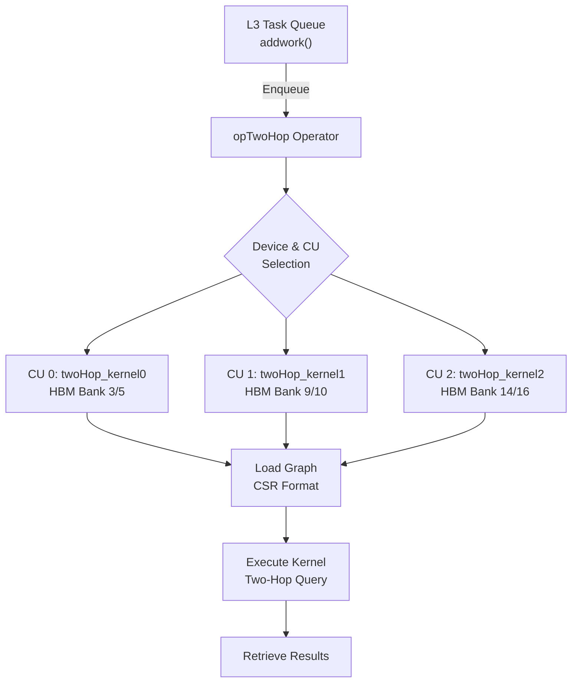

# op_twohop 模块技术深度解析

## 概述：在 FPGA 上加速"朋友的朋友"查询

想象你正在构建一个社交网络推荐系统，需要快速回答这样的问题："找出所有与我间隔两度关系的人"——即我的朋友的朋友（Two-Hop Neighbors）。在图论中，这是一个典型的**两跳邻居查询**（Two-Hop Query）。当图规模达到数十亿边时，CPU 上的遍历会成为瓶颈。

`op_twohop` 模块正是为解决这一特定问题而设计的 FPGA 加速层。它位于 Xilinx Graph Library 的 L3（Level 3）抽象层，将底层 OpenCL 设备管理、高带宽存储器（HBM）布局、多计算单元（CU）调度等复杂性封装成一个可重用的运算符。其核心价值在于：**通过显式的 HBM 内存银行映射和零拷贝（Zero-Copy）缓冲区策略，最大化图结构数据的访存带宽，从而在多批次查询场景下实现高吞吐的两跳邻居计算**。

---

## 架构设计：多 CU 协同的流水线

从架构视角看，`op_twohop` 并非孤立的函数集合，而是一个**资源感知的加速器管理器**。它协调多个 FPGA 计算单元（CU），管理图数据在 HBM 中的分布，并通过异步任务队列暴露给上层应用。



### 核心组件职责

| 组件 | 角色定位 | 关键职责 |
|------|----------|----------|
| `opTwoHop` 类 | **加速器管理器** | 生命周期管理（初始化/释放）、CU 资源分配、任务调度接口（`addwork`） |
| `clHandle` 结构体 | **资源聚合体** | 每个 CU 持有独立的 OpenCL 上下文（`cl::Context`）、命令队列（`cl::CommandQueue`）、内核对象（`cl::Kernel`）及缓冲区数组 |
| `openXRM` 接口 | **硬件资源代理** | 通过 Xilinx Resource Manager (XRM) 在 FPGA 上分配物理 CU，处理多租户场景下的资源争用 |
| `loadGraphCoreTwoHop` | **数据搬运工** | 将图数据从主机内存上传至 FPGA HBM，需显式处理内存银行拓扑（Memory Bank Topology）以匹配内核布线 |

---

## 数据流解析：从主机到 HBM 的全链路

理解 `op_twohop` 的关键在于追踪**图数据**和**查询数据**两条数据流。这两条流在时序上解耦：图数据通常一次性加载（或极少更新），而查询数据则随业务请求持续到达。

### 阶段一：图数据上传（Graph Loading）

图数据采用 **CSR（Compressed Sparse Row）** 格式存储，包含两个数组：
- `offsetsCSR`：长度为 $nrows+1$，记录每个顶点的邻居列表在 `indicesCSR` 中的起始/结束位置
- `indicesCSR`：长度为 $nnz$（非零边数），存储实际的邻居顶点 ID

数据流路径如下：

```
Host Memory (Graph g)
├─ g.offsetsCSR ──┐
└─ g.indicesCSR ──┼──[Zero-Copy Mapping]──► HBM Bank N (FPGA)
                  │                          (Physical Bank 3/5/9/etc)
                  └─ XCL_MEM_TOPOLOGY flags map host ptr to specific bank
```

关键代码路径在 `loadGraphCoreTwoHop` 中。该函数根据内核实例名（如 `twoHop_kernel0`）显式选择 **HBM 内存银行**（Bank 3/5 用于 kernel0，Bank 9/10 用于 kernel1，以此类推）。这是为了确保 FPGA 内核逻辑引脚与物理 HBM 银行正确连接，**这是性能关键路径**：错误的银行映射会导致路由失败或严重降速。

缓冲区创建使用 `CL_MEM_EXT_PTR_XILINX | CL_MEM_USE_HOST_PTR` 标志，这意味着：
- **零拷贝**：主机指针直接映射到 FPGA 地址空间，避免显式 `memcpy`
- **页对齐要求**：主机内存必须页对齐（通常由 `posix_memalign` 保证）
- **NUMA 亲和性**：在 NUMA 系统中，内存应分配在 FPGA 所在插槽

### 阶段二：查询执行（Query Execution）

当图数据驻留 HBM 后，查询执行涉及三类数据：

1. **输入对（pairPart）**：64 位整数数组，每对表示一个查询（通常编码源顶点 ID 和其他元数据）
2. **结果缓冲（resPart）**：32 位整数数组，存储两跳邻居结果
3. **图结构**：已驻留 HBM 的 CSR 数组

执行流程在 `compute` 方法中编排：

```
1. bufferInit(): 创建 pairPart/resPart 缓冲区，绑定到特定 HBM 银行
2. migrateMemObj(H2D): 将输入查询对从主机迁移到 FPGA（零拷贝路径仍可能需 MMU 页表更新）
3. cuExecute(): 启动 kernel 执行，传递参数：
   - Arg 0: numPart (查询批次大小)
   - Arg 1: pairPart 缓冲区 (输入)
   - Arg 2-3: 一跳 CSR (offsetsCSR, indicesCSR)
   - Arg 4-5: 二跳 CSR (offsetsCSR, indicesCSR)
   - Arg 6: resPart 缓冲区 (输出)
4. migrateMemObj(D2H): 将结果读回主机（同样零拷贝，但需缓存一致性同步）
```

### 阶段三：多 CU 并行与负载均衡

`op_twohop` 支持在多个设备和 CU 上并行执行。关键机制包括：

**CU 复制（Duplication）**：通过 `dupNmTwoHop = 100 / requestLoad` 计算，每个物理 CU 可逻辑复制为多个虚拟 CU。例如，若 `requestLoad=25`，则每个物理 CU 承载 4 个逻辑 CU（handle）。这允许单个物理 CU 并发处理多个小批次查询，提高流水线利用率。

**图数据共享**：在 `loadGraph` 中，第一个 dupID=0 的 handle 负责实际创建缓冲区，其他 duplicated handles 通过指针复制共享这些缓冲区（`handles[j].buffer[k] = handles[cnt].buffer[k]`）。这避免了重复上传图数据，节省 HBM 空间和上传时间。

**设备偏移（deviceOffset）**：维护设备到 handle 索引的映射，支持跨多 FPGA 卡的查询路由。

---

## 核心组件深度剖析

### 1. `createHandle`：OpenCL 上下文的工厂

```cpp
void opTwoHop::createHandle(class openXRM* xrm, ...)
```

这是每个 CU 的生命周期起点，负责构建完整的 OpenCL 执行环境。其内部逻辑可分为五个阶段：

**阶段 1：设备发现与上下文创建**
```cpp
std::vector<cl::Device> devices = xcl::get_xil_devices();
handle.device = devices[IDDevice];
handle.context = cl::Context(handle.device, NULL, NULL, NULL, &fail);
```
- 使用 Xilinx 特定的 `xcl::get_xil_devices()` 枚举 FPGA 设备
- 创建关联指定设备的 OpenCL 上下文

**阶段 2：命令队列配置**
```cpp
handle.q = cl::CommandQueue(handle.context, handle.device,
                            CL_QUEUE_PROFILING_ENABLE | CL_QUEUE_OUT_OF_ORDER_EXEC_MODE_ENABLE, &fail);
```
- 启用性能分析（`CL_QUEUE_PROFILING_ENABLE`）用于后续时序测量
- 启用乱序执行（`CL_QUEUE_OUT_OF_ORDER_EXEC_MODE_ENABLE`）允许 OpenCL 运行时重排独立命令以优化吞吐量

**阶段 3：XCLBIN 加载与程序构建**
```cpp
handle.xclBins = xcl::import_binary_file(xclbinFile);
handle.program = cl::Program(handle.context, devices2, handle.xclBins, NULL, &fail);
```
- 加载包含 FPGA 比特流的 XCLBIN 文件
- 为指定设备编译/构建 OpenCL 程序对象

**阶段 4：XRM 资源分配**
```cpp
handle.resR = (xrmCuResource*)malloc(sizeof(xrmCuResource));
int ret = xrm->allocCU(handle.resR, kernelName.c_str(), kernelAlias.c_str(), requestLoad);
```
- 通过 Xilinx Resource Manager (XRM) 分配物理 CU
- `requestLoad`（通常为 25-100）表示该 CU 期望的负载百分比，影响 XRM 的调度决策

**阶段 5：内核对象创建**
```cpp
handle.kernel = cl::Kernel(handle.program, instanceName, &fail);
```
- 根据 XRM 返回的实例名（如 `twoHop_kernel:{twoHop_kernel0}`）创建内核对象
- 该名称必须与 XCLBIN 中定义的 RTL 内核实例名精确匹配

### 2. `loadGraphCoreTwoHop`：HBM 内存布局工程师

```cpp
void loadGraphCoreTwoHop(clHandle* hds, int nrows, int nnz, int cuID, xf::graph::Graph<uint32_t, float> g)
```

这是整个模块中最**硬件感知**的函数。它不仅仅是上传数据，更是在 FPGA 的 HBM（高带宽存储器）上进行**物理布局布线**。

**HBM 银行拓扑映射**

代码中最显眼的部分是巨大的 `if-else` 链：

```cpp
if (std::string(hds[0].resR->instanceName) == "twoHop_kernel0") {
    mext_in[0] = {(unsigned int)(3) | XCL_MEM_TOPOLOGY, g.offsetsCSR, 0};
    mext_in[1] = {(unsigned int)(3) | XCL_MEM_TOPOLOGY, g.indicesCSR, 0};
    // ... Bank 5 for two-hop CSR
} else if (...) // kernel1 uses Bank 9/10, etc.
```

这里的关键是 `XCL_MEM_TOPOLOGY` 标志和银行编号（3, 5, 9, 10, ...）。这告诉 Xilinx OpenCL 运行时：
1. **使用特定的 HBM 银行**：每个 FPGA（如 Alveo U50/U280）有多个 HBM 银行（通常 32 个或更多），每个提供独立的高带宽通道。
2. **匹配 RTL 内核约束**：FPGA 内核在 Vivado 综合/实现时，其 AXI 接口被约束到特定的 HBM 银行。主机代码的银行映射必须与这些硬件约束**字节级精确匹配**，否则会导致运行时错误或严重性能下降。

**零拷贝缓冲区创建**

```cpp
hds[0].buffer[0] = cl::Buffer(context, CL_MEM_EXT_PTR_XILINX | CL_MEM_USE_HOST_PTR | CL_MEM_READ_WRITE,
                              sizeof(uint32_t) * (nrows + 1), &mext_in[0]);
```

这里的标志组合揭示了一个关键优化：
- `CL_MEM_USE_HOST_PTR`：使用主机已分配的内存（`g.offsetsCSR` 等）作为缓冲区 backing store，不分配新设备内存
- `CL_MEM_EXT_PTR_XILINX`：配合 `cl_mem_ext_ptr_t` 结构，传递 Xilinx 特定的扩展信息（如 HBM 银行 ID）
- 结果：**零拷贝（Zero-Copy）**：主机指针直接成为 FPGA 可见的缓冲区，通过 PCIe 上的 ATS（Address Translation Services）或类似机制，FPGA DMA 可直接读写主机页。这避免了传统 `clEnqueueWriteBuffer` 的额外内存复制开销。

**异步数据迁移**

```cpp
q.enqueueMigrateMemObjects(ob_in, 0, nullptr, &eventSecond[0]); // 0 : migrate from host to dev
eventSecond[0].wait();
```

即使使用零拷贝，首次访问仍需触发页表映射和可能的预取。`enqueueMigrateMemObjects` 提示运行时准备这些页，显式等待 (`wait()`) 确保数据在 kernel 启动前就绪。

### 3. `bufferInit` 与 `compute`：执行流水线编排

```cpp
void opTwoHop::bufferInit(...)
int opTwoHop::compute(...)
```

这两个函数构成了**查询执行的主路径**。如果说 `loadGraph` 是数据预准备阶段，那么这对函数就是实时查询的响应路径。

**查询数据布局**

不同于图数据的静态 CSR，查询数据（输入顶点对和输出结果）是动态的：

```cpp
// Input: pairPart - 64-bit packed query pairs
hds[0].buffer[4] = cl::Buffer(context, ..., sizeof(uint64_t) * numPart, &mext_in[0]);

// Output: resPart - 32-bit result counts or indices  
hds[0].buffer[5] = cl::Buffer(context, ..., sizeof(uint32_t) * numPart, &mext_in[1]);
```

`pairPart` 通常编码源顶点 ID 和其他元数据（如目标顶点范围或查询类型），`resPart` 接收两跳邻居计算结果（通常是邻居数量或实际邻居 ID 列表）。

**Kernel 参数绑定**

`bufferInit` 的核心任务是将 OpenCL 缓冲区对象绑定到 kernel 参数槽位：

```cpp
kernel0.setArg(0, numPart);          // 标量：查询批次大小
kernel0.setArg(1, hds[0].buffer[4]); // 缓冲区：pairPart 输入
kernel0.setArg(2, hds[0].buffer[0]); // 缓冲区：一跳 CSR offsets
kernel0.setArg(3, hds[0].buffer[1]); // 缓冲区：一跳 CSR indices
kernel0.setArg(4, hds[0].buffer[2]); // 缓冲区：二跳 CSR offsets
kernel0.setArg(5, hds[0].buffer[3]); // 缓冲区：二跳 CSR indices
kernel0.setArg(6, hds[0].buffer[5]); // 缓冲区：resPart 输出
```

注意 kernel 接收的是**分离的 CSR 结构**（一跳和二跳分别存储），这允许 kernel 预加载一跳邻居到片上缓存，然后异步读取二跳邻居，最大化内存并行性。

**三阶段执行流水线**

`compute` 方法实现了经典的加速器执行模式：

```
Host Data → [H2D Migration] → FPGA Computation → [D2H Migration] → Host Results
     ↑                          ↓                        ↑
  bufferInit                cuExecute              event.wait()
```

1. **H2D（Host-to-Device）**：`migrateMemObj(hds, 0, ...)` 将 `pairPart` 输入数据迁移到 FPGA。`0` 标志表示 H2D 方向。

2. **计算**：`cuExecute` 启动 kernel。注意它使用 `enqueueTask` 而非 `enqueueNDRange`，这表明 kernel 是**单工作项（single-work-item）**或**单计算单元**模式，通常对应 RTL 内核或高度优化的 HLS 内核，自行内部调度并行。

3. **D2H（Device-to-Host）**：`migrateMemObj(hds, 1, ...)` 将 `resPart` 结果读回主机。`1` 标志表示 D2H 方向。

4. **同步**：`events_read[0].wait()` 阻塞直到结果就绪，随后设置 `hds->isBusy = false` 标记 CU 空闲。

### 4. `addwork`：L3 任务队列集成

```cpp
event<int> opTwoHop::addwork(uint32_t numPart, uint64_t* pairPart, uint32_t* resPart, xf::graph::Graph<uint32_t, float> g)
```

这是 `opTwoHop` 对外暴露的主要 API。它返回一个 `event<int>`，这是 Xilinx Graph Library L3 层的**异步事件句柄**，允许调用者以非阻塞方式提交工作，稍后查询完成状态或等待结果。

内部实现使用 `createL3` 辅助函数，将 `compute` 方法包装为任务队列条目。这实现了**线程池模式**：后台工作线程从队列消费任务，主线程继续处理其他请求。

---

## 依赖关系与调用图谱

### 向上依赖（谁调用我）

`op_twohop` 位于软件栈的 L3 层，通常被以下组件调用：

- **Benchmark/测试应用**：直接调用 `addwork` 进行性能评估
- **更高层图算法库**：如相似度计算（[op_similaritydense](graph-L3-src-op_similaritydense.md), [op_similaritysparse](graph-L3-src-op_similaritysparse.md)），可能将两跳查询作为子步骤
- **GQL（Graph Query Language）执行引擎**：解析查询计划后路由到具体算子

### 向下依赖（我调用谁）

| 依赖模块 | 角色 | 关键交互点 |
|----------|------|------------|
| `openXRM` (Xilinx Resource Manager) | 硬件资源分配 | `xrm->allocCU()` 分配物理 CU；`xrmCuRelease()` 释放资源 |
| OpenCL Runtime (Xilinx Vendor Extensions) | 设备抽象层 | `cl::Context`, `cl::CommandQueue`, `cl::Buffer`, `cl::Kernel` 管理 |
| `xf::graph::Graph<>` | 图数据结构定义 | 读取 `g.nodeNum`, `g.edgeNum`, `g.offsetsCSR`, `g.indicesCSR` |
| `xf::common::utils_sw::Logger` | 诊断与调试 | OpenCL 错误码日志记录 |

### 数据契约

**输入契约（调用者必须保证）**：
1. **图数据有效性**：`g.offsetsCSR` 和 `g.indicesCSR` 指针必须有效且已分配，长度为 `(nrows+1)` 和 `nnz`
2. **内存对齐**：用于 FPGA 缓冲区的内存必须通过 `posix_memalign` 或类似机制页对齐（通常 4KB 边界）
3. **XRM 上下文**：`init()` 必须在任何 `addwork` 之前调用，且 `openXRM` 指针在对象生命周期内保持有效
4. **CU 容量**：并发查询数不得超过 `maxCU`，否则需要排队

**输出契约（模块保证）**：
1. **结果缓冲区写入**：`resPart` 缓冲区将在计算完成后包含有效数据，格式为 32 位整数数组
2. **状态通知**：`isBusy` 标志在 CU 执行期间为 true，完成后置为 false
3. **资源释放**：`freeTwoHop` 将正确释放所有 OpenCL 对象和 XRM 资源

---

## 设计决策与权衡

### 1. 显式 HBM 银行映射 vs. 自动内存分配

**选择**：代码中硬编码了 5 种 CU 配置（kernel0-4）到特定 HBM 银行（3/5, 9/10, 14/16, 20/23, 27/25）的映射。

**权衡**：
- **性能收益**：确保 FPGA 物理引脚与 HBM 银行匹配，最大化带宽利用率（可接近 HBM 理论峰值 460GB/s）
- **可移植性代价**：代码与特定 FPGA 平台（Alveo U50/U280）的内存拓扑强耦合。更换平台（如 Versal）需重写映射表
- **维护复杂性**：新增 CU 需要添加新的 if-else 分支，容易出错

**替代方案**：使用抽象内存池（如 Xilinx 的 `cl_ext_xilinx` 自动银行分配），但会损失对性能关键的布局控制。

### 2. 零拷贝（Zero-Copy）vs. 显式 DMA

**选择**：使用 `CL_MEM_USE_HOST_PTR` 创建与主机内存共享的缓冲区，而非显式 `enqueueWriteBuffer`。

**权衡**：
- **延迟优化**：避免额外的数据拷贝，尤其适合图数据量巨大（数十 GB）的场景
- **页对齐约束**：要求主机内存必须页对齐，增加了调用者（上层库）的复杂性
- **NUMA 敏感性**：在 NUMA 系统中，若主机内存分配在与 FPGA 不同的插槽，零拷贝可能通过互联（如 UPI）访问，带宽骤降

**设计意图**：假设上层已处理好 NUMA 亲和性和对齐，本模块专注于 FPGA 侧效率。

### 3. 线程级并行（LoadGraph 异步）vs. 同步上传

**选择**：在 `loadGraph` 中使用 `std::packaged_task` 和 `std::thread` 异步执行 `loadGraphCoreTwoHop`。

**权衡**：
- **并发隐藏**：图上传是 I/O 密集型（PCIe + HBM 写入），异步允许主机线程继续其他工作（如准备下一批查询）
- **复杂性**：需要管理 `std::future` 和线程 join，增加了同步逻辑（`freed[]` 数组跟踪哪些线程已完成）
- **内存模型**：`dupID != 0` 的 handles 需要等待 `dupID == 0` 的线程完成并复制缓冲区指针，这引入了隐式依赖

**替代方案**：同步上传代码更简单，但在多 CU 场景下启动延迟显著。

### 4. 资源管理：RAII vs. 显式 free

**选择**：使用显式 `init` / `freeTwoHop` 模式，而非构造函数/析构函数 RAII。

**权衡**：
- **灵活性**：允许两步初始化（先构造对象，延迟到资源可用时再 init），适合复杂的多 FPGA 拓扑发现场景
- **易错性**：调用者可能忘记调用 `freeTwoHop`，或在异常路径中遗漏释放，导致 CU 泄漏（XRM 资源无法被其他进程使用）
- **异常安全**：当前代码没有异常处理（`try-catch`），OpenCL 错误通过 `logger` 记录但通常不阻止继续执行，可能导致未定义行为

**建议改进**：使用 `std::unique_ptr` 管理 `handles` 数组，自定义删除器调用 `freeTwoHop` 逻辑。

---

## 使用模式与示例

### 典型初始化序列

```cpp
// 1. 准备 XRM 上下文
openXRM xrm;
xrmContext* ctx = xrmCreateContext();

// 2. 创建 opTwoHop 实例（通常通过工厂或 L3 上下文）
opTwoHop twoHopOp;

// 3. 设备与 CU 配置
uint32_t deviceIDs[] = {0, 0, 1, 1}; // 2 个设备，每个 2 个 CU
uint32_t cuIDs[] = {0, 1, 0, 1};
unsigned int requestLoad = 25; // 每个 CU 25% 负载，暗示可并行 4 个查询

// 4. 初始化
// 参数：XRM 指针，内核名，别名，比特流文件，设备 IDs，CU IDs，请求负载
twoHopOp.init(&xrm, "twoHop_kernel", "twoHop", "twoHop.xclbin", 
              deviceIDs, cuIDs, requestLoad);
```

### 图数据加载

```cpp
// 准备 CSR 格式图数据
xf::graph::Graph<uint32_t, float> g;
g.nodeNum = numVertices;
g.edgeNum = numEdges;
// 必须使用页对齐内存分配！
posix_memalign((void**)&g.offsetsCSR, 4096, sizeof(uint32_t) * (numVertices + 1));
posix_memalign((void**)&g.indicesCSR, 4096, sizeof(uint32_t) * numEdges);
// ... 填充 CSR 数据 ...

// 加载到特定设备和 CU
twoHopOp.loadGraph(deviceID, cuID, g);
// 注意：这会启动后台线程异步上传，立即返回
// 但第一次 addwork 会隐式等待上传完成
```

### 执行查询与获取结果

```cpp
// 准备查询批次
uint32_t numQueries = 1024;
uint64_t* pairPart; // 64-bit packed queries
uint32_t* resPart;  // 32-bit results
posix_memalign((void**)&pairPart, 4096, sizeof(uint64_t) * numQueries);
posix_memalign((void**)&resPart, 4096, sizeof(uint32_t) * numQueries);

// ... 填充 pairPart 与查询顶点 ID ...

// 方式 1：同步执行（通过 L3 任务队列包装）
auto event = twoHopOp.addwork(numQueries, pairPart, resPart, g);
event.wait(); // 阻塞直到完成
// resPart 现在包含有效结果

// 方式 2：直接调用（高级用法，需手动管理 CU 选择）
// int ret = twoHopOp.compute(deviceID, cuID, channelID, ctx, resR, 
//                              instanceName, handles, numPart, pairPart, resPart, g);
```

### 资源释放

```cpp
// 释放顺序至关重要
// 在对象析构或程序退出时调用
twoHopOp.freeTwoHop(ctx);

// 注意：pairPart/resPart 是调用者分配的，需自行释放
free(pairPart);
free(resPart);

// 图数据 CSR 数组同样由调用者管理
free(g.offsetsCSR);
free(g.indicesCSR);
```

---

## 关键风险与边缘情况（Gotchas）

### 1. 内存对齐陷阱（最常见错误）

**问题**：若传递给 `loadGraph` 或 `bufferInit` 的主机指针不是页对齐（通常 4KB 边界），`CL_MEM_USE_HOST_PTR` 会失败或导致段错误。

**检测**：在调试构建中启用 OpenCL 验证层，或添加显式检查：
```cpp
if ((uintptr_t)ptr % 4096 != 0) {
    throw std::runtime_error("Pointer not page aligned!");
}
```

**解决**：始终使用 `posix_memalign` 或 `std::aligned_alloc` 分配 FPGA 缓冲区。

### 2. HBM 银行映射版本不匹配

**问题**：XCLBIN 文件与主机代码的 HBM 银行映射必须严格一致。若重新编译了 XCLBIN（改变了 AXI 接口约束），但主机代码未更新 `loadGraphCoreTwoHop` 中的 `if-else` 链，将导致运行时错误或未定义行为。

**检测**：在 `bufferInit` 和 `loadGraphCoreTwoHop` 中添加内核实例名校验：
```cpp
if (instanceName.find(expectedName) == std::string::npos) {
    logger.logError("Kernel instance mismatch!");
}
```

**解决**：将 XCLBIN 元数据（如 `xclbinutil --info` 输出）纳入版本控制，并在 CI 中校验主机代码映射表。

### 3. CU 复制（Duplication）与缓冲区生命周期

**问题**：`loadGraph` 使用异步线程上传图数据，且 `dupID != 0` 的 handles 会共享 `dupID == 0` 的缓冲区指针。若在图数据仍在上传时立即调用 `addwork`，或提前释放主机端图内存，将导致数据竞争或非法内存访问。

**检测**：使用 ThreadSanitizer 或自定义钩子追踪 `loadGraphCoreTwoHop` 完成事件。

**解决**：
- 确保首次 `addwork` 前有显式同步点（如调用 `loadGraph` 后插入 `std::this_thread::sleep_for` 仅用于测试，生产环境应使用 proper barrier）
- 或修改 `loadGraph` 返回 `std::future` 供调用者显式等待
- 确保图数据主机内存在 `freeTwoHop` 调用前保持有效

### 4. XRM 资源泄漏

**问题**：`freeTwoHop` 中调用 `xrmCuRelease` 可能失败（返回非零），但代码仅打印错误继续。若 XRM 上下文异常，CU 可能无法释放，导致其他进程或后续运行无法分配 CU。

**检测**：监控 XRM 日志中的 "Failed to release CU" 错误。

**解决**：
- 实现重试逻辑（如指数退避）
- 或标记 CU 为 "leaked" 并在进程退出时通过 XRM 强制清理
- 确保 `freeTwoHop` 在异常路径（如异常抛出）中被调用（使用 RAII guard）

### 5. 整数溢出与类型不匹配

**问题**：`numPart`（查询数量）是 `uint32_t`，`pairPart` 是 `uint64_t` 数组。若调用者传递 `numPart` 导致 `sizeof(uint64_t) * numPart` 溢出（如 `numPart = 0xFFFFFFFF`），将分配过小缓冲区导致溢出。

**解决**：在 `bufferInit` 中添加溢出检查：
```cpp
if (numPart > SIZE_MAX / sizeof(uint64_t)) {
    throw std::overflow_error("numPart too large");
}
```

---

## 参考文献与相关模块

- **父模块**：本模块位于 `graph_analytics_and_partitioning.l3_openxrm_algorithm_operations.similarity_and_twohop_operations` 命名空间下，与 [op_similaritydense](graph-L3-src-op_similaritydense.md) 和 [op_similaritysparse](graph-L3-src-op_similaritysparse.md) 共享相似的架构模式
- **硬件抽象层**：依赖 `openXRM` 类（定义于 [xrm_interface](graph-utilities-xrm.md)）管理 FPGA 资源，与 [op_pagerank](graph-L3-src-op_pagerank.md) 和 [op_labelpropagation](graph-L3-src-op_labelpropagation.md) 使用相同的 XRM 集成模式
- **图数据结构**：输入依赖 `xf::graph::Graph<>` 模板类（定义于 [graph.hpp](graph-core-types.md)），特别是 CSR 格式的 `offsetsCSR` 和 `indicesCSR` 数组
- **L3 任务调度**：`addwork` 方法返回的 `event<>` 类型由 [L3 scheduler](graph-L3-scheduler.md) 定义，支持异步执行和跨算子依赖链

---

## 总结：写给新贡献者的设计哲学

`op_twohop` 不是通用的图处理框架，而是一个**针对特定硬件拓扑深度定制的性能工具**。理解它的关键不在于掌握每一个 OpenCL 调用，而在于领悟以下设计张力：

1. **显式控制 vs. 抽象便利**：手动管理 HBM 银行是痛苦的，但自动内存管理无法达到所需的带宽利用率。这里选择了前者。

2. **零拷贝优化 vs. 编程安全**：`CL_MEM_USE_HOST_PTR` 消除了拷贝开销，但将页对齐责任转嫁给调用者。这是 FPGA 加速中的常见权衡——硬件效率优先，软件复杂性次之。

3. **异步并行 vs. 状态同步**：`loadGraph` 使用线程隐藏延迟，但引入了缓冲区所有权和生命周期的复杂性。这是 I/O 密集型加速器的标准模式。

如果你要修改此模块，**首先问：我的改变是否破坏了 HBM 银行映射的精确性？** 这是最常见的性能回归来源。其次，**确保异步路径有适当的屏障**，避免数据竞争。最后，**维护 XRM 资源的不变性**——FPGA 资源是昂贵的共享资产，泄漏会导致系统性故障。
