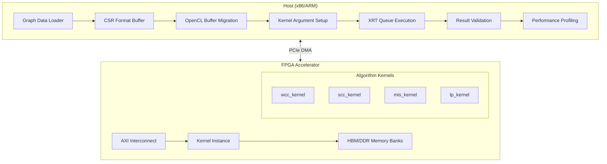

# L2 Connectivity and Labeling Benchmarks

## 一句话总结

本模块是 FPGA 加速图分析算法的**基准测试套件**，专门用于评估在 Xilinx Alveo 和 Versal 平台上运行图连通性分析（Connected Components、Strongly Connected Components）和图标注（Label Propagation、Maximal Independent Set）算法的性能和资源效率。

想象你有一个巨大的社交网络（数十亿节点），需要快速找出"朋友圈"（连通分量），或者识别社区结构（标签传播）。本模块提供了将这些图算法卸载到 FPGA 硬件加速的**完整工具链**：从主机内存管理、FPGA 核配置到性能基准测试。

## 架构全景

本模块采用**主机-加速器协同架构**，通过 OpenCL/XRT 运行时接口与 FPGA 硬件交互。



### 核心架构决策

**1. 双层内存架构（HBM vs DDR）**

本模块支持两种内存架构，通过 `.cfg` 连接配置文件进行平台适配：

| 平台 | 内存类型 | 带宽特性 | 典型配置 |
|------|----------|----------|----------|
| U50 | HBM | 高带宽(460GB/s)、多通道(32 channels) | `sp=kernel.m_axi_gmem0_0:HBM[0:1]` |
| U200/U250 | DDR | 高容量、较低带宽 | `sp=kernel.m_axi_gmem0_0:DDR[0]` |
| VCK190 | DDR | 边缘部署优化 | 单端口 DDR 配置 |

**关键洞察**：HBM 的多通道特性允许对图的不同分区进行并发访问，这对随机访问模式的图算法至关重要。

**2. CSR 图格式与双缓冲机制**

所有算法均采用 **CSR (Compressed Sparse Row)** 格式存储图结构：
- `offset` 数组：记录每个顶点的邻接表起始位置（大小：`|V|+1`）
- `column/indices` 数组：存储边的目标顶点（大小：`|E|`）

对于需要迭代收敛的算法（如 Label Propagation、SCC），采用 **Ping-Pong 双缓冲** 机制：
- `labelPing/labelPong`：交替作为当前标签和下一标签
- 避免数据竞争，支持流水线化迭代

## 核心抽象：图算法加速的"FPGA 思维模型"

### 1. 数据流流水线（Dataflow Pipeline）

将图算法视为**数据流图**而非控制流程序：
- 每个处理阶段（读图、遍历、更新）是独立的硬件模块
- 通过 `hls::stream` 或 AXI-Stream 进行背压感知的通信
- 理想情况下，各阶段以 II=1 (Initiation Interval) 全速运行

类比：想象图数据像水流过一个管道系统，每个弯头和阀门都是一个处理单元，水（数据）持续流动而不需要等待上一批完全处理完毕。

### 2. 内存访问模式的分层策略

| 访问模式 | 存储层级 | 典型用途 | 实现机制 |
|----------|----------|----------|----------|
| 顺序大容量 | HBM/DDR (m_axi) | 图结构存储 | AXI4 burst transactions |
| 随机细粒度 | BRAM/URAM (local) | 活跃顶点队列 | Partitioned arrays |
| 流式握手 | FIFO (hls::stream) | 阶段间通信 | AXI4-Stream |

### 3. 并行性维度

FPGA 图加速利用三种正交并行性：
- **任务并行**：多个独立子图同时处理（DATAFLOW）
- **数据并行**：宽位 SIMD 处理（ap_uint<512>, UNROLL）
- **流水线并行**：重叠计算与内存访问（PIPELINE, II=1）

## 数据流分析：端到端执行路径

以 **Weakly Connected Components (WCC)** 为例，追踪从主机数据到 FPGA 计算再到结果验证的完整路径：

### 阶段 1：主机端数据准备（main.cpp）

1. **图数据加载**：从 CSR 文件读取 `offset` 和 `column` 数组
   ```cpp
   ap_uint<32>* offset32 = aligned_alloc<ap_uint<32>>(numVertices + 1);
   ap_uint<32>* column32 = aligned_alloc<ap_uint<32>>(numEdges);
   ```
   
   *内存所有权分析*：主机使用 `aligned_alloc` 分配页对齐内存，这是零拷贝 DMA 传输的前提条件。主机拥有这些缓冲区，通过 `cl_mem_ext_ptr_t` 机制将所有权临时"借用"给 FPGA。

2. **辅助缓冲区分配**：为算法迭代分配临时缓冲区
   ```cpp
   ap_uint<32>* column32G2 = aligned_alloc<ap_uint<32>>(numEdges);  // 反向图
   ap_uint<32>* offset32Tmp1 = aligned_alloc<ap_uint<32>>(numVertices + 1);  // 临时数组
   ap_uint<32>* queue = aligned_alloc<ap_uint<32>>(numVertices);  // BFS队列
   ap_uint<32>* result32 = aligned_alloc<ap_uint<32>>(numVertices);  // 结果数组
   ```

### 阶段 2：OpenCL 运行时初始化

3. **平台初始化**：创建 OpenCL 上下文、命令队列、加载 xclbin
   ```cpp
   cl::Context context(device, NULL, NULL, NULL, &err);
   cl::CommandQueue q(context, device, CL_QUEUE_PROFILING_ENABLE | CL_QUEUE_OUT_OF_ORDER_EXEC_MODE_ENABLE, &err);
   cl::Program program(context, devices, xclBins, NULL, &err);
   cl::Kernel wcc(program, "wcc_kernel");
   ```

4. **扩展指针映射**：建立主机内存与 FPGA 内存的零拷贝映射
   ```cpp
   cl_mem_ext_ptr_t mext_o[8];
   mext_o[0] = {2, column32, wcc()};      // arg 2: column array
   mext_o[1] = {3, offset32, wcc()};      // arg 3: offset array
   // ... more mappings
   
   cl::Buffer column32G1_buf = cl::Buffer(context, 
       CL_MEM_EXT_PTR_XILINX | CL_MEM_USE_HOST_PTR | CL_MEM_READ_WRITE,
       sizeof(ap_uint<32>) * numEdges, &mext_o[0]);
   ```

   *关键设计决策*：使用 `CL_MEM_EXT_PTR_XILINX | CL_MEM_USE_HOST_PTR` 标志组合启用零拷贝（Zero Copy）传输。传统 DMA 需要额外的 `memcpy` 到 DMA 缓冲区，而零拷贝直接通过 PCIe BAR 映射访问主机内存。代价是：主机内存必须页对齐（`aligned_alloc`），且访问粒度受 PCIe 事务大小限制。

### 阶段 3：内核执行与数据传输

5. **数据迁移到设备 (H2D)**：
   ```cpp
   std::vector<cl::Memory> ob_in;
   ob_in.push_back(column32G1_buf);
   ob_in.push_back(offset32G1_buf);
   q.enqueueMigrateMemObjects(ob_in, 0, nullptr, &events_write[0]);
   ```

6. **内核参数设置与启动**：
   ```cpp
   int j = 0;
   wcc.setArg(j++, numEdges);
   wcc.setArg(j++, numVertices);
   wcc.setArg(j++, column32G1_buf);
   wcc.setArg(j++, offset32G1_buf);
   // ... 更多参数
   wcc.setArg(j++, result_buf);
   
   q.enqueueTask(wcc, &events_write, &events_kernel[0]);
   ```

   *数据流分析*：WCC 内核接收多达 13 个参数，包括：
   - 标量参数：`numEdges`, `numVertices`（通过 `s_axilite` 接口）
   - 图结构缓冲区：`column32G1_buf`, `offset32G1_buf`（原始图）
   - 辅助缓冲区：`column32G2_buf`（反向图，用于无向图的双向遍历）
   - 临时/队列缓冲区：`offset32Tmp1_buf`, `queue_buf`（BFS 队列管理）
   - 结果缓冲区：`result_buf`（最终连通分量标签）

7. **结果回传与同步 (D2H)**：
   ```cpp
   std::vector<cl::Memory> ob_out;
   ob_out.push_back(result_buf);
   q.enqueueMigrateMemObjects(ob_out, 1, &events_kernel, &events_read[0]);
   q.finish();  // 同步等待所有操作完成
   ```

### 阶段 4：性能分析与验证

8. **OpenCL 事件剖析**：利用 `CL_PROFILING_COMMAND_START/END` 获取精确的硬件时间戳
   ```cpp
   cl_ulong ts, te;
   events_write[0].getProfilingInfo(CL_PROFILING_COMMAND_START, &ts);
   events_write[0].getProfilingInfo(CL_PROFILING_COMMAND_END, &te);
   float h2d_ms = ((float)te - (float)ts) / 1000000.0;
   ```

   三段式剖析报告：
   - **H2D (Host-to-Device)**：PCIe 上传图数据时间，受图规模（边数）和 PCIe 带宽限制
   - **KERNEL**：FPGA 实际计算时间，反映算法的硬件并行效率
   - **D2H (Device-to-Host)**：结果回传时间，通常最小（结果大小与顶点数成正比，远小于边数）

9. **结果正确性验证**：与 CPU 参考实现（"golden" 结果）逐元素比对
   ```cpp
   for (int i = 0; i < numVertices; i++) {
       if (result32[i].to_int() != gold_result[i] && gold_result[i] != -1) {
           std::cout << "Mismatch-" << i + 1 << ":\tsw: " << gold_result[i] 
                     << " -> hw: " << result32[i] << std::endl;
           errs++;
       }
   }
   ```

## 关键设计决策与权衡分析

### 决策 1：多平台内存架构适配（HBM vs DDR）

**问题背景**：不同 Alveo 卡具有截然不同的内存架构——U50 配备高带宽 HBM（16 通道，460GB/s），而 U200/U250 使用传统 DDR（双通道，~77GB/s）。图算法的随机访问模式对内存带宽极度敏感。

**设计选择**：
- 为 U50 配置 HBM 多通道绑定（`HBM[0:1]` 表示通道 0-1 绑定为一个逻辑端口）
- 为 U200/U250 配置 DDR 单端口映射（`DDR[0]`）
- 为 VCK190（Versal 边缘卡）配置 DDR 精简端口

**权衡分析**：

| 维度 | HBM 配置 (U50) | DDR 配置 (U200/U250) |
|------|----------------|----------------------|
| 峰值带宽 | 460GB/s | 77GB/s |
| 通道粒度 | 16 独立通道 | 2 通道 |
| 随机访问性能 | 优异（通道级并行） | 较差（行缓冲未命中惩罚）|
| 最大图规模 | 受 HBM 容量限制（16GB） | 可扩展至 64GB+ |
| 配置复杂度 | 高（需精细映射至通道）| 低（连续地址映射）|

**直觉解释**：HBM 就像一家拥有 16 个独立收银台的大型超市，每个收银台可以并行处理不同的顾客（内存请求）。即使单个顾客的路径是随机的（图遍历），整体吞吐量仍然很高。DDR 像只有一个收银台的小店，顾客必须排队，随机访问导致频繁的"换货架"（行缓冲未命中），效率低下。

### 决策 2：零拷贝（Zero-Copy）vs 双缓冲（Double-Buffer）传输策略

**问题背景**：主机到 FPGA 的数据传输是端到端延迟的主要组成部分。传统 DMA 需要额外的 `memcpy` 到 DMA 缓冲区，而零拷贝直接映射主机内存，但要求严格的对齐和访问模式。

**设计选择**：
- **零拷贝为主**：使用 `CL_MEM_EXT_PTR_XILINX | CL_MEM_USE_HOST_PTR` 直接映射页对齐的主机内存
- **显式迁移事件**：使用 `enqueueMigrateMemObjects` 控制传输时机，配合 OpenCL 事件进行剖析
- **双缓冲（算法级）**：在迭代算法（Label Propagation）中，使用 `labelPing/labelPong` 缓冲避免读写冲突

**内存所有权模型详解**：

```cpp
// 1. 主机分配页对齐内存（所有权：主机）
ap_uint<32>* column32 = aligned_alloc<ap_uint<32>>(numEdges);

// 2. 创建扩展指针结构（所有权转移：主机 -> OpenCL 运行时）
cl_mem_ext_ptr_t mext_o = {2, column32, wcc()};

// 3. 创建 Buffer 对象（OpenCL 接管地址映射，不拷贝数据）
cl::Buffer column_buf(context, 
    CL_MEM_EXT_PTR_XILINX | CL_MEM_USE_HOST_PTR | CL_MEM_READ_WRITE,
    sizeof(ap_uint<32>) * numEdges, &mext_o);

// 4. 显式迁移到设备（触发 DMA 或 PCIe 映射）
q.enqueueMigrateMemObjects({column_buf}, 0, nullptr, &event);
```

**生命周期关键点**：
- **分配**：主机通过 `aligned_alloc` 获取页对齐内存，这是 PCIe 大页映射的前提
- **映射**：`cl::Buffer` 构造函数不拷贝数据，仅将主机虚拟地址注册到 XRT 驱动，建立 PCIe BAR 映射
- **迁移**：`enqueueMigrateMemObjects` 是"提示"而非拷贝——对于 `USE_HOST_PTR`，它确保缓存一致性，实际数据传输可能被延迟到内核访问时（按需分页）
- **释放**：`cl::Buffer` 析构时解除映射，主机 `aligned_alloc` 内存需主机显式 `free`

### 决策 3：多平台连接配置的抽象策略

**问题背景**：不同 FPGA 平台（U50、U200、VCK190）的物理内存架构和 AXI 互联拓扑差异巨大。如果为每个算法硬编码内存映射，会导致大量重复代码和维护噩梦。

**设计选择**：
- **配置文件驱动**：使用 `.cfg` 文件描述内核到内存端口的连接（`sp=kernel.port:memory[banks]`）
- **平台抽象**：主机代码通过宏定义（`XCL_BANK(n)`）和条件编译（`#ifndef HLS_TEST`）隔离平台差异
- **内核参数统一**：所有平台使用相同的内核函数签名，差异通过连接配置隐藏

**连接配置语义解析**（以 WCC U50 配置为例）：

```cfg
[connectivity]
sp=wcc_kernel.m_axi_gmem0_0:HBM[0:1]   # 端口 0 绑定到 HBM 通道 0-1
sp=wcc_kernel.m_axi_gmem0_1:HBM[2:3]   # 端口 1 绑定到 HBM 通道 2-3
sp=wcc_kernel.m_axi_gmem0_2:HBM[4:5]   # 端口 2 绑定到 HBM 通道 4-5
# ... 共 11 个端口，分布在 HBM[0:19]
slr=wcc_kernel:SLR0                     # 内核放置在 SLR0（超级逻辑区域）
nk=wcc_kernel:1:wcc_kernel              # 实例化 1 个内核，名称为 wcc_kernel
```

**关键洞察**：`HBM[0:1]` 表示将两个相邻的 HBM 通道（0 和 1）"绑定"为一个逻辑端口。这提供了 4GB/s × 2 = 8GB/s 的理论带宽（假设每通道 4GB/s）。对于需要高吞吐量的端口（如 `column` 数组访问），这种绑定至关重要。

对比 U200/U250 配置：

```cfg
sp=wcc_kernel.m_axi_gmem0_0:DDR[0]   # 所有端口映射到同一个 DDR[0]
sp=wcc_kernel.m_axi_gmem0_1:DDR[0]   # 端口 0-10 共享 DDR[0]
# ...
```

这里没有通道绑定，所有 AXI 端口通过 AXI Interconnect 复用到单一 DDR 控制器。带宽受限（~38GB/s DDR4），但容量更大（64GB）。

## 子模块概述

本模块包含四个独立的图算法基准测试子模块，每个解决特定的图分析问题：

### 1. Connected Component Benchmarks（连通分量基准测试）

**核心功能**：计算无向图的**弱连通分量（Weakly Connected Components, WCC）**，即将图划分为极大子图，使得子图内任意两点间存在路径。

**算法特征**：
- 基于 BFS/DFS 遍历，标记每个顶点所属的连通分量 ID
- 使用 `wcc_kernel` 硬件加速遍历过程
- 支持大规模图（数亿边）的并行遍历

**典型应用**：社交网络中的"朋友圈"识别、网页链接图中的孤立子网检测、生物网络中的功能模块发现。

**详细文档**：[Connected Component Benchmarks](graph_analytics_and_partitioning-l2_connectivity_and_labeling_benchmarks-connected_component_benchmarks.md)

### 2. Label Propagation Benchmarks（标签传播基准测试）

**核心功能**：执行**标签传播算法（Label Propagation Algorithm, LPA）**，一种半监督图聚类算法，通过迭代传播顶点标签来发现社区结构。

**算法特征**：
- 迭代收敛算法：每个顶点在每轮迭代中采用邻居中最频繁的标签
- 使用 **Ping-Pong 双缓冲** (`labelPing/labelPong`) 避免读写冲突
- 需要 CSR 和 CSC（Compressed Sparse Column）两种格式支持双向邻接访问

**典型应用**：社交网络社区发现、推荐系统中的用户分群、生物信息学中的蛋白质功能预测。

**详细文档**：[Label Propagation Benchmarks](graph_analytics_and_partitioning-l2_connectivity_and_labeling_benchmarks-label_propagation_benchmarks.md)

### 3. Maximal Independent Set Benchmarks（极大独立集基准测试）

**核心功能**：计算图的**极大独立集（Maximal Independent Set, MIS）**，即顶点集合的极大子集，使得子集中任意两点间无边相连。

**算法特征**：
- 基于贪心算法的并行化实现：随机（或按优先级）选择顶点加入独立集，标记其邻居为"被覆盖"
- 使用 **C_group/S_group** 双缓冲跟踪候选集（Candidate）和状态集（Status）
- 需要多轮迭代直至收敛

**典型应用**：图着色（MIS 是着色算法的子过程）、任务调度中的冲突避免、无线传感器网络中的骨干节点选择。

**详细文档**：[Maximal Independent Set Benchmarks](graph_analytics_and_partitioning-l2_connectivity_and_labeling_benchmarks-maximal_independent_set_benchmarks.md)

### 4. Strongly Connected Component Benchmarks（强连通分量基准测试）

**核心功能**：计算有向图的**强连通分量（Strongly Connected Components, SCC）**，即极大子图，使得子图内任意两点间存在双向路径。

**算法特征**：
- 基于 **Tarjan 算法**或 **Kosaraju 算法**的 FPGA 并行化实现
- 需要构建**反向图**（转置图）进行双向遍历验证
- 使用 **颜色映射（colorMap）** 和 **双队列（queueG1/queueG2）** 进行多轮 BFS/DFS 遍历
- 是四个算法中最复杂的，涉及最多临时缓冲区（14+ 个 AXI 端口）

**典型应用**：网页图的强连通核分析（Web Graph 的 SCC 分布是搜索引擎核心指标）、程序依赖图的循环检测、生物代谢网络的不可逆反应路径识别。

**详细文档**：[Strongly Connected Component Benchmarks](graph_analytics_and_partitioning-l2_connectivity_and_labeling_benchmarks-strongly_connected_component_benchmarks.md)

## 跨模块依赖与系统集成

### 上游依赖

本模块隶属于 `graph_analytics_and_partitioning` 父模块，与同级模块存在如下协作关系：

| 兄弟模块 | 依赖关系 | 协作方式 |
|----------|----------|----------|
| [l2_pagerank_and_centrality_benchmarks](graph-analytics-and-partitioning-l2-pagerank-and-centrality-benchmarks.md) | 共享基础设施 | 共用 XRT/OpenCL 运行时、内存分配模式 |
| [l2_graph_patterns_and_shortest_paths_benchmarks](graph-analytics-and-partitioning-l2-graph-patterns-and-shortest-paths-benchmarks.md) | 算法互补 | SCC/WCC 是 BFS/最短路径的上游预处理 |
| [l2_graph_preprocessing_and_transforms](graph-analytics-and-partitioning-l2-graph-preprocessing-and-transforms.md) | 数据依赖 | CSR/CSC 格式转换、图重编号（renumbering）是前置步骤 |
| [community_detection_louvain_partitioning](graph-analytics-and-partitioning-community-detection-louvain-partitioning.md) | 算法层级 | Label Propagation 是 Louvain 社区检测的轻量级替代方案 |

### 下游消费

本模块的基准测试结果和性能 profile 数据被以下模块消费：
- **l3_openxrm_algorithm_operations**：上层算法操作接口，基于本模块的基准数据选择最优算法变体

### 外部库依赖

| 库 | 用途 | 关键 API |
|----|------|----------|
| **XRT (Xilinx Runtime)** | OpenCL 设备管理、内核执行、内存迁移 | `cl::Device`, `cl::Context`, `cl::CommandQueue`, `cl::Kernel` |
| **xcl2.hpp** | Xilinx 扩展工具库 | `xcl::get_xil_devices()`, `xcl::import_binary_file()` |
| **xf_utils_sw/logger.hpp** | 结构化性能日志 | `xf::common::utils_sw::Logger` |
| **OpenCL 1.2 ICD** | 标准 OpenCL 运行时 | `clEnqueueMigrateMemObjects`, `clEnqueueTask` |

## 新贡献者必读：陷阱与最佳实践

### 1. 内存对齐陷阱

**问题**：未对齐的内存分配会导致 XRT 创建缓冲区失败或性能下降（回退到拷贝模式）。

**正确做法**：
```cpp
// 正确：使用 aligned_alloc 确保页对齐（通常 4KB 或 2MB）
ap_uint<32>* buffer = aligned_alloc<ap_uint<32>>(size);

// 错误：标准 malloc 不保证对齐
ap_uint<32>* buffer = (ap_uint<32>*)malloc(sizeof(ap_uint<32>) * size);
```

**诊断技巧**：如果看到 `CL_OUT_OF_RESOURCES` 或迁移时间异常高，检查对齐。

### 2. HBM 通道分配过载

**问题**：U50 的 HBM 有 32 个物理通道，但每个通道有独立的控制器。将多个高流量端口映射到同一通道会导致争用。

**最佳实践**：
- 分析算法内存访问模式：图结构访问（`column/offset`）是顺序大流量，应分散到不同通道
- 临时缓冲区（`queue`, `tmp`）访问频率低，可共享通道
- 使用 `sp=kernel.port:HBM[start:end]` 语法绑定到通道范围

**U50 WCC 配置示例分析**：
```cfg
sp=wcc_kernel.m_axi_gmem0_0:HBM[0:1]   # offset - 低频，绑定通道 0-1
sp=wcc_kernel.m_axi_gmem0_1:HBM[2:3]   # column - 高频顺序访问，绑定 2-3
sp=wcc_kernel.m_axi_gmem0_2:HBM[4:5]   # columnG2 - 反向图，独立通道 4-5
# ... 其他端口分散到 HBM[6:19]
```

### 3. 迭代算法收敛检测的缺失

**陷阱**：当前主机代码假设所有算法都是"单轮"执行。但对于 SCC 和 MIS 等迭代算法，内核可能需要多轮执行直至收敛。

**现状**：代码中内核实则是"单轮迭代"设计，迭代控制由 FPGA 内核内部完成（`#pragma HLS DATAFLOW` 内部的循环展开），主机一次性等待结果。这种设计简化了主机代码，但限制了：
- 早期终止（early termination）的灵活性
- 动态调整迭代策略
- 与 CPU 的协同迭代（CPU 处理小分量，FPGA 处理大分量）

**改进方向**：如需支持主机控制的迭代，应采用以下模式：
```cpp
for (int iter = 0; iter < max_iter && !converged; iter++) {
    kernel.setArg(arg_idx, ping ? buf_a : buf_b);
    kernel.setArg(arg_idx+1, ping ? buf_b : buf_a);
    q.enqueueTask(kernel);
    q.enqueueReadBuffer(converged_flag, ...);
    q.finish();
    ping = !ping;
}
```

### 4. CSR 格式假设与图预处理需求

**陷阱**：主机代码假设输入图已经是 CSR 格式，且顶点 ID 是连续的 0-based。现实世界的图数据（如 SNAP、Twitter 数据集）通常：
- 顶点 ID 不连续（存在空缺）
- 包含自环（self-loop）或多边（multi-edge）
- 是有向图但 SCC 算法需要双向访问

**预处理需求**：
- **重编号（Renumbering）**：使用 `l2_graph_preprocessing_and_transforms` 模块的 renumber 内核将原始 ID 映射到连续的 0..N-1 范围
- **转置（Transpose）**：对于 SCC 算法，需要构建 CSR 的转置（即 CSC 格式）以支持反向图遍历
- **去重与过滤**：移除自环和多边，减少无效计算

**主机代码的隐式假设检查**：
```cpp
// 主机代码期望第一行是顶点数
offsetfstream.getline(line, sizeof(line));
std::stringstream numOdata(line);
numOdata >> numVertices;  // 假设：这是准确的顶点计数

// 潜在问题：如果图有重编号后的空缺，此计数可能大于实际可达顶点
// 后果：分配的 buffer 过大，浪费内存；或过小，越界访问
```

### 5. 性能剖析的误读风险

**陷阱**：主机代码输出了三段式时间（H2D、KERNEL、D2H），但容易误解这些数字的物理含义。

**关键区分**：
- **H2D 时间** (`TIME_H2D_MS`)：这是 `enqueueMigrateMemObjects(..., 0, ...)` 到完成事件的时间。注意：`0` 标志表示 "从主机到设备"，但 XRT 的行为取决于缓冲区创建标志：
  - 对于 `CL_MEM_USE_HOST_PTR`（零拷贝），"迁移"可能只是设置页表映射，实际数据传输在内核访问时按需发生（PCIe 按需分页）。此时 H2D 时间可能**远低于**实际数据移动时间。
  - 对于普通 `CL_MEM_ALLOC_HOST_PTR`，数据确实通过 DMA 传输。

- **KERNEL 时间** (`TIME_KERNEL_MS`)：这是 `enqueueTask` 到内核完成的时间。注意：对于迭代算法（如 SCC 内部的多轮 BFS），这是**所有迭代的总和**，主机无法看到中间进度。

- **D2H 时间** (`TIME_D2H_MS`)：结果回传。通常最小，因为结果大小与顶点数成正比（O(|V|)），而输入是边数（O(|E|)），图通常满足 |E| >> |V|。

**正确的性能分析方法**：
1. **端到端时间** (`tvdiff(&start_time, &end_time)`) 是用户感知的真实延迟，包括主机代码执行时间。
2. **Kernel-only 时间 / 端到端时间** 的比例反映加速比潜力。如果比例低（如 <50%），说明主机开销或数据传输是瓶颈。
3. **H2D 时间 / 边数** 给出有效的 PCIe 带宽利用率。理论峰值（PCIe Gen3 x16 约 15.75GB/s），若实际远低于此，检查对齐和缓冲区属性。

## 总结：何时使用本模块？

### 适用场景

✅ **大规模图分析**：图规模在百万顶点、千万边以上，CPU 实现已成为瓶颈
✅ **实时/近实时需求**：需要在秒级或亚秒级完成连通性分析
✅ **边缘部署**：需要在 VCK190 等边缘 FPGA 上运行图算法
✅ **算法验证**：需要与 CPU 参考实现对比验证 FPGA 实现的正确性

### 不适用场景

❌ **小规模图**：顶点数 < 10k，边数 < 100k——PCIe 传输开销将超过加速收益
❌ **动态图**：图结构频繁变化——本模块针对静态图设计，不支持增量更新
❌ **需要精确迭代控制**：当前设计将迭代控制内置于 FPGA 内核，主机无法在中途干预
❌ **异构图**：不支持带权图或带属性边的复杂图模型

### 与替代方案对比

| 方案 | 延迟 | 吞吐量 | 可扩展性 | 适用场景 |
|------|------|--------|----------|----------|
| **本模块 (FPGA)** | 低（亚秒级） | 高（数据流并行） | 受限于 FPGA 内存 | 大规模静态图加速 |
| CPU 多线程 (OpenMP) | 中（秒级） | 中（缓存受限） | 高（分布式扩展） | 小规模图、原型验证 |
| GPU (cuGraph) | 低-中 | 极高（SIMD 并行） | 受限于 GPU 显存 | 超大规模稠密图 |
| 分布式 (GraphX/Giraph) | 高（分钟级） | 极高（水平扩展） | 极高（千节点集群） | 超大规模图、离线批处理 |

**关键差异**：本模块的 FPGA 实现针对**稀疏图的随机访问模式**优化，利用 HBM 的多通道特性缓解内存墙问题。相比 GPU，FPGA 在稀疏图遍历中能达到更好的能效比（每瓦性能），但开发复杂度更高。

---

*下一节：各子模块详细设计文档链接将在子模块文档生成后补充。*
