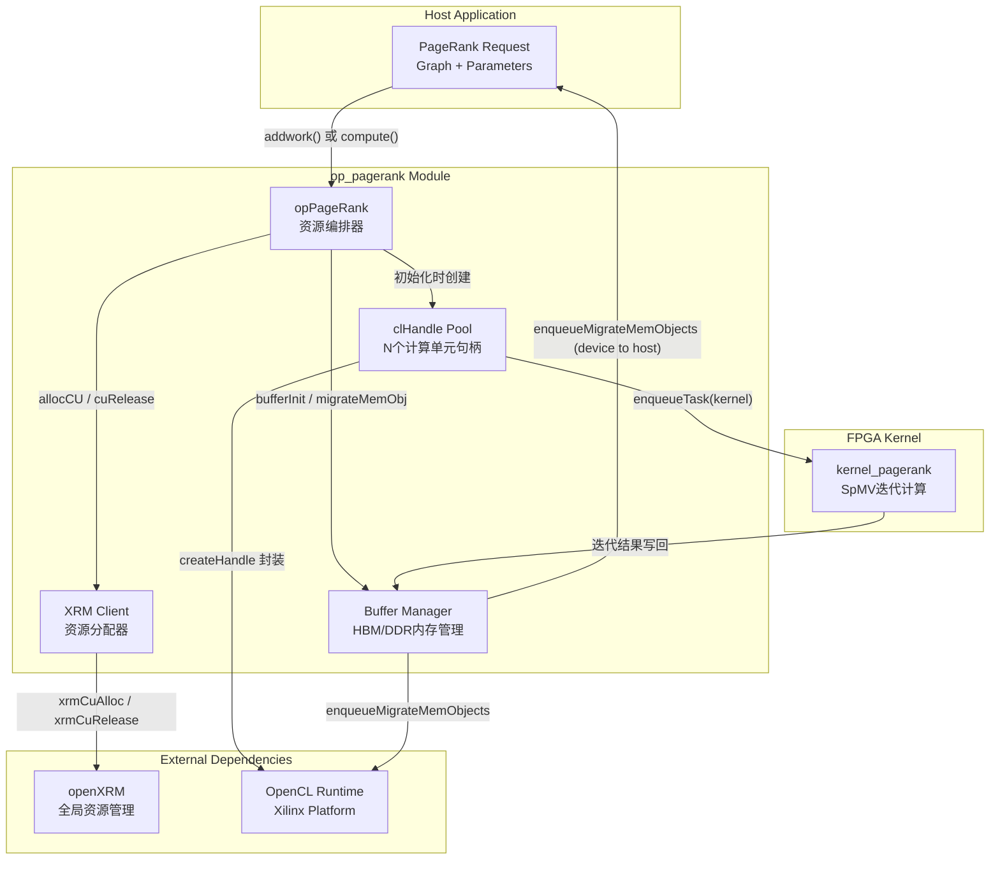

# op_pagerank 模块技术深度解析

## 一句话概括

`op_pagerank` 是一个面向 FPGA 加速的 PageRank 算法执行引擎，它像一个**分布式加速器集群的指挥官**——管理多个 FPGA 设备上的计算单元，协调图数据的分布与迭代计算的同步，在高带宽内存（HBM）与传统 DDR 之间做出智能权衡，最终交付高性能的图分析结果。

---

## 问题空间：为什么需要这个模块？

### PageRank 的本质挑战

PageRank 不是简单的矩阵运算，而是一个**迭代收敛的随机游走模型**。想象一座由网页构成的城市：每个页面是一个节点，链接是街道，用户随机点击就像在城中漫步。PageRank 要计算的是：长期来看，用户停留在每个节点的概率分布。

数学上，这转化为求解特征向量：

$$\mathbf{r} = \alpha \mathbf{P} \mathbf{r} + \frac{1-\alpha}{N}\mathbf{1}$$

其中 $\mathbf{P}$ 是转移矩阵，$\alpha$ 是阻尼系数（通常 0.85），$N$ 是节点数。

### 为什么 CPU 不够？

PageRank 的每次迭代本质上是**稀疏矩阵-向量乘法（SpMV）**。对于十亿级边的图：
- 矩阵极度稀疏（平均出度可能 < 10）
- 内存访问模式不规则（随机跳转）
- 迭代次数可能达 50-100 次才能收敛

CPU 的缓存层次对这种随机访问很不友好，而 FPGA 可以构建定制化的数据通路——将图结构驻留在高带宽内存，用流水线并行处理邻居遍历。

### 这个模块解决什么？

`op_pagerank` 不实现 PageRank 算法本身（那是 FPGA kernel 的工作），它解决的是**生产级部署的 orchestration 问题**：

1. **多设备管理**：一台服务器可能有 4 块 Alveo 卡，每块卡有多个计算单元（CU）
2. **图数据分发**：如何将 CSR 格式的图数据高效加载到设备内存（HBM vs DDR）
3. **计算资源调度**：如何为每个 PageRank 请求分配合适的 CU
4. **迭代状态管理**：ping-pong 缓冲区的生命周期、收敛判断
5. **异步执行支持**：上层应用可能希望批量提交任务而非阻塞等待

---

## 核心抽象：心智模型

理解 `op_pagerank`，需要在大脑中建立以下三个核心抽象：

### 1. clHandle：通往 FPGA 的"门把手"

`clHandle` 是一个聚合结构，封装了与一个特定 FPGA 计算单元（CU）通信所需的全部 OpenCL 状态：

```cpp
struct clHandle {
    cl::Device device;        // 物理 FPGA 设备
    cl::Context context;      // OpenCL 上下文
    cl::CommandQueue q;       // 命令队列（带性能分析）
    cl::Program program;      // 已加载的二进制
    cl::Kernel kernel;        // 具体的 kernel 实例
    cl::Buffer* buffer;         // 设备内存缓冲区数组
    xrmCuResource* resR;        // XRM 资源句柄
    bool isBusy;                // 忙闲状态
    uint32_t deviceID;          // 设备编号
    uint32_t cuID;              // CU 编号
    uint32_t dupID;             // 重复编号
};
```

**类比**：想象 `clHandle` 是一个「遥控器」——它知道如何与特定的「电视机」（FPGA 设备）通信，可以换台（切换 kernel）、调节音量（传递参数），但它本身不是电视内容。

### 2. opPageRank：资源编排的"乐队指挥"

`opPageRank` 类是模块的核心，它维护了一组 `clHandle`（`handles` 数组），并提供了从初始化到执行的全生命周期管理。

关键设计洞察：
- **数组索引计算**：`channelID + cuID * dupNmPG + deviceID * dupNmPG * cuPerBoardPG`
  这个公式将一个三维坐标（设备、CU、通道）展平为一维索引。
- **dupNmPG 的含义**："Duplication Number per Group"——如果 requestLoad=50%（默认），则 dupNmPG=2，意味着两个 CU 可以共享同一组图数据缓冲区，节省 HBM 空间。

**类比**：`opPageRank` 是一个「餐厅经理」——它管理多个「服务员」（clHandle），每个服务员负责一张「桌子」（一个 PageRank 计算任务）。当客人（图数据）到来，经理决定哪位空闲的服务员去接待，并确保厨房（FPGA kernel）按顺序出菜（计算结果）。

### 3. XRM：计算资源的"票务系统"

代码中频繁出现的 `xrm` 参数指向 `openXRM` 类，这是 Xilinx 资源管理器（Xilinx Resource Manager）的封装。在 FPGA 数据中心部署中，多个应用可能竞争同一物理卡上的 CU。

**类比**：XRM 就像「电影票预订系统」——当你想看电影（运行 kernel），你必须先订票（`allocCU`），系统会告诉你哪个厅（device）、哪排（CU）是你的。看完电影必须释放票（`cuRelease`），否则别人无法使用。

---

## 架构与数据流



### 关键数据流详解

#### 1. 初始化阶段（一次性）

```cpp
// 典型调用序列
opPageRank pr;
pr.setHWInfo(numDevices, maxCU);  // 告知系统：我有4张卡，每张8个CU
pr.init(xrm, kernelName, kernelAlias, xclbinFile, 
        deviceIDs, cuIDs, requestLoad);  // 初始化所有句柄
```

**内部动作**：
1. `setHWInfo` 计算 `cuPerBoardPG`（每板CU数）和 `dupNmPG`（重复因子）
2. `createHandle` 对每个 CU：
   - 创建设备上下文和命令队列（带性能分析）
   - 加载 xclbin 二进制
   - 通过 XRM 分配 CU 资源
   - 创建 kernel 实例
3. 分配 9 个 OpenCL 缓冲区（用于 CSR 数据、PageRank 向量等）

#### 2. 图加载阶段（每次新图）

```cpp
xf::graph::Graph<uint32_t, float> g;  // CSR 格式图数据
// ... 填充 g.offsetsCSR, g.indicesCSR, g.weightsCSR ...
pr.loadGraph(g);
```

**内部动作**：
1. 识别 "主" CU（`cuID==0 && dupID==0`）——这些 CU 负责实际加载图数据
2. 在独立线程中执行 `loadGraphCorePG`：
   - 创建 3 个 OpenCL 缓冲区（offsets, indices, weights）
   - 使用 `CL_MEM_EXT_PTR_XILINX` 和 `XCL_MEM_TOPOLOGY` 提示内存位置（DDR 或特定 HBM bank）
   - 将数据从主机迁移到设备
3. 对于 "从" CU，复用主 CU 的缓冲区指针（共享图数据，节省内存）
4. 使用 `std::future` 和 `std::packaged_task` 同步线程

#### 3. 计算阶段（每次 PageRank 请求）

```cpp
float* pagerank = new float[g.nodeNum];
int ret = pr.compute(deviceID, cuID, channelID, ctx, resR, instanceName,
                     handles, alpha, tolerance, maxIter, g, pagerank);
```

**内部动作**：
1. **缓冲区初始化** (`bufferInit`)：
   - 创建 6 个设备缓冲区：degreeCSR、cntValFull（常量）、buffPing/buffPong（迭代向量）、resultInfo（收敛状态）、orderUnroll（重排序索引）
   - 主机端分配对齐内存（`aligned_alloc`）
   - 设置 kernel 参数（14 个参数：标量 + 缓冲区句柄）

2. **数据传输** (`migrateMemObj`)：
   - Host → Device：传输 degree、常量、order 等输入数据
   - 使用 OpenCL 事件链确保顺序

3. **执行** (`cuExecute`)：
   - 提交 kernel 任务到命令队列
   - FPGA 上的 `kernel_pagerank` 执行迭代 SpMV：
     - 每个迭代：读取邻居列表 → 累加贡献 → 应用阻尼因子 → 检查收敛
     - 使用 ping-pong 缓冲区交替读写，避免数据竞争

4. **结果回传** (`migrateMemObj`)：
   - Device → Host：读取 resultInfo（收敛标志 + 迭代次数）、buffPing/buffPong（最终 PageRank 值）

5. **后处理** (`postProcess`)：
   - 根据 resultInfo 判断结果在 ping 还是 pong 缓冲区
   - 将 uint32_t 位模式 reinterpret cast 为 float
   - 写入输出数组

6. **清理**:
   - 释放主机端对齐分配的内存
   - 标记 handle 为空闲 (`isBusy = false`)

#### 4. 异步执行路径（可选）

```cpp
// 异步方式：提交任务，稍后获取结果
event<int> ev = pr.addwork(alpha, tolerance, maxIter, g, pagerank);
// ... 做其他工作 ...
int ret = ev.get();  // 等待并获取结果
```

**内部动作**：
- `addwork` 使用 `createL3` 将 `compute` 调用封装为任务队列条目
- 任务在后台线程池执行
- 返回的 `event<int>` 允许查询状态或阻塞等待

---

## 组件深度剖析

### `opPageRank` 类：资源编排的中心

```cpp
class opPageRank {
    // 静态配置（类级别共享）
    static uint32_t cuPerBoardPG;   // 每块 FPGA 板的 CU 数
    static uint32_t dupNmPG;        // 每组重复数（由 requestLoad 计算）
    
    // 实例状态
    clHandle* handles;              // CU 句柄数组（大小 = maxCU）
    uint32_t maxCU;                 // 最大 CU 总数
    uint32_t deviceNm;              // FPGA 设备数量
    std::vector<uint32_t> deviceOffset;  // 设备起始索引映射
};
```

**设计意图**：
- **静态成员**用于所有实例共享的硬件配置（假设同质硬件环境）
- **扁平数组 + 索引计算**替代嵌套结构，追求内存局部性和计算效率
- **句柄池模式**：所有 CU 在初始化时分配，运行时复用，避免动态分配开销

### `createHandle`：构建 FPGA 连接的「管道」

```cpp
void opPageRank::createHandle(class openXRM* xrm,
                              clHandle& handle,
                              std::string kernelName,
                              std::string kernelAlias,
                              std::string xclbinFile,
                              int32_t IDDevice,
                              unsigned int requestLoad);
```

**执行流程**（按代码顺序）：

1. **平台初始化**：
   ```cpp
   std::vector<cl::Device> devices = xcl::get_xil_devices();
   handle.device = devices[IDDevice];
   ```
   通过 Xilinx OpenCL 扩展获取设备列表，绑定到指定设备。

2. **上下文与队列创建**：
   ```cpp
   handle.context = cl::Context(handle.device, NULL, NULL, NULL, &fail);
   handle.q = cl::CommandQueue(handle.context, handle.device,
                               CL_QUEUE_PROFILING_ENABLE | CL_QUEUE_OUT_OF_ORDER_EXEC_MODE_ENABLE, &fail);
   ```
   - `CL_QUEUE_PROFILING_ENABLE`：启用内核执行时间戳分析
   - `CL_QUEUE_OUT_OF_ORDER_EXEC_MODE_ENABLE`：允许命令乱序执行（需配合事件依赖）

3. **二进制加载与程序创建**：
   ```cpp
   handle.xclBins = xcl::import_binary_file(xclbinFile);
   handle.program = cl::Program(handle.context, devices2, handle.xclBins, NULL, &fail);
   ```
   xclbin 是编译后的 FPGA 比特流，包含硬件电路配置。

4. **XRM 资源分配**（关键步骤）：
   ```cpp
   handle.resR = (xrmCuResource*)malloc(sizeof(xrmCuResource));
   int ret = xrm->allocCU(handle.resR, kernelName.c_str(), kernelAlias.c_str(), requestLoad);
   ```
   XRM（Xilinx Resource Manager）是数据中心级资源仲裁器。`requestLoad`（如 50% 表示请求半载 CU）允许一个物理 CU 被多个软件句柄分时复用。

5. **Kernel 实例化**：
   ```cpp
   std::string instanceName0 = handle.resR->instanceName;
   if (cuPerBoardPG >= 2) instanceName0 = "kernel_pagerank_0:{" + instanceName0 + "}";
   handle.kernel = cl::Kernel(handle.program, instanceName.c_str(), &fail);
   ```
   注意 kernel 实例名的组装逻辑：当每板 CU 数 ≥2 时，使用复合名称格式，这是 Xilinx 平台的命名约定。

### `loadGraph`：图数据的「广播与复用」

```cpp
void opPageRank::loadGraph(xf::graph::Graph<uint32_t, float> g);
```

**设计洞察**：为什么需要复杂的线程管理？

观察代码结构，你会发现它区分两类 CU：
- **主 CU** (`cuID == 0 && dupID == 0`)：真正执行图数据加载到设备内存
- **从 CU** (其他)：共享主 CU 的缓冲区指针

这实现了**图数据的跨 CU 共享**，关键逻辑：

```cpp
// 从 CU 复用主 CU 的缓冲区
handles[j].buffer[0] = handles[cnt].buffer[0];
handles[j].buffer[1] = handles[cnt].buffer[1];
handles[j].buffer[2] = handles[cnt].buffer[2];
```

**内存拓扑决策**（在 `loadGraphCorePG` 中）：

```cpp
#ifndef USE_HBM
    // DDR 配置：所有数据放在 DDR bank 0
    mext_in[0] = {(unsigned int)(0) | XCL_MEM_TOPOLOGY, g.offsetsCSR, 0};
    mext_in[1] = {(unsigned int)(0) | XCL_MEM_TOPOLOGY, g.indicesCSR, 0};
    mext_in[2] = {(unsigned int)(0) | XCL_MEM_TOPOLOGY, g.weightsCSR, 0};
#else
    // HBM 配置：分散到不同 bank 以最大化带宽
    mext_in[0] = {(unsigned int)(0) | XCL_MEM_TOPOLOGY, g.offsetsCSR, 0};  // HBM bank 0
    mext_in[1] = {(unsigned int)(2) | XCL_MEM_TOPOLOGY, g.indicesCSR, 0};  // HBM bank 2
    mext_in[2] = {(unsigned int)(4) | XCL_MEM_TOPOLOGY, g.weightsCSR, 0};  // HBM bank 4
#endif
```

这种分散策略利用 HBM 的多 bank 独立访问特性，让 offsets/indices/weights 的读取可以并行进行。

### `compute`：执行编排的「总控台」

```cpp
int opPageRank::compute(unsigned int deviceID,
                        unsigned int cuID,
                        unsigned int channelID,
                        xrmContext* ctx,
                        xrmCuResource* resR,
                        std::string instanceName,
                        clHandle* handles,
                        float alpha,
                        float tolerance,
                        int maxIter,
                        xf::graph::Graph<uint32_t, float> g,
                        float* pagerank);
```

**Handle 定位的数学**：

```cpp
clHandle* hds = &handles[channelID + cuID * dupNmPG + deviceID * dupNmPG * cuPerBoardPG];
```

这个三维到一维的索引映射，将逻辑坐标 `(deviceID, cuID, channelID)` 映射到物理句柄数组位置。想象一个三维数组展平：
- 第一维：`deviceID`（哪个 FPGA 卡）
- 第二维：`cuID * dupNmPG`（卡内的 CU 组）
- 第三维：`channelID`（组内的通道/上下文）

**执行流水线**：

```
Host Memory (CSR, parameters)
    |
    | migrateMemObj (H2D)
    v
FPGA Device Memory (HBM/DDR)
    |
    | bufferInit (set kernel args)
    v
FPGA Kernel Execution
    |
    | cuExecute
    v
FPGA Device Memory (results)
    |
    | migrateMemObj (D2H)
    v
Host Memory (pagerank array)
    |
    | postProcess
    v
Application (usable results)
```

### `postProcess`：结果的「解码器」

```cpp
void opPageRank::postProcess(int nrows, int* resultInfo, uint32_t* buffPing, uint32_t* buffPong, float* pagerank);
```

**设计洞察**：为什么要这样处理？

FPGA kernel 使用 **ping-pong 缓冲区策略** 进行迭代：
- 第 0 轮：读取 ping → 计算 → 写入 pong
- 第 1 轮：读取 pong → 计算 → 写入 ping
- ...

最终的结果可能在 ping 或 pong 中，取决于迭代次数的奇偶性。`resultInfo[0]` 编码了最终结果的位置（0=ping, 1=pong）。

**类型双关（Type Punning）**：

```cpp
union f_cast {
    float f;
    uint32_t i;
};

f_cast tt;
tt.i = tmp11;  // 从 uint32_t 读取位模式
pagerank[cnt] = tt.f;  // 解释为 float
```

为什么不用 `reinterpret_cast`？在严格的 C++ 标准中，`reinterpret_cast` 在指针间转换后有严格的别名规则限制。使用 `union` 是一种更传统的、在嵌入式/高性能计算代码中广泛使用的位操作模式。FPGA kernel 以 uint32_t 写入（避免浮点单元，节省资源），主机端需要正确解释为 float。


---

## 依赖关系与调用图谱

### 本模块依赖（调用关系）

| 被调用方 | 用途 | 关键交互 |
|---------|------|----------|
| `openXRM` | FPGA 计算单元资源分配 | `allocCU`, `cuRelease` |
| `cl::Device`, `cl::Context`, `cl::CommandQueue` | OpenCL 核心对象 | 创建、配置、提交命令 |
| `xcl::get_xil_devices`, `xcl::import_binary_file` | Xilinx 平台扩展 | 设备发现、xclbin 加载 |
| `xf::graph::Graph<uint32_t, float>` | 图数据结构定义 | CSR 格式访问 |
| `xf::common::utils_sw::Logger` | 日志记录 | 错误检查与报告 |
| `aligned_alloc` | 对齐内存分配 | 主机端缓冲区 |

### 依赖本模块（被调用关系）

本模块通常被上层图分析框架实例化，例如：
- L3 图分析库中的 PageRank 算子封装
- 特定领域应用（社交网络分析、网页排名）的加速后端

---

## 设计决策与权衡

### 1. 同步 vs 异步 API 设计

**决策**：提供双模 API
- 同步 API：`compute()` 阻塞直到完成，适合脚本化、批处理场景
- 异步 API：`addwork()` 立即返回事件句柄，允许主机批量提交多个任务

**权衡分析**：
- 同步 API 调用简单，但会阻塞主机线程，无法充分利用流水线
- 异步 API 允许任务级并行，最大化 FPGA 利用率，但需要更复杂的生命周期管理

### 2. 内存架构：HBM vs DDR 的条件编译

**决策**：通过宏 `USE_HBM` 在编译时选择内存拓扑

**权衡分析**：
- **DDR**：容量大、成本低，带宽 ~20-30 GB/s，适合大图离线批处理
- **HBM**：带宽极高（Alveo U280 可达 460 GB/s），容量有限（8GB/堆叠），适合实时分析

**为什么编译时而非运行时**：内存拓扑是硬件物理特性，条件编译允许代码优化器做激进优化。

### 3. 图数据共享策略：Master-Slave 缓冲区复用

**决策**：通过 `dupNmPG` 机制，允许多个 CU 共享同一组图数据缓冲区

**权衡分析**：
- **独立缓冲区**：每个 CU 有独立图数据拷贝，可处理不同图，但内存爆炸
- **共享缓冲区**：通过 `dupNmPG` 控制共享粒度，内存减半，但 CU 必须处理相同图

### 4. 错误处理策略：日志 + 状态码，无异常

**决策**：使用返回码（`int`）和日志记录，不抛出 C++ 异常

**权衡分析**：
- 异常在 FPGA 驱动/OpenCL 上下文中可能引发资源泄漏（CU 未释放）
- 返回码配合显式日志更符合底层系统编程惯例
- 调用者必须检查返回值，否则可能静默失败

---

## 使用示例与最佳实践

### 基本使用模式

```cpp
#include "op_pagerank.hpp"
#include "xf_graph_L3.hpp"

// 1. 初始化资源管理器
openXRM xrm;
xrmContext* ctx = xrmCreateContext();

// 2. 创建 PageRank 操作对象
opPageRank pr;

// 3. 设置硬件信息（2 张卡，每张 4 个 CU）
pr.setHWInfo(2, 8);

// 4. 初始化句柄
uint32_t deviceIDs[] = {0, 0, 1, 1};
uint32_t cuIDs[] = {0, 1, 0, 1};
pr.init(&xrm, "kernel_pagerank", "kernel_pagerank_0", 
        "pagerank.xclbin", deviceIDs, cuIDs, 50);  // 50% requestLoad

// 5. 加载图数据
xf::graph::Graph<uint32_t, float> g;
// ... 填充 CSR 格式的图数据 ...
pr.loadGraph(g);

// 6. 执行 PageRank
float* pagerank = new float[g.nodeNum];
int ret = pr.compute(0, 0, 0, ctx, resR, "instance",
                       pr.getHandles(), 0.85f, 1e-6f, 100, g, pagerank);

// 7. 清理
pr.freePG(ctx);
xrmDestroyContext(ctx);
```

### 关键配置参数说明

| 参数 | 含义 | 建议值 |
|------|------|--------|
| `requestLoad` | CU 资源请求负载百分比 | 50（半载，允许两个逻辑 CU 共享物理 CU）或 100（满载，独占） |
| `alpha` | PageRank 阻尼系数 | 0.85（标准值） |
| `tolerance` | 收敛容差 | 1e-6（高精度）到 1e-4（快速近似） |
| `maxIter` | 最大迭代次数 | 100（通常 30-50 次即可收敛） |

---

## 边缘情况与陷阱（Gotchas）

### 1. 内存对齐要求

**问题**：`aligned_alloc` 分配的主机端内存必须满足 FPGA 的对齐要求（通常 4KB 页对齐）。

**后果**：如果使用普通 `malloc`，`enqueueMigrateMemObjects` 可能会失败或性能急剧下降。

**解决方案**：始终使用 `aligned_alloc(4096, size)` 或 `posix_memalign`。

### 2. XRM 资源泄漏

**问题**：如果程序在 `compute()` 执行过程中崩溃（如异常、信号），XRM 分配的 CU 资源可能未释放。

**后果**：该 CU 对后续进程不可用，直到系统管理员手动清理或重启 XRM 服务。

**解决方案**：
- 使用 RAII 模式封装 `opPageRank`，在析构函数中调用 `freePG()`
- 注册信号处理程序确保清理
- 使用 `std::unique_ptr` 自定义删除器

### 3. 图数据生命周期

**问题**：`loadGraph()` 后，主机端的 `g.offsetsCSR` 等指针必须保持有效，直到 `freePG()` 被调用。

**后果**：如果提前释放主机内存（如 `g` 超出作用域），FPGA 访问设备端缓冲区时可能读取损坏数据（设备端缓冲区使用 `CL_MEM_USE_HOST_PTR` 映射主机内存）。

**解决方案**：
- 确保 `xf::graph::Graph` 对象的生命周期覆盖所有 PageRank 计算
- 或使用 `CL_MEM_COPY_HOST_PTR` 而非 `CL_MEM_USE_HOST_PTR`（牺牲零拷贝性能换取安全性）

### 4. 浮点精度与确定性

**问题**：不同 FPGA 设备或不同运行间，PageRank 结果可能有微小差异（< 1e-6）。

**原因**：
- FPGA 浮点运算顺序与 CPU 不同（并行累加导致舍入顺序差异）
- 不同设备的 HBM/DDR 可能有不同的访问延迟模式，影响迭代收敛路径

**解决方案**：
- 设置合理的容差（`tolerance`），不要比较浮点数的精确相等
- 对于需要 bit-for-bit 确定性的场景，使用定点数 kernel（需重新编译 xclbin）

### 5. 多线程安全性

**问题**：`opPageRank` 类不是线程安全的。

**原因**：
- `handles` 数组的状态（`isBusy`）在多线程访问时可能产生竞态条件
- `deviceOffset` 等成员在初始化后被修改可能导致不一致

**解决方案**：
- 每个线程创建独立的 `opPageRank` 实例（推荐）
- 或在调用 `compute()`/`addwork()` 时使用外部互斥锁
- 绝对不要从多个线程并发调用 `init()` 或 `loadGraph()`

---

## 性能调优指南

### 1. 选择合适的 requestLoad

| 场景 | 建议 requestLoad | 理由 |
|------|------------------|------|
| 单图多次 PageRank（不同参数） | 50 | CU 共享图数据，节省内存带宽 |
| 多图并发处理 | 100 | 每个 CU 独立处理不同图，最大化吞吐 |
| 延迟敏感实时查询 | 100 | 避免 CU 切换开销，保证确定性延迟 |

### 2. 优化 HBM Bank 分配

对于 Alveo U280（32 HBM banks），建议的图数据布局：

| 数据 | Bank | 理由 |
|------|------|------|
| CSR offsets | 0-3 | 顺序访问，低延迟敏感 |
| CSR indices | 8-11 | 随机访问，需要高带宽 |
| CSR weights | 16-19 | 随机访问，与 indices 并行 |
| PageRank vectors | 24-27 | 迭代读写，独立 bank 避免冲突 |

修改 `loadGraphCorePG` 和 `bufferInit` 中的 bank 分配编号即可。

### 3. 批处理与流水线

对于大量小规模图（每个图 < 1M 边）：

```cpp
// 低效：串行执行
for (auto& g : graphs) {
    pr.compute(..., g, pagerank);  // 每次等待完成
}

// 高效：流水线批处理（假设有 N 个 CU）
std::vector<event<int>> events;
for (int i = 0; i < graphs.size(); ++i) {
    int cu = i % numCUs;
    auto ev = pr.addwork(alpha, tolerance, maxIter, graphs[i], results[i]);
    events.push_back(ev);
}
for (auto& ev : events) {
    ev.get();  // 等待全部完成
}
```

---

## 总结与关键要点

`op_pagerank` 模块是 Xilinx 图分析 L3 库的核心组件，它将 FPGA 加速的复杂性封装为可管理的资源编排层。作为开发者，你需要记住以下关键点：

1. **生命周期管理**：`init()` → `loadGraph()` → `compute()`/`addwork()` → `freePG()` 的顺序不可颠倒，且前一阶段资源必须在后一阶段保持有效。

2. **内存模型**：理解 `CL_MEM_USE_HOST_PTR` 的零拷贝语义，以及 HBM bank 分配对性能的影响。使用 `USE_HBM` 宏切换内存架构。

3. **资源抽象**：`clHandle` 是操作的原子单位，`dupNmPG` 控制共享粒度，`requestLoad` 决定 CU 复用策略。三维索引公式 `channelID + cuID * dupNmPG + deviceID * dupNmPG * cuPerBoardPG` 是定位关键。

4. **并发安全**：模块本身不是线程安全的，要么每个线程独立实例，要么外部加锁。`addwork()` 的异步结果必须在 `pagerank` 数组有效期间保持未等待状态。

5. **调试技巧**：启用 `CL_QUEUE_PROFILING_ENABLE` 获取内核执行时间戳；使用 `NDEBUG` 宏控制调试日志输出；检查 XRM 资源状态避免泄漏。

通过深入理解这些设计原则和权衡，你可以更高效地利用 `op_pagerank` 模块构建高性能的图分析应用，并在遇到问题时快速定位和解决。