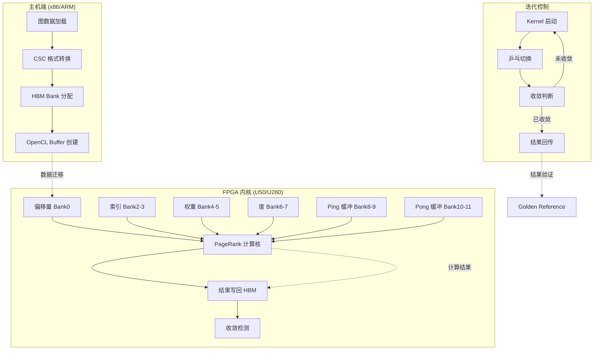

# PageRank Cache-Optimized Benchmark

## 一句话概括

本模块是一个面向 Xilinx FPGA 的**缓存优化型 PageRank 加速 benchmark**，通过多路 HBM 高带宽内存并行访问、乒乓缓冲流水线和可配置精度，实现大规模图神经网络迭代计算的高吞吐加速。

---

## 问题空间与设计动机

### 为什么需要这个模块？

PageRank 是图分析领域的基石算法，但传统 CPU 实现面临**内存墙**瓶颈：

1. **随机内存访问模式**：CSR/CSC 格式的图遍历导致大量缓存未命中，CPU 预取器失效
2. **迭代计算依赖**：每次迭代依赖前一次结果，无法简单并行化
3. **内存带宽饱和**：大型图的边表可能达到数十 GB，远超 DDR 带宽

**"缓存优化"意味着什么？**

在 FPGA 语境下，"缓存优化"不是指传统 CPU 的 L1/L2 缓存，而是指：
- **HBM 多 bank 并行**：利用 8 个 HBM 伪通道同时访问边表、偏移量、权重等数据
- **乒乓缓冲 (Ping-Pong Buffer)**：双缓冲机制隐藏迭代依赖，让本次迭代的写操作与下次迭代的读操作流水化
- **数据本地化**：通过 `ap_uint<512>` 宽总线传输，最大化 HBM burst 效率

### 为什么不用更简单的方案？

| 替代方案 | 为什么不选 | 本模块的选择 |
|---------|-----------|-------------|
| 纯 CPU OpenMP | 内存带宽受限，缓存未命中严重 | FPGA HBM 提供 10x+ 带宽 |
| GPU CUDA | 功耗高，图遍历不规则访问效率低 | FPGA 定制化流水线匹配图计算模式 |
| 基础 FPGA PageRank (单通道 DDR) | 带宽瓶颈，迭代依赖无法隐藏 | 8 路 HBM + 乒乓缓冲 |
| 外部缓存 (如 Intel Optane) | 延迟过高，破坏流水 | 片上 + HBM 两级存储 |

---

## 架构概述

### 核心抽象：迭代计算的"双缓冲舞台"

想象一个**舞台表演**场景：
- **演员 (PageRank 计算核)** 在舞台上表演（计算本次迭代）
- **A 舞台 (Ping 缓冲)** 是当前观众看到的表演（当前迭代结果）
- **B 舞台 (Pong 缓冲)** 是后台准备的下一个表演（下次迭代输入）

当一次迭代完成，**舞台切换**（交换 Ping/Pong 角色），观众立即看到新表演，而演员开始在另一个舞台准备下一次。这就是**乒乓缓冲**的本质——通过空间换时间，隐藏迭代间的依赖延迟。

### 数据流架构图



### 组件职责

#### 1. 主机端运行时 (`test_pagerank.cpp`)
**角色**：数据管家 + 乐队指挥

- **图数据预处理**：将 CSR/CSC 格式图数据读取并转换为 FPGA 友好的布局
- **HBM 银行分配**：将不同类型的数据（偏移量、索引、权重、度、乒乓缓冲）分配到 8 个不同的 HBM 银行，最大化并行带宽
- **OpenCL 运行时管理**：创建上下文、命令队列、缓冲区，处理主机-设备数据传输
- **迭代控制**：启动内核，监控收敛，处理乒乓缓冲切换逻辑

#### 2. 内核连接配置 (`conn_u50.cfg`)
**角色**：硬件接线图

- 定义 `kernel_pagerank_0` 的 AXI 接口到 HBM 物理银行的映射
- 配置 8 个 `m_axi_gmem` 接口到 HBM[0] 到 HBM[13] 的映射（利用伪通道并行性）
- 指定 SLR (Super Logic Region) 放置，确保内核布局满足时序

---

## 设计决策与权衡

### 1. HBM 多银行 vs. 单银行 DDR

**决策**：使用 8 个 HBM 伪通道（Pseudo Channels）而非单通道 DDR

**权衡分析**：

| 维度 | HBM 多银行 | 单通道 DDR |
|------|-----------|-----------|
| **带宽** | ~460 GB/s (8x 57.6 GB/s) | ~25 GB/s |
| **延迟** | 稍高（需要 bank 仲裁） | 较低 |
| **资源** | 需要 HBM 控制器和更多逻辑 | 更简单 |
| **功耗** | 较高 | 较低 |
| **编译复杂度** | 需要精细的 bank 分配策略 | 简单 |

**为什么选 HBM**：PageRank 是**内存带宽受限**算法。CPU 版本通常只能达到 <5 GB/s 有效带宽，而 HBM 的 460 GB/s 潜力让 FPGA 能在计算单元空闲前喂饱数据。`conn_u50.cfg` 中的 8 路 bank 分配确保偏移量、索引、权重、度等数据流并行访问，避免 bank 冲突。

### 2. 乒乓缓冲 (Ping-Pong) vs. 单缓冲原地更新

**决策**：使用双缓冲（Ping-Pong）机制处理迭代依赖

**权衡分析**：

```
单缓冲原地更新：
迭代 i: 读取 buffer[i] → 计算 → 写回 buffer[i] （覆盖旧值）
问题：迭代 i+1 开始时，buffer[i] 可能还在被读取，产生 WAR (Write-After-Read) 冒险

乒乓缓冲：
迭代 i:   读取 Ping → 计算 → 写入 Pong
迭代 i+1: 读取 Pong → 计算 → 写入 Ping  （角色互换）
优势：读写完全分离，可流水化，无数据冒险
```

**代价**：
- **内存占用翻倍**：需要 2x 的 HBM 容量存储中间结果
- **带宽增加**：每次迭代都要读写两个缓冲

**收益**：
- **启动间隔 (II) = 1**：内核可以每个周期启动一个新迭代，隐藏延迟
- **吞吐最大化**：计算和内存访问完全流水化

### 3. 精度可配置 (float vs. double)

**决策**：通过模板参数 `DT` 支持 float (32位) 和 double (64位)

**权衡分析**：

| 指标 | float | double |
|------|-------|--------|
| **资源** | DSP 用量减半 | DSP 用量翻倍 |
| **吞吐** | 可并行度翻倍 (512/32=16) | 并行度减半 (512/64=8) |
| **收敛** | 可能需要更多迭代 | 更快收敛 |
| **精度** | ~1e-7 | ~1e-16 |

**代码中的体现**：
```cpp
typedef float DT;  // 可切换为 double
const int unrollNm2 = (sizeof(DT) == 4) ? 16 : 8;  // 根据精度调整并行度
int iteration2 = (nrows + unrollNm2 - 1) / unrollNm2;
```

**为什么重要**：图分析通常对精度要求不高（PageRank 值本身就是概率），float 的精度和动态范围足够，但能带来 2x 的吞吐提升。

### 4. HLS 测试 vs. OpenCL 运行时

**决策**：通过宏 `_HLS_TEST_` 支持两种执行模式

**模式对比**：

**HLS 测试模式** (`_HLS_TEST_` 定义)：
- 直接调用 `kernel_pagerank_0()` 函数
- 使用 `posix_memalign` 分配对齐内存
- 适合 C/RTL 协同仿真，快速验证算法正确性
- 无需 Xilinx 运行时库 (XRT)

**OpenCL 运行时模式** (默认)：
- 使用 `cl::Context`, `cl::CommandQueue`, `cl::Kernel`
- 通过 XRT 管理 FPGA 板卡
- 支持真实的 Alveo U50/U280 执行
- 包含详细的性能分析 (profiling) 代码

**为什么需要两种模式**：
- **开发阶段**：HLS 模式允许软件工程师在不接触 FPGA 硬件的情况下验证算法和内存布局
- **部署阶段**：OpenCL 模式提供真实的硬件性能和系统集成能力

---

## 子模块结构

本模块包含两个核心子模块，分别负责 FPGA 硬件连接配置和主机端 benchmark 执行：

| 子模块 | 文件 | 核心组件 | 职责概述 |
|--------|------|----------|----------|
| [kernel_connectivity](graph-analytics-and-partitioning-l2-pagerank-and-centrality-benchmarks-pagerank-cache-optimized-benchmark-kernel-connectivity.md) | `conn_u50.cfg` | `kernel_pagerank_0` 实例 | HBM bank 映射、AXI 端口连接、SLR 布局 |
| [host_benchmark](graph-analytics-and-partitioning-l2-pagerank-and-centrality-benchmarks-pagerank-cache-optimized-benchmark-host-benchmark.md) | `test_pagerank.cpp` | `timeval`, `main()`, `ArgParser` | 图数据加载、内存管理、OpenCL 运行时、结果验证 |

---

## 关键实现细节

### 数据对齐与宽总线传输

为了实现最大 HBM 带宽，所有数据缓冲区都对齐到 512-bit (64字节) 边界，并使用 `ap_uint<512>` 类型进行传输：

```cpp
typedef ap_uint<512> buffType;

// 分配 4KB 对齐的内存
template <typename T>
T* aligned_alloc(std::size_t num) {
    void* ptr = nullptr;
    if (posix_memalign(&ptr, 4096, num * sizeof(T))) {
        throw std::bad_alloc();
    }
    return reinterpret_cast<T*>(ptr);
}

// 使用 512-bit 宽缓冲区
buffType* buffPing = aligned_alloc<buffType>(iteration2);
buffType* buffPong = aligned_alloc<buffType>(iteration2);
```

**为什么 512-bit？**
- HBM 物理接口宽度为 256-bit 或 512-bit (取决于频率)
- 512-bit 突发传输可以最大化带宽利用率
- 对于 float (32-bit)，一次可以传输 16 个值；对于 double (64-bit)，可以传输 8 个值

### 结果数据解析

FPGA 内核以 512-bit 宽总线格式返回结果，主机端需要将其拆解为单独的 float/double 值：

```cpp
// 根据最终迭代结果所在的缓冲区提取数据
bool resultinPong = (bool)(*resultInfo);

int cnt = 0;
for (int i = 0; i < iteration2; ++i) {
    // 使用联合体进行位转换
    xf::graph::internal::calc_degree::f_cast<DT> tt;
    
    // 选择正确的缓冲区（Ping 或 Pong）
    ap_uint<512> tmp11 = resultinPong ? buffPong[i] : buffPing[i];
    
    // 拆解 512-bit 为 16 个 float (或 8 个 double)
    for (int k = 0; k < unrollNm2; ++k) {
        if (cnt < nrows) {
            // 提取第 k 个 float/double (每个 32/64-bit)
            tt.i = tmp11.range(widthT * (k + 1) - 1, widthT * k);
            pagerank[cnt] = (DT)(tt.f);  // 位转换回浮点数
            cnt++;
        }
    }
}
```

**关键细节**：
- `f_cast<DT>` 是一个联合体 (union)，允许在整数位表示和浮点值之间安全转换
- `ap_uint<512>.range(high, low)` 提取指定比特范围
- `resultinPong` 标志位指示最终有效数据位于 Ping 还是 Pong 缓冲区

### 性能分析与 Profiling

模块内置详细的性能分析机制，可以测量端到端延迟和内核执行时间：

```cpp
// 使用 OpenCL Profiling API 获取精确时间戳
std::vector<cl::Event> events_write(1);
std::vector<std::vector<cl::Event>> events_kernel(1);
std::vector<cl::Event> events_read(1);

// 记录数据传输和内核执行事件
q.enqueueMigrateMemObjects(ob_in, 0, nullptr, &events_write[0]);
q.enqueueTask(kernel_pagerank, &events_write, &events_kernel[0][0]);
q.enqueueMigrateMemObjects(ob_out, 1, &events_kernel[0], &events_read[0]);

// 提取时间戳计算耗时
cl_ulong timeStart, timeEnd;
events_write[0].getProfilingInfo(CL_PROFILING_COMMAND_START, &timeStart);
events_write[0].getProfilingInfo(CL_PROFILING_COMMAND_END, &timeEnd);
unsigned long write_time = (timeEnd - timeStart) / 1000.0; // 微秒
```

**关键指标**：
- **H2D/D2H 传输时间**：PCIe 带宽和 HBM 写入效率
- **内核执行时间**：纯 FPGA 计算时间，反映算法效率
- **端到端延迟**：总执行时间，包含所有数据传输和同步开销

---

## 新手指南：常见陷阱与最佳实践

### 1. 内存对齐要求

**陷阱**：未对齐的内存地址会导致 HBM 访问错误或性能下降。

**正确做法**：
```cpp
// 使用 4KB 对齐分配
void* ptr = nullptr;
posix_memalign(&ptr, 4096, size);

// 确保 OpenCL 缓冲区使用 CL_MEM_USE_HOST_PTR
cl::Buffer(context, CL_MEM_USE_HOST_PTR | CL_MEM_READ_WRITE, size, ptr);
```

### 2. HBM Bank 冲突

**陷阱**：将高并发访问的数据映射到同一 HBM bank 会导致访问串行化，带宽下降。

**正确做法**：
```cpp
// 将不同数据流分散到不同 bank
// offsetArr -> Bank 0
// indiceArr -> Bank 2-3  
// weightArr -> Bank 4-5
// buffPing  -> Bank 8-9
// buffPong  -> Bank 10-11
```

### 3. 精度类型一致性

**陷阱**：混合使用 float 和 double 会导致数据类型不匹配，编译错误或运行时精度损失。

**正确做法**：
```cpp
// 统一定义精度类型
typedef float DT;  // 或 double

// 所有相关缓冲区使用相同类型
DT* pagerank = aligned_alloc<DT>(nrows);
float* weightArr = aligned_alloc<float>(nnz); // 权重通常保持 float
```

### 4. 迭代收敛判断

**陷阱**：仅依赖最大迭代次数终止会导致不必要的计算或过早终止。

**正确做法**：
```cpp
// 内核内部实现双重收敛判断
// 1. 误差容忍度检查 (tolerance)
// 2. 最大迭代次数限制 (maxIter)

// 主机端读取收敛信息
bool resultinPong = (bool)(*resultInfo);
int iterations = (int)(*(resultInfo + 1));
std::cout << "Converged after " << iterations << " iterations" << std::endl;
```

### 5. 数据格式转换

**陷阱**：直接从 512-bit 宽总线读取数据而不进行正确的位解析会导致数值错误。

**正确做法**：
```cpp
// 使用联合体进行安全的位转换
union f_cast {
    uint32_t i;
    float f;
};

// 从 512-bit 缓冲区提取单个 float
ap_uint<512> wide_data = buffPing[i];
for (int k = 0; k < 16; k++) {  // 16 floats per 512-bit
    f_cast converter;
    converter.i = wide_data.range(32*(k+1)-1, 32*k).to_uint();
    float value = converter.f;
}
```

---

## 总结

本模块代表了**面向内存密集型图算法的 FPGA 加速最佳实践**：

1. **架构层面**：利用 HBM 多 bank 并行解决内存带宽瓶颈，通过乒乓缓冲隐藏迭代依赖延迟
2. **实现层面**：精细的内存对齐、宽总线传输、可配置精度类型，最大化硬件资源利用率
3. **工程层面**：双模式执行（HLS 仿真/OpenCL 部署）支持从算法验证到生产部署的全流程

理解本模块的设计思路，可以帮助开发者将类似的优化技术应用到其他内存受限的迭代算法（如图神经网络、稀疏矩阵求解、蒙特卡洛模拟等）的 FPGA 加速中。
