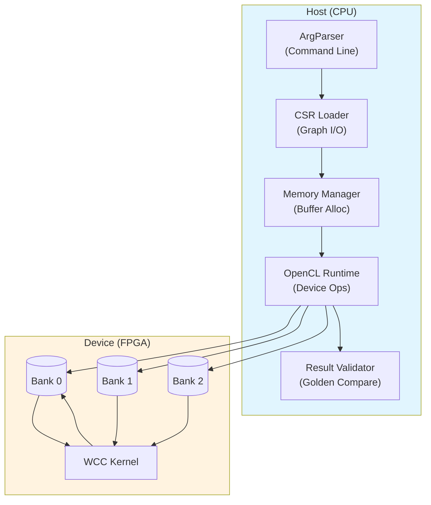

# Host Benchmark Application: Weakly Connected Components (WCC) FPGA Benchmark

## Opening: What This Module Does (And Why It Exists)

Imagine you're analyzing a massive social network graph with billions of connections, trying to identify distinct communities — groups of people who are all connected to each other, even if only indirectly. This is the **Weakly Connected Components (WCC)** problem, a fundamental graph analytics operation that underpins recommendation engines, fraud detection, and community discovery systems.

This module is the **host-side benchmark driver** for an FPGA-accelerated WCC implementation. It exists because graph analytics at scale is computationally intensive — a CPU-only solution can take hours on billion-edge graphs, while a well-designed FPGA accelerator can reduce this to minutes or seconds. But bridging the gap between a software graph algorithm and a hardware accelerator requires careful orchestration:

- **Data must be transformed** from native graph formats (CSV, MTX, CSR) into hardware-friendly memory layouts
- **Memory buffers must be allocated** on both host and device, with careful attention to alignment, bank assignment, and cache coherency
- **The FPGA kernel must be programmed** with the correct arguments, and its execution synchronized with data transfers
- **Results must be validated** against a trusted reference (the "golden" output) to ensure correctness

A naive solution might treat this as a simple "load data, run kernel, get result" script. But that would ignore the complexities of FPGA accelerator programming: the need for bank-aware memory allocation, the requirement for explicit data migration between host and device, the asynchronous nature of kernel execution, and the need for precise timing instrumentation. This module solves these problems through a carefully structured pipeline that separates concerns, enables reproducible benchmarking, and provides detailed performance insights.

## Architecture: The Anatomy of a Benchmark Driver

Think of this module as an **orchestration layer** sitting between the raw graph data and the FPGA accelerator. Like a conductor coordinating an orchestra, it doesn't perform the actual computation (that's the FPGA kernel's job), but it ensures all the pieces come together at the right time in the right order.



### Component Roles and Data Flow

The benchmark follows a **five-stage pipeline**, with clear separation between I/O, memory management, device coordination, and validation:

**Stage 1: Command-Line Parsing (`ArgParser`)**
The entry point parses configuration through a simple argument scanner. In production benchmark mode (non-HLS_TEST), it expects paths to the FPGA bitstream (`-xclbin`), graph offset file (`-o`), column file (`-c`), and golden reference (`-g`). In HLS simulation mode, these are hardcoded to local test data. This conditional compilation (via `#ifndef HLS_TEST`) allows the same source to serve both software simulation and hardware deployment.

**Stage 2: CSR Graph Loading (`CSR Loader`)**
The module reads graph data in **Compressed Sparse Row (CSR)** format, the de facto standard for sparse graph representations. CSR represents a graph using two arrays: an `offset` array of size |V|+1 that marks the start index of each vertex's adjacency list in the `column` array, and a `column` array of size |E| that stores the destination vertices. This format is memory-efficient for sparse graphs (O(|V|+|E|) vs O(|V|²) for adjacency matrix) and cache-friendly for graph traversal.

The loader reads these arrays from text files, performing `std::stoi` conversion line-by-line. Memory is allocated using `aligned_alloc<ap_uint<32>>`, ensuring 32-byte alignment for later OpenCL buffer mapping.

**Stage 3: Buffer Allocation and OpenCL Setup (`Memory Manager` + `OpenCL Runtime`)**
This is the most complex stage, involving three sub-phases:

1. **Host Memory Allocation**: Beyond the CSR arrays, the module allocates working buffers for the WCC algorithm: `column32G2` and `offset32G2` (for transposed graph), `offset32Tmp1` and `offset32Tmp2` (temporary sort buffers), `queue` (BFS queue), and `result32` (component labels). All use `aligned_alloc` for DMA compatibility.

2. **OpenCL Context Creation**: The module uses the Xilinx `xcl2` utility library to enumerate devices, create a context with `CL_QUEUE_PROFILING_ENABLE` and `CL_QUEUE_OUT_OF_ORDER_EXEC_MODE_ENABLE`, and load the FPGA bitstream.

3. **Bank-Aware Buffer Creation**: This is the most nuanced part. The module uses `cl_mem_ext_ptr_t` with specific bank indices (2, 3, 5, 6, 7, 8, 10, 12) to ensure buffers are allocated in specific HBM (High Bandwidth Memory) banks. This bank-interleaving strategy maximizes memory bandwidth by allowing parallel accesses to different banks. The `CL_MEM_EXT_PTR_XILINX | CL_MEM_USE_HOST_PTR` flags enable zero-copy buffer sharing between host and device.

**Stage 4: Kernel Execution (`WCC Kernel`)**
With buffers set up, the module enqueues a three-phase operation:

1. **H2D Transfer**: `enqueueMigrateMemObjects` moves input data (CSR arrays) from host to device.
2. **Kernel Launch**: The WCC kernel is launched with 13 arguments including graph dimensions, buffer references, and scratchpad pointers. The kernel implements a parallel connected components algorithm on the FPGA.
3. **D2H Transfer**: Results are migrated back to host memory.

The module uses `cl::Event` for synchronization and `CL_PROFILING_COMMAND` queries to extract precise timing for each phase (H2D, kernel, D2H).

**Stage 5: Result Validation (`Result Validator`)**
The final stage compares FPGA results against a golden reference file. The golden file contains the expected component label for each vertex. The validator reads this file, converts entries to integers, and performs an element-wise comparison with `result32`. Mismatches are reported with vertex index, expected value, and actual value. The module uses `xf::common::utils_sw::Logger` to emit standardized test pass/fail messages.

## Component Deep-Dives

### `struct timeval` (from `<sys/time.h>`)
While not defined in this module, this standard POSIX structure is critical for wall-clock timing. The module uses `gettimeofday` to capture timestamps before and after kernel execution, providing a coarse-grained elapsed time in microseconds. This complements the fine-grained OpenCL profiling events.

### `class ArgParser`
A lightweight command-line scanner that maintains a vector of tokenized arguments. The `getCmdOption` method performs a linear search for option flags, returning the subsequent token as the value. This is a simple but effective pattern for benchmark configuration, though it lacks validation (e.g., no check for missing required arguments until runtime).

**Key Design Choice**: The parser is intentionally minimal. In a production system, one might use `boost::program_options` or similar, but for a benchmark harness, minimal dependencies reduce build complexity.

### `main()` — The Orchestration Function
The `main` function is the integration point that sequences all operations. It's worth understanding the control flow branches:

**Compile-Time Branches (`#ifndef HLS_TEST`)**:
The code maintains two operational modes via conditional compilation:
- **HLS Simulation Mode**: When `HLS_TEST` is defined, the code bypasses all OpenCL setup and directly calls `wcc_kernel` as a C++ function. This enables software simulation and debugging without FPGA hardware.
- **Hardware Mode**: When `HLS_TEST` is undefined, the full OpenCL stack is initialized, the FPGA is programmed, and the kernel is launched on hardware.

This dual-mode design is a hallmark of FPGA development workflows, allowing the same algorithmic code to be tested in simulation before hardware deployment.

**Memory Layout and Bank Assignment**:
The `mext_o` array defines the mapping between host pointers and HBM banks:

```cpp
mext_o[0] = {2, column32, wcc()};   // Bank 2: Column array (input)
mext_o[1] = {3, offset32, wcc()};   // Bank 3: Offset array (input)
mext_o[2] = {5, column32G2, wcc()}; // Bank 5: Transposed column
mext_o[3] = {6, offset32G2, wcc()};  // Bank 6: Transposed offset
mext_o[4] = {7, offset32Tmp1, wcc()}; // Bank 7: Temp buffer 1
mext_o[5] = {8, offset32Tmp2, wcc()}; // Bank 8: Temp buffer 2
mext_o[6] = {10, queue, wcc()};       // Bank 10: BFS queue
mext_o[7] = {12, result32, wcc()};    // Bank 12: Result labels
```

The bank indices (2, 3, 5, 6, 7, 8, 10, 12) are not sequential, suggesting they correspond to specific physical HBM channels optimized for concurrent access. The kernel likely performs parallel reads/writes to these banks during the connected components traversal.

**OpenCL Command Queue Configuration**:
The command queue is created with two important flags:
- `CL_QUEUE_PROFILING_ENABLE`: Allows timestamp queries for performance analysis
- `CL_QUEUE_OUT_OF_ORDER_EXEC_MODE_ENABLE`: Permits the runtime to reorder operations for better throughput

However, the code enforces in-order execution via event dependencies (`events_write`, `events_kernel`, `events_read`), ensuring that kernel execution waits for H2D transfer completion, and D2H transfer waits for kernel completion.

## Design Decisions and Tradeoffs

### 1. **Raw Pointers vs. Smart Pointers (Memory Ownership)**
The code uses raw pointers (`ap_uint<32>*`) allocated via `aligned_alloc` rather than `std::unique_ptr` or `std::shared_ptr`. This is a deliberate tradeoff:

- **Pros**: Direct compatibility with OpenCL's `CL_MEM_USE_HOST_PTR` flag, which requires host-accessible memory that remains valid during kernel execution. Smart pointer type erasure could complicate the pointer arithmetic and bank mapping.
- **Cons**: No automatic cleanup. A missed `free()` (which is indeed missing in the code!) causes memory leaks. Exception safety is compromised — if an exception is thrown mid-execution, the allocated buffers are never released.

**New Contributor Gotcha**: There is no `free()` call for any of the `aligned_alloc` buffers in the provided code. In a long-running benchmark suite, this would accumulate memory. The RAII pattern should be applied here, perhaps with a custom `AlignedBuffer` class that calls `free()` in its destructor.

### 2. **Conditional Compilation vs. Runtime Polymorphism (HLS_TEST)**
The module uses `#ifndef HLS_TEST` to switch between simulation and hardware modes, rather than a runtime flag or virtual interface.

- **Pros**: Zero runtime overhead in hardware mode — no branch on a mode flag. The compiler can optimize away the unused path entirely. No virtual dispatch cost.
- **Cons**: Requires recompilation to switch modes. Cannot test both paths in a single binary. Build system complexity increases (must define or undefine `HLS_TEST`).

**Design Insight**: This reflects the FPGA development workflow, where simulation and hardware are fundamentally different targets with different toolchains. The conditional compilation mirrors the reality that HLS simulation uses the Vivado HLS compiler, while hardware uses the Vitis/OpenCL stack.

### 3. **Synchronous Event Chaining vs. Async Callbacks**
The OpenCL execution uses explicit `cl::Event` objects and `wait()` calls rather than a callback-based async model.

- **Pros**: Predictable, linear control flow that matches the conceptual "load → compute → store" pipeline. Easier to debug — execution pauses at known points. Timing measurements are straightforward.
- **Cons**: CPU cycles spent in `wait()` could be used for other work (e.g., preparing the next graph batch). Not optimal for throughput when processing multiple graphs.

**Tradeoff Justification**: For a benchmark measuring single-graph latency, synchronous execution provides the cleanest, most reproducible measurements. Throughput-optimized batch processing would require a different architecture (e.g., double-buffering with overlapped H2D/compute/D2H).

### 4. **Bank-Interleaved Buffer Allocation**
The use of specific, non-contiguous HBM bank indices (2, 3, 5, 6, etc.) rather than a simple "allocate all in bank 0" strategy.

- **Pros**: Maximizes memory bandwidth by allowing parallel accesses to different banks. The WCC kernel likely has multiple memory channels operating concurrently — one reading edges, one writing labels, one managing a queue. Spreading across banks prevents contention.
- **Cons**: More complex allocation logic. Must know the kernel's memory access pattern at allocation time. Less portable — different FPGA boards have different HBM configurations.

**Key Insight**: This is a form of **co-design** between host and kernel. The host code encodes assumptions about how the kernel will access memory. If the kernel changes its access pattern, the bank assignments here must change too. This coupling is intentional — it enables performance, but it creates a maintenance dependency.

## Usage, Extension Points, and Pitfalls

### Running the Benchmark

**Hardware Mode** (requires FPGA with Xilinx shell):
```bash
./wcc_benchmark -xclbin ./wcc.xclbin \
                -o ./data/graph_offset.csr \
                -c ./data/graph_column.csr \
                -g ./data/golden.mtx
```

**HLS Simulation Mode** (compile with `-DHLS_TEST`):
```bash
# Links against HLS simulation library instead of OpenCL
./wcc_benchmark  # Uses hardcoded test data paths
```

### Expected Input Formats

**Offset File** (`-o`): CSR offset array, one integer per line
```
5        # Number of vertices (first line)
0        # offset[0]: start of vertex 0's edges
2        # offset[1]: vertex 0 has edges[0:2)
3        # offset[2]: vertex 1 has edges[2:3)
...      # offset array has numVertices+1 entries
```

**Column File** (`-c`): CSR column array (destination vertices), one integer per line
```
4        # Number of edges (first line)
1        # edge 0: 0→1
3        # edge 1: 0→3
2        # edge 2: 1→2
...      # column array has numEdges entries
```

**Golden File** (`-g`): Expected component labels (MTX-like format)
```
5 3      # First line: total components (first number), padding
1 1      # vertex 0 belongs to component 1
2 1      # vertex 1 belongs to component 1
3 2      # vertex 2 belongs to component 2
...      # numVertices lines follow
```

### Common Pitfalls for New Contributors

**1. Missing Memory Deallocation**
As noted in the design analysis, there are no `free()` calls for the `aligned_alloc` buffers. If extending this code or using it as a template, you must add:
```cpp
// At end of main() or in RAII wrapper
free(offset32); free(column32); free(column32G2); 
free(offset32G2); free(offset32Tmp1); free(offset32Tmp2);
free(queue); free(result32);
```

**2. Bank Index Mismatch with Kernel**
The bank indices in `mext_o` (2, 3, 5, 6, 7, 8, 10, 12) must match the `sp` (single port) or `mp` (multiport) interfaces in the kernel's Vitis configuration (`kernel.xml` or `connectivity.cfg`). If you modify the kernel to use different banks, you must update these indices or the kernel will either fail to compile or silently exhibit reduced performance due to suboptimal routing.

**3. HLS_TEST Mode Requires Different Linkage**
When compiling with `-DHLS_TEST`, the code calls `wcc_kernel()` directly as a C++ function. This requires:
- The `wcc_kernel.hpp` header to contain the function declaration
- The kernel source (or a simulation library) to be compiled and linked with the host
- No dependency on Xilinx runtime libraries (xcl2, OpenCL)

Do not attempt to mix HLS_TEST mode with actual FPGA hardware libraries — the `wcc()` kernel object won't exist.

**4. Golden File Format Sensitivity**
The golden file parser has a specific expectation: the first line contains a count (number of connected components), and subsequent lines contain `vertex_id component_label` pairs. The vertex IDs in the golden file are 1-indexed (hence the `tmpi[0] - 1` adjustment when indexing `gold_result`). If your reference data uses 0-indexing or a different format, validation will fail or produce false negatives.

**5. Implicit Buffer Size Contracts**
The code assumes that buffer sizes derived from `numVertices` and `numEdges` will not overflow 32-bit integers, and that the CSR data is well-formed (offsets are non-decreasing, column indices are within bounds). There is no validation of these invariants — corrupt input files will likely cause undefined behavior in the kernel, not a clean error message.

## References and Related Modules

- **[graph.L2.benchmarks.connected_component.host.main.timeval](graph-l2-benchmarks-connected_component-host-benchmark_application.md)** — The core timing utilities used in this module
- **[platform_connectivity_configs](graph-l2-benchmarks-connected_component-platform_connectivity_configs.md)** — FPGA platform-specific connectivity configurations that determine HBM bank availability

Upstream dependencies (this module calls):
- `wcc_kernel` — The FPGA kernel implementing the WCC algorithm (kernel source not in host tree)
- `xcl2.hpp` — Xilinx OpenCL utilities for device enumeration and bitstream loading
- `xf_utils_sw::Logger` — Standardized logging and timing utilities

Downstream dependencies (modules that call this):
- This is a leaf executable module; no other modules depend on it. It is invoked directly by benchmark automation scripts or developers.

## Summary: The Big Picture

This module embodies a **pattern** that repeats across the FPGA graph analytics benchmarks in this codebase: a dual-mode (simulation/hardware) host application that bridges CSR-formatted graph data to an FPGA-optimized kernel through carefully managed OpenCL buffers. Understanding this module means understanding:

1. **How FPGA acceleration is instrumented** — The OpenCL buffer setup, bank assignment, and event-based profiling
2. **How graph data flows** — From text files → CSR arrays → aligned host buffers → HBM banks → kernel
3. **Where the performance-critical decisions are** — Bank interleaving, zero-copy buffer sharing, synchronous vs. async execution
4. **Where the risks are** — Memory leaks, bank mismatches, implicit buffer size contracts, golden file format sensitivity

For a new contributor, this module serves as both a **working example** of FPGA host programming and a **template** for new graph algorithm benchmarks. Copy its structure when adding a new kernel, but remember to: add proper memory cleanup, validate your CSR invariants, and ensure your bank assignments match your kernel's connectivity configuration.
