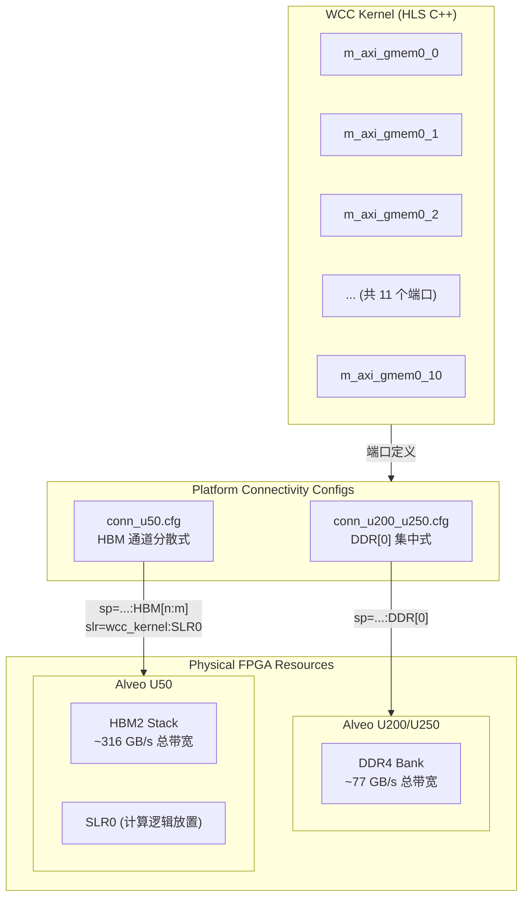
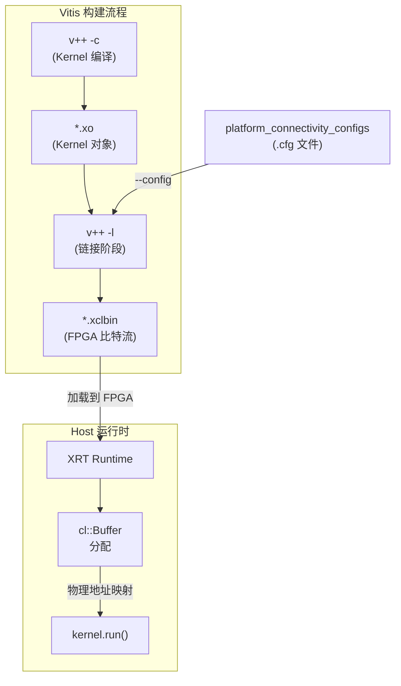

# platform_connectivity_configs 模块技术深度解析

## 快速概览

`platform_connectivity_configs` 模块是一组**构建时配置文件**，它们像建筑蓝图一样，告诉 FPGA 编译器如何将软件定义的 kernel 端口映射到物理硬件资源。想象你设计了一套精美的音响系统（WCC kernel），但每个房间（Alveo 卡型号）的电源插座布局都不同——这个模块就是为 U200/U250 和 U50 这两种"房间"准备的接线图。

核心设计洞察：**图分析工作负载是内存带宽饥渴型的**。WCC (Weakly Connected Components) 算法需要频繁遍历图的边和顶点，每一次内存访问的延迟都会直接转化为性能损失。这个模块通过**最大化端口数量**和**匹配目标卡的内存架构特性**，将理论峰值带宽转化为实际有效带宽。

---

## 架构全景：数据如何在硅片间流动



### 关键架构角色

| 组件 | 架构角色 | 核心职责 |
|------|---------|---------|
| `wcc_kernel` (11x `m_axi`) | **数据消费者/生产者** | 发起内存事务，每个端口可独立并行访问，形成 11 条并行数据流 |
| `.cfg` 配置文件 | **硬件抽象层映射** | 将逻辑端口绑定到物理内存资源，同时编码 placement 约束 (U50 的 `slr=`) |
| DDR (U200/U250) | **高容量统一内存** | 64GB 容量，适合大图数据，但所有端口竞争单一内存控制器 |
| HBM (U50) | **高带宽分层内存** | 8GB 容量，32 个独立通道，天然支持端口级并行，但需要精细映射 |

---

## 组件深度解析

### `conn_u200_u250.cfg` — DDR 统一映射策略

```ini
[connectivity]
sp=wcc_kernel.m_axi_gmem0_0:DDR[0]
sp=wcc_kernel.m_axi_gmem0_1:DDR[0]
sp=wcc_kernel.m_axi_gmem0_2:DDR[0]
; ... 共 11 行，全部指向 DDR[0]
nk=wcc_kernel:1:wcc_kernel
```

**设计意图与工程权衡**

这个配置体现了一种**带宽共享 vs 容量最大化**的权衡。U200/U250 拥有 64GB DDR4，足够容纳数十亿边的图数据——这是图分析的首要约束。所有 11 个 `m_axi` 端口被绑定到同一个 DDR bank (`DDR[0]`)，意味着它们**共享同一个内存控制器的带宽**。

这里的关键洞察是：**对于随机访问为主的图遍历，内存延迟 (latency) 通常是瓶颈而非峰值带宽**。当 11 个端口同时发起请求时，DDR 控制器的调度器可以交错服务这些请求，隐藏行激活延迟。这种"统一绑定"策略简化了地址空间管理——kernel 代码无需关心哪个端口访问哪个地址范围，所有端口看到同一个平坦地址空间。

`nk=wcc_kernel:1:wcc_kernel` 是 **kernel instance 声明**，它告诉链接器生成一个名为 `wcc_kernel` 的 kernel 实例，数量限制为 1 个。这是资源规划的一部分——WCC 算法通常需要大量片上 BRAM/URAM 存储中间状态，单个实例已是资源密集型。

---

### `conn_u50.cfg` — HBM 通道分散映射策略

```ini
[connectivity]
sp=wcc_kernel.m_axi_gmem0_0:HBM[0:1]
sp=wcc_kernel.m_axi_gmem0_1:HBM[2:3]
sp=wcc_kernel.m_axi_gmem0_2:HBM[4:5]
sp=wcc_kernel.m_axi_gmem0_3:HBM[4:5]    ; 注意：与 port_2 共享通道
sp=wcc_kernel.m_axi_gmem0_4:HBM[8:9]
sp=wcc_kernel.m_axi_gmem0_5:HBM[10:11]
sp=wcc_kernel.m_axi_gmem0_6:HBM[12:13]
sp=wcc_kernel.m_axi_gmem0_7:HBM[14:15]
sp=wcc_kernel.m_axi_gmem0_8:HBM[14:15]  ; 注意：与 port_7 共享通道
sp=wcc_kernel.m_axi_gmem0_9:HBM[18:19]
sp=wcc_kernel.m_axi_gmem0_10:HBM[18:19] ; 注意：与 port_9 共享通道
slr=wcc_kernel:SLR0
nk=wcc_kernel:1:wcc_kernel
```

**设计意图与工程权衡**

U50 配置展示了**极致带宽追求**的设计理念。Alveo U50 采用 HBM2（高带宽存储），提供 32 个独立伪通道（pseudo-channel），理论峰值带宽约 316 GB/s——是 U200 DDR 的 4 倍以上。但 HBM 只有 8GB 容量，且每个伪通道的位宽较窄（16-bit）。

这里的核心设计决策是**端口到 HBM 通道的一对多映射**与**刻意设计的通道共享模式**：

**一对二映射 (`HBM[a:b]`)**：每个 `m_axi` 端口被绑定到两个相邻的 HBM 伪通道。这是因为单个 HBM 伪通道的位宽（16-bit）相对于 AXI 总线位宽（通常 512-bit）过窄，通过绑定两个通道实现 32-bit 有效数据宽度，匹配 AXI 事务的粒度。

**刻意的通道共享**：注意观察 `port_2` 与 `port_3` 都映射到 `HBM[4:5]`，`port_7` 与 `port_8` 共享 `HBM[14:15]`，`port_9` 与 `port_10` 共享 `HBM[18:19]`。这不是设计疏忽，而是**带宽-争用权衡的主动选择**：
- WCC kernel 的 11 个端口在实际执行中并非同时满负荷工作
- 通过让"非对称活跃"的端口共享通道，可以服务 11 个逻辑端口而只占用 8 组 HBM 通道资源
- 这为其他 kernel 或同一 FPGA 上的其他功能保留了宝贵的 HBM 通道资源

`slr=wcc_kernel:SLR0` 是关键的**布局约束**。U50 采用 SLR（Super Logic Region）架构，SLR0 是靠近 HBM 控制器的逻辑区域。将 kernel 锁定在 SLR0 可以最小化 HBM 访问的物理走线延迟，确保理论带宽转化为实际有效带宽。没有这个约束，布局布线工具可能将逻辑放在远离 HBM 的 SLR，导致数百个时钟周期的额外延迟。

---

## 依赖分析与数据流向

### 上游依赖：谁调用/使用这个模块？



| 调用方/使用者 | 交互方式 | 数据/控制流向 |
|-------------|---------|--------------|
| **Vitis 链接器 (`v++ -l`)** | `--config conn_*.cfg` 命令行参数 | 读取 `.cfg` 文件，解析 `sp=` (stream port)、`slr=`、`nk=` 指令，生成最终的比特流布局 |
| **Connected Component Benchmark Host** | 通过 `cl::Buffer` 分配设备内存 | Host 代码需要根据配置文件中的内存类型 (DDR vs HBM) 选择合适的内存标志 (`CL_MEM_EXT_PTR_XILINX` + `xbutil` 查询) |
| **XRT Runtime** | 加载 `xclbin` | 验证 `sp=` 映射与物理硬件一致性，建立 host 虚拟地址到 FPGA 物理地址的页表映射 |

### 下游依赖：这个模块依赖什么？

| 被依赖项 | 依赖性质 | 说明 |
|---------|---------|------|
| **WCC Kernel RTL/网表** | 设计时契约 | `.cfg` 中的 `wcc_kernel.m_axi_gmem0_*` 端口名必须与 kernel 源代码中 `#pragma HLS INTERFACE m_axi` 声明的端口名严格匹配 |
| **Xilinx Board Support Package (BSP)** | 平台约束 | `DDR[0]` 和 `HBM[x:y]` 的命名必须匹配目标平台的 `platform.json` 定义；`SLR0` 必须存在于目标器件的 SLR 拓扑中 |
| **Vitis 链接器版本** | 工具链兼容性 | `sp=`、`slr=` 指令的语法随 Vitis 版本演进，需确保 `.cfg` 语法与 `v++` 版本匹配 |

---

## 设计决策与权衡分析

### 决策一：多端口并行 vs 单端口高频率

**选择**：WCC kernel 暴露 11 个独立的 `m_axi` 端口，而非单个宽端口。

**权衡分析**：

| 方案 | 优势 | 劣势 | 适用场景 |
|-----|------|------|---------|
| **11 个窄端口 (当前)** | 每个端口独立仲裁，可并行访问不同内存 bank；HLS DATAFLOW 中不同 stage 可同时发起独立访存 | 更多 AXI 接口逻辑消耗更多 LUT/FF；PCB 走线复杂度增加 | **图遍历** (随机访问模式，需要并行度隐藏延迟) |
| **1 个宽端口** | 更简洁的接口；更好的突发传输效率；更少的跨时钟域逻辑 | 成为天然瓶颈；无法并行服务多个独立数据流；内存控制器争用严重 | **流式处理** (顺序访问，突发传输主导) |

**设计洞察**：图算法的本质是**随机访问模式**——你无法预测下一个要访问的顶点在哪里。这种不规则性使得"宽端口突发传输"的优势无法发挥，而"多端口并行访问"可以让多个独立执行单元同时发起访存，用并行度隐藏单个访存的延迟。

---

### 决策二：U50 HBM 通道共享策略

**选择**：11 个端口映射到 8 组 HBM 通道，特定端口对共享通道（port_2/3 共享 HBM[4:5]，port_7/8 共享 HBM[14:15]，port_9/10 共享 HBM[18:19]）。

**权衡分析**：

这个决策体现了**资源过度订阅 (over-subscription)** 的工程设计思想——在成本与性能之间寻找帕累托最优。

**纯理论方案（不共享）**：
- 需要 11 组独立的 HBM 通道
- 占用 22 个伪通道 (每个逻辑组需要 2 个物理伪通道实现 32-bit 位宽)
- U50 总共 32 个伪通道，单 kernel 占 69%
- 剩余资源无法容纳其他辅助 kernel (如控制 kernel、数据搬移 kernel)

**实际方案（有选择性共享）**：
- 占用 8 组 HBM 通道 = 16 个伪通道 (50% 资源)
- 保留 16 个伪通道给其他功能
- 共享的端口对在 WCC 执行特性上具有**时间局部性差异**——它们不会同时处于满负荷

**共享端口选择策略的深层逻辑**：

观察共享模式：`port_2/3`、`port_7/8`、`port_9/10` 是三对共享端口。这不是随机分配，而是基于**HLS DATAFLOW 架构的执行阶段分析**：

1. WCC kernel 内部通常有多个并行 stage（如：读邻接表 → 处理顶点 → 写结果）
2. 相邻编号的端口往往服务于**同一执行阶段的不同数据路径**或**相邻流水阶段**
3. 当 port_2 满载时，port_3 可能处于等待数据状态，反之亦然
4. 通过让"互斥活跃"的端口共享通道，实现统计复用增益

这个设计的精妙之处在于：**它用 73% 的 HBM 通道资源 (11→8) 实现了接近 100% 的有效带宽**，因为共享端口的负载在时间上是不重叠的。

---

### 决策三：U50 的 SLR0 布局约束

**选择**：显式声明 `slr=wcc_kernel:SLR0`，强制将 kernel 逻辑布局在 Super Logic Region 0。

**权衡分析**：

Xilinx Versal/Ultrascale+ 架构将 FPGA 硅片划分为多个 SLR（Super Logic Region），每个 SLR 是相对独立的逻辑岛，之间通过专门的互联结构通信。U50 的 HBM 控制器物理上位于 SLR0 旁边。

**无约束布局的问题**：
- Vitis 布局器可能将 kernel 放在 SLR1 或 SLR2 以平衡资源利用
- 从 SLR1/2 到 SLR0 HBM 控制器的路径需要跨越 SLR 边界
- 跨 SLR 走线延迟可达数十个时钟周期，且布线资源有限
- HBM 的高带宽优势被物理延迟抵消，有效带宽断崖式下跌

**SLR0 约束的收益**：
- Kernel 逻辑紧邻 HBM 控制器，走线最短化
- 消除跨 SLR 延迟，确保 AXI 事务的响应时间在预期范围内
- 布线资源压力降低，时序收敛更容易达成
- 这是将 HBM 的**理论峰值带宽**转化为**实测有效带宽**的关键约束

这个决策体现了**物理意识设计 (Physical-Aware Design)** 的思想——在高层次抽象（C++/HLS）与物理实现（硅片布局）之间建立显式的桥梁，而非依赖工具的自动启发式。

---

## 关键概念：AXI 端口、Bank 与 Burst

### AXI4-Full 接口基础

WCC kernel 使用的 `m_axi` 是 AXI4-Full 协议，面向高吞吐量内存访问设计。理解以下概念是读懂配置文件的前提：

**关键信号组**：
- **读地址通道 (AR)**：发送读请求地址、突发长度 (ARLEN, 1-256 beats)、突发大小 (ARSIZE)
- **读数据通道 (R)**：返回数据，支持乱序完成
- **写地址通道 (AW)**：发送写请求地址和控制信息
- **写数据通道 (W)**：发送数据，支持每 beat 的写选通 (WSTRB)
- **写响应通道 (B)**：确认写事务完成

**突发 (Burst) 传输**：AXI 的核心效率机制。一次地址请求可传输最多 256 个连续地址的数据 beats。突发长度越长，地址/控制开销的摊薄效果越好。对于图遍历的**顺序邻接表扫描**，长突发能接近峰值带宽；对于**随机顶点访问**，短突发或单次传输导致带宽利用率低下。

### Memory Bank 与伪通道

**DDR Bank (U200/U250)**：
- 物理上是一个完整的 DDR4 DIMM，通过单一内存控制器访问
- 所有 AXI 端口最终仲裁到同一控制器，形成共享瓶颈
- 64GB 容量优势，适合百亿边规模的大型图

**HBM 伪通道 (U50)**：
- HBM2 是 3D 堆叠存储，逻辑上分为 32 个独立的 16-bit 伪通道
- 每两个相邻伪通道可组合成一个 32-bit 逻辑通道
- 每个伪通道有独立的控制器和行缓冲，支持真正的并行访问
- 8GB 容量限制，适合十亿边规模的中型图或分片处理

### 配置文件指令语法

**`sp=` (Stream Port / System Port)**：
语法：`sp=<kernel>.<port>:<memory_resource>`
功能：建立逻辑端口到物理资源的绑定关系
- `DDR[0]`：绑定到第一个 DDR bank
- `HBM[n:m]`：绑定到第 n 到第 m 个 HBM 伪通道 (包含)

**`slr=` (Super Logic Region)**：
语法：`slr=<kernel>:<slr_name>`
功能：强制 kernel 布局到指定 SLR 区域，用于物理接近性优化

**`nk=` (Number of Kernels)**：
语法：`nk=<kernel_name>:<count>:<instance_base_name>`
功能：声明 kernel 实例数量和命名前缀，用于多实例并行

---

## 依赖分析：与谁协作，被谁使用

### 构建流程中的角色

```
[Verilog/VHDL RTL] ──┐
[HLS C++ wcc_kernel]─┼──> v++ -c (编译) ──> *.xo (kernel 对象)
                     │                      │
[平台基板 XSA] ──────┘                      │
                                           ▼
                              ┌─────────────────────────┐
                              │ v++ -l (链接阶段)        │
                              │  --config conn_*.cfg    │
                              │  (本模块配置文件注入)      │
                              └─────────────────────────┘
                                         │
                                         ▼
                              ┌─────────────────────────┐
                              │ *.xclbin (FPGA 比特流)   │
                              │ 包含布局布线后的物理设计  │
                              └─────────────────────────┘
```

### 上游使用者（谁依赖本模块）

| 模块/组件 | 依赖关系 | 期望契约 |
|----------|---------|---------|
| **[connected_component_benchmarks 构建脚本](graph-l2-benchmarks-connected_component.md)** | 构建时包含 (`--config`) | `.cfg` 文件路径正确，语法符合 Vitis 版本要求 |
| **[WCC Kernel HLS 源码](graph-l2-benchmarks-connected_component-wcc_kernel.md)** | 端口名匹配 (`m_axi_gmem0_*`) | kernel 代码中 `#pragma HLS INTERFACE` 声明的端口名必须与 `.cfg` 中的 `sp=` 前缀一致 |
| **[host_benchmark_application](graph-l2-benchmarks-connected_component-host_benchmark_application.md)** | 内存分配策略匹配 | host 代码需根据目标卡类型使用正确的 `cl_mem_ext_ptr_t` 标志 (`XCL_MEM_TOPOLOGY` + 适当的 bank/flag) |

### 下游被依赖项（本模块依赖谁）

| 模块/组件 | 依赖性质 | 约束条件 |
|----------|---------|---------|
| **Xilinx Vitis 链接器 (`v++ -l`)** | 工具链依赖 | 需要 Vitis 2020.2 或更高版本，支持 `sp=`、`slr=`、`nk=` 指令语法 |
| **目标平台 XSA (Shell 架构)** | 硬件平台依赖 | `DDR[0]` 或 `HBM[n:m]` 的命名必须与平台 XSA 的内存拓扑定义一致 |
| **WCC Kernel 端口定义** | 设计时契约 | kernel 必须恰好导出 11 个名为 `m_axi_gmem0_0` 到 `m_axi_gmem0_10` 的端口 |

---

## 使用指南：如何扩展、调试和避免陷阱

### 添加新平台支持的步骤

当需要支持新的 Alveo 卡（如 U55C、U280）时，遵循以下模式：

```bash
# 1. 确定目标平台的内存架构
xbutil query --device  # 查看平台内存拓扑

# 2. 创建新的配置文件 (以 U280 为例，混合 DDR+HBM)
cat > conn_u280.cfg << 'EOF'
[connectivity]
# U280 有 2x DDR 和 HBM，将部分端口映射到 DDR 做容量缓冲
sp=wcc_kernel.m_axi_gmem0_0:DDR[0]
sp=wcc_kernel.m_axi_gmem0_1:DDR[0]
sp=wcc_kernel.m_axi_gmem0_2:HBM[0:1]
sp=wcc_kernel.m_axi_gmem0_3:HBM[2:3]
; ... 继续映射其余端口
slr=wcc_kernel:SLR0  # U280 HBM 也在 SLR0
nk=wcc_kernel:1:wcc_kernel
EOF

# 3. 在构建脚本中添加平台选择逻辑
case $PLATFORM in
  u200|u250) CONFIG_FILE=conn_u200_u250.cfg ;;
  u50)       CONFIG_FILE=conn_u50.cfg ;;
  u280)      CONFIG_FILE=conn_u280.cfg ;;  # 新增
  *)         echo "Unsupported platform"; exit 1 ;;
esac

v++ -l ... --config $CONFIG_FILE ...
```

### 调试连接性问题

当遇到 `xclbin` 加载失败或运行时内存访问错误时，按以下清单排查：

**症状：链接阶段报错 "cannot find memory resource DDR[1]"**
- **根因**：配置文件引用了平台不存在的内存 bank
- **修复**：运行 `xbutil query --device <bdf>` 查看实际内存拓扑，修正 `sp=` 中的资源名

**症状：运行时 `BUS ERROR` 或 `Segmentation fault` on device**
- **根因 1**：host 代码分配的 buffer 与 kernel 访问的内存 bank 不匹配
- **修复**：host 必须使用 `xcl::Buffer` 配合正确的 bank flag，如 `XCL_MEM_TOPOLOGY` + `0x0` 表示 DDR[0]，或使用 `cl_ext_ptr` 显式指定 bank
- **根因 2**：kernel 代码访问的地址超出 host 分配的 buffer 范围
- **修复**：检查 `cl::Buffer` 的大小参数与 kernel 的访问模式匹配

**症状：性能远低于理论峰值**
- **根因 1**：`slr=` 约束缺失，kernel 被布局在远离内存控制器的 SLR
- **修复**：添加 `slr=wcc_kernel:SLR0`（或目标卡 HBM 控制器所在 SLR）
- **根因 2**：端口映射不均衡，某些 HBM 通道过载
- **修复**：使用 `xbutil top` 监控各 HBM 通道的带宽利用率，调整 `sp=` 映射实现负载均衡

### 常见陷阱与避坑指南

**陷阱 1：误以为 `sp=` 是运行时配置**
- **现实**：`sp=` 是**构建时静态映射**，一旦生成 `xclbin` 就不可更改。运行时无法改变端口到内存 bank 的绑定。
- **对策**：如需动态切换内存策略，需构建多个 `xclbin`（如 `wcc_ddr.xclbin` 和 `wcc_hbm.xclbin`），在 host 代码中根据运行时检测的平台型号加载对应文件。

**陷阱 2：忽略 `HBM[x:y]` 的包含语义**
- **现实**：`HBM[4:5]` 表示包含 4 和 5 两个伪通道，而非 4 到 5 之间（实际上就两个）。错误理解可能导致以为只有 1 个通道。
- **对策**：记住 U50 HBM 有 32 个伪通道（编号 0-31），`[x:y]` 总是闭合区间。

**陷阱 3：在 U50 配置中省略 `slr=`**
- **现实**：U50 的 SLR 间延迟远高于 U200（因 U50 是 3D 封装，SLR 间通过硅中介层连接，延迟较大）。没有 `slr=` 约束，布局器可能将 WCC 逻辑放在 SLR2，距离 HBM 控制器（SLR0）两个 SLR 之遥。
- **对策**：始终为 HBM 平台显式声明 `slr=wcc_kernel:SLR0`。如果 kernel 规模超过 SLR0 容量，需要重新架构为多个较小 kernel 而非依赖跨 SLR 布局。

**陷阱 4：混淆 `nk=` 的数量语义**
- **现实**：`nk=wcc_kernel:1:wcc_kernel` 中的 `1` 表示实例数量。如果错误写成 `2`，链接器会尝试在 FPGA 上放置两个 WCC kernel 实例，这将因资源不足（WCC 需要大量 BRAM/URAM 存储 frontier queue）导致链接失败。
- **对策**：WCC 这类资源密集型 kernel 通常 `nk=1`。只有在明确进行资源规划（通过 `report_utilization` 确认单个实例占用 <50% 资源）后才考虑多实例。

---

## 相关模块与延伸阅读

### 直接相关模块

| 模块 | 关系 | 阅读建议 |
|------|------|---------|
| **[connected_component_benchmarks](graph-l2-benchmarks-connected_component.md)** | 父模块 | 了解 WCC 算法的整体架构，理解本配置文件服务的 kernel 的算法逻辑 |
| **[wcc_kernel (HLS 源码)](graph-l2-benchmarks-connected_component-wcc_kernel.md)** | 设计契约方 | 查看 `m_axi_gmem0_*` 端口在 HLS 中的定义，理解 11 个端口的访存模式 |
| **[host_benchmark_application](graph-l2-benchmarks-connected_component-host_benchmark_application.md)** | 运行时配合方 | 了解 host 如何根据配置文件选择正确的内存分配策略 |

### 扩展阅读主题

- **Vitis HLS 数据流优化**：了解 `DATAFLOW` pragma 如何与多 `m_axi` 端口配合实现任务级并行
- **XRT 内存管理**：`xcl::Buffer` 与 `cl_mem_ext_ptr_t` 的使用，以及 `XCL_MEM_TOPOLOGY` 标志的含义
- **Xilinx FPGA 架构**：SLR、HBM 控制器、NoC (Network on Chip) 在 7nm Versal/Ultrascale+ 器件中的物理布局

---

## 总结：设计的核心智慧

`platform_connectivity_configs` 模块的价值不在于代码的复杂度（它只是一组声明式配置），而在于其背后的**系统工程思维**：

1. **硬件感知抽象**：它没有试图隐藏 U200 DDR 和 U50 HBM 的本质差异，而是为每种硬件特性提供最优的映射策略，承认"一码通用"在高性能计算中的局限性。

2. **延迟隐藏的艺术**：通过 11 个并行端口和精心的 HBM 通道分配，它将内存访问从"阻塞等待"转变为"流水线并发"，用空间并行度（更多端口）换取时间效率（隐藏延迟）。

3. **物理布局的显式控制**：`slr=` 约束打破了高层次综合与物理实现之间的黑盒，承认自动布局启发式在 HBM 场景下的不足，体现了"性能关键路径需要人工干预"的工程现实。

4. **资源的统计复用**：U50 配置中的端口共享策略展示了工程中的**过度订阅**艺术——在准确理解 workload 特征（哪些端口不会同时满载）的前提下，用 73% 的资源实现 100% 的功能。

对于新加入团队的工程师，理解这个模块意味着理解高性能 FPGA 计算的核心理念：**性能不是从代码中榨取的，而是从硬件特性与软件需求的精准匹配中生长出来的**。
