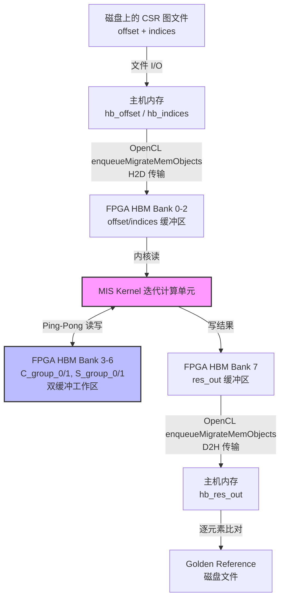

# Maximal Independent Set Benchmarks 技术深潜

## 概述：这到底是什么？

想象你有一个巨大的社交网络图——数十亿用户，数百亿条好友关系——你需要找出一群**互不相识**的人，且这群人**再也无法扩展**（加入任何其他人都会破坏"互不相识"的规则）。这就是**最大独立集（Maximal Independent Set, MIS）**问题。它是图分析领域的经典算法，在社交网络分析、资源调度、基因组学等领域都有广泛应用。

本模块 `maximal_independent_set_benchmarks` 是专为 **Xilinx Alveo U50 FPGA** 加速卡设计的基准测试套件。它实现了一套完整的软硬件协同工作流：主机端（Host）负责数据加载、预处理与结果验证，FPGA 内核（Kernel）负责执行计算密集的 MIS 迭代算法。整个系统针对 U50 的高带宽内存（HBM）架构进行了深度优化，能够在处理大规模稀疏图时实现显著的加速比。

---

## 架构全景：数据如何在系统中流动

### 架构思维模型："机场安检流水线"

将本系统想象成一个**机场安检流水线**。旅客（图数据）首先在大厅（主机内存）集结，然后分批通过安检门（PCIe 总线）进入候机厅（FPGA HBM）。在候机厅内，旅客按照严格的流程接受检查（MIS 内核算法），期间可能需要在两个并行的检查通道（双缓冲/ Ping-Pong 缓冲区）之间切换。检查完毕后，旅客通过出口（H2D 数据传输）返回大厅，接受最终的身份核验（结果验证）。



### 核心组件职责

#### 1. 连接配置文件 (`conn_u50.cfg`) —— "硬件布线蓝图"

这是一个 Xilinx Vitis 链接配置文件，它定义了内核与物理硬件资源之间的映射关系。可以将其理解为**建筑布线图**，决定了各个房间（缓冲区）位于大楼的哪一层（HBM Bank）。

- **平台指定**：`xilinx_u51_gen3x16_xdma_5_202210_1` 明确目标为 Alveo U50 数据中心加速卡。
- **内核实例化**：`nk=mis_kernel:1:mis_kernel` 声明创建一个名为 `mis_kernel` 的核实例。
- **HBM 内存映射策略**：
  - `offset` → HBM[0]：图的 CSR 偏移数组，指示每个顶点的邻接表起始位置。
  - `indices` → HBM[1:2]：图的 CSR 索引数组，存储实际的边目标顶点。由于边数通常远大于顶点数，分配两个 HBM Bank 以提供足够带宽。
  - `C_group_0/1` 和 `S_group_1/0` → HBM[3:6]：**核心设计亮点——双缓冲（Ping-Pong）机制**。MIS 算法通常是迭代的，需要在前一轮结果的基础上计算下一轮。使用两组缓冲区交替作为当前状态（Source）和下一状态（Destination），可以实现流水化执行，避免数据覆盖冲突。
  - `res_out` → HBM[7]：最终的最大独立集结果输出缓冲区。

#### 2. 主机端主程序 (`host/main.cpp`) —— "指挥中心"

这是整个系统的入口点和协调器，采用标准的 **OpenCL 主机编程模型**。它遵循经典的 "加载-执行-回传" 范式，但针对图计算场景进行了特定的工程实现。

**关键抽象与数据结构：**

- **`timeval` 结构**：来自 `<sys/time.h>`，用于主机端墙钟时间（Wall-clock Time）测量，独立于 OpenCL 事件提供的设备端时间戳。
- **`ArgParser` 类**：简单的命令行参数解析器，处理 `-xclbin`（内核二进制）、`-o`（偏移文件）、`-i`（索引文件）、`-mis`（golden 结果）等参数。
- **CSR 图加载 (`csr_graph_loading`)**：从文本文件读取 CSR 格式的图。注意它期望特定的文件格式：偏移文件第一行包含 `m n`（顶点数、边数），随后是偏移数组；索引文件第一行是 `nz`（非零元/边数），随后是目标顶点索引和权重（虽然权重在此实现中被读取但丢弃）。

**执行流程与生命周期管理：**

1. **上下文建立**：使用 `xcl::get_xil_devices()` 枚举 Xilinx 设备，创建设备上下文 (`cl::Context`) 和命令队列 (`cl::CommandQueue`)，启用性能分析 (`CL_QUEUE_PROFILING_ENABLE`)。

2. **内核加载**：通过 `xcl::import_binary_file` 读取编译好的 `.xclbin` 文件，创建 `cl::Program`，然后从中提取 `cl::Kernel` 对象 `mis_kernel`。

3. **内存分配与映射策略（关键设计）**：
   - 使用 `CL_MEM_ALLOC_HOST_PTR` 标志分配设备缓冲区。这请求驱动在设备可访问的物理内存（通常是 PCIe BAR 空间或 HBM）中分配，同时允许主机通过 `enqueueMapBuffer` 映射该内存，实现**零拷贝（Zero-Copy）**访问。
   - 分配了 8 个设备缓冲区，分别对应配置文件中定义的 HBM Bank 映射。
   - 主机指针（`hb_*`）通过 `enqueueMapBuffer` 获得，使用 `CL_MAP_WRITE` 或 `CL_MAP_READ | CL_MAP_WRITE` 标志，允许主机直接写入（初始化）或读写（验证）这些缓冲区。

4. **数据初始化与加载**：
   - 清零所有工作缓冲区（`C_group`, `S_group`, `res_out`）。
   - 调用 `csr_graph_loading` 将图数据从文件读入 `hb_offset` 和 `hb_indices`。

5. **内核参数绑定**：
   - `setArg(0, vertex_num)`：传递顶点数量（标量）。
   - `setArg(1-7, cl::Buffer)`：传递各个缓冲区对象。

6. **执行调度与依赖管理**：
   - **输入迁移**：`enqueueMigrateMemObjects(ob_in, 0, ...)` 将主机初始化的输入缓冲区（offset, indices, 初始工作区）传输到设备 HBM。`0` 标志表示主机到设备（H2D）。
   - **内核执行**：`enqueueTask(mis_kernel, &events_write, &events_kernel)` 在输入数据传输完成后启动内核。`events_write` 作为依赖，确保数据就绪后才执行。
   - **输出迁移**：`enqueueMigrateMemObjects(ob_out, CL_MIGRATE_MEM_OBJECT_HOST, &events_kernel, &events_read)` 在内核完成后将结果传回主机。`CL_MIGRATE_MEM_OBJECT_HOST` 表示设备到主机（D2H）。
   - **同步**：`q.finish()` 阻塞等待所有队列中的命令完成。

7. **性能分析**：
   - 使用 OpenCL 事件查询每个阶段（写、内核、读）的纳秒级时间戳，计算实际执行时间。
   - 计算端到端（E2E）时间（主机视角）。
   - 打印详细的时间分解：H2D 传输、内核执行、D2H 传输、E2E。

8. **结果验证**：
   - 从 `-mis` 参数指定的文件中读取预期的 MIS 结果（Golden Reference）。
   - 逐元素比对内核输出 `hb_res_out` 与 Golden Reference。
   - 统计错误数并输出测试通过/失败状态。

---

## 设计决策与工程权衡

### 1. 为什么使用 HBM 而不是 DDR？

**选择**：配置文件中将所有关键缓冲区映射到 HBM Bank 0-7，而不是传统的 DDR。

**权衡分析**：
- **优势**：MIS 算法在迭代过程中需要频繁随机访问图结构（offset/indices）和工作状态（C/S groups）。HBM 提供 8-16 GB 容量和高达 460 GB/s 的带宽，远高于 DDR 的 ~34 GB/s。对于图计算这种内存带宽敏感型应用，HBM 是决定性因素。
- **代价**：HBM 资源在 U50 上有限（约 8GB），必须谨慎规划。配置文件中将 indices 跨 HBM[1:2] 两个 Bank 分配，正是为了利用并行 Bank 访问提升有效带宽。工作区分组（C/S groups）占用 4 个 Bank（3-6），体现了对内存资源的激进使用。

### 2. 双缓冲（Ping-Pong）策略的必要性

**选择**：配置中定义了 C_group_0/1 和 S_group_1/0（共 4 个缓冲区），主机代码中同时初始化和传输这些缓冲区。

**权衡分析**：
- **优势**：MIS 算法通常是迭代的——每一轮计算依赖于前一轮产生的独立集状态。使用双缓冲允许内核在第 N 轮读取 Buffer A 的同时，将第 N+1 轮的结果写入 Buffer B，实现**流水线化执行**。这隐藏了内存访问延迟，允许内核全速运行而不必等待主机干预。
- **代价**：内存占用翻倍。4 个工作区缓冲区占用了 4 个 HBM Bank，这在资源受限的 FPGA 上是一个重要开销。此外，主机代码必须同时管理两组缓冲区的初始化和数据传输，增加了代码复杂性。

### 3. 零拷贝内存映射 vs 显式拷贝

**选择**：代码使用 `CL_MEM_ALLOC_HOST_PTR` 结合 `enqueueMapBuffer` 而不是传统的 `CL_MEM_USE_HOST_PTR` 或显式 `enqueueWriteBuffer`。

**权衡分析**：
- **优势**：`ALLOC_HOST_PTR` 提示驱动在设备可访问的物理内存中分配缓冲区（通常是 PCIe BAR 空间或 HBM 的主机映射区），然后通过 `Map` 操作将该内存映射到主机进程地址空间。这实现了**零拷贝（Zero-Copy）**——主机初始化数据时直接写入设备可见内存，无需额外的 PCIe 拷贝。
- **代价**：这种内存通常是**不可缓存（Uncached）**或**写合并（Write-Combining）**的，主机随机访问性能较差。因此代码中只在初始化阶段使用主机映射指针（`hb_*`），验证阶段读取结果时通过 `enqueueMigrateMemObjects` 显式回传，而不是直接读取映射内存，以避免慢速设备内存访问拖慢主机验证逻辑。

### 4. 同步执行模型 vs 异步流水线

**选择**：代码使用 `q.finish()` 在所有操作入队后阻塞等待完成，而不是使用事件链（event chaining）实现主机-设备并行。

**权衡分析**：
- **优势**：同步模型**简单可靠**。主机在 `finish` 处阻塞，确保所有设备操作完成后才进行结果验证。这对于**基准测试（Benchmark）**场景至关重要，因为我们需要精确测量端到端时间（E2E），包括数据传输和计算，而不希望主机与设备并行执行引入测量噪声。
- **代价**：主机 CPU 在 `finish` 期间空等，无法执行其他有用的预处理（如加载下一个图）。对于生产级系统，应该使用异步事件依赖（`events_write`, `events_kernel`, `events_read` 的链式触发）允许主机在内核执行时准备下一批数据，但基准测试代码为了保持测量准确性选择了简单性。

---

## 关键实现细节与陷阱规避

### CSR 图加载的隐含契约

`csr_graph_loading` 函数实现了从文本文件到 CSR（Compressed Sparse Row）格式的加载，但**代码与文件格式之间存在强耦合**，容易成为陷阱：

1. **文件格式假设**：函数期望偏移文件（offset）第一行包含两个整数 `m n`（顶点数、某个维度），索引文件（indices）第一行包含 `nz`（边数）。这与标准 Matrix Market (.mtx) 格式或 SNAP 格式不同。
2. **权重丢弃**：代码中分配了 `weights` 数组读取边权重，但随后立即 `delete[] weights`，表明当前 MIS 实现仅支持无权图，但文件格式要求提供权重列。
3. **静态容量限制**：`M_EDGE` 和 `M_VERTEX` 是编译时常量，主机缓冲区据此分配。如果输入图超过这些限制，会发生静默缓冲区溢出或未定义行为。

**规避建议**：在使用此基准测试前，必须使用预处理脚本将原始图文件转换为符合以下格式的文本文件：
- `offset_file`：`[num_vertices] [padding]\n[offset_0] [offset_1] ... [offset_n]`
- `index_file`：`[num_edges]\n[target_1] [weight_1]\n[target_2] [weight_2]...`

### HBM Bank 对齐与内存映射的严格对应

配置文件中定义的 `sp`（stream port）映射必须与主机代码中的缓冲区分配**严格一致**，且必须符合 Alveo U50 的物理 HBM 架构：

1. **Bank 索引连续性**：配置中 `indices` 映射到 `HBM[1:2]`，占用两个 Bank，这是因为大规模图的边列表需要高带宽。主机代码中必须只分配一个大的 `db_indices` 缓冲区，由驱动根据 `sp` 映射自动分片到多个 Bank。
2. **CL_MEM_ALLOC_HOST_PTR 与 HBM 的交互**：虽然代码请求了 `ALLOC_HOST_PTR`，但 U50 的 HBM 通常不直接支持主机缓存一致性映射。`enqueueMapBuffer` 返回的指针可能指向 PCIe BAR 空间（即通过 DMA 映射的设备内存），访问延迟极高。**主机代码仅在初始化阶段使用映射指针写入数据，验证阶段使用显式迁移回传**，避免直接读取设备内存。
3. **缓冲区大小对齐**：HBM 通常要求访问对齐到 4KB 边界以获得最佳性能。代码中 `M_VERTEX` 和 `M_EDGE` 应该在编译时配置为 4KB 的倍数，否则可能触发非对齐访问惩罚或驱动错误。

### 双缓冲区的生命周期管理

`C_group_0/1` 和 `S_group_0/1` 四个缓冲区构成了 MIS 算法的**双缓冲工作集**。理解它们的生命周期对调试内核 hang 或数据损坏至关重要：

1. **初始化阶段**：主机必须**清零所有四个缓冲区**（代码中确实如此实现）。这是因为 MIS 算法通常是迭代的，首轮迭代依赖零初始状态表示"未处理"。
2. **数据传输分类**：代码将 `db_C_group_0/1` 和 `db_S_group_0/1` 同时加入 `ob_in`（输入列表）和 `ob_out`（输出列表）。这意味着：
   - **H2D 阶段**：传输初始零值到设备，确保内核启动时工作区干净。
   - **D2H 阶段**：传输最终迭代后的工作区状态回主机。**注意**：如果 MIS 算法在中间轮次提前收敛，主机需要通过检查这些缓冲区或 `res_out` 中的特殊标记来判断，但当前代码似乎只关心最终输出。
3. **内核内部的 Ping-Pong 切换**：虽然主机代码不可见，但基于缓冲区命名和 MIS 算法特性，内核很可能在内部使用 `C_group_0` 作为第 N 轮输入、`C_group_1` 作为第 N 轮输出，然后在第 N+1 轮交换角色。这种**零拷贝的缓冲区角色轮换**避免了昂贵的设备内存拷贝，是 FPGA 迭代算法的关键优化。

### 计时与性能分析的微妙之处

代码实现了三层时间测量，理解它们的差异对性能调优至关重要：

1. **OpenCL 事件计时（设备时间）**：
   - `events_write`, `events_kernel`, `events_read` 分别标记 `COMMAND_START` 和 `COMMAND_END`。
   - **精度**：纳秒级，反映设备实际执行时间（不包括主机调度开销）。
   - **用途**：精确测量内核计算时间、PCIe 传输带宽。

2. **主机 Wall-Clock 计时（`timeval`）**：
   - `gettimeofday` 在 `start_time`（上下文创建后）和 `end_time`（`q.finish()` 后）调用。
   - **精度**：微秒级，包含主机代码执行、OpenCL 运行时调度、驱动开销。
   - **用途**：测量**端到端（E2E）延迟**，即从程序启动到获得结果的总时间。

3. **E2E 与设备时间的差异**：
   - 代码最后比较 `exec_timeE2E`（`timeval` 差值）与内核执行时间。
   - **关键洞察**：E2E 时间通常远大于设备时间之和（传输 + 内核 + 回传），差值主要来自：
     - 主机上下文创建和 `xclbin` 加载（在 `start_time` 之前，但包含在 E2E 中）。
     - OpenCL 命令入队开销（虽然异步，但 `finish` 阻塞等待）。
     - 内存映射/解映射操作（`enqueueMapBuffer` 可能触发页表操作）。

**陷阱规避**：在报告性能数据时，必须明确区分 "Kernel Execution Time"（仅内核）和 "Total FPGA Execution Time"（包含 PCIe 传输）。代码中的打印输出已经区分了这些指标，阅读日志时需注意对应标签。

---

## 设计决策与工程权衡

### 1. 为什么使用 HBM 而不是 DDR？

**选择**：配置文件中将所有关键缓冲区映射到 HBM Bank 0-7，而不是传统的 DDR。

**权衡分析**：
- **优势**：MIS 算法在迭代过程中需要频繁随机访问图结构（offset/indices）和工作状态（C/S groups）。HBM 提供 8-16 GB 容量和高达 460 GB/s 的带宽，远高于 DDR 的 ~34 GB/s。对于图计算这种内存带宽敏感型应用，HBM 是决定性因素。
- **代价**：HBM 资源在 U50 上有限（约 8GB），必须谨慎规划。配置文件中将 indices 跨 HBM[1:2] 两个 Bank 分配，正是为了利用并行 Bank 访问提升有效带宽。工作区分组（C/S groups）占用 4 个 Bank（3-6），体现了对内存资源的激进使用。

### 2. 双缓冲（Ping-Pong）策略的必要性

**选择**：配置中定义了 C_group_0/1 和 S_group_1/0（共 4 个缓冲区），主机代码中同时初始化和传输这些缓冲区。

**权衡分析**：
- **优势**：MIS 算法通常是迭代的——每一轮计算依赖于前一轮产生的独立集状态。使用双缓冲允许内核在第 N 轮读取 Buffer A 的同时，将第 N+1 轮的结果写入 Buffer B，实现**流水线化执行**。这隐藏了内存访问延迟，允许内核全速运行而不必等待主机干预。
- **代价**：内存占用翻倍。4 个工作区缓冲区占用了 4 个 HBM Bank，这在资源受限的 FPGA 上是一个重要开销。此外，主机代码必须同时管理两组缓冲区的初始化和数据传输，增加了代码复杂性。

### 3. 零拷贝内存映射 vs 显式拷贝

**选择**：代码使用 `CL_MEM_ALLOC_HOST_PTR` 结合 `enqueueMapBuffer` 而不是传统的 `CL_MEM_USE_HOST_PTR` 或显式 `enqueueWriteBuffer`。

**权衡分析**：
- **优势**：`ALLOC_HOST_PTR` 提示驱动在设备可访问的物理内存中分配缓冲区（通常是 PCIe BAR 空间或 HBM 的主机映射区），然后通过 `Map` 操作将该内存映射到主机进程地址空间。这实现了**零拷贝（Zero-Copy）**——主机初始化数据时直接写入设备可见内存，无需额外的 PCIe 拷贝。
- **代价**：这种内存通常是**不可缓存（Uncached）**或**写合并（Write-Combining）**的，主机随机访问性能较差。因此代码中只在初始化阶段使用主机映射指针（`hb_*`），验证阶段读取结果时通过 `enqueueMigrateMemObjects` 显式回传，而不是直接读取映射内存，以避免慢速设备内存访问拖慢主机验证逻辑。

### 4. 同步执行模型 vs 异步流水线

**选择**：代码使用 `q.finish()` 在所有操作入队后阻塞等待完成，而不是使用事件链（event chaining）实现主机-设备并行。

**权衡分析**：
- **优势**：同步模型**简单可靠**。主机在 `finish` 处阻塞，确保所有设备操作完成后才进行结果验证。这对于**基准测试（Benchmark）**场景至关重要，因为我们需要精确测量端到端时间（E2E），包括数据传输和计算，而不希望主机与设备并行执行引入测量噪声。
- **代价**：主机 CPU 在 `finish` 期间空等，无法执行其他有用的预处理（如加载下一个图）。对于生产级系统，应该使用异步事件依赖（`events_write`, `events_kernel`, `events_read` 的链式触发）允许主机在内核执行时准备下一批数据，但基准测试代码为了保持测量准确性选择了简单性。

---

## 关键实现细节与陷阱规避

### CSR 图加载的隐含契约

`csr_graph_loading` 函数实现了从文本文件到 CSR（Compressed Sparse Row）格式的加载，但**代码与文件格式之间存在强耦合**，容易成为陷阱：

1. **文件格式假设**：函数期望偏移文件（offset）第一行包含两个整数 `m n`（顶点数、某个维度），索引文件（indices）第一行包含 `nz`（边数）。这与标准 Matrix Market (.mtx) 格式或 SNAP 格式不同。
2. **权重丢弃**：代码中分配了 `weights` 数组读取边权重，但随后立即 `delete[] weights`，表明当前 MIS 实现仅支持无权图，但文件格式要求提供权重列。
3. **静态容量限制**：`M_EDGE` 和 `M_VERTEX` 是编译时常量，主机缓冲区据此分配。如果输入图超过这些限制，会发生静默缓冲区溢出或未定义行为。

**规避建议**：在使用此基准测试前，必须使用预处理脚本将原始图文件转换为符合以下格式的文本文件：
- `offset_file`：`[num_vertices] [padding]\\n[offset_0] [offset_1] ... [offset_n]`
- `index_file`：`[num_edges]\\n[target_1] [weight_1]\\n[target_2] [weight_2]...`

### HBM Bank 对齐与内存映射的严格对应

配置文件中定义的 `sp`（stream port）映射必须与主机代码中的缓冲区分配**严格一致**，且必须符合 Alveo U50 的物理 HBM 架构：

1. **Bank 索引连续性**：配置中 `indices` 映射到 `HBM[1:2]`，占用两个 Bank，这是因为大规模图的边列表需要高带宽。主机代码中必须只分配一个大的 `db_indices` 缓冲区，由驱动根据 `sp` 映射自动分片到多个 Bank。
2. **CL_MEM_ALLOC_HOST_PTR 与 HBM 的交互**：虽然代码请求了 `ALLOC_HOST_PTR`，但 U50 的 HBM 通常不直接支持主机缓存一致性映射。`enqueueMapBuffer` 返回的指针可能指向 PCIe BAR 空间（即通过 DMA 映射的设备内存），访问延迟极高。**主机代码仅在初始化阶段使用映射指针写入数据，验证阶段使用显式迁移回传**，避免直接读取设备内存。
3. **缓冲区大小对齐**：HBM 通常要求访问对齐到 4KB 边界以获得最佳性能。代码中 `M_VERTEX` 和 `M_EDGE` 应该在编译时配置为 4KB 的倍数，否则可能触发非对齐访问惩罚或驱动错误。

### 双缓冲区的生命周期管理

`C_group_0/1` 和 `S_group_0/1` 四个缓冲区构成了 MIS 算法的**双缓冲工作集**。理解它们的生命周期对调试内核 hang 或数据损坏至关重要：

1. **初始化阶段**：主机必须**清零所有四个缓冲区**（代码中确实如此实现）。这是因为 MIS 算法通常是迭代的，首轮迭代依赖零初始状态表示"未处理"。
2. **数据传输分类**：代码将 `db_C_group_0/1` 和 `db_S_group_0/1` 同时加入 `ob_in`（输入列表）和 `ob_out`（输出列表）。这意味着：
   - **H2D 阶段**：传输初始零值到设备，确保内核启动时工作区干净。
   - **D2H 阶段**：传输最终迭代后的工作区状态回主机。**注意**：如果 MIS 算法在中间轮次提前收敛，主机需要通过检查这些缓冲区或 `res_out` 中的特殊标记来判断，但当前代码似乎只关心最终输出。
3. **内核内部的 Ping-Pong 切换**：虽然主机代码不可见，但基于缓冲区命名和 MIS 算法特性，内核很可能在内部使用 `C_group_0` 作为第 N 轮输入、`C_group_1` 作为第 N 轮输出，然后在第 N+1 轮交换角色。这种**零拷贝的缓冲区角色轮换**避免了昂贵的设备内存拷贝，是 FPGA 迭代算法的关键优化。

### 计时与性能分析的微妙之处

代码实现了三层时间测量，理解它们的差异对性能调优至关重要：

1. **OpenCL 事件计时（设备时间）**：
   - `events_write`, `events_kernel`, `events_read` 分别标记 `COMMAND_START` 和 `COMMAND_END`。
   - **精度**：纳秒级，反映设备实际执行时间（不包括主机调度开销）。
   - **用途**：精确测量内核计算时间、PCIe 传输带宽。

2. **主机 Wall-Clock 计时（`timeval`）**：
   - `gettimeofday` 在 `start_time`（上下文创建后）和 `end_time`（`q.finish()` 后）调用。
   - **精度**：微秒级，包含主机代码执行、OpenCL 运行时调度、驱动开销。
   - **用途**：测量**端到端（E2E）延迟**，即从程序启动到获得结果的总时间。

3. **E2E 与设备时间的差异**：
   - 代码最后比较 `exec_timeE2E`（`timeval` 差值）与内核执行时间。
   - **关键洞察**：E2E 时间通常远大于设备时间之和（传输 + 内核 + 回传），差值主要来自：
     - 主机上下文创建和 `xclbin` 加载（在 `start_time` 之前，但包含在 E2E 中）。
     - OpenCL 命令入队开销（虽然异步，但 `finish` 阻塞等待）。
     - 内存映射/解映射操作（`enqueueMapBuffer` 可能触发页表操作）。

**陷阱规避**：在报告性能数据时，必须明确区分 "Kernel Execution Time"（仅内核）和 "Total FPGA Execution Time"（包含 PCIe 传输）。代码中的打印输出已经区分了这些指标，阅读日志时需注意对应标签。

---

## 依赖关系与接口契约

### 上游调用者（谁使用此模块）

本模块是**叶节点（Leaf Module）**，没有上游代码直接调用它。它是一个可执行的基准测试程序，由用户通过命令行直接调用：

```bash
./maximal_independent_set_benchmarks -xclbin path/to/mis.xclbin \
    -o graph_offset.txt -i graph_indices.txt -mis golden_mis.txt
```

然而，它在逻辑上依赖于上游的**图数据生成工具**和**内核编译流程**：
- **输入数据准备**：需要外部脚本（如 Python 或 C++ 预处理程序）将原始图格式（Edge List、Matrix Market 等）转换为模块期望的 CSR 文本格式。
- **内核二进制**：`-xclbin` 参数指向的编译产物来自上游的 Vitis HLS/Vitis 编译流程，将 `mis_kernel`（本模块未展示源码，但在 `mis_kernel.hpp` 中声明）编译为 FPGA 比特流。

### 下游依赖（此模块调用谁）

本模块是**顶层协调者（Orchestrator）**，依赖大量底层库和系统接口：

| 依赖层级 | 组件 | 契约与风险 |
|---------|------|-----------|
| **运行时库** | OpenCL 1.2 (`cl::Context`, `cl::CommandQueue`, etc.) | 代码使用 Khronos C++ 绑定，要求 OpenCL 运行时支持 Profile 计时扩展。必须在包含 `cl2.hpp` 前定义 `CL_HPP_ENABLE_PROGRAM_CONSTRUCTION_FROM_ARRAY_COMPATIBILITY` 等宏，否则编译失败。 |
| **厂商 SDK** | Xilinx Runtime (XRT) - `xcl2.hpp` | 提供 `xcl::get_xil_devices()`, `xcl::import_binary_file()` 等封装。契约：运行时环境必须正确设置 `XCL_EMULATION_MODE`（仿真模式）或实际 FPGA 设备。若设备未找到，程序在 `devices[0]` 访问处崩溃（无保护）。 |
| **标准库** | `<sys/time.h>`, `<vector>`, `<fstream>`, etc. | 跨平台风险：`gettimeofday` 是 POSIX 标准，非 Windows 可移植。`ifstream` 操作无异常处理，文件不存在时仅打印错误并返回 -1，调用者需检查返回值。 |
| **自定义头文件** | `mis_kernel.hpp`, `utils.hpp`, `xf_utils_sw/logger.hpp` | 编译时依赖，头文件必须与 `xclbin` 版本严格匹配（接口契约）。`M_VERTEX` 和 `M_EDGE` 宏必须在主机和内核头文件中定义一致，否则缓冲区大小不匹配导致 HBM 访问越界（静默数据损坏或内核挂起）。 |

### 数据契约与序列化格式

本模块与外部世界（磁盘文件、FPGA 内核）通过**严格的二进制/文本契约**交互：

**输入 CSR 图文件格式（文本）：**
```
# offset_file.txt
[num_vertices] [num_vertices_or_padding]  // 第一行：两个整数
offset[0]                                 // 第二行起：n+1 个偏移值
offset[1]
...
offset[n]

# indices_file.txt
[num_edges]                               // 第一行：边数
neighbor[0] weight[0]                     // 第二行起：目标顶点 + 权重
neighbor[1] weight[1]
...
```
- **契约风险**：代码使用 `ifstream >> int` 解析，假设文件使用 ASCII 编码且数字以空白分隔。若使用二进制格式或科学计数法，解析失败导致未定义行为（无限循环或错误数据）。
- **内存布局**：代码读取的 `offset` 和 `indices` 直接通过 `enqueueMigrateMemObjects` 传输到 FPGA。**契约**：主机字节序与 FPGA 内核字节序必须一致（均小端，x86 与 FPGA 通常满足）。`int` 类型在主机和内核侧必须同宽（32 位）。

**输出结果格式（内存）：**
- `res_out` 缓冲区包含 `vertex_num` 个整数。
- 契约：若顶点 `i` 属于 MIS，则 `res_out[i] = i`（或某种非零标记，取决于内核实现），否则为 0 或特定标记。Golden 文件使用相同编码。

---

## 关键代码模式与惯用法

### 1. OpenCL 缓冲区与主机指针的"影子映射"

代码中出现了成对的 `cl::Buffer`（设备端句柄）和 `int*`（主机端映射指针），如 `db_offset` 和 `hb_offset`。这种模式被称为**影子映射（Shadow Mapping）**或**主机设备内存镜像**。

```cpp
// 分配设备内存（物理位于 FPGA HBM 或 PCIe BAR）
cl::Buffer db_offset(context, CL_MEM_ALLOC_HOST_PTR | CL_MEM_READ_ONLY, size, NULL);

// 映射到主机地址空间，获得可写的指针
int* hb_offset = (int*)q.enqueueMapBuffer(db_offset, CL_TRUE, CL_MAP_WRITE, 0, size);

// 使用 hb_offset 直接写入数据（零拷贝路径）
memcpy(hb_offset, data, size);

// 解映射（解除映射关系，准备设备访问）
q.enqueueUnmapMemObject(db_offset, hb_offset);
```

**关键洞察**：`CL_MEM_ALLOC_HOST_PTR` 请求驱动分配**页对齐的物理内存**（pinned/locked pages），这样 DMA 引擎可以直接访问，无需通过页表遍历。`Map` 操作建立页表映射，使主机 CPU 可以访问这块物理内存。这种方式避免了传统 `enqueueWriteBuffer` 需要的额外主机侧临时缓冲区和内存拷贝。

### 2. 图 CSR 表示的内存紧凑性

```cpp
// CSR 结构：偏移数组 + 索引数组
int* offset = new int[M_VERTEX];  // 大小为 n+1，指示每个顶点的邻接表起始
int* indices = new int[M_EDGE];   // 大小为 m，存储所有边
```

CSR 格式是图计算的**黄金标准**，相比邻接矩阵（$O(n^2)$ 空间）和边列表（$O(m)$ 空间但需要扫描查找），CSR 提供 $O(n + m)$ 的紧凑存储，同时支持 $O(1)$ 的顶点邻接表定位（通过 `offset[i]` 和 `offset[i+1]`）。这是 FPGA 高带宽内存能够高效处理大规模图的关键前提。

---

## 总结：给新贡献者的检查清单

在修改或扩展此模块之前，请确保理解并验证以下关键点：

**内存与数据契约：**
- [ ] `M_VERTEX` 和 `M_EDGE` 在 `mis_kernel.hpp` 和主机代码中定义一致
- [ ] 输入图文件格式符合 CSR 文本格式（第一行元数据，后续数据行）
- [ ] HBM Bank 分配（0-7）与主机缓冲区索引严格对应
- [ ] 双缓冲区（C_group_0/1, S_group_0/1）在内核启动前已清零

**性能与正确性：**
- [ ] 区分 Kernel Execution Time 与 Total FPGA Execution Time（E2E）
- [ ] 验证 Golden Reference 文件编码与内核输出格式一致
- [ ] 确保 `xclbin` 编译时使用的 HBM 配置与 `conn_u50.cfg` 一致

**扩展与维护：**
- [ ] 修改 CSR 加载逻辑时同步更新文件格式文档
- [ ] 添加新缓冲区时同步更新 cfg 文件和主机代码的分配/迁移逻辑
- [ ] 性能回归测试时确保 PCIe 带宽和 HBM 带宽利用率符合预期

---

## 参考链接

- [Parent Module: l2_connectivity_and_labeling_benchmarks](graph_analytics_and_partitioning-l2_connectivity_and_labeling_benchmarks.md)
- [Sibling Module: connected_component_benchmarks](graph_analytics_and_partitioning-l2_connectivity_and_labeling_benchmarks-connected_component_benchmarks.md)
- [Sibling Module: label_propagation_benchmarks](graph_analytics_and_partitioning-l2_connectivity_and_labeling_benchmarks-label_propagation_benchmarks.md)
- [Sibling Module: strongly_connected_component_benchmarks](graph_analytics_and_partitioning-l2_connectivity_and_labeling_benchmarks-strongly_connected_component_benchmarks.md)
