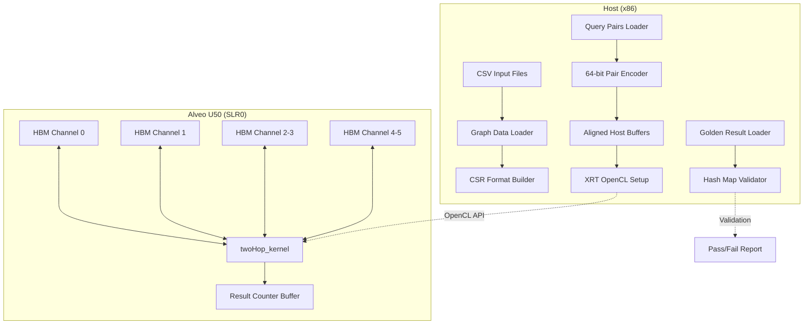

# twohop_pattern_benchmark 模块技术深度解析

## 一句话概述

`twohop_pattern_benchmark` 是一个基于 Xilinx FPGA（Alveo U50）的两跳图模式匹配加速基准测试模块。它通过 FPGA 内核计算图中给定顶点对的共同邻居数量（即两跳路径数），解决了大规模图分析中邻域交集计算的高带宽需求问题。

---

## 问题空间与设计动机

### 什么是"两跳模式"？

在社交网络的图表示中，用户是顶点，关系是边。**两跳模式（Two-Hop Pattern）** 指的是形如 `A → B → C` 的路径模式——即顶点 A 和 C 之间存在一个共同邻居 B。这种模式的计数在以下场景中至关重要：

- **好友推荐**："你可能认识的人"通常是与你二度相连的用户
- **链接预测**：预测图中未来可能形成的边
- **社区发现**：识别紧密连接的顶点群

### 计算瓶颈在哪里？

对于给定的顶点对 `(src, dst)`，两跳计数的本质是计算两个邻接表的交集大小：

$$
\text{count}(src, dst) = |\text{Neighbors}(src) \cap \text{Neighbors}(dst)|
$$

在 CPU 上执行这一计算的挑战在于：

1. **内存带宽瓶颈**：图数据通常达到数十 GB，随机访问邻接表导致严重的 Cache Miss
2. **不规则并行性**：不同顶点的度数差异巨大（幂律分布），导致 SIMD 效率低下
3. **延迟敏感**：每次邻接表查找都依赖于前一次的内存加载，形成长依赖链

### FPGA 加速的核心价值

FPGA 通过以下方式解决上述问题：

- **高带宽存储器访问**：Alveo U50 的 HBM（High Bandwidth Memory）提供超过 400 GB/s 的带宽，允许同时读取多个邻接表
- **自定义数据路径**：内核可直接实现"读取邻接表 → 哈希/排序 → 交集计数"的流水线，无需通用 CPU 的指令开销
- **确定性延迟**：硬件流水线的确定性延迟使得大规模并行查找成为可能

---

## 架构总览与数据流

### 整体架构



### 核心组件

| 组件 | 角色 | 关键职责 |
|------|------|----------|
| `conn_u50.cfg` | 硬件连接配置 | 定义内核端口到 HBM 通道的映射、SLR 放置约束 |
| `host/main.cpp` | 主机控制器 | 图数据加载、OpenCL 运行时管理、结果验证 |
| `twoHop_kernel` (RTL/HLS) | FPGA 加速内核 | 执行实际的邻接表交集计算（不在本模块源码中，仅通过 xclbin 调用） |

### 数据流详解

#### 1. 图数据加载阶段（Host CPU）

```
offset.csv ──► offset32[] (CSR 行指针)
index.csv ──► index32[]  (CSR 列索引) 
pair.csv ──► pair[]    (64-bit 编码查询对)
```

- **CSR 格式**：标准的压缩稀疏行格式，`offset32[i]` 到 `offset32[i+1]-1` 存储了顶点 `i` 的所有邻居在 `index32` 中的索引
- **顶点编码**：输入文件使用 **1-based 索引**（图文件惯例），但内核期望 **0-based**，因此 `main.cpp` 中进行 `-1` 转换：`tmp64.range(63, 32) = src - 1`

#### 2. 内存映射与 HBM 分配

```cpp
// HBM 通道分配策略
mext_o[0] = {0|XCL_MEM_TOPOLOGY, pair, 0};           // HBM0: 查询对
mext_o[1] = {1|XCL_MEM_TOPOLOGY, cnt_res, 0};       // HBM1: 结果
mext_o[2] = {2|XCL_MEM_TOPOLOGY, offset32, 0};       // HBM2: CSR 行指针
mext_o[3] = {3|XCL_MEM_TOPOLOGY, index32, 0};        // HBM3: CSR 列索引
mext_o[4] = {4|XCL_MEM_TOPOLOGY, offset32, 0};       // HBM4: CSR 行指针（重复）
mext_o[5] = {5|XCL_MEM_TOPOLOGY, index32, 0};        // HBM5: CSR 列索引（重复）
```

**关键设计决策**：

- **6 独立 HBM 通道**：U50 的 HBM 被物理分区为 32 个 256MB 通道，本设计使用 0-5 通道实现 **并行数据通路**
- **数据重复**：`offset32` 和 `index32` 被映射到两组 HBM 通道（2/3 和 4/5），这支持内核内部的双端口并行读取，允许同时查询两个顶点的邻接表而无需仲裁竞争
- **零拷贝**：`CL_MEM_USE_HOST_PTR` 标志表示使用主机页对齐内存，避免数据复制，但要求内核对 HBM 进行 DMA 传输

#### 3. 内核执行流水线

```
[Host Write] → [Kernel Execution] → [Host Read]
     ↑                ↓                  ↑
   events_write   events_kernel      events_read
```

- **事件链式依赖**：`events_write[0]` 作为 `enqueueTask` 的依赖，确保数据写入 HBM 完成后内核才启动；`events_kernel[0]` 作为读回的依赖，确保计算完成才读取结果
- **双缓冲队列**：`CL_QUEUE_OUT_OF_ORDER_EXEC_MODE_ENABLE` 允许命令队列重排，但本实现通过显式事件依赖强制顺序执行，确保正确性

#### 4. 结果验证

```cpp
// Golden Hash Map: (src<<32 | dst) → expected_count
std::unordered_map<unsigned long, float> goldenHashMap;

// Result Hash Map from FPGA output
std::unordered_map<unsigned long, float> resHashMap;

// Pairwise comparison with detailed error reporting
```

- **64-bit 键编码**：使用 `(src << 32) | dst` 将有序对编码为唯一键，支持快速哈希查找
- **完整性检查**：首先比较哈希表大小，检测缺失的查询对
- **精确错误定位**：错误消息精确到具体顶点对和计数值，支持调试数据路径问题

---

## 关键设计决策与权衡

### 1. HBM 多通道并行 vs. 单通道简化

**选择**：使用 6 个 HBM 通道，并对 CSR 数据进行复制映射

**权衡分析**：

| 维度 | 多通道方案（本设计） | 单通道方案（假设） |
|------|---------------------|-------------------|
| **带宽** | 6× 并行带宽，理论 480GB/s+ | 受限于单通道 ~40GB/s |
| **资源** | 消耗更多 HBM 控制器和 routing 资源 | 最小化 HBM 使用 |
| **复杂度** | 需要处理多端口仲裁和数据一致性 | 简单线性访问 |
| **可扩展性** | 支持双查询并行（offset/index 双份） | 串行处理 |

**为什么这样选**：两跳模式的核心操作是读取两个顶点的邻接表并求交集，这需要对 `offset` 和 `index` 数组进行两次独立随机访问。通过将 CSR 数据映射到两组 HBM 通道（2/3 和 4/5），内核可以实现真正的双端口读取，避免读取竞争，这对于实现低延迟的邻域交集至关重要。

### 2. 主机端数据预处理 vs. 设备端实时解析

**选择**：主机端读取 CSV 文件，构建 CSR 数组，分配页对齐内存，然后传输到 HBM

**权衡分析**：

- **主机端预处理**：
  - 优势：可以使用标准 C++ I/O 和字符串处理；易于调试和验证数据格式
  - 劣势：增加主机内存占用和预处理延迟；需要额外的数据拷贝（CSV → CSR → HBM）
  
- **设备端解析**（假设）：
  - 优势：减少主机侧延迟，直接从存储流式传输原始字节到 FPGA
  - 劣势：FPGA 逻辑复杂度高（需要实现 CSV 解析器、字符串转整数等）；难以处理格式错误

**为什么这样选**：图数据集通常以 CSR 二进制格式或文本格式分发，预处理一次可重复使用。FPGA 的逻辑资源应专注于核心图算法（交集计算），而非通用解析。此外，CSR 格式显著压缩了图数据（仅存储非零边），减少了 FPGA 的存储压力。

### 3. 批量查询 vs. 流式单查询

**选择**：批量读取所有查询对到 HBM，启动单次内核执行，批量返回结果

**权衡分析**：

- **批量查询**：
  - 优势：摊销内核启动开销；最大化数据局部性；简化同步模型
  - 劣势：需要预先知道所有查询；延迟较高（必须等待所有完成）
  
- **流式查询**（假设）：
  - 优势：低延迟（首个结果快速返回）；支持动态查询流
  - 劣势：内核启动开销占比高；需要复杂的流水线控制和反压机制

**为什么这样选**：两跳模式通常用于离线分析或批量推荐生成，而非实时交互式查询。批量处理允许内核高效利用 HBM 带宽，一次性读取大量邻接表数据。内核启动的开销（通常 1-10ms）在批量处理数百万查询时可以被忽略。

### 4. 精确验证 vs. 统计采样

**选择**：与 Golden 文件进行逐对精确比较，生成详细的错误报告

**权衡分析**：

- **精确验证**：
  - 优势：100% 保证正确性；错误的精确定位便于调试
  - 劣势：需要预计算 Golden 结果（可能耗时）；验证过程本身消耗时间
  
- **统计采样**（假设）：
  - 优势：快速验证；适合大规模回归测试
  - 劣势：可能遗漏边缘情况错误；置信度取决于样本大小

**为什么这样选**：图算法内核复杂且数据相关性强，微小的位错误都可能导致完全不同的结果（计数错误）。精确验证确保内核在各种图结构（幂律分布、稠密子图等）上的正确性。此外，详细的错误报告（具体到顶点对）对于调试 FPGA 数据路径问题（如 HBM 访问冲突、时序违例）至关重要。

---

## 依赖关系与系统集成

### 上游依赖（输入）

| 依赖模块 | 关系类型 | 数据契约 | 说明 |
|---------|---------|---------|------|
| `graph.L2.benchmarks.twoHop.conn_u50.cfg` | 包含 | XCL 配置文件 | 定义内核连接性，本模块直接使用 |
| `twoHop_kernel` (外部 RTL/HLS) | 运行时依赖 | XCLBIN 二进制 | 实际计算内核，编译时独立，运行时通过 xclbin 加载 |
| `xcl2` (Xilinx XRT) | 库依赖 | OpenCL 扩展 API | 用于设备管理和内存映射 |
| `xf::common::utils_sw::Logger` | 库依赖 | 日志 API | 测试通过/失败报告 |

### 下游消费（输出）

本模块是终端应用层，不直接为其他模块提供 API。其输出是：
- 控制台日志（测试通过/失败）
- 返回码（0 表示成功，非零表示失败）

### 横向关联（同级模块）

| 关联模块 | 关系 | 说明 |
|---------|------|------|
| `triangle_count_benchmarks` | 同级图模式 | 同属于 [L2 Graph Patterns](graph-analytics-and-partitioning-l2-graph-patterns-and-shortest-paths-benchmarks.md)，共享类似的 CSR 输入格式和 HBM 连接模式 |
| `shortest_path_float_pred_benchmark` | 同级图算法 | 共享主机端 OpenCL 基础设施和 XRT 运行时 |
| `pagerank_base_benchmark` | 同级图分析 | 可参考其主机代码设计模式，尽管算法不同 |

---

## 使用指南与操作实务

### 输入数据格式

模块期望四种输入文件，均为文本 CSV 格式：

1. **Offset 文件** (`--offset`)：CSR 格式的行指针数组
   ```
   numVertices numVertices  # 首行：顶点数（重复两次，可能是对齐格式）
   0                          # 顶点 0 的边起始偏移
   12                         # 顶点 1 的边起始偏移
   25                         # 顶点 2 的边起始偏移
   ...
   ```

2. **Index 文件** (`--index`)：CSR 格式的列索引数组（带权重，权重被忽略）
   ```
   numEdges                   # 首行：边数
   5 1.0                      # 边目标顶点 5，权重 1.0（权重被解析但丢弃）
   8 1.0
   ...
   ```

3. **Pair 文件** (`--pair`)：待查询的顶点对列表
   ```
   numPairs                   # 首行：查询对数
   1 10                       # 查询顶点 1 到顶点 10 的两跳计数
   5 20
   ...
   ```
   **注意**：文件使用 1-based 顶点索引，但 FPGA 内核期望 0-based。主机代码自动执行 `-1` 转换。

4. **Golden 文件** (`--golden`)：预期的两跳计数结果，用于验证
   ```
   1,10,5                     # 源顶点 1，目标顶点 10，期望计数 5
   5,20,3
   ...
   ```

### 运行命令示例

```bash
# 设置 XCLBIN 路径和输入数据路径
export XCLBIN=./twoHop_kernel.xclbin
export DATA_DIR=./datasets/twitter

# 运行基准测试
./twohop_benchmark \
    -xclbin $XCLBIN \
    --offset $DATA_DIR/offset.txt \
    --index $DATA_DIR/index.txt \
    --pair $DATA_DIR/pairs.txt \
    --golden $DATA_DIR/golden.txt
```

### 输出解读

成功运行的控制台输出：
```
---------------------Two Hop-------------------
Found Device=xilinx_u50_gen3x16_xdma_201920_3
kernel has been created
kernel start------
kernel end------
============================================================
-------------------Test PASS------------------
```

失败时的典型错误：
```
ERROR: incorrect count! golden_src: 1 golden_des: 10 golden_res: 5 cnt_src: 1 cnt_des: 10 cnt_res: 3
-------------------Test FAIL------------------
```

### 性能调优参数

虽然主机代码中的大部分参数是固定的，但理解以下配置有助于性能调优：

1. **HBM 通道分配**：当前配置使用 6 个 HBM 通道（0-5）。如果图数据集较小，可以减少通道数以降低资源占用；如果需要更高带宽，可以扩展到 U50 支持的 32 个通道。

2. **批量大小**：当前实现将所有查询对一次性加载到 HBM。如果查询对数量巨大（超过 HBM 容量），需要修改代码实现分页批处理。

3. **内核流水线深度**：虽然主机代码不可见，但 `twoHop_kernel` 内部可能有 `DATAFLOW` 或 `PIPELINE` 指令。主机端的缓冲区大小和事件同步策略需要与内核的流水线深度匹配以避免欠流/溢出。

---

## 子模块索引

本模块包含以下子模块，各子模块的详细文档链接如下：

| 子模块 | 文件路径 | 职责描述 | 文档链接 |
|--------|----------|----------|----------|
| `kernel_connectivity` | `graph/L2/benchmarks/twoHop/conn_u50.cfg` | Alveo U50 平台的内核连接性配置，定义 HBM 端口映射和 SLR 放置 | [详细文档](graph_analytics_and_partitioning-l2_graph_patterns_and_shortest_paths_benchmarks-twohop_pattern_benchmark-kernel_connectivity.md) |
| `host_benchmark` | `graph/L2/benchmarks/twoHop/host/main.cpp` | 主机端基准测试控制器，负责图数据加载、OpenCL 运行时管理、结果验证 | [详细文档](graph_analytics_and_partitioning-l2_graph_patterns_and_shortest_paths_benchmarks-twohop_pattern_benchmark-host_benchmark.md) |

---

## 常见陷阱与调试指南

### 1. 顶点索引越界（1-based vs 0-based）

**问题**：输入图文件使用 1-based 索引（顶点编号从 1 开始），但内部计算和内核通常使用 0-based。

**代码中的处理**：
```cpp
// 从 pair 文件读取的 src/des 是 1-based
data >> src;
tmp64.range(63, 32) = src - 1;  // 转换为 0-based
data >> des;
tmp64.range(31, 0) = des - 1;
```

**陷阱**：如果手动构造输入文件，容易混淆索引基准，导致内核访问越界（HBM 访问越界通常不会立即崩溃，但会返回垃圾数据）。

### 2. HBM 通道映射不匹配

**问题**：`conn_u50.cfg` 中定义的 `sp=twoHop_kernel.m_axi_gmemX:HBM[X]` 必须与主机代码中的 `mext_o[]` 通道索引严格一致。

**代码对应关系**：
- `cfg` 中的 `HBM[0]` 对应 `mext_o[0]` 的 `(unsigned int)(0)`
- 如果 cfg 中将 `gmem0` 映射到 `HBM[1]`，而代码中仍用 `0`，会导致内核从错误的内存区域读取

**调试建议**：如果出现结果全零或随机错误，首先检查 XRT 日志中的内存映射是否匹配。

### 3. 内存对齐要求

**问题**：XRT 的零拷贝缓冲区要求主机内存页对齐（通常 4KB）。

**代码中的保证**：
```cpp
unsigned* offset32 = aligned_alloc<unsigned>(numVertices + 1);
// 使用 aligned_alloc 确保页对齐
```

**陷阱**：如果使用普通的 `malloc` 或 `new`，`CL_MEM_USE_HOST_PTR` 可能失败或隐式创建拷贝缓冲区，降低性能且增加内存占用。

### 4. OpenCL 事件链依赖

**问题**：本模块使用显式事件依赖确保执行顺序（Write → Kernel → Read），但 OpenCL 的异步性质容易引入竞态条件。

**代码中的依赖链**：
```cpp
// 1. 写入数据，生成 events_write[0]
q.enqueueMigrateMemObjects(ob_in, 0, nullptr, &events_write[0]);

// 2. 内核依赖 events_write，生成 events_kernel[0]
q.enqueueTask(twoHop, &events_write, &events_kernel[0]);

// 3. 读取依赖 events_kernel，生成 events_read[0]
q.enqueueMigrateMemObjects(ob_out, 1, &events_kernel, &events_read[0]);
```

**陷阱**：如果错误地传递空指针作为依赖列表（`nullptr`），可能导致内核在数据传输完成前启动，产生竞态结果。

### 5. Golden 文件格式不匹配

**问题**：验证阶段期望 Golden 文件使用逗号分隔的 `src,des,count` 格式，但实际使用空格分隔的流解析。

**代码中的解析逻辑**：
```cpp
// 读取行后，将逗号替换为空格
std::replace(str.begin(), str.end(), ',', ' ');
std::stringstream data(str.c_str());
// 然后使用 >> 提取
```

**陷阱**：如果 Golden 文件使用其他分隔符（如制表符），或者包含额外的空格，解析可能失败或产生错误数据。建议使用严格的 CSV 解析库替代手工字符串处理。

---

## 扩展与维护建议

### 添加新的图数据集支持

1. **数据预处理**：将原始边列表转换为 CSR 格式的 `offset.txt` 和 `index.txt`
2. **查询对生成**：根据需求生成 `pair.txt`（可以是随机采样、特定模式或全对）
3. **Golden 生成**：使用可信的 CPU 实现（如 NetworkX）计算期望的两跳计数以生成 `golden.txt`

### 移植到新的 Alveo 平台

1. **修改 `conn_u50.cfg`**：
   - 如果是 U200/U250，可能需要将 `HBM` 替换为 `DDR`
   - 调整 `slr=` 以匹配目标平台的 SLR 布局
2. **调整 HBM 通道数**：如果目标平台的 HBM 通道数不同，需要修改 `mext_o[]` 的通道索引
3. **重新编译内核**：使用 Vitis 针对新平台重新编译 `twoHop_kernel` 并生成新的 `xclbin`

### 性能剖析与优化

当前代码注释掉了详细的性能计时打印（`events_write`/`events_kernel`/`events_read` 的 profiling 信息）。要启用详细性能分析：

1. 取消 `main.cpp` 中计时打印代码的注释
2. 重新编译主机代码
3. 运行测试，观察各阶段（PCIe 写、内核执行、PCIe 读）的时间占比
4. 根据瓶颈调整策略：
   - 如果 PCIe 写占比高：考虑数据压缩或零拷贝优化
   - 如果内核执行占比高：检查 HBM 带宽利用率，可能需要增加内核并行度
   - 如果 PCIe 读占比高：考虑异步结果读取或批处理更大的查询集

---

## 总结

`twohop_pattern_benchmark` 模块展示了如何将图分析中的**内存带宽瓶颈问题**转化为**FPGA 高带宽存储架构优势**的典型设计。其核心思想是：

1. **数据局部性重构**：通过 CSR 格式压缩图数据，并通过 HBM 多通道并行读取最大化带宽利用率
2. **计算卸载**：将邻接表交集这一计算密集但规则的操作卸载到 FPGA，主机专注于数据 I/O 和验证
3. **确定性执行模型**：通过 OpenCL 事件链和显式内存迁移，确保主机和 FPGA 之间的数据一致性

对于新加入团队的开发者，理解本模块的关键在于把握**"主机-设备数据流"**和**"HBM 多通道并行架构"**这两个核心概念。所有代码——从 CSV 解析到 64 位顶点对编码，从 `aligned_alloc` 到 `enqueueMigrateMemObjects`——都是围绕这两个概念服务于最终的两跳计数目标。
