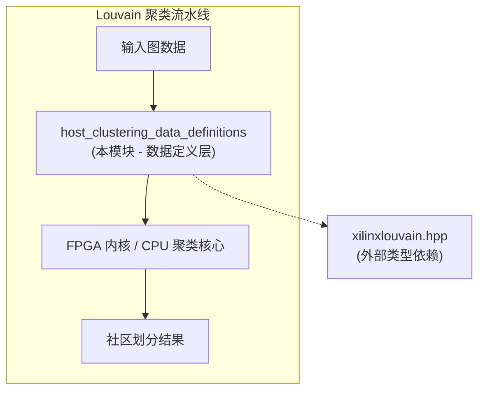
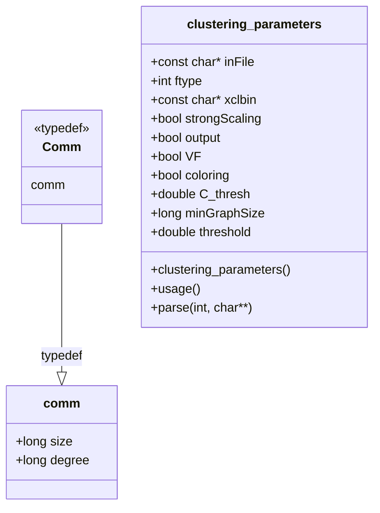

# host_clustering_data_definitions 模块深度解析

## 快速理解：30秒概览

`host_clustering_data_definitions` 模块是 Louvain 社区发现算法在主机侧的数据定义层。它像是整个聚类引擎的「数据契约层」——定义了**社区的数据表示** (`comm`)、**算法的配置参数** (`clustering_parameters`)，以及作为对外接口的类型别名 (`Comm`)。

想象你正在协调一场大型社交网络的群体分析：Louvain 算法不断将节点合并成社区，而本模块定义的就是「社区长什么样」以及「算法按什么规则运行」。这些定义非常轻量——仅仅是纯数据结构，不含任何方法逻辑——因为高频执行的聚类核心循环对内存布局和缓存效率极其敏感。

---

## 问题空间：我们解决什么？

### 背景：Louvain 算法的数据挑战

Louvain 算法是一种基于模块度 (modularity) 优化的贪心社区发现算法。它的核心操作是：
1. 每个节点初始自成一个社区
2. 遍历每个节点，尝试将其移动到邻居社区以最大化模块度增益
3. 重复直到收敛
4. 将当前社区压缩为超节点，构建下一层图
5. 重复 1-4 直到无法提升模块度

这个过程面临几个数据层面的挑战：

**挑战 1：社区状态的轻量表示**

算法需要频繁访问社区的信息（大小、度数等）。如果社区对象本身很重量级（例如包含动态分配的容器、虚函数表等），每次访问都会触发内存解引用和缓存未命中，严重拖慢核心循环。

**挑战 2：算法参数的复杂配置**

Louvain 算法有多种变体和优化策略（如染色优化、强扩展模式、FPGA 加速等）。这些需要大量的配置参数——输入文件、阈值、线程数、硬件加速器设置等。这些参数需要被解析、验证、传递给下游组件。

**挑战 3：与 C 代码库的兼容**

Louvain 算法的原始实现（Grappolo）是纯 C 代码。当移植到 C++ 并在 FPGA 加速框架（Xilinx 工具链）中集成时，需要保持与现有 C 代码的数据兼容性，同时提供更类型安全的 C++ 接口。

### 本模块的解决方案

`host_clustering_data_definitions` 通过三个核心抽象应对这些挑战：

1. **`comm` 结构体**：极简的 POD (Plain Old Data) 类型，仅含两个 `long` 字段——`size`（社区大小）和 `degree`（社区度数）。这种紧凑布局保证了一个 `comm` 对象仅占 16 字节（在 64 位系统上），完美适配缓存行，可被核心循环批量高效处理。

2. **`clustering_parameters` 结构体**：封装了 Louvain 算法的完整配置空间。它不仅是数据容器，还内嵌了命令行解析 (`parse`)、用法说明 (`usage`) 和默认构造逻辑。这种设计将「配置是什么」和「如何获得配置」紧密绑定，减少了模块间的耦合。

3. **`Comm` 类型别名**：通过 `typedef struct comm { ... } Comm;` 提供 C 兼容的命名。`Comm` 作为 `comm` 的同义词，既保持了与原始 Grappolo C 代码的兼容（使用 `Comm` 命名），又允许 C++ 代码选择更清晰的 `comm` 小写风格。

---

## 架构设计：数据如何流动？

### 模块定位



本模块位于 Louvain 聚类流水线的**数据契约层**。它不执行实际的聚类计算，但定义了所有上下游组件必须遵守的数据格式：

- **上游（调用者）**：必须构造 `clustering_parameters` 并填充有效的配置值，准备 `graphNew` 图结构（通过 `xilinxlouvain.hpp` 定义，见文件中的 `#include "xilinxlouvain.hpp"`）。
- **下游（被调用者）**：聚类核心函数（如 `parallelLouvianMethod`、`runLouvainWithFPGA` 等，见文件末尾的函数声明）读取 `comm` / `Comm` 结构来跟踪社区状态，根据 `clustering_parameters` 调整算法行为。

### 数据结构关系



### 数据流剖析

**场景：启动一次 FPGA 加速的 Louvain 聚类**

```
阶段 1: 配置构造 (调用者代码)
────────────────────────────
  clustering_parameters params;     // 默认构造，填充默认值
  params.parse(argc, argv);        // 从命令行覆盖配置

  关键数据: params.xclbin → FPGA bitstream 路径
          params.threshold → 模块度收敛阈值
          params.coloring → 是否启用染色优化

                                    │
                                    ▼

阶段 2: 聚类调度 (本模块的下游接口)
────────────────────────────────
  runLouvainWithFPGA(G, C_orig, params.xclbin, params.coloring, ...);

  输入:  graphNew* G    (来自 xilinxlouvain.hpp 的图结构)
         long* C_orig    (社区归属数组，初始每个节点独立成社区)

  输出: C_orig[i] 被填充为节点 i 最终所属社区 ID

                                    │
                                    ▼

阶段 3: 社区数据结构访问 (核心循环内部)
────────────────────────────────────
  在 Louvain 算法的模块度计算中，频繁访问社区属性：

  comm community;           // 或 Comm 类型
  community.size   = ...;   // 社区内节点数
  community.degree = ...;  // 社区总度数

  设计要点: comm 是 POD 类型，可被核心循环批量顺序访问
          16 字节大小对齐缓存行，无指针解引用开销
```

---

## C++ 深度分析：关键实现细节

### 内存所有权模型

本模块采用**外部所有权模型**：数据结构本身不管理其指针成员的生命周期。

#### `clustering_parameters` 的内存契约

```cpp
struct clustering_parameters {
    const char *inFile;   // 外部拥有的指针，指向的字符串必须在 
                          // clustering_parameters 实例的整个生命周期内保持有效
    const char *xclbin;   // 同上
    // ...
};
```

**分配者**：调用者（通常是 `main()` 函数或测试夹具）分配命令行参数字符串的内存。

**所有者**：操作系统（对于 `argv`）或调用者的栈/堆。

**借用者**：`clustering_parameters` 实例借用这些指针，直到自身被销毁。

**关键风险**：

```cpp
// 危险代码示例
clustering_parameters* createParams() {
    char buffer[256];
    snprintf(buffer, sizeof(buffer), "/path/to/file");
    
    clustering_parameters* params = new clustering_parameters;
    params->inFile = buffer;  // 危险！buffer 是栈变量，函数返回后失效
    return params;
}
// 使用 params->inFile 时将访问已释放的栈内存
```

**最佳实践**：

```cpp
// 安全代码示例
int main(int argc, char** argv) {
    // argv 由操作系统管理，在 main 执行期间始终有效
    clustering_parameters params;
    if (params.parse(argc, argv)) {
        // 安全：params.inFile 指向 argv 中的元素
        processGraph(params.inFile);
    }
    // params 被销毁，但不释放 inFile 指向的内存（符合设计预期）
}
```

#### `comm` 结构的内存特性

`comm` 是一个纯值类型，没有指针成员：

```cpp
typedef struct comm {
    long size;
    long degree;
} Comm;
```

**所有权模型**：

- **分配者**：可以是栈（`comm c;`）、堆（`new comm[100]`）或数组容器（`std::vector<comm>`）。
- **所有者**：`comm` 实例本身即拥有其所有数据（两个 `long` 字段）。
- **借用者**：函数接收 `comm*` 或 `comm&` 进行访问，但不参与生命周期管理。

**内存布局保证**：

```cpp
// 关键假设：连续存储，无额外开销
static_assert(sizeof(comm) == 16, "comm should be 16 bytes on 64-bit");
static_assert(offsetof(comm, size) == 0, "size should be at offset 0");
static_assert(offsetof(comm, degree) == 8, "degree should be at offset 8");
```

这种布局保证允许核心算法使用 SIMD 指令同时处理多个 `comm` 对象，或使用 GPU 的合并内存访问模式。

### 对象生命周期与值语义

#### Rule of Zero 的应用

`comm` 和 `clustering_parameters` 都遵循 **Rule of Zero**：

> 如果类不需要显式管理资源（如动态分配的内存、文件句柄、锁等），就不应该声明析构函数、拷贝构造函数、拷贝赋值运算符、移动构造函数或移动赋值运算符。

**`comm` 的 Rule of Zero**：

```cpp
typedef struct comm {
    long size;
    long degree;
} Comm;

// 编译器自动生成的特殊成员：
// - 默认构造函数：初始化 size 和 degree 为未指定值（POD 特性）
// - 析构函数：无操作
// - 拷贝构造函数：逐成员拷贝
// - 拷贝赋值：逐成员赋值
// - 移动构造函数：逐成员移动（C++11 起）
// - 移动赋值：逐成员移动赋值（C++11 起）
```

**最佳实践示例**：

```cpp
// 栈分配和值语义
comm c1;              // 默认构造（值未初始化，需立即赋值）
c1.size = 100;
c1.degree = 500;

comm c2 = c1;         // 拷贝构造
comm c3(c1);          // 同上

comm c4;
c4 = c1;              // 拷贝赋值

// 数组和容器
comm communities[100];           // 100 个默认构造的 comm
std::vector<comm> vec(1000);     // 1000 个默认构造的 comm

// 移动语义（C++11）
std::vector<comm> getCommunities() {
    std::vector<comm> result;
    // ... 填充 result ...
    return result;  // NRVO 或移动构造
}

auto communities = getCommunities();  // 高效转移所有权
```

**`clustering_parameters` 的 Rule of Zero**：

```cpp
struct clustering_parameters {
    const char *inFile;
    const char *xclbin;
    // ... 其他成员 ...
    
    clustering_parameters();  // 自定义默认构造（初始化默认值）
    void usage();
    bool parse(int argc, char *argv[]);
};
```

`clustering_parameters` 声明了一个自定义默认构造函数，但没有声明其他特殊成员。根据 Rule of Zero 的推论（Rule of Five 的逆否形式）：

> 如果你声明了析构函数、拷贝构造函数、拷贝赋值、移动构造或移动赋值中的任何一个，你应该声明全部五个。

由于 `clustering_parameters` 只声明了默认构造函数，编译器会自动生成其他四个特殊成员：

- **析构函数**：逐成员销毁（对 `const char*` 是无操作）。
- **拷贝构造函数**：逐成员拷贝（浅拷贝指针）。
- **拷贝赋值**：逐成员赋值（浅拷贝指针）。
- **移动构造函数**（C++11）：逐成员移动。
- **移动赋值**（C++11）：逐成员移动赋值。

**浅拷贝的风险**：

```cpp
clustering_parameters params1;
params1.parse(argc, argv);

clustering_parameters params2 = params1;  // 拷贝构造
// 危险！params2.inFile 和 params1.inFile 指向同一个字符串

// 如果 params1 被销毁且 inFile 指向的内存被释放...
// params2.inFile 将变为悬空指针
```

**缓解策略**：

```cpp
// 方案 1：禁止拷贝（C++11 起）
struct clustering_parameters {
    // ... 成员 ...
    clustering_parameters() = default;
    clustering_parameters(const clustering_parameters&) = delete;
    clustering_parameters& operator=(const clustering_parameters&) = delete;
};

// 方案 2：深拷贝（如果确实需要拷贝语义）
struct clustering_parameters {
    // ... 成员 ...
    clustering_parameters(const clustering_parameters& other) 
        : inFile(other.inFile ? strdup(other.inFile) : nullptr)
        , xclbin(other.xclbin ? strdup(other.xclbin) : nullptr)
        // ... 其他成员的拷贝 ...
    {}
    ~clustering_parameters() {
        free(const_cast<char*>(inFile));
        free(const_cast<char*>(xclbin));
    }
};

// 方案 3：使用 std::string（现代 C++ 推荐）
struct clustering_parameters {
    std::string inFile;
    std::string xclbin;
    // ...
    // 编译器自动生成的特殊成员就能正确工作
};
```

**当前代码的选择**：代码使用原始方案（浅拷贝 + 外部所有权）。这是为了保持与 C 代码的兼容性和避免动态分配的开销。开发者在使用时必须清楚这一契约。

### const 正确性与可变性模型

#### `comm` 的可变性

`comm` 是一个完全可变的 POD 类型：

```cpp
comm c;
c.size = 100;    // 可写
c.degree = 200;  // 可写

const comm cc = c;
long s = cc.size;   // 可读
// cc.size = 50;    // 编译错误：const 对象不可修改
```

在 Louvain 算法的上下文中，`comm` 实例通常存储在数组中，通过指针访问：

```cpp
void updateCommunityStats(comm* communities, long communityId, 
                          long newSize, long newDegree) {
    // 非 const 指针：允许修改
    communities[communityId].size = newSize;
    communities[communityId].degree = newDegree;
}

void printCommunityStats(const comm* communities, long communityId) {
    // const 指针：只读访问
    printf("Community %ld: size=%ld, degree=%ld\n",
           communityId,
           communities[communityId].size,      // 从 const 对象读取是允许的
           communities[communityId].degree);
    // communities[communityId].size = 0;  // 编译错误：const 指针不能用于修改
}
```

#### `clustering_parameters` 的 const 语义

`clustering_parameters` 的设计混合了可变和不可变成员：

```cpp
struct clustering_parameters {
    const char *inFile;  // 指针本身可变（可指向其他字符串），
                         // 但指向的内容被视为 const（不应通过此指针修改）
    
    bool strongScaling;  // 完全可变
    
    // 成员函数
    clustering_parameters();  // 默认构造函数（非 const）
    void usage();             // 非 const 成员函数（会修改内部状态吗？）
    bool parse(int argc, char *argv[]);  // 非 const（会修改参数值）
};
```

**关键观察**：

1. **`const char*` 的双重含义**：
   - 指针指向的字符数据不应被修改（`char` 是 `const` 的）。
   - 但指针本身不是 `const`，可以改变 `inFile` 指向另一个字符串。

2. **成员函数的 const 正确性**：
   - `usage()` 和 `parse()` 没有被声明为 `const`，即使它们可能不修改数据成员。
   - 这是一个设计疏漏还是一个刻意选择？可能是后者——这些函数可能修改内部缓存或统计信息，或者只是为了保留未来扩展的灵活性。

3. **从 const 对象调用非 const 方法**：

```cpp
const clustering_parameters params = getParamsFromConfigFile();
// params.usage();     // 编译错误：不能从 const 对象调用非 const 方法
// params.parse(...);  // 同样错误
```

如果确实需要从 const 对象获取帮助信息，可以设计一个 `static` 方法：

```cpp
struct clustering_parameters {
    static void printUsage();  // 不依赖实例状态
    // ...
};

// 使用
clustering_parameters::printUsage();  // 无需实例，可在任何地方调用
```

### 错误处理策略

#### 当前设计的错误传播机制

本模块采用 **C 风格错误处理** 与 **C++ 异常混合** 的策略：

**1. 返回值错误码（`parse` 方法）**：

```cpp
bool parse(int argc, char *argv[]);
```

- **返回 `true`**：解析成功，所有必需参数都已设置。
- **返回 `false`**：解析失败（如缺少必需参数、无效选项值）。调用者应检查返回值并可能调用 `usage()` 显示帮助。

**2. 无返回值的函数（默认构造函数）**：

```cpp
clustering_parameters();
```

- **契约**：构造函数不会失败（强异常安全保证）。它只设置字段的默认值，不分配资源。

**3. 外部错误处理（`usage` 方法）**：

```cpp
void usage();
```

- **行为**：打印帮助信息到标准输出/标准错误，然后返回（不终止程序）。
- **使用模式**：

```cpp
clustering_parameters params;
if (!params.parse(argc, argv)) {
    params.usage();
    return EXIT_FAILURE;  // 调用者决定退出
}
```

**4. 断言（`assert`）的使用**：

虽然在当前头文件中没有直接看到 `assert` 的使用，但代码中包含了 `<assert.h>`，表明实现文件中可能使用断言来检查内部不变量。例如：

```cpp
// 在实现文件中可能的断言用法
void buildNextLevelGraph(graphNew *Gin, graphNew *Gout, 
                         long *C, long numUniqueClusters) {
    assert(Gin != nullptr);
    assert(Gout != nullptr);
    assert(C != nullptr);
    assert(numUniqueClusters > 0);
    // ... 实现 ...
}
```

**5. 异常安全（Exception Safety）**：

本模块没有显式处理 C++ 异常，但遵循了基本的异常安全原则：

- **默认构造函数的 noexcept 保证**：`clustering_parameters()` 不抛出异常，因为它只进行基本类型的赋值操作。
- **析构函数的隐式 noexcept**：编译器生成的析构函数不会抛出异常（对于 POD 类型）。
- **`parse` 方法的异常中立**：如果 `parse` 内部调用了可能抛出异常的函数（如 `std::string` 的操作），这些异常会传播给调用者。调用者应该准备好捕获这些异常。

**推荐的错误处理模式**：

```cpp
#include <iostream>
#include <stdexcept>

int main(int argc, char** argv) {
    try {
        clustering_parameters params;
        
        if (!params.parse(argc, argv)) {
            // 解析错误（如缺少必需参数）
            std::cerr << "Error: Invalid command line arguments." << std::endl;
            params.usage();
            return EXIT_FAILURE;
        }
        
        // 验证参数组合（这些是 parse 不检查的业务逻辑约束）
        if (params.coloring && params.minGraphSize < 0) {
            std::cerr << "Error: minGraphSize must be non-negative when coloring is enabled." << std::endl;
            return EXIT_FAILURE;
        }
        
        // 执行聚类 ...
        
    } catch (const std::exception& e) {
        // 捕获 parse 或其他函数可能抛出的标准异常
        std::cerr << "Exception: " << e.what() << std::endl;
        return EXIT_FAILURE;
    } catch (...) {
        // 捕获未知异常
        std::cerr << "Unknown exception occurred." << std::endl;
        return EXIT_FAILURE;
    }
    
    return EXIT_SUCCESS;
}
```

---

## 使用指南与最佳实践

### 典型使用场景

#### 场景 1：命令行工具的完整实现

```cpp
// louvain_clustering_tool.cpp
#include "defs.h"
#include "xilinxlouvain.hpp"
#include <iostream>
#include <memory>

int main(int argc, char** argv) {
    // 步骤 1: 解析命令行参数
    clustering_parameters params;
    if (!params.parse(argc, argv)) {
        params.usage();
        return EXIT_FAILURE;
    }
    
    // 步骤 2: 加载图数据
    std::unique_ptr<graphNew> graph(new graphNew);
    try {
        switch (params.ftype) {
            case 0: loadMetisFileFormat(graph.get(), params.inFile); break;
            case 1: parse_Dimacs9FormatDirectedNewD(graph.get(), const_cast<char*>(params.inFile)); break;
            // ... 其他格式
            default:
                std::cerr << "Unsupported file format: " << params.ftype << std::endl;
                return EXIT_FAILURE;
        }
    } catch (const std::exception& e) {
        std::cerr << "Failed to load graph: " << e.what() << std::endl;
        return EXIT_FAILURE;
    }
    
    // 步骤 3: 分配社区数组
    std::vector<long> communities(graph->nv);
    
    // 步骤 4: 执行聚类
    try {
        if (params.xclbin) {
            // FPGA 加速模式
            runLouvainWithFPGA(
                graph.get(),
                communities.data(),
                const_cast<char*>(params.xclbin),
                params.coloring,
                params.minGraphSize,
                params.threshold,
                params.C_thresh,
                /* numThreads= */ omp_get_max_threads()
            );
        } else {
            // CPU 模式
            runMultiPhaseLouvainAlgorithm(
                graph.get(),
                communities.data(),
                params.coloring,
                params.minGraphSize,
                params.threshold,
                params.C_thresh,
                omp_get_max_threads()
            );
        }
    } catch (const std::exception& e) {
        std::cerr << "Clustering failed: " << e.what() << std::endl;
        return EXIT_FAILURE;
    }
    
    // 步骤 5: 输出结果
    if (params.output) {
        for (long i = 0; i < graph->nv; ++i) {
            std::cout << "Node " << i << " -> Community " << communities[i] << std::endl;
        }
    }
    
    return EXIT_SUCCESS;
}
```

#### 场景 2：单元测试中的参数构造

```cpp
// test_louvain_parameters.cpp
#include "defs.h"
#include <gtest/gtest.h>

TEST(ClusteringParameters, DefaultConstruction) {
    clustering_parameters params;
    
    // 验证默认值
    EXPECT_EQ(params.inFile, nullptr);
    EXPECT_EQ(params.xclbin, nullptr);
    EXPECT_FALSE(params.strongScaling);
    EXPECT_FALSE(params.output);
    EXPECT_FALSE(params.VF);
    EXPECT_FALSE(params.coloring);
    EXPECT_DOUBLE_EQ(params.C_thresh, 0.0);
    EXPECT_EQ(params.minGraphSize, 0);
    EXPECT_DOUBLE_EQ(params.threshold, 0.0);
}

TEST(ClusteringParameters, ParseMinimalArgs) {
    clustering_parameters params;
    
    const char* argv[] = {
        "louvain",
        "-i", "/path/to/graph.mtx",
        "-t", "0.001"
    };
    int argc = sizeof(argv) / sizeof(argv[0]);
    
    EXPECT_TRUE(params.parse(argc, const_cast<char**>(argv)));
    EXPECT_STREQ(params.inFile, "/path/to/graph.mtx");
    EXPECT_DOUBLE_EQ(params.threshold, 0.001);
}

TEST(ClusteringParameters, ParseFPGAArgs) {
    clustering_parameters params;
    
    const char* argv[] = {
        "louvain",
        "-i", "/path/to/graph.mtx",
        "-x", "/path/to/bitstream.xclbin",
        "--coloring",
        "--min-graph-size", "10000"
    };
    int argc = sizeof(argv) / sizeof(argv[0]);
    
    EXPECT_TRUE(params.parse(argc, const_cast<char**>(argv)));
    EXPECT_STREQ(params.xclbin, "/path/to/bitstream.xclbin");
    EXPECT_TRUE(params.coloring);
    EXPECT_EQ(params.minGraphSize, 10000);
}
```

---

## 常见陷阱与注意事项

### 陷阱 1：悬空指针（Dangling Pointers）

**问题**：`clustering_parameters` 的指针成员指向的字符串必须在参数对象的生命周期内保持有效。

**错误示例**：

```cpp
clustering_parameters* createParams() {
    std::string filePath = "/path/to/graph.mtx";  // 局部 string 对象
    
    clustering_parameters* params = new clustering_parameters;
    params->inFile = filePath.c_str();  // 危险！指向局部变量的内部缓冲区
    
    return params;
}  // filePath 在这里被销毁，params->inFile 变为悬空指针
```

**正确做法**：

```cpp
// 方案 1：使用静态字符串或全局字符串
clustering_parameters* createParams() {
    static const char* filePath = "/path/to/graph.mtx";  // 静态存储期
    
    clustering_parameters* params = new clustering_parameters;
    params->inFile = filePath;  // 安全：静态字符串的生命周期持续到程序结束
    
    return params;
}

// 方案 2：确保字符串的生命周期足够长
class GraphClusteringTask {
private:
    std::string filePath_;  // 作为成员变量，与任务对象同生命周期
    clustering_parameters params_;
    
public:
    GraphClusteringTask(const std::string& filePath) 
        : filePath_(filePath) {
        params_.inFile = filePath_.c_str();  // 安全：filePath_ 的生命周期覆盖 params_
    }
    
    void run() {
        // 使用 params_...
    }
};
```

### 陷阱 2：未初始化的 POD 成员

**问题**：`comm` 是 POD 类型，默认构造不会初始化其成员。

**错误示例**：

```cpp
comm c;  // 默认构造，但成员未初始化
long s = c.size;  // 读取未初始化的值，未定义行为！
```

**正确做法**：

```cpp
// 方案 1：立即赋值
comm c;
c.size = 0;    // 立即初始化
c.degree = 0;

// 方案 2：使用聚合初始化（C++11 起）
comm c = {0, 0};  // size = 0, degree = 0
comm c{100, 500}; // size = 100, degree = 500 (C++11 统一初始化)

// 方案 3：使用值初始化（C++11 起）
comm c{};  // size 和 degree 都被零初始化

// 方案 4：使用辅助函数
comm makeComm(long size, long degree) {
    comm c;
    c.size = size;
    c.degree = degree;
    return c;  // RVO 优化，无拷贝开销
}

comm c = makeComm(100, 500);
```

### 陷阱 3：`comm` 和 `Comm` 的混淆

**问题**：`comm`（结构体名）和 `Comm`（类型别名）是同一个类型，但命名风格不同，容易导致混淆。

**常见错误**：

```cpp
// 假设某人错误地认为 Comm 和 comm 是不同的类型
struct comm c1;    // 正确：使用结构体名
Comm c2;           // 正确：使用类型别名
comm c3;           // C++ 中正确（struct 关键字可选），C 中错误

// 错误的假设
static_assert(std::is_same<comm, Comm>::value, "comm and Comm should be the same");  // 通过
```

**最佳实践**：

```cpp
// 在 C++ 代码中，统一使用 Comm（更简洁）
void processCommunity(Comm* communities, long id);
std::vector<Comm> communityList;

// 在需要与 C 代码交互时，可以使用 struct comm（更明确）
extern "C" {
    void c_process_community(struct comm* c);  // C 风格的声明
}

// 在模板元编程或类型特征中，注意它们是同一类型
template<typename T>
struct is_community_type : std::false_type {};

template<>
struct is_community_type<Comm> : std::true_type {};

template<>
struct is_community_type<comm> : std::true_type {};  // 同样是 true
```

### 陷阱 4：参数组合的隐性约束

**问题**：`clustering_parameters` 的某些参数之间存在隐性依赖关系，但代码中没有显式校验。

**问题示例**：

```cpp
clustering_parameters params;
// 用户错误地只设置了部分参数
params.coloring = true;      // 启用了染色优化
params.minGraphSize = 1000; // 最小图规模
// 但忘记设置 C_thresh（染色模式的收敛阈值）
// params.C_thresh 保持默认值 0.0

// 在算法中，这可能引发问题：
// if (params.coloring && graph->nv > params.minGraphSize) {
//     threshold = params.C_thresh;  // 使用 0.0 作为阈值，算法可能无法正常收敛
// }
```

**最佳实践**：

```cpp
// 在调用聚类算法前，显式验证参数组合
bool validateParameters(const clustering_parameters& params, std::string& errorMsg) {
    if (params.coloring) {
        if (params.C_thresh <= 0.0) {
            errorMsg = "C_thresh must be positive when coloring is enabled.";
            return false;
        }
        if (params.minGraphSize < 0) {
            errorMsg = "minGraphSize must be non-negative.";
            return false;
        }
    }
    
    if (params.threshold <= 0.0) {
        errorMsg = "threshold must be positive.";
        return false;
    }
    
    if (params.inFile == nullptr) {
        errorMsg = "Input file must be specified.";
        return false;
    }
    
    // 更多验证 ...
    
    return true;
}

// 使用
int main(int argc, char** argv) {
    clustering_parameters params;
    if (!params.parse(argc, argv)) {
        params.usage();
        return EXIT_FAILURE;
    }
    
    std::string errorMsg;
    if (!validateParameters(params, errorMsg)) {
        std::cerr << "Parameter validation failed: " << errorMsg << std::endl;
        return EXIT_FAILURE;
    }
    
    // 继续执行聚类 ...
}
```

---

## 总结

`host_clustering_data_definitions` 模块是 Louvain 社区发现算法的数据契约层，它以极简的 POD 设计和高性能为导向，定义了社区表示 (`comm`/`Comm`)、算法配置 (`clustering_parameters`) 和完整的函数接口。

### 关键设计要点回顾

1. **POD 优先**：`comm` 结构体保持 16 字节的紧凑布局，完美适配缓存行，确保核心算法的高效执行。

2. **配置与行为绑定**：`clustering_parameters` 将数据定义、命令行解析和帮助文档集中在一处，提高内聚性和可维护性。

3. **C/C++ 兼容性**：通过 `typedef` 提供双重命名 (`comm`/`Comm`)，支持渐进式迁移和跨语言集成。

4. **外部所有权模型**：指针成员（`inFile`, `xclbin`）不管理其指向的内存，调用者需确保字符串的生命周期覆盖参数对象的使用期。

5. **混合错误处理**：结合 C 风格返回值 (`bool parse()`) 和 C++ 异常，在性能关键路径保持低开销，在配置阶段提供便利的错误传播。

### 给新贡献者的建议

1. **修改前必读**：
   - 理解 `xilinxlouvain.hpp` 中 `graphNew` 和 `edge` 的定义，本模块的所有函数声明都依赖这些类型。
   - 阅读 `louvain_modularity_execution_and_orchestration` 模块的实现，了解本模块声明的函数如何被使用。

2. **添加新参数时**：
   - 在 `clustering_parameters` 中添加新字段。
   - 更新默认构造函数以初始化新字段。
   - 在 `parse()` 中实现新参数的解析逻辑。
   - 更新 `usage()` 以文档化新参数。
   - 如果参数与其他参数有组合约束，在调用点添加验证逻辑。

3. **调试技巧**：
   - 使用 `static_assert` 验证 `comm` 的内存布局假设：
     ```cpp
     static_assert(sizeof(comm) == 16, "comm size assumption violated");
     ```
   - 在调试构建中，使用 `assert` 验证指针非空：
     ```cpp
     assert(params.inFile != nullptr && "Input file not specified");
     ```

4. **性能优化注意事项**：
   - 避免在热路径（如 Louvain 核心循环）中动态分配 `comm` 数组。预先分配并复用内存。
   - 考虑使用 `std::vector<comm>` 的 `.data()` 方法获取原始指针，同时享受容器的内存管理便利。
   - 在多线程环境中，确保每个线程有自己的 `clustering_parameters` 副本，或确保只读访问的同步。

### 相关模块链接

- **父模块**: [community_detection_louvain_partitioning](community_detection_louvain_partitioning.md) - Louvain 社区检测的总体架构
- **依赖模块**: [xilinxlouvain_types](xilinxlouvain_types.md) - `graphNew` 和 `edge` 类型的定义（注：实际文件名可能不同）
- **实现模块**: [louvain_modularity_execution_and_orchestration](louvain_modularity_execution_and_orchestration.md) - `parallelLouvianMethod` 等函数的实现
- **兄弟模块**: [partition_graph_state_structures](partition_graph_state_structures.md) - 社区数组管理相关实现

---

*文档版本：1.0*  
*最后更新：基于代码库状态编写*  
*维护者：新加入团队的 senior 工程师*
