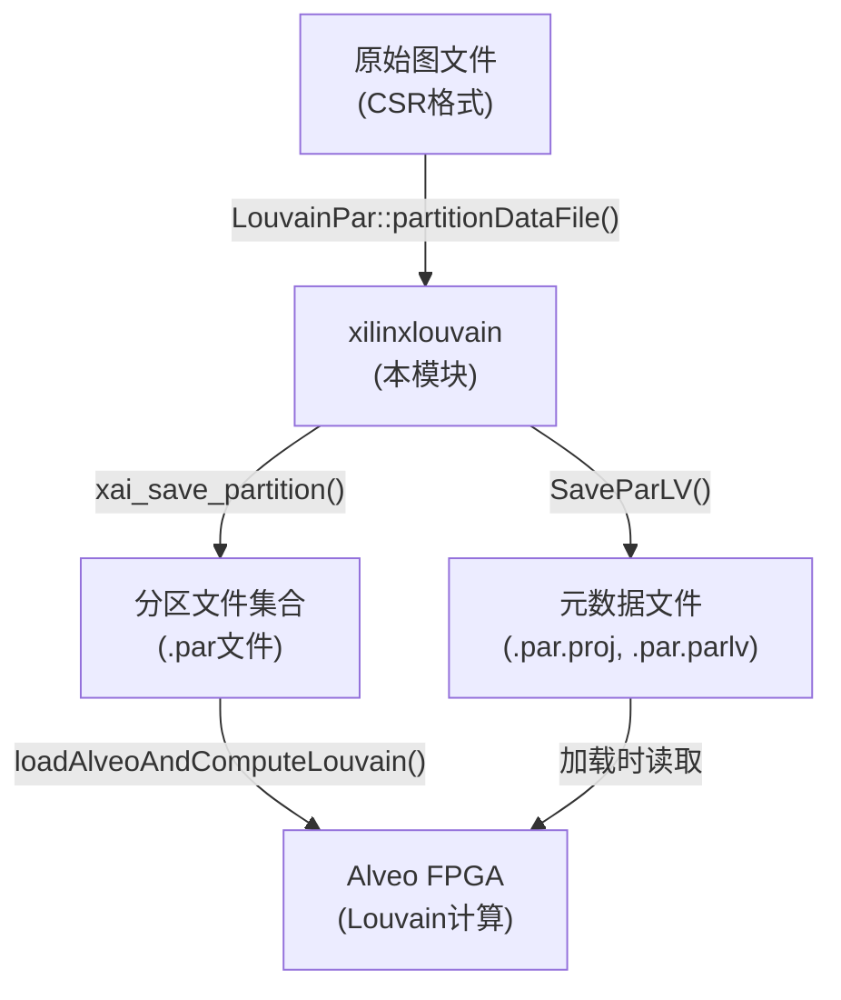

# xilinxlouvain: 基于FPGA的Louvain社区发现分区执行引擎

## 一句话概括

这是一个**图数据"切片机"**——它将无法装入单片FPGA的海量图数据，切割成多块Alveo加速卡能消化的小份，同时维护跨分区的"幽灵顶点"关系，让后续的分布式Louvain社区发现算法能够正确执行。

---

## 一、为什么需要这个模块？

### 问题空间：当图太大，单片FPGA装不下

Louvain算法是图分析中计算社区结构（modularity optimization）的黄金标准。Xilinx Alveo加速卡可以大幅加速这一计算，但面临一个物理约束：

**单片Alveo卡大约只能容纳6400万个顶点**（代码中`NV_par_max = 64 * 1000 * 1000`）。对于现代图数据（十亿级顶点），这远远不够。

### 幼稚方案的失败

你可能会想："直接把图切成N份，每份给一张卡不就行了？"——这忽略了图数据的**局部性陷阱**：

1. **跨分区边如何处理？** 顶点A在分区1，它的邻居B在分区2，这条边存在哪里？
2. **幽灵顶点（Ghost Vertices）**：分区1需要知道顶点B的存在（用于度数计算），但不需要B的所有边。
3. **负载均衡**：图遵循幂律分布，均匀切分会导致某些分区过载。

### xilinxlouvain的设计洞察

这个模块的核心设计思想是：**预计算一次，多次运行**。它将原始图切分成Alveo可处理的"分区文件"（.par文件），并保存这些分区的元数据。后续的Louvain计算可以反复加载这些预分区数据，无需重新切割。

关键策略包括：
- **80%容量预留**：`NV_par_max_margin = NV_par_max * 8/10`，为幽灵顶点预留20%空间
- **服务器感知的分区命名**：支持多服务器分布式切分（虽然是预留脚手架）
- **BFS vs 顺序切分**：支持基于BFS的分区策略以获得更好的局部性

---

## 二、架构与数据流

### 模块角色定位

xilinxlouvain在整体系统中的角色是**"图数据预处理管道"**——它位于原始图文件和FPGA执行引擎之间，负责将磁盘上的图转换为Alveo加速卡可加载的分区格式。



### 核心组件职责

| 组件 | 职责 | 生命周期 |
|------|------|----------|
| `LouvainModImpl` | PImpl封装，对外隐藏实现细节，持有`Options`和`ComputedSettings` | 与`LouvainPar`/`LouvainRun`对象一致 |
| `PartitionRun` | 单次分区操作的状态容器，管理`ParLV`结构和文件I/O | 单次`partitionDataFile()`调用期间 |
| `ParLV` (外部类型) | 分区元数据结构，保存分区数量、计时信息、源图指针等 | 由`SaveParLV()`持久化到磁盘 |
| `ComputedSettings` | 从`Options`派生的计算设置（服务器地址、ZMQ模式等） | 构造时计算，之后只读 |

### 数据流详细追踪：一次分区操作

以`LouvainPar::partitionDataFile()`调用为例，数据如何流经系统：

1. **输入阶段**：从文件创建`GLV`对象（图加载器），提取`NV`（顶点总数）
2. **服务器分片计算**：
   - 计算每个服务器的顶点范围：`start_vertex[i] = i * (NV / num_server)`
   - 最后一个服务器处理剩余顶点
3. **分区数计算**：
   - 基础分区数：`numPartitionsThisServer = globalOpts_.numDevices`
   - 如果`numPars > totalNumDevices`，按策略分配到各服务器
4. **子图提取**：
   - 为每个服务器分配`offsets_tg`、`edgelist_tg`、`drglist_tg`缓冲区
   - 调用`sim_getServerPar()`提取子图（基于CSR偏移量计算）
5. **分区写入**：
   - 计算`NV_par_requested`（每分区顶点数，受`NV_par_max_margin`限制）
   - 调用`xai_save_partition()`或`xai_save_partition_bfs()`写入.par文件
6. **元数据保存**：
   - 创建.par.proj文件，包含命令行式元数据
   - 调用`SaveParLV()`保存`ParLV`结构到.par.parlv文件
   - 创建.par.src文件保存源图头信息

---

## 三、组件深度剖析

### 3.1 ComputedSettings：配置派生器

```cpp
struct ComputedSettings {
    std::vector<std::string> hostIps;
    int numServers = 1;
    int modeZmq = ZMQ_NONE;
    int numPureWorker = 0;
    int serverIndex = -1;
    std::vector<std::string> nameWorkers;
    
    ComputedSettings(const Options& options);
};
```

**设计意图**：将原始`Options`（用户输入）转换为运行时真正需要的计算设置。这是一个**配置投影**模式——高层代码只需关心派生后的设置，无需重复解析原始字符串。

**关键行为**：
- 当前实现中，多服务器支持被注释掉，强制`modeZmq = ZMQ_DRIVER`，`numServers = 1`
- 这是**脚手架预留**——代码结构支持分布式，但当前只实现单节点

**内存与生命周期**：
- 所有成员都是值类型（`std::vector`，`int`）
- 遵循**Rule of Zero**：编译器生成的拷贝/移动/析构完全正确
- 构造后完全只读（`const`语义），无`mutable`成员

---

### 3.2 PartitionRun：单次分区操作的执行上下文

这是一个**内部类**（匿名命名空间内），封装了单次`partitionDataFile()`调用的完整生命周期。

```cpp
class PartitionRun {
    const Options& globalOpts_;              // 外部传入的引用，必须保持有效
    LouvainPar::PartitionOptions partOpts_;  // 拷贝保存（单次调用配置）
    bool isVerbose_ = false;
    ParLV parlv_;                           // 核心状态结构（值语义）
    std::string projName_;
    std::string projPath_;
    std::vector<int> parInServer_;          // 每个服务器创建的分区数
    std::string inputFileName_ = "no-file";
    const int numServers = 1;
};
```

**设计模式：RAII + 事务上下文**
- 构造函数：初始化所有资源，验证参数（`kernelMode`范围检查）
- 析构函数：默认（成员自动销毁）
- 方法`finishPartitioning()`：提交事务（保存元数据文件）

**内存所有权模型**：

| 成员 | 类型 | 所有权 | 释放责任 |
|------|------|--------|----------|
| `globalOpts_` | `const Options&` | 借用的引用 | 调用者必须保证`PartitionRun`存活期间`Options`有效 |
| `parlv_` | `ParLV`（值） | 完全拥有 | 自动销毁，但内部指针需特殊处理（见`SaveParLV`） |
| `parInServer_` | `std::vector<int>` | 完全拥有 | 自动销毁 |
| `projName_`, `projPath_` | `std::string` | 完全拥有 | 自动销毁 |

**关键方法分析：`addPartitionData()`**

这是核心的**分区写入逻辑**，约200行代码，包含以下阶段：

1. **路径计算**：根据`num_server`决定文件名格式（单服务器无后缀，多服务器加`_svr<N>`）
2. **分区大小计算**（关键算法）：
   ```cpp
   // 策略优先级：
   // 1. 用户指定 NV_par_requested > 0
   // 2. 自动计算：min(80%卡容量, 顶点数/分区数)
   // 3. 上限截断：NV_par_max_margin
   ```
3. **实际分区**：调用C函数`xai_save_partition()`或`xai_save_partition_bfs()`
4. **错误处理**：负返回值转换为异常
5. **记录**：将创建的分区数加入`parInServer_`

**错误处理与异常安全**：
- 使用自定义`Exception`类（从`std::exception`派生）
- 构造函数中验证`kernelMode`范围（2-4），无效值立即抛出
- `addPartitionData()`中，底层C函数返回负值时抛出带上下文的异常
- **异常安全保证**：基本保证（Basic Guarantee）。构造失败时不会泄漏已分配资源（依赖`unique_ptr`和RAII成员），但`ParLV`结构内部含裸指针，若构造中途异常可能泄漏（需`ParLV`自身正确处理）。

---

### 3.3 LouvainModImpl：PImpl封装器

```cpp
class LouvainModImpl {
public:
    Options options_;                              // 值拷贝
    ComputedSettings settings_;                    // 值构造
    std::unique_ptr<PartitionRun> partitionRun_;  // 独占所有权
    LouvainModImpl(const Options& options) : options_(options), settings_(options) {}
};
```

**设计模式：PImpl（Pointer to Implementation）**
- 对外暴露的`LouvainPar`/`LouvainRun`类只持有`std::unique_ptr<LouvainModImpl>`
- 实现细节（如`PartitionRun`）隐藏在`.cpp`文件的匿名命名空间中
- **优势**：编译防火墙，修改实现无需重编译调用方；ABI稳定
- **代价**：额外的一层间接访问（指针解引用开销，可忽略）

**内存所有权**：
- `options_`：对外传入`Options`的深拷贝，确保`LouvainModImpl`生命周期独立
- `settings_`：基于`options_`构造的派生配置，值语义
- `partitionRun_`：`unique_ptr`独占`PartitionRun`所有权，自动释放

**生命周期管理**：
```cpp
// 典型生命周期
auto pImpl = std::make_unique<LouvainModImpl>(options);  // 构造
pImpl->partitionRun_ = std::make_unique<PartitionRun>(...);  // 开始分区
// ... 执行分区 ...
pImpl->partitionRun_.reset();  // 结束分区，释放资源
// pImpl销毁时自动清理所有资源
```

---

## 四、C++实现深度分析

### 4.1 内存所有权与资源管理

**混合策略：RAII + 裸指针遗留**

| 区域 | 策略 | 说明 |
|------|------|------|
| `LouvainModImpl` | 现代C++ | `unique_ptr`，值语义成员 |
| `PartitionRun` | 现代C++ | `std::string`, `std::vector`, `ParLV`（值） |
| `ParLV`内部 | 裸指针 | 指向C结构，需手动`SaveParLV()`序列化 |
| 临时缓冲区 | C风格 | `malloc`分配的`offsets_tg`, `edgelist_tg`等 |

**关键内存契约**：

```cpp
// 在addPartitionData()中，临时缓冲区所有权清晰：
long* offsets_tg = (long*)malloc(sizeof(long) * (vInServer[i_svr] + 1));
edge* edgelist_tg = (edge*)malloc(...);
long* drglist_tg = (long*)malloc(...);

// 这些缓冲区借给xai_save_partition()使用
int numPartitionsCreated = xai_save_partition(
    offsets_tg, edgelist_tg, drglist_tg, ...);

// 调用完成后，当前函数负责释放
free(offsets_tg);
free(edgelist_tg);
free(drglist_tg);
```

**所有权转移边界**：
- `GLV* glv_src`：从`CreateByFile_general()`创建，指针存入`parlv_.plv_src`，`ParLV`负责最终释放
- `partitionData`各指针：借给`addPartitionData()`，函数内部分配临时缓冲区，不持有传入指针
- `.par`文件：所有权转移给文件系统

### 4.2 对象生命周期与值语义

**Rule of Zero 适用区域**：
- `ComputedSettings`：全值类型成员，无裸资源，编译器生成特殊函数完全正确
- `LouvainModImpl`：`unique_ptr`成员自动管理`PartitionRun`，默认析构足够

**需要关注区域**：
- `ParLV`（C结构包装）：含裸指针`plv_src`，拷贝时需深拷贝或明确禁用拷贝
- `PartitionRun`：含`ParLV parlv_`成员，依赖`ParLV`的正确销毁

**移动语义使用**：
```cpp
// std::unique_ptr<PartitionRun> partitionRun_
// 支持移动，禁止拷贝（符合单所有权语义）
pImpl_->partitionRun_.reset(new PartitionRun(...));
// 或
pImpl_->partitionRun_ = std::make_unique<PartitionRun>(...);
```

### 4.3 错误处理策略

**异常类型**：
```cpp
class Exception : public std::exception {
    std::string message_;
public:
    explicit Exception(const std::string& msg) : message_(msg) {}
    const char* what() const noexcept override { return message_.c_str(); }
};
```

**异常使用约定**：
- 构造函数验证失败：立即抛出（如`kernelMode`不在2-4范围）
- 文件操作失败：转换为带上下文的异常（如分区创建失败时）
- 不返回错误码：C风格函数的负返回值立即转换为异常

**异常安全保证**：
- **基本保证**：构造或方法失败时，不泄漏已分配资源，但对象状态可能部分改变
- **关键风险**：`ParLV`含裸指针，若`SaveParLV()`中途失败，可能泄漏内部缓冲区

**前置条件检查**：
```cpp
// kernelMode 范围检查（硬错误）
if (kernelMode < 2 || kernelMode > 4) {
    throw Exception("Invalid kernelMode value...");
}

// 项目名非空检查
if (globalOpts.nameProj.empty()) {
    throw Exception("ERROR: Alveo project name is empty");
}

// 顶点数有效性检查（软错误，内部处理）
if (dummyGlvHead.NV < 1)
    throw Exception("ERROR: Number of vertices appears not to be set...");
```

### 4.4 Const正确性与可变性

**Const使用模式**：
- `globalOpts_`：`const Options&`，外部配置不可变
- `partOpts_`：非const，单次运行期间可能调整（实际只读）
- 方法参数：`const char* fileName`，`const PartitionOptions& partOpts` — 输入参数尽可能const

**Mutable需求**：
```cpp
// 无mutable成员，所有缓存都是显式管理
// 计时信息直接存储在parlv_.timesPar中（非const方法修改）
parlv_.timesPar.timePar_all = getTime();
```

**C接口的Const缺失**：
```cpp
// 遗留C函数未使用const，需强制转换
xai_save_partition(
    const_cast<long*>(partitionData.offsets_tg),  // 失去const保护
    const_cast<Edge*>(partitionData.edgelist_tg),
    ...
);
```

### 4.5 并发与线程安全

**线程安全策略：单线程假设**

本模块**不是线程安全的**。设计假设：
- 单个`LouvainPar`/`LouvainRun`实例在单个线程中使用
- 多线程场景需在外部同步（每个线程独立实例）

**全局状态风险**：
```cpp
// 匿名命名空间中的静态变量（模块级全局）
namespace {
    long NV_par_max = 64 * 1000 * 1000;           // 可修改的模块级配置
    long NV_par_max_margin = NV_par_max * 8 / 10; // 派生值，不同步
}
```
- 这些变量在模块加载时初始化，运行时可能被修改（未加锁）
- 多线程同时修改可能导致竞态条件

**外部依赖的并发假设**：
- `xai_save_partition()`：假设内部无共享状态，可重入
- `SaveParLV()`：假设文件系统操作原子
- `GLV`操作：依赖外部图加载器的线程安全保证

---

## 五、设计决策与权衡

### 5.1 现代C++ vs 遗留C的混合

**决策**：保留C风格内存管理（`malloc`/`free`）用于临时缓冲区，C++ RAII用于长期对象。

**理由**：
- 与遗留C代码（`xai_save_partition`等）互操作，这些函数期望`malloc`分配的指针
- 性能：某些场景下`malloc`比`new`更容易对齐内存（虽然`alignas`可以替代）
- 历史债务：代码演进过程中逐步封装，未完全重构底层

**代价**：
- 内存泄漏风险（需确保每个`malloc`对应`free`）
- 异常安全变复杂（异常发生时需捕获并释放）
- 代码审查负担增加

**替代方案**：
```cpp
// 更现代的方案（未采用）
std::unique_ptr<long[], decltype(&free)> offsets_tg(
    (long*)malloc(sizeof(long) * size), &free);
```

### 5.2 PImpl模式的使用

**决策**：对外暴露的`LouvainPar`/`LouvainRun`只持`unique_ptr<LouvainModImpl>`，实现细节隐藏在`.cpp`中。

**理由**：
- **编译防火墙**：修改`PartitionRun`无需重编译调用方
- **ABI稳定性**：动态库场景下，内部修改保持二进制兼容
- **信息隐藏**：调用方无需了解`ParLV`等内部结构

**代价**：
- 额外的堆分配（`unique_ptr`指向堆对象）
- 一层间接访问（性能影响可忽略）
- 调试时难以直接查看内部状态

**权衡点**：
本模块是**库代码**，面向外部开发者使用。PImpl的封装价值高于微小性能损失。如果是内部工具代码，可能选择更简单的直接包含。

### 5.3 异常 vs 错误码

**决策**：使用C++异常作为主要错误报告机制，底层C函数使用错误码。

**理由**：
- C++异常自动传播，减少错误检查样板代码
- 构造函数无法返回错误码，异常是唯一选择
- 与标准库异常体系一致（`std::exception`派生）

**代价**：
- 二进制体积增加（异常处理表）
- 性能开销（栈展开，虽然冷路径可接受）
- 与C代码互操作需转换（捕获异常转错误码，或反之）

**关键设计**：
```cpp
// 转换层：C错误码 → C++异常
if (numPartitionsCreated < 0) {
    throw Exception("ERROR: Failed to create Alveo partition...");
}

// 转换层：前置检查
if (kernelMode < 2 || kernelMode > 4) {
    throw Exception("Invalid kernelMode value...");
}
```

### 5.4 容量规划策略：80%预留

**决策**：每分区最大顶点数设为卡片容量的80%（`NV_par_max_margin = NV_par_max * 8/10`）。

**理由**：
- **幽灵顶点开销**：跨分区边会在本地分区创建"幽灵"（ghost）顶点副本，需要额外存储
- **负载波动**：图数据遵循幂律分布，某些分区可能热点集中，预留缓冲避免溢出
- **运行时开销**：FPGA计算需要额外的临时缓冲区

**代价**：
- 理论容量减少20%，可能需要更多分区/卡片处理同等规模图
- 对小图（远小于容量）造成浪费，但可通过`NV_par_requested`覆盖

**替代方案考虑**：
```cpp
// 动态预留（未采用）
NV_par_requested = std::min(NV_par_max_margin, 
                              static_cast<long>(NV_par_max * (1.0 - ghost_ratio_estimate)));
```
未采用动态方案是因为：1) 缺乏精确的幽灵顶点比例预估；2) 简单静态策略更易验证正确性。

---

## 六、使用模式与示例

### 6.1 基本分区流程

```cpp
#include "xilinxlouvain.hpp"
using namespace xilinx_apps::louvainmod;

// 1. 配置全局选项
Options opts;
opts.xclbinPath = "/path/to/louvain.xclbin";
opts.kernelMode = 3;  // 2,3,4 为有效值
opts.numDevices = 2;  // 使用2张Alveo卡
opts.nameProj = "./my_graph_partitions";
opts.verbose = true;

// 2. 创建分区器（PImpl模式）
LouvainPar partitioner(opts);

// 3. 配置分区选项
PartitionOptions partOpts;
partOpts.numPars = 4;        // 请求4个分区（可能根据设备数调整）
partOpts.par_prune = 1;      // 剪枝阈值
partOpts.BFS_partition = false;  // 使用顺序分区（true为BFS分区）

// 4. 执行分区（阻塞调用，可能耗时数分钟）
partitioner.partitionDataFile("/path/to/graph.csr", partOpts);

// 5. 分区完成后，输出文件：
//    my_graph_partitions.par.proj    - 项目元数据
//    my_graph_partitions.par.parlv  - 分区结构数据
//    my_graph_partitions.par.src      - 源图头信息
//    louvain_partitions_000.par      - 实际分区数据（多个）
```

### 6.2 分区选项详解

| 选项 | 类型 | 默认值 | 说明 |
|------|------|--------|------|
| `numPars` | `int` | 1 | 请求的Alveo分区总数。若大于设备数，某些卡处理多个分区 |
| `par_prune` | `int` | 1 | 剪枝阈值，控制分区边界的顶点评分策略 |
| `BFS_partition` | `bool` | false | 分区策略：false=顺序顶点划分，true=BFS遍历划分（更好局部性） |
| `totalNumVertices` | `long` | 0 | 若图文件不含顶点数，需显式指定 |

### 6.3 计算阶段（加载并执行）

```cpp
// 分区完成后，后续计算流程：

LouvainRun runner(opts);  // 使用相同Options
runner.setAlveoProject("./my_graph_partitions");

ComputeOptions computeOpts;
computeOpts.max_iter = 100;      // 每级最大迭代
computeOpts.max_level = 10;      // 最大层级数
computeOpts.tolerance = 0.0001;  // 收敛容差
computeOpts.outputFile = "result_communities.txt";

// 加载分区到FPGA并执行Louvain算法
float finalModularity = runner.loadAlveoAndComputeLouvain(computeOpts);
std::cout << "Final modularity: " << finalModularity << std::endl;
```

---

## 七、边界情况与陷阱

### 7.1 顶点数估算错误

```cpp
// 陷阱：图文件未正确报告顶点数
PartitionOptions partOpts;
// 未设置 totalNumVertices
partitioner.partitionDataFile("graph_without_header.csr", partOpts);
// 可能抛出："ERROR: Number of vertices appears not to be set"

// 正确做法：
partOpts.totalNumVertices = 1000000000;  // 显式指定
```

### 7.2 分区容量溢出

```cpp
// 陷阱：请求的分区数过少，单分区超过Alveo容量
partOpts.numPars = 1;  // 只分1个区
// 若图有10亿顶点，单分区远超6400万限制
// 实际行为：函数会尝试创建，但底层可能失败或产生未定义行为

// 正确做法：确保 NV / numPars <= NV_par_max_margin (约5120万)
```

### 7.3 文件路径长度限制

```cpp
// 陷阱：项目路径过长
opts.nameProj = "/very/long/path/that/exceeds/internal/buffer/limit/my_project";
// 内部使用 char pathName_tmp[1024]，超长可能导致截断或溢出

// 正确做法：使用相对路径或较短的绝对路径
opts.nameProj = "./partitions/louvain_proj";  // 简短路径
```

### 7.4 多服务器模式的限制

```cpp
// 陷阱：误认为当前支持多服务器分布式
ComputedSettings settings(opts);
// settings.numServers 被强制设为1
// settings.modeZmq 被强制设为 ZMQ_DRIVER

// 代码注释表明多服务器支持被暂时禁用：
// "/*modeZmq = (options.nodeId == 0) ? ZMQ_DRIVER : ZMQ_WORKER;*/"
// 实际为单节点运行，多服务器为预留脚手架
```

### 7.5 内存泄漏风险点

```cpp
// 风险点1：异常路径未释放临时缓冲区
void riskyFunction() {
    long* buf = (long*)malloc(sizeof(long) * size);
    // 若此处抛出异常，buf 泄漏
    riskyOperationThatMayThrow();
    free(buf);
}

// 当前代码正确做法（但依赖手动配对）：
long* offsets_tg = (long*)malloc(...);
// ... 使用 ...
free(offsets_tg);  // 确保在每条路径都调用

// 更安全的现代C++方案（未采用）：
auto offsets_tg = std::make_unique<long[]>(size);
// 自动释放，异常安全
```

### 7.6 类型转换与const正确性

```cpp
// 陷阱：const正确性丢失
// partitionData.offsets_tg 可能是 const long*
// 但底层C函数需要 non-const
int result = xai_save_partition(
    const_cast<long*>(partitionData.offsets_tg),  // 危险：丢失const保护
    ...
);

// 若 xai_save_partition 内部修改数据，编译器无法保护调用者
```

---

## 八、依赖关系与外部契约

### 8.1 调用本模块的组件

| 调用方 | 调用方式 | 目的 |
|--------|----------|------|
| `LouvainPar`（同模块封装） | 直接方法调用 | 对外暴露分区功能 |
| `LouvainRun`（同模块封装） | 直接方法调用 | 对外暴露计算功能 |
| 外部应用代码 | C++ API | 集成Louvain分区功能 |

### 8.2 本模块调用的外部组件

| 被调用方 | 所在模块 | 调用方式 | 用途 |
|----------|----------|----------|------|
| `CreateByFile_general()` | 图加载模块（外部） | C函数 | 从文件加载图为`GLV`结构 |
| `xai_save_partition()` / `xai_save_partition_bfs()` | 底层分区引擎（外部） | C函数 | 实际执行图分区算法 |
| `SaveParLV()` | 元数据序列化（外部） | C函数 | 持久化分区元数据 |
| `sim_getServerPar()` | 图提取工具（外部） | C函数 | 从全局图提取子图 |
| `getTime()` | 计时工具（外部） | C函数 | 获取高精度时间戳 |

### 8.3 数据契约与前置条件

**输入图文件格式（CSR）**：
- 文件需包含顶点数`NV`和边列表
- 支持二进制CSR格式（具体格式由`CreateByFile_general()`定义）
- 若文件头不含顶点数，需通过`PartitionOptions::totalNumVertices`显式指定

**输出文件契约**：
- `.par.proj`：文本文件，包含命令行格式的元数据（可人工读取）
- `.par.parlv`：二进制文件，包含`ParLV`结构（需专用工具读取）
- `.par.src`：源图头信息（用于验证）
- `louvain_partitions_*.par`：实际分区数据（二进制，FPGA直接加载）

**内存容量约束**：
- 每分区顶点数不得超过`NV_par_max`（6400万）
- 建议不超过`NV_par_max_margin`（5120万），为幽灵顶点预留20%

---

## 九、性能考量与优化策略

### 9.1 热点路径识别

**高频调用操作**（单次分区内执行一次，但数据量大）：
1. `sim_getServerPar()` - 子图提取，O(E)复杂度，访问所有边
2. `xai_save_partition()` - 分区算法，核心计算密集操作
3. `SaveParLV()` - 元数据序列化，I/O密集

**低频管理操作**：
- 文件打开/关闭
- 内存分配/释放
- 元数据计算

### 9.2 数据结构布局

**缓冲区分配策略**：
```cpp
// 临时缓冲区：栈式分配，即用即释
long* offsets_tg = (long*)malloc(sizeof(long) * (vInServer[i_svr] + 1));
// ... 使用 ...
free(offsets_tg);

// 长期数据：值语义，自动管理
ParLV parlv_;  // 作为PartitionRun成员，自动销毁
```

**对齐与缓存考虑**：
- 未显式使用`alignas`或`__attribute__((aligned))`
- 依赖`malloc`的默认对齐（通常8或16字节）
- 批量操作访问连续数组（`offsets_tg`, `edgelist_tg`），缓存友好

### 9.3 算法复杂度与可扩展性

**分区算法复杂度**：
- 时间：O(E) - 需遍历所有边进行分区决策
- 空间：O(V + E) - 需存储子图副本

**可扩展性瓶颈**：
1. **单线程限制**：当前实现为单线程，大数据集分区耗时
2. **内存复制**：`sim_getServerPar()`创建子图副本，双倍内存占用
3. **I/O瓶颈**：大图的.par文件写入受限于磁盘带宽

**优化预留**：
- 代码结构支持多服务器（`numServers`预留），可扩展为分布式分区
- `xai_save_partition_bfs()`提供BFS分区策略，改善局部性

---

## 十、新贡献者指南

### 10.1 推荐阅读顺序

1. **理解问题空间**：先阅读本文档"为什么需要这个模块"章节，理解图分区问题
2. **掌握架构**：查看Mermaid架构图，理解数据流
3. **从入口开始**：阅读`LouvainPar::partitionDataFile()`，这是主要入口
4. **深入实现**：跟踪`PartitionRun::addPartitionData()`的分区逻辑
5. **理解输出**：查看`finishPartitioning()`的元数据保存

### 10.2 常见修改场景

**场景1：支持新的分区策略**
- 在`addPartitionData()`中，现有`if (!partOpts_.BFS_partition)`分支
- 添加新的条件分支，调用新的底层分区函数
- 更新`PartitionOptions`结构添加新选项

**场景2：修改分区文件格式**
- 修改`finishPartitioning()`中的`meta`字符串构建逻辑
- 更新`SaveParLV()`调用（外部函数，需同步修改）
- 确保向后兼容或提供版本标识

**场景3：添加多服务器支持**
- 解除`ComputedSettings`中的注释代码
- 实现ZMQ工作节点逻辑（当前仅DRIVER模式）
- 在`addPartitionData()`中启用多服务器分区分配

### 10.3 调试技巧

**启用详细输出**：
```cpp
Options opts;
opts.verbose = true;  // 启用PartitionRun中的详细日志
```

**检查生成的.par文件**：
```bash
# .par.proj是文本文件，可直接查看
cat my_project.par.proj
# 输出示例：-create_alveo_partitions graph.csr -num_pars 4 -par_prune 1 ...
```

**验证分区数量**：
```cpp
// 在finishPartitioning后检查
std::cout << "Total partitions: " << parlv_.num_par << std::endl;
```

**内存泄漏检测**（开发调试）：
```cpp
// 在addPartitionData的free调用处添加日志
std::cout << "Freeing offsets_tg at " << offsets_tg << std::endl;
free(offsets_tg);
```

### 10.4 测试 checklist

新增代码后，验证以下场景：

- [ ] **小图测试**：顶点数 < NV_par_max_margin，应生成单分区
- [ ] **大图测试**：顶点数 > NV_par_max，应生成多分区
- [ ] **精确分区数**：设置numPars，验证实际生成的分区数
- [ ] **BFS模式**：启用BFS_partition，验证输出与顺序分区不同
- [ ] **错误处理**：传入无效kernelMode，验证抛出异常
- [ ] **元数据验证**：检查.par.proj内容是否符合预期格式
- [ ] **内存检查**：运行valgrind或ASan，确认无泄漏

---

## 十一、相关模块与参考

### 11.1 直接依赖的模块

| 模块 | 关系 | 说明 |
|------|------|------|
| [ParLV/p louvainPartition](graph_analytics_and_partitioning-community_detection_louvain_partitioning-partition_graph_state_structures.md) | 使用 | 分区元数据结构定义 |
| [op_louvainmodularity](graph_analytics_and_partitioning-community_detection_louvain_partitioning-op_louvainmodularity.md) | 使用 | Louvain模量计算核心 |
| [host_clustering_data_definitions](graph_analytics_and_partitioning-community_detection_louvain_partitioning-host_clustering_data_definitions.md) | 使用 | 聚类数据类型定义 |

### 11.2 兄弟模块（同层级）

- [louvain_modularity_execution_and_orchestration](graph_analytics_and_partitioning-community_detection_louvain_partitioning-louvain_modularity_execution_and_orchestration.md) - 本模块的父模块
- [fpga_kernel_connectivity_profiles](graph_analytics_and_partitioning-community_detection_louvain_partitioning-fpga_kernel_connectivity_profiles.md) - FPGA内核连接配置
- [partition_phase_timing_and_metrics](graph_analytics_and_partitioning-community_detection_louvain_partitioning-partition_phase_timing_and_metrics.md) - 分区阶段计时

---

## 十二、总结

xilinxlouvain模块是Xilinx图分析库中的**关键数据预处理组件**。它将"太大装不下"的图数据，转化为Alveo FPGA能够高效处理的切片，同时维护分布式计算所需的元数据。

**核心设计亮点**：
1. **预计算策略**：分区一次，多次运行，摊销昂贵的图切割成本
2. **容量预留**：80%使用率上限，为幽灵顶点和运行时开销预留空间
3. **可扩展架构**：单节点实现，但代码结构预留多服务器分布式扩展
4. **PImpl封装**：清晰的ABI边界，允许内部重构不影响调用方

**使用本模块的关键认知**：
- 它不是"透明"的数据管道——分区决策（BFS vs 顺序、分区数）会显著影响后续Louvain计算的性能和精度
- 元数据文件（.par.proj等）是"活"的契约——修改本模块版本后需验证与旧分区文件的兼容性
- 内存管理是"手动档"——扩展代码时需严格遵循`malloc`/`free`配对，或考虑引入`unique_ptr`包装

---

*本文档基于代码版本分析生成。实际使用时请以最新代码和官方文档为准。*