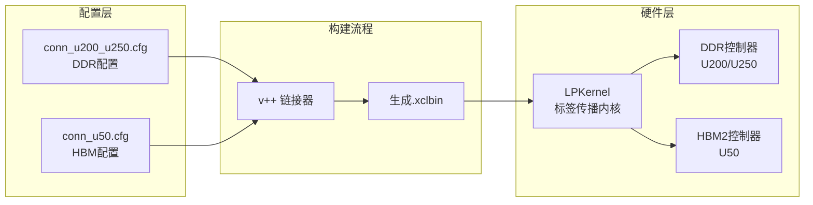
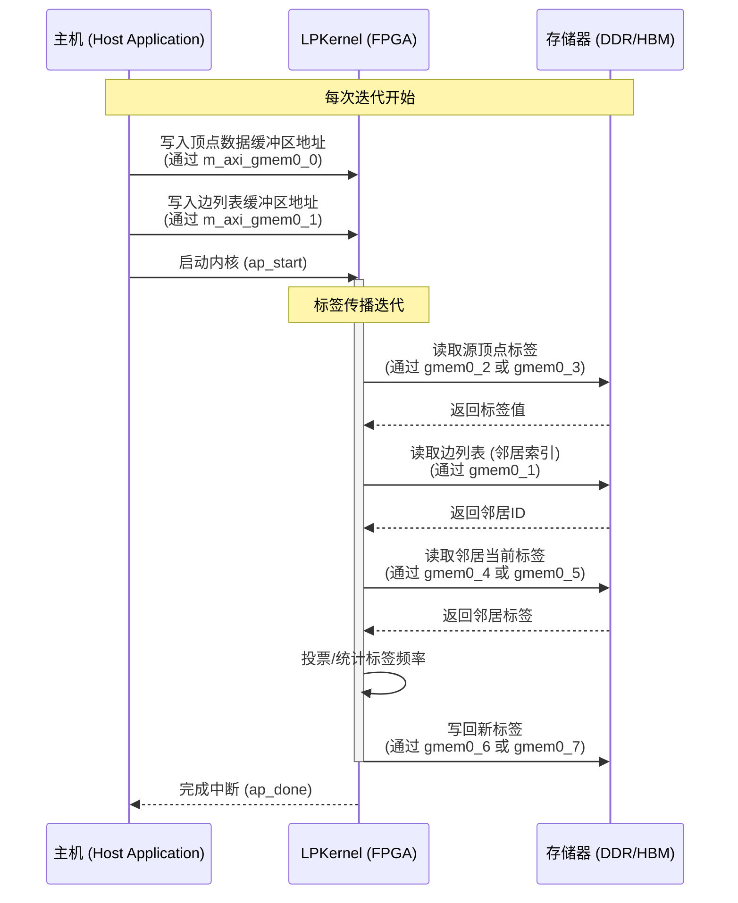
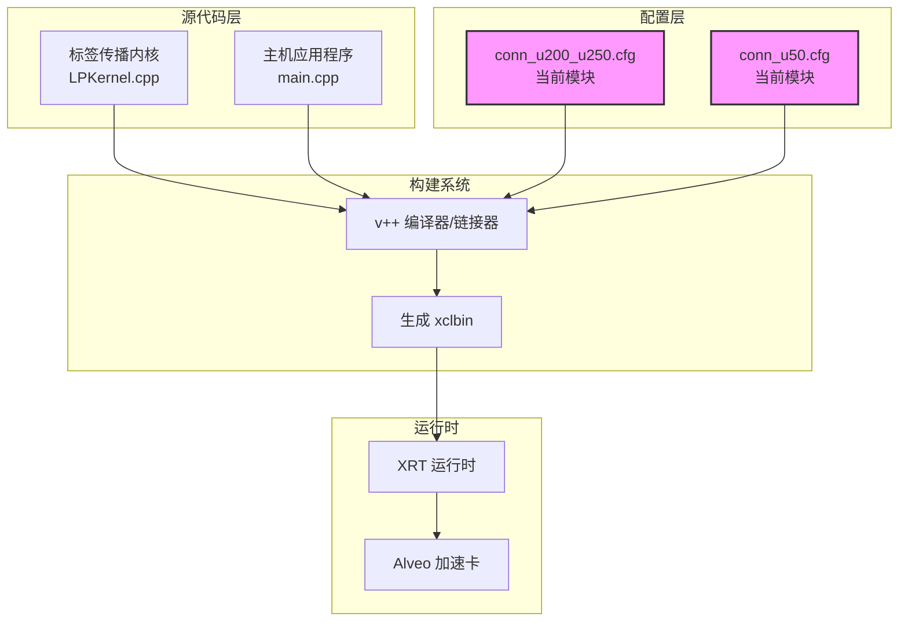

# Alveo 内核连接配置文件 (alveo_kernel_connectivity_profiles)

当你第一次看到这些 `.cfg` 文件时，可能会困惑：为什么一个 FPGA 加速项目需要如此复杂的"配置文件"？这些看似简单的文本行——`sp=LPKernel.m_axi_gmem0_0:DDR[0]`——实际上扮演着**硬件电路的接线图**角色。它们决定了你的算法内核如何与外部存储器对话，直接影响着带宽、延迟和最终性能。

在标签传播 (Label Propagation) 图算法中，内存访问模式是高度不规则的：每个顶点需要随机访问其邻居的标签。这种随机性使得内存带宽成为瓶颈。这些连接配置文件的核心使命就是**通过多端口并行访问来突破内存墙**——将单个内核的 8 或 9 个 AXI 主端口映射到不同的存储器 bank，最大化聚合带宽。

---

## 架构概览：从配置到硅片的旅程

理解这些配置文件的最佳方式是追踪它们在构建流程中的作用：



**配置文件的实质是物理连接声明**。当你写 `sp=LPKernel.m_axi_gmem0_0:DDR[0]` 时，你告诉 v++ 链接器："将内核的 `m_axi_gmem0_0` AXI 接口连接到 DDR 控制器的第 0 个 bank。" 这会在生成的比特流中创建实际的物理连线。

---

## 核心设计决策与权衡

### 1. DDR vs HBM：两种存储哲学

模块提供两种配置变体，反映了两种截然不同的硬件架构哲学：

| 特性 | U200/U250 (DDR4) | U50 (HBM2) |
|------|-------------------|------------|
| 配置方式 | 8 端口全部映射到 `DDR[0]` | 9 端口映射到 `HBM[0:1]` 到 `HBM[14:15]` |
| 带宽特性 | ~77 GB/s 总带宽 | ~460 GB/s 总带宽 |
| 延迟 | ~80-100ns | ~50ns |
| 容量 | 64GB | 8GB |
| 路由复杂度 | 简单 | 复杂（需 bank 级规划）|

**设计意图解读**：

- **U200/U250 配置**采用"端口聚合"策略。8 个 AXI 端口全部连接到同一个 DDR bank，利用 AXI 交叉开关的仲裁机制来合并访问。这是**简单性优先**的设计——牺牲极致性能换取配置简洁性和编译器友好的路由。

- **U50 配置**采用**bank 级并行**策略。9 个端口被精心分配到 15 个 HBM bank 中的 9 个（注意 `HBM[6:7]` 被复用分配给两个端口）。这体现了**带宽最大化**的设计哲学——通过分散访问到独立 bank 来避免冲突、最大化并行性。

### 2. 端口数量的选择：8 vs 9

为什么 U50 比 U200 多一个端口？这反映了两种不同硬件的架构约束：

- **U200/U250 (8 端口)**：这些卡的 DDR 控制器通常提供 4 或 8 个独立的 AXI 从端口。使用 8 个端口可以匹配硬件的并行度，避免端口争用。

- **U50 (9 端口)**：HBM 控制器提供更细粒度的 bank 级访问。增加第 9 个端口可以更好地利用 HBM 的高 bank 数量，实现更细粒度的访问并行化。

### 3. SLR 放置约束

U50 配置中的 `slr=LPKernel:SLR0` 是一个关键的设计决策。SLR (Super Logic Region) 是 Xilinx UltraScale+ 器件的物理分区概念。

**为什么是 SLR0？**

- **HBM 控制器位置**：在 U50 上，HBM 控制器通常位于 SLR0 附近。将内核放置在同一 SLR 可以最小化跨 SLR 路由延迟。
- **时序收敛**：跨 SLR 的信号需要特殊的流水线寄存器。本地放置有助于时序收敛，确保内核能在目标频率（通常 300MHz）运行。

---

## 数据流分析：配置如何映射到执行

让我们追踪一次典型的标签传播迭代中，数据如何通过配置所定义的端口流动：



**关键观察**：

1. **端口功能分化**：虽然配置文件中端口只是编号 (gmem0_0 到 gmem0_8)，但在实际内核实现中，它们通常有明确分工：
   - `gmem0_0` - `gmem0_1`：主机通信、控制参数
   - `gmem0_2` - `gmem0_5`：顶点/边读取（随机访问）
   - `gmem0_6` - `gmem0_8`：结果写回（顺序/批量）

2. **U50 的额外端口用途**：第 9 个端口 (`gmem0_8`) 在 U50 上通常用于：
   - 辅助数据结构（如顶点度数组）
   - 双缓冲的第二个缓冲区
   - 聚合统计信息输出

---

## 子模块详解

### U200/U250 连接配置 (`conn_u200_u250.cfg`)

**适用硬件**：Alveo U200, Alveo U250 数据中心加速卡

**核心配置**：

```
nk=LPKernel:1:LPKernel          # 实例化 1 个 LPKernel，实例名为 LPKernel
sp=LPKernel.m_axi_gmem0_0:DDR[0]  # 8 个 AXI 端口全部连接到 DDR0
...
sp=LPKernel.m_axi_gmem0_7:DDR[0]
```

**设计特点**：

1. **简单聚合模式**：所有端口共享同一 DDR bank。这种设计的优势是：
   - 主机端内存管理简单（只需分配一个连续缓冲区）
   - 编译器路由压力小，容易时序收敛
   - 适合数据访问具有时间局部性的场景（如顺序遍历）

2. **隐含的 AXI 交叉开关**：8 个端口到 1 个 bank 的连接实际上经过 AXI Interconnect，它会仲裁并发访问。当多个端口同时访问时，会引入仲裁延迟。

**适用场景**：
- 图规模较大（需要 64GB 容量）
- 访问模式较规则（如批量 BFS/DFS）
- 不需要极致带宽（<50 GB/s 有效带宽即可满足）

---

### U50 连接配置 (`conn_u50.cfg`)

**适用硬件**：Alveo U50 数据中心加速卡

**核心配置**：

```
slr=LPKernel:SLR0               # 将内核放置在 Super Logic Region 0
nk=LPKernel:1:LPKernel          # 实例化 1 个 LPKernel
sp=LPKernel.m_axi_gmem0_0:HBM[0:1]   # 9 个端口映射到特定 HBM bank 范围
sp=LPKernel.m_axi_gmem0_1:HBM[2:3]
sp=LPKernel.m_axi_gmem0_2:HBM[4:5]
sp=LPKernel.m_axi_gmem0_3:HBM[6:7]
sp=LPKernel.m_axi_gmem0_4:HBM[6:7]   # 注意：bank 6:7 被复用
sp=LPKernel.m_axi_gmem0_5:HBM[8:9]
sp=LPKernel.m_axi_gmem0_6:HBM[10:11]
sp=LPKernel.m_axi_gmem0_7:HBM[12:13]
sp=LPKernel.m_axi_gmem0_8:HBM[14:15]
```

**设计特点**：

1. **精细的 Bank 级映射**：不同于 U200 的聚合模式，U50 配置将每个 AXI 端口精确映射到特定的 HBM bank 范围（每 2 个 bank 组成一个伪通道）。这种设计的优势：
   - **并行访问无冲突**：当 9 个端口访问各自独立的 bank 时，不存在仲裁延迟，每个端口获得独立的 ~23GB/s 带宽，理论聚合带宽超过 200GB/s
   - **确定性延迟**：无仲裁意味着访问延迟可预测，对同步密集型算法至关重要

2. **Bank 复用策略**：注意 `gmem0_3` 和 `gmem0_4` 共享 `HBM[6:7]`。这是一种**有意识的设计选择**，暗示：
   - 这两个端口在算法执行中是**时间互斥**的（例如一个用于读取，一个用于写回，或者分别用于不同阶段的访问）
   - 内核实现中可能存在**双缓冲**模式，两个端口交替访问同一存储区域的不同子集

3. **SLR 放置约束**：`slr=LPKernel:SLR0` 是关键的时序优化。U50 的 HBM 控制器位于 SLR0，将内核放置在同一 SLR 可以：
   - 最小化从内核到 HBM 控制器的布线距离
   - 避免跨 SLR 的超长连线（通常需要额外的流水线寄存器）
   - 确保内核能在 300MHz 目标频率下时序收敛

**适用场景**：
- 需要极致带宽（>100 GB/s 有效带宽）的图算法
- 数据集大小在 8GB 以内（U50 的 HBM 容量限制）
- 访问模式高度不规则（随机访问主导），需要 bank 级并行来隐藏延迟

---

## 与系统其他部分的交互

这些配置文件本身只是"静态描述"，它们在构建流程中发挥作用：



**关键依赖关系**：

1. **向上游依赖（内核实现）**：
   - 这些配置文件必须与 LPKernel 的 HLS 实现严格对应。如果内核声明了 8 个 `m_axi` 接口，配置文件必须恰好映射 8 个（或 9 个）端口。
   - 端口命名约定：`m_axi_gmem0_*` 是 Vitis HLS 生成的默认命名模式（`gmem` = global memory）。

2. **向构建系统暴露**：
   - 配置文件通过 `--connectivity.slr` 和 `--connectivity.sp` 等 v++ 选项被消费。
   - 实际构建命令示例：
     ```bash
     v++ -l -t hw --platform xilinx_u50_gen3x16_xdma_201920_3 \
         --connectivity.sp LPKernel.m_axi_gmem0_0:HBM[0:1] \
         --connectivity.slr LPKernel:SLR0 \
         ...
     ```

3. **下游运行时依赖**：
   - 生成的 `.xclbin` 文件包含了这些连接配置的硬件实现。
   - XRT (Xilinx Runtime) 在加载 xclbin 时会根据这些配置设置内存映射。

---

## 新贡献者须知：关键陷阱与最佳实践

### 1. 端口数量必须与内核严格匹配

**陷阱**：如果内核 HLS 代码声明了 8 个 `m_axi` 接口，但配置文件映射了 9 个端口，v++ 链接器会报错。反之，如果内核有 9 个端口但配置只映射了 8 个，第 9 个端口将无法访问外部存储器（可能导致死锁或错误结果）。

**最佳实践**：始终检查内核的 `component.xml` 或 HLS 生成的报告，确认 `m_axi` 接口的确切数量。

### 2. HBM Bank 范围语法含义

**陷阱**：`HBM[0:1]` 表示该 AXI 端口可以访问 HBM bank 0 和 bank 1 组成的伪通道。这并不意味着端口同时访问两个 bank，而是说地址范围跨越这两个 bank。如果两个端口被分配到重叠的 bank 范围（如都配置为 `HBM[6:7]`），它们会竞争该 bank 的带宽。

**最佳实践**：像 U50 配置那样，为每个端口分配独立的 bank 范围（除了明确设计的复用场景）。监控 HBM 带宽利用率，确认没有意外的 bank 冲突。

### 3. SLR 放置与资源可用性

**陷阱**：`slr=LPKernel:SLR0` 约束了内核的物理位置。如果 SLR0 的其他资源（如 DSP、BRAM）已被其他内核占用，v++ 可能无法满足此约束，导致布局失败。

**最佳实践**：在使用 SLR 约束前，检查目标平台的资源地图 (resource map)，确认 SLR0 有足够资源容纳 LPKernel。对于多内核设计，考虑使用更灵活的 SLR 分配策略。

### 4. 配置文件与平台版本兼容性

**陷阱**：Alveo 平台有多个版本（如 `xilinx_u50_gen3x16_xdma_201920_3` vs `xilinx_u50_gen3x16_xdma_5_202210_1`）。不同版本可能具有不同的 HBM 配置或 DDR 子系统。在一个平台上工作的配置文件可能在另一个平台上布局失败。

**最佳实践**：始终明确指定测试过的平台版本。在团队文档中维护"认证平台版本"列表。当升级平台版本时，重新验证所有连接配置。

### 5. 调试连接问题的系统性方法

当内核出现内存访问错误（如挂起、错误数据）时，按以下顺序排查：

1. **检查内核日志**：XRT 的 `dmesg` 输出或 `xbutil` 查询可能报告 AXI 协议错误。

2. **验证地址映射**：确认主机代码分配的缓冲区地址与内核期望的范围匹配。使用 `xclbinutil` 检查生成的 xclbin 中的内存拓扑。

3. **隔离端口**：如果可能，修改内核临时禁用某些端口，逐步缩小问题范围。

4. **检查资源利用率**：高 LUT 或布线拥塞可能导致时序问题，进而引起 AXI 协议违规。查看 v++ 的布线报告。

---

## 总结：配置作为性能工程工具

这些看似简单的 `.cfg` 文件实际上是**性能工程的关键杠杆**。它们不描述算法逻辑，而是描述**数据如何流动**——这在图算法中往往比计算本身更重要。

理解这些配置文件，你需要建立以下心智模型：

1. **端口 = 并行车道**：每个 `m_axi` 端口是一个独立的内存访问通道。8 个端口意味着理论上可以同时发起 8 个内存请求。

2. **Bank = 物理存储分区**：DDR 或 HBM 的 bank 是独立的存储阵列。访问不同 bank 的操作可以真正并行；访问同一 bank 的操作需要串行化。

3. **配置 = 映射策略**：`.cfg` 文件定义了端口到 bank 的映射。好的映射最大化 bank 并行性；差的映射制造热点和冲突。

当你调优标签传播性能时，记住：**计算往往是免费的，内存访问才是昂贵的**。这些配置文件就是你优化内存访问的武器——选择正确的端口数量，映射到正确的 bank，放置到正确的 SLR。这是 FPGA 加速的精髓：不只是让计算更快，而是让数据流动更高效。
