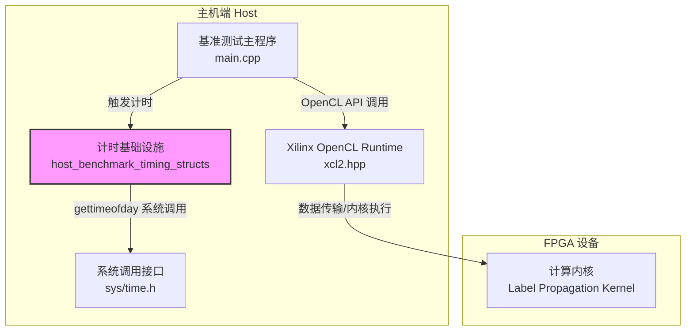
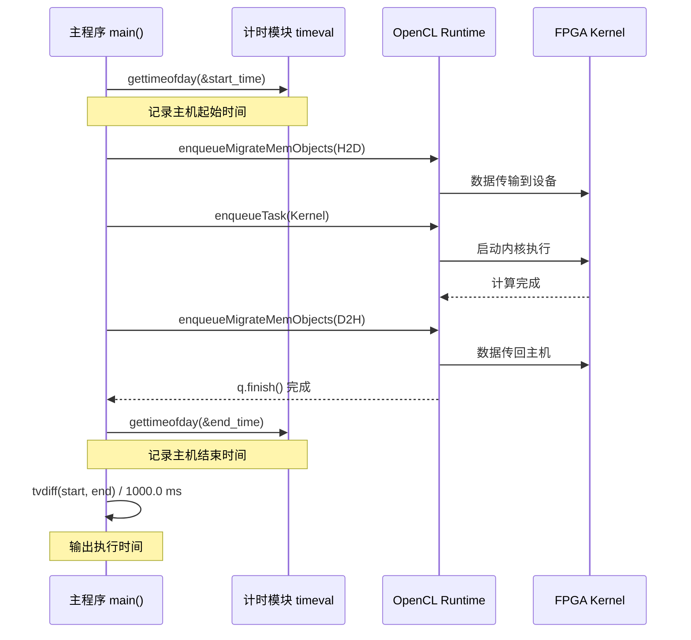

# host_benchmark_timing_structs 模块深度解析

## 概述

`host_benchmark_timing_structs` 是一个跨领域复用的主机端基准测试计时基础设施。它如同一个高精秒表，为 FPGA 内核执行提供微秒级精度的墙钟时间（wall-clock time）测量。该模块被广泛应用于图计算（Label Propagation）、安全校验（Adler32/CRC32）等多个 L1/L2 级基准测试场景，解决的核心问题是：**如何在不依赖设备端 OpenCL Profiling 的情况下，准确测量从数据准备、传输、内核执行到结果回传的端到端主机感知时间**。

与单纯的 OpenCL Event Profiling 不同，该模块基于 POSIX `gettimeofday` 接口，提供的是真实世界的物理时间流逝测量。它弥补了设备端计时的盲区——比如驱动层排队延迟、PCIe 传输启动延迟等无法被 GPU/FPGA 内部计时器捕捉的环节。

## 架构与数据流

### 架构定位

在 FPGA 异构计算基准测试体系中，`host_benchmark_timing_structs` 属于**主机端横切关注点（Cross-cutting Concern）**。它不直接参与业务计算，而是横向贯穿于多个垂直领域（图分析、安全加密、压缩等），提供可复用的观测能力。



### 数据流：一次完整的计时周期

以图分析中的 Label Propagation 基准为例，计时数据流如下：

1. **起始时刻捕捉**：在主机端准备发起 FPGA 计算前，调用 `gettimeofday(&start_time, 0)` 记录起始时间戳。此时计时器捕捉的是用户空间视角的绝对时间点。

2. **FPGA 执行阶段**：主机通过 OpenCL Queue 提交数据传输（H2D）和内核执行任务。此阶段主机线程可能阻塞（`q.finish()`）或异步等待，但物理时间持续流逝。

3. **结束时刻捕捉**：当 OpenCL 队列完成所有任务（数据传输 + 内核执行 + 数据回传），再次调用 `gettimeofday(&end_time, 0)` 捕捉结束时间戳。

4. **时长计算**：通过 `tvdiff(&start_time, &end_time)` 计算两个时间戳之间的微秒级差值，转换为毫秒后输出为 "Execution time"。



## 核心组件详解

### `struct timeval`

**来源**：POSIX 标准（`<sys/time.h>`）

**定义**：
```cpp
struct timeval {
    time_t      tv_sec;     // 秒数（自 Epoch 起）
    suseconds_t tv_usec;    // 微秒数（0 - 999999）
};
```

**角色**：该结构体是整个计时基础设施的**原子时间戳容器**。它不像 `std::chrono` 那样类型安全，但它提供了与操作系统底层直接交互的能力，避免了 C++ 标准库可能引入的额外抽象开销。在 FPGA 基准测试这种对计时精度敏感的场景中，直接使用 POSIX 接口可以减少不确定性的来源。

### `gettimeofday()` 函数

**签名**：`int gettimeofday(struct timeval *tv, struct timezone *tz);`

**使用模式**：
```cpp
struct timeval start_time, end_time;
gettimeofday(&start_time, 0);  // 第二个参数已废弃，传 0
// ... FPGA 执行 ...
gettimeofday(&end_time, 0);
```

**精度与特性**：
- **分辨率**：微秒级（1e-6 秒），实际分辨率取决于硬件时钟源（通常为 1ms - 1us）。
- **时钟类型**：**墙钟时间（Wall-clock Time）**，非 CPU 时间。它捕捉的是物理世界的时间流逝，包括进程等待、I/O 阻塞等所有延迟。
- **非单调性**：这是关键限制。`gettimeofday` 受系统时间调整（NTP 同步、管理员手动调整）影响，理论上可能出现**时间倒流**（end_time < start_time）。在长时间运行的基准测试中需警惕。

### `tvdiff()` 辅助函数

**推测原型**（基于上下文和常见实现模式，实际定义应在 `utils.hpp` 中）：
```cpp
inline long tvdiff(struct timeval* start, struct timeval* end) {
    return (end->tv_sec - start->tv_sec) * 1000000 + (end->tv_usec - start->tv_usec);
}
```

**功能**：计算两个 `timeval` 结构之间的微秒级时间差。注意处理秒级进位的减法（微秒部分可能为负，需借位）。

**输出转换**：
```cpp
// 转换为毫秒（浮点）
float elapsed_ms = tvdiff(&start_time, &end_time) / 1000.0;
// 或使用 OpenCL 风格的微秒转毫秒
float elapsed_ms = ((float)te - (float)ts) / 1000000.0;
```

## 依赖关系分析

### 本模块依赖的上游组件

| 依赖模块 | 依赖类型 | 说明 |
|---------|---------|------|
| `<sys/time.h>` | 系统头文件 | POSIX 标准时间接口，提供 `gettimeofday` 和 `struct timeval` |
| `<iostream>` | 标准库 | 用于输出计时结果到 `std::cout` |
| `utils.hpp` | 项目内部 | 提供 `tvdiff()` 辅助函数，计算时间差 |
| `xf_utils_sw/logger.hpp` | Xilinx 库 | 可选：用于结构化日志输出计时结果（`Logger::Message::TIME_H2D_MS` 等） |

### 依赖本模块的下游组件

根据模块树，`host_benchmark_timing_structs` 被以下基准测试场景直接引用：

1. **[graph_analytics_and_partitioning/l2_connectivity_and_labeling_benchmarks/label_propagation_benchmarks](graph_analytics_and_partitioning-l2_connectivity_and_labeling_benchmarks-label_propagation_benchmarks.md)**
   - 用于测量 Label Propagation 图计算内核的端到端执行时间
   - 代码文件：`graph/L2/benchmarks/label_propagation/host/main.cpp`

2. **[security_crypto_and_checksum/checksum_integrity_benchmarks/adler32_kernel_connectivity](security_crypto_and_checksum-checksum_integrity_benchmarks-adler32_kernel_connectivity.md)**
   - 用于 Adler32 校验和算法的 FPGA 加速基准测试
   - 组件：`security.L1.benchmarks.adler32.host.main.timeval`

3. **[security_crypto_and_checksum/checksum_integrity_benchmarks/crc32_kernel_connectivity](security_crypto_and_checksum-checksum_integrity_benchmarks-crc32_kernel_connectivity.md)**
   - 用于 CRC32 校验和算法的 FPGA 加速基准测试  
   - 组件：`security.L1.benchmarks.crc32.host.main.timeval`

### 数据契约与接口边界

**输入契约**：
- 调用者负责在 FPGA 执行流程的恰当时机点（启动前/完成后）调用计时接口
- 无需外部数据输入，计时器自动捕捉系统时钟

**输出契约**：
- 输出为微秒级精度的长整型时间差（通过 `tvdiff` 计算）
- 结果通常转换为毫秒级浮点数用于人类可读输出（`tvdiff / 1000.0`）
- 与 OpenCL Profiling 数据并行输出（互不影响）

**与 OpenCL Profiling 的关系**：
```
主机计时 (timeval)          OpenCL Profiling Events
     |                              |
     v                              v
总墙钟时间 (~50ms)            细分阶段:
                              - H2D 传输 (~5ms)
                              - Kernel 执行 (~40ms)  
                              - D2H 传输 (~5ms)
```

两者互补：`timeval` 捕捉端到端用户体验时间，OpenCL Profiling 提供设备内部细粒度分析。

## 设计决策与权衡

### 1. 选择 POSIX `gettimeofday` 而非 C++11 `std::chrono`

**决策**：使用 `<sys/time.h>` 中的 `gettimeofday` 和 `struct timeval`

**权衡分析**：

| 方案 | 优点 | 缺点 | 本模块选择理由 |
|------|------|------|----------------|
| **POSIX `gettimeofday`** | 1. 在嵌入式/FPGA 开发环境中兼容性极佳<br>2. 直接映射到系统调用，无 C++ 运行时依赖<br>3. 代码意图明确，无模板元编程复杂度 | 1. 非单调时钟（受 NTP 影响）<br>2. POSIX 已标记为废弃（推荐使用 `clock_gettime`）<br>3. 微秒精度在某些场景下不足 | FPGA 基准测试通常运行时间短（毫秒级），环境可控（无 NTP 剧烈跳变），优先选择简单、可移植、无依赖的方案 |
| **C++11 `std::chrono`** | 1. 类型安全（区分 time_point 和 duration）<br>2. 支持高分辨率时钟（`high_resolution_clock`）<br>3. 标准可移植性 | 1. 某些 FPGA 开发板工具链可能只支持 C++98<br>2. 时钟源实现依赖操作系统，可能非单调<br>3. 模板语法增加代码复杂度 | 在需要纳秒级精度或现代 C++ 类型安全时选用，但本模块追求极简 |
| **`clock_gettime(CLOCK_MONOTONIC)`** | 1. 单调时钟，不受系统时间调整影响<br>2. 纳秒级精度（timespec） | 1. 较新的 POSIX 标准，极老旧系统可能不支持<br>2. 仍为系统调用，有轻微开销 | 长时间运行（小时级）基准测试的首选，但本模块针对短周期测试 |

**核心洞见**：在 FPGA 基准测试场景下，**简单性优于绝对精度**。`gettimeofday` 提供了足够的微秒级分辨率来测量毫秒级的 FPGA 内核执行，且代码直观，不引入 C++11 依赖，非常适合需要在不同版本工具链和操作系统上运行的硬件加速基准测试套件。

### 2. 墙钟时间 vs CPU 时间的取舍

**决策**：使用 `gettimeofday` 测量**墙钟时间（Wall-clock Time）**而非 `clock()` 测量的 CPU 时间。

**设计理由**：
- FPGA 异构计算的本质是**主机等待设备完成工作**。在 `q.finish()` 阻塞期间，主机 CPU 可能处于空闲或忙碌等待状态，但流逝的物理时间（墙钟时间）才是用户感知到的总延迟。
- 若使用 CPU 时间，会严重低估实际执行时间（例如：主机等待 10 秒，CPU 只会计费几毫秒的轮询开销），导致基准测试结果失去实际参考价值。

**权衡**：
- **优点**：反映真实用户体验，包含 PCIe 传输延迟、驱动层调度延迟、内核执行时间等全链路耗时。
- **缺点**：受系统负载影响（若主机同时运行其他进程，墙钟时间会被拉长）。基准测试需在受控环境中运行。

### 3. 与 OpenCL Profiling 的双轨制设计

**决策**：同时使用 `timeval`（主机计时）和 OpenCL Profiling Events（设备计时），两者互补输出。

**架构合理性**：
- **主机计时 (`timeval`)**：测量端到端总延迟，包含 OpenCL 运行时开销、PCIe 传输启动延迟、驱动层处理时间。这些是设备端计时器无法捕捉的。
- **设备计时 (`CL_PROFILING_COMMAND_START/END`)**：精确测量内核在 FPGA 上的实际执行时间，以及 H2D/D2H 传输的带宽利用率。

**数据校验价值**：
- 若 `timeval` 总时间 >> OpenCL Profiling 各阶段之和，说明存在显著的运行时开销或传输延迟，需优化主机端流水线。
- 若两者接近，说明 FPGA 计算是瓶颈，主机端开销可忽略。

## 使用指南与最佳实践

### 基本使用模式

```cpp
#include <sys/time.h>
#include <iostream>

// 1. 声明 timeval 结构体
struct timeval start_time, end_time;

// 2. 在 FPGA 操作前记录起始时间
gettimeofday(&start_time, 0);

// 3. 执行 FPGA 相关操作（数据传输 + 内核执行）
q.enqueueMigrateMemObjects(...);
q.enqueueTask(kernel);
q.finish();

// 4. 在 FPGA 操作完成后记录结束时间
gettimeofday(&end_time, 0);

// 5. 计算并输出时间差（假设 tvdiff 在 utils.hpp 中定义）
long elapsed_us = tvdiff(&start_time, &end_time);
float elapsed_ms = elapsed_us / 1000.0f;
std::cout << "Total execution time: " << elapsed_ms << " ms" << std::endl;
```

### 与 OpenCL Profiling 结合使用

在实际基准测试中，应同时捕获主机计时和设备计时，形成完整的性能画像：

```cpp
// 主机计时（墙钟时间）
gettimeofday(&start_time, 0);

// OpenCL 事件对象，用于捕获设备级计时
cl::Event evt_write, evt_kernel, evt_read;

// 执行数据传输和内核（带事件跟踪）
q.enqueueMigrateMemObjects(ob_in, 0, nullptr, &evt_write);
q.enqueueTask(LPKernel, &events_write, &evt_kernel);
q.enqueueMigrateMemObjects(ob_out, 1, &events_kernel, &evt_read);
q.finish();

gettimeofday(&end_time, 0);

// 输出主机总时间
std::cout << "Host wall-clock time: " 
          << tvdiff(&start_time, &end_time) / 1000.0 << " ms" << std::endl;

// 输出设备细分时间
cl_ulong ts, te;
evt_write.getProfilingInfo(CL_PROFILING_COMMAND_START, &ts);
evt_write.getProfilingInfo(CL_PROFILING_COMMAND_END, &te);
std::cout << "H2D Transfer: " << (te - ts) / 1e6 << " ms" << std::endl;

evt_kernel.getProfilingInfo(CL_PROFILING_COMMAND_START, &ts);
evt_kernel.getProfilingInfo(CL_PROFILING_COMMAND_END, &te);
std::cout << "Kernel Execution: " << (te - ts) / 1e6 << " ms" << std::endl;
```

## 边界情况与潜在陷阱

### 1. 时钟非单调性风险

**问题**：`gettimeofday` 返回的是挂钟时间（wall-clock time），受系统时间调整影响（NTP 同步、管理员手动修改时间）。如果在基准测试执行期间系统时间被回调，可能出现 `end_time < start_time` 的异常情况，导致计算出的时间差为负数。

**缓解措施**：
- 确保基准测试在受控环境中运行，避免 NTP 剧烈跳变。
- 对计算结果进行合理性检查：
```cpp
long elapsed = tvdiff(&start_time, &end_time);
if (elapsed < 0) {
    std::cerr << "Warning: Negative time elapsed, possible clock adjustment" << std::endl;
    elapsed = 0; // 或标记为无效数据
}
```
- 对于长时间运行的测试（小时级），考虑使用 `clock_gettime(CLOCK_MONOTONIC)` 替代（需修改模块实现）。

### 2. 精度与开销权衡

**问题**：`gettimeofday` 是一个系统调用（syscall），虽然现代 Linux 内核通过 vDSO（virtual Dynamic Shared Object）优化已使其开销降至纳秒级，但在极高频率（百万次/秒）的采样场景下仍可能成为瓶颈。

**现状评估**：在 FPGA 基准测试中，计时粒度为**整个内核执行周期**（通常毫秒级），`gettimeofday` 的开销（约 20-50 纳秒）相对于测量对象（1,000,000,000 纳秒）可忽略不计（误差 < 0.0001%）。

**边界情况**：若未来扩展到微秒级内核的细粒度流水线采样，需评估是否改用基于 CPU 时间戳计数器（TSC）的 `rdtsc` 指令（无系统调用开销，但有 CPU 频率变化和多核同步问题）。

### 3. 线程安全性

**问题**：`gettimeofday` 本身是线程安全函数（可重入），但模块中使用的 `struct timeval` 变量通常是局部变量或全局单例。如果在多线程环境中共享同一个 `timeval` 实例进行并发读写，将产生数据竞争（Data Race）。

**使用约束**：
- **单线程模式**：当前模块设计假设为单线程基准测试主流程。`start_time` 和 `end_time` 定义在 `main()` 函数的栈上，天然线程隔离。
- **多线程扩展警告**：若需扩展为主线程 + 工作线程模式，每个线程必须使用独立的 `timeval` 实例，或通过互斥锁保护共享计时器。

### 4. 时间差计算溢出风险

**问题**：`tvdiff` 函数计算 `(end.tv_sec - start.tv_sec) * 1000000 + (end.tv_usec - start.tv_usec)`。虽然 `timeval` 的 `tv_sec` 通常是 64 位（`time_t`），在 32 位系统上可能是 32 位。对于极长时间的运行（超过约 68 年连续运行），32 位 `tv_sec` 可能溢出，但现实中可忽略。

**微秒级溢出**：更现实的场景是 `tv_usec` 差值计算。`tv_usec` 范围是 0-999999，直接相减不会溢出，但如果在 `tvdiff` 中先乘后加，需确保使用 64 位整数类型（`long long`）避免 32 位 `long` 溢出（在 32 位 Linux 上 `long` 为 32 位，最大约 2^31-1 ≈ 2.1e9 微秒 ≈ 35 分钟，超出此时间的基准测试会导致溢出）。

**修正建议**：`tvdiff` 实现应显式使用 64 位类型：
```cpp
inline long long tvdiff(struct timeval* start, struct timeval* end) {
    return (end->tv_sec - start->tv_sec) * 1000000LL + (end->tv_usec - start->tv_usec);
}
```

## 扩展与定制

### 添加单调时钟支持

若需避免 NTP 跳变影响，可条件编译支持 `clock_gettime`：

```cpp
#ifdef USE_MONOTONIC_CLOCK
    #include <time.h>
    struct timespec start_time, end_time;
    clock_gettime(CLOCK_MONOTONIC, &start_time);
#else
    struct timeval start_time, end_time;
    gettimeofday(&start_time, nullptr);
#endif
```

### 高精度采样扩展

对于需要纳秒级精度的场景，可封装 CPU 时间戳计数器（TSC）：

```cpp
#include <x86intrin.h>

inline uint64_t rdtsc() {
    return __rdtsc();
}

// 注意：需固定 CPU 频率并处理多核同步
```

## 参考链接

- **直接使用者**：
  - [Label Propagation 基准测试](graph_analytics_and_partitioning-l2_connectivity_and_labeling_benchmarks-label_propagation_benchmarks.md) - 图分析领域的主要使用场景
  - [Adler32 安全校验](security_crypto_and_checksum-checksum_integrity_benchmarks-adler32_kernel_connectivity.md) - 安全领域应用
  - [CRC32 安全校验](security_crypto_and_checksum-checksum_integrity_benchmarks-crc32_kernel_connectivity.md) - 安全领域应用

- **相关基础设施**：
  - `utils.hpp` - 提供 `tvdiff()` 辅助函数
  - `xf_utils_sw/logger.hpp` - Xilinx 日志框架，用于结构化输出计时结果
  - OpenCL Runtime (xcl2.hpp) - 提供设备级 Profiling 能力，与主机计时形成互补

---

*文档版本：基于 core component `graph.L2.benchmarks.label_propagation.host.main.timeval` 及相关安全校验模块代码分析生成*