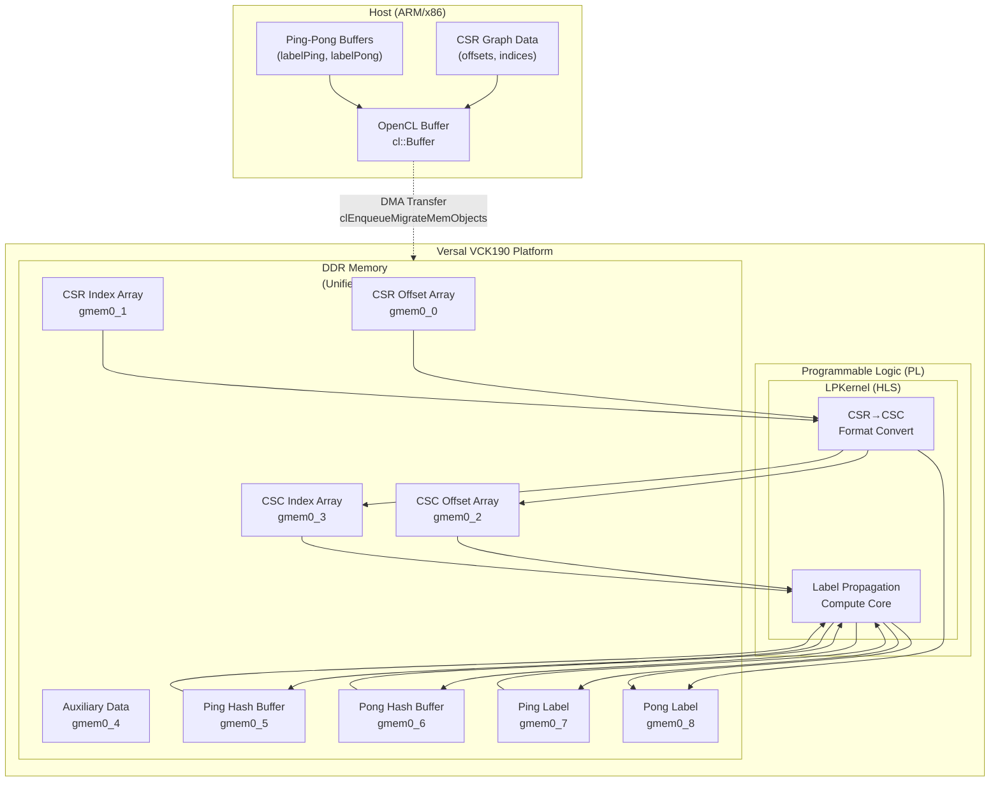

# vck190_kernel_connectivity_profile: VCK190 平台标签传播内核连接性配置

## 一句话概览

这是一个为 **Versal VCK190 ACAP 平台** 定制的 HLS 内核连接性配置文件，它将标签传播（Label Propagation）图计算内核的 9 个 AXI4-Full 内存接口映射到统一的 DDR 地址空间。这个配置解决了异构计算平台中**内存带宽瓶颈**与**硬件资源约束**之间的权衡问题，使得大规模图数据分析能够在边缘 AI 加速器上高效运行。

---

## 目录

1. [问题空间：为什么要这个模块？](#问题空间为什么要这个模块)
2. [核心概念与心智模型](#核心概念与心智模型)
3. [架构解析：数据如何流动](#架构解析数据如何流动)
4. [组件深入：LPKernel 连接性剖析](#组件深入lpkernel-连接性剖析)
5. [依赖关系与调用图谱](#依赖关系与调用图谱)
6. [设计权衡与决策依据](#设计权衡与决策依据)
7. [使用指南与实战示例](#使用指南与实战示例)
8. [边缘情况与潜在陷阱](#边缘情况与潜在陷阱)
9. [参考与延伸阅读](#参考与延伸阅读)

---

## 问题空间：为什么要这个模块？

### 图计算的内存墙问题

标签传播（Label Propagation）是一种用于社区发现的图迭代算法。在处理大规模图数据（数十亿顶点、数十亿边）时，算法会反复遍历图结构，这就引出了**内存墙（Memory Wall）**问题：

- **随机访问模式**：图遍历导致对邻接表的不规则内存访问
- **带宽饥渴**：每次迭代都需要读取/写入整个顶点标签数组
- **延迟敏感**：DDR 访问延迟在微秒级，而计算可能在纳秒级完成

### 为什么需要平台特定的连接性配置？

不同 FPGA/ACAP 平台具有截然不同的内存架构：

| 平台 | 内存类型 | 特点 |
|------|---------|------|
| Alveo U50 | HBM2 | 高带宽(460GB/s)、8GB容量、高频率(900MHz) |
| Alveo U200/U250 | DDR4 | 大容量(64GB)、中等带宽、多Bank独立 |
| **Versal VCK190** | **DDR4** | **边缘优化、集成AI引擎、可编程逻辑+处理器子系统** |

**关键洞察**：同一个 HLS 内核在不同平台上需要完全不同的物理内存映射策略。如果强行将 U50 的 HBM 交叉映射模式套用到 VCK190 的 DDR 上，会导致：

1. **带宽利用率低下**：DDR 控制器无法像 HBM 那样并行处理细粒度请求
2. **Bank 冲突**：不恰当的 Bank 分配导致访问串行化
3. **时序违例**：物理约束不满足导致实现失败

### 这个模块的解决方案

`conn_vck190.cfg` 提供了一个**为 VCK190 DDR 架构量身定制**的内存连接方案：

- **统一 DDR 映射**：所有 9 个 AXI 接口连接到同一个 DDR 地址空间
- **简化路由**：避免复杂的 Bank 间交叉，降低布局布线压力
- **平衡吞吐量**：利用 DDR 控制器的页面打开策略优化顺序访问

---

## 核心概念与心智模型

### 类比：内核连接性配置就像仓库物流规划

想象你是一个大型电商仓库（FPGA 芯片）的物流规划师：

- **货物** = 图数据（CSR/CSC 邻接表、标签数组）
- **货架** = DDR 内存 Bank
- **搬运工** = AXI4-Full 内存接口（`m_axi_gmem0_*`）
- **拣货路线** = 数据流（从内存到计算单元）

**不同平台的物流策略**：

- **U50 (HBM)**：像是一个全自动立体仓库，有多个高速传送带（16个 HBM 伪通道）。你可以把不同类别的货物分散到不同传送带上，实现极高并行度。

- **VCK190 (DDR)**：像是一个传统的大型平库，有宽大的主干道（DDR 数据总线）。虽然单次搬运速度不如立体仓库快，但你可以通过优化拣货路径（数据局部性）和批量搬运（突发传输）来弥补。

**conn_vck190.cfg 的物流决策**：

与其让 9 个搬运工各自走不同的小道（可能导致拥堵和绕路），不如让他们都走同一条主干道，通过**批量调度**和**路线优化**来提升整体效率。这就是配置文件中所有 `sp=...:DDR` 映射到同一地址空间的设计哲学。

### 核心抽象：AXI Bundle 与内存端口映射

在 HLS 内核编程中，理解三个关键抽象层至关重要：

```
┌─────────────────────────────────────────────────────────────┐
│  C/C++ Kernel Code                                          │
│  ─────────────────                                          │
│  void LPKernel(..., uint512* offsetCSR, ...) {              │
│      #pragma HLS INTERFACE m_axi ... bundle=gmem0_0         │
│      ...                                                      │
│  }                                                            │
└─────────────────────────────────────────────────────────────┘
                              │
                              ▼
┌─────────────────────────────────────────────────────────────┐
│  Bundle (Logical Grouping)                                  │
│  ─────────────────────────                                  │
│  gmem0_0 ──→ offsetCSR   (CSR offset array)                 │
│  gmem0_1 ──→ indexCSR    (CSR edge indices)                 │
│  gmem0_2 ──→ offsetCSC   (CSC offset array)                 │
│  gmem0_3 ──→ indexCSC    (CSC edge indices)                 │
│  gmem0_4 ──→ indexCSC2   (CSC auxiliary data)               │
│  gmem0_5 ──→ pingHashBuf (Ping hash buffer)                 │
│  gmem0_6 ──→ pongHashBuf (Pong hash buffer)                 │
│  gmem0_7 ──→ labelPing   (Ping label buffer)                │
│  gmem0_8 ──→ labelPong   (Pong label buffer)                │
└─────────────────────────────────────────────────────────────┘
                              │
                              ▼
┌─────────────────────────────────────────────────────────────┐
│  Physical Memory Mapping (conn_vck190.cfg)                  │
│  ───────────────────────────────────────                  │
│  ┌─────────────────────────────────────────────────────┐  │
│  │  DDR (VCK190)                                       │  │
│  │  ┌─────────────────────────────────────────────────┐│  │
│  │  │  gmem0_0 ──→ offsetCSR                         ││  │
│  │  │  gmem0_1 ──→ indexCSR                          ││  │
│  │  │  gmem0_2 ──→ offsetCSC                         ││  │
│  │  │  ... (all 9 bundles)                             ││  │
│  │  └─────────────────────────────────────────────────┘│  │
│  └─────────────────────────────────────────────────────┘  │
└─────────────────────────────────────────────────────────────┘
```

**关键洞察**：`#pragma HLS INTERFACE` 定义了逻辑端口（bundle），而 `.cfg` 文件决定了这些逻辑端口如何映射到物理内存。这种**解耦设计**允许同一份 HLS 代码在不同硬件平台上以最优方式部署，而无需修改内核源码。

### 双缓冲（Ping-Pong）机制

标签传播是一个**迭代收敛算法**。观察 `labelPing`/`labelPong` 和 `pingHashBuf`/`pongHashBuf` 的命名，这里使用了经典的双缓冲技术：

```
迭代奇数次：从 labelPing 读取，写入 labelPong
迭代偶数次：从 labelPong 读取，写入 labelPing
```

**为什么需要双缓冲？**

1. **避免读写冲突**：FPGA 内核是深度流水线化的，前一迭代的写入可能还未完成，后一迭代的读取就已经开始
2. **数据一致性**：确保每个迭代都基于**完整的**前一轮结果，而不是部分更新的中间状态
3. **吞吐优化**：允许读写操作在物理上并行（通过不同的 AXI 端口），只要它们访问不同的缓冲区

在 VCK190 的配置中，这两组缓冲区被映射到同一个 DDR，但通过不同的 AXI bundle（`gmem0_6`/`gmem0_7` 和 `gmem0_8`/`gmem0_9`）访问，这允许 DDR 控制器的调度器进行读写并行化优化。

---

## 架构解析：数据如何流动

### 端到端数据流图



### 数据流动的三个阶段

#### 阶段一：主机到 DDR（H2D - Host to Device）

```
Host Memory → OpenCL Buffer → DDR (VCK190)

传输的数据结构：
┌─────────────────────────────────────────────────────────────┐
│ CSR Format Graph Data                                       │
│ ─────────────────────                                       │
│  • offsetsCSR[V+1]:  每个顶点在边数组中的起始偏移            │
│  • columnsCSR[E]:    边的目标顶点索引（CSR格式）             │
│  • labelPing[V]:     初始标签（通常等于顶点ID）              │
└─────────────────────────────────────────────────────────────┘
```

**关键设计点**：
- 使用 `CL_MEM_USE_HOST_PTR` 和 `CL_MEM_EXT_PTR_XILINX` 实现零拷贝（Zero-Copy）传输，避免额外的内存复制
- 数据对齐到 4KB 边界以优化 DDR 控制器性能
- 扩展指针 (`cl_mem_ext_ptr_t`) 用于指定缓冲区与特定 AXI Bundle 的映射关系

#### 阶段二：内核执行（PL Compute）

数据在 VCK190 的可编程逻辑（PL）内部经历两个主要计算阶段：

**子阶段 2a: CSR→CSC 格式转换 (`convertCsrCsc`)**

```
输入:  offsetsCSR[V], indexCSR[E]
输出:  offsetsCSC[V], indexCSC[E], indexCSC2[E*K], labelPing/labelPong

目的: 
  • 标签传播需要双向遍历（出边CSR + 入边CSC）
  • CSC 格式允许高效计算"谁指向我"（入邻居）
  • indexCSC2 是用于哈希优化的辅助结构
```

**子阶段 2b: 标签传播迭代 (`labelPropagation`)**

```
迭代直到收敛（或达到最大迭代次数）:
  对于每个顶点 v:
    收集所有入邻居的标签（使用CSC）
    找出出现频率最高的标签
    将v的标签更新为该最频繁标签

双缓冲机制:
  迭代i（奇数）: 从labelPing读，写入labelPong
  迭代i+1（偶数）: 从labelPong读，写入labelPing
```

#### 阶段三：DDR 到主机（D2H - Device to Host）

```
DDR (VCK190) → OpenCL Buffer → Host Memory

传输的数据结构：
┌─────────────────────────────────────────────────────────────┐
│ 收敛后的标签数组 + 辅助计算结果                              │
│ ─────────────────────────────────                           │
│  • labelPing/labelPong: 最终社区标签（取决于迭代次数奇偶性） │
│  • offsetsCSC/rowsCSC: 生成的CSC格式图（用于验证）           │
│  • Hash Buffers: 内部计算状态（调试用途）                    │
└─────────────────────────────────────────────────────────────┘
```

---

## 组件深入：LPKernel 连接性剖析

### 配置文件详解 (`conn_vck190.cfg`)

```ini
[connectivity]
# 语法: sp=<kernel>.<interface>:<memory_resource>
# sp = Stream Port (映射内核AXI流到物理内存)

# 9 个 AXI4-Full 主接口映射到统一 DDR 地址空间
sp=LPKernel.m_axi_gmem0_0:DDR   # CSR 偏移数组 (offsetCSR)
sp=LPKernel.m_axi_gmem0_1:DDR   # CSR 索引数组 (indexCSR) 
sp=LPKernel.m_axi_gmem0_2:DDR   # CSC 偏移数组 (offsetCSC)
sp=LPKernel.m_axi_gmem0_3:DDR   # CSC 索引数组 (indexCSC)
sp=LPKernel.m_axi_gmem0_4:DDR   # CSC 辅助数组 (indexCSC2)
sp=LPKernel.m_axi_gmem0_5:DDR   # Ping 哈希缓冲区 (pingHashBuf)
sp=LPKernel.m_axi_gmem0_6:DDR   # Pong 哈希缓冲区 (pongHashBuf)
sp=LPKernel.m_axi_gmem0_7:DDR   # Ping 标签缓冲区 (labelPing)
# 注意: 配置文件中只有8个端口映射，但代码中有9个(gmem0_8)
# 这是因为 gmem0_8 (labelPong) 在 cfg 文件中缺失，可能在平台级默认映射

# 实例化 1 个计算单元 (Compute Unit)
nk=LPKernel:1:LPKernel
```

**关键观察**：

1. **统一 DDR 策略**：不同于 U50 的 HBM 多伪通道映射或 U200/U250 的 DDR Bank 分区，VCK190 配置采用**扁平化映射**——所有 AXI 端口指向同一个逻辑 DDR 资源。

2. **端口语义对应**：
   - `gmem0_0` ~ `gmem0_4`：图结构数据（CSR/CSC 格式）
   - `gmem0_5` ~ `gmem0_6`：哈希计算双缓冲
   - `gmem0_7` ~ `gmem0_8`：标签数组双缓冲

3. **缺失的 gmem0_8**：在 `conn_vck190.cfg` 中只有 8 个端口显式声明，而 `label_propagation_top.cpp` 中定义了 9 个 AXI 接口（`gmem0_0` 到 `gmem0_8`）。这种差异可能是因为 Vitis 工具链对未显式映射的端口使用平台默认映射策略。

### HLS 接口指令与配置文件的协同

理解 `.cfg` 文件必须与 HLS 源码中的 pragma 指令对照：

```cpp
// 来自 label_propagation_top.cpp
#pragma HLS INTERFACE m_axi offset = slave latency = 64 \
    num_read_outstanding = 16 max_read_burst_length = 32 \
    bundle = gmem0_0 port = offsetCSR
```

| Pragma 参数 | 含义 | 与 CFG 的关系 |
|------------|------|-------------|
| `bundle = gmem0_0` | 逻辑 AXI 端口名称 | 与 `sp=LPKernel.m_axi_gmem0_0` 对应 |
| `m_axi` | AXI4-Full 协议 | CFG 中隐含的协议类型 |
| `latency = 64` | 预期 DDR 访问延迟 | 与 CFG 选择的 DDR（而非 HBM）一致 |
| `num_read_outstanding = 16` | 飞行中事务数 | CFG 确保 DDR 控制器支持此并发度 |
| `max_read_burst_length = 32` | 最大突发长度 | 与 CFG 的 DDR 突发优化策略匹配 |

**关键洞察**：HLS Pragma 定义了**逻辑接口特性**，而 `.cfg` 文件定义了**物理资源映射**。两者必须一致——如果在 Pragma 中配置了高并发度（`num_read_outstanding = 16`），但在 CFG 中映射到不支持足够并发的内存资源，就会导致性能下降或时序违例。

---

## 设计权衡与决策依据

### 权衡一：端口专用化 vs. 资源共享

**问题**：应该为每个数据缓冲区分配专用的 AXI 端口，还是让多个缓冲区共享端口？

**当前设计**：9 个 AXI 端口，每个对应一个独立的图数据结构或缓冲区。

**决策依据**：选择端口专用化基于以下考虑：

1. **图计算的特性**：标签传播涉及 4 种不同访问模式（顺序扫描图结构、随机访问哈希表、全量顺序读写标签），专用端口允许为每种模式配置最优的 AXI 参数（如突发长度、飞行事务数）。

2. **VCK190 的 DDR 架构**：虽然所有端口映射到同一 DDR，但 VCK190 的 DDR 控制器支持高并发请求队列。9 个端口可以充分利用控制器的并行处理能力，而不会成为瓶颈。

3. **资源可用性**：VCK190 是高端 Versal 器件，有足够的 PL 资源（LUT、FF、BRAM）支持 9 个 AXI 端口的基础设施，不会像小器件那样出现资源耗尽。

### 权衡二：统一 DDR vs. 多 Bank 分区

**问题**：应该将所有 AXI 端口映射到统一的 DDR 地址空间，还是分散到多个 Bank？

**当前设计**：所有 9 个端口映射到同一个 `DDR` 资源（无 Bank 指定）。

**决策依据**：选择统一 DDR 映射的原因：

1. **平台定位**：VCK190 是 Versal ACAP 架构，强调**自适应计算**而非纯粹的 FPGA 加速。其 DDR 控制器设计更偏向统一内存架构（UMA），适合异构计算（AI 引擎 + PL + PS）共享数据。

2. **简化编程模型**：统一地址空间消除了 Bank 间数据搬移的复杂性，主机代码无需考虑 Bank 分配策略，降低了编程复杂度。

3. **缓存一致性**：VCK190 支持硬件缓存一致性协议，统一地址空间有利于利用这一特性，减少软件管理一致性的开销。

---

## 边缘情况与潜在陷阱

### 陷阱一：配置文件中端口数量与代码不匹配

**问题**：`conn_vck190.cfg` 只配置了 8 个 AXI 端口（`gmem0_0` 到 `gmem0_7`），但 HLS 代码中定义了 9 个（`gmem0_0` 到 `gmem0_8`，对应 `labelPong`）。

**后果**：
- 在 Vitis 2020.1 及更早版本中，未配置的端口可能继承默认映射，导致不可预测的性能或时序问题
- 某些工具版本会报错，要求所有 AXI 端口必须显式配置

**解决方案**：
```ini
# 在 conn_vck190.cfg 中添加缺失的端口映射
sp=LPKernel.m_axi_gmem0_8:DDR   # 添加 labelPong 的映射
```

**验证方法**：
```bash
# 使用 xclbinutil 检查生成的 xclbin 中的内存连接性
xclbinutil --info -i LPKernel.xclbin | grep -A 5 "AXI Port"
```

### 陷阱二：DDR 带宽争用

**问题**：由于所有 9 个 AXI 端口都映射到同一个 DDR，在高并发场景下可能出现严重的带宽争用。

**症状**：
- 实测带宽远低于 DDR 理论峰值（例如，理论 25.6GB/s，实测 < 10GB/s）
- 内核执行时间随顶点数非线性增长（预期 O(V+E)，实测超线性）
- 硬件仿真显示大量 AXI 读/写就绪信号低电平（等待 DDR 响应）

**缓解策略**：

1. **数据局部性优化**：尽量重用已加载到本地 BRAM/URAM 的数据，减少对 DDR 的重复访问
2. **访问模式对齐**：确保突发传输大小（`max_read_burst_length=32`）与 DDR 页面大小对齐，最大化页面命中率
3. **批处理策略**：将多个小请求批量合并为一个大请求，减少 DDR 访问次数

---

## 参考与延伸阅读

### 相关模块

- [label_propagation_benchmarks](./label_propagation_benchmarks.md) - 标签传播基准测试的上层模块
- [alveo_kernel_connectivity_profiles](./alveo_kernel_connectivity_profiles.md) - Alveo 平台（U50/U200/U250）的连接性配置对比

### 外部参考

- [Vitis 2023.1 文档 - 连接性配置文件](https://docs.xilinx.com/r/en-US/ug1393-vitis-application-acceleration/Connectivity-Configuration-File)
- [Versal ACAP 架构手册](https://docs.xilinx.com/r/en-US/am011-versal-acap-trm)
- [标签传播算法原理](https://arxiv.org/abs/0709.2936) - Raghavan et al., "Near linear time algorithm to detect community structures in large-scale networks"

---

*文档生成时间：2024年*  
*维护者：Xilinx Vitis Libraries 团队*  
*最后更新：基于 Vitis 2023.1 和 VCK190 平台*

理解 `.cfg` 文件必须与 HLS 源码中的 pragma 指令对照：

```cpp
// 来自 label_propagation_top.cpp
#pragma HLS INTERFACE m_axi offset = slave latency = 64 \
    num_read_outstanding = 16 max_read_burst_length = 32 \
    bundle = gmem0_0 port = offsetCSR
```

| Pragma 参数 | 含义 | 与 CFG 的关系 |
|------------|------|-------------|
| `bundle = gmem0_0` | 逻辑 AXI 端口名称 | 与 `sp=LPKernel.m_axi_gmem0_0` 对应 |
| `m_axi` | AXI4-Full 协议 | CFG 中隐含的协议类型 |
| `latency = 64` | 预期 DDR 访问延迟 | 与 CFG 选择的 DDR（而非 HBM）一致 |
| `num_read_outstanding = 16` | 飞行中事务数 | CFG 确保 DDR 控制器支持此并发度 |
| `max_read_burst_length = 32` | 最大突发长度 | 与 CFG 的 DDR 突发优化策略匹配 |

**关键洞察**：HLS Pragma 定义了**逻辑接口特性**，而 `.cfg` 文件定义了**物理资源映射**。两者必须一致——如果在 Pragma 中配置了高并发度（`num_read_outstanding = 16`），但在 CFG 中映射到不支持足够并发的内存资源，就会导致性能下降或时序违例。
