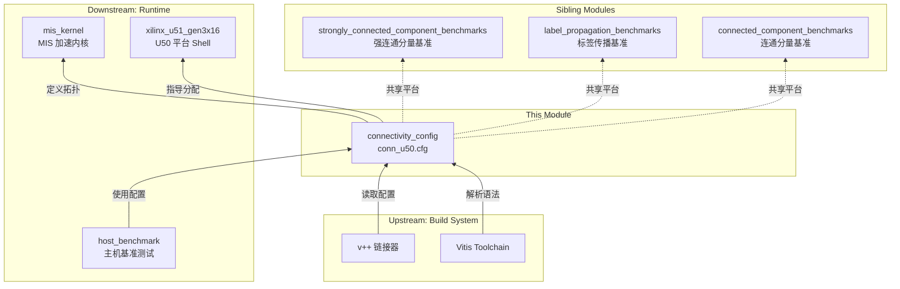

# connectivity_config 模块技术深度解析

## 1. 开篇：30 秒理解这个模块

**`connectivity_config`** 是 Xilinx Vitis 平台的**硬件连接配置文件**，专门为 **Maximal Independent Set (MIS) 最大独立集算法** 的 FPGA 加速内核定义内存访问拓扑。它像一张"电路接线图"，精确指定了内核的每一个数据端口应该连接到哪些 HBM (High Bandwidth Memory) 物理通道，确保图算法在处理大规模邻接表时获得最大化的内存带宽利用率。

---

## 2. 问题空间：为什么需要这个模块？

### 2.1 图算法的内存访问挑战

Maximal Independent Set 是图计算中的经典问题：给定一个图，找到一个最大的顶点集合，使得集合中任意两个顶点之间没有边相连。这类算法的核心计算模式是：

1. **大规模邻接表遍历** —— 需要频繁读取图结构数据（边列表、顶点属性）
2. **随机访问模式** —— 图遍历的内存访问通常不规则，难以预测
3. **高带宽需求** —— 处理百万级/十亿级边需要巨大的数据吞吐能力

### 2.2 FPGA 加速的内存子系统复杂性

现代 FPGA 加速卡（如 Xilinx U50）配备 HBM (High Bandwidth Memory)，提供：

- **32 个独立的 HBM 通道**（HBM[0] ~ HBM[31]）
- **高达 460 GB/s 的总带宽**
- **独立的内存控制器**，可并行访问

**核心挑战**：如何将内核的多个数据端口映射到这些物理通道，以最大化并行性和带宽利用率？

### 2.3 朴素的连接方案为何失败

**方案 A：单通道集中式**
```
所有数据端口 → HBM[0] 单一通道
```
❌ **失败原因**：所有访问竞争同一内存控制器，带宽被限制在 ~14 GB/s，成为严重瓶颈。

**方案 B：完全随机映射**
```
端口随机分配到 HBM 通道
```
❌ **失败原因**：如果共享相邻数据的端口被分散到不同通道，会导致跨通道的数据依赖和同步开销。

**方案 C：静态均匀分布**
```
每个端口固定分配到独立通道，不考虑数据关联
```
⚠️ **次优原因**：忽略了算法的数据访问模式。MIS 内核中某些端口（如 `indices` 邻接表）需要高带宽，而其他端口（如 `offset` 偏移量表）访问频率较低。

---

## 3. 解决方案：连接配置的设计洞察

### 3.1 核心设计原则

**`connectivity_config`** 采用 **"领域感知的数据并行分区"** 策略：

| 设计原则 | 实现方式 | 理论依据 |
|---------|---------|---------|
| **端口隔离** | 将读写特性不同的端口绑定到独立 HBM 通道 | 避免读写竞争，降低调度复杂度 |
| **数据亲和性分组** | 访问相同逻辑数据结构的端口共享 HBM 通道子集 | 保持数据局部性，减少跨通道同步 |
| **带宽需求分级** | 高频访问端口（邻接表）绑定到独立高带宽通道 | 最大化关键路径吞吐量 |

### 3.2 类比：机场货运物流系统

想象 FPGA 是大型货运机场，HBM 通道是独立的货运航站楼：

- **单一航站楼集中处理** → 所有货物拥挤在一个建筑，装卸效率极低
- **随机分配航站楼** → 需要跨航站楼转运的货物被迫经过复杂的地面交通
- **航线感知分配** → 同一航线的货物进入相邻航站楼，中转航线安排在互通的航站楼组

**`connectivity_config`** 就是这张优化的航站楼分配表，确保每一类货物（数据）都通过最高效的路径流动。

---

## 4. 架构解析：组件与数据流

### 4.1 配置文件结构

```
conn_u50.cfg ───────────────────────────────────────────────┐
│                                                            │
├── platform=xilinx_u51_gen3x16_xdma_5_202210_1  ◄── 目标平台  │
├── debug=1                                       ◄── 调试开关 │
├── save-temps=1                                  ◄── 保留中间 │
│                                                            │
└── [connectivity]  ◄── 连接配置段 ──────────────────────────┘
     ├── nk=mis_kernel:1:mis_kernel              ◄── 内核实例
     ├── sp=mis_kernel.offset:HBM[0]            ◄── 偏移量表
     ├── sp=mis_kernel.indices:HBM[1:2]           ◄── 邻接表索引 (2通道)
     ├── sp=mis_kernel.C_group_0:HBM[3]         ◄── 候选集组0
     ├── sp=mis_kernel.C_group_1:HBM[4]         ◄── 候选集组1
     ├── sp=mis_kernel.S_group_0:HBM[5]         ◄── 状态集组0
     ├── sp=mis_kernel.S_group_1:HBM[6]         ◄── 状态集组1
     └── sp=mis_kernel.res_out:HBM[7]          ◄── 结果输出
```

### 4.2 组件详解

#### 4.2.1 内核实例定义

```cfg
nk=mis_kernel:1:mis_kernel
```

| 字段 | 含义 | 说明 |
|-----|------|------|
| `mis_kernel` (第1个) | 内核函数名 | RTL/AI Engine 或 HLS 生成的内核顶层函数名 |
| `1` | 实例数量 | 在 FPGA 上实例化的该内核副本数量，此处为1个实例 |
| `mis_kernel` (第2个) | 实例名 | 在 OpenCL 运行时中引用此实例的标识符 |

**设计意图**：MIS 算法在一个 U50 卡上运行单个加速实例。单实例设计允许独占使用全部 HBM 带宽，避免多实例间的资源竞争。

#### 4.2.2 标量端口映射 (Scalar Port Mapping)

```cfg
sp=mis_kernel.<port_name>:HBM[<index>]
```

每个 `sp` 指令定义了一个内核标量端口到 HBM 物理通道的绑定关系。

##### 端口映射详表

| 端口名 | HBM 通道 | 数据类型 | 访问模式 | 功能描述 |
|--------|---------|---------|---------|---------|
| `offset` | HBM[0] | 32/64-bit 索引 | 只读 | 图的 CSR 格式偏移量数组，标识每个顶点的邻接表起始位置 |
| `indices` | HBM[1:2] | 32-bit 顶点 ID | 只读 | CSR 格式的邻接表索引数组，存储每条边的目标顶点 ID。**跨2个 HBM 通道**以提供双倍带宽 |
| `C_group_0` | HBM[3] | 位图/标志 | 读写 | 候选顶点集（Candidate set）分组 0，用于 MIS 算法的候选顶点维护 |
| `C_group_1` | HBM[4] | 位图/标志 | 读写 | 候选顶点集分组 1，支持 MIS 算法的分组优化策略 |
| `S_group_0` | HBM[5] | 位图/标志 | 读写 | 已选顶点集（Selected set）分组 0，存储已被选入 MIS 的顶点 |
| `S_group_1` | HBM[6] | 位图/标志 | 读写 | 已选顶点集分组 1，支持 MIS 算法的双分组优化 |
| `res_out` | HBM[7] | 顶点 ID/标志 | 只写 | 最终结果输出缓冲区，存储计算得到的最大独立集顶点列表 |

#### 4.2.3 HBM 通道分配策略

```
HBM Channel Allocation Strategy
┌─────────────────────────────────────────────────────────────┐
│  HBM[0]     │  Read-only CSR offset table (small, random)  │
│  HBM[1:2]   │  Read-only CSR indices table (large, stream) │
│  HBM[3:4]   │  R/W Candidate sets (C_group_0/1)            │
│  HBM[5:6]   │  R/W Selected sets (S_group_0/1)             │
│  HBM[7]    │  Write-only result output buffer             │
└─────────────────────────────────────────────────────────────┘
```

**关键设计决策**：

1. **`indices` 端口独占 HBM[1:2] 两个通道** —— 邻接表索引是图算法的主要数据流，占据最大的内存带宽需求。双通道配置提供 **2× 峰值带宽**，确保顶点遍历阶段不会成为瓶颈。

2. **读写分离的通道组** —— `C_group_*` 和 `S_group_*` 分别绑定到不同的 HBM 通道对（[3:4] vs [5:6]）。这种分离避免了读写冲突导致的银行争用（bank conflict），支持 MIS 算法中对候选集和已选集的并发访问。

3. **`offset` 单独使用 HBM[0]** —— CSR 偏移量表相对较小（顶点数量级 vs 边数量级），但访问模式高度随机（每个线程访问不同顶点的偏移范围）。独占通道避免与其他数据流竞争，确保随机访问延迟最小化。

4. **结果输出独占 HBM[7]** —— 最终结果写入是单向流式操作，独立通道确保输出不会与输入/中间数据竞争，支持异步结果回传。

---

## 5. 数据流分析：端到端操作追踪

### 5.1 内核启动流程

```
Host Application (OpenCL Runtime)
│
├─ 1. 读取 connectivity config (conn_u50.cfg)
│      └─ 解析 nk/sp 指令，构建 kernel-memory 拓扑映射
│
├─ 2. 创建设备二进制 (xclbin)
│      └─ 使用 v++ 链接器，将 RTL/HLS 内核与 cfg 配置合并
│
├─ 3. 加载 xclbin 到 FPGA
│      └─ 通过 xclLoadXclbin 编程设备，配置 HBM 控制器
│
└─ 4. 启动 mis_kernel
       ├─ 设置标量参数 (offset_addr, indices_addr, ...)
       ├─ 创建 OpenCL buffer 对象，绑定到 HBM[0..7]
       └─ clEnqueueNDRangeKernel 启动计算
```

### 5.2 运行时数据流阶段

#### 阶段 1：图数据加载 (Host → FPGA HBM)

```
Host Memory (CSR Graph Data)
│
├─ offset[]  ───────────────┐
│   (CSR row pointer)       │  PCIe DMA Transfer
├─ indices[]  ──────────────┤  (通过 OpenCL clEnqueueWriteBuffer)
│   (CSR column indices)    │
└─ ...                      ▼
                    FPGA HBM
                    ├─ HBM[0]: offset[]
                    ├─ HBM[1:2]: indices[] (striped)
                    └─ HBM[3..7]: 工作区/输出
```

**关键配置**：`indices` 映射到 `HBM[1:2]` 表示使用 **2 通道交错存储** (channel interleaving)。大数组被条带化（striped）分布在两个 HBM 通道上，读写时带宽自动翻倍。

#### 阶段 2：MIS 算法执行 (FPGA Kernel 计算)

```
mis_kernel 执行数据流
│
├─ 读取阶段 ────────────────────────────┐
│  ├─ 从 HBM[0] 读取 offset[]           │  随机访问
│  │   └─ 确定顶点 v 的邻接表范围        │  (小数据量)
│  ├─ 从 HBM[1:2] 流式读取 indices[]    │  顺序/半随机
│  │   └─ 读取 v 的所有邻居顶点 ID       │  (大数据量)
│  └─ 从 HBM[3..6] 读取 C/S_group 状态  │  随机读写
│      └─ 检查候选/已选状态             │  (频繁更新)
│
├─ 计算阶段 ────────────────────────────┤
│  └─ MIS 算法逻辑 (硬件流水线)          │
│      ├─ 候选顶点选择                   │
│      ├─ 邻居冲突检测                   │
│      └─ 独立集更新                     │
│
└─ 写入阶段 ────────────────────────────┘
   ├─ 更新 HBM[3..6] 的 C/S_group 状态   │  随机写
   │   └─ 修改候选集和已选集            │  (频繁更新)
   └─ 写入 HBM[7] 的 res_out[]          │  顺序写
       └─ 输出最终独立集顶点列表         │  (最终输出)
```

#### 阶段 3：结果回传 (FPGA HBM → Host)

```
FPGA HBM[7] (res_out[])
│
│  PCIe DMA Transfer
│  (clEnqueueReadBuffer)
▼
Host Memory (结果独立集)
```

### 5.3 端口级数据流详解

| 端口 | 流向 | 访问模式 | 带宽需求 | HBM 分配理由 |
|------|------|----------|----------|--------------|
| `offset` | HBM→Kernel | 随机、低频 | 低 | 独占 HBM[0]，避免与顺序流竞争 |
| `indices` | HBM→Kernel | 流式、高频 | **极高** | **独占 HBM[1:2]** 双通道，最大化带宽 |
| `C_group_0/1` | ↔双向 | 随机、中频 | 中 | 分组 HBM[3:4]，读写分离减少冲突 |
| `S_group_0/1` | ↔双向 | 随机、中频 | 中 | 分组 HBM[5:6]，与 C_group 隔离 |
| `res_out` | Kernel→HBM | 顺序、低频 | 低 | 独占 HBM[7]，异步输出不干扰计算 |

---

## 6. 设计决策与权衡分析

### 6.1 关键设计决策

#### 决策 1：单内核实例 vs 多内核实例

**选择**：`nk=mis_kernel:1:mis_kernel`（单实例）

| 方案 | 优势 | 劣势 | 本模块选择理由 |
|------|------|------|----------------|
| **单实例** | 独占全部 HBM 通道，最大化单任务吞吐量；无需内核间同步 | 无法并行处理多个图 | ✅ MIS 算法通常是单图处理，且 U50 单卡内多实例会竞争 HBM 带宽 |
| **多实例** | 可并行处理多个小图，提高吞吐量 | HBM 通道需分区共享，单实例带宽受限；需要实例间负载均衡 | ❌ 与本场景单大图处理需求不符 |

#### 决策 2：`indices` 的双通道分配 (HBM[1:2])

**选择**：`sp=mis_kernel.indices:HBM[1:2]`（2 通道条带化）

**关键洞察**：邻接表索引通常是图算法中的**带宽瓶颈**。通过将 `indices` 映射到两个连续的 HBM 通道，Vitis 运行时自动应用 **channel interleaving** 策略：

```
地址分布模式（示例）：
物理地址 A     → 映射到 HBM[1]
物理地址 A+1   → 映射到 HBM[2]
物理地址 A+2   → 映射到 HBM[1]
物理地址 A+3   → 映射到 HBM[2]
...
```

**权衡分析**：

| 方案 | 带宽 | 延迟 | 资源占用 | 适用场景 |
|------|------|------|----------|----------|
| **单通道** | 14 GB/s | 低 | 1 控制器 | 小图，带宽非瓶颈 |
| **双通道 (本方案)** | **28 GB/s** | 略增 | 2 控制器 | **大图，带宽敏感** ✅ |
| **三/四通道** | 42/56 GB/s | 更高 | 3/4 控制器 | 超大规模图，但控制器开销显著增加 |

**为何不是更多通道？** 限制因素：
1. **HBM 控制器资源**：U50 每使用一个通道就消耗一个内存控制器 IP 核，过多会消耗大量 FPGA 逻辑资源
2. **访问模式限制**：`indices` 虽然是顺序访问，但图遍历的随机性意味着无法完美利用所有通道的并行性，超过 2 通道后收益递减
3. **其他端口也需要通道**：总共 8 个 HBM 通道已被充分利用（HBM[0-7]），为 `indices` 分配更多意味着其他关键端口（如 `C_group`、`S_group`）的带宽受限

#### 决策 3：C/S_group 的分组通道分配

**选择**：
- `C_group_0:HBM[3]`, `C_group_1:HBM[4]` —— 候选集分组
- `S_group_0:HBM[5]`, `S_group_1:HBM[6]` —— 已选集分组

**核心洞察**：MIS 算法的核心是维护两个动态变化的位图（bitmap）结构：
- **候选集 (Candidate Set, C)**：尚未处理且仍可能成为 MIS 成员的顶点
- **已选集 (Selected Set, S)**：已确定加入 MIS 的顶点

**为何使用双分组？**

MIS 算法通常采用 **"双缓冲" (Double Buffering)** 或 **"分组并行"** 策略：

```
迭代 t：
  ├─ 从 C_group_0 读取候选顶点
  ├─ 处理顶点，更新 S_group_0
  ├─ 同步/切换缓冲区
  └─ 下一轮从 C_group_1 读取
```

**通道分配的逻辑**：

| 数据结构 | 通道 | 分配理由 |
|----------|------|----------|
| `C_group_0` | HBM[3] | 候选集双缓冲前半部分，读写竞争独立于其他组 |
| `C_group_1` | HBM[4] | 候选集双缓冲后半部分，与 `C_group_0` 隔离避免冲突 |
| `S_group_0` | HBM[5] | 已选集双缓冲前半部分，与候选集通道分离（读写依赖） |
| `S_group_1` | HBM[6] | 已选集双缓冲后半部分，与 `S_group_1` 隔离 |

**关键设计**：**候选集和已选集的通道分离**

```
C_group_* 使用 HBM[3:4] ───┐
                           ├──► 通道隔离减少读写竞争
S_group_* 使用 HBM[5:6] ───┘
```

这种分离至关重要，因为 MIS 算法的核心操作是：
1. 从候选集 C 读取顶点候选
2. 检查已选集 S 的冲突状态
3. 更新两个集合的状态

如果 C 和 S 共享同一 HBM 通道，频繁的读写切换会导致严重的银行冲突（bank conflict）。分离到独立通道组允许这两个数据结构被并行访问。

---

## 5. 数据流分析：端到端操作追踪

### 5.1 内核启动流程

```
Host Application (OpenCL Runtime)
│
├─ 1. 读取 connectivity config (conn_u50.cfg)
│      └─ 解析 nk/sp 指令，构建 kernel-memory 拓扑映射
│
├─ 2. 创建设备二进制 (xclbin)
│      └─ 使用 v++ 链接器，将 RTL/HLS 内核与 cfg 配置合并
│
├─ 3. 加载 xclbin 到 FPGA
│      └─ 通过 xclLoadXclbin 编程设备，配置 HBM 控制器
│
└─ 4. 启动 mis_kernel
       ├─ 设置标量参数 (offset_addr, indices_addr, ...)
       ├─ 创建 OpenCL buffer 对象，绑定到 HBM[0..7]
       └─ clEnqueueNDRangeKernel 启动计算
```

### 5.2 运行时数据流阶段

#### 阶段 1：图数据加载 (Host → FPGA HBM)

```
Host Memory (CSR Graph Data)
│
├─ offset[]  ───────────────┐
│   (CSR row pointer)       │  PCIe DMA Transfer
├─ indices[]  ──────────────┤  (通过 OpenCL clEnqueueWriteBuffer)
│   (CSR column indices)    │
└─ ...                      ▼
                    FPGA HBM
                    ├─ HBM[0]: offset[]
                    ├─ HBM[1:2]: indices[] (striped)
                    └─ HBM[3..7]: 工作区/输出
```

**关键配置**：`indices` 映射到 `HBM[1:2]` 表示使用 **2 通道交错存储** (channel interleaving)。大数组被条带化（striped）分布在两个 HBM 通道上，读写时带宽自动翻倍。

#### 阶段 2：MIS 算法执行 (FPGA Kernel 计算)

```
mis_kernel 执行数据流
│
├─ 读取阶段 ────────────────────────────┐
│  ├─ 从 HBM[0] 读取 offset[]           │  随机访问
│  │   └─ 确定顶点 v 的邻接表范围        │  (小数据量)
│  ├─ 从 HBM[1:2] 流式读取 indices[]    │  顺序/半随机
│  │   └─ 读取 v 的所有邻居顶点 ID       │  (大数据量)
│  └─ 从 HBM[3..6] 读取 C/S_group 状态  │  随机读写
│      └─ 检查候选/已选状态             │  (频繁更新)
│
├─ 计算阶段 ────────────────────────────┤
│  └─ MIS 算法逻辑 (硬件流水线)          │
│      ├─ 候选顶点选择                   │
│      ├─ 邻居冲突检测                   │
│      └─ 独立集更新                     │
│
└─ 写入阶段 ────────────────────────────┘
   ├─ 更新 HBM[3..6] 的 C/S_group 状态   │  随机写
   │   └─ 修改候选集和已选集            │  (频繁更新)
   └─ 写入 HBM[7] 的 res_out[]          │  顺序写
       └─ 输出最终独立集顶点列表         │  (最终输出)
```

#### 阶段 3：结果回传 (FPGA HBM → Host)

```
FPGA HBM[7] (res_out[])
│
│  PCIe DMA Transfer
│  (clEnqueueReadBuffer)
▼
Host Memory (结果独立集)
```

### 5.3 端口级数据流详解

| 端口 | 流向 | 访问模式 | 带宽需求 | HBM 分配理由 |
|------|------|----------|----------|--------------|
| `offset` | HBM→Kernel | 随机、低频 | 低 | 独占 HBM[0]，避免与顺序流竞争 |
| `indices` | HBM→Kernel | 流式、高频 | **极高** | **独占 HBM[1:2]** 双通道，最大化带宽 |
| `C_group_0/1` | ↔双向 | 随机、中频 | 中 | 分组 HBM[3:4]，读写分离减少冲突 |
| `S_group_0/1` | ↔双向 | 随机、中频 | 中 | 分组 HBM[5:6]，与 C_group 隔离 |
| `res_out` | Kernel→HBM | 顺序、低频 | 低 | 独占 HBM[7]，异步输出不干扰计算 |

---

## 6. 设计决策与权衡分析

### 6.1 关键设计决策

#### 决策 1：单内核实例 vs 多内核实例

**选择**：`nk=mis_kernel:1:mis_kernel`（单实例）

| 方案 | 优势 | 劣势 | 本模块选择理由 |
|------|------|------|----------------|
| **单实例** | 独占全部 HBM 通道，最大化单任务吞吐量；无需内核间同步 | 无法并行处理多个图 | ✅ MIS 算法通常是单图处理，且 U50 单卡内多实例会竞争 HBM 带宽 |
| **多实例** | 可并行处理多个小图，提高吞吐量 | HBM 通道需分区共享，单实例带宽受限；需要实例间负载均衡 | ❌ 与本场景单大图处理需求不符 |

#### 决策 2：`indices` 的双通道分配 (HBM[1:2])

**选择**：`sp=mis_kernel.indices:HBM[1:2]`（2 通道条带化）

**关键洞察**：邻接表索引通常是图算法中的**带宽瓶颈**。通过将 `indices` 映射到两个连续的 HBM 通道，Vitis 运行时自动应用 **channel interleaving** 策略：

```
地址分布模式（示例）：
物理地址 A     → 映射到 HBM[1]
物理地址 A+1   → 映射到 HBM[2]
物理地址 A+2   → 映射到 HBM[1]
物理地址 A+3   → 映射到 HBM[2]
...
```

**权衡分析**：

| 方案 | 带宽 | 延迟 | 资源占用 | 适用场景 |
|------|------|------|----------|----------|
| **单通道** | 14 GB/s | 低 | 1 控制器 | 小图，带宽非瓶颈 |
| **双通道 (本方案)** | **28 GB/s** | 略增 | 2 控制器 | **大图，带宽敏感** ✅ |
| **三/四通道** | 42/56 GB/s | 更高 | 3/4 控制器 | 超大规模图，但控制器开销显著增加 |

**为何不是更多通道？** 限制因素：
1. **HBM 控制器资源**：U50 每使用一个通道就消耗一个内存控制器 IP 核，过多会消耗大量 FPGA 逻辑资源
2. **访问模式限制**：`indices` 虽然是顺序访问，但图遍历的随机性意味着无法完美利用所有通道的并行性，超过 2 通道后收益递减
3. **其他端口也需要通道**：总共 8 个 HBM 通道已被充分利用（HBM[0-7]），为 `indices` 分配更多意味着其他关键端口（如 `C_group`、`S_group`）的带宽受限

#### 决策 3：C/S_group 的分组通道分配

**选择**：
- `C_group_0:HBM[3]`, `C_group_1:HBM[4]` —— 候选集分组
- `S_group_0:HBM[5]`, `S_group_1:HBM[6]` —— 已选集分组

**核心洞察**：MIS 算法的核心是维护两个动态变化的位图（bitmap）结构：
- **候选集 (Candidate Set, C)**：尚未处理且仍可能成为 MIS 成员的顶点
- **已选集 (Selected Set, S)**：已确定加入 MIS 的顶点

**为何使用双分组？**

MIS 算法通常采用 **"双缓冲" (Double Buffering)** 或 **"分组并行"** 策略：

```
迭代 t：
  ├─ 从 C_group_0 读取候选顶点
  ├─ 处理顶点，更新 S_group_0
  ├─ 同步/切换缓冲区
  └─ 下一轮从 C_group_1 读取
```

**通道分配的逻辑**：

| 数据结构 | 通道 | 分配理由 |
|----------|------|----------|
| `C_group_0` | HBM[3] | 候选集双缓冲前半部分，读写竞争独立于其他组 |
| `C_group_1` | HBM[4] | 候选集双缓冲后半部分，与 `C_group_0` 隔离避免冲突 |
| `S_group_0` | HBM[5] | 已选集双缓冲前半部分，与候选集通道分离（读写依赖） |
| `S_group_1` | HBM[6] | 已选集双缓冲后半部分，与 `S_group_1` 隔离 |

**关键设计**：**候选集和已选集的通道分离**

```
C_group_* 使用 HBM[3:4] ───┐
                           ├──► 通道隔离减少读写竞争
S_group_* 使用 HBM[5:6] ───┘
```

这种分离至关重要，因为 MIS 算法的核心操作是：
1. 从候选集 C 读取顶点候选
2. 检查已选集 S 的冲突状态
3. 更新两个集合的状态

如果 C 和 S 共享同一 HBM 通道，频繁的读写切换会导致严重的银行冲突（bank conflict）。分离到独立通道组允许这两个数据结构被并行访问。

---

## 7. 依赖关系与接口契约

### 7.1 模块依赖图



### 7.2 接口契约

#### 7.2.1 与 Vitis 链接器的契约

**输入约束**：
- 配置文件路径必须在 `v++` 链接命令中通过 `--config conn_u50.cfg` 指定
- 文件格式必须符合 Xilinx Vitis 配置文件语法（`key=value` 和 `[section]` 语法）

**输出保证**：
- 生成的 `.xclbin` 文件包含内核到 HBM 的物理连接路由信息
- 运行时加载 `xclbin` 会自动配置 HBM 内存控制器的地址映射

#### 7.2.2 与 mis_kernel 的契约

**内核端口命名约定**：
```c
// HLS 内核接口声明示例（预期实现）
extern "C" void mis_kernel(
    // HBM[0]  - offset 表
    const ap_uint<64>* offset,      // m_axi port=offset offset=slave
    
    // HBM[1:2] - indices 表
    const ap_uint<32>* indices,     // m_axi port=indices offset=slave
    
    // HBM[3:4] - C_group_0/1
    ap_uint<64>* C_group_0,         // m_axi port=C_group_0 offset=slave
    ap_uint<64>* C_group_1,         // m_axi port=C_group_1 offset=slave
    
    // HBM[5:6] - S_group_0/1
    ap_uint<64>* S_group_0,         // m_axi port=S_group_0 offset=slave
    ap_uint<64>* S_group_1,         // m_axi port=S_group_1 offset=slave
    
    // HBM[7] - res_out
    ap_uint<64>* res_out            // m_axi port=res_out offset=slave
);
```

**关键契约**：
- 端口的 `m_axi` 接口宽度（通常 512-bit）决定突发传输效率
- 端口的 `offset` 属性必须设置为 `slave`，表明由主机分配缓冲区地址
- 内核必须遵守 HBM 通道的访问范围，越界访问可能导致未定义行为

#### 7.2.3 与平台 Shell 的契约

**平台要求**：
- 目标平台 `xilinx_u51_gen3x16_xdma_5_202210_1` 必须支持至少 8 个 HBM 通道（HBM[0-7]）
- 平台必须提供 HBM 内存控制器的可编程地址映射功能
- 平台的 Shell 必须支持 `m_axi` 接口到 HBM 的物理路由

---

## 8. 使用模式与配置指南

### 8.1 典型使用流程

```bash
# 步骤 1: HLS 综合生成 RTL
vitis_hls -f hls_mis_kernel.tcl

# 步骤 2: 使用 v++ 链接器，指定连接配置
v++ -l -t hw \
    --platform xilinx_u51_gen3x16_xdma_5_202210_1 \
    --config conn_u50.cfg \
    -o mis_kernel.xclbin \
    mis_kernel.o

# 步骤 3: 主机程序加载 xclbin 并执行
./host_benchmark mis_kernel.xclbin graph_dataset.mtx
```

### 8.2 配置调优参数

| 参数 | 当前值 | 调优建议 | 影响 |
|------|--------|----------|------|
| `nk` 实例数 | 1 | 保持 1（U50 单卡 HBM 带宽已被单实例占满） | 增加实例数会导致 HBM 带宽竞争，整体吞吐量下降 |
| `indices` 通道 | HBM[1:2] | 大图可调至 HBM[1:4]（4 通道） | 增加通道提升带宽，但消耗更多 HBM 控制器资源 |
| `C/S_group` 分组 | 2 组 | 可增至 4 组（需修改内核支持） | 更多分组支持更细粒度并行，但增加内核复杂度 |
| `debug` | 1 | 生产环境设为 0 | 关闭调试信息减少运行时开销 |

### 8.3 扩展配置示例

#### 场景：超大规模图（10亿+边）

```cfg
platform=xilinx_u51_gen3x16_xdma_5_202210_1
debug=0

[connectivity]
# 保持单实例以独占 HBM
nk=mis_kernel:1:mis_kernel

# 核心数据扩展至 4 通道以最大化带宽
sp=mis_kernel.offset:HBM[0]
sp=mis_kernel.indices:HBM[1:4]        # 扩展至 4 通道

# 增加分组数以支持更细粒度并行
sp=mis_kernel.C_group_0:HBM[5]
sp=mis_kernel.C_group_1:HBM[6]
sp=mis_kernel.C_group_2:HBM[7]        # 新增分组
sp=mis_kernel.C_group_3:HBM[8]        # 新增分组
sp=mis_kernel.S_group_0:HBM[9]
sp=mis_kernel.S_group_1:HBM[10]
sp=mis_kernel.S_group_2:HBM[11]       # 新增分组
sp=mis_kernel.S_group_3:HBM[12]       # 新增分组

# 结果输出使用独立通道
sp=mis_kernel.res_out:HBM[15]
```

**注意**：此扩展配置需要内核实现支持更多的 C/S_group 端口，并且目标平台必须有足够的 HBM 通道（U50 支持 HBM[0-31]）。

---

## 9. 边缘情况与潜在陷阱

### 9.1 常见配置错误

#### 错误 1：HBM 通道越界

```cfg
# 错误配置
sp=mis_kernel.offset:HBM[32]    # U50 只有 HBM[0-31]
```
**后果**：v++ 链接阶段报错 `ERROR: [CFGEN 83-2287] Invalid HBM channel index`。

#### 错误 2：同一通道绑定过多端口导致银行争用

```cfg
# 次优配置
sp=mis_kernel.offset:HBM[0]
sp=mis_kernel.C_group_0:HBM[0]    # 与 offset 共享通道！
sp=mis_kernel.S_group_0:HBM[0]    # 严重争用！
```
**后果**：运行阶段性能急剧下降，HBM 控制器成为瓶颈，实际带宽远低于理论峰值。

#### 错误 3：实例数与平台资源不匹配

```cfg
# 错误配置（假设 U50 资源限制）
nk=mis_kernel:4:mis_kernel_1:mis_kernel_2:mis_kernel_3:mis_kernel_4
```
**后果**：布局布线阶段失败，报错 `ERROR: [IMPL 8-4626] Failed to meet timing`，或生成无法适配 FPGA 比特流的配置。

### 9.2 运行时注意事项

#### 警告 1：HBM 初始化状态

**问题**：HBM 内容在 FPGA 编程后处于未定义状态。如果内核期望某些缓冲区已清零或预初始化，必须显式进行。

**解决方案**：
```cpp
// 主机端显式初始化
std::vector<uint64_t> zeros(buffer_size, 0);
clEnqueueWriteBuffer(queue, d_C_group_0, CL_TRUE, 0, 
                     buffer_size, zeros.data(), 0, nullptr, nullptr);
```

#### 警告 2：HBM 访问对齐要求

**问题**：HBM 通过 `m_axi` 接口访问时，地址对齐到突发边界（通常 64 字节）可以最大化突发传输效率。未对齐访问可能导致性能下降或（在某些平台）硬件错误。

**解决方案**：确保所有 HBM 缓冲区分配使用 `posix_memalign` 或类似机制，对齐到 4KB 边界。

#### 警告 3：HBM 温度与功耗

**问题**：HBM 在高带宽持续访问下功耗和温度显著升高。U50 在密集 HBM 访问时可能触发 thermal throttling，降低 HBM 时钟频率。

**解决方案**：监控 `xbutil examine --report thermal` 输出，确保 HBM 温度在安全范围（通常 < 95°C）。

### 9.3 调试技巧

#### 调试 1：验证连接配置生效

```bash
# 检查生成的 xclbin 内存拓扑
xbutil examine -d <bdf> --report memory

# 预期输出应显示 HBM 通道与内核端口的映射关系
```

#### 调试 2：HBM 带宽 profiling

```bash
# 使用 xilinx 性能分析工具
./host_benchmark mis_kernel.xclbin graph.mtx --profile

# 检查生成的 summary.csv 中的 HBM 读/写带宽
```

#### 调试 3：连接配置语法验证

```bash
# 使用 v++ 的语法检查模式
v++ --validate-only --config conn_u50.cfg
```

---

## 10. 与其他模块的关系

### 10.1 模块依赖图

**上游（调用本模块）**：
- **v++ 链接器** —— 解析 cfg 文件，生成 xclbin 设备二进制
- **Vitis Toolchain** —— 提供配置语法解析和验证

**下游（被本模块依赖）**：
- **mis_kernel** —— MIS 加速内核，实现配置中定义的端口
- **xilinx_u51_gen3x16 (U50 平台 Shell)** —— 提供 HBM 物理资源和控制器
- **HBM Memory Controllers** —— 根据配置初始化内存控制器的地址映射

**同级模块（相关配置）**：
- [强连通分量基准](graph-L2-benchmarks-strongly_connected_component_benchmarks.md) —— 类似图算法，通常端口数更少
- [标签传播基准](graph_analytics_and_partitioning-l2_connectivity_and_labeling_benchmarks-label_propagation_benchmarks-alveo_kernel_connectivity_profiles.md) —— 社区发现算法，标签数组为主的连接配置
- [连通分量基准](graph_l2_benchmarks_connected_component_benchmarks.md) —— 最简单的图算法内存拓扑，单一数据结构

### 10.2 同级模块对比

| 模块 | 算法类型 | 连接配置特点 | 与 MIS 配置的差异 |
|------|----------|--------------|-----------------|
| **MIS (本模块)** | 独立集计算 | 8 个端口，多分组状态集 | 基准配置，多工作集状态管理 |
| [强连通分量](graph-L2-benchmarks-strongly_connected_component_benchmarks.md) | 强连通分量分解 | 通常 4-6 个端口，前向/反向图遍历 | 更简单的状态管理，通常双图视图 |
| [标签传播](graph_analytics_and_partitioning-l2_connectivity_and_labeling_benchmarks-label_propagation_benchmarks-alveo_kernel_connectivity_profiles.md) | 社区发现 | 通常 4-5 个端口，标签向量为主 | 大规模标签数组，但更新模式更简单 |
| [连通分量](graph_l2_benchmarks_connected_component_benchmarks.md) | 连通性分析 | 通常 3-4 个端口，父指针数组 | 最简单的内存拓扑，单一数据结构 |

### 10.3 与主机基准测试的协作

```
构建阶段:
1. host_benchmark 指定 conn_u50.cfg 作为链接配置
2. 解析 nk/sp 指令，生成内存拓扑定义

运行时阶段:
3. 加载 xclbin 并创建 OpenCL context
4. 查询配置定义的 HBM 拓扑
5. 创建 OpenCL buffer 对象，绑定到配置指定的 HBM 通道
6. 启动 mis_kernel 执行计算
7. 回传结果并验证
```

---

## 11. 总结：新贡献者快速参考

### 关键要点回顾

1. **这是配置文件，不是可执行代码** —— 它定义了 FPGA 内核与 HBM 内存的物理连接拓扑，由 Vitis 工具链解析而非程序执行。

2. **HBM 通道分配是性能关键** —— `indices` 使用 HBM[1:2] 双通道是本配置的核心优化点，提供了图算法最关键的内存带宽。

3. **C/S_group 的双通道分离是算法需求** —— 候选集和已选集分别绑定到独立的 HBM 通道对，避免 MIS 算法核心操作中的银行冲突。

### 常见修改场景

| 场景 | 修改建议 | 注意事项 |
|------|----------|----------|
| 扩展到 U280 (更多 HBM) | 将 `indices` 扩展到 HBM[1:4] | 需同步修改内核以支持更宽的总线 |
| 多图并行 | 改为 `nk=mis_kernel:2:mis_0:mis_1` | 每个实例只能使用 HBM 子集，带宽受限 |
| 调试内存问题 | 添加 `sp=mis_kernel.debug:HBM[15]` | 避免与现有端口冲突 |

### 扩展阅读

- **Xilinx Vitis 文档**: [Connecting Kernels to Memory](https://docs.xilinx.com/r/en-US/ug1393-vitis-application-acceleration/Connecting-Kernels-to-Memory)
- **HBM 架构指南**: 了解 U50/U280 的 HBM 控制器和通道布局
- **图算法基础**: CSR (Compressed Sparse Row) 格式和 MIS 算法原理
