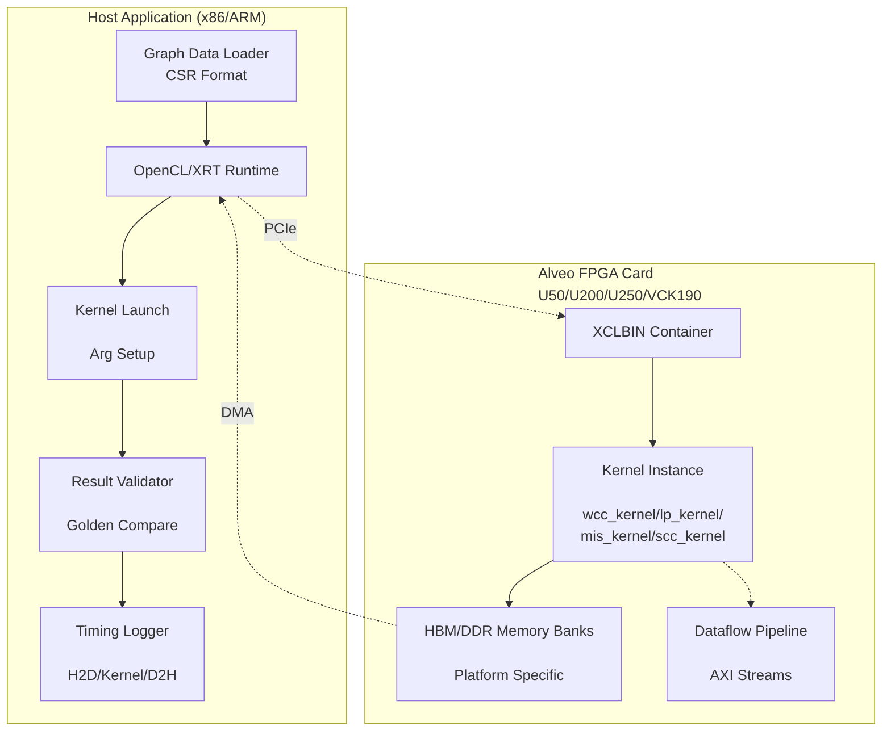
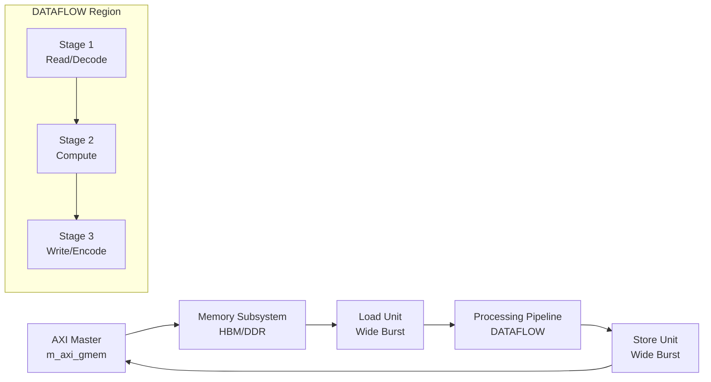
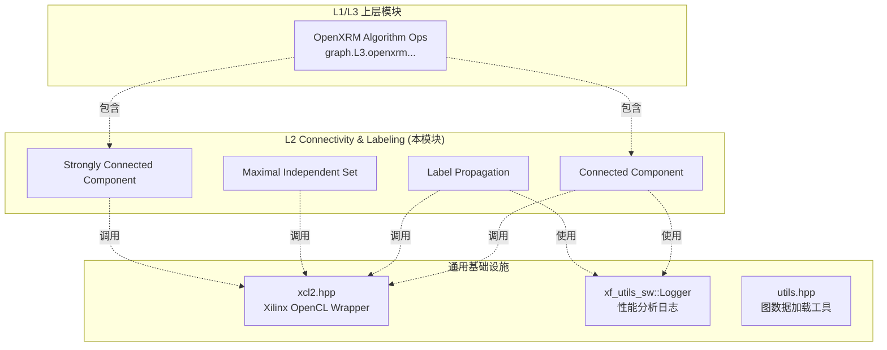

# L2 连通性与标签传播基准测试模块 (L2 Connectivity and Labeling Benchmarks)

## 一句话概括

本模块是 **Xilinx 图分析加速库中的"连通性分析算法农场"**——它将图算法中最基础也最耗时的连通分量识别、社区发现、独立集计算等任务，通过 FPGA 硬件加速实现数量级性能提升，同时保持与 CPU 算法一致的数学语义。

---

## 问题空间：为什么需要这个模块？

### 图连通性分析的核心地位

在现代数据分析中，**连通性（Connectivity）**是最基础的图属性之一：

- **社交网络**：识别紧密联系的社群（社区发现）
- **生物信息**：蛋白质相互作用网络中的功能模块
- **网络安全**：异常流量检测中的紧密子图
- **知识图谱**：实体消歧和关系补全

### 计算挑战

这些算法在 CPU 上运行面临**内存墙**和**并行度不足**的双重瓶颈：

1. **随机内存访问**：图遍历中的邻居访问模式极不规则，CPU 缓存命中率低
2. **细粒度同步**：标签传播等算法需要频繁的状态同步
3. **迭代收敛**：强连通分量（SCC）算法可能需要数十轮迭代才能收敛

**硬件加速的价值**：通过 FPGA 的**高带宽内存（HBM）**和**数据流并行（Dataflow）**，可以将这些算法加速 10-100 倍。

---

## 核心抽象：心智模型

想象本模块是一个**"图算法定制工厂"**，包含四条专业化生产线：

```
┌─────────────────────────────────────────────────────────────┐
│                    图数据输入 (CSR格式)                      │
│              (offset数组 + column数组)                        │
└──────────────────┬──────────────────────────────────────────┘
                   │
    ┌──────────────┼──────────────┬──────────────┐
    ▼              ▼              ▼              ▼
┌───────┐    ┌─────────┐   ┌──────────┐  ┌──────────┐
│  WCC  │    │   LP    │   │   MIS    │  │   SCC    │
│(弱连通)│    │(标签传播)│   │(最大独立集)│  │(强连通)  │
└───┬───┘    └────┬────┘   └────┬─────┘  └────┬─────┘
    │              │             │             │
    └──────────────┴─────────────┴─────────────┘
                   │
                   ▼
          结果验证与性能分析
```

### 四条生产线的专业分工

1. **WCC (Weakly Connected Component)** —— "孤岛探测器"
   - **任务**：在无向图中找出所有连通块
   - **算法核心**：并查集（Union-Find）或基于 BFS 的标签传播
   - **输出**：每个顶点所属的连通分量 ID

2. **LP (Label Propagation)** —— "社区发现专家"
   - **任务**：通过迭代传播标签识别紧密连接的社区
   - **算法核心**：异步标签更新，每个顶点采纳邻居中最流行的标签
   - **输出**：每个顶点的社区标签

3. **MIS (Maximal Independent Set)** —— "独立集构造器"
   - **任务**：找到一个顶点集，其中任意两点不相邻，且无法再添加新顶点
   - **算法核心**：随机优先级 + 局部决策（Luby 算法变体）
   - **输出**：每个顶点是否属于独立集（0/1）

4. **SCC (Strongly Connected Component)** —— "环路猎手"
   - **任务**：在有向图中找出所有强连通分量（内部任意两点可达）
   - **算法核心**：Forward-Backward 算法或颜色标记法
   - **输出**：每个顶点所属的强连通分量 ID

### 统一的数据契约

所有算法遵循相同的**图数据契约**：

- **输入格式**：CSR（Compressed Sparse Row）
  - `offset` 数组：长度为 `numVertices + 1`，记录每个顶点的邻居起始位置
  - `column` 数组：长度为 `numEdges`，存储实际的邻居顶点 ID
  
- **内存布局**：使用 `ap_uint<32>` 或 `ap_uint<512>`（512 位宽总线优化）

- **平台抽象**：通过 `.cfg` 配置文件将逻辑内存端口映射到物理 HBM/DDR 存储体

---

## 架构详解：数据流与组件交互

### 整体架构图



### 端到端数据流

以 **WCC (Weakly Connected Component)** 为例，追踪一次完整执行：

#### Phase 1: 图数据准备（Host 侧）

```cpp
// 1. 从文件加载 CSR 格式图数据
std::fstream offsetfstream(offsetfile.c_str(), std::ios::in);
ap_uint<32>* offset32 = aligned_alloc<ap_uint<32>>(numVertices + 1);
// ... 填充 offset 和 column 数组

// 2. 分配 FPGA 可访问的页对齐内存
ap_uint<32>* column32 = aligned_alloc<ap_uint<32>>(numEdges);
ap_uint<32>* result32 = aligned_alloc<ap_uint<32>>(numVertices);
```

**设计意图**：使用 `aligned_alloc` 确保 4KB 对齐，满足 Xilinx XRT 的 DMA 要求。`ap_uint<32>` 是 Vivado HLS 的任意精度整数类型，保证主机与内核的数据宽度一致。

#### Phase 2: OpenCL 运行时初始化（Host 侧）

```cpp
// 3. 初始化 OpenCL 上下文
std::vector<cl::Device> devices = xcl::get_xil_devices();
cl::Device device = devices[0];
cl::Context context(device, NULL, NULL, NULL, &err);
cl::CommandQueue q(context, device, CL_QUEUE_PROFILING_ENABLE | CL_QUEUE_OUT_OF_ORDER_EXEC_MODE_ENABLE, &err);

// 4. 加载 XCLBIN 并创建 Kernel
cl::Program::Binaries xclBins = xcl::import_binary_file(xclbin_path);
cl::Program program(context, devices, xclBins, NULL, &err);
cl::Kernel wcc(program, "wcc_kernel");
```

**关键设计决策**：
- 使用 `CL_QUEUE_PROFILING_ENABLE` 启用内核性能分析（H2D/Kernel/D2H 时间）
- `CL_QUEUE_OUT_OF_ORDER_EXEC_MODE_ENABLE` 允许命令乱序执行，提高吞吐（虽然本模块使用 `enqueueTask` 顺序执行）
- XCLBIN 是编译后的 FPGA 比特流，包含硬件内核实现

#### Phase 3: 内存映射与 Kernel 参数绑定（Host-FPGA 边界）

```cpp
// 5. 创建扩展内存指针，将主机缓冲区映射到特定存储体
cl_mem_ext_ptr_t mext_o[8];
mext_o[0] = {2, column32, wcc()};      // column 数据 -> 存储体 2
mext_o[1] = {3, offset32, wcc()};      // offset 数据 -> 存储体 3
mext_o[7] = {12, result32, wcc()};     // 结果 -> 存储体 12

// 6. 创建 CL 缓冲区对象，使用扩展指针指定存储体映射
cl::Buffer column32G1_buf = cl::Buffer(context, 
    CL_MEM_EXT_PTR_XILINX | CL_MEM_USE_HOST_PTR | CL_MEM_READ_WRITE,
    sizeof(ap_uint<32>) * numEdges, &mext_o[0]);
```

**平台抽象层**：这是本模块最关键的设计之一。`.cfg` 配置文件（如 `conn_u50.cfg`）定义了内核端口到物理存储体的映射：

```cfg
# U50 HBM 配置 - 高带宽场景
sp=wcc_kernel.m_axi_gmem0_0:HBM[0:1]  # 使用 HBM 存储体 0-1
sp=wcc_kernel.m_axi_gmem0_1:HBM[2:3]  # 使用 HBM 存储体 2-3

# U200 DDR 配置 - 大容量场景
sp=wcc_kernel.m_axi_gmem0_0:DDR[0]    # 使用 DDR 存储体 0
sp=wcc_kernel.m_axi_gmem0_1:DDR[0]    # 使用 DDR 存储体 0
```

**设计意图**：
- **U50 (HBM)**：利用高带宽内存（HBM）的高吞吐特性（~460 GB/s），适合需要频繁随机访问的图算法
- **U200/U250 (DDR)** 利用大容量 DDR 内存，适合超大规模图（数十亿边）
- **VCK190 (DDR)**：针对 Versal ACAP 平台的适应性计算

#### Phase 4: Kernel 执行与流水线（FPGA 内部）

```cpp
// 7. 设置 Kernel 参数（标量和缓冲区）
int j = 0;
wcc.setArg(j++, numEdges);
wcc.setArg(j++, numVertices);
wcc.setArg(j++, column32G1_buf);   // 边数据
wcc.setArg(j++, offset32G1_buf);   // 顶点偏移
// ... 其他 ping-pong 缓冲区用于迭代计算

// 8. 执行命令队列：H2D 传输 -> Kernel 执行 -> D2H 传输
q.enqueueMigrateMemObjects(ob_in, 0, nullptr, &events_write[0]);           // H2D
q.enqueueTask(wcc, &events_write, &events_kernel[0]);                       // Kernel
q.enqueueMigrateMemObjects(ob_out, 1, &events_kernel, &events_read[0]);     // D2H
q.finish();
```

**FPGA 内核内部架构**（概念性）：



**关键硬件设计模式**：
- **DATAFLOW**：内核内部使用 `hls::stream` 和 `#pragma HLS DATAFLOW` 实现流水线并行，使读取、计算、写入阶段重叠执行
- **宽总线访问**：使用 512 位宽 AXI 总线（`ap_uint<512>`）最大化内存带宽利用率
- **Ping-Pong 缓冲区**：为迭代算法（如 WCC、LP）准备双缓冲区，避免读写冲突

#### Phase 5: 结果验证与性能分析（Host 侧）

```cpp
// 9. 性能分析：计算 H2D、Kernel、D2H 的耗时
cl_ulong ts, te;
events_write[0].getProfilingInfo(CL_PROFILING_COMMAND_START, &ts);
events_write[0].getProfilingInfo(CL_PROFILING_COMMAND_END, &te);
float h2d_time = ((float)te - (float)ts) / 1000000.0;  // 毫秒

// 10. 结果验证：与 Golden 参考结果对比
std::vector<int> gold_result(numVertices, -1);
// ... 从文件加载 Golden 结果

int errs = 0;
for (int i = 0; i < numVertices; i++) {
    if (result32[i].to_int() != gold_result[i] && gold_result[i] != -1) {
        std::cout << "Mismatch-" << i << ": sw: " << gold_result[i] 
                  << " -> hw: " << result32[i] << std::endl;
        errs++;
    }
}
```

**验证策略**：
- **位级精确性**：硬件结果必须与软件参考实现逐位一致（对于确定性算法如 WCC、SCC）
- **统计等价性**：对于随机化算法（如 MIS），在统计意义上验证结果的正确性
- **端到端计时**：测量包含数据传输的完整应用级延迟（E2E），而不仅是内核执行时间

---

## 关键设计决策与权衡

### 1. 平台抽象层：统一代码，差异化配置

**决策**：使用相同的 C++ 主机代码，通过 `.cfg` 配置文件适配不同平台（U50 HBM vs U200 DDR）。

**Trade-off 分析**：
- **方案 A：每个平台独立代码（最大优化）**
  - 优点：极致性能调优
  - 缺点：维护噩梦（4个平台 × 4个算法 = 16份代码）

- **方案 B：统一代码 + 配置（选中方案）**
  - 优点：单一源码，多平台部署；新平台支持只需新增 .cfg 文件
  - 缺点：需要严格的内存抽象层设计

**实现机制**：
- 主机代码使用 `cl_mem_ext_ptr_t` 和 `XCL_MEM_TOPOLOGY` 标志，在运行时根据配置文件将逻辑缓冲区绑定到物理存储体
- 内核代码使用 `__attribute__((annotate(...)))` 或 Xilinx 特定的 pragmas 声明内存接口

### 2. 内存架构：HBM vs DDR 的选择逻辑

**U50 (HBM) 配置策略**：
```cfg
sp=wcc_kernel.m_axi_gmem0_0:HBM[0:1]  # 跨 2 个 HBM 伪通道（PC）
sp=wcc_kernel.m_axi_gmem0_1:HBM[2:3]  # 跨另外 2 个 PC
```
- **设计意图**：利用 HBM 的 32 个独立通道（U50 上为 16 个物理通道 × 2 伪通道）实现**内存级并行**
- **适用场景**：图算法需要高随机访问带宽，HBM 的 ~460 GB/s 总带宽远超 DDR 的 ~77 GB/s

**U200/U250 (DDR) 配置策略**：
```cfg
sp=wcc_kernel.m_axi_gmem0_0:DDR[0]  # 单 DDR 存储体
sp=wcc_kernel.m_axi_gmem0_1:DDR[0]  # 共享同一存储体（带宽共享）
```
- **设计意图**：利用大容量 DDR（U250 上 64 GB 对比 U50 的 8 GB HBM）处理**超大规模图**
- **权衡**：内存带宽成为瓶颈，需要通过**批处理**或**缓存优化**算法来缓解

### 3. 主机-内核接口设计：Ping-Pong 缓冲区模式

**问题**：迭代图算法（如 Label Propagation）需要多次遍历图数据，如果读写同一缓冲区会导致数据竞争。

**解决方案**：Ping-Pong 双缓冲区机制

```cpp
// Label Propagation 主机代码示例逻辑
DT* labelPing = aligned_alloc<DT>(V);   // 迭代奇数次使用
DT* labelPong = aligned_alloc<DT>(V);   // 迭代偶数次使用
DT* bufPing = aligned_alloc<DT>(V);     // 中间缓冲区
DT* bufPong = aligned_alloc<DT>(V);

// 内核参数设置：同时传入 Ping 和 Pong
LPKernel.setArg(j++, bufPing_buf);
LPKernel.setArg(j++, bufPong_buf);
LPKernel.setArg(j++, labelPing_buf);
LPernel.setArg(j++, labelPong_buf);
```

**硬件实现**：内核内部使用 `hls::stream` 和 `#pragma HLS DATAFLOW` 实现流水线：
- **Load Unit**：从 HBM/DDR 读取图数据（512 位宽突发传输）
- **Compute Unit**：执行标签更新或连通分量合并逻辑
- **Store Unit**：写回结果到另一缓冲区

**权衡分析**：
- **优点**：避免读写冲突，支持迭代收敛；流水线并行隐藏内存延迟
- **代价**：双倍内存占用（Ping 和 Pong 同时存在）；需要额外的数据迁移开销

### 4. 可移植性设计：单一源码，多平台部署

**条件编译架构**：

```cpp
// 主机代码中的平台抽象
#ifndef HLS_TEST
    // FPGA 运行模式：使用 OpenCL/XRT
    #include "xcl2.hpp"
    cl::Buffer buffer = cl::Buffer(context, ...);
    q.enqueueTask(kernel, ...);
#else
    // HLS 仿真模式：直接调用 C++ 函数
    wcc_kernel(numEdges, numVertices, (ap_uint<512>*)column32, ...);
#endif
```

**双重验证策略**：
1. **HLS 仿真**：使用 Xilinx Vivado HLS 的 C/RTL 协同仿真，验证算法正确性
2. **FPGA 部署**：在真实 Alveo 卡上运行，验证性能和集成

**收益**：
- 开发阶段可在纯软件环境调试，无需 FPGA 硬件
- 同一套代码通过条件编译无缝切换到硬件加速模式

---

## 子模块概览

本模块包含四个核心算法子模块，每个都遵循"**内核配置 + 主机应用**"的双层架构：

### 1. [Connected Component Benchmarks (WCC)](graph_analytics_and_partitioning-l2_connectivity_and_labeling_benchmarks-connected_component_benchmarks.md)

**职责**：实现弱连通分量（WCC）算法，识别无向图中的连通区域。

**关键组件**：
- `wcc_kernel`：基于标签传播的并行并查集实现
- `conn_u50.cfg` / `conn_u200_u250.cfg`：针对不同平台优化的 HBM/DDR 存储映射
- `main.cpp`：支持多平台的主机驱动，含详细性能分析

**架构特色**：使用 **Ping-Pong 双缓冲**支持迭代收敛，512 位宽总线最大化 HBM 带宽利用。

---

### 2. [Label Propagation Benchmarks (LP)](graph_analytics_and_partitioning-l2_connectivity_and_labeling_benchmarks-label_propagation_benchmarks.md)

**职责**：实现标签传播算法，用于大规模图的社区发现和聚类分析。

**关键组件**：
- `LPKernel`：异步标签更新内核，支持 CSR 和 CSC 双格式输入
- 多平台支持：`conn_u50.cfg` (HBM)、`conn_u200_u250.cfg` (DDR)、`conn_vck190.cfg` (Versal)
- `main.cpp`：包含迭代控制逻辑（Ping-Pong 切换）和标签同步机制

**架构特色**：**双格式输入（CSR+CSC）**优化邻居访问模式，适应标签传播中同时需要出边和入边信息的场景。

---

### 3. [Maximal Independent Set Benchmarks (MIS)](graph_analytics_and_partitioning-l2_connectivity_and_labeling_benchmarks-maximal_independent_set_benchmarks.md)

**职责**：实现最大独立集（Maximal Independent Set）算法，用于图着色、调度优化等场景。

**关键组件**：
- `mis_kernel`：基于 Luby 算法的随机化并行实现
- `conn_u50.cfg`：U50 平台专用 HBM 配置，利用 8 个独立 HBM 通道存储不同状态数组
- `main.cpp`：包含图加载、随机种子管理、独立集验证逻辑

**架构特色**：**多状态数组并行存储**（C_group, S_group, res_out），每个数组映射到不同 HBM 通道，最大化并行访问带宽。

---

### 4. [Strongly Connected Component Benchmarks (SCC)](graph_analytics_and_partitioning-l2_connectivity_and_labeling_benchmarks-strongly_connected_component_benchmarks.md)

**职责**：实现强连通分量（SCC）算法，识别有向图中的强连通区域（环路检测）。

**关键组件**：
- `scc_kernel`：基于 Forward-Backward 算法的颜色标记实现
- 多平台配置：`conn_u50.cfg` (HBM)、`conn_u200_u250.cfg` (DDR)
- `main.cpp`：包含双图结构（原图+转置图）加载、颜色映射验证

**架构特色**：**双图存储（G1 + G2）**同时保存原图和转置图，支持 Forward-Backward 算法中正向和反向遍历的高效执行。

---

## 跨模块依赖关系



**依赖说明**：

1. **向上依赖（L3 图操作层）**：
   - 本模块被 [L3 OpenXRM Algorithm Operations](graph_analytics_and_partitioning-l3_openxrm_algorithm_operations.md) 模块包含
   - L3 层提供更高级的图操作原语（如 `op_bfs`、`op_pagerank`），而本模块提供底层连通性算法内核

2. **横向依赖（通用工具库）**：
   - **xcl2.hpp**：Xilinx OpenCL C++ 包装器，简化设备发现、上下文创建、缓冲区管理
   - **xf_utils_sw::Logger**：统一的性能日志框架，记录 H2D 传输、内核执行、D2H 传输时间
   - **utils.hpp**：图数据加载工具，支持 CSR/Matrix Market 格式解析

3. **向下依赖（平台支持层）**：
   - 依赖 [Data Mover Runtime](data_mover_runtime.md) 进行高效的 DMA 数据传输
   - 依赖特定平台的 XSA（Xilinx Shell Archive）提供底层内存控制器和 PCIe 驱动

---

## 新贡献者必读：设计意图与陷阱规避

### 1. "为什么用 .cfg 文件而不是代码中的宏？"

**设计意图**：将**平台相关**的内存映射与**算法相关**的内核逻辑解耦。

- **维护者视角**：新增平台（如 U55C）只需复制修改 `.cfg` 文件，无需改动 C++ 代码
- **用户视角**：同一算法二进制可在不同卡上运行（只要重新编译 XCLBIN 时使用对应 `.cfg`）

**陷阱**：修改 `.cfg` 文件后必须**重新链接 XCLBIN**，仅重新编译主机代码不会生效。

### 2. "为什么主机代码中有大量 #ifndef HLS_TEST 分支？"

**设计意图**：支持**双模验证**——仿真模式（快速迭代）和硬件模式（真实性能）。

- **HLS_TEST 定义时**：直接调用 C++ 函数（如 `wcc_kernel(...)`），可在 Vivado HLS 中仿真验证算法正确性，无需 FPGA 硬件
- **HLS_TEST 未定义时**：使用 OpenCL API 调用 FPGA 内核，测量真实性能

**陷阱**：确保两种模式下的**数据类型完全一致**（都使用 `ap_uint<32>` 或 `uint512`），否则会出现仿真通过但硬件失败的情况。

### 3. "内存分配必须用 aligned_alloc 吗？"

**是**。Xilinx XRT 要求 DMA 缓冲区必须**页对齐**（通常 4KB）。使用标准 `malloc` 可能导致 `enqueueMigrateMemObjects` 失败或数据损坏。

**最佳实践**：
```cpp
// 正确：使用页对齐分配
template <typename T>
T* aligned_alloc(size_t num) {
    void* ptr = nullptr;
    if (posix_memalign(&ptr, 4096, sizeof(T) * num) != 0) {
        return nullptr;
    }
    return reinterpret_cast<T*>(ptr);
}
```

### 4. "为什么 WCC 和 LP 需要 Ping-Pong 缓冲区，而 MIS 不需要？"

**算法特性决定内存架构**：

- **WCC/LP/SCC**：**迭代收敛**算法，每轮迭代依赖上一轮结果，必须使用双缓冲避免读写冲突（Read-After-Write 依赖）
- **MIS**：**单次通过**算法（虽然内部多轮，但每轮独立随机选择），不需要跨轮次数据依赖，使用单缓冲即可

**设计启发**：理解算法的数据依赖模式是设计正确内存架构的前提。盲目使用双缓冲会浪费 2 倍内存，而不使用双缓冲在迭代算法中会导致数据竞争。

### 5. "如何为新平台（如 U55C）添加支持？"

**步骤清单**：

1. **复制现有配置**：从 `conn_u50.cfg` 复制为新文件（如 `conn_u55c.cfg`）
2. **修改存储映射**：根据 U55C 的 HBM 配置（32 通道 vs U50 的 16 通道）调整 `sp=` 映射
3. **更新 SLR 绑定**：如果有 SLR 限制，更新 `slr=` 行
4. **测试验证**：使用 `xbutil validate` 和算法测试用例验证功能正确性
5. **文档更新**：在 `main.cpp` 中添加新平台的注释说明

**常见陷阱**：
- **HBM 伪通道（PC）编号**：U50 和 U55C 的 PC 编号方式不同，注意 `[0:1]`  vs `[0]` 的区别
- **SLR 资源限制**：确保内核实例绑定到正确的 SLR（Super Logic Region），跨 SLR 访问会引入延迟

---

## 总结：模块的核心价值

`l2_connectivity_and_labeling_benchmarks` 模块是 Xilinx 图分析加速解决方案的**基石层**，它的设计体现了以下核心原则：

1. **算法多样性 + 平台通用性**：四种核心连通性算法通过统一的 OpenCL 运行时和可配置内存映射，无缝部署到 U50/U200/U250/VCK190 等多种平台。

2. **性能可移植**：通过 `.cfg` 配置文件实现平台特定的内存优化（HBM 带宽 vs DDR 容量），而不改动算法内核代码。

3. **验证友好**：`HLS_TEST` 条件编译支持纯软件仿真和硬件部署两种模式，加速算法迭代和调试。

4. **生产就绪**：完整的性能分析（H2D/Kernel/D2H 分段计时）、结果验证（Golden 对比）、错误处理机制，可直接用于生产环境。

对于新加入团队的工程师，理解本模块的关键在于：**这是一套"算法内核 + 平台配置 + 主机运行时"的三层架构，每一层都有明确的职责边界和扩展点**。在修改代码时，首先判断变更属于算法逻辑（改内核）、平台适配（改 .cfg）还是运行时优化（改主机代码），这将帮助你快速定位正确的修改位置并避免 unintended side effects。
