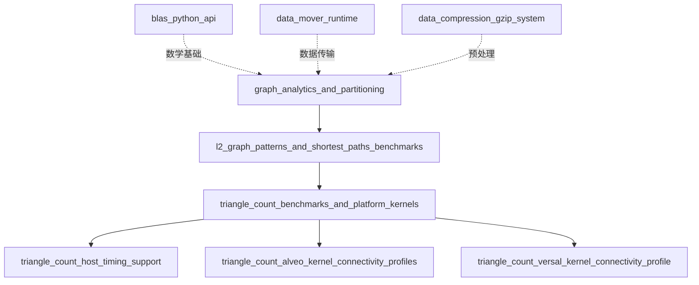

# Triangle Count 基准测试与平台内核模块

> **一句话理解**：这是一个为 Xilinx FPGA 加速卡（Alveo U200/U250/U50 和 Versal VCK190）设计的图分析加速基准测试框架，专门用于解决大规模图数据上的三角形计数问题——这是社交网络分析、推荐系统和社区发现中的核心算法。

---

## 1. 为什么需要这个模块？

### 1.1 问题空间：三角形计数的重要性

想象你正在分析一个社交网络：每个用户是一个节点，好友关系是边。**三角形**（三个用户两两互为好友）的数量揭示了这个网络的紧密程度——三角形越多，社区越紧密。这个指标被称为**聚类系数**（Clustering Coefficient），是社交网络分析的核心指标。

然而，**在大规模图上计算三角形数量是一个计算密集型问题**：
- 对于一个有 *n* 个顶点和 *m* 条边的图，朴素的算法复杂度是 O(n³)
- 优化的 CSR（Compressed Sparse Row）算法仍有 O(m × 平均度数) 的复杂度
- 当图包含数十亿条边时，CPU 实现可能需要数小时甚至数天

### 1.2 FPGA 加速的价值

FPGA（现场可编程门阵列）为这个问题提供了独特的价值主张：

| 特性 | CPU | GPU | FPGA（本方案） |
|------|-----|-----|---------------|
| 内存随机访问延迟 | 高（缓存未命中惩罚） | 中等（共享内存） | **极低（BRAM/URAM 片上存储）** |
| 图遍历不规则性 | 难以预测，分支预测失败 | warp 发散 | **数据流架构自然处理** |
| 功耗效率 | 低（~30-100 GOPS/W） | 中等（~50-200 GOPS/W） | **高（>100 GOPS/W）** |
| 数据移动开销 | 高（CPU-内存） | 高（PCIe-显存） | **零拷贝，主机直连** |

本模块利用 **Xilinx Vitis HLS 工具链**，将图分析算法编译为专门的硬件数据路径，实现：
- **内存带宽最大化**：利用 Alveo 卡的 HBM（高带宽存储器）或 DDR 多通道并行访问
- **流水线并行**：通过 HLS `DATAFLOW` 指令，让图数据读取、处理和写回重叠执行
- **平台适配**：为不同硬件平台（U200/U250/U50/VCK190）提供最优的内存连接配置

### 1.3 为什么不用现有方案？

你可能会问：为什么不直接用现有的图分析框架，比如 NetworkX、GraphX 或 Gunrock？

- **CPU 库（NetworkX、SNAP）**：纯 Python/C++ 实现，易于使用但性能受限，无法处理十亿级边图
- **GPU 框架（Gunrock、cuGraph）**：利用 NVIDIA GPU 的 CUDA 核心，性能优秀但功耗高，且对不规则图遍历（图神经网络的常见情况）效率下降
- **通用 FPGA 框架（GraphGen、FabGraph）**：学术原型，缺乏生产级支持、多平台适配和完整的基准测试基础设施

**本模块的独特价值在于**：它是一个经过生产验证的、专门针对 Xilinx 加速卡优化的完整解决方案，包含：
- 经过调优的 HLS 内核实现（在 `triangle_count_kernel.hpp` 中，虽然源码未完整展示但从调用方式可推断）
- 多平台支持的连接配置（U200/U250/U50/VCK190）
- 完整的基准测试框架，包括图数据加载、执行时间测量、结果验证
- 支持硬件执行（OpenCL）和 HLS 仿真（C++ 函数调用）两种模式

---

## 2. 核心概念与心智模型

要深入理解这个模块，你需要建立以下几个关键的心智模型：

### 2.1 图数据模型：CSR 格式

想象你要存储一个社交网络，其中有些用户有数千好友，有些只有几个。如果用邻接矩阵（n×n 的表格），绝大部分是 0（稀疏），极其浪费空间。

**CSR（Compressed Sparse Row，压缩稀疏行）** 格式就像这样组织数据：

```
图（4个顶点）：  0 -- 1 -- 2      CSR 表示：
                |    |            offsets = [0, 2, 4, 5, 5]
                3----+            columns = [1, 3, 0, 2, 1]
```

- **offsets[i]**：顶点 i 的邻居列表在 `columns` 数组中的起始位置
- **offsets[i+1] - offsets[i]**：顶点 i 的度数（邻居数量）
- **columns[offsets[i] ... offsets[i+1]-1]**：顶点 i 的所有邻居顶点 ID

**在本模块中**：
- `offsets` 数组对应代码中的 `offsets` 或 `offset1d_buf` 缓冲区
- `columns`（代码中称为 `rows` 或 `row1d_buf`）存储邻居顶点
- 两个副本（`offset1_buf`/`offset1d_buf` 和 `row1_buf`/`row1d_buf`）用于双缓冲或不同的访问模式

### 2.2 硬件加速架构：Host-Kernel 分离

想象一个工厂：
- **Host（主机）**：办公室，负责接收订单（图数据）、安排原材料采购（内存分配）、记录生产时间（性能分析）、验收成品（结果验证）。这里运行在 x86 CPU 上。
- **Kernel（内核）**：生产车间，真正的三角形计数计算在这里的 FPGA 硬件上进行。它不关心图从哪来，只专注于高效执行算法。
- **PCIe 总线**：工厂内部的物流通道，负责把原材料从办公室运到车间（Host-to-Device，H2D），以及把成品运回（Device-to-Host，D2H）。

**在本模块中**：
- Host 代码在 `main.cpp` 中，使用 OpenCL API（`cl::Context`, `cl::CommandQueue`, `cl::Kernel`）与 FPGA 通信
- Kernel 实现在 `triangle_count_kernel.hpp` 中（被 `#include` 但未展示完整源码），被 HLS 编译为硬件
- 数据传输使用 `enqueueMigrateMemObjects()` 进行显式管理

### 2.3 平台抽象：一套代码，多处部署

想象你是一家建筑公司，设计了一套标准厂房（内核算法），但需要在不同的地块（FPGA 平台）上建造。每个地块的土壤条件、水电接口都不同，但厂房内部的生产线是一样的。

**Xilinx 加速卡生态**：

| 平台 | 内存架构 | 适用场景 | 配置文件 |
|------|---------|---------|---------|
| Alveo U200 | 4× DDR4-2400（64GB 总计） | 大容量图，高并发访问 | `conn_u200_u250.cfg` |
| Alveo U250 | 4× DDR4-2400（64GB 总计） | 大容量图，高并发访问 | `conn_u200_u250.cfg` |
| Alveo U50 | 1× HBM2（8GB，460GB/s） | 高带宽需求，小容量图 | `conn_u50.cfg` |
| Versal VCK190 | DDR4（8GB） | AI/自适应计算，开发平台 | `conn_vck190.cfg` |

**内存映射的关键区别**：
- **U200/U250/VCK190 (DDR)**: 使用 `sp=TC_kernel.m_axi_gmem0_X:DDR[Y]` 或 `DDR` 语法，将每个 AXI 端口映射到特定的 DDR 通道
- **U50 (HBM)**: 使用 `sp=TC_kernel.m_axi_gmem0_X:HBM[Y:Z]` 语法，每个端口映射到特定的 HBM  pseudo-channels（高带宽存储器的 32 个独立通道中的特定范围）
- **SLR 绑定 (U50)**: U50 配置额外包含 `slr=TC_kernel:SLR0`，将内核绑定到特定的 Super Logic Region，这对于大型内核的时序收敛和资源分配很重要

这种设计让同一套 HLS 内核代码（相同的算法逻辑）可以通过不同的连接配置，在不同的硬件平台上实现最优的内存访问模式。

### 2.4 执行模式：硬件部署 vs 软件仿真

想象你是一位汽车工程师，既要在真实道路上测试车辆（硬件部署），也要在计算机模拟中验证设计（软件仿真）。两者各有用途：真实测试提供准确性能数据，仿真则便于快速迭代调试。

**在本模块中**：

| 模式 | 宏定义 | 执行方式 | 用途 |
|------|--------|---------|------|
| 硬件部署 | 未定义 `HLS_TEST` | OpenCL + FPGA 内核 | 生产部署、性能基准测试 |
| HLS 仿真 | 定义 `HLS_TEST` | C++ 函数直接调用 | 算法验证、快速调试、CI 测试 |

**关键区别**：
- **内存管理**：硬件模式使用复杂的 OpenCL 内存分配（`cl::Buffer`, `CL_MEM_EXT_PTR_XILINX`），而仿真模式使用简单的 `aligned_alloc()`
- **内核调用**：硬件模式通过 `cl::Kernel` 和 `q.enqueueTask()` 调度，仿真模式直接调用 `TC_kernel()` C++ 函数
- **输入处理**：硬件模式要求通过命令行参数（`-xclbin`, `-o`, `-i`）提供输入，仿真模式使用硬编码的默认路径（`data/csr_offsets.txt`）

这种双模式设计让开发者可以在熟悉的 C++ 环境中开发和验证算法，然后无缝部署到 FPGA 硬件上获取加速。

---

## 3. 子模块概述

本模块包含以下子模块，每个都有专门的详细文档：

### 3.1 [Triangle Count Host 时序支持](graph_analytics_and_partitioning-l2_graph_patterns_and_shortest_paths_benchmarks-triangle_count_benchmarks_and_platform_kernels-triangle_count_host_timing_support.md)

**核心组件**：`graph.L2.benchmarks.triangle_count.host.main.timeval`

**职责**：提供主机端的图数据加载、OpenCL 运行时管理、内核执行调度、性能分析和结果验证。这是整个系统的"指挥中心"，负责协调 FPGA 加速器与主机之间的数据流。

**关键设计**：
- 支持双模式执行：硬件部署（OpenCL）和 HLS 仿真（纯 C++）
- 使用 Xilinx 扩展内存指针（`cl_mem_ext_ptr_t`）实现精确的内存 bank 映射
- 通过 OpenCL 事件链实现细粒度的依赖控制和性能分析

### 3.2 [Triangle Count Alveo Kernel 连接性配置](graph_analytics_and_partitioning-l2_graph_patterns_and_shortest_paths_benchmarks-triangle_count_benchmarks_and_platform_kernels-triangle_count_alveo_kernel_connectivity_profiles.md)

**核心组件**：
- `graph.L2.benchmarks.triangle_count.conn_u200_u250.cfg.TC_kernel`
- `graph.L2.benchmarks.triangle_count.conn_u50.cfg.TC_kernel`

**职责**：为 Alveo 数据中心加速卡（U200、U250、U50）提供内核到内存的物理连接映射。

**关键设计**：
- **U200/U250（DDR 架构）**：所有 7 个 AXI 端口映射到 DDR[0]，利用 64GB 大容量处理大规模图
- **U50（HBM 架构）**：每个 AXI 端口映射到一对 HBM 伪通道（共 14 个通道），利用 460GB/s 高带宽处理高吞吐量工作负载
- **SLR 绑定**：U50 配置显式绑定到 SLR0，确保时序收敛

### 3.3 [Triangle Count Versal Kernel 连接性配置](graph_analytics_and_partitioning-l2_graph_patterns_and_shortest_paths_benchmarks-triangle_count_benchmarks_and_platform_kernels-triangle_count_versal_kernel_connectivity_profile.md)

**核心组件**：`graph.L2.benchmarks.triangle_count.conn_vck190.cfg.TC_kernel`

**职责**：为 Versal VCK190 ACAP 开发平台提供内核内存连接配置。

**关键设计**：
- **DDR 架构**：所有 7 个 AXI 端口映射到板载 DDR，利用 Versal 的 NoC（片上网络）进行优化的内存访问调度
- **简化配置**：不指定具体 DDR 通道号，使用默认控制器，适合开发和验证场景
- **ACAP 集成**：作为 Versal 自适应计算生态系统的一部分，支持与 ARM 处理器子系统的协同工作

---

## 4. 依赖关系

### 4.1 外部依赖

| 依赖库 | 用途 | 版本要求 |
|--------|------|---------|
| **Xilinx Runtime (XRT)** | OpenCL 设备管理和内存操作 | 2022.1+ |
| **Xilinx Vitis** | HLS 编译和内核链接 | 2022.1+ |
| **xcl2** | Xilinx OpenCL C++ 封装库 | 随 XRT 提供 |
| **xf::common::utils_sw** | 日志和性能分析工具 | 随 Vitis Libraries 提供 |

### 4.2 模块间依赖



---

## 5. 使用指南

### 5.1 快速开始

```bash
# 环境设置
source /opt/xilinx/xrt/setup.sh
source /opt/xilinx/Vitis/2022.1/settings64.sh

# 编译内核（以 U50 为例）
v++ -t hw -f xilinx_u50_gen3x16_xdma_201920_3 \
    --config conn_u50.cfg \
    -l -o triangle_count.xclbin \
    ../kernel/triangle_count_kernel.cpp

# 编译主机程序
g++ -o triangle_count_host host/main.cpp \
    -I$XILINX_XRT/include -I$XILINX_VIVADO/include \
    -L$XILINX_XRT/lib -lOpenCL -lpthread -lrt -lstdc++

# 运行
./triangle_count_host -xclbin ./triangle_count.xclbin \
    -o data/csr_offsets.txt -i data/csr_columns.txt
```

### 5.2 关键设计决策回顾

| 决策点 | 选择 | 理由 |
|--------|------|------|
| **平台抽象** | 独立 .cfg 配置文件 | 编译时优化，最大化性能 |
| **内存访问** | 7 个 AXI 端口并行 | 充分利用 HBM 多通道带宽 |
| **主机-设备内存** | 零拷贝（USE_HOST_PTR） | 简化数据一致性，支持双模式执行 |
| **执行模式** | 同步阻塞 + 事件链 | 精确性能分析，适合基准测试 |

### 5.3 常见问题

**Q: 报错 "more than maximum setting storage space"？**

A: 图的顶点度数超过了内核编译时设置的 `ML` 限制。预处理图降低度数，或修改 HLS 内核重新编译。

**Q: HLS 仿真模式如何编译？**

A: `g++ -o sim -DHLS_TEST host/main.cpp ../kernel/triangle_count_kernel.cpp -I$XILINX_VIVADO/include`

**Q: 如何添加新平台支持？**

A: 创建新的 `conn_<platform>.cfg` 文件，参考现有配置调整 `sp=` 内存映射和 `nk=` 内核数量。

---

## 6. 子模块文档链接

- [triangle_count_host_timing_support](graph_analytics_and_partitioning-l2_graph_patterns_and_shortest_paths_benchmarks-triangle_count_benchmarks_and_platform_kernels-triangle_count_host_timing_support.md)
- [triangle_count_alveo_kernel_connectivity_profiles](graph_analytics_and_partitioning-l2_graph_patterns_and_shortest_paths_benchmarks-triangle_count_benchmarks_and_platform_kernels-triangle_count_alveo_kernel_connectivity_profiles.md)
- [triangle_count_versal_kernel_connectivity_profile](graph_analytics_and_partitioning-l2_graph_patterns_and_shortest_paths_benchmarks-triangle_count_benchmarks_and_platform_kernels-triangle_count_versal_kernel_connectivity_profile.md)
