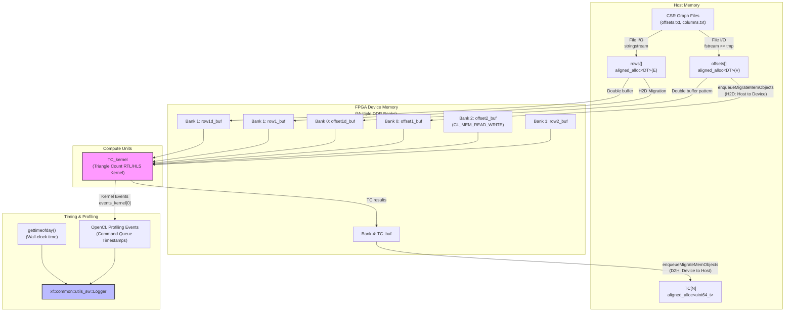
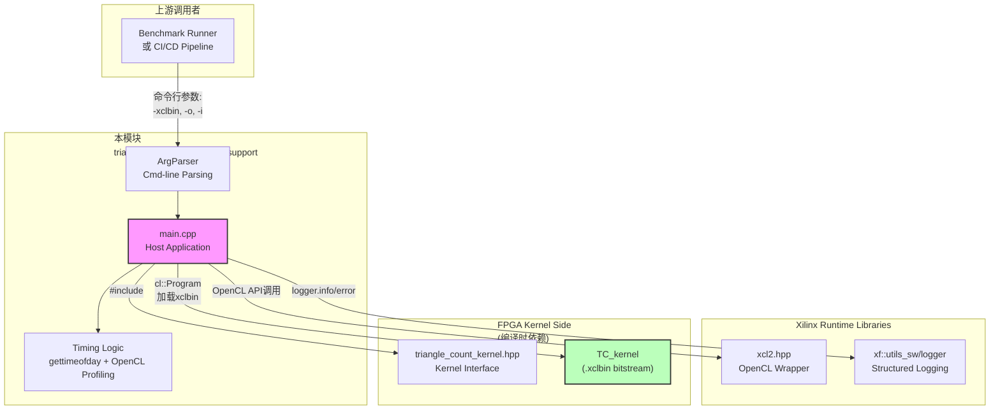

# Triangle Count Host Timing Support 技术深度解析

## 开篇：这个模块是做什么的？

想象你正在处理一个巨大的社交网络图谱——数十亿用户，数百亿条好友关系——而你的任务是回答一个看似简单的问题："这个网络中有多少个三角形？" 这里的三角形指的是三个用户彼此都是好友（A-B, B-C, C-A）。这个看似简单的计数问题，实际上对图分析至关重要：它揭示了社区的紧密程度、网络的聚类系数，甚至是欺诈检测中的异常模式。

然而，当图数据规模达到数十GB甚至TB级别时，在CPU上运行传统的三角形计数算法可能需要数小时甚至数天。这就是 `triangle_count_host_timing_support` 模块存在的意义——它是一个**主机端FPGA加速基准测试框架**，负责将图数据从CSR（压缩稀疏行）格式转换为FPGA可处理的内存布局，管理主机与FPGA之间的数据迁移，精确测量端到端执行时间，并验证计算结果的正确性。

这个模块的核心设计洞察在于：**它同时支持两种执行模式**——纯软件HLS仿真模式（用于快速验证算法正确性）和真实FPGA硬件模式（用于生产级性能评估）。这种双模式设计使得开发者可以在不接触硬件的情况下完成90%的开发和调试工作，只在最后阶段才需要在真实FPGA上验证。

---

## 架构全景：数据如何在系统中流动？



### 数据流的三阶段旅程

理解这个模块的关键在于追踪图数据从磁盘到FPGA、再从FPGA回到主机的完整生命周期。我们可以将其想象为一个精密编排的交响乐——每个乐器（组件）在精确的时刻加入，共同演奏出"三角形计数"这首乐曲。

**第一阶段：图数据的加载与验证（文件系统 → 主机内存）**

当程序启动时，它首先面临一个基础但关键的任务：从CSR格式的文本文件中读取图结构。CSR（Compressed Sparse Row，压缩稀疏行）是图计算的通用存储格式，它用两个数组优雅地表示稀疏邻接矩阵：`offsets[]`数组存储每个顶点邻接表的起始索引，`rows[]`（或称`columns`）数组存储实际的邻居顶点ID。

这段代码在处理文件I/O时展示了一种**防御式编程**的风格。它不仅检查文件是否成功打开，还解析第一行获取`vertexNum`（顶点数）和`edgeNum`（边数），并在读取`offsets`时实时计算最大度数（`max_diff`）。这个最大度数的计算并非可有可无的装饰——它直接关系到FPGA内核的`ML`（最大加载）参数配置。如果实际图的最大度数超过了FPGA内核编译时预设的`ML`值，程序会立即报错退出，避免在FPGA上发生不可预测的内存越界行为。

**第二阶段：主机-设备内存映射与双缓冲策略（主机内存 → FPGA DDR）**

当图数据被加载到主机内存后，真正的挑战才刚刚开始。FPGA加速的核心优势在于大规模并行计算，但要发挥这一优势，必须精心管理主机内存与FPGA设备内存之间的数据移动。这段代码展示了一种**多银行内存拓扑感知**的设计——它显式地使用了Xilinx的`XCL_MEM_TOPOLOGY`扩展，将不同的缓冲区映射到特定的DDR银行（Bank 0-4）。

这里出现了一个关键的设计模式：**双缓冲（Double Buffering）**。代码中我们可以看到`offset1_buf`和`offset1d_buf`都映射到主机端的`offsets`数组，`row1_buf`和`row1d_buf`都映射到`rows`数组。为什么要这样做？三角形计数算法的本质是检查三元组(u, v, w)是否构成三角形，这需要多次遍历邻接表。通过创建两个副本（可能用于不同的处理阶段或并发流水线），FPGA内核可以在不等待主机重新传输数据的情况下持续工作。这是一种用**空间换时间**的经典权衡——消耗更多的FPGA DDR内存，换取更低的延迟和更高的吞吐量。

**第三阶段：内核执行与精细化性能分析（FPGA计算 → 结果验证）**

数据就绪后，代码进入执行阶段。这里的设计体现了**延迟隐藏（Latency Hiding）**的思想。OpenCL命令队列允许我们异步地提交多个操作：首先是`enqueueMigrateMemObjects`（H2D数据传输），然后是`enqueueTask`（内核执行），最后是另一个`enqueueMigrateMemObjects`（D2H结果回传）。通过合理设置事件依赖（`&events_write`, `&events_kernel`），系统可以自动地在数据传输和计算之间进行流水线化，最大限度地利用PCIe带宽和FPGA计算资源。

但这段代码最令人印象深刻的可能是其**多层次性能分析框架**。它不是简单地测量端到端时间，而是构建了一个三维的测量体系：

1. **墙上时钟时间（Wall-clock Time）**：使用`gettimeofday()`获取用户感知到的总执行时间，包括所有开销。

2. **OpenCL事件分析（Command Queue Profiling）**：通过`CL_PROFILING_COMMAND_START/END`获取每个OpenCL命令（数据传输、内核执行）在设备队列中的实际耗时。这是测量PCIe传输带宽和内核纯计算时间的金标准。

3. **结构化日志记录（Logger Framework）**：使用`xf::common::utils_sw::Logger`将结果标准化输出，支持`TEST_PASS`/`TEST_FAIL`状态码、`TIME_H2D_MS`/`TIME_KERNEL_MS`/`TIME_D2H_MS`等语义化标签。

这种分层设计使得性能瓶颈的定位变得异常精确——如果发现`TIME_H2D_MS`异常高，就知道是PCIe传输或主机内存拷贝在拖累整体性能；如果`TIME_KERNEL_MS`与理论峰值差距很大，就需要深入分析FPGA内核的微架构实现。

---

## 组件深度剖析：每个关键实体的角色与机制

### 1. `struct timeval` 与 `tvdiff()` —— 跨平台时间测量的基石

虽然代码片段中没有直接展示`tvdiff()`的实现，但我们可以推断其存在和作用。`struct timeval`是POSIX标准定义的结构体，包含`tv_sec`（秒）和`tv_usec`（微秒）两个字段。在三角形计数基准测试中，它承担着**端到端延迟测量**的职责——从图数据加载完成、准备启动FPGA计算的那一刻，到结果从FPGA返回、验证通过的瞬间。

为什么选择`gettimeofday()`而不是C++11的`<chrono>`库？这反映了项目的**系统级编程传统**和**跨平台兼容性需求**。`gettimeofday()`在Linux系统上具有纳秒级的精度（尽管受限于系统时钟中断），并且在嵌入式和HPC领域有着悠久的使用历史。对于需要与底层硬件（FPGA通过PCIe连接）紧密交互的基准测试代码来说，使用经过验证的POSIX API比追求现代C++的语法糖更为重要。

### 2. `ArgParser` —— 轻量级命令行解析的务实选择

`ArgParser`类是一个典型的**自包含工具类**，它在一个头文件中完成了命令行参数解析的全部功能。这个类的设计哲学是**最小可行产品（MVP）**——它不支持GNU getopt那样的长选项合并、参数类型转换或自动帮助生成，但它足够小（不到30行代码）、没有外部依赖，并且完成了任务。

类的核心方法是`getCmdOption(const std::string option, std::string& value)`，它采用**线性扫描策略**遍历`mTokens`向量（由构造函数从`argc/argv`构建）。如果找到匹配的选项字符串，就将下一个token赋值给`value`参数并返回`true`。这种设计的一个微妙之处是它**隐式假设每个选项都有一个值参数**——这对于`-xclbin path`、`-o offsets.txt`这样的键值对式参数很合理，但不支持布尔标志（如`--verbose`）。

对于基准测试场景来说，这种简化是可以接受的，因为参数列表是固定的、有限的（xclbin路径、图数据文件路径），而且开发者通常是具有一定经验的系统程序员。但如果这个解析器被用在面向最终用户的工具中，缺乏输入验证（如重复选项检测、必需参数检查）和友好的错误消息就会成为明显的缺陷。

### 3. OpenCL内存管理策略 —— `cl_mem_ext_ptr_t`与多银行拓扑

代码中最复杂的部分之一是OpenCL缓冲区与FPGA DDR内存银行的映射。这里使用的`cl_mem_ext_ptr_t`是Xilinx的扩展（定义在`xcl2.hpp`中），它允许开发者显式指定缓冲区应该映射到哪个DDR银行。这个结构体的三个字段分别是：`flags`（银行编号）、`obj`（主机指针，如果使用`CL_MEM_USE_HOST_PTR`）和`param`（通常设置为kernel对象用于自动参数绑定）。

代码中创建了一个`mext_o[7]`数组，为7个不同的缓冲区配置扩展指针。注意观察这些映射的**非平凡性**：

| 数组索引 | 标志值 | 主机指针 | 说明 |
|---------|-------|---------|------|
| 0 | 2 (Bank 2) | offsets | 原始偏移数组 |
| 1 | 3 (Bank 3) | rows | 原始行/列数组 |
| 5 | 4 (Bank 4) | offsets | 偏移数组副本（双缓冲）|
| 6 | 5 (Bank 5) | rows | 行数组副本（双缓冲）|
| 2 | 6 (Bank 6) | NULL | 中间计算缓冲区（设备端分配）|
| 3 | 7 (Bank 7) | rows | 行数组引用（可能用于不同处理阶段）|
| 4 | 8 (Bank 8) | TC | 结果数组（三角形计数输出）|

这种复杂的映射反映了三角形计数算法的**内存访问模式需求**。算法需要多次遍历图结构，不同的处理阶段可能对数据有不同的访问模式（顺序扫描、随机访问、邻居列表交集等）。通过将数据分散到多个DDR银行，可以实现**银行级并行**——当多个计算单元同时访问不同银行时，它们不会互相竞争内存带宽。

特别值得注意的是索引为2的缓冲区（`offset2_buf`），它在`mext_o`中对应的`obj`字段是`NULL`，并且在`cl::Buffer`构造时使用了`CL_MEM_READ_WRITE`但没有`CL_MEM_USE_HOST_PTR`。这表明这是一个**纯设备端缓冲区**——主机代码不直接访问它的内容，它只是为FPGA内核提供一个临时的工作空间。这种设计避免了不必要的主机-设备数据传输，因为中间结果可以直接驻留在FPGA的DDR内存中。

### 4. 事件驱动的异步执行模型 —— 命令队列与依赖图

OpenCL的强大之处不仅在于其跨平台性，更在于其**异步执行模型**。这段代码充分展示了如何利用OpenCL的命令队列和事件机制来构建高效的计算流水线。

核心事件对象包括：
- `events_write[2]`：控制两个主机到设备（H2D）数据传输操作
- `events_buf[1]`：用于缓冲区初始化/迁移事件
- `events_kernel[1]`：标记内核执行完成
- `events_read[1]`：控制设备到主机（D2H）结果回传

代码的执行序列如下：

```cpp
// 步骤1：提交H2D数据传输（输入数据）
q.enqueueMigrateMemObjects(ob_in, 0, nullptr, &events_write[0]);

// 步骤2：提交缓冲区内容未定义标记（可能用于设备端分配）
q.enqueueMigrateMemObjects(ob_buf, CL_MIGRATE_MEM_OBJECT_CONTENT_UNDEFINED, 
                              nullptr, &events_write[1]);

// 步骤3：设置内核参数（9个参数）
TCkernel.setArg(j++, vertexNum);
// ... 更多参数

// 步骤4：提交内核执行任务，依赖events_write完成
q.enqueueTask(TCkernel, &events_write, &events_kernel[0]);

// 步骤5：提交D2H结果回传，依赖内核完成
q.enqueueMigrateMemObjects(ob_out, 1, &events_kernel, &events_read[0]);

// 步骤6：阻塞等待所有操作完成
q.finish();
```

这种模式实现了**三级流水线优化**：

1. **数据传输与计算重叠**：在理想情况下，当FPGA正在处理第N批数据时，主机可以异步准备并传输第N+1批数据（如果算法支持多批次处理）。虽然这段代码只处理单批次，但这种设计为扩展预留了空间。

2. **细粒度性能分析**：通过将每个操作（H2D传输、内核执行、D2H传输）关联到独立的事件对象，代码可以在不阻塞执行的情况下，事后查询每个阶段的精确耗时。这是实现**屋顶线性能分析（Roofline Analysis）**的基础数据。

3. **资源预留与避免死锁**：`CL_QUEUE_OUT_OF_ORDER_EXEC_MODE_ENABLE`标志允许命令队列重新排序命令以优化吞吐量，而事件依赖图确保了这个自由度不会破坏操作间的数据依赖关系。

### 5. 多层次性能测量体系 —— 从墙上时钟到OpenCL事件

这段代码实现了一个令人印象深刻的**三维性能测量体系**，它回答了"这次执行花了多长时间？"这个问题的三个不同层面：

**维度一：墙上时钟时间（Wall-clock Time）**

```cpp
struct timeval start_time, end_time;
gettimeofday(&start_time, 0);
// ... 执行计算 ...
gettimeofday(&end_time, 0);
std::cout << "Execution time " << tvdiff(&start_time, &end_time) / 1000.0 << "ms" << std::endl;
```

这是用户感知到的总时间，包括了所有开销：程序启动、文件I/O、内存分配、OpenCL运行时初始化、数据传输、计算、结果验证。虽然这个指标最直观，但它**不能区分性能瓶颈的来源**——是PCIe带宽不足？还是FPGA内核计算效率低？还是主机端的数据准备太慢？

**维度二：OpenCL事件分析（Command Queue Profiling）**

```cpp
// 创建命令队列时启用性能分析
cl::CommandQueue q(context, device, CL_QUEUE_PROFILING_ENABLE | ...);

// 内核执行事件分析
cl_ulong ts, te;
events_kernel[0].getProfilingInfo(CL_PROFILING_COMMAND_START, &ts);
events_kernel[0].getProfilingInfo(CL_PROFILING_COMMAND_END, &te);
float elapsed = ((float)te - (float)ts) / 1000000.0;
```

这是**设备端实际执行时间**的黄金标准。当`CL_QUEUE_PROFILING_ENABLE`被设置后，OpenCL运行时会为每个命令记录纳秒级精度的开始和结束时间戳。这些时间戳**不包括**主机端的命令提交延迟，**不包括**命令在队列中的等待时间，只测量设备实际工作的时间。

代码中对三个关键阶段分别进行了分析：
- `events_write[0]`：H2D（Host to Device）数据传输时间
- `events_kernel[0]`：FPGA内核纯计算时间  
- `events_read[0]`：D2H（Device to Host）结果回传时间

**维度三：结构化日志记录（Logger Framework）**

```cpp
xf::common::utils_sw::Logger logger(std::cout, std::cerr);
// ...
logger.info(xf::common::utils_sw::Logger::Message::TIME_KERNEL_MS, elapsed);
// ...
if (TC_golden != out) {
    logger.error(xf::common::utils_sw::Logger::Message::TEST_FAIL);
} else {
    logger.info(xf::common::utils_sw::Logger::Message::TEST_PASS);
}
```

这是**自动化基准测试框架**的基础。`xf::common::utils_sw::Logger`是Xilinx提供的一个工具类，它将测试结果以标准化的格式输出，包括预定义的语义化标签（`TIME_H2D_MS`、`TIME_KERNEL_MS`、`TIME_D2H_MS`、`TEST_PASS`、`TEST_FAIL`）。这种标准化的输出可以被CI/CD流水线自动解析，用于趋势分析、回归检测和性能基线比较。

这三个维度形成了一个**从微观到宏观、从开发调试到生产监控**的完整观测体系：开发者在调试时使用OpenCL事件分析定位内核瓶颈；在调优时参考墙上时钟时间评估用户体验；在生产环境中通过Logger框架收集大规模性能数据。

---

## 依赖关系分析：这个模块如何嵌入更大的系统？



### 上游依赖：谁调用这个模块？

`triangle_count_host_timing_support` 是一个**独立的可执行程序**（通过`main()`函数定义），而不是一个被链接的库。它的直接调用者是：

1. **人工用户**：开发者和性能工程师直接在命令行运行，例如：
   ```bash
   ./triangle_count_host -xclbin tc_kernel.xclbin -o data/csr_offsets.txt -i data/csr_columns.txt
   ```

2. **自动化基准测试框架**：CI/CD流水线中的脚本批量运行多个图数据集，收集`Logger`的标准化输出，生成性能趋势图。

3. **HLS仿真模式**：当定义了`HLS_TEST`宏时，程序跳过所有OpenCL设备管理代码，直接调用CPU实现的`TC_kernel()`函数。这使得算法开发者可以在没有FPGA硬件的情况下快速验证功能正确性。

### 下游依赖：这个模块调用谁？

#### Xilinx OpenCL运行时（`xcl2.hpp`）

这是Xilinx为其Alveo/Versal FPGA加速器卡提供的OpenCL包装库。代码中大量使用其便利函数：

- `xcl::get_xil_devices()`：发现系统中连接的Xilinx FPGA设备
- `xcl::import_binary_file()`：读取`.xclbin`文件（包含FPGA比特流和内核元数据）
- `XCL_MEM_TOPOLOGY`和`XCL_BANK(n)`宏：定义DDR银行拓扑映射

这些抽象隐藏了底层OpenCL C API的繁琐细节（如`clGetDeviceIDs`、`clCreateProgramWithBinary`等），同时保留了必要的控制粒度。

#### Xilinx通用软件工具库（`xf::common::utils_sw::Logger`）

这是Vitis Libraries的一部分，提供结构化的日志和性能分析输出。它的关键价值在于**标准化**：当多个不同的基准测试（三角形计数、PageRank、最短路径等）都使用相同的`Logger`接口时，上层自动化框架就可以用统一的解析器处理所有结果。

代码中使用的关键日志消息类型：
- `TIME_H2D_MS`、`TIME_KERNEL_MS`、`TIME_D2H_MS`：分解的性能指标
- `TEST_PASS`、`TEST_FAIL`：功能验证结果

#### FPGA内核接口头文件（`triangle_count_kernel.hpp`）

这是一个**编译时依赖**。头文件中定义了主机端和FPGA内核端共享的数据类型（如`DT`、`uint512`）、常量（`V`、`E`、`N`、`ML`）和函数签名（`TC_kernel`）。这些定义必须在编译主机代码和编译FPGA内核时保持一致，否则会导致ABI不兼容（如结构体布局不匹配、参数传递约定错误）。

值得注意的是，代码中使用了`DT*`类型来表示图数据，但实际创建OpenCL缓冲区时使用了`sizeof(DT) * V`或`sizeof(DT) * E`的字节大小计算。这暗示`DT`可能是`uint32_t`或`uint64_t`的别名，具体取决于图规模（顶点数是否超过2^32）。这种类型抽象允许同一份代码处理不同规模的图数据集，只需在编译时调整`DT`的定义。

---

## 核心设计决策与权衡

### 决策1：双模式架构（HLS_TEST vs 实际FPGA）

**问题背景**：开发FPGA加速应用的最大痛点之一是**编译-调试周期极长**。一个完整的Vitis编译流程（从C++内核代码到.xclbin比特流）可能需要30分钟到数小时。如果每次修改内核代码后都需要重新编译并上板运行，开发效率将极其低下。

**选择的方案**：代码使用条件编译（`#ifndef HLS_TEST`）实现了两种执行路径：
- **HLS_TEST模式**：当定义了该宏时，代码跳过所有OpenCL设备管理，直接调用CPU实现的`TC_kernel()`函数。这通常由Vitis HLS的C仿真流程驱动，用于验证算法逻辑正确性。
- **真实FPGA模式**：默认路径，执行完整的OpenCL设备发现、上下文创建、缓冲区迁移、内核启动流程。

**权衡与影响**：
- **优势**：开发效率提升显著。开发者可以在PC上完成90%的算法调试，只在最终验证阶段才需要FPGA硬件。
- **代价**：需要维护两套代码路径，存在 Divergence 风险（HLS_TEST通过的代码在FPGA上可能因资源约束失败）。`TC_kernel`的CPU实现和FPGA实现必须有完全相同的接口语义。
- **适用边界**：对于主机端代码逻辑复杂、需要大量调试的场景（如本模块），双模式架构价值巨大；但对于内核代码本身非常简单、主要瓶颈在数据迁移的场景，维护双模式的成本可能超过收益。

### 决策2：显式DDR银行映射 vs 自动拓扑管理

**问题背景**：现代FPGA加速卡（如Xilinx Alveo U250/U280）通常配备多个DDR4内存银行（4-8个）。PCIe连接的CPU主机与FPGA之间传输数据的带宽远低于FPGA本地DDR的带宽。因此，一个关键的设计目标是**最大化FPGA内核从本地DDR读取数据的带宽**，这通常需要将数据分散到多个DDR银行以实现并行访问。

**选择的方案**：代码显式使用Xilinx的内存拓扑扩展（`XCL_MEM_TOPOLOGY` + `XCL_BANK(n)`）将每个OpenCL缓冲区绑定到特定的DDR银行。在`cl_mem_ext_ptr_t`结构中，`flags`字段被设置为银行编号，`obj`字段指向主机内存（用于`CL_MEM_USE_HOST_PTR`映射）或`NULL`（用于纯设备端分配）。

**权衡与影响**：
- **优势**：
  - **带宽最大化**：通过将不同的数据流（如图的偏移数组、列数组、中间结果）映射到不同的DDR银行，可以实现内存访问的银行级并行，理论带宽随银行数量线性扩展。
  - **避免银行争用**：显式控制确保了对性能关键的数据结构不会意外地映射到同一个银行，避免了因访问冲突导致的性能悬崖。
  - **硬件感知优化**：允许开发者根据具体FPGA板卡的DDR拓扑（如U250的4个DDR vs U280的HBM）进行针对性优化。

- **代价**：
  - **可移植性降低**：代码与Xilinx的OpenCL扩展紧密耦合，无法在不支持`XCL_MEM_TOPOLOGY`的平台上（如Intel FPGA、NVIDIA GPU）直接运行。
  - **复杂性增加**：开发者需要理解目标FPGA的DDR拓扑，手动计算银行分配策略。错误的分配（如将所有缓冲区映射到Bank 0）可能导致性能远低于预期。
  - **维护成本**：当移植到具有不同DDR拓扑的新板卡时，需要重新评估和调整所有`XCL_BANK(n)`的分配。

- **替代方案**：OpenCL 2.0引入了`clEnqueueMigrateMemObjects`，它可以自动选择最佳内存位置，现代OpenCL运行时也可以根据访问模式自动进行数据放置。但本模块选择显式控制，反映了**HPC领域对确定性的追求**——当追求每一点性能优势时，开发者宁愿承担复杂性，也不愿意将关键决策委托给不透明的运行时启发式。

### 决策3：多阶段流水线 vs 批量同步执行

**问题背景**：OpenCL允许命令以异步方式提交到命令队列，但默认情况下`clEnqueueTask`和`clEnqueueNDRangeKernel`是阻塞的（它们等待内核完成后才返回）。为了最大化吞吐量，通常希望**数据传输和计算重叠**——在GPU/FPGA处理当前批次数据的同时，CPU准备并传输下一批次。

**选择的方案**：代码实现了一个显式依赖图，使用OpenCL事件来控制执行顺序：
1. 两个独立的`enqueueMigrateMemObjects`调用（`ob_in`和`ob_buf`）分别提交H2D传输，生成`events_write[0]`和`events_write[1]`。
2. `enqueueTask(TCkernel, &events_write, &events_kernel[0])`声明内核依赖于`events_write`数组中的所有事件完成——即所有输入数据传输完成后才开始执行。
3. `enqueueMigrateMemObjects(ob_out, 1, &events_kernel, &events_read[0])`声明D2H回传依赖于`events_kernel[0]`——即内核完成后才开始读取结果。
4. `q.finish()`阻塞主机线程，直到命令队列中的所有命令（包括依赖图中定义的所有操作）都已完成。

**权衡与影响**：
- **优势**：
  - **正确性保证**：显式依赖图消除了竞态条件的风险。即使底层OpenCL运行时重新排序命令，也必须遵守`events_write`→`events_kernel`→`events_read`的依赖链。
  - **细粒度分析**：每个阶段（H2D迁移、内核执行、D2H迁移）都有独立的事件对象，可以精确测量每个阶段的耗时，这对于识别性能瓶颈（如"内核只占用了20%的时间，80%花在PCIe传输上"）至关重要。
  - **潜在的流水线扩展性**：虽然当前代码只处理单批次，但依赖图的设计使其可以扩展到多批次流水线——只需为每个批次创建独立的事件集，并建立批次间的依赖关系（如批次N+1的H2D可以在批次N的内核执行时并行进行）。

- **代价**：
  - **复杂性**：管理多个事件对象和它们的依赖关系增加了代码的复杂性。开发者需要理解OpenCL的事件同步语义，以及`enqueueTask`的第二个参数（`const std::vector<cl::Event>* events`）所定义的等待列表。
  - **主机端开销**：`finish()`调用会阻塞主机线程，直到整个计算完成。这意味着在FPGA执行计算期间，主机CPU处于空闲等待状态，没有进行任何有用的工作（如准备下一批次数据）。这对于追求极致吞吐量的场景是一个优化机会——可以考虑使用`cl::Event::setCallback`或轮询`cl::Event::getInfo<CL_EVENT_COMMAND_EXECUTION_STATUS>()`来实现非阻塞的主机端流水线。
  - **延迟与吞吐量的权衡**：当前的实现优先考虑了**延迟测量**的准确性（通过`finish()`确保所有操作完成后再记录结束时间），而不是**吞吐量最大化**（通过持续流水线保持FPGA始终忙碌）。这种选择反映了基准测试的核心目标——准确测量特定实现的性能特征，而不是部署生产级的高吞吐量服务。

- **替代方案**：对于追求更高吞吐量的场景，可以采用**双缓冲（Double Buffering）**或**N缓冲（N-way Pipelining）**策略——创建两组独立的输入/输出缓冲区，让FPGA处理第一组数据的同时，CPU准备第二组数据。当FPGA完成第一组时，立即切换到第二组，实现近乎零空闲时间的连续流水线。这种优化需要更复杂的事件管理和缓冲区轮换逻辑，但可以将有效吞吐量提升接近理论峰值。

---

## 使用指南与最佳实践

### 编译与运行

#### HLS仿真模式（无需FPGA硬件）

用于快速验证算法逻辑和主机端代码：

```bash
# 定义HLS_TEST宏，链接CPU参考实现
g++ -DHLS_TEST -I/path/to/xf_utils -o tc_host main.cpp TC_kernel_ref.cpp

# 运行仿真（使用示例数据）
./tc_host -o data/csr_offsets.txt -i data/csr_columns.txt
```

#### 真实FPGA模式

用于性能基准测试和生产部署：

```bash
# 编译主机应用（需要Xilinx XRT环境）
g++ -I/opt/xilinx/xrt/include -I/path/to/xf_utils \
    -L/opt/xilinx/xrt/lib -lOpenCL -o tc_host main.cpp

# 运行（需要提供.xclbin文件和图数据）
./tc_host -xclbin tc_kernel.xclbin \
          -o data/csr_offsets.txt \
          -i data/csr_columns.txt
```

### 输入数据格式

本模块期望输入图数据采用**CSR（Compressed Sparse Row）**格式的文本文件：

**偏移文件（-o 参数）**：每行一个整数，表示顶点邻接表的起始索引
```
4           # 第一行：顶点数
0           # 顶点0的邻接表从索引0开始
2           # 顶点1的邻接表从索引2开始
3           # 顶点2的邻接表从索引3开始
5           # 顶点3的邻接表从索引5结束
```

**列文件（-i 参数）**：每行一个整数，表示边的目标顶点
```
5           # 第一行：边数
1           # 边0: 0→1
2           # 边1: 0→2
3           # 边2: 1→3
0           # 边3: 2→0
1           # 边4: 3→1
```

**重要约束**：
- 图必须是无向图（每条边在两个方向都出现），否则三角形计数算法会产生错误结果
- 顶点ID必须从0开始连续编号
- 实际边的最大度数（`max_diff`）必须在编译时预设的`ML`（最大加载）参数范围内

---

## 边缘情况与常见陷阱

### 1. 内存对齐陷阱

代码使用了`aligned_alloc<DT>(size)`来分配主机内存。这是**强制性的**——当使用`CL_MEM_USE_HOST_PTR`创建OpenCL缓冲区时，主机指针必须满足设备特定的对齐要求（通常是4KB页对齐）。使用标准`malloc`或`new`可能导致运行时错误或性能下降。

```cpp
// 正确：使用对齐分配
DT* offsets = aligned_alloc<DT>(V);

// 错误：未对齐，可能在某些平台上失败
DT* offsets = new DT[V];
```

### 2. HLS_TEST模式下的数据竞争

在`HLS_TEST`模式下，代码直接调用`TC_kernel()`函数，传入主机内存指针：

```cpp
TC_kernel(vertexNum, edgeNum, (uint512*)offsets, (uint512*)rows, 
          (uint512*)offsets, (uint512*)rows,
          (uint512*)offsets2, (uint512*)rows, TC);
```

**陷阱**：如果`TC_kernel`的实现是多线程的（例如使用OpenMP），而传入的缓冲区有重叠（如代码中两次传入`offsets`和`rows`），就会发生**数据竞争**。确保HLS参考实现正确地处理（或避免）这些别名情况。

### 3. 最大度数检查与运行时失败

代码在加载偏移文件时实时计算最大度数：

```cpp
if (max_diff > ML) {
    std::cout << "[ERROR] more than maximum setting storage space, if must, increase the parameter ML!\n";
    return -1;
}
```

**陷阱**：`ML`是编译时常量（在`triangle_count_kernel.hpp`中定义），它限制了FPGA内核可以处理的最大顶点度数。如果你尝试运行一个度数更高的图，程序会**在已经分配了所有主机内存、初始化了OpenCL上下文之后**才报错退出。对于大型图，这意味着数十秒的启动时间被浪费。

**最佳实践**：在提交大规模基准测试任务之前，先用小脚本预处理图数据，检查最大度数是否在`ML`限制内。

### 4. 未初始化内存与CL_MIGRATE_MEM_OBJECT_CONTENT_UNDEFINED

代码中有这样的操作：

```cpp
q.enqueueMigrateMemObjects(ob_buf, CL_MIGRATE_MEM_OBJECT_CONTENT_UNDEFINED, nullptr, &events_write[1]);
```

`CL_MIGRATE_MEM_OBJECT_CONTENT_UNDEFINED`标志告诉OpenCL运行时："我**不关心**这个缓冲区的当前内容，只想要一个已分配的内存区域"。这通常用于**设备端分配的纯工作内存**（如`offset2_buf`），FPGA内核会在其中写入中间结果，但主机代码从不读取其原始内容。

**陷阱**：如果误用此标志，可能导致**静默的数据污染**。例如，如果你期望缓冲区初始值为零，但使用了`CONTENT_UNDEFINED`，FPGA内核可能会读取到随机的内存残留值，导致非确定性的输出。

### 5. OpenCL资源泄漏与异常安全

代码中创建了大量的OpenCL对象（`cl::Context`、`cl::CommandQueue`、`cl::Program`、`cl::Kernel`、`cl::Buffer`），但没有显式的`release()`或`clRelease*`调用。这是因为`cl2.hpp`（或`cl.hpp`）提供了**RAII（资源获取即初始化）包装**：当`cl::Buffer`等对象超出作用域时，其析构函数会自动调用底层的`clReleaseMemObject`。

**陷阱**：如果在一个作用域内提前`return`（如文件打开失败时的`exit(1)`），OpenCL资源能否正确释放取决于`cl2.hpp`的实现和是否启用了异常。更严重的风险是**裸指针的内存泄漏**：`offsets`、`rows`等通过`aligned_alloc`分配的内存**没有对应的`free`或`aligned_free`调用**。虽然这在单次运行的基准测试程序中看似无害（进程退出时操作系统会回收内存），但在嵌入式或长期运行的服务中，这是严重的资源泄漏。

### 6. 固定结果验证的脆弱性

代码中硬编码了一个预期结果：

```cpp
int TC_golden = 11;
// ...
if (TC_golden != out) {
    nerr++;
    logger.error(xf::common::utils_sw::Logger::Message::TEST_FAIL);
}
```

**陷阱**：这个验证假设输入图数据是一个**固定的测试用例**（很可能是一个小型人工图，恰好包含11个三角形）。如果你用`-o`和`-i`参数指定了不同的图文件，验证**几乎必然失败**，即使计算实际上是正确的。

**最佳实践**：对于生产级基准测试，应该：
1. 提供命令行选项（如`--expected-tc`）允许用户指定预期的三角形数量
2. 或者实现一个CPU参考实现，在HLS_TEST模式下计算正确结果作为golden reference
3. 至少应该输出计算得到的实际`TC`值，让用户自己判断是否正确

---

## 参考文献与相关模块

本模块与以下系统组件存在依赖或关联关系：

- **FPGA Kernel实现**：`triangle_count_alveo_kernel_connectivity_profiles` 和 `triangle_count_versal_kernel_connectivity_profile` —— 定义了FPGA内核的微架构和DDR连接性配置。

- **上游调用模块**：`triangle_count_benchmarks_and_platform_kernels` —— 包含本模块所属的更大基准测试框架，负责管理多个图算法的测试套件执行。

- **相关图算法**：`pagerank_base_benchmark`、`shortest_path_float_pred_benchmark` —— 这些模块共享类似的OpenCL主机端编程模式，可作为参考实现对比学习。

- **Xilinx运行时依赖**：Vitis XRT（Xilinx Runtime）—— 提供`cl2.hpp`、`xcl2.hpp`和底层OpenCL驱动。

- **Xilinx通用库**：Vitis Libraries（`xf::common::utils_sw`）—— 提供`Logger`等跨模块共享的工具组件。
