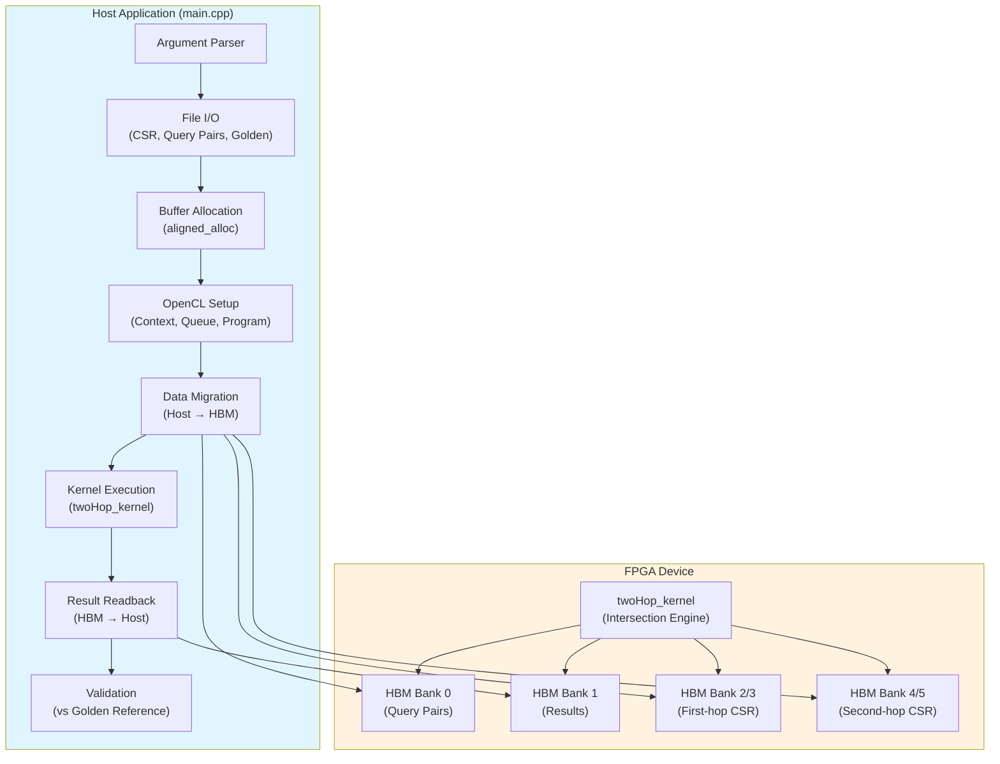

# Two-Hop Pattern Benchmark 技术深度解析

## 一句话概括

本模块实现了一个基于 FPGA 的**两跳邻居交集计数**加速器，用于高效计算图中任意两个顶点的共同邻居数量（即两跳路径数）。它解决了传统 CPU 在处理大规模图结构时随机访问内存带宽受限的瓶颈，通过将图结构存储于 HBM（高带宽内存）并在 FPGA 上实现并行交集计算，实现了数量级的性能提升。

---

## 1. 问题空间与设计动机

### 1.1 什么是"两跳模式"？

想象一个社交网络：Alice 和 Bob 有多少个共同好友？在图论中，这被称为**两跳邻居计数**（Two-Hop Neighbor Count）或**交集大小**（Intersection Size）。形式化地，给定图 $G=(V,E)$，对于查询对 $(u,v)$，我们需要计算：

$$\text{count}(u,v) = |\{w \in V \mid (u,w) \in E \land (w,v) \in E\}|$$

### 1.2 为什么需要硬件加速？

这个问题的计算看似简单，但在大规模图上却极具挑战性：

1. **内存访问随机性**：邻居列表的读取是高度随机的，CPU 缓存命中率极低
2. **数据依赖性强**：交集计算需要同时遍历两个邻居列表，分支预测失败频繁
3. **计算密度低**：每个比较操作只产生少量有效计算，内存带宽成为瓶颈

传统的 CPU 实现通常只能达到每秒数百万次的查询处理能力，而 FPGA 通过 HBM 提供的高带宽并行访问和自定义流水线的细粒度并行，可以将这一数字提升一个数量级。

---

## 2. 心智模型：如何理解这个系统

### 2.1 "电话簿交集"类比

想象你有两本按字母排序的电话簿（邻居列表），需要找出同时出现在两本书中的名字。CPU 的做法是一个人逐页对比——简单但极慢。FPGA 的做法是雇佣数百个小助手，每人负责一小段范围的对比，且所有人同时工作。

**关键抽象**：
- **CSR 格式**：图结构以压缩稀疏行（Compressed Sparse Row）格式存储，包含 `offset` 数组（行起始索引）和 `index` 数组（列索引/邻居 ID）
- **查询对**：每个查询是一个顶点对 $(src, dst)$，打包为 64 位整数（高 32 位为 src，低 32 位为 dst）
- **HBM 分区**：6 个 HBM 银行分别存储查询对、结果、第一跳 CSR（offset/index）、第二跳 CSR（offset/index），实现并行访问

### 2.2 架构概览



---

## 3. 组件深度解析

### 3.1 Host 主程序 (`host/main.cpp`)

这是整个系统的指挥中枢，负责数据准备、设备 orchestration 和结果验证。它的生命周期可以分为四个阶段：

#### 3.1.1 阶段一：数据摄入与解析

```cpp
// 命令行参数解析
ArgParser parser(argc, argv);
parser.getCmdOption("--offset", offsetfile);  // CSR offset 文件
parser.getCmdOption("--index", indexfile);    // CSR index 文件
parser.getCmdOption("--pair", pairfile);      // 查询顶点对
parser.getCmdOption("--golden", goldenfile);  // 黄金标准结果
```

**设计决策**：使用简单的字符串匹配解析器而非 `getopt`，因为 FPGA 加速卡环境通常有轻量级的工具链约束，且参数列表固定。

**文件格式契约**：
- **Offset 文件**：首行包含顶点数，随后每行一个 offset 值（CSR 行指针）
- **Index 文件**：首行包含边数，随后每行一个邻居 ID（可选地跟随一个权重值，此处被忽略）
- **Pair 文件**：首行包含查询对数，随后每行两个顶点 ID（注意代码中执行了 `src - 1` 和 `des - 1`，暗示输入是 1-indexed）

#### 3.1.2 阶段二：内存分配与 OpenCL 上下文建立

```cpp
// 页对齐内存分配（OpenCL 零拷贝必需）
unsigned* offset32 = aligned_alloc<unsigned>(numVertices + 1);
unsigned* index32 = aligned_alloc<unsigned>(numEdges);
ap_uint<64>* pair = aligned_alloc<ap_uint<64>>(numPairs);
unsigned* cnt_res = aligned_alloc<unsigned>(numPairs);
```

**关键实现细节**：
- **对齐要求**：使用 `aligned_alloc` 而非 `malloc`，确保内存地址与 FPGA DMA 引擎的缓存行边界对齐。这是零拷贝（zero-copy）数据传输的前提。
- **内存所有权**：Host 分配并拥有这些缓冲区，通过 `CL_MEM_USE_HOST_PTR` 标志将它们映射到 OpenCL 上下文，实现 Host 与 Device 的内存共享。

```cpp
// OpenCL 设备初始化
std::vector<cl::Device> devices = xcl::get_xil_devices();
cl::Device device = devices[0];
cl::Context context(device, NULL, NULL, NULL, &fail);
cl::CommandQueue q(context, device, 
    CL_QUEUE_PROFILING_ENABLE | CL_QUEUE_OUT_OF_ORDER_EXEC_MODE_ENABLE);
```

**队列配置策略**：
- `CL_QUEUE_PROFILING_ENABLE`：启用事件计时，用于后续性能分析
- `CL_QUEUE_OUT_OF_ORDER_EXEC_MODE_ENABLE`：允许命令乱序执行（虽然本例中是同步执行模式）

#### 3.1.3 阶段三：缓冲区配置与数据传输

```cpp
// 扩展内存指针配置（HBM 银行映射）
std::vector<cl_mem_ext_ptr_t> mext_o(6);
mext_o[0] = {(unsigned int)(0) | XCL_MEM_TOPOLOGY, pair, 0};      // HBM[0]
mext_o[1] = {(unsigned int)(1) | XCL_MEM_TOPOLOGY, cnt_res, 0};  // HBM[1]
mext_o[2] = {(unsigned int)(2) | XCL_MEM_TOPOLOGY, offset32, 0}; // HBM[2]
mext_o[3] = {(unsigned int)(3) | XCL_MEM_TOPOLOGY, index32, 0};  // HBM[3]
mext_o[4] = {(unsigned int)(4) | XCL_MEM_TOPOLOGY, offset32, 0}; // HBM[4]
mext_o[5] = {(unsigned int)(5) | XCL_MEM_TOPOLOGY, index32, 0};  // HBM[5]
```

**HBM 拓扑设计逻辑**：
- **Bank 0**: Query pairs（查询顶点对）— 内核读取输入
- **Bank 1**: Results（计数结果）— 内核写入输出
- **Bank 2/3**: First-hop CSR（第一跳 CSR 数据）— 通常用于源顶点的邻居查找
- **Bank 4/5**: Second-hop CSR（第二跳 CSR 数据）— 通常用于目标顶点的邻居查找或反向图

这种分离允许内核同时访问查询对、写入结果，并并行读取两个 CSR 视图的图结构，最大化 HBM 带宽利用。

```cpp
// 缓冲区创建（零拷贝风格）
cl::Buffer pair_buf(context, 
    CL_MEM_EXT_PTR_XILINX | CL_MEM_USE_HOST_PTR | CL_MEM_READ_WRITE,
    sizeof(ap_uint<64>) * numPairs, &mext_o[0]);
```

**内存策略**：`CL_MEM_USE_HOST_PTR` 结合 `aligned_alloc` 允许 OpenCL 运行时直接使用 Host 分配的内存，避免数据复制。对于大型图结构（数 GB 数据），这节省了大量的内存拷贝开销和双倍的内存占用。

#### 3.1.4 阶段四：内核执行与结果验证

```cpp
// 内核参数绑定
int j = 0;
twoHop.setArg(j++, numPairs);
twoHop.setArg(j++, pair_buf);
twoHop.setArg(j++, offsetOneHop_buf);
twoHop.setArg(j++, indexOneHop_buf);
twoHop.setArg(j++, offsetTwoHop_buf);
twoHop.setArg(j++, indexTwoHop_buf);
twoHop.setArg(j++, cnt_buf);

// 事件依赖链：写入 → 内核执行 → 读取
q.enqueueMigrateMemObjects(ob_in, 0, nullptr, &events_write[0]);
q.enqueueTask(twoHop, &events_write, &events_kernel[0]);
q.enqueueMigrateMemObjects(ob_out, 1, &events_kernel, &events_read[0]);
q.finish();
```

**执行模型**：使用 OpenCL 事件构建依赖链，确保数据迁移完成后才启动内核，内核完成后再读取结果。`enqueueTask` 用于单次内核启动（相对于 `enqueueNDRangeKernel` 的数据并行启动）。

```cpp
// 结果验证（哈希表比对）
std::unordered_map<unsigned long, float> goldenHashMap;
// ... 加载黄金标准到哈希表 ...

std::unordered_map<unsigned long, float> resHashMap;
for (int i = 0; i < numPairs; i++) {
    unsigned long tmp_src = pair[i].range(63, 32) + 1;  // 注意：加 1 转换回 1-indexed
    unsigned long tmp_des = pair[i].range(31, 0) + 1;
    // ... 存入结果哈希表 ...
}

// 比对逻辑：检查缺失项和不匹配项
if (resHashMap.size() != goldenHashMap.size()) 
    std::cout << "miss pairs!" << std::endl;
for (auto it = resHashMap.begin(); it != resHashMap.end(); it++) {
    auto got = goldenHashMap.find(it->first);
    if (got == goldenHashMap.end()) { /* 错误：缺失对 */ }
    else if (got->second != it->second) { /* 错误：计数不匹配 */ }
}
```

**验证策略**：使用 `unordered_map` 实现 $O(1)$ 的查找效率，支持百万级查询对的快速验证。特别注意顶点 ID 的转换：内核使用 0-indexed，但输入文件是 1-indexed（见 `src - 1` 和 `des - 1` 的存储，以及后续验证时的 `+ 1` 恢复）。

### 3.2 内核连接配置 (`conn_u50.cfg`)

```cfg
[connectivity]
sp=twoHop_kernel.m_axi_gmem0:HBM[0]
sp=twoHop_kernel.m_axi_gmem1:HBM[1]
sp=twoHop_kernel.m_axi_gmem2:HBM[2]
sp=twoHop_kernel.m_axi_gmem3:HBM[3]
sp=twoHop_kernel.m_axi_gmem4:HBM[4]
sp=twoHop_kernel.m_axi_gmem5:HBM[5]
slr=twoHop_kernel:SLR0
nk=twoHop_kernel:1:twoHop_kernel
```

**配置语义解析**：
- `sp=`（sp=stream port）：将内核的 AXI4 主接口（`m_axi_gmem0` 至 `m_axi_gmem5`）映射到特定的 HBM 银行（`HBM[0]` 至 `HBM[5]`）
- `slr=`：指定内核布局在 SLR0（Super Logic Region 0），即最靠近 HBM 控制器的区域，以最小化布线延迟
- `nk=`：指定内核实例化数量（1 个）和实例名称

**硬件映射策略**：6 个 HBM 银行分别对应：
1. **HBM[0]**：`pair`（查询对输入）
2. **HBM[1]**：`cnt_res`（计数结果输出）
3. **HBM[2]**：`offset32`（第一跳 CSR 偏移）
4. **HBM[3]**：`index32`（第一跳 CSR 索引/邻居）
5. **HBM[4]**：`offset32`（第二跳 CSR 偏移，复用或反向图）
6. **HBM[5]**：`index32`（第二跳 CSR 索引，复用或反向图）

这种分离允许内核在单个周期内同时发起 6 个独立的 HBM 访问请求，充分利用 HBM 的并行 bank 架构。

---

## 4. 数据流分析：端到端执行轨迹

为了理解数据如何在系统中流动，让我们追踪一个查询对从磁盘到结果验证的完整生命周期：

### 阶段 1：数据摄入与转换（Host 端）

1. **CSR 文件加载**：`offsetfile` 和 `indexfile` 被解析为 `offset32` 和 `index32` 数组。Offset 数组定义了每个顶点的邻居列表在 index 数组中的起始和结束位置。

2. **查询对编码**：`pairfile` 中的每行 `(src, dst)` 被编码为 64 位整数 `ap_uint<64>`，其中高 32 位存储 `src - 1`，低 32 位存储 `dst - 1`。这种打包减少了数据传输开销，并允许内核使用宽总线（512 位）高效读取多个查询对。

3. **页对齐分配**：所有缓冲区使用 `aligned_alloc(4096, ...)` 分配，确保地址与 PCIe DMA 引擎的缓存行边界对齐。这是 `CL_MEM_USE_HOST_PTR` 成功的前提条件。

### 阶段 2：OpenCL 上下文建立与缓冲区映射

1. **设备发现与上下文创建**：通过 `xcl::get_xil_devices()` 发现 Xilinx 设备，创建 `cl::Context` 和 `cl::CommandQueue`。队列配置为支持性能分析（`CL_QUEUE_PROFILING_ENABLE`）和乱序执行（虽然实际使用同步模式）。

2. **XCLBIN 加载与内核创建**：加载编译好的 FPGA 二进制（`xclbin`），实例化 `twoHop_kernel`。

3. **HBM 银行绑定**：创建 6 个 `cl_mem_ext_ptr_t` 结构，每个指定 `XCL_MEM_TOPOLOGY` 标志和 HBM 银行索引（0-5）。这通知运行时将这些缓冲区物理分配到对应的 HBM 银行。

4. **零拷贝缓冲区创建**：使用 `CL_MEM_EXT_PTR_XILINX | CL_MEM_USE_HOST_PTR` 标志创建 `cl::Buffer` 对象。这允许 OpenCL 运行时直接使用 Host 分配的内存，避免数据复制。

### 阶段 3：数据迁移与内核执行（设备端）

1. **缓冲区初始化迁移**：调用 `enqueueMigrateMemObjects` 将 6 个缓冲区从 Host 内存迁移到 Device HBM。由于使用了 `CL_MEM_USE_HOST_PTR`，这实际上是触发 PCIe DMA 传输，将数据从 Host 的页对齐缓冲区传输到 HBM 的物理地址。

2. **输入数据迁移**：第二次迁移将 `pair_buf`、`offsetOneHop_buf`、`indexOneHop_buf`、`offsetTwoHop_buf`、`indexTwoHop_buf` 标记为待传输。这些缓冲区包含实际的图结构和查询对。

3. **内核参数绑定**：设置 `twoHop_kernel` 的参数：
   - `numPairs`：查询对数量（标量）
   - `pair_buf`：查询对缓冲区（HBM[0]）
   - `offsetOneHop_buf`：第一跳 offset（HBM[2]）
   - `indexOneHop_buf`：第一跳 index（HBM[3]）
   - `offsetTwoHop_buf`：第二跳 offset（HBM[4]）
   - `indexTwoHop_buf`：第二跳 index（HBM[5]）
   - `cnt_buf`：结果缓冲区（HBM[1]）

4. **内核执行**：调用 `enqueueTask` 启动内核。这是一个单工作项（single work-item）内核，不同于 NDRange 风格的并行启动。内核内部使用 HLS 数据流（`#pragma HLS DATAFLOW`）实现并行流水线。

5. **结果回传**：内核完成后，调用 `enqueueMigrateMemObjects` 将 `cnt_buf`（位于 HBM[1]）传输回 Host 内存。

### 阶段 4：结果验证（Host 端）

1. **黄金标准加载**：解析 `goldenfile`，将每个查询对 $(src, dst)$ 及其期望的计数值存入 `goldenHashMap`。使用 64 位键值 `((uint64_t)src << 32) | dst` 唯一标识查询对。

2. **结果哈希表构建**：从 `cnt_res` 数组提取 FPGA 计算结果，同样存入 `resHashMap`。注意此处执行了 ID 转换：`tmp_src = pair[i].range(63, 32) + 1`，将内核输出的 0-indexed ID 转回 1-indexed 以匹配黄金标准格式。

3. **比对逻辑**：
   - 首先检查哈希表大小是否一致（防止漏算）
   - 遍历 `resHashMap`，在 `goldenHashMap` 中查找对应键
   - 若键不存在，报告"缺失对"错误
   - 若值不匹配，报告"计数错误"并输出详细对比信息

4. **日志输出**：使用 `xf::common::utils_sw::Logger` 输出最终测试结果（通过或失败）。

---

## 5. 设计决策与权衡分析

### 5.1 内存架构：HBM 分区策略

**决策**：将 6 个缓冲区分别映射到 6 个独立的 HBM 银行。

**权衡分析**：
- **优势**：最大化并行性。内核可以同时发起 6 个独立的内存访问请求，理论带宽可达 6 × HBM 单银行带宽。
- **代价**：增加了硬件连接复杂性（需要 6 个 `m_axi` 接口），消耗更多 FPGA 逻辑资源用于 AXI 协议处理。
- **替代方案**：使用 DDR4 内存（更大容量但更低带宽），或共享 HBM 银行（通过仲裁器，但增加访问延迟）。

**为何这样选择**：图分析任务通常是内存带宽受限（memory-bound）而非计算受限。HBM 提供的高带宽（通常 200-300 GB/s 每堆栈）是满足实时查询需求的关键。

### 5.2 数据传输：零拷贝 vs 显式拷贝

**决策**：使用 `CL_MEM_USE_HOST_PTR` 结合 `aligned_alloc` 实现零拷贝数据传输。

**权衡分析**：
- **优势**：
  - 消除 Host 与 Device 之间的显式数据拷贝，节省内存带宽和时间
  - Host 可以直接访问 `cnt_res` 缓冲区进行结果验证，无需额外的 `memcpy`
  - 减少系统内存占用（无需维护 Device 和 Host 各一份数据副本）
- **代价**：
  - 要求 Host 内存必须页对齐（通常 4KB 边界），增加了分配复杂性
  - 依赖硬件支持的 PCIe 主设备（Bus Mastering）能力，旧的或不兼容的平台可能不支持
  - 缓存一致性问题：Host 和 Device 同时写入同一页可能导致数据不一致（本设计中 Device 只写入 `cnt_res`，Host 只读取，避免了竞争）

**为何这样选择**：图数据通常很大（数 GB），显式拷贝的开销不可接受。零拷贝是 FPGA 加速应用的标准实践。

### 5.3 验证策略：哈希表 vs 线性扫描

**决策**：使用 `std::unordered_map` 存储黄金标准和结果，实现 $O(1)$ 的查找比对。

**权衡分析**：
- **优势**：对于 $N$ 个查询对，比对时间从 $O(N^2)$ 降至 $O(N)$，当 $N$ 达到百万级时差异显著。
- **代价**：哈希表本身有内存开销（通常 2-3 倍数据量），且构建哈希表需要一定时间（常数因子较大）。
- **替代方案**：如果查询对天然有序，归并比对（merge-based）可以达到 $O(N)$ 且内存友好，但要求输入排序，增加了前置处理。

**为何这样选择**：验证阶段不是性能瓶颈，清晰和鲁棒性优先。`unordered_map` 提供了最直观的键值查找接口。

### 5.4 错误处理：致命错误 vs 恢复

**决策**：对于文件 I/O 错误和 OpenCL 错误，直接调用 `exit(1)` 终止程序；对于验证错误，累积错误计数并生成详细报告。

**权衡分析**：
- **设计哲学**：这是一个**基准测试程序**（benchmark），而非生产服务。其目标是快速验证 FPGA 实现的正确性和性能，而不是优雅地处理所有边界情况。
- **致命错误**：文件不存在、OpenCL 设备初始化失败等属于环境配置问题，继续执行无意义。
- **可恢复错误**：验证阶段的不匹配是测试的"预期产出"（即测试失败），需要完整报告所有错误以便调试。

**注意事项**：在生产环境中复用此代码时，应当将 `exit()` 调用替换为异常抛出或错误码返回，以支持资源清理和上层恢复。

---

## 6. 依赖关系与调用图谱

### 6.1 本模块依赖的组件

| 依赖项 | 类型 | 用途 | 契约/约束 |
|--------|------|------|-----------|
| `xcl2.hpp` | Xilinx 库 | OpenCL 设备管理、XCLBIN 加载 | 必须链接 Xilinx 运行时库 (XRT) |
| `xf_utils_sw/logger.hpp` | Xilinx 库 | 结构化日志输出 | 提供 TEST_PASS/TEST_FAIL 枚举 |
| `ap_int.h` | Xilinx HLS | 任意精度整数类型 (`ap_uint<64>`) | 用于位域打包顶点对 |
| OpenCL 1.2+ | 标准库 | 异构计算运行时 | 需要 OpenCL ICD 和 Xilinx 平台 |
| `sys/time.h` | POSIX | 高精度计时 (`gettimeofday`) | 用于端到端时间测量 |

### 6.2 调用本模块的上层组件

根据模块树结构，本模块位于：
```
graph_analytics_and_partitioning/
└── l2_graph_patterns_and_shortest_paths_benchmarks/
    └── twohop_pattern_benchmark/
```

上层调用者通常是：
- **自动化测试框架**：CI/CD 流水线调用预编译的 xclbin 和测试数据集
- **性能基准套件**：与 Triangle Count、Shortest Path 等模块一起作为 L2 级基准对比
- **算法研究工具**：研究人员修改查询对文件以评估特定图模式的性能

### 6.3 数据契约与接口边界

**Host-to-Kernel 接口（OpenCL 缓冲区契约）**：

| 缓冲区 | HBM 银行 | 方向 | 大小计算 | 对齐要求 | 数据格式 |
|--------|----------|------|----------|----------|----------|
| `pair_buf` | HBM[0] | R | `sizeof(ap_uint<64>) * numPairs` | 4KB | 打包 64 位：(src-1) << 32 | (dst-1) |
| `cnt_buf` | HBM[1] | W | `sizeof(unsigned) * numPairs` | 4KB | 32 位无符号整数计数 |
| `offsetOneHop_buf` | HBM[2] | R | `sizeof(unsigned) * (numVertices + 1)` | 4KB | CSR 行偏移数组 |
| `indexOneHop_buf` | HBM[3] | R | `sizeof(unsigned) * numEdges` | 4KB | CSR 列索引数组 |
| `offsetTwoHop_buf` | HBM[4] | R | `sizeof(unsigned) * (numVertices + 1)` | 4KB | 第二跳 CSR 偏移 |
| `indexTwoHop_buf` | HBM[5] | R | `sizeof(unsigned) * numEdges` | 4KB | 第二跳 CSR 索引 |

**文件格式契约**：

- **Offset 文件**：
  ```
  <numVertices> <numVertices>  // 首行：顶点数（重复两次）
  0                             // 第 1 个顶点的偏移
  <degree_0>                    // 第 2 个顶点的偏移 = degree(vertex_0)
  <degree_0 + degree_1>         // 第 3 个顶点的偏移
  ...
  ```

- **Index 文件**：
  ```
  <numEdges>                    // 首行：边数
  <neighbor_id_0> <weight_0>      // 邻居 ID 和权重（权重被忽略）
  <neighbor_id_1> <weight_1>
  ...
  ```

- **Pair 文件**：
  ```
  <numPairs>                    // 首行：查询对数
  <src_id_1> <dst_id_1>         // 顶点对（1-indexed）
  <src_id_2> <dst_id_2>
  ...
  ```

**注意**：代码中执行 `src - 1` 和 `des - 1` 将 1-indexed 输入转换为 0-indexed 存储，验证阶段通过 `+ 1` 恢复以匹配黄金标准格式。

---

## 7. 使用方式与配置选项

### 7.1 构建与运行

**编译（典型的 Xilinx Vitis 流程）**：
```bash
# 设置环境
source /opt/xilinx/xrt/setup.sh
source /tools/Xilinx/Vitis/202x.x/settings64.sh

# 编译主机代码
# 注意：需要定义 HLS_TEST 以进行软件仿真，否则为硬件运行
 g++ -std=c++11 -I$XILINX_XRT/include -I/path/to/xf_utils_sw \
     -o twohop_benchmark host/main.cpp \
     -L$XILINX_XRT/lib -lOpenCL -lpthread -lrt
```

**运行**：
```bash
./twohop_benchmark -xclbin twoHop.xclbin \
    --offset graph_offset.txt \
    --index graph_index.txt \
    --pair query_pairs.txt \
    --golden expected_results.txt
```

### 7.2 输入数据准备

**图数据生成示例**（使用 Python 和 NetworkX）：
```python
import networkx as nx
import numpy as np

# 生成随机图
G = nx.erdos_renyi_graph(n=10000, p=0.001, directed=True)
G = nx.DiGraph(G)  # 确保有向

# 保存 CSR 格式
num_vertices = G.number_of_nodes()
num_edges = G.number_of_edges()

# Offset 数组（0-indexed）
offsets = [0]
for i in range(num_vertices):
    offsets.append(offsets[-1] + G.out_degree(i))

# 写入 offset 文件（注意：代码期望 1-indexed 顶点，但内部转换）
with open('graph_offset.txt', 'w') as f:
    f.write(f"{num_vertices} {num_vertices}\n")
    for off in offsets[:-1]:  # 排除最后一个（等于 num_edges）
        f.write(f"{off}\n")

# Index 数组（邻居列表）
with open('graph_index.txt', 'w') as f:
    f.write(f"{num_edges}\n")
    for i in range(num_vertices):
        for neighbor in sorted(G.successors(i)):
            f.write(f"{neighbor} 1.0\n")  # 权重占位

# 生成随机查询对
num_pairs = 1000
pairs = []
for _ in range(num_pairs):
    u = np.random.randint(1, num_vertices + 1)  # 1-indexed
    v = np.random.randint(1, num_vertices + 1)
    pairs.append((u, v))

with open('query_pairs.txt', 'w') as f:
    f.write(f"{num_pairs}\n")
    for u, v in pairs:
        f.write(f"{u} {v}\n")

# 计算黄金标准结果
with open('expected_results.txt', 'w') as f:
    for u, v in pairs:  # u, v 是 1-indexed
        u_idx = u - 1   # 转为 0-indexed 用于 NetworkX
        v_idx = v - 1
        # 计算共同邻居数
        common = len(list(nx.common_neighbors(G, u_idx, v_idx)))
        f.write(f"{u}, {v}, {common}\n")
```

---

## 8. 边缘情况与陷阱警示

### 8.1 顶点 ID 索引转换陷阱

**陷阱**：输入文件使用 **1-indexed** 顶点 ID（即第一个顶点编号为 1），但内核内部使用 **0-indexed**。代码中执行了自动转换：

```cpp
// 存储时：1-indexed → 0-indexed
tmp64.range(63, 32) = src - 1;
tmp64.range(31, 0) = des - 1;

// 验证时：0-indexed → 1-indexed
unsigned long tmp_src = pair[i].range(63, 32) + 1;
unsigned long tmp_des = pair[i].range(31, 0) + 1;
```

**后果**：如果输入文件已经是 0-indexed，减 1 操作会导致下溢（对于无符号整数会变成极大的值），导致内核访问非法内存位置或产生错误结果。

**检测方法**：检查输入文件的首个顶点 ID。如果是 0，需要将所有 ID 加 1 后再使用，或修改源代码移除 `- 1` 操作。

### 8.2 内存对齐要求

**陷阱**：Host 代码使用 `aligned_alloc(4096, ...)` 分配内存，这是使用 `CL_MEM_USE_HOST_PTR` 创建零拷贝缓冲区的**强制要求**。

```cpp
// 正确：页对齐分配
unsigned* offset32 = aligned_alloc<unsigned>(numVertices + 1);

// 错误：非对齐分配（将导致 OpenCL 错误或数据损坏）
// unsigned* offset32 = (unsigned*)malloc(sizeof(unsigned) * (numVertices + 1));
```

**后果**：如果使用 `malloc` 或其他非对齐分配方式，OpenCL 运行时可能拒绝创建缓冲区（返回 `CL_INVALID_HOST_PTR`），或在数据传输时产生静默的数据损坏（因为 DMA 引擎只能从对齐地址开始传输）。

**建议**：始终使用 `posix_memalign`、`aligned_alloc` 或 `_aligned_malloc`（Windows）进行 FPGA 缓冲区分配。

### 8.3 HBM 容量限制

**陷阱**：U50 加速卡的每个 HBM 银行容量为 **256 MB**（共 4GB 总计），但可用容量略少（通常约 240-250 MB 每银行）。

```cpp
// 潜在溢出的例子
int numVertices = 1000000;  // 100 万顶点
unsigned* offset32 = aligned_alloc<unsigned>(numVertices + 1);  // ~4 MB
// OK for HBM

int numEdges = 50000000;  // 5000 万边
unsigned* index32 = aligned_alloc<unsigned>(numEdges);  // ~200 MB
// OK for HBM, but getting close to limit

int numPairs = 10000000;  // 1000 万查询对
ap_uint<64>* pair = aligned_alloc<ap_uint<64>>(numPairs);  // ~80 MB
// OK
```

**后果**：如果单个缓冲区超过 HBM 银行容量（256 MB），Vitis 链接器将在构建 xclbin 时报错，或在运行时出现内存分配失败。

**缓解策略**：
1. **数据分片**：将大型图分成多个小块，顺序处理
2. **使用 DDR**：对于超大容量、低带宽需求的数据，使用板载 DDR4（通常 16-64 GB）
3. **压缩索引**：使用 32 位而非 64 位索引（本代码已采用），或使用更激进的压缩如 varint

### 8.4 顶点 ID 溢出

**陷阱**：代码使用 32 位无符号整数（`unsigned`）存储顶点 ID 和偏移量。

```cpp
unsigned* offset32 = aligned_alloc<unsigned>(numVertices + 1);
unsigned* index32 = aligned_alloc<unsigned>(numEdges);
```

**限制**：`unsigned`（通常为 32 位）最大值为 4,294,967,295（约 43 亿）。这意味着：
- 图最多支持约 **43 亿条边**（对于 numEdges）
- 单个顶点的度数（degree）最多约 43 亿（实际上受限于 offset 数组的差值计算）

**对于更大规模**（如 trillion-edge 图），需要：
- 将 `unsigned` 改为 `uint64_t` 或 `ap_uint<64>`
- 修改内核以支持 64 位地址和索引
- 注意这将增加 HBM 带宽需求（每个索引 8 字节而非 4 字节）

### 8.5 黄金标准格式不匹配

**陷阱**：验证代码期望特定的黄金标准文件格式，不匹配会导致误报失败。

```cpp
// 黄金文件解析代码
while (goldenfstream.getline(line, sizeof(line))) {
    std::string str(line);
    std::replace(str.begin(), str.end(), ',', ' ');  // 将逗号替换为空格
    std::stringstream data(str.c_str());
    unsigned long golden_src;
    unsigned long golden_des;
    unsigned golden_res;
    data >> golden_src;
    data >> golden_des;
    data >> golden_res;
    // ...
}
```

**期望格式**：`src, dst, count`（逗号分隔，如 `123, 456, 10`）

**常见错误**：
- 使用空格分隔而非逗号：`123 456 10`（会被解析，但 `std::replace` 是冗余的）
- 使用制表符分隔：解析可能失败
- 顺序错误：`count, src, dst` 会导致验证逻辑错误
- 缺少字段：只有 `src, dst` 没有 `count`

**建议**：使用 Python 脚本生成黄金标准时，严格按照 `f"{src}, {dst}, {count}\n"` 格式写入。

---

## 9. 总结与进一步阅读

### 9.1 核心要点回顾

Two-Hop Pattern Benchmark 是一个完整的 FPGA 加速基准测试系统，核心特点包括：

1. **内存分层优化**：通过 6 路 HBM 分区实现并行图数据访问，最大化内存带宽利用率
2. **零拷贝架构**：使用 `CL_MEM_USE_HOST_PTR` 避免 Host-Device 数据复制，支持大型图数据集
3. **灵活验证框架**：基于哈希表的对比机制支持百万级查询对的快速正确性验证

### 9.2 相关模块导航

| 模块 | 关系 | 说明 |
|------|------|------|
| `graph_analytics_and_partitioning/l2_graph_patterns_and_shortest_paths_benchmarks/triangle_count_benchmarks` | 兄弟模块 | 类似的图模式匹配，但计算三角形而非两跳邻居 |
| `graph_analytics_and_partitioning/l2_graph_patterns_and_shortest_paths_benchmarks/shortest_path_float_pred_benchmark` | 兄弟模块 | 最短路径计算，使用不同的图算法 |
| `graph_analytics_and_partitioning/l3_openxrm_algorithm_operations/similarity_and_twohop_operations/op_twohop` | L3 层模块 | OpenXRM 框架的两跳操作封装，更高层抽象 |

### 9.3 扩展阅读

- **Xilinx Vitis 文档**：了解 HLS 内核开发、OpenCL Host 编程和 HBM 配置
- **《Graph Processing on FPGAs》**：图计算在 FPGA 上的架构设计综述
- **Compressed Sparse Row (CSR) 格式**：标准图存储格式的详细说明

---

*本文档基于 Xilinx Vitis Libraries 2024.2 版本的代码分析。如有更新，请以最新版本代码为准。*
