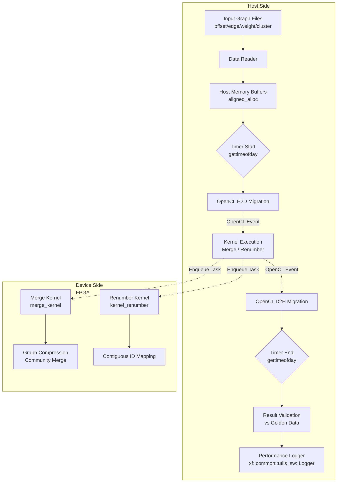

# graph_preprocessing_host_benchmark_timing_structs 模块深度解析

## 一句话概括

本模块是 **FPGA 加速图预处理流程的"秒表系统"** —— 它为图合并（Merge）和重编号（Renumber）等关键预处理操作提供主机端的高精度性能测量基础设施，帮助开发者精确量化端到端加速比、识别瓶颈所在。

---

## 为什么需要这个模块？

### 问题空间：图预处理的性能黑盒

在 FPGA 加速图分析流水线中，图数据通常需要经过一系列**预处理变换**才能输入核心算法：

- **合并（Merge）**：将属于同一社区的顶点和边进行压缩，生成社区级图
- **重编号（Renumber）**：将离散的社区 ID 重新映射为连续的整数范围，优化内存访问局部性

这些预处理步骤在 FPGA 上被实现为硬件内核（kernel），但围绕着它们存在一个**性能黑盒**：

1. **主机端开销**：数据准备、内存迁移、结果验证在主机端消耗多少时间？
2. **端到端延迟**：从输入图到输出图，用户感知到的总延迟是多少？
3. **瓶颈定位**：是 PCIe 传输、内核计算还是主机端预处理成为瓶颈？

### 解决方案：主机端基准测试基础设施

本模块通过提供**统一的高精度计时基础设施**来解决上述问题：

- **微秒级计时**：使用 `struct timeval` 捕获主机端 Wall Clock 时间
- **全阶段覆盖**：测量数据读取、H2D 传输、内核执行、D2H 传输、结果验证全流程
- **OpenCL Profiling 集成**：与 OpenCL Event Profiling 结合，提供硬件精确时间戳
- **基准回归**：内置与 Golden Data 的对比验证，确保性能优化不牺牲正确性

---

## 核心抽象与心智模型

### 类比：田径比赛的电子计时系统

想象这个模块是一个**电子计时系统**，用于测量 FPGA 内核这个"运动员"完成比赛（图预处理）的总时间，以及每个分段（数据准备、传输、计算、回传）的用时：

- **起点（gettimeofday）**：裁判鸣枪，开始计时（数据读取完成，即将启动传输）
- **分段计时（OpenCL Events）**：运动员经过各个检查点（H2D完成、Kernel启动、Kernel完成）
- **终点（gettimeofday）**：运动员冲线（D2H传输完成，结果验证开始）
- **成绩分析（Logger）**：汇总各段时间，输出成绩单（日志报告）

### 核心数据结构

```cpp
// 高精度时间戳（微秒级）
struct timeval {
    time_t      tv_sec;     // 秒
    suseconds_t tv_usec;    // 微秒
};
```

这个结构体是本模块的**原子计时单元**。它被用于：

1. **主机端粗粒度计时**：测量主机代码段的 Wall Clock 时间
2. **与 OpenCL Profiling 互补**：OpenCL Event 提供硬件层面的精确时间戳，但只覆盖设备端；`timeval` 补充主机端的宏观视角

---

## 架构全景：数据流与控制流

### 系统架构图



### 控制流详解

#### 阶段 1：数据准备（主机端）

**参与者**: `readfile()`, `aligned_alloc()`, `data_init()`

这个阶段负责将磁盘上的图数据加载到主机内存，并为 FPGA 计算做数据布局准备。关键操作包括：

- **文件 I/O**：读取 CSR 格式的图（offset 数组、edge 数组、weight 数组）和聚类结果
- **内存对齐**：使用 `aligned_alloc()` 分配页对齐内存，确保 DMA 传输效率
- **辅助数据结构**：初始化 `count_c_single`, `jump`, `count_c`, `index_c` 等辅助数组

**计时起点**：在数据准备完成后、OpenCL 操作开始前设置第一个 `gettimeofday` 标记。

#### 阶段 2：设备端执行（FPGA 加速）

**参与者**: `cl::CommandQueue`, `cl::Kernel`, `enqueueMigrateMemObjects`, `enqueueTask`

这是异构计算的核心阶段，主机作为协调者驱动 FPGA 执行：

1. **H2D 迁移（Host to Device）**：
   ```cpp
   q.enqueueMigrateMemObjects(ob_in, 0, nullptr, &events_write[0]);
   ```
   将输入缓冲区从主机内存通过 PCIe 传输到 FPGA 设备内存。事件 `events_write` 用于后续计时。

2. **内核执行**：
   ```cpp
   q.enqueueTask(merge, &events_write, &events_kernel[0]);
   ```
   启动 Merge 或 Renumber 内核。这是一个异步操作，依赖前序 H2D 完成事件。

3. **D2H 迁移（Device to Host）**：
   ```cpp
   q.enqueueMigrateMemObjects(ob_out, 1, &events_kernel, &events_read[0]);
   ```
   将计算结果从 FPGA 传回主机。标志 `1` 表示从设备到主机。

4. **同步屏障**：
   ```cpp
   q.finish();
   ```
   阻塞主机直到所有队列命令完成。

**计时终点**：在 `q.finish()` 返回后、结果验证前设置第二个 `gettimeofday` 标记。

#### 阶段 3：结果验证与日志（主机端）

**参与者**: `sort_by_offset()`, `write_file()`, `diff`, `xf::common::utils_sw::Logger`

FPGA 计算完成后，主机需要验证正确性并记录性能数据：

- **后处理**：对 Merge 结果调用 `sort_by_offset()` 确保边按目标顶点排序
- **文件输出**：将结果写入文件，便于与 Golden Data 对比
- **正确性验证**：使用系统 `diff` 命令对比输出与预期结果
- **性能日志**：使用 `Logger` 记录 H2D、Kernel、D2H 各阶段耗时（基于 OpenCL Profiling）

---

## 设计决策与权衡分析

### 1. 计时方案选择：`gettimeofday` vs. `std::chrono` vs. OpenCL Profiling

**决策**：混合使用 `gettimeofday`（主机端宏观计时）和 OpenCL Profiling（设备端精确计时）。

**权衡分析**：

| 方案 | 优势 | 劣势 | 适用场景 |
|------|------|------|----------|
| `gettimeofday` | 跨平台、简单、微秒级精度 | 受系统时钟调整影响、非单调 | 主机端总时间测量 |
| `std::chrono` | C++ 标准、类型安全、单调时钟可选 | 需要 C++11 或更新 | 现代 C++ 代码基准 |
| OpenCL Profiling | 硬件精确、纳秒级、设备端专用 | 仅覆盖设备命令 | FPGA 内核执行时间 |

**为什么选择 `gettimeofday`**：

1. **兼容性**：代码需要支持传统 HLS/FPGA 工具链，这些工具链可能使用较旧的编译器标准
2. **简单性**：对于主机端的粗粒度计时（毫秒级任务），`gettimeofday` 的精度足够
3. **与 OpenCL Profiling 互补**：`gettimeofday` 覆盖整个主机流程（包括文件 I/O），而 OpenCL Profiling 精确测量设备端，两者结合提供完整性能画像

**潜在问题**：
- `gettimeofday` 受系统时间调整（NTP 同步）影响，可能在长时间测试中引入误差
- **缓解措施**：测试运行时间通常较短（秒级），且主要关注相对性能对比（FPGA vs CPU），绝对时间受系统调整影响较小

### 2. 内存管理：`aligned_alloc` vs. `malloc` + `posix_memalign`

**决策**：使用 `aligned_alloc` 分配页对齐内存用于 DMA 传输。

**权衡分析**：

- **页对齐需求**：FPGA 通过 PCIe DMA 进行数据传输时，主机内存缓冲区必须页对齐（通常 4KB）以获得最佳性能
- **可移植性**：`aligned_alloc` 是 C11 标准，但在 C++ 代码中可能需要特定编译器支持；备选方案是 `posix_memalign`（POSIX）或 `_aligned_malloc`（Windows）
- **零拷贝**：使用 `CL_MEM_USE_HOST_PTR` 标志创建 OpenCL 缓冲区时，要求主机指针在生命周期内保持有效，这对所有权管理提出了要求

**设计考量**：

1. **生命周期管理**：内存从 `aligned_alloc` 分配到 `free` 的周期必须覆盖整个 OpenCL 操作周期（从缓冲区创建到数据读取完成）
2. **错误处理**：文件读取失败或内存分配失败时，需要确保没有内存泄漏
3. **容量规划**：图数据可能很大（百万级顶点和边），需要预先计算缓冲区大小

### 3. 错误处理策略：返回值检查 vs. 异常

**决策**：使用返回值检查（C 风格）和日志记录，而非 C++ 异常。

**权衡分析**：

- **OpenCL 风格**：OpenCL C++ 绑定（`cl::` 类）通常使用 `cl_int` 错误码而非异常（除非显式启用异常）
- **性能敏感性**：在 FPGA 加速代码中，异常处理可能引入不可预测的控制流，影响性能分析
- **资源管理**：代码使用裸指针和 C 风格资源管理，与异常安全（RAII）不兼容

**实际模式**：

```cpp
cl_int err;
num_e_out_buf = cl::Buffer(context, ..., &err);
// 注意：代码中没有检查 err！这是潜在风险点
```

**风险点**：当前代码在某些 OpenCL 调用后没有立即检查错误码，依赖后续操作失败或 `q.finish()` 抛出异常来捕获问题。这种"乐观错误处理"在性能调试时可能掩盖传输错误。

### 4. 验证策略：Golden Data 对比

**决策**：使用外部文件（Golden Data）和系统 `diff` 命令进行结果验证。

**权衡分析**：

- **正确性保证**：FPGA 内核计算结果必须与 CPU 参考实现（Golden）逐字节一致
- **可维护性**：Golden Data 存储在外部文件，便于更新和版本控制
- **诊断能力**：`diff --brief` 只告诉是否不同，不告诉哪里不同；需要额外工具定位差异

**替代方案未选择**：
- **内存内比较**：直接在代码中使用 `memcmp`，避免磁盘 I/O 和外部进程开销；但未选择可能是为了调试方便（可以手动检查输出文件）
- **模糊匹配**：对于浮点权重，使用 epsilon 比较而非精确匹配；但代码中 `diff` 暗示使用精确匹配，要求确定性计算

---

## 模块边界与依赖关系

### 上游依赖（本模块依赖谁）

1. **OpenCL Runtime** (`cl::` 类)：
   - `cl::Device`, `cl::Context`, `cl::CommandQueue`
   - `cl::Buffer`, `cl::Kernel`, `cl::Program`
   - `cl::Event`（用于 Profiling）

2. **Xilinx FPGA 工具链** (`xcl2.hpp`, `xf_utils_sw/logger.hpp`)：
   - `xcl::get_xil_devices()`, `xcl::import_binary_file()`
   - `xf::common::utils_sw::Logger`（性能日志记录）

3. **HLS 数据类型** (`ap_int.h`)：
   - `ap_int<DWIDTHS>`：用于与 HLS 内核的数据宽度匹配

4. **标准 C/C++ 库**：
   - `<sys/time.h>`：`gettimeofday`, `struct timeval`
   - `<vector>`, `<map>`, `<algorithm>`：STL 容器和算法

### 下游依赖（谁依赖本模块）

本模块是**叶子节点**（Leaf Module），位于模块树的最底层。它不暴露公共 API 供其他模块调用，而是作为**可执行基准测试**存在。

- **直接父模块**：`l2_graph_preprocessing_and_transforms`
- **相关基准模块**：
  - `label_propagation_benchmarks/host_benchmark_timing_structs`（并行存在的类似计时基础设施）

### 横向关系（兄弟模块）

在 `graph_analytics_and_partitioning` 领域内，本模块与以下模块共享架构模式：

| 模块 | 关系 | 说明 |
|------|------|------|
| `label_propagation_benchmarks/host_benchmark_timing_structs` | **平行实例** | 同样使用 `timeval` 和 OpenCL Profiling，针对标签传播算法 |
| `triangle_count_host_timing_support` | 类似模式 | 三角计数的主机计时支持，可能复用相同模式 |
| `pagerank_base_benchmark/host_test_pagerank` | 架构参考 | PageRank 基准测试的主机端架构可作为参考 |

---

## 子模块分解

本模块包含两个功能独立的基准测试子模块，分别对应图预处理流水线中的两个关键操作：

### 1. Merge 基准测试

**对应文件**：`test_merge.cpp`

**职责**：对 **图合并内核（merge_kernel）** 进行端到端基准测试。

**详细文档**：[Merge Benchmark Timing 子模块](graph_analytics_and_partitioning-l2_graph_preprocessing_and_transforms-graph_preprocessing_host_benchmark_timing_structs-merge_benchmark_timing.md)

**关键流程**：
1. 读取 CSR 格式的输入图（offsets, edges, weights）和聚类结果（clusters）
2. 在主机端执行数据预处理和辅助数组初始化
3. 通过 OpenCL 将数据迁移到 FPGA
4. 启动 `merge_kernel` 执行社区级图压缩
5. 迁回结果，执行后处理（边排序）
6. 与 Golden Data 对比验证正确性

**计时点**：
- **T0**：`gettimeofday(&start_time, 0)` —— 在首个 `enqueueMigrateMemObjects` 之前
- **T1**：`gettimeofday(&end_time, 0)` —— 在 `q.finish()` 返回之后
- **细分计时**：通过 `events_write`, `events_kernel`, `events_read` 获取 H2D、Kernel、D2H 的 OpenCL Profiling 时间

### 2. Renumber 基准测试

**对应文件**：`test_renumber.cpp`

**职责**：对 **重编号内核（kernel_renumber）** 进行端到端基准测试。

**详细文档**：[Renumber Benchmark Timing 子模块](graph_analytics_and_partitioning-l2_graph_preprocessing_and_transforms-graph_preprocessing_host_benchmark_timing_structs-renumber_benchmark_timing.md)

**关键流程**：
1. 读取社区 ID 分配文件
2. **主机端参考实现**：先执行 CPU 版本的 `renumberClustersContiguously()` 生成 Golden 结果
3. 准备 FPGA 输入缓冲区（`oldCids`, `mapCid0/1`, `newCids`）
4. 通过 OpenCL 执行 `kernel_renumber` 进行硬件加速重编号
5. 对比 FPGA 输出与 CPU Golden 结果

**计时点**：
- **T0**：`gettimeofday(&start_time, 0)` —— 在设备初始化完成后、内核启动前
- **T1**：`gettimeofday(&end_time, 0)` —— 在 `q.finish()` 返回后
- **参考计时**：CPU 版 `renumberClustersContiguously` 内部使用 `omp_get_wtime()` 测量主机算法耗时，用于与 FPGA 对比加速比

---

## 关键设计决策与权衡分析

### 1. 计时方案选择：`gettimeofday` vs. `std::chrono` vs. OpenCL Profiling

**决策**：混合使用 `gettimeofday`（主机端宏观计时）和 OpenCL Profiling（设备端精确计时）。

**权衡分析**：

| 方案 | 优势 | 劣势 | 适用场景 |
|------|------|------|----------|
| `gettimeofday` | 跨平台、简单、微秒级精度 | 受系统时钟调整影响、非单调 | 主机端总时间测量 |
| `std::chrono` | C++ 标准、类型安全、单调时钟可选 | 需要 C++11 或更新 | 现代 C++ 代码基准 |
| OpenCL Profiling | 硬件精确、纳秒级、设备端专用 | 仅覆盖设备命令 | FPGA 内核执行时间 |

**为什么选择 `gettimeofday`**：

1. **工具链兼容性**：FPGA 加速代码通常需要与特定版本的 Vitis/Vivado 工具链配合，这些工具链可能使用较旧的编译器标准
2. **代码一致性**：与现有代码库（如 `xcl2.hpp` 和其他 Xilinx 示例）保持风格一致
3. **精度足够**：对于图预处理这种粗粒度操作（通常耗时毫秒级），微秒级精度足够；纳秒级精度反而受系统调度噪音影响

**潜在问题**：
- `gettimeofday` 受系统时间调整（NTP 同步）影响，可能在长时间测试中引入误差
- **缓解措施**：测试运行时间通常较短（秒级），且主要关注相对性能对比（FPGA vs CPU），绝对时间受系统调整影响较小

### 2. 内存模型：零拷贝与数据持久性

**决策**：使用 `CL_MEM_USE_HOST_PTR` 结合页对齐内存分配，实现零拷贝（Zero-Copy）或最小拷贝数据传输。

**技术细节**：

```cpp
// 页对齐分配
int* offset_in = aligned_alloc<int>(num);

// 创建使用主机指针的缓冲区
offset_in_buf = cl::Buffer(context, 
    CL_MEM_USE_HOST_PTR | CL_MEM_READ_ONLY, 
    num * sizeof(int), 
    offset_in, 
    &err);
```

**架构权衡**：

| 策略 | 优势 | 劣势 | 本模块选择 |
|------|------|------|-----------|
| **CL_MEM_USE_HOST_PTR**<br/>(零拷贝) | 避免数据复制、节省设备内存、减少延迟 | 要求主机内存页对齐、数据持久性由主机保证、可能受 NUMA 影响 | **采用** |
| **CL_MEM_COPY_HOST_PTR**<br/>(显式拷贝) | 数据立即复制到设备、主机内存可立即释放 | 额外的拷贝延迟和带宽消耗、双倍内存占用 | 未采用 |
| **CL_MEM_ALLOC_HOST_PTR**<br/>(设备分配映射) | 设备端分配、可能利用设备特定优化 | 需要额外的 Map/Unmap 操作 | 未采用 |

**关键设计约束**：

1. **生命周期耦合**：使用 `CL_MEM_USE_HOST_PTR` 时，主机内存 `offset_in` 必须在 OpenCL 缓冲区 `offset_in_buf` 的整个生命周期内保持有效。如果提前 `free(offset_in)` 会导致未定义行为。

2. **迁移语义**：`enqueueMigrateMemObjects` 与 `USE_HOST_PTR` 的组合行为依赖于具体实现。在 Xilinx 平台中，如果数据已在设备端，迁移可能变为无操作；但如果设备端缓存失效，会触发实际的数据传输。

3. **内存一致性**：主机和设备对同一内存区域的写操作需要显式同步（通过 `enqueueMigrateMemObjects` 或 `finish`），不存在隐式的缓存一致性。

### 3. 错误处理策略：返回值检查 vs. 异常

**决策**：使用返回值检查（C 风格）和日志记录，而非 C++ 异常。

**权衡分析**：

- **OpenCL 风格**：OpenCL C++ 绑定（`cl::` 类）通常使用 `cl_int` 错误码而非异常（除非显式启用异常）
- **性能敏感性**：在 FPGA 加速代码中，异常处理可能引入不可预测的控制流，影响性能分析
- **资源管理**：代码使用裸指针和 C 风格资源管理，与异常安全（RAII）不兼容

**实际模式**：

```cpp
cl_int err;
num_e_out_buf = cl::Buffer(context, ..., &err);
// 注意：代码中没有检查 err！这是潜在风险点
```

**风险点**：当前代码在某些 OpenCL 调用后没有立即检查错误码，依赖后续操作失败或 `q.finish()` 抛出异常来捕获问题。这种"乐观错误处理"在性能调试时可能掩盖传输错误。

### 4. 验证策略：Golden Data 对比

**决策**：使用外部文件（Golden Data）和系统 `diff` 命令进行结果验证。

**权衡分析**：

- **正确性保证**：FPGA 内核计算结果必须与 CPU 参考实现（Golden）逐字节一致
- **可维护性**：Golden Data 存储在外部文件，便于更新和版本控制
- **诊断能力**：`diff --brief` 只告诉是否不同，不告诉哪里不同；需要额外工具定位差异

**替代方案未选择**：
- **内存内比较**：直接在代码中使用 `memcmp`，避免磁盘 I/O 和外部进程开销；但未选择可能是为了调试方便（可以手动检查输出文件）
- **模糊匹配**：对于浮点权重，使用 epsilon 比较而非精确匹配；但代码中 `diff` 暗示使用精确匹配，要求确定性计算

---

## 新贡献者必读：陷阱与最佳实践

### 1. 内存所有权陷阱

**问题**：`aligned_alloc` 分配的内存必须与 OpenCL Buffer 生命周期匹配。

```cpp
// 危险：提前释放导致未定义行为
int* data = aligned_alloc<int>(size);
cl::Buffer buf(context, CL_MEM_USE_HOST_PTR, ..., data);
// ... 执行 kernel ...
free(data);  // 错误！buf 还在使用
// buf 析构时访问已释放内存
```

**正确做法**：
```cpp
int* data = aligned_alloc<int>(size);
{
    cl::Buffer buf(context, CL_MEM_USE_HOST_PTR, ..., data);
    // ... 执行 kernel ...
    q.finish();
    // buf 在这里析构
}
free(data);  // 安全释放
```

### 2. 计时精度误区

**问题**：`gettimeofday` 不是单调时钟，受系统时间调整影响。

**建议**：
- 对于关键性能测量，考虑使用 `clock_gettime(CLOCK_MONOTONIC, ...)`
- 对于跨平台代码，C++11 的 `std::chrono::steady_clock` 更安全
- 始终与 OpenCL Profiling 数据交叉验证

### 3. 文件 I/O 与路径处理

**问题**：代码使用硬编码路径和系统调用，可移植性受限。

**现状**：
```cpp
std::string diff_o = "diff --brief " + golden_offsetfile + " " + out_offsetfile;
int ro = system(diff_o.c_str());
```

**建议**：
- 在 Windows 平台上需要替换 `diff` 为 `fc` 或使用跨平台库
- 考虑使用 C++17 `std::filesystem` 进行路径操作
- 对于生产环境，建议使用内存内比较而非外部进程

### 4. OpenCL Event 依赖链

**问题**：Event 依赖链配置错误会导致竞态条件。

**正确模式**：
```cpp
// H2D 不依赖前序操作（nullptr）
q.enqueueMigrateMemObjects(ob_in, 0, nullptr, &events_write[0]);

// Kernel 依赖 H2D 完成
q.enqueueTask(merge, &events_write, &events_kernel[0]);

// D2H 依赖 Kernel 完成
q.enqueueMigrateMemObjects(ob_out, 1, &events_kernel, &events_read[0]);
```

**常见错误**：
```cpp
// 错误：Kernel 没有正确等待 H2D
q.enqueueMigrateMemObjects(ob_in, 0, nullptr, &events_write[0]);
q.enqueueTask(merge, nullptr, &events_kernel[0]);  // 竞态条件！
```

### 5. 大数据集下的内存规划

**问题**：图数据规模可能远超主机内存容量。

**建议**：
- 在读取文件前检查文件大小，预估内存需求
- 考虑使用 `mmap` 进行内存映射文件，实现按需加载
- 对于超大规模图，需要实现分块（chunked）处理流水线
- 监控 `aligned_alloc` 返回值，处理 `nullptr`（当前代码缺少此检查）

---

## 总结与延伸阅读

### 核心要点回顾

1. **本模块是 FPGA 图分析流水线的"秒表系统"**，专注于主机端性能测量，而非业务逻辑

2. **双轴计时架构**：
   - 宏观轴：`gettimeofday` 测量端到端主机时间
   - 微观轴：OpenCL Profiling 测量设备命令级时间

3. **零拷贝内存模型**：`CL_MEM_USE_HOST_PTR` + `aligned_alloc` 实现高效 DMA，但要求严格的生命周期管理

4. **Golden Data 验证**：外部文件对比确保 FPGA 与 CPU 参考实现的一致性

### 推荐阅读路径

对于新加入团队的开发者，建议按以下顺序阅读相关模块：

1. **先读本模块**（本文档）—— 理解主机端基准测试架构
2. [label_propagation_benchmarks-host_benchmark_timing_structs](graph_analytics_and_partitioning-l2_connectivity_and_labeling_benchmarks-label_propagation_benchmarks-host_benchmark_timing_structs.md) —— 对比相同架构在不同算法中的应用
3. [graph_preprocessing_merge_kernel_configuration](graph_analytics_and_partitioning-l2_graph_preprocessing_and_transforms-graph_preprocessing_merge_kernel_configuration.md) —— 理解 Merge 内核的 FPGA 端实现
4. [graph_preprocessing_renumber_kernel_configuration](graph_analytics_and_partitioning-l2_graph_preprocessing_and_transforms-graph_preprocessing_renumber_kernel_configuration.md) —— 理解 Renumber 内核的 FPGA 端实现

---

*文档版本：1.0*  
*最后更新：2024*  
*维护团队：Graph Analytics FPGA Acceleration Team*
