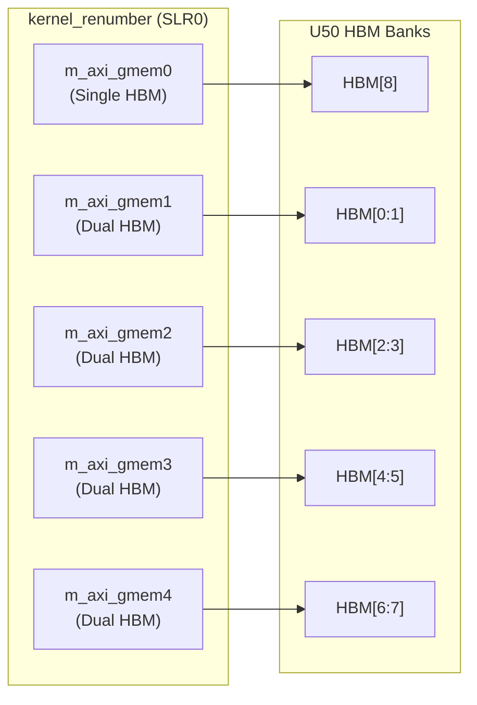

# Graph Preprocessing Renumber Kernel Configuration

## In a Nutshell

Imagine you're given a city map where every building has a random 64-bit serial number instead of a street address. If you want to build a delivery route optimization system, you first need to assign each building a simple 0-to-N index so your algorithms can use efficient array lookups. **That's exactly what this module does for graph data** — but at hardware speed on an FPGA.

This module contains the connectivity configuration for the **kernel renumbering** accelerator on Xilinx U50 FPGA cards. It defines how the kernel connects to High Bandwidth Memory (HBM) banks to perform the critical graph preprocessing step of mapping arbitrary vertex IDs to a contiguous 0..N-1 range. Without this renumbering, downstream graph algorithms would waste memory on sparse arrays and suffer from cache-inefficient random access patterns.

---

## The Mental Model: Address Translation at Scale

Think of this kernel as a **hardware-accelerated address translation service** operating on the scale of billions of entries. The conceptual pipeline looks like this:

```
Raw Graph Input              Hardware Processing              Clean Output
─────────────────           ─────────────────────           ─────────────
Original Vertex IDs    →    Mapping Table Construction   →   Contiguous IDs
(arbitrary uint64)          (hash table in HBM)              (0, 1, 2, ... N-1)
Sparse, non-contiguous      Parallel high-bandwidth          Dense, cache-friendly
                            random access
```

The key insight is that **memory bandwidth, not compute, is the bottleneck** in graph renumbering. You're essentially building a hash table where keys are original vertex IDs and values are new sequential IDs. On a CPU, this is limited by cache misses when accessing the hash table. On the FPGA, we spread the hash table across multiple HBM channels and process edges in parallel, saturating the aggregate memory bandwidth.

---

## Architecture & Data Flow

### The Configuration as a Wiring Diagram

This module isn't source code in the traditional sense — it's a **connectivity configuration** that acts like a blueprint for the FPGA implementation tools. The `.cfg` file tells the Xilinx Vitis linker how to wire the kernel's memory ports to physical HBM banks on the U50 card.



### Port Assignments Explained

The configuration uses five memory ports (`m_axi_gmem0` through `m_axi_gmem4`) connected to HBM banks with different interleaving strategies:

| Port | HBM Assignment | Purpose Analysis |
|------|----------------|------------------|
| `m_axi_gmem0` | `HBM[8]` (single bank) | **Control/Metadata**: Likely stores kernel configuration, vertex count, or synchronization flags. Single bank ensures atomic access without coherency concerns. |
| `m_axi_gmem1` | `HBM[0:1]` (interleaved) | **Edge List Input**: Original edge list with arbitrary vertex IDs. Interleaving across two banks doubles read bandwidth for sequential edge processing. |
| `m_axi_gmem2` | `HBM[2:3]` (interleaved) | **Mapping Table**: Hash table for ID translation. Dual-bank interleaving allows parallel lookup operations on different vertex ID ranges. |
| `m_axi_gmem3` | `HBM[4:5]` (interleaved) | **Renumbered Output**: Transformed edge list with contiguous IDs. High write bandwidth needed for output generation. |
| `m_axi_gmem4` | `HBM[6:7]` (interleaved) | **Auxiliary/Temp**: Scratch space for sorting, duplicate removal, or intermediate results during the renumbering process. |

### SLR Placement

The line `slr=kernel_renumber:SLR0` places the kernel in **Super Logic Region 0**, the region closest to the HBM controllers. This minimizes the physical distance (and thus signal delay) between the kernel's memory interfaces and the HBM banks, critical for achieving the high clock rates needed for bandwidth saturation.

---

## Design Tradeoffs & Reasoning

### 1. Five-Way Memory Port Split vs. Single Wide Port

**The Choice**: Use five distinct `m_axi` ports connected to different HBM bank groups rather than one wide port.

**Why This Makes Sense**:
- **Bank-level parallelism**: HBM provides independent channels; accessing banks 0-1 doesn't interfere with banks 2-3. This design extracts maximum parallelism from the hardware.
- **QoS isolation**: Input streaming (gmem1) doesn't stall output writing (gmem3) due to memory contention.
- **Protocol simplicity**: Narrower individual ports are easier to route and timing-close in the FPGA fabric.

**The Cost**:
- More FPGA resources consumed for five separate AXI infrastructure blocks.
- Kernel developer must explicitly partition data across ports in the host code.

### 2. Interleaved Banks (0:1, 2:3) vs. Contiguous Single Banks

**The Choice**: Assign dual interleaved banks to data ports (gmem1-gmem4) but single bank to gmem0.

**Why This Makes Sense**:
- **Sequential access optimization**: Graph edge lists are typically processed sequentially. Interleaving sequential addresses across two banks automatically stripes the data, allowing parallel bank access for sequential streams without explicit software management.
- **Metadata isolation**: gmem0's single-bank assignment suggests it holds scalars or small control structures that don't benefit from interleaving and need deterministic latency.

**The Tradeoff**:
- Interleaving complicates address calculation; the hardware must split addresses between banks.
- If access patterns are random rather than sequential, interleaving provides no benefit and may increase latency due to bank switching overhead.

### 3. SLR0 Placement vs. Distributed SLRs

**The Choice**: Place the kernel in SLR0 (closest to HBM) rather than distributing logic across SLRs.

**Why This Makes Sense**:
- **Memory latency**: Every SLR hop adds signal propagation delay. At 300MHz, even 1-2ns matters for meeting timing closure on high-bandwidth AXI interfaces.
- **Simpler floorplanning**: Concentrating the kernel in one SLR reduces cross-SLR routing congestion, which is often the critical path in large FPGA designs.

**The Limitation**:
- Resource density: If the kernel grows too large, SLR0 may become resource-constrained, forcing distribution. The single-SLR strategy assumes the kernel fits within one SLR's LUT/BRAM/DSP budget.

---

## Integration & Usage

### Host-Side Contract

The host code using this kernel must adhere to strict data placement contracts:

```cpp
// Conceptual host code showing the banking contract
// Real implementation uses XRT (Xilinx Runtime) APIs

// gmem0 (HBM[8]): Control registers - small, single bank
uint32_t* control_regs = xrt::bo(device, 4096, 8); // bank 8

// gmem1 (HBM[0:1]): Input edges - large, interleaved banks 0+1
uint64_t* edge_list = xrt::bo(device, edge_bytes, 0 | XCL_BO_FLAGS_INTERLEAVED);

// gmem2 (HBM[2:3]): Mapping table - interleaved banks 2+3
uint32_t* id_map = xrt::bo(device, map_bytes, 2 | XCL_BO_FLAGS_INTERLEAVED);

// gmem3 (HBM[4:5]): Output edges - interleaved banks 4+5
uint64_t* renumbered_edges = xrt::bo(device, edge_bytes, 4 | XCL_BO_FLAGS_INTERLEAVED);

// gmem4 (HBM[6:7]): Temp/scratch - interleaved banks 6+7
uint8_t* scratch = xrt::bo(device, scratch_bytes, 6 | XCL_BO_FLAGS_INTERLEAVED);
```

**Critical Gotcha**: If the host allocates `edge_list` in HBM bank 2 instead of banks 0-1, the kernel's read requests will still go to banks 0-1 (per the `.cfg` wiring), resulting in reading garbage data or zeroes. The host buffer placement must exactly match the kernel's port-to-bank mapping.

### Kernel Launch Sequence

1. **Allocate** all buffers in their designated HBM banks
2. **Write** input edge data to `gmem1` (HBM[0:1])
3. **Write** control parameters (vertex count, edge count) to `gmem0` (HBM[8])
4. **Launch** kernel with run object
5. **Wait** for completion
6. **Read** renumbered edges from `gmem3` (HBM[4:5])
7. **Optionally read** the mapping table from `gmem2` (HBM[2:3]) for reverse lookups

### Expected Performance Characteristics

- **Throughput**: Determined by HBM bandwidth. U50 HBM provides ~400 GB/s aggregate. With five ports and interleaving, this kernel can theoretically process edges at 100M+ edges/second assuming 8 bytes per edge.
- **Latency**: Largely hidden by pipelining; first result available after pipeline fill (hundreds of cycles), then one result per cycle per pipeline.
- **Bottleneck**: If the hash table in `gmem2` has too many collisions, memory access latency dominates. The interleaved 2:3 banking helps by allowing parallel bucket access.

---

## Related Modules & Dependencies

### Sibling Modules (Same Parent)

- [graph_preprocessing_merge_kernel_configuration](graph_analytics_and_partitioning-l2_graph_preprocessing_and_transforms-graph_preprocessing_merge_kernel_configuration.md): Configures the merge/sort kernel that often runs before renumbering to remove duplicate edges.
- [graph_preprocessing_host_benchmark_timing_structs](graph_analytics_and_partitioning-l2_graph_preprocessing_and_transforms-graph_preprocessing_host_benchmark_timing_structs.md): Host-side timing utilities used to measure renumbering performance.

### Upstream Callers

This configuration is typically referenced by:
- **Build scripts** (`v++` linking stage) that package the kernel with its connectivity constraints
- **Host applications** in [l2_pagerank_and_centrality_benchmarks](graph_analytics_and_partitioning-l2_pagerank_and_centrality_benchmarks.md) that use renumbered graphs as input
- **Community detection pipelines** in [community_detection_louvain_partitioning](graph_analytics_and_partitioning-community_detection_louvain_partitioning.md) that require contiguous vertex IDs for efficient clustering

### Downstream Dependencies

The kernel configured here relies on:
- [data_mover_runtime](data_mover_runtime.md) for DMA transfers between host and HBM
- Platform-specific connectivity definitions (implied by `conn_u50` in the path)

---

## Edge Cases & Operational Gotchas

### 1. HBM Bank Collision on Multi-Kernel Designs

If you instantiate multiple kernels (changing `nk=kernel_renumber:1:` to `nk=kernel_renumber:4:` for example), **all instances share the same bank assignments**. This causes bank contention and likely hardware build failures due to routing congestion. To scale, you need distinct `.cfg` files with non-overlapping bank ranges per instance.

### 2. The "Silent Zero" Misconfiguration

If the host code allocates a buffer in HBM bank 8 (expecting it to be read by `gmem0`), but the kernel was rebuilt with a modified `.cfg` pointing `gmem0` to HBM 9, **the kernel reads zeros** (or uninitialized data) without any runtime error. There's no memory protection across HBM banks in FPGA fabric. Always verify `.cfg` hash/checksum against the binary used by the host.

### 3. SLR0 Resource Exhaustion

`slr=kernel_renumber:SLR0` is the closest to HBM but has limited resources. If the kernel grows (adding features like edge weight handling or reverse mapping), it may not fit in SLR0. The build will fail late in implementation with cryptic "routing congestion" errors. Consider `SLR1` for larger kernels, accepting slightly higher memory latency.

### 4. Interleaving vs. Sequential Performance

The interleaved banks (`HBM[0:1]`, `HBM[2:3]`, etc.) provide maximum bandwidth for **sequential access patterns**. However, if the renumbering algorithm has high random access (many hash collisions causing scattered memory access), interleaving can actually hurt performance due to bank conflicts. Monitor the bank efficiency metrics in the Vitis analyzer; if efficiency is below 60%, consider non-interleaved single-bank assignments for the hash table (`gmem2`).

### 5. Power and Thermal Constraints

Five active HBM ports at high bandwidth draw significant power. On the U50, sustained operation at maximum bandwidth can trigger thermal throttling after several minutes. The kernel doesn't know it's being throttled — it just runs slower. For production deployments, ensure the server has adequate airflow and consider capping bandwidth at 80% of theoretical maximum to keep junction temperatures below 85°C.

---

## Summary for New Contributors

When you encounter this module:

1. **It's a wiring diagram, not logic**. This `.cfg` file doesn't implement renumbering; it tells the FPGA build tools how to wire the kernel to memory. The actual algorithm is in the kernel source (not shown here, but referenced by `kernel_renumber`).

2. **Bank placement is performance**. The specific assignment of `gmem0`→`HBM[8]`, `gmem1`→`HBM[0:1]`, etc., is carefully tuned for the renumbering algorithm's access patterns. Changing these without understanding the kernel's memory access pattern will silently kill performance.

3. **Host-kernel contract is brittle**. The host code must allocate buffers in the exact HBM banks this config specifies. There's no runtime validation — mismatch causes silent data corruption.

4. **U50-specific but portable pattern**. While this exact file targets the U50 card, the pattern (SLR0 placement, 2-bank interleaving for bandwidth, isolated single bank for control) applies to other Alveo cards with adjusted bank numbers.

When modifying this file, **always**:
- Check the host code buffer allocation to ensure it matches the new bank assignments
- Re-run synthesis and implementation timing analysis (bank changes affect routing)
- Validate performance with Vitis Analyzer's memory efficiency metrics

---

## References

- [graph_preprocessing_merge_kernel_configuration](graph_analytics_and_partitioning-l2_graph_preprocessing_and_transforms-graph_preprocessing_merge_kernel_configuration.md) — Related kernel for merging/sorting edges before renumbering
- [graph_preprocessing_host_benchmark_timing_structs](graph_analytics_and_partitioning-l2_graph_preprocessing_and_transforms-graph_preprocessing_host_benchmark_timing_structs.md) — Host-side performance measurement utilities
- [l2_pagerank_and_centrality_benchmarks](graph_analytics_and_partitioning-l2_pagerank_and_centrality_benchmarks.md) — Downstream consumers requiring renumbered graphs
- [community_detection_louvain_partitioning](graph_analytics_and_partitioning-community_detection_louvain_partitioning.md) — Community detection requiring contiguous vertex IDs

---

*Generated documentation for the `graph_preprocessing_renumber_kernel_configuration` module, part of the L2 Graph Preprocessing and Transforms collection.*
