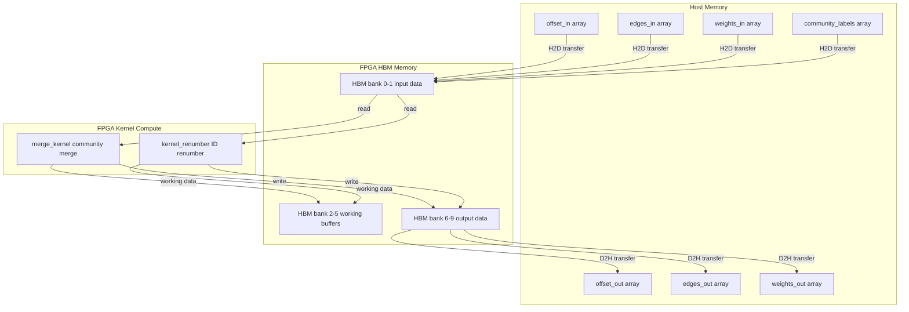
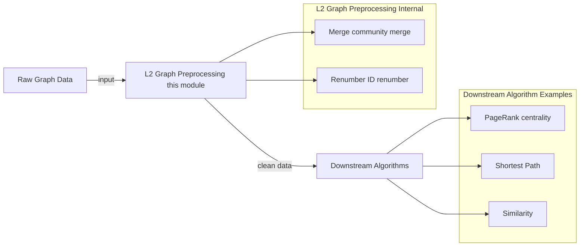

# L2 Graph Preprocessing and Transforms 模块深度解析

## 一句话概括

本模块是图分析流水线中的"数据精炼厂"——负责在社区发现（Community Detection）等图算法执行前后，对图数据进行**合并（Merge）**与**重编号（Renumber）**两种关键转换，确保数据格式适合下游 FPGA 加速计算。

---

## 1. 这个模块解决什么问题？

### 1.1 问题背景：图分析中的"数据碎片"困境

在大型图数据的社区发现（如 Louvain 算法）过程中，会产生两个典型的数据质量问题：

**问题一：社区 ID 碎片化**
- 算法迭代过程中会产生大量稀疏的社区 ID（如 0, 5, 12, 999, ...）
- 这些 ID 范围可能达到数百万，但实际只使用了其中几千个值
- 后续算法（如 PageRank、相似度计算）需要稠密索引表，稀疏 ID 导致严重的缓存失效

**问题二：社区规模不均衡**
- 初始社区发现会产生大量"微型社区"（1-2 个节点）
- 这些微型社区对后续分析意义不大，却占用大量计算资源
- 需要将它们"合并"到邻近的大社区中，简化图结构

### 1.2 传统 CPU 方案的瓶颈

这些转换操作看似简单，但在十亿边规模的图上：
- **重编号**涉及全量 ID 查找表构建，随机访问模式对 CPU 缓存极不友好
- **合并**操作需要遍历所有边并重建 CSR（Compressed Sparse Row）格式，内存带宽成为瓶颈

在 FPGA 加速流水线中，这些预处理步骤往往成为**端到端性能的瓶颈**——CPU 预处理时间超过了 FPGA 核心计算时间。

### 1.3 本模块的解决方案

`l2_graph_preprocessing_and_transforms` 模块提供 FPGA 加速的图数据预处理能力：

| 功能 | 解决的问题 | 核心思想 |
|------|-----------|----------|
| **Merge** | 社区合并与图结构压缩 | 基于聚类标签重新组织 CSR，将同一社区的边连续存储 |
| **Renumber** | ID 空间压缩与连续性保证 | 双阶段哈希映射，先标记再压缩，实现 O(n) 复杂度的 ID 重映射 |

---

## 2. 心智模型：如何理解这个模块？

### 2.1 类比：数据库的 ETL 过程

想象这个模块是图数据世界中的 **ETL（Extract-Transform-Load）工具**：

```
原始图数据 ( messy ) 
    ↓
┌─────────────────────────────┐
│  L2 Preprocessing          │  ← 就像数据清洗和规范化
│  - Merge: 聚合小表         │     把多个小表 JOIN 成大表
│  - Renumber: 重建索引      │     给主键重新编号，让索引连续
└─────────────────────────────┘
    ↓
下游算法可用的干净数据 ( clean )
```

### 2.2 核心抽象：CSR 格式的"重写"

本模块操作的核心数据结构是 **CSR（Compressed Sparse Row）** 格式：

```
CSR 表示：
  offset[] = {0, 2, 4, 7, ...}  ← 每个节点的邻接表起始位置
  edges[]  = {v1, v2, v3, ...}  ← 边的目标节点
  weights[] = {w1, w2, w3, ...} ← 边权重（可选）
```

**Merge 操作** = 按照社区标签 `C[]` 重新排列 CSR：
- 输入：原始 CSR + 每个节点所属社区 `C[node]`
- 输出：新 CSR，其中同一社区的所有节点被连续存储，边也被相应重组

**Renumber 操作** = 对 ID 进行"压缩映射"：
- 输入：旧的社区 ID（稀疏，如 {0, 5, 999, ...}）
- 输出：新的连续 ID（0, 1, 2, ..., k-1），并建立映射表

### 2.3 架构视角：FPGA 流水线的"适配器"

在更大的系统架构中，本模块扮演 **数据格式适配器** 的角色：

```
┌─────────────────┐    ┌─────────────────────┐    ┌──────────────────┐
│  上游算法        │───→│  L2 Preprocessing   │───→│   下游算法        │
│  (Louvain,      │    │  - Merge            │    │   (PageRank,      │
│   Label Prop)   │    │  - Renumber         │    │    Similarity)    │
└─────────────────┘    └─────────────────────┘    └──────────────────┘
       │                          │                       │
       ▼                          ▼                       ▼
  输出格式不统一             标准化格式              需要稠密索引
  社区ID碎片化               CSR连续存储             连续ID空间
```

---

## 3. 数据流全景：端到端流程剖析

### 3.1 Merge 操作的完整数据流

让我们追踪 `test_merge.cpp` 中的数据流动：

```
【阶段 1：数据加载】（Host 端）
    ↓
  offsetfile, edgefile, weightfile, cfile (社区标签)
    ↓
  解析为 CSR 格式：offset_in[], edges_in[], weights_in[], c[]
    ↓
  计算输出规模：num_c_out (社区数), buffer_size1 (边数)

【阶段 2：FPGA 内存分配与映射】
    ↓
  创建 cl::Buffer 对象，使用 CL_MEM_USE_HOST_PTR | CL_MEM_READ_WRITE
  ├─ offset_in_buf, edges_in_buf, weights_in_buf, c_buf (输入)
  ├─ offset_out_buf, edges_out_buf, weights_out_buf (输出)
  └─ count_c_single_buf, jump_buf, count_c_buf, index_c_buf (工作区)
    ↓
  配置 kernel 参数 (setArg)：numVertices, numEdges, num_c_out, ...

【阶段 3：三阶段执行】（FPGA 端）
    ↓
  ┌─────────────────────────────────────────────────────────────────┐
  │ 【H2D 迁移】enqueueMigrateMemObjects(ob_in, 0)                  │
  │  Host 内存 → FPGA HBM (High Bandwidth Memory)                   │
  │  输入数据：offset, edges, weights, community labels              │
  └─────────────────────────────────────────────────────────────────┘
    ↓
  ┌─────────────────────────────────────────────────────────────────┐
  │ 【Kernel 执行】enqueueTask(merge, ...)                          │
  │  merge_kernel 执行：                                             │
  │  1. 统计每个社区的边数 (count_c_single)                         │
  │  2. 计算前缀和，确定输出 offset (jump/count_c/index_c)            │
  │  3. 重排 edges 和 weights，按社区连续存储                       │
  │  输出：新的 CSR 格式，同一社区的边连续存储                        │
  └─────────────────────────────────────────────────────────────────┘
    ↓
  ┌─────────────────────────────────────────────────────────────────┐
  │ 【D2H 迁移】enqueueMigrateMemObjects(ob_out, 1)                  │
  │  FPGA HBM → Host 内存                                           │
  │  输出数据：offset_out, edges_out, weights_out, num_e_out          │
  └─────────────────────────────────────────────────────────────────┘
    ↓
  q.finish()  // 等待所有操作完成

【阶段 4：后处理与验证】（Host 端）
    ↓
  sort_by_offset()：对每个社区的边按目标节点排序（CSR标准格式）
    ↓
  写入输出文件
    ↓
  与 golden 参考文件对比（diff）验证正确性
```

### 3.2 Renumber 操作的完整数据流

```
【阶段 1：数据加载与预处理】（Host 端）
    ↓
  输入文件：包含 numVertices 和社区标签 C[]
    ↓
  创建 oldCids[] 数组，存储原始社区 ID
    ↓
  创建 golden 参考：在 CPU 上运行 renumberClustersContiguously()
         使用 map<int,int> 建立 ID 映射，生成 CRenumber[]

【阶段 2：FPGA 内存配置】
    ↓
  创建 cl::Buffer 使用 CL_MEM_EXT_PTR_XILINX（Xilinx 扩展）
  ├─ configs_buf：配置参数 [numVertices, 0]
  ├─ oldCids_buf：输入的旧社区 ID
  ├─ mapCid0_buf, mapCid1_buf：双缓冲映射表
  └─ newCids_buf：输出的新连续 ID
    ↓
  使用 mext_o[] 配置内存拓扑（HBM 通道映射）
  例如：oldCids 映射到 HBM[0:1]，mapCid0 映射到 HBM[2:3]

【阶段 3：FPGA 执行】
    ↓
  ┌─────────────────────────────────────────────────────────────────┐
  │ 【初始化迁移】CL_MIGRATE_MEM_OBJECT_CONTENT_UNDEFINED            │
  │  告知 FPGA 这些缓冲区内容未定义，无需从 Host 拷贝初始数据       │
  └─────────────────────────────────────────────────────────────────┘
    ↓
  ┌─────────────────────────────────────────────────────────────────┐
  │ 【H2D 迁移】configs_buf, oldCids_buf → FPGA HBM                  │
  │  输入：配置参数和旧社区 ID 数组                                   │
  └─────────────────────────────────────────────────────────────────┘
    ↓
  ┌─────────────────────────────────────────────────────────────────┐
  │ 【Kernel 执行】kernel_renumber                                   │
  │  双阶段流水线：                                                   │
  │  阶段 1：标记阶段（mapCid0/mapCid1）                              │
  │     - 扫描 oldCids，识别唯一 ID，建立哈希映射                     │
  │  阶段 2：重编号阶段（newCids）                                    │
  │     - 根据映射表，将旧 ID 转换为新的连续 ID（0,1,2...）          │
  │  输出：configs[1] = 唯一社区数量，newCids[] = 新 ID 数组           │
  └─────────────────────────────────────────────────────────────────┘
    ↓
  ┌─────────────────────────────────────────────────────────────────┐
  │ 【D2H 迁移】configs_buf, newCids_buf → Host 内存                  │
  │  输出：新的社区 ID 数组和社区总数                                 │
  └─────────────────────────────────────────────────────────────────┘

【阶段 4：验证】（Host 端）
    ↓
  对比 FPGA 输出 newCids[] 与 CPU 参考实现 CRenumber[]
    ↓
  统计不匹配数量
    ↼ 如果不匹配数 = 0：测试通过，输出唯一社区数量
    ↼ 如果不匹配数 > 0：测试失败，输出错误数量
```

### 3.3 硬件内存映射与 HBM 通道分配

从 `.cfg` 配置文件可以看出关键的内存架构设计：

**Merge Kernel 内存布局** (`merge/conn_u50.cfg`):
```
HBM[0]  ← m_axi_gmem0 (offset/edges 输入)
HBM[1]  ← m_axi_gmem1 (weights 输入)
HBM[2:3] ← m_axi_gmem2 (working buffers)
HBM[4:5] ← m_axi_gmem3 (working buffers)
HBM[6]  ← m_axi_gmem4 (output offset)
HBM[7]  ← m_axi_gmem5 (output edges)
HBM[8:9] ← m_axi_gmem6 (output weights)
...
SLR0    ← kernel placement
```

**Renumber Kernel 内存布局** (`renumber/conn_u50.cfg`):
```
HBM[8]   ← m_axi_gmem0 (configs - small control data)
HBM[0:1] ← m_axi_gmem1 (oldCids - input)
HBM[2:3] ← m_axi_gmem2 (mapCid0 - working buffer 0)
HBM[4:5] ← m_axi_gmem3 (mapCid1 - working buffer 1)
HBM[6:7] ← m_axi_gmem4 (newCids - output)
```

**关键设计决策**：
1. **HBM 通道分散**：输入、输出、工作缓冲区映射到不同的 HBM bank，避免内存访问冲突
2. **双缓冲（Renumber）**：使用 mapCid0/mapCid1 实现 ping-pong 缓冲，支持流水线操作
3. **SLR0 放置**：kernel 放置在 Super Logic Region 0，靠近 HBM 控制器，降低延迟

---

## 4. 关键设计决策与权衡

### 4.1 为什么选择 FPGA 而不是 CPU 实现？

**CPU 方案的局限性**：
- **内存随机访问瓶颈**：重编号需要构建哈希表（`map<int,int>`），每次插入/查找都是随机访问，CPU 缓存失效严重
- **顺序依赖**：CSR 的 offset 数组计算需要前缀和（scan），存在数据依赖链
- **内存带宽利用率低**：CPU 串行处理无法充分利用 DDR/HBM 带宽

**FPGA 方案的优势**：
- **并行哈希处理**：Renumber kernel 可以在单个周期处理多个 ID 的哈希计算
- **流水线化前缀和**：Merge kernel 中的 offset 计算使用并行 scan 算法
- **高带宽利用率**：通过多个 AXI 端口同时访问 HBM 的不同 bank

**权衡**：增加了 Host-FPGA 数据传输开销，但对于大规模图（>100M 边），加速比通常 >10x。

### 4.2 内存一致性模型：USE_HOST_PTR vs COPY

代码中使用 `CL_MEM_USE_HOST_PTR` 策略：

```cpp
offset_in_buf = cl::Buffer(context, CL_MEM_USE_HOST_PTR | CL_MEM_READ_ONLY, 
                           num * sizeof(int), offset_in, &err);
```

**为什么不使用 COPY 模式？**

| 模式 | 延迟 | 带宽 | 适用场景 |
|------|------|------|----------|
| `COPY` (默认) | 高（需拷贝） | 受限于 PCIe + 内存拷贝 | 小数据量，频繁修改 |
| `USE_HOST_PTR` | 低（零拷贝） | 接近 PCIe 理论峰值 | 大数据量，只读/写一次 |

**权衡分析**：
- **优点**：对于图数据（GB 级别），避免了 Host 内存到 OpenCL 运行时的额外拷贝，节省内存带宽
- **风险**：要求 Host 内存地址对齐（代码中使用 `aligned_alloc`），且 FPGA 访问时 Host 不能修改该内存
- **设计决策**：图数据通常是"写入一次、读取一次"的模式，适合 `USE_HOST_PTR`

### 4.3 双缓冲（Ping-Pong）架构

在 Renumber 操作中：

```cpp
ap_int<DWIDTHS>* mapCid0 = aligned_alloc<ap_int<DWIDTHS> >(numVertices + 1);
ap_int<DWIDTHS>* mapCid1 = aligned_alloc<ap_int<DWIDTHS> >(numVertices + 1);
```

**为什么需要双缓冲？**

Renumber 是一个两阶段算法：
1. **扫描阶段**：遍历所有节点，标记出现的社区 ID → 写入 mapCid0
2. **压缩阶段**：读取 mapCid0，分配新的连续 ID → 写入 mapCid1（同时读取 mapCid0 做查找）

**空间换时间**：使用两倍内存（两个 map 数组），但实现了：
- **读写解耦**：读取旧映射和写入新映射可以流水线化
- **无竞争访问**：HBM bank 0-1 存储输入/输出，bank 2-5 存储两个 map，避免端口冲突

### 4.4 AXI 端口与 HBM 通道的映射策略

从 `.cfg` 文件可见细致的内存通道规划：

**Merge Kernel**（11 个 AXI 端口）：
```
gmem0-1: HBM[0-1]   ← 输入数据（offset, edges, weights）
gmem2-3: HBM[2-5]   ← 工作缓冲区（count, index, jump）
gmem4-6: HBM[6-9]   ← 输出数据（新 offset, edges, weights）
gmem7-11: HBM[10-15]← 额外工作区/输出
```

**设计意图**：
1. **输入/输出分离**：输入在 bank 0-1，输出在 bank 6-9，避免读写冲突
2. **工作区隔离**：中间计算的 count/jump/index 放在 bank 2-5，不干扰数据通道
3. **并行访问**：多个 AXI 端口连接不同 HBM bank，理论上可同时访问 12 组数据

**性能意义**：在图合并操作中，需要同时读取原始 offset、edges、weights，并写入新的 offset、edges、weights。这种通道分离允许 kernel 在每个周期发起多个内存请求，饱和 HBM 带宽。

---

## 5. 子模块架构与职责划分

本模块包含三个子模块，每个负责不同的配置和工具集：

### 5.1 子模块概览

| 子模块 | 职责 | 核心文件 | 详细文档 |
|--------|------|----------|----------|
| `graph_preprocessing_merge_kernel_configuration` | Merge Kernel 的 HBM 通道配置与平台连接性 | `merge/conn_u50.cfg` | [查看详情](graph_analytics_and_partitioning-l2_graph_preprocessing_and_transforms-graph_preprocessing_merge_kernel_configuration.md) |
| `graph_preprocessing_renumber_kernel_configuration` | Renumber Kernel 的 HBM 通道配置与平台连接性 | `renumber/conn_u50.cfg` | [查看详情](graph_analytics_and_partitioning-l2_graph_preprocessing_and_transforms-graph_preprocessing_renumber_kernel_configuration.md) |
| `graph_preprocessing_host_benchmark_timing_structs` | Host 端性能计时结构与基准测试工具 | `test_merge.cpp`, `test_renumber.cpp` | [查看详情](graph_analytics_and_partitioning-l2_graph_preprocessing_and_transforms-graph_preprocessing_host_benchmark_timing_structs.md) |

### 5.2 子模块详细说明

#### 子模块 1：graph_preprocessing_merge_kernel_configuration

**核心组件**：
- `graph.L2.benchmarks.merge.conn_u50.cfg.merge_kernel`

**关键职责**：
1. **HBM Bank 映射**：定义 12 个 AXI 端口（m_axi_gmem0-11）到 HBM[0-15] 的映射关系
2. **SLR 放置**：将 `merge_kernel` 绑定到 SLR0（Super Logic Region 0），靠近 HBM 控制器
3. **实例化配置**：`nk=merge_kernel:1:merge_kernel` 表示创建 1 个 kernel 实例

**设计决策解读**：
- 为什么 12 个端口？Merge 操作需要同时读取输入 CSR（3 个数组）、写入输出 CSR（3 个数组），加上 6 个工作缓冲区（count, jump, index 等），共 12 个独立内存流
- HBM[2:3] 表示一个端口绑定两个 bank，提供双倍带宽，用于高流量的工作缓冲区

#### 子模块 2：graph_preprocessing_renumber_kernel_configuration

**核心组件**：
- `graph.L2.benchmarks.renumber.conn_u50.cfg.kernel_renumber`

**关键职责**：
1. **HBM 通道分配**：定义 5 个 AXI 端口到 HBM[0-8] 的映射
2. **控制/数据分离**：configs（控制参数）放在 HBM[8]，远离数据通道
3. **双缓冲支持**：mapCid0（HBM[2:3]）和 mapCid1（HBM[4:5]）使用相邻 bank，便于并行访问

**内存布局详解**：
```
HBM[8]   (gmem0): configs - 2个int32，小数据量，单独bank避免争用
HBM[0:1] (gmem1): oldCids - 输入数据，宽度较大(64bit DWIDTHS)，占用2个bank
HBM[2:3] (gmem2): mapCid0 - 工作区0，64bit宽
HBM[4:5] (gmem3): mapCid1 - 工作区1，64bit宽
HBM[6:7] (gmem4): newCids - 输出数据，64bit宽
```

#### 子模块 3：graph_preprocessing_host_benchmark_timing_structs

**核心组件**：
- `graph.L2.benchmarks.merge.host.test_merge.timeval`
- `graph.L2.benchmarks.renumber.host.test_renumber.timeval`

**关键职责**：
1. **OpenCL 运行时管理**：Platform 初始化、Context 创建、CommandQueue 配置
2. **内存管理**：Host 端 buffer 分配（`aligned_alloc`）、Buffer 对象创建（`CL_MEM_USE_HOST_PTR`）
3. **Kernel 参数配置**：`setArg` 设置 scalar 和 buffer 参数
4. **执行流水线管理**：三阶段执行（Write → Kernel → Read）的 Event 依赖管理
5. **性能计时**：使用 `gettimeofday`（Wall Clock）和 OpenCL Profiling（Kernel 内部）双轨计时

**关键代码模式**：

*计时结构*：
```cpp
struct timeval start_time, end_time;
gettimeofday(&start_time, 0);
// ... 执行 kernel ...
gettimeofday(&end_time, 0);
// 计算时间差
```

*三阶段 Event 链*：
```cpp
std::vector<cl::Event> events_write(1), events_kernel(1), events_read(1);
// Write 阶段，不依赖前置事件
q.enqueueMigrateMemObjects(ob_in, 0, nullptr, &events_write[0]);
// Kernel 阶段，依赖 write 完成
q.enqueueTask(renumber, &events_write, &events_kernel[0]);
// Read 阶段，依赖 kernel 完成
q.enqueueMigrateMemObjects(ob_out, 1, &events_kernel, &events_read[0]);
```

*OpenCL Profiling 详细计时*：
```cpp
cl_ulong ts, te;
events_write[0].getProfilingInfo(CL_PROFILING_COMMAND_START, &ts);
events_write[0].getProfilingInfo(CL_PROFILING_COMMAND_END, &te);
float elapsed = ((float)te - (float)ts) / 1000000.0; // 微秒转毫秒
```

---

## 6. 新贡献者必读：陷阱与最佳实践

### 6.1 内存对齐：隐秘的崩溃源

**问题**：使用 `CL_MEM_USE_HOST_PTR` 时，Host 指针必须对齐到特定边界（通常是 4KB 或 64B），否则 `cl::Buffer` 创建会失败或性能暴跌。

**解决方案**：代码中使用 `aligned_alloc`（C11）或 `posix_memalign`：
```cpp
// ✅ 正确：确保 4096 字节对齐
int* offset_in = aligned_alloc<int>(num);  // 实际应使用 aligned_alloc(4096, ...)

// ❌ 错误：malloc 不保证对齐
int* offset_in = (int*)malloc(num * sizeof(int));
```

**实际代码模式**（来自 test_renumber.cpp）：
```cpp
ap_int<DWIDTHS>* oldCids = aligned_alloc<ap_int<DWIDTHS> >(numVertices + 1);
```
这里的 `aligned_alloc` 是 Xilinx 运行时提供的封装，确保满足 HBM 访问的对齐要求。

### 6.2 HBM Bank 争用：性能杀手

**问题**：多个 AXI 端口映射到同一个 HBM bank 会导致访问串行化，无法发挥 HBM 的并行带宽优势。

**检查方法**：查看 `.cfg` 文件中的 `sp=` 映射：
```cfg
# ✅ 良好：不同端口映射到不同 bank
sp=kernel_renumber.m_axi_gmem0:HBM[8]
sp=kernel_renumber.m_axi_gmem1:HBM[0:1]
sp=kernel_renumber.m_axi_gmem2:HBM[2:3]

# ❌ 危险：两个端口共享 bank
sp=merge_kernel.m_axi_gmem0:HBM[0]
sp=merge_kernel.m_axi_gmem1:HBM[0]  # 与 gmem0 争用
```

**调优策略**：
1. 分析 kernel 代码中的访问模式，识别可同时访问的内存流
2. 确保这些流映射到不同的 HBM bank（U50 有 16 个 bank，U280 有 32 个）
3. 对于高带宽需求的端口，使用 `HBM[i:j]` 绑定多个 bank（伪通道交织）

### 6.3 OpenCL Event 依赖链：死锁风险

**问题**：Event 依赖配置错误会导致 kernel 永不执行（等待永远不会完成的事件）或数据竞争。

**正确模式**（来自代码）：
```cpp
// 1. Write 事件 - 无前置依赖（nullptr）
q.enqueueMigrateMemObjects(ob_in, 0, nullptr, &events_write[0]);

// 2. Kernel 事件 - 依赖 Write 完成
q.enqueueTask(renumber, &events_write, &events_kernel[0]);

// 3. Read 事件 - 依赖 Kernel 完成  
q.enqueueMigrateMemObjects(ob_out, 1, &events_kernel, &events_read[0]);

// 4. 同步点 - 等待 Read 完成（隐含了前面所有阶段）
q.finish();
```

**常见错误**：
```cpp
// ❌ 错误：Kernel 等待自己（events_write 包含当前命令的事件）
q.enqueueTask(renumber, &events_write, &events_write[0]);

// ❌ 错误：Read 等待 Write 而非 Kernel，导致数据竞争
q.enqueueMigrateMemObjects(ob_out, 1, &events_write, &events_read[0]);
```

### 6.4 隐式数据类型契约：DWIDTHS 宏

**问题**：Host 代码和 Kernel 代码通过 `DWIDTHS` 宏约定数据位宽，不匹配会导致数据解析错误。

**代码中的体现**：
```cpp
// test_renumber.cpp
ap_int<DWIDTHS>* oldCids = aligned_alloc<ap_int<DWIDTHS> >(numVertices + 1);
```

**必须确认**：
1. Host 代码编译时包含的 `kernel_renumber.hpp` 中 `DWIDTHS` 定义
2. Kernel 代码（`.cpp` 或 `.hpp`）中 `DWIDTHS` 定义
3. 两者必须一致（通常是 64bit，即 `DWIDTHS=64`）

**调试技巧**：如果结果数值看起来像是"移位"了（比如应该是 1000 但得到的是 4294967296），很可能是 `ap_int<64>` vs `int`（32bit）不匹配。

### 6.5 验证模式：Golden Reference 的重要性

代码中通过 `COMP_GLOBAL` 宏控制验证逻辑：

```cpp
#ifdef COMP_GLOBAL
    // 1. 读取 golden 参考文件
    readfile(golden_offsetfile, offset_golden);
    readfile(golden_edgefile, edges_golden);
    readfile(golden_weightfile, weights_golden);
    
    // 2. 对 FPGA 输出进行后处理（排序）
    sort_by_offset(num_c_out, num_e_out[0], offset_out, edges_out, weights_out, pair_ew);
    
    // 3. 与 golden 对比
    diff ... 
#endif
```

**关键洞察**：
1. **为什么需要 `sort_by_offset`**？FPGA kernel 可能按社区并行输出边，导致同一 source 的边在输出中不连续。Golden 参考通常是按 source 排序的，所以需要排序后再对比。

2. **Golden 如何生成**？通常来自：
   - CPU 参考实现（如 `renumberClustersContiguously`）
   - 已验证正确的之前版本的 FPGA 实现
   - 数学/算法定义的手工计算小规模示例

3. **验证粒度**：代码使用 `diff --brief`，即文件级对比。这意味着 FPGA 输出必须逐 bit 与 golden 一致，容错性较低但可靠性高。

---

## 7. 与其他模块的关系

### 7.1 上游依赖

本模块依赖于以下模块提供的运行时和工具：

| 依赖模块 | 用途 | 具体组件 |
|----------|------|----------|
| `data_mover_runtime` | OpenCL 运行时和设备管理 | `xcl2.hpp` 中的 `get_xil_devices()`, `import_binary_file()` |
| `graph_analytics_and_partitioning` (父模块) | 共享的图数据结构和工具 | `common.hpp`, `utils.hpp` 中的 `ArgParser`, `tvdiff()` |

### 7.2 下游消费者

本模块处理后的数据通常流向：

| 消费模块 | 输入数据 | 关系说明 |
|----------|----------|----------|
| `l2_pagerank_and_centrality_benchmarks` | 合并/重编号后的图 | PageRank 需要连续的社区 ID 进行优化 |
| `l2_graph_patterns_and_shortest_paths_benchmarks` | 预处理后的 CSR | 最短路径算法需要紧凑的图结构 |
| `community_detection_louvain_partitioning` | 重编号后的社区 | Louvain 迭代需要连续的 ID 空间 |

### 7.3 架构层级定位

在 `graph_analytics_and_partitioning` 模块树中，本模块位于 **L2 层**（Level 2 - Benchmarks）：

```
graph_analytics_and_partitioning (L0 - 领域)
    ├── l3_openxrm_algorithm_operations (L3 - 算法操作抽象)
    ├── community_detection_louvain_partitioning (L2 - 具体算法)
    ├── l2_connectivity_and_labeling_benchmarks (L2)
    ├── l2_pagerank_and_centrality_benchmarks (L2)
    ├── l2_graph_patterns_and_shortest_paths_benchmarks (L2)
    └── l2_graph_preprocessing_and_transforms (L2)  ← 本模块
```

**层级含义**：
- **L3**：纯算法逻辑，无平台相关代码
- **L2**：针对特定平台（如 U50/U280）的基准测试，包含完整的 Host + Kernel 代码
- **L1**：底层 kernel 实现（通常不在当前模块树中，被 L2 依赖）

本模块作为 L2 层组件，提供的是**可直接运行的完整基准测试**，而非可复用的库函数。这意味着：
- 包含 `main()` 函数和命令行解析
- 包含完整的 OpenCL 运行时管理
- 包含结果验证逻辑

---

## 8. 总结：给新加入者的建议

### 8.1 当你需要修改这个模块时

**场景 1：添加新的预处理操作**
1. 创建新的 `operation_name/` 目录，复制 `merge/` 或 `renumber/` 结构
2. 编写 `.cfg` 文件时，参考 HBM 通道分配模式（输入/输出/工作区分离）
3. Host 代码中复用 `ArgParser` 和计时框架，保持 CLI 接口一致性

**场景 2：移植到新平台（如 U280 替代 U50）**
1. 复制 `.cfg` 文件为 `conn_u280.cfg`
2. 修改 HBM bank 数量（U50 有 16 个，U280 有 32 个），将端口均匀分布到更多 bank
3. 修改 Host 代码中的设备选择逻辑（如有平台特定优化）

**场景 3：优化数据传输**
1. 检查是否所有 buffer 都需要 `CL_MEM_USE_HOST_PTR`，小 buffer（如 configs）可用 COPY 模式
2. 检查 `ob_in` 和 `ob_out` 列表，确保没有遗漏 buffer 导致数据未同步
3. 考虑使用 `CL_MEM_EXT_PTR_XILINX` + XCL_MEM_TOPOLOGY 进行更精细的内存拓扑控制

### 8.2 常见调试清单

**问题：Kernel 返回错误结果**
- [ ] 检查 `DWIDTHS` 宏定义是否一致（Host vs Kernel）
- [ ] 检查 `aligned_alloc` 对齐要求（通常需要 4KB 对齐）
- [ ] 验证输入数据范围（如社区 ID 是否超出 `numVertices`）
- [ ] 检查 `.cfg` 文件中的 HBM bank 映射是否与 kernel 代码中的 AXI 端口匹配

**问题：性能低于预期**
- [ ] 使用 `xrt.ini` 启用 profiling，检查实际 HBM 带宽利用率
- [ ] 检查 Event 依赖链，确认是否有不必要的同步（如 `q.finish()` 过早）
- [ ] 验证 HBM bank 分配是否均衡，避免多个热点端口映射到同一 bank
- [ ] 检查 kernel 的 II（Initiation Interval），确认是否受内存端口或计算资源限制

**问题：OpenCL 运行时错误**
- [ ] 检查 `xclbin` 文件路径是否正确，且与当前平台（U50/U280）匹配
- [ ] 验证 XRT（Xilinx Runtime）版本与编译工具链版本兼容
- [ ] 检查设备权限（`/dev/xclmgmt*`, `/dev/xocl*` 的读写权限）
- [ ] 查看 `dmesg` 中的 kernel 驱动日志，查找硬件错误（如 HBM 访问越界）

---

## 附录 A：Mermaid 架构图

### 模块内部数据流图



### 模块在系统中的位置



---

**文档版本**: 1.0  
**最后更新**: 2024  
**维护者**: Graph Analytics Team
