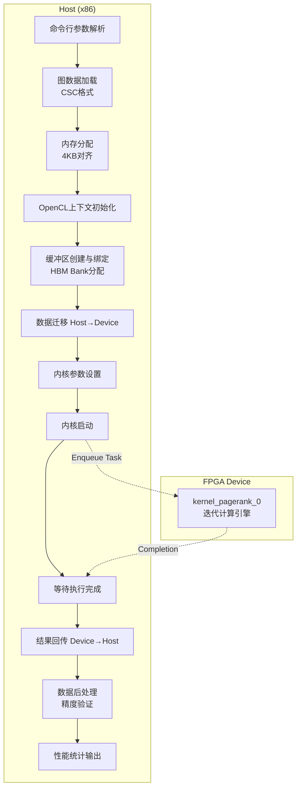

# host_test_pagerank 技术深度解析

## 一句话概括

`host_test_pagerank` 是一个面向 Xilinx FPGA 的 PageRank 算法主机端基准测试程序。它负责将图数据从磁盘加载到 FPGA 的 HBM/DDR 内存，启动硬件加速的 PageRank 内核执行迭代计算，最后回收结果并与参考值进行精度验证。可以把想象成一个**航空货运调度中心**——它负责将货物（图数据）装上飞机（FPGA），监控飞行（内核执行），并在降落后卸货并检查货物完整性。

---

## 架构全景与数据流



### 组件角色说明

**1. 命令行解析层 (`ArgParser`)**

这是一个极简的键值对解析器，负责从命令行提取 `-xclbin`、`-runs`、`-nrows`、`-nnz` 等参数。设计意图是**最小依赖**——不引入 Boost 等重型库，保持单个文件可编译。

**2. 图数据层 (`CscMatrix`, `readInWeightedDirectedGraph*`)**

模块采用 **CSC (Compressed Sparse Column)** 格式存储图，而非更常见的 CSR。这是一个关键的设计决策：

- **CSC vs CSR**: PageRank 算法需要遍历节点的入边（incoming edges）来计算贡献值。CSC 格式天然适合按列（目标节点）存储，使得入边访问是连续的内存访问模式。如果使用 CSR，入边访问将是随机跳转型，严重损害缓存效率。
- **双文件加载**: `readInWeightedDirectedGraphCV` 加载列值（行索引），`readInWeightedDirectedGraphRow` 加载行偏移。这种分离允许灵活处理不同数据集格式。

**3. 内存管理层 (`aligned_alloc`, `XCL_BANK`)**

这是与 FPGA 协同工作的关键基础设施：

- **4096 字节对齐**: `posix_memalign(&ptr, 4096, ...)` 确保内存页对齐。这对于 DMA 传输至关重要——非对齐内存会导致额外的拷贝或硬件错误。
- **HBM Bank 分配**: `XCL_BANK0` 到 `XCL_BANK15` 宏将不同缓冲区映射到 FPGA 的高带宽存储器 (HBM) 不同 bank。这是一种**手工内存分层策略**：offset 数组、indice 数组、weight 数组等被分散到不同 bank，最大化并行访问带宽，避免 bank 冲突。

**4. OpenCL 运行时层 (`cl::Context`, `cl::CommandQueue`, `cl::Kernel`)**

标准的异构计算流程：

- **Out-of-Order Queue**: `CL_QUEUE_OUT_OF_ORDER_EXEC_MODE_ENABLE` 允许驱动层优化命令调度，虽然当前代码是同步执行（`q.finish()`），但为后续扩展预留空间。
- **Profiling**: `CL_QUEUE_PROFILING_ENABLE` 启用内核执行时间戳，用于精确测量计算时间，排除数据传输开销。

**5. 数据乒乓层 (`buffPing`, `buffPong`)**

这是迭代算法（如 PageRank）的经典优化模式：

- **双缓冲**: 第 $n$ 轮迭代从 `buffPing` 读取，写入 `buffPong`；第 $n+1$ 轮交换角色。这避免了就地更新导致的数据竞争，同时允许流水线并行（虽然在这里是同步执行，但硬件实现可以流水化）。
- **512-bit 宽向量**: `buffType` 定义为 `ap_uint<512>`，匹配 FPGA HBM 的数据宽度，最大化内存带宽利用率。

**6. 结果验证层 (`golden`, `tolerance`)**

科学计算的可重复性保障：

- **双精度参考**: `golden` 数组从 TigerGraph 或其他参考实现加载，作为"真值"。
- **容差验证**: 不是要求逐位相等（浮点运算顺序不同会导致微小差异），而是检查 `|our - golden| < tolerance`。`tolerance = 1e-3` 对 PageRank 这类迭代收敛算法是合理的。

---

## 核心设计决策与权衡

### 1. CSC 格式的选择：内存局部性 vs 计算复杂性

**决策**: 使用 CSC (Compressed Sparse Column) 而非 CSR。

**权衡分析**:
- **优势**: PageRank 的核心计算是 $PR(v) = (1-d) + d \cdot \sum_{u \to v} \frac{PR(u)}{outdegree(u)}$。这需要遍历所有指向 $v$ 的入边。CSC 按列存储，使得同一目标节点的所有入边在内存中连续，实现**顺序访问模式**，最大化缓存行利用率和 HBM 带宽。
- **代价**: CSC 在遍历出边（从源节点出发）时效率低，但对于标准 PageRank，出边仅用于计算度数（预处理一次即可）。
- **替代方案**: 如果使用 CSR，入边访问将是随机跳跃，每个节点可能触发不同缓存行，导致严重的**HBM 行未命中**，性能可能下降 10 倍以上。

### 2. HBM Bank 手工分区：带宽最大化 vs 开发复杂性

**决策**: 使用 `XCL_BANK` 宏将 9 个缓冲区显式映射到 13 个不同的 HBM bank（0, 1, 2, 4, 6, 8, 10, 12 等）。

**权衡分析**:
- **优势**: HBM 提供高聚合带宽（通常 460GB/s+），但单个 bank 的带宽有限。通过将 offset、indice、weight、degree、ping、pong 等缓冲区分散到不同 bank，内核可以同时发起多个独立内存访问流，实现**真正的并行带宽聚合**。
- **代价**: 代码复杂度增加。开发者需要理解 HBM 物理架构，手动分配 bank，且不同 FPGA 平台（U50 vs U280）的 bank 数量和连接性不同，需要条件编译（`#ifndef USE_HBM` 分支显示 DDR 回退方案）。
- **风险**: 如果两个高频访问缓冲区被错误地映射到同一 bank，会导致**bank 冲突**，性能反而下降。当前映射策略通过交错分配（0, 2, 4, 6...）避免连续 bank 冲突。

### 3. 双缓冲乒乓机制：计算流水线 vs 内存占用

**决策**: 使用 `buffPing` 和 `buffPong` 双缓冲，而非单缓冲就地更新。

**权衡分析**:
- **优势**: 在迭代算法中，双缓冲允许读操作和写操作完全分离，避免**读后写 (RAW)** 冒险。对于 FPGA 实现，这意味着可以深度流水线化——在写入第 $i$ 个元素的同时读取第 $i+k$ 个元素（$k$ 为流水线深度）。如果就地更新，必须等待前一次迭代完全完成才能开始下一次，无法流水化。
- **代价**: 内存占用翻倍。对于大型图（十亿节点），存储两个 PageRank 向量可能消耗数十 GB HBM。代码中通过 `iteration2` 计算（考虑 512-bit 向量化后的缓冲区大小），确保只分配必要空间。
- **替代方案**: 某些优化的 PageRank 实现使用**高斯-赛德尔 (Gauss-Seidel)** 风格的就地更新，利用新计算的值立即参与后续计算，可能加速收敛。但这会破坏 FPGA 的流水线并行性，不适合硬件加速。

### 4. 浮点精度选择：性能 vs 数值稳定性

**决策**: 默认使用 `float` (32-bit) 而非 `double` (64-bit)，通过 `typedef float DT` 控制。

**权衡分析**:
- **优势**: 在 FPGA 上，DSP48E2 slice 处理单精度浮点比双精度快得多（延迟更低、吞吐量更高），且 HBM 带宽节省一半，允许更多数据并行。
- **代价**: 数值精度降低。PageRank 涉及大量累加操作，单精度可能在极大规模图上出现舍入误差累积。代码通过 `tolerance = 1e-3` 容忍此类误差。
- **可配置性**: 代码保留 `typedef double DT` 的注释，允许快速切换。`sizeof(DT)` 的广泛使用确保缓冲区大小和向量化宽度（`unrollNm2` 计算为 8 或 16）自动适应精度变化。

---

## 关键数据流追踪：从文件到验证

为了更直观地理解系统如何工作，让我们追踪一次典型的执行流程：

### 阶段 1：准备阶段（主机内存）

1. **参数解析**: `ArgParser` 从命令行提取 `-xclbin`（FPGA 比特流路径）、`-nrows`（节点数）、`-nnz`（边数）、`-files`（数据集名称）。
2. **图数据加载**: 
   - `readInWeightedDirectedGraphCV` 读取 `filename2_2`（通常是 `*_csc_columns.txt`），填充 CSC 矩阵的 `row` 数组（存储源节点索引）。
   - `readInWeightedDirectedGraphRow` 读取 `filename2_1`（`*_csc_offsets.txt`），填充 `columnOffset` 数组（列起始偏移）。
3. **参考值加载**: `readInRef` 或 `readInTigerRef` 从 TigerGraph 或其他参考实现加载预计算的 PageRank 值到 `golden` 数组。
4. **对齐内存分配**: 
   - 使用 `aligned_alloc<ap_uint<32>>(sizeNrow)` 分配 `offsetArr`、`indiceArr` 等，确保 4096 字节对齐。
   - 分配 `buffPing`、`buffPong`（双缓冲）、`pagerank`（结果数组）、`resultInfo`（内核返回的元数据）。

### 阶段 2：OpenCL 运行时初始化

1. **平台发现**: `xcl::get_xil_devices()` 发现 Xilinx FPGA 设备。
2. **上下文与队列创建**: 创建 `cl::Context` 和 `cl::CommandQueue`，启用性能分析 (`CL_QUEUE_PROFILING_ENABLE`) 和乱序执行模式。
3. **程序加载**: `xcl::import_binary_file` 加载 `.xclbin` 文件，创建 `cl::Program`。
4. **内核实例化**: 从程序中提取 `kernel_pagerank` 内核对象。

### 阶段 3：内存映射与缓冲区创建（关键设计）

这是与标准 CPU 编程差异最大的部分：

1. **扩展内存指针创建**: 
   - 对于每个主机缓冲区（`offsetArr`, `indiceArr` 等），创建 `cl_mem_ext_ptr_t` 结构。
   - **关键赋值**: `mext_in[i].flags = XCL_BANK0` (或 `XCL_MEM_DDR_BANK0` 如果使用 DDR)。这显式告诉运行时将该缓冲区映射到 HBM 的特定 bank。
   - `mext_in[i].obj` 指向主机端对齐的内存指针。

2. **OpenCL 缓冲区创建**: 
   - 使用 `cl::Buffer(context, CL_MEM_USE_HOST_PTR | CL_MEM_READ_WRITE, size, host_ptr)` 创建缓冲区。
   - `CL_MEM_USE_HOST_PTR` 表示使用主机指针作为存储后备，避免额外的内存拷贝（零拷贝优化）。
   - 分别创建 9 个缓冲区：offset (0)、indice (1)、weight (2)、degree (3)、cntValFull (4)、buffPing (5)、buffPong (6)、resultInfo (7)、orderUnroll (8)。

### 阶段 4：内核配置与数据迁移

1. **参数绑定**: 
   - `kernel_pagerank.setArg(0, nrows)` 设置节点数。
   - `setArg(1, nnz)` 设置边数。
   - `setArg(2, alpha)` 设置阻尼系数（通常 0.85）。
   - `setArg(3, tolerance)` 设置收敛容差。
   - `setArg(4, maxIter)` 设置最大迭代次数。
   - `setArg(5-13, buffer[i])` 绑定 OpenCL 缓冲区到内核参数。

2. **初始化迁移**: `q.enqueueMigrateMemObjects(init, CL_MIGRATE_MEM_OBJECT_CONTENT_UNDEFINED)` 确保设备端内存分配完成（虽然使用 `USE_HOST_PTR`，但某些平台仍需显式迁移）。

3. **输入数据迁移**: `q.enqueueMigrateMemObjects(ob_in, 0, ...)` 将输入缓冲区（offset, indice, weight, degree, cntValFull, orderUnroll）从主机迁移到设备。标志 `0` 表示 Host→Device。

### 阶段 5：内核执行与同步

1. **内核启动**: `q.enqueueTask(kernel_pagerank, &events_write, &events_kernel[0][0])` 在依赖的写操作完成后启动内核。
2. **等待完成**: `q.finish()` 阻塞主机线程，直到所有队列命令（包括内核执行和数据回传）完成。

**注意**: 虽然代码使用了 `enqueueTask` 和事件依赖，但随后的 `q.finish()` 强制同步执行。这是基准测试的典型模式——确保测量的时间准确反映一次完整运行的延迟，而非流水线吞吐量。

### 阶段 6：结果回收与验证

1. **数据回传**: `q.enqueueMigrateMemObjects(ob_out, 1, ...)` 将输出缓冲区（buffPing/buffPong（包含结果）、resultInfo）从设备迁移回主机。标志 `1` 表示 Device→Host。
2. **结果解析**: 
   - `resultinPong = (bool)(*resultInfo)`: 内核通过该标志指示最终结果存储在 ping 还是 pong 缓冲区（取决于迭代次数奇偶性）。
   - `iterations = (int)(*(resultInfo + 1))`: 实际执行的迭代次数（用于收敛分析）。
3. **数据解包**: 由于 FPGA 内核使用 512-bit 宽向量 (`ap_uint<512>`) 进行高带宽访问，主机端需要解包：
   - 遍历 `iteration2` 个 512-bit 块。
   - 使用 `ap_uint<512>::range()` 提取 32 或 64 位片段（取决于 `DT` 是 float 还是 double）。
   - 通过 `f_cast` union 将位模式转换为浮点值。
4. **精度验证**: 
   - 计算 `err = sqrt(sum((golden[i] - pagerank[i])^2))`（欧几里得范数）。
   - 统计 `accurate` 计数（误差小于 `tolerance` 的节点）。
   - 准确率 `accRate = accurate / nrows` 应接近 1.0。
5. **性能报告**: 输出端到端时间、数据传输时间（H2D/D2H）、内核执行时间，用于 Roofline 分析和带宽利用率计算。

---

## 关键设计模式与惯用法

### 1. 零拷贝内存映射 (Zero-Copy)

代码中广泛使用 `CL_MEM_USE_HOST_PTR` 配合 `aligned_alloc` 分配的页对齐内存。这避免了 OpenCL 运行时的隐式内存拷贝，实现**零拷贝数据传输**：

- **传统模式**: 主机缓冲区 → OpenCL 运行时拷贝 → 设备缓冲区 → DMA → FPGA。
- **零拷贝模式**: 页对齐主机缓冲区 → DMA 直接访问（通过 IOMMU 映射）。

**权衡**: 要求主机内存必须页对齐（4KB），且在内核执行期间主机不能访问该内存（DMA 正在进行）。代码严格遵守此契约。

### 2. 显式内存分层 (Explicit Memory Banking)

通过 `cl_mem_ext_ptr_t` 和 `XCL_BANK` 宏，代码显式控制数据在 HBM 的物理位置：

```cpp
mext_in[0].flags = XCL_BANK0;  // offsetArr -> Bank 0
mext_in[1].flags = XCL_BANK2;  // indiceArr -> Bank 2
mext_in[2].flags = XCL_BANK4;  // weightArr -> Bank 4
```

这种**手工内存分层**是关键优化：
- **并行访问**: 内核可以同时读取 offset (Bank 0) 和 indice (Bank 2) 而不冲突。
- **带宽聚合**: 分散到 9 个 bank，理论带宽是单个 bank 的 9 倍（受限于内核计算能力）。
- **避免 Bank 冲突**: 如果两个高频访问数组映射到同一 bank，访问将串行化，性能骤降。

### 3. 向量宽数据类型 (`ap_uint<512>`)

FPGA HBM 提供 512-bit 物理数据宽度。代码使用 Xilinx 的 `ap_uint<512>` 类型匹配这一宽度：

```cpp
typedef ap_uint<512> buffType;
buffType* buffPing = aligned_alloc<buffType>(iteration2);
```

**设计考量**:
- **带宽匹配**: 单条 512-bit 加载/存储指令可以传输 16 个 float 或 8 个 double，最大化 HBM 物理带宽。
- **位操作**: `ap_uint` 提供 `.range()` 方法进行子域提取，代码中用于将 512-bit 向量解包为单个浮点数：
  ```cpp
  ap_uint<512> tmp = buffPong[i];
  for (int k = 0; k < unrollNm2; ++k) {
      tt.i = tmp.range(widthT * (k + 1) - 1, widthT * k);
      pagerank[cnt] = tt.f;
  }
  ```
- **类型双关**: 通过 `reinterpret_cast` 将 `float*` 视为 `ap_uint<512>*`，实现类型双关（type punning）。这在 C++ 中 technically 是 UB，但在 HLS/OpenCL 上下文中是 Xavier/AMD 支持的标准做法。

### 4. 双缓冲 (Ping-Pong) 模式

PageRank 是迭代算法，每轮计算新值需要上一轮的结果。代码采用经典双缓冲：

```cpp
buffType* buffPing = aligned_alloc<buffType>(iteration2);
buffType* buffPong = aligned_alloc<buffType>(iteration2);
```

**工作机制**:
- **奇偶轮次**: 第 $i$ 轮从 `buffPing` 读，写入 `buffPong`；第 $i+1$ 轮交换。
- **结果定位**: 内核通过 `resultInfo` 返回最终数据所在的缓冲区（`resultinPong` 布尔值）。
- **硬件流水线**: 在 FPGA 实现中，双缓冲允许内核在写回上一轮结果的同时预取下一轮数据，实现**计算与通信重叠**（尽管当前主机代码是同步的，内核硬件实现可以利用这一点）。

**权衡**: 内存占用翻倍，但避免了复杂的依赖检查硬件，且保证数值稳定性（新值不会立即污染正在读取的旧值）。

---

## 依赖关系与契约

### 上游依赖（谁调用此模块）

`host_test_pagerank` 是一个**可执行程序**（`int main(...)`），并非库函数，因此严格意义上没有"上游调用者"。但它属于更大的构建系统和测试框架：

- **构建系统**: 通常由 CMake/Makefile 调用编译，链接 `xcl2` 库（Xilinx OpenCL 包装器）和 `xf::graph` L2 库。
- **CI/CD**: 在持续集成中，此可执行文件被调用来验证 `kernel_pagerank` 硬件设计的正确性。
- **Benchmark Suite**: 作为 [pagerank_base_benchmark](graph_analytics_and_partitioning-l2_pagerank_and_centrality_benchmarks-pagerank_base_benchmark.md) 的一部分，提供标准化的性能比较基准。

### 下游依赖（此模块调用谁）

模块依赖多个层次的外部组件，形成清晰的"技术栈":

#### 1. FPGA 硬件层（内核）
- **`kernel_pagerank_0`**: 实际的 PageRank 计算内核，在 FPGA 上执行迭代稀疏矩阵向量乘法 (SpMV)。契约包括：
  - 参数顺序: `nrows, nnz, alpha, tolerance, maxIter, offsetCSC, indiceCSC, weightCSC, degreeCSR, cntValFull, buffPing, buffPong, resultInfo, orderUnroll`
  - 数据格式: 512-bit 宽向量，小端序
  - 收敛检测: 内核内部计算残差，当小于 `tolerance` 或达到 `maxIter` 时停止，通过 `resultInfo` 返回实际迭代次数

#### 2. 中间件库（Xilinx 运行时）
- **`<xcl2.hpp>`**: Xilinx OpenCL 封装库，提供：
  - `xcl::get_xil_devices()`: 发现 Xilinx 设备
  - `xcl::import_binary_file()`: 加载 `.xclbin` 文件
- **`xf::common::utils_sw::Logger`**: 标准化日志记录，提供 `TEST_PASS`/`TEST_FAIL` 语义，便于 CI 解析。

#### 3. L2 图算法库
- **`xf_graph_L2.hpp`**: Xilinx FPGA Graph Library L2 层，提供：
  - `CscMatrix<int, float>`: CSC 矩阵数据结构
  - `readInWeightedDirectedGraphCV/Row`: 图数据加载器
  - `internal::calc_degree::f_cast<DT>`: 类型双关辅助结构体，用于安全地将 `ap_uint` 位模式 reinterpret 为浮点数

#### 4. 标准库与系统依赖
- **OpenCL 1.2+**: 异构计算运行时标准
- **POSIX/Linux**: `posix_memalign` (内存对齐), `gettimeofday` (计时), `sys/time.h`
- **C++ Standard Library**: `vector`, `string`, `fstream`, `algorithm`

### 数据契约与接口边界

模块与内核之间的数据流存在严格的**数据契约**：

| 缓冲区 | 方向 | 类型 | 大小计算 | 说明 |
|--------|------|------|----------|------|
| `offsetArr` | H→D | `ap_uint<32>` | `sizeNrow = ((nrows+1+15)/16)*16` | CSC 列偏移，填充至 16 对齐 |
| `indiceArr` | H→D | `ap_uint<32>` | `sizeNNZ = ((nnz+15)/16)*16` | CSC 行索引，填充至 16 对齐 |
| `weightArr` | H→D | `float` | `sizeNNZ` | 边权重，此处固定为 1.0 |
| `degreeCSR` | H↔D | `ap_uint<32>` | `sizeDegree = ((nrows+16+15)/16)*16` | 节点出度，内核计算后回写 |
| `cntValFull` | H→D | `ap_uint<512>` | `iteration2 = (nrows+unrollNm2-1)/unrollNm2` | 常量初始化值（通常是 1.0/nrows） |
| `buffPing` | H↔D | `ap_uint<512>` | `iteration2` | 双缓冲 A，存储中间 PR 值 |
| `buffPong` | H↔D | `ap_uint<512>` | `iteration2` | 双缓冲 B，存储中间 PR 值 |
| `resultInfo` | D→H | `int[2]` | 2 | `[0]=resultInPong (bool), [1]=iterations (int)` |
| `orderUnroll` | H→D | `ap_uint<32>` | `sizeOrder = ((nrows+16+7)/8)*8` | 节点处理顺序（用于负载均衡） |

**关键契约**:
1. **对齐要求**: 所有缓冲区必须 4KB 对齐，且大小必须是 16 元素（512-bit）的整数倍，以满足 FPGA AXI 总线宽度要求。
2. **类型双关**: `DT`（float/double）与 `ap_uint<512>` 之间的转换通过 `reinterpret_cast` 和 `f_cast` union 实现，要求小端字节序。
3. **同步点**: `q.finish()` 是全局同步点，确保所有数据传输和内核执行完成后才进行结果验证。

---

## 使用模式与配置指南

### 编译与运行

**依赖项**:
- Xilinx Vitis 2020.2+ (或对应版本)
- Xilinx Runtime (XRT)
- 支持 OpenCL 1.2+ 的 C++ 编译器

**编译命令** (示例):
```bash
# 设置 Vitis 环境
source /opt/xilinx/xrt/setup.sh
source /tools/Xilinx/Vitis/2020.2/settings64.sh

# 编译主机代码
g++ -std=c++11 -O2 \
    -I/opt/xilinx/xrt/include \
    -I/path/to/xf_graph_library/L2/include \
    -I/path/to/xf_common_utils \
    -o host_test_pagerank \
    test_pagerank.cpp \
    -L/opt/xilinx/xrt/lib -lOpenCL -lpthread
```

**运行命令**:
```bash
./host_test_pagerank \
    -xclbin ./kernel_pagerank.xclbin \
    -dataSetDir ./data/ \
    -refDir ./data/ \
    -files web-Stanford \
    -nrows 281903 \
    -nnz 2312497 \
    -runs 10
```

**参数说明**:
- `-xclbin`: FPGA 比特流文件路径（编译后的内核二进制）。
- `-dataSetDir`: 输入图数据目录。
- `-refDir`: 参考值文件目录。
- `-files`: 数据集名称前缀（代码会自动添加 `.txt`, `_csc_offsets.txt`, `_csc_columns.txt` 后缀）。
- `-nrows`: 图节点数。
- `-nnz`: 非零边数。
- `-runs`: 重复运行次数（用于平均性能）。

### 配置变体

**HLS 仿真模式** (`_HLS_TEST_`):
当定义 `_HLS_TEST_` 宏时，代码进入纯软件仿真模式：
- 跳过 OpenCL 初始化。
- 直接调用 `kernel_pagerank_0` C++ 函数（由 `kernel_pagerank.hpp` 提供，通常是 Vivado HLS 生成的 C 仿真模型）。
- 使用相同的内存缓冲区，便于功能验证。

**HBM vs DDR** (`USE_HBM`):
代码通过 `#ifndef USE_HBM` 支持两种内存架构：
- **DDR 模式**: 使用 `XCL_MEM_DDR_BANK0`，所有缓冲区映射到单一 DDR  bank。适用于没有 HBM 的平台（如 Alveo U200/U250）。
- **HBM 模式**: 使用 `XCL_BANK0-15`，缓冲区分散到多个 HBM bank。适用于 U50/U280 等平台，提供更高带宽。

**数据类型** (`DT`):
修改 `typedef float DT` 为 `typedef double DT` 可切换到双精度模式。代码自动调整：
- `unrollNm2` 从 16 变为 8（因为 512-bit 向量容纳的双精度数减半）。
- 缓冲区大小计算自动适应（通过 `sizeof(DT)`）。
- 精度提高，但内存占用和传输带宽需求翻倍。

---

## 风险点与常见陷阱

### 1. 内存对齐违约

**陷阱**: 使用标准 `malloc` 而非 `aligned_alloc` 分配缓冲区，或分配大小不是 512-bit (64 字节) 的整数倍。

**后果**: 
- OpenCL 运行时报错 `CL_MEM_OBJECT_ALLOCATION_FAILURE`。
- 或更隐蔽：DMA 传输静默失败，内核读取垃圾数据，结果完全错误但无崩溃。

**检查**: 确保所有 `aligned_alloc` 使用 4096 对齐，且 `sizeNrow`, `sizeNNZ` 等通过 `((n + 15)/16)*16` 公式计算，确保 16 元素对齐。

### 2. HBM Bank 冲突

**陷阱**: 修改代码添加新缓冲区时，随意分配到 `XCL_BANK0`，而该 bank 已被 `offsetArr` 使用。

**后果**: 
- 两个高带宽流竞争同一 bank，有效带宽减半，内核 stalls。
- 性能下降可能不明显（仍正确），但无法达到峰值。

**检查**: 分配策略应确保热点缓冲区分散到不同 bank。当前代码映射：`offset(0)`, `indice(2)`, `weight(4)`, `degree(6)`, `cntValFull(8)`, `buffPing(10)`, `buffPong(12)`, `resultInfo(12 共享)`, `orderUnroll(1)`。修改时保持奇偶交错。

### 3. 类型双关与严格别名违规

**陷阱**: 修改 `DT` 类型后，忘记同步 `unrollNm2` 或 `widthOR` 的计算，导致 `reinterpret_cast` 解包错误。

**代码中的危险区域**:
```cpp
// 当 DT 是 float (32-bit): unrollNm2 = 16, widthT = 32
// 当 DT 是 double (64-bit): unrollNm2 = 8, widthT = 64
int unrollNm2 = (sizeof(DT) == 4) ? 16 : 8;
```

**后果**: 如果错误地按 `unrollNm2=16` 解包 double 数据，会读取到相邻节点的值，PageRank 结果完全错误。

**检查**: 修改精度时，确保所有派生常量（`iteration2`, `unrollNm2`, `widthOR`）都基于 `sizeof(DT)` 重新计算。使用 `static_assert` 验证对齐（如果 C++11 允许）。

### 4. 内存泄漏与所有权混淆

**陷阱**: 添加新的错误处理路径（如 `if (error) return 1;`）时，忘记 `free` 已分配的缓冲区。

**代码中的分配点**:
```cpp
ap_uint<32>* offsetArr = aligned_alloc<ap_uint<32>>(sizeNrow);
// ... 多个 aligned_alloc ...
DT* golden = new DT[nrows];  // 注意这里用了 new[] 而非 aligned_alloc
```

**释放点**:
```cpp
free(offsetArr);
// ... 多个 free ...
delete[] golden;  // 必须匹配 new[]
```

**后果**: 在多次运行的 benchmark 脚本中，内存泄漏累积导致 OOM killer 终止进程，或系统交换导致性能抖动。

**检查**: 使用 RAII 包装器（`std::unique_ptr` 与自定义 deleter）管理对齐内存，或至少在 `main` 末尾统一释放。注意 `aligned_alloc` 的内存必须用 `free` 释放，而非 `delete`。

### 5. 浮点精度与收敛判断

**陷阱**: 修改 `tolerance` 过小（如 `1e-6`）同时保持 `maxIter=20`，导致算法未收敛提前终止，与 golden 参考值偏差大。

**PageRank 收敛特性**: 
- 对于 well-connected 图，PageRank 通常在 20-50 次迭代内收敛到 `1e-3` 精度。
- 容差设置过严（`1e-6`）可能需要数百次迭代，增加运行时间。
- 代码中 `maxIter` 在 benchmark 模式 (`BANCKMARK`) 下设置为 500，非 benchmark 模式为 20，适应不同需求。

**检查**: 确保 `tolerance` 与 `maxIter` 匹配。如果提高精度要求，必须相应增加 `maxIter`，否则验证会失败。

---

## 扩展与定制指南

### 添加新数据集支持

当前代码支持两种格式：
- **非 Benchmark 模式** (默认): 使用 `filename.txt`, `filenamecsc_offsets.txt`, `filenamecsc_columns.txt`。
- **Benchmark 模式** (`-DBANCKMARK`): 使用 Matrix Market (.mtx) 格式。

**步骤**: 
1. 准备 CSC 格式的三个文件（offsets, columns, values）。
2. 确保参考值文件 `pagerank_ref_tigergraph.txt`（非 benchmark）或 `.tiger`（benchmark）存在于 `-refDir` 目录。
3. 运行程序时指定 `-files` 为文件名前缀（不含扩展名）。

### 修改内核参数

如果 FPGA 内核设计变更（如添加新参数），需修改：

1. **主机端参数绑定**:
```cpp
// 在现有 setArg(13, ...) 后添加
kernel_pagerank.setArg(14, new_buffer);  // 新增参数
```

2. **缓冲区创建与内存分配**:
```cpp
// 添加新的 aligned_alloc
ap_uint<32>* new_buffer = aligned_alloc<ap_uint<32>>(new_size);

// 添加 XCL_BANK 映射（如果使用 HBM）
mext_in.push_back({XCL_BANK14, new_buffer, 0});

// 创建 OpenCL 缓冲区
cl::Buffer buf_new(context, CL_MEM_USE_HOST_PTR | ..., new_buffer);
```

3. **迁移列表更新**:
确保新缓冲区添加到 `init`、`ob_in` 或 `ob_out` 向量中，以触发正确的数据传输。

### 支持多 FPGA 设备

当前代码硬编码使用 `devices[0]`（第一个 Xilinx 设备）。要支持多设备：

```cpp
// 修改前
std::vector<cl::Device> devices = xcl::get_xil_devices();
cl::Device device = devices[0];

// 修改后：通过命令行参数选择
int device_idx = 0; // 从 parser 获取
if (device_idx >= devices.size()) { /* 错误处理 */ }
cl::Device device = devices[device_idx];
```

并确保每个设备有独立的 `cl::Context`、`cl::CommandQueue` 和缓冲区副本。

---

## 参考与相关模块

- **内核实现**: [kernel_pagerank](graph_analytics_and_partitioning-l2_pagerank_and_centrality_benchmarks-pagerank_base_benchmark-kernel_pagerank.md) - FPGA 内核的 HLS 实现细节。
- **基础库**: [xf_graph_L2](graph_analytics_and_partitioning-l2_pagerank_and_centrality_benchmarks-pagerank_base_benchmark-xf_graph_L2.md) - 图数据结构定义（`CscMatrix`）和 IO 函数。
- **相邻模块**: 
  - [pagerank_cache_optimized_benchmark](graph_analytics_and_partitioning-l2_pagerank_and_centrality_benchmarks-pagerank_cache_optimized_benchmark.md) - 缓存优化变体。
  - [pagerank_multi_channel_scaling_benchmark](graph_analytics_and_partitioning-l2_pagerank_and_centrality_benchmarks-pagerank_multi_channel_scaling_benchmark.md) - 多通道扩展版本。

---

## 总结

`host_test_pagerank` 是连接高层算法（PageRank）与底层 FPGA 硬件的关键**胶合层**。它的设计体现了异构计算的典型模式：

1. **数据布局主导性能**: 通过 CSC 格式和 HBM Bank 手工映射，最大化内存带宽利用率。
2. **零拷贝与对齐**: 消除不必要的数据搬运，依赖硬件 DMA 能力。
3. **显式控制**: 放弃自动内存管理，开发者完全控制缓冲区生命周期和物理位置。
4. **可验证性**: 内置与参考实现的精度对比，确保硬件实现的数值正确性。

对于新加入团队的开发者，理解此模块的关键不在于记住每个 API 调用，而在于把握**数据如何在主机内存、PCIe 总线、FPGA HBM 之间流动，以及每个设计选择（CSC、Bank 分配、512-bit 向量）如何服务于最终目标：最小化内存延迟，最大化计算吞吐量**。