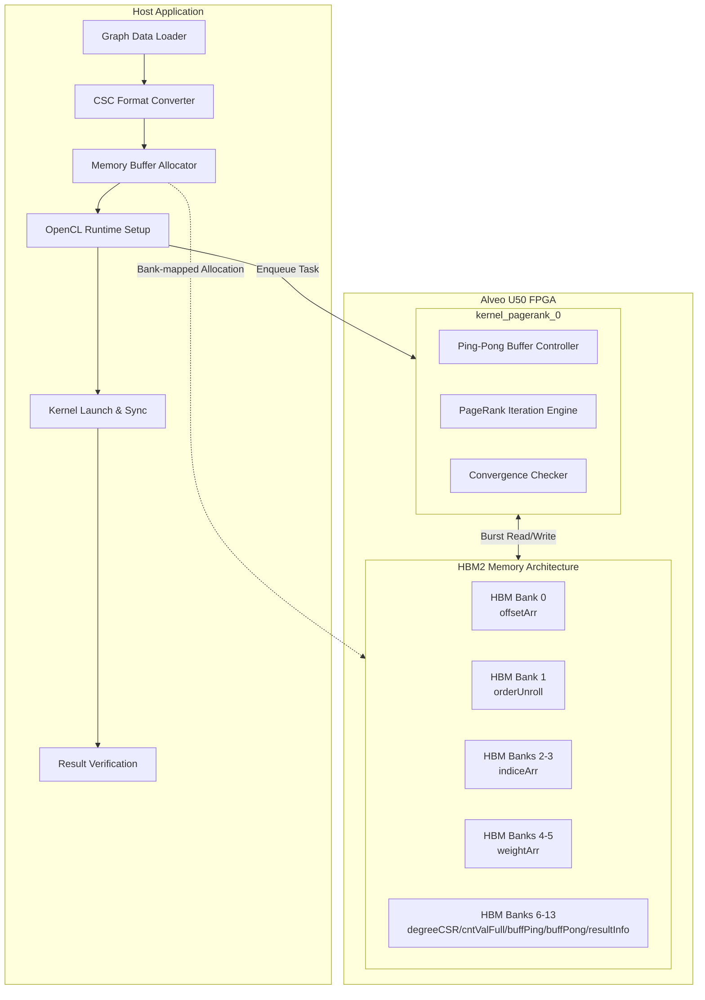

# PageRank Base Benchmark 模块

## 概述

**PageRank Base Benchmark** 是专为 Xilinx Alveo U50 加速卡设计的 PageRank 算法 FPGA 加速基准测试模块。它代表了在 HBM2（高带宽内存）架构上实现大规模图分析的核心参考设计。

想象你有一个包含数十亿网页链接关系的超大规模图数据集。传统的 CPU 实现需要数小时才能计算出每个页面的 PageRank 值，而此模块通过将迭代计算的密集部分卸载到 FPGA 内核，并利用 HBM 的极高内存带宽（相比传统 DDR 提升约 10 倍），将整个计算过程加速到秒级甚至毫秒级。

该模块的核心价值在于：**它不仅仅是一个算法实现，而是一个完整的「图分析加速范式」**——展示了如何在 FPGA 上高效处理稀疏图结构、如何管理 HBM 多 bank 内存访问、以及如何设计 ping-pong 缓冲来支撑迭代算法的流水线执行。

## 架构全景

### 系统架构图



### 核心组件交互

想象一个**高度自动化的物流中心**（Host）与**自动化分拣仓库**（FPGA）的协作：

1. **数据准备阶段**：Host 端的图数据加载器（`Graph Data Loader`）首先读取原始图数据（通常是边列表格式），然后由 CSC 格式转换器将其压缩为 CSC（Compressed Sparse Column）格式——这是一种专为稀疏矩阵设计的高效存储格式，只存储非零元素的位置和值。

2. **内存分配与映射**：内存缓冲区分配器（`Memory Buffer Allocator`）根据配置文件 `conn_u50.cfg` 中的映射规则，将不同的数据缓冲区分配到 HBM 的不同 bank 上。这是一种**空间并行化策略**——通过将内存访问分散到 8 个独立的 HBM bank，最大化内存带宽利用率。

3. **运行时执行**：OpenCL 运行时（`OpenCL Runtime Setup`）初始化设备上下文、命令队列和内核对象。随后通过 `enqueueTask` 启动 `kernel_pagerank_0` 内核。内核内部采用 **ping-pong 缓冲机制**——两个交替使用的缓冲区（`buffPing` 和 `buffPong`）使得当前迭代的计算可以与上一次迭代的结果读取并行进行。

4. **收敛与回传**：内核中的 PageRank 迭代引擎执行幂迭代算法，每次迭代计算新的 PageRank 值并检查收敛条件（`Convergence Checker`）。当收敛或达到最大迭代次数后，结果通过 HBM 回传到 Host，由结果验证器（`Result Verification`）与参考值对比并计算误差。

## 关键设计决策

### 1. HBM 多 Bank 内存架构 vs DDR

**问题**：传统 DDR 内存带宽成为图分析算法的瓶颈。

**决策**：采用 HBM2（高带宽内存），并通过 `conn_u50.cfg` 配置文件将 9 个主要数据缓冲区映射到 8 个 HBM bank 上：
- `offsetArr` → Bank 0
- `orderUnroll` → Bank 1  
- `indiceArr` → Banks 2-3
- `weightArr` → Banks 4-5
- `degreeCSR`, `cntValFull`, `buffPing`, `buffPong`, `resultInfo` → Banks 6-13

**权衡分析**：
- **收益**：分散内存访问压力，理论上可实现接近 460 GB/s 的聚合带宽（U50 的 HBM 规格）。
- **代价**：增加了编程复杂性，需要手动管理 bank 分配；对图数据规模有一定要求（小图可能无法充分利用带宽）。
- **替代方案**：使用 DDR 配合大容量缓存策略，但对于 PageRank 这种随机访问稀疏图的模式，缓存命中率通常较低。

### 2. CSC 稀疏矩阵格式

**问题**：图数据极度稀疏（边数远少于顶点数的平方），密集矩阵存储浪费内存且遍历效率低。

**决策**：采用 CSC（Compressed Sparse Column）格式存储图的邻接矩阵：
- `offsetArr`：列偏移数组，长度为 `nrows+1`，指示每列（顶点）的非零元素在 `indiceArr` 中的起始位置
- `indiceArr`：行索引数组，长度为 `nnz`（非零元素数），存储实际的边目标顶点 ID
- `weightArr`：边权重数组，对于无向图通常全为 1.0

**权衡分析**：
- **收益**：存储复杂度从 $O(n^2)$ 降至 $O(nnz)$，遍历时只访问有效边。
- **代价**：CSC 对按列访问友好，但按行访问效率低（PageRank 的稀疏矩阵向量乘法实际上是按列访问，因此非常适合）。
- **替代方案**：CSR（Compressed Sparse Row）格式，对于需要按行访问的算法更优，但 PageRank 的幂迭代本质上是 $A^T \cdot v$（列访问），因此 CSC 是更自然的选择。

### 3. Ping-Pong 双缓冲机制

**问题**：PageRank 是迭代算法，每次迭代需要读取上一次迭代的 PageRank 值并写入新值，如果只有一个缓冲区会造成读写冲突。

**决策**：在内核实现中采用 **ping-pong 缓冲**（double buffering）策略：
- `buffPing` 和 `buffPong` 两个大小相同的缓冲区
- 第 $i$ 次迭代从 `buffPing` 读取，计算结果写入 `buffPong`
- 第 $i+1$ 次迭代交换角色，从 `buffPong` 读取，写入 `buffPing`
- `resultInfo` 指示最终有效结果位于哪个缓冲区

**权衡分析**：
- **收益**：实现读写分离，使得迭代计算可以全流水线化，无需停顿等待上一次写入完成。
- **代价**：内存占用翻倍（需要两个完整大小的缓冲区）；内核逻辑稍微复杂，需要维护当前状态指针。
- **替代方案**：原地更新（in-place update），但会引入读写依赖，限制流水线深度；或三缓冲（增加延迟换取更宽松的调度约束）。

### 4. 单精度浮点 (float) vs 双精度 (double)

**问题**：PageRank 算法对数值精度的敏感度，以及 FPGA 上 DSP 资源的限制。

**决策**：默认使用单精度浮点数 (`float`) 进行计算，但通过 `typedef` 提供切换到双精度 (`double`) 的能力：
```cpp
typedef float DT;  // 可改为 double
```

**权衡分析**：
- **收益**：单精度在 FPGA 上消耗的 DSP48 资源约为双精度的一半，允许更宽的并行度；内存带宽需求也减半，更适合 HBM 高带宽场景。
- **代价**：对于某些病态图结构或极高精度要求的场景，单精度可能在迭代后期引入舍入误差，影响收敛判定。
- **替代方案**：混合精度（迭代前期用 float，后期用 double），或定点数（牺牲动态范围换取更低资源），但实现复杂度显著增加。

## 子模块摘要

### 1. [U50 HBM 连接配置 (conn_u50.cfg)](graph-l2-benchmarks-pagerank-conn_u50-cfg.md)

Xilinx 加速卡的平台连接配置文件，定义了 `kernel_pagerank_0` 内核的 8 个 M_AXI 接口与 HBM 16 个 pseudo bank 之间的映射关系。该配置是内存带宽最大化的关键，通过将不同类型的图数据（偏移量、索引、权重、计算缓冲区）分散到独立的 HBM bank，实现并行内存访问。

### 2. [主机基准测试应用 (test_pagerank.cpp)](graph_analytics_and_partitioning-l2_pagerank_and_centrality_benchmarks-pagerank_base_benchmark-host_test_pagerank.md)

完整的 OpenCL 主机端应用程序，负责图数据加载、CSC 格式转换、HBM 内存分配与 bank 映射、内核启动与同步、结果验证。该组件实现了完整的基准测试流程，包括端到端（E2E）时间测量、内核执行时间剖析（profiling）以及与 TigerGraph 参考结果的精度对比。

## 跨模块依赖

### 上游依赖（本模块依赖的外部组件）

| 模块路径 | 依赖类型 | 用途说明 |
|---------|---------|---------|
| [L3 OpenXRM 算法操作](graph_analytics_and_partitioning-l3_openxrm_algorithm_operations.md) | 算法库 | 使用 `xf::graph::internal` 命名空间下的图算法内部实现（如 `calc_degree::f_cast`）进行结果解析和类型转换 |
| [数据搬运运行时](data_mover_runtime.md) | 运行时库 | 通过 `xf::common::utils_sw::Logger` 进行日志记录和测试状态管理 |
| [L2 图预处理与转换](graph_analytics_and_partitioning-l2_graph_preprocessing_and_transforms.md) | 数据类型 | 使用 `CscMatrix<int, float>` 等 CSC 稀疏矩阵数据结构进行图表示 |
| blas_python_api | 数学库 | 潜在依赖 BLAS 操作进行向量计算（代码中通过 `xf_graph_L2.hpp` 间接引用）|

### 下游依赖（依赖本模块的外部组件）

| 模块路径 | 依赖类型 | 用途说明 |
|---------|---------|---------|
| [PageRank 缓存优化基准测试](graph_analytics_and_partitioning-l2_pagerank_and_centrality_benchmarks-pagerank_cache_optimized_benchmark.md) | 优化变体 | 基于本基础实现，添加缓存优化策略（如顶点重排序、数据预取） |
| [PageRank 多通道扩展基准测试](graph_analytics_and_partitioning-l2_pagerank_and_centrality_benchmarks-pagerank_multi_channel_scaling_benchmark.md) | 扩展变体 | 基于本基础实现，扩展到多 HBM 通道并行处理 |
| [PageRank 个性化多通道基准测试](graph_analytics_and_partitioning-l2_pagerank_and_centrality_benchmarks-pagerank_personalized_multi_channel_benchmark.md) | 应用变体 | 基于本基础实现，支持 Personalized PageRank（PPR）算法变体 |

## 新贡献者须知

### 1. 环境准备与编译流程

**必要的硬件环境**：
- Xilinx Alveo U50 数据中心加速卡（带 HBM2）
- 支持 OpenCL 1.2+ 的主机（通常配备 PCIe Gen3 x16）

**软件依赖**：
- Xilinx Vitis 2020.2 或更高版本
- XRT（Xilinx Runtime）
- 与 U50 对应的平台文件（`xilinx_u50_gen3x16_xdma_201920_3`）

**关键编译步骤**：
1. **内核编译**：使用 Vitis 将 C++ HLS 内核综合为 `.xo` 对象文件，然后链接生成 `.xclbin` 比特流
2. **主机编译**：使用 g++ 编译 `test_pagerank.cpp`，链接 XRT 库和 OpenCL 库
3. **注意**：`conn_u50.cfg` 文件必须在链接阶段通过 `--config` 选项指定，以确保内核端口正确映射到 HBM bank

### 2. 常见陷阱与调试技巧

**内存对齐要求**：
- 所有通过 `aligned_alloc()` 分配的缓冲区必须 4096 字节对齐（PCIe DMA 要求）
- 使用 `posix_memalign` 而非标准 `malloc`，并检查返回值

**HBM Bank 映射陷阱**：
- 如果内核报告内存访问错误或性能远低于预期（<100 GB/s 聚合带宽），首先检查 `conn_u50.cfg` 中的 bank 映射是否与 `mext_in` 数组中的标志匹配
- 注意：XCL 内存拓扑标志（`XCL_BANK0` 等）必须与配置文件的 sp（super logic region）映射保持一致

**数据格式一致性**：
- CSC 格式要求 `offsetArr` 长度为 `nrows+1`，且最后一个元素必须等于 `nnz`
- `indiceArr` 和 `weightArr` 长度必须严格等于 `nnz`，否则会导致越界访问

**收敛判定调试**：
- 如果结果与参考值差异较大，首先检查 `alpha`（阻尼系数，默认 0.85）和 `tolerance`（收敛阈值，默认 1e-3）设置
- 注意 `maxIter` 在 BENCHMARK 模式下为 500，非 BENCHMARK 模式下为 20，这可能导致非 BENCHMARK 模式下未收敛就停止

### 3. 扩展与定制指南

**添加新的图格式支持**：
- 当前支持 `.txt`（非 BENCHMARK）和 `.mtx`（Matrix Market，BENCHMARK 模式）
- 在 `readInWeightedDirectedGraphCV` 和 `readInWeightedDirectedGraphRow` 之后添加新的解析器
- 确保输出格式符合 `CscMatrix` 结构

**修改内存架构（适配其他板卡）**：
- 如果目标板卡是 U200/U250（DDR 而非 HBM），需要：
  1. 修改 `conn_u50.cfg` 为对应平台的连接配置（DDR bank 映射）
  2. 将代码中所有 `XCL_BANK*` 宏替换为 `XCL_MEM_DDR_BANK*` 宏
  3. 调整缓冲区大小以适应 DDR 的较小带宽（可能需要增加计算并行度来隐藏延迟）

**算法变体：个性化 PageRank (PPR)**
- 参考下游模块 `pagerank_personalized_multi_channel_benchmark` 的实现
- 关键修改：添加个性化向量（preference vector）输入，修改迭代公式为 $r = \alpha A^T r + (1-\alpha)v$，其中 $v$ 是个性化向量
- 需要增加一个 HBM bank 来存储 $v$ 向量

## 参考文档链接

- [Xilinx Alveo U50 数据中心加速卡产品指南](https://www.xilinx.com/products/boards-and-kits/alveo/u50.html)
- [Vitis HLS 用户指南 - 高性能内核优化](https://docs.xilinx.com/r/en-US/ug1399-vitis-hls)
- [XRT 原生 API 参考](https://xilinx.github.io/XRT/master/html/xrt_native_apis.html)
- CSC 稀疏矩阵格式规范（Matrix Market 交换格式）