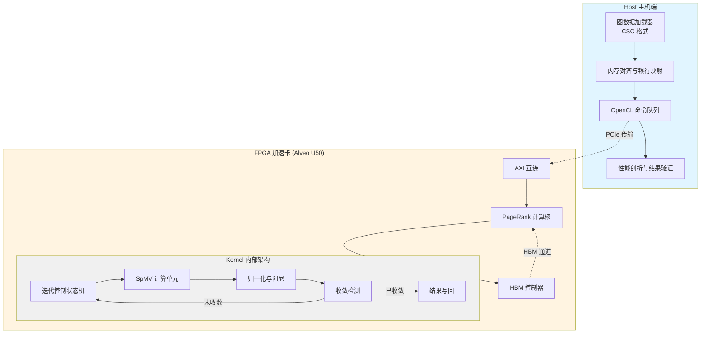

# L2 PageRank 与中心性基准测试模块

## 概述

本模块是 **Xilinx FPGA 图分析加速库** 中负责 PageRank 算法硬件加速的 L2 层基准测试套件。它通过将经典的网页排名（PageRank）迭代算法映射到 FPGA 的高带宽内存（HBM）架构上，实现了对大规模图数据的低延迟、高吞吐处理。

可以将本模块理解为**"图计算的专用流水线工厂"**——传统 CPU 实现如同工匠手工打磨，而 FPGA 实现则是将迭代计算、内存访问和收敛判断固化成并行流水线，以流水线填充（pipeline filling）的方式榨取 HBM 的理论带宽。

本模块不仅是性能基准测试集合，更是探索 FPGA 图算法优化策略的**试验场**，涵盖了从基础单通道实现到多通道并行、从标准 PageRank 到个性化 PageRank（Personalized PageRank）的完整技术 spectrum。

---

## 架构概览

### 系统架构图

### 核心组件交互

本模块包含四个主要的基准测试变体，它们共享相同的基础架构模式，但在并行度和优化策略上各有侧重：

1. **基础 PageRank** ([pagerank_base_benchmark](graph_analytics_and_partitioning-l2_pagerank_and_centrality_benchmarks-pagerank_base_benchmark.md))：单 HBM 通道的标准实现，作为性能基线。

2. **缓存优化 PageRank** ([pagerank_cache_optimized_benchmark](graph_analytics_and_partitioning-l2_pagerank_and_centrality_benchmarks-pagerank_cache_optimized_benchmark.md))：针对图数据局部性优化的缓存友好版本。

3. **多通道扩展 PageRank** ([pagerank_multi_channel_scaling_benchmark](graph_analytics_and_partitioning-l2_pagerank_and_centrality_benchmarks-pagerank_multi_channel_scaling_benchmark.md))：支持 2 通道或 6 通道 HBM 并行访问，通过通道级并行提升带宽利用率。

4. **个性化 PageRank** ([pagerank_personalized_multi_channel_benchmark](graph_analytics_and_partitioning-l2_pagerank_and_centrality_benchmarks-pagerank_personalized_multi_channel_benchmark.md))：支持从指定源节点开始的随机游走（Teleport 概率分布修改），用于个性化推荐场景。

---

## 关键设计决策

### 1. HBM 内存架构与银行映射策略

**决策**：使用 Xilinx Alveo U50 的 HBM（高带宽内存）而非传统 DDR，并通过 `.cfg` 连接配置文件精确控制 AXI 端口到 HBM 银行的映射。

**理由**：
- **带宽需求**：PageRank 是内存密集型算法（稀疏矩阵-向量乘），理论带宽需求 = 非零元数 × 每迭代数据宽度 × 迭代次数。U50 的 HBM 提供 460 GB/s 理论带宽，是 DDR4 的 10 倍以上。
- **银行并行**：HBM 分为 32 个独立银行（pseudo-channels），通过将不同数据流（偏移量、索引、权重、结果缓冲）映射到不同银行，实现物理级并行访问，避免银行冲突（bank conflict）。

**权衡**：
- **复杂性 vs 性能**：手动管理 HBM 银行分配增加了代码复杂性（需要为每种通道配置维护不同的 `.cfg` 文件），但相比自动分配，可避免多个 AXI 端口竞争同一银行导致的带宽瓶颈。
- **资源消耗**：每个 HBM 银行需要独立的 AXI 控制器逻辑，过多端口会消耗 FPGA LUT/FF 资源，限制计算逻辑规模。因此基础版本使用较少端口，而多通道版本通过增加端口数换取带宽。

### 2. Ping-Pong 缓冲与双缓冲策略

**决策**：在 FPGA 内核中使用 Ping-Pong（双缓冲）机制管理 PageRank 的迭代计算，交替使用 `buffPing` 和 `buffPong` 存储当前迭代和下一迭代的排名值。

**理由**：
- **数据依赖性**：PageRank 计算具有全图依赖性，必须等待所有节点的 $PR_{old}$ 计算完成后才能开始下一轮迭代。
- **内存带宽隐藏**：通过双缓冲，内核可以在写入 $PR_{new}$ 的同时，从另一缓冲区读取 $PR_{old}$，实现读写并行，隐藏内存延迟。
- **收敛判断**：通过比较两个缓冲区的值差，在内核内部实现自动收敛检测，减少 Host-FPGA 通信开销。

**权衡**：
- **内存占用**：双缓冲使内存占用翻倍（需要同时存储 $PR_{old}$ 和 $PR_{new}$），但这是算法固有要求。
- **复杂度**：需要在 Host 代码中管理两个缓冲区的地址映射和最终的读取逻辑（根据 `resultInfo` 中的标志判断最终结果存储位置）。

### 3. CSC 稀疏矩阵存储格式

**决策**：使用 CSC（Compressed Sparse Column，压缩稀疏列）格式存储图数据的邻接矩阵。

**理由**：
- **算法适配性**：PageRank 的核心计算是稀疏矩阵-向量乘法 $A^T \\cdot x$（转置矩阵乘向量）。CSC 格式按列存储，正好对应 PageRank 中"收集入边贡献"的访问模式。
- **内存局部性**：CSC 的 `columnOffset` 数组提供 O(1) 列定位，`row` 和 `value` 数组在列内连续存储，具有良好的空间局部性。

**权衡**：
- **预处理成本**：从原始边列表转换为 CSC 需要在 Host 侧进行排序（按目标节点 ID），时间复杂度 $O(E \\log E)$。对于静态图，这是一次性成本。
- **算法限制**：CSC 优化针对 PageRank 的 $A^T \\cdot x$ 操作，不能直接复用于需要 $A \\cdot x$ 的算法（如 BFS/SSSP 的前向传播）。

### 4. 多通道并行架构（2/6 通道）

**决策**：在 multi_channels 和 personalized 变体中，实现 2 通道或 6 通道 HBM 并行访问架构。

**理由**：
- **带宽墙突破**：单 HBM 通道理论带宽约 14.4 GB/s，对于高稀疏度大图容易成为瓶颈。通过 6 通道并行，理论带宽提升至 6 倍。
- **并行计算单元**：多通道架构允许在 FPGA 内复制多份计算单元（SpMV 处理单元），每份对应一个通道，实现通道级并行（Channel-Level Parallelism）。

**权衡**：
- **资源消耗 vs 性能**：每增加一个通道，需要额外消耗 FPGA 资源（LUT/FF/BRAM）用于 AXI 接口逻辑、数据缓冲 FIFO 和计算单元复制。6 通道版本消耗的资源约为单通道的 4-5 倍。
- **负载均衡挑战**：图数据的幂律分布（Power-law）导致节点出度/入度差异巨大。简单按节点 ID 范围分片会导致某些通道负载过重，需要复杂的图划分（Graph Partitioning）预处理。
- **可扩展性限制**：通道数受限于 FPGA 的 HBM 物理端口数和逻辑资源，6 通道已是实际部署的合理上限。

---

## 跨模块依赖

本模块依赖以下外部模块和库：

### 上游依赖（本模块依赖它们）

| 模块 | 依赖类型 | 说明 |
|------|----------|------|
| [l3_openxrm_algorithm_operations](graph_analytics_and_partitioning-l3_openxrm_algorithm_operations.md) | API 调用 | 使用 `op_pagerank` 高层抽象接口，PageRank 算法的数学定义和参数配置来自 L3 层 |
| [l2_connectivity_and_labeling_benchmarks](graph_analytics_and_partitioning-l2_connectivity_and_labeling_benchmarks.md) | 工具函数 | 共享图数据加载工具（`CscMatrix`、`readInWeightedDirectedGraphCV` 等）和性能计时结构体 |
| [blas_python_api](blas_python_api.md) | 数学库 | 使用 BLAS 风格的向量和矩阵操作原语，用于 Host 侧的参考实现和结果验证 |

### 下游依赖（它们依赖本模块）

| 模块 | 依赖类型 | 说明 |
|------|----------|------|
| [data_analytics_text_geo_and_ml](data_analytics_text_geo_and_ml.md) | 算法调用 | 文本分析和推荐系统中的图嵌入算法可能调用 PageRank 作为节点特征提取器 |
| [quantitative_finance_engines](quantitative_finance_engines.md) | 风险模型 | 金融网络分析中的系统性风险传播模型可能使用 PageRank 变体度量节点重要性 |

### 第三方库

| 库名称 | 用途 | 版本要求 |
|--------|------|----------|
| Xilinx OpenCL Runtime (XRT) | FPGA 设备管理、内存迁移、内核执行 | 2.0+ |
| Xilinx Vitis HLS Libraries | `hls::stream`、`ap_uint`、数学函数 | 2021.1+ |
| Boost (可选) | 命令行参数解析、计时器（若使用 Boost 版本） | 1.65+ |

---

## 性能调优建议

### 1. HBM 银行分配策略

- **分散热点**：将 `offsetArr`（列偏移）和 `indiceArr`（行索引）映射到不同的 HBM 银行组，避免读取 CSC 数据时的银行冲突。
- **隔离读写**：将输入图数据（只读）和输出结果缓冲（读写）分配到物理隔离的 HBM 区域，避免读写竞争。

### 2. 内核参数配置

- **精度选择**：对于大规模图（>100M 节点），若内存带宽是瓶颈，使用 `float`（4 字节）而非 `double`（8 字节），可将有效数据量减半，提升缓存命中率。
- **早停策略**：设置合理的 `maxIter`（通常 50-100 次足以收敛），避免在已收敛图上浪费时钟周期。

### 3. Host 侧优化

- **批量执行**：若有多个图需要处理，使用 OpenCL 的 `clEnqueueNativeKernel` 或设备端队列（Device-Side Queue）实现 FPGA 内核的流水线填充，隐藏 Host 预处理延迟。
- **NUMA 亲和性**：在双路服务器上，将 Host 内存分配绑定到与 FPGA 所在 NUMA 节点相同的 CPU socket，减少 PCIe 跨节点访问延迟。

---

## 总结

`l2_pagerank_and_centrality_benchmarks` 模块展示了如何将经典的图迭代算法（PageRank）高效地映射到 FPGA 的 HBM 架构上。其核心设计哲学是：**通过算法-架构协同设计（Algorithm-Architecture Co-Design），在 HBM 的高带宽与 FPGA 的流水线并行之间找到最佳平衡点**。

关键的技术决策——CSC 格式选择、Ping-Pong 双缓冲、HBM 银行静态映射、Kernel 内部迭代控制——都是围绕 PageRank 的内存访问模式和数据依赖性展开的。多通道扩展版本则进一步展示了如何通过通道级并行突破带宽瓶颈，为更大规模的图处理提供了可扩展的架构模板。

对于新加入团队的开发者，理解本模块的关键在于：**从 CPU 的"时间复用"思维切换到 FPGA 的"空间并行"思维**——不再关注每条指令何时执行，而是关注数据流如何在物理资源上流动，以及如何通过流水线填充和内存访问重叠来隐藏延迟。外部模块和库：

### 上游依赖（本模块依赖它们）

| 模块 | 依赖类型 | 说明 |
|------|----------|------|
| [l3_openxrm_algorithm_operations](graph_analytics_and_partitioning-l3_openxrm_algorithm_operations.md) | API 调用 | 使用 `op_pagerank` 高层抽象接口，PageRank 算法的数学定义和参数配置来自 L3 层 |
| [l2_connectivity_and_labeling_benchmarks](graph_analytics_and_partitioning-l2_connectivity_and_labeling_benchmarks.md) | 工具函数 | 共享图数据加载工具（`CscMatrix`、`readInWeightedDirectedGraphCV` 等）和性能计时结构体 |
| [blas_python_api](blas_python_api.md) | 数学库 | 使用 BLAS 风格的向量和矩阵操作原语，用于 Host 侧的参考实现和结果验证 |

### 下游依赖（它们依赖本模块）

| 模块 | 依赖类型 | 说明 |
|------|----------|------|
| [data_analytics_text_geo_and_ml](data_analytics_text_geo_and_ml.md) | 算法调用 | 文本分析和推荐系统中的图嵌入算法可能调用 PageRank 作为节点特征提取器 |
| [quantitative_finance_engines](quantitative_finance_engines.md) | 风险模型 | 金融网络分析中的系统性风险传播模型可能使用 PageRank 变体度量节点重要性 |

### 第三方库

| 库名称 | 用途 | 版本要求 |
|--------|------|----------|
| Xilinx OpenCL Runtime (XRT) | FPGA 设备管理、内存迁移、内核执行 | 2.0+ |
| Xilinx Vitis HLS Libraries | `hls::stream`、`ap_uint`、数学函数 | 2021.1+ |
| Boost (可选) | 命令行参数解析、计时器（若使用 Boost 版本） | 1.65+ |

---

## 性能调优建议

### 1. HBM 银行分配策略

- **分散热点**：将 `offsetArr`（列偏移）和 `indiceArr`（行索引）映射到不同的 HBM 银行组，避免读取 CSC 数据时的银行冲突。
- **隔离读写**：将输入图数据（只读）和输出结果缓冲（读写）分配到物理隔离的 HBM 区域，避免读写竞争。

### 2. 内核参数配置

- **精度选择**：对于大规模图（>100M 节点），若内存带宽是瓶颈，使用 `float`（4 字节）而非 `double`（8 字节），可将有效数据量减半，提升缓存命中率。
- **早停策略**：设置合理的 `maxIter`（通常 50-100 次足以收敛），避免在已收敛图上浪费时钟周期。

### 3. Host 侧优化

- **批量执行**：若有多个图需要处理，使用 OpenCL 的 `clEnqueueNativeKernel` 或设备端队列（Device-Side Queue）实现 FPGA 内核的流水线填充，隐藏 Host 预处理延迟。
- **NUMA 亲和性**：在双路服务器上，将 Host 内存分配绑定到与 FPGA 所在 NUMA 节点相同的 CPU socket，减少 PCIe 跨节点访问延迟。

---

## 总结

`l2_pagerank_and_centrality_benchmarks` 模块展示了如何将经典的图迭代算法（PageRank）高效地映射到 FPGA 的 HBM 架构上。其核心设计哲学是：**通过算法-架构协同设计（Algorithm-Architecture Co-Design），在 HBM 的高带宽与 FPGA 的流水线并行之间找到最佳平衡点**。

关键的技术决策——CSC 格式选择、Ping-Pong 双缓冲、HBM 银行静态映射、Kernel 内部迭代控制——都是围绕 PageRank 的内存访问模式和数据依赖性展开的。多通道扩展版本则进一步展示了如何通过通道级并行突破带宽瓶颈，为更大规模的图处理提供了可扩展的架构模板。

对于新加入团队的开发者，理解本模块的关键在于：**从 CPU 的"时间复用"思维切换到 FPGA 的"空间并行"思维**——不再关注每条指令何时执行，而是关注数据流如何在物理资源上流动，以及如何通过流水线填充和内存访问重叠来隐藏延迟。