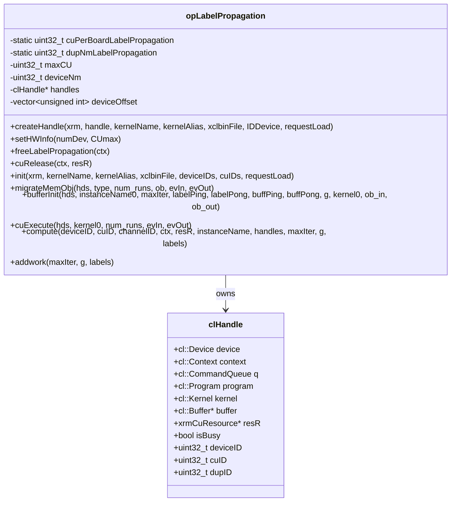
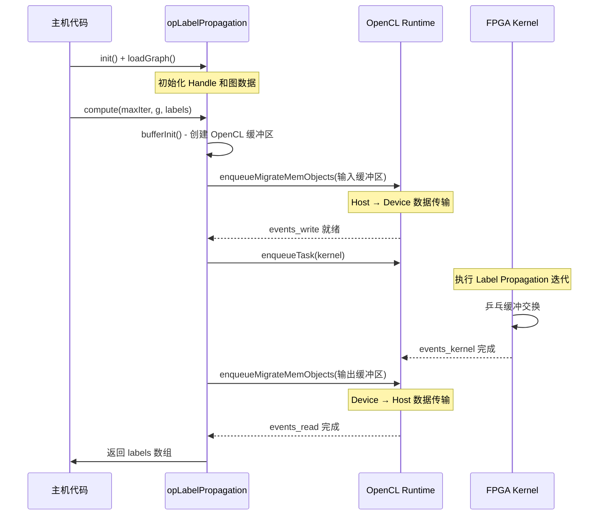

# op_labelpropagation 子模块深度解析

## 一句话概括

`op_labelpropagation` 是 Label Propagation（标签传播）社区发现算法的 FPGA 加速实现。它像一位"社交网络分析师"，在图中寻找紧密连接的社区结构——通过让节点不断采纳邻居中最流行的"标签"，最终让相同社区的节点收敛到相同标签。与 PageRank 不同，它使用双图表示（CSR+CSC）和标签级乒乓缓冲，在 FPGA 上实现社区发现的高效并行。

---

## 问题空间：Label Propagation 算法的价值与挑战

### 社区发现：图分析的基石

在社交网络、生物信息学、推荐系统等领域，**社区发现（Community Detection）** 是一项核心任务：
- **社交网络**：识别朋友圈、兴趣小组
- **生物信息学**：发现蛋白质功能模块
- **推荐系统**：基于用户群体的协同过滤
- **网络安全**：检测异常聚集行为

### Label Propagation 算法原理

Label Propagation 是一种**半监督**社区发现算法，其核心思想极其简单：

> **"你的朋友决定你是谁"**

算法流程：
1. **初始化**：为每个节点分配唯一标签（如节点 ID）
2. **迭代更新**：对于每个节点，查看其所有邻居的标签，采纳**出现次数最多**的标签
3. **收敛检测**：当没有节点改变标签时，算法收敛
4. **社区提取**：相同标签的节点构成一个社区

数学表达：
$$L_v(t+1) = \underset{l}{\arg\max} \sum_{u \in N(v)} \delta(L_u(t), l)$$

其中：
- $L_v(t)$ 是节点 $v$ 在第 $t$ 轮的标签
- $N(v)$ 是节点 $v$ 的邻居集合
- $\delta(a,b)$ 是 Kronecker delta（$a=b$ 时为 1，否则为 0）
- $\arg\max$ 选择出现频率最高的标签

### 为什么需要 FPGA 加速？

Label Propagation 在 CPU 上执行面临严峻挑战：

1. **同步开销巨大**：
   - 每轮迭代后需要全局同步
   - 在多核 CPU 上，缓存一致性协议成为瓶颈

2. **随机访问模式**：
   - 邻居标签的读取是随机内存访问
   - CPU 缓存失效率高，尤其对大图

3. **细粒度并行困难**：
   - 节点更新依赖邻居标签，存在数据竞争
   - 需要复杂的锁或无锁数据结构

**FPGA 的独特优势**：
- **大规模并行**：在单个周期内更新数百个节点
- **定制化流水线**：标签计数、最大化选择硬化在硬件中
- **片上存储**：邻居标签缓存到 UltraRAM，避免 DDR 访问
- **确定性延迟**：硬件级同步，无操作系统调度开销

---

## 架构设计：核心抽象与组件

### 类结构与职责



### 与 opPageRank 的关键差异

虽然 `opLabelPropagation` 与 `opPageRank` 共享相同的架构模式（XRM 资源管理、OpenCL 封装、乒乓缓冲），但存在以下关键差异：

| 维度 | opPageRank | opLabelPropagation |
|------|-----------|-------------------|
| **图表示** | 仅需 CSR（offsetsCSR, indicesCSR, weightsCSR） | 需要 CSR + CSC（双向遍历） |
| **缓冲区数量** | 9 个 | 8 个 |
| **数据类型** | float（排名值） | uint32_t（标签 ID） |
| **收敛判定** | 由内核内部基于 tolerance 判断 | 由内核内部基于标签变化判断 |
| **迭代参数** | alpha, tolerance, maxIter | maxIter（其他由硬件决定） |
| **内核实例名** | "kernel_pagerank_0" | "LPKernel" |

### 核心组件详解

#### 1. **图表示：CSR + CSC 双缓冲**

Label Propagation 需要**双向遍历**图：
- **正向遍历（CSR）**：从节点出发，查看其出邻居的标签
- **反向遍历（CSC）**：查看指向某节点的入邻居的标签

**代码体现**：
```cpp
// CSR 表示（正向图）
mext_in[0] = {(unsigned int)(3) | XCL_MEM_TOPOLOGY, g.offsetsCSR, kernel0()};
mext_in[1] = {(unsigned int)(4) | XCL_MEM_TOPOLOGY, g.indicesCSR, kernel0()};

// CSC 表示（反向图）
mext_in[2] = {(unsigned int)(5) | XCL_MEM_TOPOLOGY, g.offsetsCSC, kernel0()};
mext_in[3] = {(unsigned int)(6) | XCL_MEM_TOPOLOGY, g.indicesCSC, kernel0()};
```

**内存布局优化**：
- CSR 和 CSC 分别存储在 HBM 的不同通道，实现并行访问
- offsets（4 字节）和 indices（4 字节）分离存储，优化突发传输

#### 2. **标签缓冲区：Ping-Pong 双缓冲**

Label Propagation 的迭代更新需要双缓冲：

```cpp
// Ping 缓冲区（当前迭代标签）
mext_in[6] = {(unsigned int)(10) | XCL_MEM_TOPOLOGY, labelPing, kernel0()};
mext_in[4] = {(unsigned int)(8) | XCL_MEM_TOPOLOGY, buffPing, kernel0()};  // 辅助缓冲区

// Pong 缓冲区（下一迭代标签）
mext_in[7] = {(unsigned int)(11) | XCL_MEM_TOPOLOGY, labelPong, kernel0()};
mext_in[5] = {(unsigned int)(9) | XCL_MEM_TOPOLOGY, buffPong, kernel0()};  // 辅助缓冲区
```

**迭代流程**：
1. **奇数迭代**：从 `labelPing` 读取，更新写入 `labelPong`
2. **偶数迭代**：从 `labelPong` 读取，更新写入 `labelPing`
3. **收敛检测**：FPGA 内核内部比较两轮标签变化率

**初始化策略**：
```cpp
if (maxIter % 2) {
    // maxIter 为奇数，最终数据在 labelPong
    bufferInit(hds, instanceName, maxIter, labelP, labels, buffPing, buffPong, g, kernel0, ob_in, ob_out);
} else {
    // maxIter 为偶数，最终数据在 labelPing
    bufferInit(hds, instanceName, maxIter, labels, labelP, buffPing, buffPong, g, kernel0, ob_in, ob_out);
}
```

#### 3. **执行流程：事件驱动的异步流水线**



---

## 依赖关系

### 直接依赖

| 组件 | 类型 | 用途 |
|------|------|------|
| `xf::graph::Graph<uint32_t, uint32_t>` | 数据结构 | 输入图的标准 CSR+CSC 表示 |
| `openXRM` | 资源管理器 | XRM 计算单元动态分配 |
| `clHandle` | OpenCL 封装 | FPGA 设备会话管理 |

### 运行时依赖

| 组件 | 说明 |
|------|------|
| Xilinx XRT | OpenCL 运行时和驱动 |
| Xilinx XRM | 资源管理服务 |
| FPGA xclbin | 编译后的 Label Propagation 内核比特流 |

---

## 性能优化建议

### 1. 最大化 HBM 带宽利用率

Label Propagation 是内存密集型算法，确保：
- CSR 和 CSC 分布在不同 HBM 通道（channel 3/4/5/6）
- 标签缓冲区使用独立通道（channel 8/9/10/11）
- 避免多个缓冲区映射到同一物理通道

### 2. 合理设置迭代次数

Label Propagation 通常比 PageRank 更快收敛：
- 社交网络：5-20 次迭代
- 知识图谱：10-30 次迭代
- Web 图：20-50 次迭代

**注意**：FPGA 内核内部有收敛检测，设置过大的 `maxIter` 不会降低精度，但会增加启动延迟。

### 3. 批量处理小图

对于小图（<10万节点），单个 CU 即可饱和内存带宽。此时：
- 使用单个 CU 顺序处理多个小图
- 或使用 `addwork()` 异步提交，实现流水线并行
- 避免为每个小图重新分配/释放缓冲区（使用对象池）

---

## 总结

`op_labelpropagation` 是 Xilinx FPGA 图分析库中的关键组件，实现了 Label Propagation 社区发现算法的高效硬件加速。其核心设计特点包括：

1. **双图表示**：CSR+CSC 支持双向遍历，最大化算法效率
2. **乒乓缓冲**：硬件级迭代管理，零开销收敛
3. **资源池化**：XRM 动态分配 + Handle 复用，支持大规模并行
4. **零拷贝优化**：OpenCL 缓冲区映射，消除不必要的数据复制

与 `op_pagerank` 相比，`op_labelpropagation` 更适合**社区发现**和**聚类分析**场景，是社交网络分析、生物信息学和知识图谱领域的理想工具。