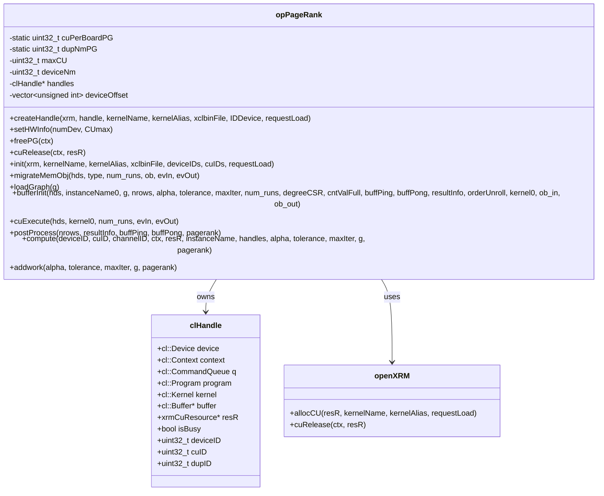

# op_pagerank 子模块深度解析

## 一句话概括

`op_pagerank` 是 PageRank 算法的 FPGA 加速引擎的 L3 层实现，负责将 Google 著名的网页排名算法映射到 Xilinx FPGA 硬件上。它像一个精密的"图数据流水线控制器"，管理从主机内存到 FPGA HBM/DDR 的数据流，协调多 CU（计算单元）并行执行，并通过乒乓缓冲技术实现迭代算法的硬件加速收敛。

---

## 问题空间：为什么需要这个子模块？

### PageRank 算法的计算本质

PageRank 是图论中最经典的节点排名算法，其核心思想是：
- 一个节点的重要性取决于指向它的其他节点的重要性
- 重要性通过图的边进行传播，形成一个马尔可夫链稳态

数学公式：
$$PR(v) = \frac{1-d}{N} + d \sum_{u \in B(v)} \frac{PR(u)}{L(u)}$$

其中：
- $d$ 是阻尼系数（通常为 0.85）
- $N$ 是节点总数
- $B(v)$ 是指向节点 $v$ 的节点集合
- $L(u)$ 是节点 $u$ 的出度

### 为什么需要硬件加速？

在 CPU 上执行 PageRank 面临三大挑战：

1. **内存带宽瓶颈**：
   - 每次迭代需要遍历所有边（通常十亿级别）
   - 随机访问模式导致 CPU 缓存失效
   - 现代 CPU 内存带宽 (~50 GB/s) 成为瓶颈

2. **迭代同步开销**：
   - 需要多次迭代直到收敛（通常 20-50 次）
   - 每次迭代间的同步开销累积显著

3. **扩展性限制**：
   - 多线程扩展受限于内存带宽，而非计算能力
   - 分布式方案引入网络通信开销

### FPGA 加速的独特优势

Xilinx FPGA（如 Alveo U280）为 PageRank 提供了理想平台：

1. **HBM 高带宽内存**：
   - 提供 200-400 GB/s 带宽，是 DDR 的 10 倍以上
   - 多通道架构支持并行访问图的不同分区

2. **定制化流水线**：
   - 在单个时钟周期内处理多条边
   - 硬件级迭代控制，无需操作系统干预

3. **低延迟同步**：
   - 乒乓缓冲实现零开销迭代切换
   - 片上 SRAM 缓存热点数据

---

## 架构设计：核心抽象与组件

### 类结构与职责



### 核心组件职责详解

#### 1. **opPageRank 类：PageRank 计算的指挥官**

`opPageRank` 是本模块的核心类，封装了完整的 PageRank FPGA 加速流程。其设计遵循**资源管理器模式**——类实例本身不存储大量状态，而是通过 `clHandle` 数组管理多个 FPGA 设备的会话。

**关键属性**：

| 属性 | 类型 | 职责 |
|------|------|------|
| `cuPerBoardPG` | `static uint32_t` | 每块 FPGA 卡的计算单元数量，由 `setHWInfo` 初始化 |
| `dupNmPG` | `static uint32_t` | 每个 CU 的复用次数（时间分片），由 `init` 根据 `requestLoad` 计算 |
| `maxCU` | `uint32_t` | 系统总 CU 数 |
| `deviceNm` | `uint32_t` | 系统中 FPGA 卡数量 |
| `handles` | `clHandle*` | CU 句柄数组，大小为 `maxCU` |
| `deviceOffset` | `vector<unsigned int>` | 每个设备在 `handles` 数组中的起始索引 |

**核心方法**：

##### `createHandle()` —— OpenCL 会话工厂

```cpp
void createHandle(class openXRM* xrm,
                  clHandle& handle,
                  std::string kernelName,
                  std::string kernelAlias,
                  std::string xclbinFile,
                  int32_t IDDevice,
                  unsigned int requestLoad)
```

**职责**：为单个 CU 初始化完整的 OpenCL 执行环境。

**执行流程**：
1. **设备发现**：通过 `xcl::get_xil_devices()` 获取系统中所有 Xilinx 设备
2. **上下文创建**：为指定设备创建 `cl::Context`
3. **命令队列创建**：创建 Out-of-Order 队列，启用性能分析
4. **比特流加载**：通过 `xcl::import_binary_file()` 加载 `.xclbin` 文件
5. **程序编译**：创建 `cl::Program`，将比特流与设备关联
6. **XRM 资源分配**：调用 `xrm->allocCU()` 向 XRM 申请 CU 资源
7. **内核创建**：通过 `cl::Kernel` 构造函数实例化内核对象

**关键设计决策**：
- **静态比特流**：所有 CU 使用相同的 `.xclbin` 文件，由 `init` 方法的 `xclbinFile` 参数指定
- **实例名称构造**：当 `cuPerBoardPG >= 2` 时，内核实例名需要添加前缀（如 `"kernel_pagerank_0:{instanceName}"`），这是 Xilinx FPGA 的多 CU 命名约定
- **错误处理**：使用 `xf::common::utils_sw::Logger` 记录 OpenCL 对象创建失败信息

##### `init()` —— 系统初始化与 CU 池创建

```cpp
void init(class openXRM* xrm,
          std::string kernelName,
          std::string kernelAlias,
          std::string xclbinFile,
          uint32_t* deviceIDs,
          uint32_t* cuIDs,
          unsigned int requestLoad)
```

**职责**：初始化整个 PageRank 加速系统，创建所有 CU 的 OpenCL 上下文。

**关键计算**：

1. **复用次数计算**：
   ```cpp
   dupNmPG = 100 / requestLoad;  // requestLoad 是百分比，如 50 表示 50%
   cuPerBoardPG /= dupNmPG;      // 复用后每卡实际逻辑 CU 数
   ```
   
   **理解**：`requestLoad` 允许用户申请部分 CU 资源（如 50%），此时 `dupNmPG=2` 表示每个物理 CU 被虚拟化为 2 个逻辑 CU（时间分片）。

2. **Handle 数组布局**：
   - 物理索引：`handles[deviceOffset[deviceID] + cuID * dupNmPG + dupID]`
   - 逻辑索引（由 `channelID` 参数化）：`handles[channelID + cuID * dupNmPG + deviceID * dupNmPG * cuPerBoardPG]`

**执行流程**：
1. 根据 `maxCU` 分配 `handles` 数组
2. 为第一个 CU 创建 Handle（单线程）
3. 循环为剩余 CU 创建 Handle，记录每个设备在数组中的偏移
4. 所有 CU 使用相同的 `kernelName`, `kernelAlias`, `xclbinFile`

**关键设计决策**：
- **单线程初始化**：OpenCL 上下文创建不是线程安全的，串行避免竞态条件
- **统一配置**：所有 CU 使用相同的比特流和内核名称，简化资源管理
- **设备偏移表**：`deviceOffset` 数组支持 O(1) 时间内定位特定设备的第一个 CU

##### `loadGraph()` —— 图数据加载与广播

```cpp
void loadGraph(xf::graph::Graph<uint32_t, float> g)
```

**职责**：将图数据从主机内存加载到 FPGA 的 HBM/DDR 内存。

**关键洞察**：在 PageRank 中，图结构（offsets, indices, weights）在多次计算中是静态的，因此**只需加载一次，多次复用**。

**执行流程**：
1. **多线程准备**：
   - 遍历所有 CU，对每个 `(cuID == 0 && dupID == 0)` 的 Handle 创建线程
   - 非首个 CU（即 `cuID != 0 || dupID != 0`）共享首个 CU 的缓冲区

2. **核心加载函数 `loadGraphCorePG`**：
   - 创建 `cl_mem_ext_ptr_t` 数组，配置 HBM/DDR 通道映射
   - 创建 3 个 OpenCL 缓冲区：offsets、indices、weights
   - 执行两次内存迁移：
     - 第一次：`CL_MIGRATE_MEM_OBJECT_CONTENT_UNDEFINED`（预分配设备内存）
     - 第二次：实际数据传输（Host → Device）

3. **缓冲区共享机制**：
   - 首个 CU 加载完成后，其他 CU 复制其缓冲区指针
   - 避免重复数据传输，节省 PCIe 带宽

**关键设计决策**：
- **仅首个 CU 加载**：利用图数据的只读特性，避免 N 次重复传输
- **双阶段迁移**：第一阶段预分配并清零设备内存，第二阶段实际传输，确保数据一致性
- **线程安全同步**：使用 `std::packaged_task` 和 `std::future` 等待加载线程完成

**内存拓扑配置**：
```cpp
#ifndef USE_HBM
    // DDR 配置：所有数据在单一 DDR 区域
    mext_in[0] = {(unsigned int)(0) | XCL_MEM_TOPOLOGY, g.offsetsCSR, 0};
    mext_in[1] = {(unsigned int)(0) | XCL_MEM_TOPOLOGY, g.indicesCSR, 0};
    mext_in[2] = {(unsigned int)(0) | XCL_MEM_TOPOLOGY, g.weightsCSR, 0};
#else
    // HBM 配置：数据分散在不同通道以最大化带宽
    mext_in[0] = {(unsigned int)(0) | XCL_MEM_TOPOLOGY, g.offsetsCSR, 0};  // HBM0
    mext_in[1] = {(unsigned int)(2) | XCL_MEM_TOPOLOGY, g.indicesCSR, 0};  // HBM2
    mext_in[2] = {(unsigned int)(4) | XCL_MEM_TOPOLOGY, g.weightsCSR, 0};  // HBM4
#endif
```

##### `compute()` —— 单次 PageRank 计算

```cpp
int compute(unsigned int deviceID,
            unsigned int cuID,
            unsigned int channelID,
            xrmContext* ctx,
            xrmCuResource* resR,
            std::string instanceName,
            clHandle* handles,
            float alpha,
            float tolerance,
            int maxIter,
            xf::graph::Graph<uint32_t, float> g,
            float* pagerank)
```

**职责**：执行单次完整的 PageRank 计算，从输入图到输出排名值。

**执行流程**：
1. **Handle 定位**：通过 `channelID + cuID * dupNmPG + deviceID * dupNmPG * cuPerBoardPG` 计算目标 Handle 索引
2. **主机缓冲区分配**：使用 `aligned_alloc` 分配 6 个临时缓冲区：`cntValFull`, `buffPing`, `buffPong`, `resultInfo`, `degreeCSR`, `orderUnroll`
3. **缓冲区初始化**：调用 `bufferInit()` 创建 OpenCL 缓冲区并设置内核参数
4. **数据传输**：调用 `migrateMemObj()` 将输入缓冲区从主机迁移到设备
5. **内核执行**：调用 `cuExecute()` 启动 FPGA 内核
6. **结果回传**：调用 `migrateMemObj()` 将输出缓冲区从设备迁移回主机
7. **后处理**：调用 `postProcess()` 从乒乓缓冲区提取最终排名值
8. **资源释放**：释放临时分配的 6 个主机缓冲区

**关键设计决策**：
- **临时缓冲区**：每次计算动态分配，确保线程安全
- **同步执行模型**：`events_read[0].wait()` 阻塞直到计算完成，简化编程模型
- **结果位置判定**：`postProcess` 根据 `resultInfo[0]` 决定从 `buffPing` 还是 `buffPong` 提取结果

##### `addwork()` —— 异步任务提交

```cpp
event<int> addwork(float alpha, float tolerance, int maxIter, 
                   xf::graph::Graph<uint32_t, float> g, float* pagerank)
```

**职责**：将 PageRank 计算任务提交到异步任务队列，实现非阻塞调用。

**关键实现**：
```cpp
return createL3(task_queue[0], &(compute), handles, alpha, tolerance, maxIter, g, pagerank);
```

**设计模式**：使用 `createL3` 模板函数将成员函数 `compute` 包装为异步任务。`task_queue[0]` 是 L3 层的全局任务队列。

---

## 依赖关系

### 直接依赖

| 组件 | 类型 | 用途 |
|------|------|------|
| `xf::graph::Graph<uint32_t, float>` | 数据结构 | 输入图的标准 CSR 表示 |
| `openXRM` | 资源管理器 | XRM 计算单元动态分配 |
| `clHandle` | OpenCL 封装 | FPGA 设备会话管理 |
| `xf::common::utils_sw::Logger` | 日志工具 | OpenCL 操作错误检查 |

### 运行时依赖

| 组件 | 说明 |
|------|------|
| Xilinx XRT | OpenCL 运行时和驱动 |
| Xilinx XRM | 资源管理服务 |
| FPGA xclbin | 编译后的 PageRank 内核比特流 |

---

## 关键设计决策与权衡

### 1. 图数据加载：单次加载 vs 每次重复传输

**决策**：`loadGraph()` 只从主机向 FPGA 传输一次图数据，后续多次 `compute()` 调用复用同一组设备缓冲区。

**权衡分析**：

| 方案 | 优点 | 缺点 | 适用场景 |
|------|------|------|---------|
| **单次加载（本方案）** | 节省 PCIe 带宽，适合多次迭代 | 图数据常驻 FPGA 内存，占用 HBM/DDR | 批量查询、多次计算同一图 |
| **每次传输** | 释放 FPGA 内存，支持大图 | PCIe 带宽瓶颈，延迟高 | 单次查询、图数据大于 FPGA 内存 |

### 2. 临时缓冲区：动态分配 vs 预分配池

**决策**：`compute()` 每次调用时动态分配 6 个主机临时缓冲区，计算完成后立即释放。

**权衡分析**：

| 方案 | 优点 | 缺点 | 适用场景 |
|------|------|------|---------|
| **动态分配（本方案）** | 线程安全，无状态竞争，简化并发 | 分配/释放开销，内存碎片 | 多线程并行调用、异步任务队列 |
| **预分配池** | 零分配开销，可复用缓冲区 | 需要池管理，复杂生命周期 | 同步批量处理、固定大小的重复计算 |

### 3. 执行模型：同步 vs 异步

**决策**：提供两种接口：
- `compute()`：同步执行，阻塞直到计算完成
- `addwork()`：异步执行，返回 `event<int>` 可查询或等待

**设计理由**：
- **同步接口**：简化编程模型，适合顺序执行的脚本和单查询场景
- **异步接口**：支持流水线并行（如加载下一个图数据同时计算当前图），最大化吞吐量

---

## 使用示例

### 基础使用：同步计算

```cpp
#include "op_pagerank.hpp"
#include "xf_graph/graph.hpp"

int main() {
    // 1. 准备图数据（CSR 格式）
    xf::graph::Graph<uint32_t, float> g;
    g.nodeNum = 1000000;  // 100 万节点
    g.edgeNum = 5000000;  // 500 万边
    g.offsetsCSR = /* CSR 偏移数组 */;
    g.indicesCSR = /* CSR 索引数组 */;
    g.weightsCSR = /* 边权重数组（可为 nullptr 表示均匀权重）*/;
    
    // 2. 初始化 XRM 和 opPageRank
    openXRM xrm;
    xf::graph::L3::opPageRank pr;
    
    // 3. 设置硬件信息（2 张卡，每张 4 个 CU，共 8 CU）
    pr.setHWInfo(2, 8);
    
    // 4. 初始化（创建设备句柄、加载比特流、分配 CU）
    uint32_t deviceIDs[] = {0, 0, 0, 0, 1, 1, 1, 1};  // 每个 CU 所属设备
    uint32_t cuIDs[] = {0, 1, 2, 3, 0, 1, 2, 3};      // 每个 CU 在设备内的索引
    pr.init(&xrm, "kernel_pagerank", "pagerank", "pagerank.xclbin", 
            deviceIDs, cuIDs, 50);  // 50% 负载请求
    
    // 5. 加载图数据到 FPGA（只需执行一次，可复用于多次计算）
    pr.loadGraph(g);
    
    // 6. 准备输出缓冲区
    float* pagerank = new float[g.nodeNum];
    
    // 7. 执行 PageRank 计算（同步阻塞）
    int ret = pr.compute(0,    // deviceID: 使用第 0 张卡
                         0,    // cuID: 使用第 0 个 CU
                         0,    // channelID: 使用第 0 个通道
                         xrm.ctx, 
                         nullptr,  // resR: 内部管理
                         "kernel_pagerank_0",  // instanceName
                         pr.handles,  // Handle 数组
                         0.85f,   // alpha: 阻尼系数
                         1e-6f,   // tolerance: 收敛阈值
                         100,     // maxIter: 最大迭代次数
                         g,       // 图数据
                         pagerank // 输出缓冲区
                        );
    
    // 8. 使用结果
    if (ret == 0) {
        std::cout << "Node 0 PageRank: " << pagerank[0] << std::endl;
    }
    
    // 9. 释放资源
    delete[] pagerank;
    pr.freePG(xrm.ctx);
    
    return 0;
}
```

### 高级使用：异步流水线

```cpp
// 异步提交多个计算任务
std::vector<xf::graph::Graph<uint32_t, float>> graphs = {/* 多个图 */};
std::vector<float*> results;
std::vector<event<int>> events;

// 1. 批量提交异步任务
for (int i = 0; i < graphs.size(); i++) {
    float* pagerank = new float[graphs[i].nodeNum];
    results.push_back(pagerank);
    
    event<int> ev = pr.addwork(0.85f, 1e-6f, 100, graphs[i], pagerank);
    events.push_back(ev);
}

// 2. 在等待结果的同时执行其他工作
process_other_data();

// 3. 等待所有任务完成
for (auto& ev : events) {
    ev.wait();
}

// 4. 使用结果
for (int i = 0; i < results.size(); i++) {
    std::cout << "Graph " << i << " Node 0 PR: " << results[i][0] << std::endl;
    delete[] results[i];
}
```

---

## 常见错误与调试

### 错误 1: CL_INVALID_VALUE 在内存迁移时

**症状**：`enqueueMigrateMemObjects` 返回错误，或程序崩溃。

**原因**：主机内存未对齐。Xilinx OpenCL 要求缓冲区至少页对齐（4KB）。

**解决**：使用 `aligned_alloc` 替代 `malloc`：
```cpp
// 错误
float* buffer = (float*)malloc(size);

// 正确
float* buffer = (float*)aligned_alloc(4096, size);
```

### 错误 2: 内核执行超时或无响应

**症状**：`cuExecute` 挂起，或 `events_read[0].wait()` 永不返回。

**原因**：
1. 图数据未正确加载（`loadGraph` 未调用或失败）
2. 参数设置错误（如 `alpha` 为 0 或负数）
3. FPGA 内核比特流与主机代码版本不匹配

**调试步骤**：
1. 在 `compute` 前添加检查点：
```cpp
std::cout << "Graph: " << g.nodeNum << " nodes, " << g.edgeNum << " edges" << std::endl;
std::cout << "Alpha: " << alpha << ", Tolerance: " << tolerance << std::endl;
```
2. 使用 `xbutil` 检查 FPGA 卡状态：
```bash
xbutil examine
```
3. 验证比特流与内核版本匹配：
```cpp
// 检查内核名称
std::cout << "Kernel name: " << kernel0.getInfo<CL_KERNEL_FUNCTION_NAME>() << std::endl;
```

### 错误 3: PageRank 结果全为零或 NaN

**症状**：`pagerank` 数组所有元素为 0 或 NaN。

**原因**：
1. `tolerance` 设置过小，导致在 `maxIter` 内未收敛，内核返回未定义状态
2. `alpha` 参数错误（如设置为 1.0 或 0.0）
3. 图数据 CSR 格式错误（如 `offsetsCSR` 不是单调递增）

**解决**：
1. 检查 `resultInfo` 获取实际迭代次数：
```cpp
// 在 postProcess 后读取
std::cout << "Iterations: " << resultInfo[1] << std::endl;
```
2. 验证图数据：
```cpp
// 检查 CSR 格式
for (int i = 0; i < g.nodeNum; i++) {
    if (g.offsetsCSR[i] > g.offsetsCSR[i+1]) {
        std::cerr << "Invalid CSR at node " << i << std::endl;
    }
}
```

---

## 性能优化指南

### 1. 选择合适的内存拓扑（HBM vs DDR）

**HBM 适用场景**：
- 大图（>1000万节点，>5000万边）
- 高并发访问（多个 CU 同时读图数据）
- 延迟敏感型应用

**DDR 适用场景**：
- 小图（<100万节点）
- 成本敏感型部署
- 旧硬件（如 U50 卡）

### 2. 计算单元（CU）数量调优

**公式**：
```
最优 CU 数 = min(可用 CU 数, 图数据大小 / 每 CU 处理能力)
```

**经验法则**：
- 小图（<100万节点）：1-2 CU
- 中图（100万-1000万节点）：4-8 CU
- 大图（>1000万节点）：8+ CU（受限于 FPGA 卡上物理 CU 数）

### 3. 迭代参数调优

**阻尼系数（alpha）**：
- 标准值：0.85（Google 原始论文推荐）
- 社交网络分析：可降至 0.75-0.80（更重视直接链接）
- 知识图谱：可升至 0.90（更重视传递性）

**收敛阈值（tolerance）**：
- 高精度：1e-8（适用于金融风控等关键场景）
- 标准：1e-6（大多数应用场景）
- 快速近似：1e-4（适用于实时推荐）

**最大迭代次数（maxIter）**：
- 标准：100（足够大多数图收敛）
- 大图/稀疏图：200-500（如网页级图）
- 强连通图：50（快速收敛）

---

## 与其他模块的关系

### 同级模块（同属 ranking_and_propagation_operations）

- **[op_labelpropagation](graph_analytics_and_partitioning-l3_openxrm_algorithm_operations-ranking_and_propagation_operations-op_labelpropagation.md)**：共享相同的架构设计（XRM 资源管理、OpenCL 封装、乒乓缓冲），但实现 Label Propagation 社区发现算法而非 PageRank。

### 上级模块

- **ranking_and_propagation_operations**：本模块的父模块，提供本文件和 op_labelpropagation 子模块的统一入口。

### 依赖模块

- **[openXRM](graph_analytics_and_partitioning-l3_openxrm_algorithm_operations-openxrm.md)**（假设存在）：Xilinx 资源管理器的 C++ 封装，提供 `allocCU()`、`cuRelease()` 等函数。
- **graph/L2/include/graph.hpp**：`xf::graph::Graph` 图数据结构定义。
- **xf_utils_sw/logger.hpp**：`xf::common::utils_sw::Logger` 日志工具。

---

## 总结

`op_pagerank` 子模块是 FPGA 加速图分析的核心组件，通过以下设计实现高性能 PageRank 计算：

1. **硬件资源抽象**：通过 `clHandle` 和 `openXRM` 封装 OpenCL 和 XRM 复杂性，提供简洁的 C++ API。

2. **数据流优化**：`loadGraph()` 单次加载图数据，`compute()` 复用设备缓冲区，最小化 PCIe 传输。

3. **迭代算法加速**：通过 FPGA 内核内部的乒乓缓冲和流水线并行，实现硬件级迭代收敛。

4. **可扩展架构**：支持多设备、多 CU、时间分片复用，适应从小图到超大图的各种场景。

对于开发者而言，理解 `op_pagerank` 的关键不在于记住每一个 OpenCL 调用，而在于把握**"图数据静态加载 + 多次计算复用 + 异步事件驱动"**这一核心范式。掌握这一范式，即可在 Xilinx FPGA 上构建高效的图分析应用。