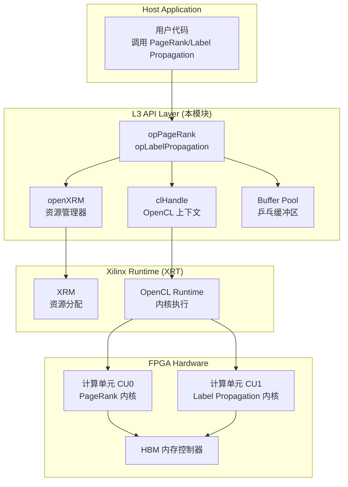

# Ranking and Propagation Operations 模块深度解析

## 一句话概括

本模块是 **FPGA 加速的图算法引擎**，专门处理大规模图数据上的**迭代型排名计算**（PageRank）和**标签传播**（Label Propagation）。它像一位精通并发控制的"交通指挥官"，在多个 FPGA 设备、多个计算单元（CU）之间调度图数据，利用"乒乓缓冲"技术让迭代算法在硬件上高效收敛。

---

## 问题空间：我们为什么需要这个模块？

### 图算法的计算挑战

在现代图 analytics 中，两类算法占据核心地位：

1. **排名算法（如 PageRank）**：计算图中节点的重要性分数，需要迭代执行直到收敛
2. **传播算法（如 Label Propagation）**：通过边传播标签信息，用于社区发现

这些算法在 CPU 上执行时面临严峻挑战：
- **内存带宽瓶颈**：图数据通常 TB 级，随机访问模式导致缓存失效
- **迭代开销大**：每次迭代需要同步，线程协调成本高
- **扩展性受限**：多核 CPU 难以线性扩展这些内存密集型算法

### 为什么选择 FPGA？

FPGA 提供了独特的优势组合：
- **定制化内存层次**：可配置 HBM（高带宽内存）通道，匹配图访问模式
- **流水线并行**：在单个时钟周期内处理多个图边
- **低延迟控制逻辑**：硬件级别的迭代控制，消除操作系统调度开销

### 设计目标

本模块旨在提供：
1. **L3 级高级 API**：隐藏 FPGA 编程复杂性，提供类似 CPU 库的调用接口
2. **多设备/多 CU 扩展**：自动在多个 FPGA 卡和多个计算单元间分配工作
3. **零拷贝数据流**：通过 OpenCL 缓冲区映射，最小化主机-设备数据传输
4. **资源动态管理**：使用 Xilinx XRM（资源管理器）实现计算单元的动态分配和释放

---

## 架构设计：系统的核心抽象

### 整体架构图



### 核心抽象解释

#### 1. **openXRM：硬件资源的外交官**

想象 FPGA 是拥有多个"计算车间"（CUs）的工厂，而 `openXRM` 就是负责调度这些车间的中央调度室。

- **职责**：动态发现可用 FPGA 设备，分配计算单元（CU），管理负载均衡
- **关键操作**：`allocCU()` 请求特定内核的计算资源，`cuRelease()` 归还资源
- **设计哲学**：类似操作系统进程调度，但针对 FPGA 硬件资源池

#### 2. **clHandle：OpenCL 会话的上下文**

`clHandle` 是主机端管理单个 FPGA 设备会话的"控制面板"。

```cpp
struct clHandle {
    cl::Device device;        // 目标 FPGA 设备
    cl::Context context;      // OpenCL 上下文
    cl::CommandQueue q;       // 命令队列（支持异步和性能分析）
    cl::Program program;      // 编译后的 FPGA 比特流
    cl::Kernel kernel;        // 内核实例
    cl::Buffer* buffer;       // 缓冲区数组（HBM/DDR 内存）
    xrmCuResource* resR;      // XRM 资源句柄
    bool isBusy;              // 忙碌状态标志
};
```

**关键设计决策**：
- **Out-of-Order 队列**：`CL_QUEUE_OUT_OF_ORDER_EXEC_MODE_ENABLE` 允许命令并行执行
- **性能分析**：`CL_QUEUE_PROFILING_ENABLE` 支持内核执行时间测量
- **缓冲区池**：预分配 8-9 个缓冲区用于乒乓数据交换

#### 3. **乒乓缓冲区（Ping-Pong Buffers）：迭代算法的双车道**

PageRank 和 Label Propagation 都是**迭代收敛算法**。在 FPGA 上实现这类算法面临一个经典问题：第 $n$ 轮的输出是第 $n+1$ 轮的输入，但硬件流水线需要连续数据流。

**解决方案**：乒乓缓冲（也叫双缓冲）

```
迭代 i:   读 Buffer A → FPGA 计算 → 写 Buffer B
迭代 i+1: 读 Buffer B → FPGA 计算 → 写 Buffer A  
迭代 i+2: 读 Buffer A → FPGA 计算 → 写 Buffer B
...
```

**代码体现**：`buffPing` 和 `buffPong` 在 `opPageRank::postProcess` 中根据 `resultInfo` 标志决定哪个缓冲区包含最终结果。

#### 4. **多 CU/多设备扩展：工厂流水线**

现代 FPGA 卡（如 Alveo U280）有多个 SLR（Super Logic Regions），每个可放置一个计算单元（CU）。本模块通过 `cuPerBoard` 和 `dupNm` 参数实现横向扩展。

**寻址公式**：
```cpp
// 计算目标 handle 的索引
int index = channelID + cuID * dupNm + deviceID * dupNm * cuPerBoard;
clHandle* hds = &handles[index];
```

这就像一个三维坐标系：
- `deviceID`：选择哪个 FPGA 卡（Z轴）
- `cuID`：选择卡上的哪个计算单元（Y轴）
- `channelID`：选择 CU 内的哪个逻辑通道（X轴）
- `dupNm`：每个物理 CU 的复用次数（时间分片）

---

## 子模块概述

本模块包含两个核心算法实现，分别封装在独立的操作类中：

### [op_pagerank 子模块](graph_analytics_and_partitioning-l3_openxrm_algorithm_operations-ranking_and_propagation_operations-op_pagerank.md)

**职责**：实现 PageRank 排名算法的完整 FPGA 加速流程。

**核心组件**：
- `opPageRank` 类：主 API 入口，管理 PageRank 计算生命周期
- `createHandle()`：初始化 OpenCL 资源和 XRM 计算单元
- `loadGraph()`：加载图数据到 FPGA HBM/DDR
- `compute()`：执行单次 PageRank 计算
- `addwork()`：将计算任务加入异步队列
- `postProcess()`：后处理，从乒乓缓冲区提取最终排名值

**关键特性**：
- 支持 `alpha`（阻尼系数）、`tolerance`（收敛阈值）、`maxIter`（最大迭代次数）参数
- 使用 9 个 OpenCL 缓冲区（offsets, indices, weights, degree, const, ping, pong, result, order）
- 乒乓缓冲自动管理，用户无感知
- 支持 DDR 和 HBM 两种内存配置（编译时选择）

### [op_labelpropagation 子模块](graph_analytics_and_partitioning-l3_openxrm_algorithm_operations-ranking_and_propagation_operations-op_labelpropagation.md)

**职责**：实现 Label Propagation 社区发现算法的 FPGA 加速。

**核心组件**：
- `opLabelPropagation` 类：主 API 入口
- `createHandle()`：初始化资源（与 PageRank 类似）
- `bufferInit()`：初始化标签传播专用缓冲区
- `compute()`：执行 Label Propagation 计算
- `addwork()`：异步任务入队

**关键特性**：
- 需要同时提供 CSR 和 CSC 两种图表示（双向边访问）
- 使用 8 个 OpenCL 缓冲区（offsetsCSR, indicesCSR, offsetsCSC, indicesCSC, buffPing, buffPong, labelPing, labelPong）
- 标签数据类型为 `uint32_t`（与 PageRank 的 `float` 不同）
- 支持最大迭代次数参数，实际收敛由 FPGA 内核内部判断
- 同样支持 HBM 和 DDR 两种内存拓扑

---

## 跨模块依赖

本模块位于图分析软件栈的 L3 层（高级 API 层），依赖以下模块：

```
┌─────────────────────────────────────────────────────────────┐
│                    Host Application                         │
├─────────────────────────────────────────────────────────────┤
│  L3 API Layer: ranking_and_propagation_operations (本模块)  │
│  ┌─────────────────┐  ┌─────────────────┐                    │
│  │  opPageRank     │  │ opLabelProp     │                    │
│  └─────────────────┘  └─────────────────┘                    │
├─────────────────────────────────────────────────────────────┤
│  L2 Middleware: graph.L3.openXRM                           │
│  - XRM 资源管理                                            │
│  - 设备发现和枚举                                           │
├─────────────────────────────────────────────────────────────┤
│  L1 Runtime: XRT (Xilinx Runtime)                          │
│  - OpenCL Runtime                                           │
│  - xclbin 加载                                              │
│  - 内存迁移                                                 │
├─────────────────────────────────────────────────────────────┤
│  Hardware: Alveo U50/U200/U280/Versal                      │
│  - FPGA/ACAP 逻辑                                            │
│  - HBM/DDR 内存                                              │
└─────────────────────────────────────────────────────────────┘
```

### 关键依赖说明

1. **XRT (Xilinx Runtime)**
   - 提供 OpenCL 运行时和硬件抽象
   - `xcl::get_xil_devices()`, `xcl::import_binary_file()` 等函数依赖 XRT
   - 所有 `cl::` 类来自 OpenCL/XRT

2. **XRM (Xilinx Resource Manager)**
   - 提供 `openXRM` 类用于 CU 分配
   - `xrmCuResource` 结构定义来自 XRM
   - `xrmCuRelease()` 等函数管理硬件资源生命周期

3. **xf::graph::Graph** (图数据结构)
   - `Graph<uint32_t, float>` 和 `Graph<uint32_t, uint32_t>` 是输入图的标准表示
   - 提供 `offsetsCSR`, `indicesCSR`, `weightsCSR`, `nodeNum`, `edgeNum` 等成员
   - 通常定义在 `graph/L2/include/graph.hpp`

4. **xf::common::utils_sw::Logger** (日志工具)
   - 提供 `logger.logCreateContext()`, `logCreateCommandQueue()` 等函数
   - 用于 OpenCL 对象创建的错误检查和日志记录

---

## 新贡献者指南：需要关注的要点

### 1. **内存对齐的隐形契约**

所有通过 `cl::Buffer` 映射的主机内存**必须**使用 `aligned_alloc` 分配。如果误用 `malloc` 或 `new`：
- **症状**：`enqueueMigrateMemObjects` 返回 `CL_INVALID_VALUE` 或段错误
- **原因**：Xilinx OpenCL 运行时要求主机缓冲区至少页对齐（4KB）
- **修复**：将所有 `malloc(size)` 替换为 `aligned_alloc(4096, size)`

### 2. **HBM 内存通道的拓扑陷阱**

使用 HBM 时，`XCL_MEM_TOPOLOGY` 的索引不是连续的：
```cpp
// 错误：假设通道是 0,1,2,3
mext_in[0] = {(unsigned int)(0) | XCL_MEM_TOPOLOGY, ptr0, 0};
mext_in[1] = {(unsigned int)(1) | XCL_MEM_TOPOLOGY, ptr1, 0}; // 可能错误！

// 正确：查阅硬件手册，U280 的有效通道是 0,2,4,6,...
mext_in[0] = {(unsigned int)(0) | XCL_MEM_TOPOLOGY, ptr0, 0}; // HBM0
mext_in[1] = {(unsigned int)(2) | XCL_MEM_TOPOLOGY, ptr1, 0}; // HBM2
```

**调试技巧**：如果看到 `CL_MEM_OBJECT_ALLOCATION_FAILURE` 或运行时报错 "invalid memory topology"，检查通道号是否与硬件匹配。

### 3. **XRM 资源泄漏的隐蔽性**

`xrmCuResource` 的释放必须**配对**：
```cpp
// 申请
xrmCuResource* resR = (xrmCuResource*)malloc(sizeof(xrmCuResource));
xrm->allocCU(resR, ...);

// 释放（必须成对）
xrmCuRelease(ctx, resR);
free(resR); // 不要忘记释放结构体本身！
```

**常见错误**：只调用 `xrmCuRelease` 但忘记 `free(resR)`，导致内存泄漏；或反过来，先 `free` 再 `xrmCuRelease`，导致 use-after-free。

### 4. **OpenCL 事件链的正确使用**

模块使用 `std::vector<cl::Event>` 构建依赖链：
```cpp
std::vector<cl::Event> events_write(1);
std::vector<cl::Event> events_kernel(num_runs);
std::vector<cl::Event> events_read(1);

// 迁移数据到设备
q.enqueueMigrateMemObjects(ob_in, 0, nullptr, &events_write[0]);
// 内核等待数据迁移完成
q.enqueueTask(kernel0, &events_write, &events_kernel[0]);
// 读回结果等待内核完成
q.enqueueMigrateMemObjects(ob_out, 1, &events_kernel, &events_read[0]);
```

**常见错误**：
- 传递空指针 `nullptr` 作为等待列表，但内核确实需要等待数据就绪
- 事件对象在依赖完成前被销毁（`cl::Event` 是引用计数类型，但裸指针管理容易出错）
- 使用 `cl::UserEvent` 标记完成，但忘记调用 `setStatus(CL_COMPLETE)`

### 5. **迭代算法的收敛检测盲区**

PageRank 内核内部负责检测收敛（基于 `tolerance`），但主机代码需要注意：

```cpp
// 内核返回的 resultInfo 包含两个关键信息：
// resultInfo[0]: 最终数据是否在 Pong 缓冲区（布尔值）
// resultInfo[1]: 实际执行的迭代次数
bool resultinPong = (bool)(*resultInfo);
int iterations = (int)(*(resultInfo + 1));
```

**调试技巧**：如果 PageRank 结果全为零或异常值：
1. 检查 `alpha`（阻尼系数）是否合理（通常为 0.85）
2. 检查 `tolerance` 是否过小（如 1e-10）导致超过 `maxIter`
3. 验证图数据是否正确加载（`offsetsCSR` 和 `indicesCSR` 的一致性）

---

## 总结：模块的核心价值

`ranking_and_propagation_operations` 模块代表了**硬件-软件协同设计**在图 analytics 领域的最佳实践：

1. **抽象层次清晰**：从 OpenCL 事件到图算法语义，每一层都有明确职责
2. **资源管理自动化**：XRM 集成将硬件资源管理从业务逻辑中解耦
3. **性能可移植性**：通过编译时宏（HBM/DDR）和运行时参数（CU 数量），同一套代码适配多种硬件配置
4. **生产级鲁棒性**：详细的错误检查、资源泄漏防护、调试日志（`NDEBUG` 控制）

对于新加入团队的工程师，理解本模块的关键不在于记住每一个 OpenCL 调用，而在于把握**"迭代算法在硬件上的状态机管理"**这一核心思想——乒乓缓冲是状态，事件链是状态转移，而 XRM 是资源状态机。掌握了这一心智模型，阅读代码将成为理解设计而非记忆细节的过程。
