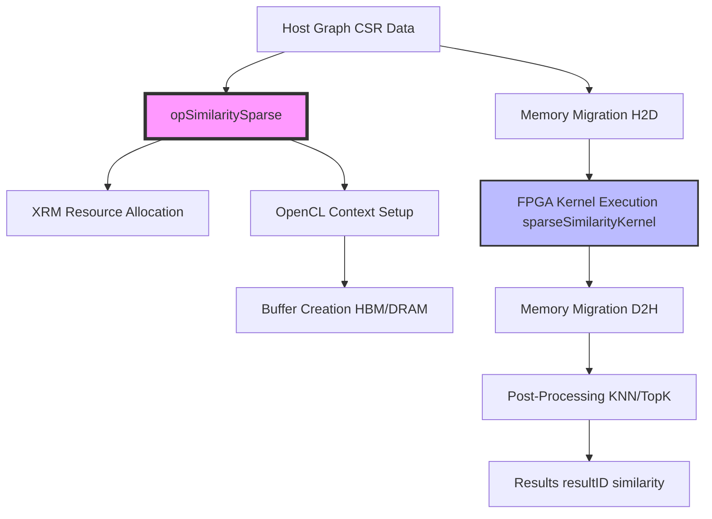

# op_similaritysparse 模块技术深潜

## 一句话概括

`op_similaritysparse` 是 Xilinx 图分析库 L3 层的核心加速模块，负责在 FPGA 上执行**稀疏向量的相似度计算**（如 Cosine、Jaccard 等）。它像一座连接抽象图算法与底层硬件加速的桥梁：上层只需提供 CSR 格式的稀疏图和查询向量，下层则通过 XRM 资源管理、OpenCL 命令队列和流水线式内存迁移，将计算任务分发到 FPGA 的多个计算单元（CU）上并行执行。

## 架构全景：数据如何在模块中流动

想象这个模块是一个**高度自动化的工厂流水线**：

- **原材料入口**（Host 端）：CSR 格式的稀疏图（offsets、indices、weights）和查询向量（sourceIndice、sourceWeight）
- **生产调度室**（XRM + openXRM）：动态申请 FPGA 计算单元（CU），管理多设备、多 CU 的资源分配
- **装配车间**（OpenCL Runtime）：创建 Context、Command Queue、Program、Kernel，设置内存缓冲区
- **运输通道**（Memory Migration）：通过 PCIe 将数据从 Host 内存迁移到 FPGA 的 HBM/DRAM（enqueueMigrateMemObjects）
- **核心加工站**（FPGA Kernel）：执行 `sparseSimilarityKernel`，计算相似度分数
- **成品出口**（Result Readback）：将 top-K 结果（resultID、similarity）迁回 Host 内存



## 核心组件深潜

### 1. `opSimilaritySparse` 类：资源管理与任务编排的中枢

这个类不是一个简单的算法包装，而是一个**硬件资源管理器**和**异构计算调度器**。它维护着跨多个 FPGA 设备、多个 CU 的状态，并提供了从同步到异步的多层次 API。

**核心状态成员：**
- `clHandle* handles`: 每个 CU 对应的 OpenCL 资源句柄（Context、Queue、Kernel、Buffers）
- `uint32_t cuPerBoardSimSparse`: 每个 FPGA 板卡上的 CU 数量
- `uint32_t dupNmSimSparse`: 负载均衡的复制因子（duplication number）
- `std::vector<uint32_t> deviceOffset`: 设备偏移量，用于多设备寻址

**初始化流程（`setHWInfo` + `init`）：**
1. **硬件拓扑感知**：通过 `setHWInfo(numDev, CUmax)` 告知系统有多少设备、多少 CU
2. **资源分配**：`init` 方法通过 `openXRM` 为每个 CU 分配 Xilinx 资源（XRM 的 `allocCU`）
3. **OpenCL 上下文创建**：为每个 CU 创建设备上下文、命令队列（支持 Out-of-Order 执行和性能分析）
4. **XCLBIN 加载**：加载编译好的 FPGA 比特流（`xclbinFile`），创建 Program 和 Kernel 对象
5. **缓冲区预分配**：为每个 CU 预分配 `cl::Buffer` 数组（固定 29 个 buffer 槽位）

**关键设计洞察：**
- **多设备寻址公式**：`handles[channelID + cuID * dupNmSimSparse + deviceID * dupNmSimSparse * cuPerBoardSimSparse]`。这个公式将三维坐标（device, CU, channel）展平为一维数组索引，支持跨多卡的多 CU 并行。
- **负载均衡复制**：`dupNmSimSparse = 100 / requestLoad` 允许用户根据 FPGA 负载百分比动态调整 CU 的复制因子，实现灵活的吞吐控制。

### 2. `loadGraph`：图数据的多 CU 广播与零拷贝共享

稀疏相似度计算需要整个图作为参考数据集（如 KNN 搜索中的已知样本库）。`loadGraph` 的核心挑战是：**如何将大规模 CSR 图高效加载到多个 CU 的 HBM 中，避免重复拷贝和 PCIe 带宽浪费？**

**解决策略——主从复制模式：**
1. **主 CU 加载**：选择一个代表性的 CU（`cuID == 0 && dupID == 0`）作为“主节点”，通过 `loadGraphCoreSimSparse` 执行实际的数据迁移
2. **零拷贝共享**：其他 CU（从节点）通过指针赋值 `handles[j].buffer[3 + i] = handles[cnt].buffer[3 + i]` 直接共享主 CU 的 `cl::Buffer` 对象
3. **线程同步**：使用 `std::packaged_task` 和 `std::future` 确保主 CU 完成数据加载后，从节点才开始复制指针

**内存布局细节：**
- CSR 图被分割为 `splitNum` 个分区（PU - Processing Unit）
- 每个分区包含：`offsets`（行指针）、`indices`（列索引）、`weights`（边权重）
- 使用 `XCL_MEM_TOPOLOGY` 和 `cl_mem_ext_ptr_t` 将缓冲区映射到 FPGA 的特定 HBM 通道（Channel 24 用于输入/输出，Channels 0-23 用于图数据）
- 额外的 `CHANNEL_NUMBER`（4）用于内存对齐和乒乓缓冲

**关键设计洞察：**
- **PCIe 带宽优化**：通过零拷贝共享，N 个 CU 只需要 1 次 PCIe 传输，而不是 N 次，节省 `(N-1) * graph_size` 的带宽
- **HBM 通道分散**：通过 `XCL_MEM_TOPOLOGY` 将图数据分散到多个 HBM 通道（0-23），充分利用 FPGA 的内存带宽，避免单一通道成为瓶颈

### 3. `bufferInit`：参数打包与内核参数映射

`bufferInit` 是 Host 与 FPGA Kernel 之间的**契约定义者**。它将复杂的相似度计算请求（图结构、查询向量、配置参数）转换为 FPGA 可理解的内存缓冲区和内核参数。

**输入参数契约：**
- `similarityType`: 相似度算法类型（Cosine、Jaccard、Dice 等）
- `dataType`: 数据类型（uint32、float 等）
- `topK`: 返回最相似的 K 个结果
- `sourceNUM`: 查询向量的非零元素个数（稀疏表示）
- `sourceIndice/sourceWeight`: 查询向量的 CSR 表示（列索引、权重）
- `config`: 64 字节的配置缓冲区，打包所有控制参数

**缓冲区布局策略（29 个 Buffer 槽位）：**
- `buffer[0]`: 配置缓冲区（64 字节，包含 topK、sourceNUM、similarityType、dataType、各 PU 的起始地址和大小）
- `buffer[1]`: 查询向量索引（sourceIndice）
- `buffer[2]`: 查询向量权重（sourceWeight）
- `buffer[3]` to `buffer[3*splitNm+2]`: 图数据（每 PU 3 个 buffer：offsets、indices、weights）
- `buffer[3*splitNm+3]`: 结果 ID 缓冲区（topK 个 uint32）
- `buffer[3*splitNm+4]`: 相似度分数缓冲区（topK 个 float）

**内核参数映射：**
内核参数按顺序绑定到缓冲区：
- `setArg(0, buffer[0])`: config
- `setArg(1, buffer[1])`: sourceIndice
- `setArg(2, buffer[2])`: sourceWeight
- `setArg(3*k+3/4/5, ...)`: 各 PU 的 offsets/indices/weights
- `setArg(3*splitNm+3/4, ...)`: resultID/similarity

**关键设计洞察：**
- **固定槽位分配**：29 个 buffer 的硬编码上限意味着该模块最多支持 `(29 - 3 - 2) / 3 = 8` 个 PU 分区（实际上代码中通过 `splitNm` 动态计算，但数组大小固定为 29）。这是为了简化索引计算而做的权衡。
- **配置打包**：将所有标量参数打包到 `config[64]` 数组中，减少内核参数数量（OpenCL 内核参数数量有限制），同时提高数据传输效率（批量传输）。

### 4. 计算 API 层：同步与异步的双轨设计

该模块提供了两套 API：**同步 API**（`compute`, `computeKNN`, `computeAP`, `computeAPKNN`）和 **异步 API**（`addwork*`，通过 `createL3` 实现）。这种双轨设计是为了兼顾**易用性**和**系统吞吐**。

**同步 API：直接控制流**
- 适用于单查询、低延迟场景
- 方法内部完成：buffer 初始化 -> 数据迁移(H2D) -> 内核执行 -> 结果迁移(D2H) -> 后处理
- 阻塞等待 `events_read[0].wait()`，确保数据一致性
- 资源清理（`free`）在函数返回前完成

**异步 API：任务队列与事件驱动**
- 适用于高吞吐、批处理场景
- `addwork*` 方法将计算请求封装为 `event<int>`，提交到 `task_queue[0]`
- 底层通过 `createL3` 实现（模板函数，在头文件中定义），自动绑定到 `compute` 等静态方法
- 调用者通过返回的 `event` 对象查询状态或等待完成，实现非阻塞调用

**KNN 特殊处理：后处理流水线**
`computeKNN` 和 `computeAPKNN` 在 FPGA 计算完成后，增加了 **CPU 端的后处理**（`postProcessKNN`）：
- 基于 `knownLabels`（已知样本的标签）和 FPGA 返回的 `resultID`（最近邻索引），进行**多数投票（Majority Voting）**
- 使用 `std::unordered_map` 统计每个标签的出现频率，选择票数最高的标签作为预测结果 `label[0]`
- 这体现了**异构计算**的典型模式：FPGA 负责密集计算（相似度计算、Top-K 排序），CPU 负责复杂逻辑（标签映射、决策融合）

## 依赖关系与数据契约

### 上游依赖（谁调用我，他们期望什么）

1. **L3 层调度器 / 应用层**
   - 调用 `addwork*` 或 `compute*` 方法
   - 提供 `xf::graph::Graph<uint32_t, float>` 对象（CSR 图）
   - 提供查询向量（`sourceIndice`, `sourceWeight`）
   - 期望返回：Top-K 相似节点 ID 和分数，或 KNN 分类标签

2. **openXRM 资源管理器**
   - 通过 `xrm->allocCU` 动态分配 FPGA 计算单元
   - 提供 `xrmContext` 和 `xrmCuResource` 用于资源管理
   - 模块依赖 XRM 实现多租户、多任务共享 FPGA 资源

3. **XRT/OpenCL 运行时**
   - 依赖 `cl::Device`, `cl::Context`, `cl::CommandQueue`, `cl::Kernel`, `cl::Buffer`
   - 使用 Xilinx 扩展：`cl_mem_ext_ptr_t`, `XCL_MEM_TOPOLOGY` 用于 HBM 通道绑定
   - 依赖 `xcl::get_xil_devices`, `xcl::import_binary_file` 等 Xilinx 工具函数

### 下游依赖（我调用谁，他们保证什么）

1. **FPGA Kernel (`sparseSimilarityKernel`)**
   - 契约：内核必须接受特定顺序的参数（config, sourceIndice, sourceWeight, 各 PU 的 offsets/indices/weights, resultID, similarity）
   - 期望内核执行稀疏相似度计算（Cosine/Jaccard 等），并返回 Top-K 结果
   - 内核必须支持 Out-of-Order 执行（因为命令队列设置了 `CL_QUEUE_OUT_OF_ORDER_EXEC_MODE_ENABLE`）

2. **xf::graph::Graph 数据结构**
   - 契约：图必须提供 `splitNum`（分区数）、`numVerticesPU`/`numEdgesPU`（各 PU 顶点/边数）、`offsetsSplitted`/`indicesSplitted`/`weightsSplitted`（分区的 CSR 数组）
   - 图数据必须保持生命周期，直到 FPGA 计算完成（因为 `cl::Buffer` 使用 `CL_MEM_USE_HOST_PTR`，指向 Host 内存）

### 数据契约与隐式约束

1. **内存对齐与页锁定**
   - 所有 Host 端缓冲区必须使用 `aligned_alloc`（页对齐），因为 `CL_MEM_USE_HOST_PTR` 要求 Host 指针页对齐
   - `config` 缓冲区固定为 64 字节（`aligned_alloc<uint32_t>(64)`），这是 FPGA 内核期望的配置缓存行大小

2. **Buffer 槽位约定**
   - `handles[i].buffer` 是长度为 29 的固定数组，各槽位有严格语义：
     - 0: config
     - 1: sourceIndice
     - 2: sourceWeight
     - 3 to 3*splitNm+2: 各 PU 的 CSR 数据（offsets, indices, weights）
     - 3*splitNm+3: resultID
     - 3*splitNm+4: similarity
   - 这个硬编码布局限制了最大 PU 数为 8（因为 3 + 3*8 + 2 = 29），但换来了无分支的索引计算

3. **XRM 资源生命周期**
   - `xrmCuResource` 在 `createHandle` 中分配，在 `freeSimSparse` 或 `cuRelease` 中释放
   - 释放时必须重试直到成功（`while (!xrmCuRelease(ctx, resR))`），确保资源不泄漏

4. **线程安全假设**
   - `loadGraph` 使用 `std::thread` 和 `std::future` 实现多线程加载，但主要逻辑是：一个线程实际传输数据，其他线程共享 buffer 指针
   - `freeSimSparse` 调用 `simSparseThread.join()`，暗示有一个后台线程（可能在初始化时启动）需要优雅退出
   - **非线程安全警告**：`compute*` 方法修改 `hds->isBusy` 状态，但没有显式锁。如果多个线程同时调用同一个 CU 的 `compute`，会导致竞态条件。设计上假设调用者负责 CU 级别的并发控制，或者每个线程使用不同的 `channelID/cuID/deviceID`

## 设计决策与权衡

### 1. 手动内存管理 vs. RAII 智能指针

**决策**：模块广泛使用原始指针（`new`, `malloc`, `aligned_alloc`）和手动 `delete`/`free`，而不是 `std::unique_ptr` 或 `std::shared_ptr`。

**理由**：
- **OpenCL 互操作性**：`cl::Buffer` 的构造函数需要 `context` 和 `cl_mem_flags`，而 `cl::Buffer` 本身遵循 RAII（析构时自动 `clReleaseMemObject`），但 Host 端的指针（`config`, `resultID` 等）需要页对齐，且生命周期必须与 FPGA 计算重叠。使用原始指针可以精确控制 `aligned_alloc` 和 `free` 的时机。
- **性能**：避免智能指针的引用计数开销（虽然 `unique_ptr` 无开销，但 `shared_ptr` 有原子操作）。在 FPGA 加速场景，Host 端开销已被 PCIe 传输掩盖，但代码风格保持与底层 C OpenCL API 一致。
- **C 兼容性**：部分底层 API（XRM、XRT）是 C 接口，使用 `malloc`/`free` 保持风格一致。

**权衡与风险**：
- **泄漏风险**：`computeAP` 等方法中有多个 `aligned_alloc`，如果中间出错（如 `bufferInit` 异常），之前的分配可能泄漏。虽然代码中 `free` 放在流程末尾，但 C++ 异常安全是 **基本保证**（Basic Guarantee），不是强保证。
- **所有权模糊**：`loadGraph` 中，主 CU 的 buffer 被从 CU 共享指针，但没有引用计数，如果主 CU 被销毁，从 CU 的 buffer 成为悬空指针。设计上假设所有 CU 生命周期一致，由 `freeSimSparse` 统一释放。

### 2. 同步 API vs. 异步 API 的双轨设计

**决策**：同时提供阻塞式 `compute*` 方法和非阻塞式 `addwork*` 方法（返回 `event<int>`）。

**理由**：
- **分层架构**：L3 层作为中间件，需要同时服务两种上层用户：
  - **算法开发者**：需要简单的阻塞调用，像调用普通函数一样 `compute(...)`，不关心事件循环
  - **系统级开发者**：需要构建流水线，将多个相似度查询排队，最大化 FPGA 利用率，通过 `addwork` 实现重叠的 H2D 传输、计算、D2H 回传
- **资源利用率**：FPGA 是昂贵资源，异步 API 允许 Host 在 FPGA 计算时准备下一个查询的数据（双缓冲或流水线），隐藏传输延迟。

**权衡与风险**：
- **API 表面翻倍**：维护成本增加，需要确保 `compute` 和 `addwork` 行为一致。
- **生命周期复杂性**：异步 API 要求调用者保持输入数据（`sourceIndice`、`Graph` 等）直到 `event` 完成，否则 FPGA 可能读取已释放的 Host 内存（因为 `CL_MEM_USE_HOST_PTR` 零拷贝）。`compute` 是阻塞的，所以内部 `free` 是安全的；但 `addwork` 返回后数据不能立即释放。

### 3. 图分区与零拷贝共享策略

**决策**：支持将大图分割为多个 PU（Processing Unit），并在多 CU 间通过指针赋值实现 Buffer 共享，而非每个 CU 独立复制数据。

**理由**：
- **HBM 容量限制**：FPGA 的 HBM 容量有限（如 8GB），大图可能超过单 CU 的本地内存，必须分区存储。
- **PCIe 带宽瓶颈**：如果 8 个 CU 各自独立加载 1GB 图数据，需要 8GB 的 PCIe 传输；通过零拷贝共享，只需传输 1GB，节省 87.5% 的传输带宽。
- **内核设计匹配**：FPGA 内核 `sparseSimilarityKernel` 设计为支持多 PU，通过参数传入各 PU 的基址和大小，顺序或并行访问不同 PU 的数据。

**权衡与风险**：
- **访问冲突**：如果多个 CU 同时读取同一个 HBM 通道（虽然不同地址），可能引发 Bank Conflict，降低 HBM 有效带宽。通过 `XCL_MEM_TOPOLOGY` 将不同 PU 映射到不同 HBM 通道（0-23）可以缓解，但增加了物理布局的复杂性。
- **NUMA 效应**：Host 端如果图数据在 NUMA 节点的内存中，而 FPGA 通过特定 socket 的 PCIe 连接，远程内存访问会慢。需要调用者确保图数据在正确的 NUMA 节点上分配（使用 `numactl` 或 `hwloc`）。

## 使用指南与示例

### 基础使用模式（同步 API）

```cpp
#include "op_similaritysparse.hpp"
#include "xf_graph_L3.hpp"

// 1. 初始化资源管理器
xf::graph::L3::openXRM xrm;
xrmContext* ctx = xrmCreateContext();

// 2. 创建相似度计算操作对象
xf::graph::L3::opSimilaritySparse sparseSim;

// 3. 设置硬件信息（2 个设备，16 个 CU）
sparseSim.setHWInfo(2, 16);

// 4. 初始化（加载 xclbin，创建 OpenCL 上下文）
std::string xclbin = "graph_sparseSim.xclbin";
uint32_t deviceIDs[16] = {0,0,0,0,0,0,0,0, 1,1,1,1,1,1,1,1};
uint32_t cuIDs[16] = {0,1,2,3,4,5,6,7, 0,1,2,3,4,5,6,7};
sparseSim.init(&xrm, "sparseSimilarityKernel", "sparseSim", xclbin, 
               deviceIDs, cuIDs, 50); // requestLoad=50%

// 5. 加载图数据（CSR 格式）
xf::graph::Graph<uint32_t, float> g;
// ... 填充 g（从文件读取或构造 CSR）
sparseSim.loadGraph(g);

// 6. 准备查询向量（稀疏表示）
uint32_t sourceNUM = 10;
uint32_t sourceIndice[10] = {5, 18, 23, 45, 67, 89, 102, 145, 200, 345};
uint32_t sourceWeight[10] = {100, 200, 150, 300, 250, 400, 180, 220, 350, 280};
uint32_t topK = 5;

// 7. 执行相似度计算
uint32_t resultID[5];
float similarity[5];
int ret = sparseSim.compute(0, 0, 0, // deviceID, cuID, channelID
                            ctx, nullptr, "sparseSim",
                            sparseSim.handles, // 注意：实际应为内部 handles
                            0, // similarityType (0=Cosine)
                            0, // dataType (0=uint32)
                            sourceNUM, sourceIndice, sourceWeight,
                            topK, g, resultID, similarity);

// 8. 清理资源
sparseSim.freeSimSparse(ctx);
xrmDestroyContext(ctx);
```

### 异步批处理模式（异步 API）

```cpp
// 适用于高吞吐场景：同时提交多个查询，流水线执行
std::vector<event<int>> events;

for (int i = 0; i < batchSize; i++) {
    // 准备第 i 个查询的数据（注意：这些数组必须在事件完成后才能释放！）
    uint32_t* sInd = new uint32_t[sourceNum[i]];
    uint32_t* sWgt = new uint32_t[sourceNum[i]];
    // ... 填充数据
    
    event<int> ev = sparseSim.addwork(
        0, // similarityType
        0, // dataType
        sourceNum[i],
        sInd, sWgt,
        topK,
        g,
        resultID[i],
        similarity[i]
    );
    events.push_back(ev);
}

// 等待所有查询完成
for (auto& ev : events) {
    int status = ev.get(); // 阻塞等待并获取返回码
    if (status != 0) {
        // 处理错误
    }
}

// 注意：此时才能安全地删除 sInd, sWgt 等数组！
```

## 边缘情况与陷阱警示

### 1. **内存生命周期陷阱（最常见错误）**

**危险代码：**
```cpp
void dangerousCall() {
    uint32_t sourceIndice[100] = {...}; // 栈数组
    uint32_t sourceWeight[100] = {...};
    
    event<int> ev = sparseSim.addwork(..., sourceIndice, sourceWeight, ...);
    // 函数返回，栈数组被销毁！
    // 当 FPGA 实际开始执行时，sourceIndice 指向无效内存！
}
```

**正确做法：**
- 使用 `aligned_alloc` 在堆上分配，并在 `event.get()` 返回后（或 `compute` 返回后）才 `free`
- 或者使用 `std::vector` 并确保其生命周期延续到事件完成（注意 `data()` 返回的指针在 `vector` resize 时可能失效）

### 2. **图数据分区越界**

`loadGraphCoreSimSparse` 假设 `g.splitNum` 与 FPGA 内核期望的 PU 数量匹配。如果 `splitNum` 过大（如 > 8），会尝试访问 `buffer[3*i+3]` 超出 29 个槽位，导致未定义行为。

**防御：** 在调用 `loadGraph` 前，验证 `g.splitNum <= 8`（或根据实际 FPGA 镜像支持的 PU 数调整）。

### 3. **XRM 资源泄漏**

如果 `init` 成功但程序在 `freeSimSparse` 前崩溃，XRM 的 CU 资源可能未释放，导致后续进程无法分配 CU。

**建议：** 使用 RAII 包装 `opSimilaritySparse`，在析构函数中确保调用 `freeSimSparse`，即使发生异常。

### 4. **NUMA 与 PCIe 亲和性**

如果系统有多个 NUMA 节点，而 FPGA 插在特定 socket 上，使用另一 socket 的 CPU 内存会导致跨 NUMA 访问，降低 H2D 传输速率。

**优化：** 使用 `numactl --membind=<node>` 运行程序，确保图数据和查询向量在 FPGA 所在 NUMA 节点的内存中分配。

### 5. **KNN 后处理的标签一致性**

`postProcessKNN` 使用 `std::unordered_map` 统计标签，但没有处理**平票**情况。如果两个标签票数相同，取决于 `unordered_map` 的遍历顺序，结果可能不确定。

**注意：** 对于确定性要求高的应用，应修改后处理逻辑，增加平票时的确定性规则（如选择 ID 最小的标签）。

## 参考资料与相关模块

- **XRM 资源管理**: [openXRM](graph_analytics_and_partitioning-l3_openxrm_algorithm_operations-similarity_and_twohop_operations-openxrm.md) - 理解 CU 分配和资源释放机制
- **稠密相似度**: [op_similaritydense](graph_analytics_and_partitioning-l3_openxrm_algorithm_operations-similarity_and_twohop_operations-op_similaritydense.md) - 对比稠密向量的相似度计算实现
- **图数据结构**: `xf::graph::Graph` - CSR 图的定义和分区策略
- **FPGA 内核**: `sparseSimilarityKernel` - 实际的相似度计算硬件实现（本模块的下游依赖）
- **L3 层基础**: `createL3` 模板函数 - 理解异步 `addwork` 的底层实现机制
