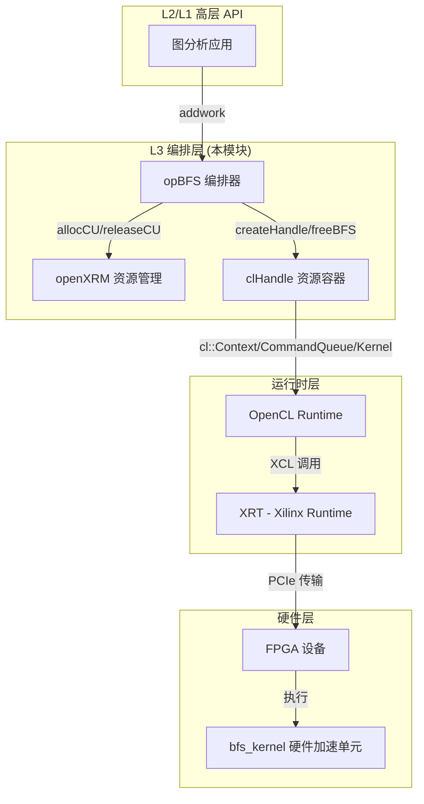

# bfs_operations 模块技术深度解析

## 一句话概括

`bfs_operations` 是 Xilinx 图分析库 L3 层的**广度优先搜索（BFS）编排器**，它将高层图算法 API 与底层 FPGA 硬件加速内核桥接起来，负责管理异构计算资源（FPGA 设备）、OpenCL 上下文、设备内存缓冲区以及内核执行的生命周期。

想象它像一个**机场塔台调度系统**：飞行员（上层应用）只需要说"我要从 A 飞到 B"，塔台（bfs_operations）负责协调跑道（FPGA 设备）、燃油（内存缓冲区）、起飞顺序（任务队列）以及与地面控制（XRM 资源管理器）的所有通信细节。

---

## 架构概览

### 模块定位



### 核心组件职责

| 组件 | 角色类比 | 核心职责 |
|------|----------|----------|
| `opBFS` | 乐团指挥 | 协调多个 CU（计算单元）的并发执行，管理任务队列，处理多设备拓扑 |
| `openXRM` | 酒店前台 | 通过 Xilinx 资源管理器（XRM）分配/释放 FPGA 计算单元（CU），处理资源预留 |
| `clHandle` | 行李箱 | 封装单个 CU 的所有 OpenCL 资源：设备上下文、命令队列、程序、内核实例、缓冲区数组 |
| `cl::Buffer` | 货运集装箱 | 表示 FPGA 设备内存中的缓冲区，通过扩展内存指针（XCL_MEM_TOPOLOGY）映射到特定 DDR bank |

---

## 数据流深度解析：一次 BFS 计算的完整旅程

让我们追踪一次 BFS 计算的完整生命周期，从上层 API 调用到 FPGA 硬件执行，再到结果返回。

### 阶段 1：任务提交（异步入口）

```cpp
// 上层应用调用
uint32_t sourceID = 0;  // 起始顶点
xf::graph::Graph<uint32_t, uint32_t> g = /* ... */;  // CSR 格式图
uint32_t* predecent = /* ... */;  // 前驱节点数组（输出）
uint32_t* distance = /* ... */;   // 距离数组（输出）

// 提交任务到内部队列
event<int> ev = opBFSInstance.addwork(sourceID, g, predecent, distance);
```

**设计意图**：`addwork` 是**异步非阻塞**接口，立即返回一个 `event<int>` 对象（类似于 std::future）。这使得上层应用可以批量提交多个 BFS 任务，实现流水线并行，而无需等待每个任务完成。

### 阶段 2：任务分发与 CU 选择（init → compute）

`addwork` 内部调用 `createL3`（代码中简写为 L3 层创建函数），将任务绑定到具体的 `compute` 方法：

```cpp
event<int> opBFS::addwork(...) {
    return createL3(task_queue[0], &(compute), handles, sourceID, g, predecent, distance);
}
```

这里的关键是 `handles` 数组——它是一个 **CU 池**，大小为 `maxCU`（最大计算单元数）。每个 `handles[i]` 代表一个可独立执行 BFS 的硬件上下文。

**CU 寻址计算**（关键理解点）：

```cpp
// compute 方法中的 CU 选择逻辑
clHandle* hds = &handles[
    channelID + 
    cuID * dupNmBFS + 
    deviceID * dupNmBFS * cuPerBoardBFS
];
```

这是一个**三维寻址方案**：
- `deviceID`：物理 FPGA 设备索引（支持多卡）
- `cuID`：单个设备内的计算单元索引
- `channelID`：虚拟通道（用于负载均衡，通过 `dupNmBFS` 因子计算）

类比：这就像一个有多个楼层（device）、每层多个房间（CU）、每个房间多个工位（channel）的办公大楼，系统根据负载自动分配一个具体工位给任务。

### 阶段 3：设备内存初始化与缓冲区映射（bufferInit）

`compute` 方法首先调用 `bufferInit`，这是整个模块**最复杂的内存管理逻辑**。

**输入数据**：图数据以 CSR（Compressed Sparse Row）格式存储：
- `g.offsetsCSR`：顶点偏移数组（大小：numVertices + 1）
- `g.indicesCSR`：边索引数组（大小：numEdges）

**扩展内存指针（XCL_MEM_TOPOLOGY）**：

```cpp
std::vector<cl_mem_ext_ptr_t> mext_in = std::vector<cl_mem_ext_ptr_t>(7);
mext_in[0] = {(unsigned int)(3) | XCL_MEM_TOPOLOGY, g.offsetsCSR, kernel0()};
mext_in[1] = {(unsigned int)(2) | XCL_MEM_TOPOLOGY, g.indicesCSR, kernel0()};
// ... 其他缓冲区
```

**关键设计**：`XCL_MEM_TOPOLOGY` 是 Xilinx 特定的扩展，用于指定缓冲区应映射到 FPGA 设备的哪个 DDR bank。这里的 flags（如 `(3) | XCL_MEM_TOPOLOGY`）编码了特定的内存拓扑信息，确保数据放置在硬件内核可以高效访问的物理位置。

**零拷贝（Zero-Copy）策略**：

```cpp
hds[0].buffer[0] = cl::Buffer(
    context, 
    CL_MEM_EXT_PTR_XILINX | CL_MEM_USE_HOST_PTR | CL_MEM_READ_WRITE,
    sizeof(uint32_t) * (numVertices + 1), 
    &mext_in[0]
);
```

使用 `CL_MEM_USE_HOST_PTR` 标志，意味着设备缓冲区直接**映射**主机内存（通过 PCIe BAR 空间），而非显式拷贝。这实现了零拷贝数据传输——主机写入的数据对设备立即可见（在缓存一致性同步后），反之亦然。

**输出缓冲区说明**：

```cpp
ob_in.push_back(hds[0].buffer[0]);   // offsets (CSR)
ob_in.push_back(hds[0].buffer[1]);   // indices (CSR)
ob_out.push_back(hds[0].buffer[5]);  // predecent (前驱)
ob_out.push_back(hds[0].buffer[6]);  // distance (距离)
```

输入缓冲区（`ob_in`）包含静态图结构，输出缓冲区（`ob_out`）包含 BFS 计算结果（每个顶点的前驱节点和到源点的距离）。

### 阶段 4：数据传输与内核执行（migrateMemObj → cuExecute）

**主机到设备传输（H2D）**：

```cpp
migrateMemObj(hds, 0, num_runs, ob_in, nullptr, &events_write[0]);
```

- `type=0` 表示 H2D 迁移（主机到设备）
- 异步执行，立即返回，事件 `events_write[0]` 标记完成

**内核启动**：

```cpp
cuExecute(hds, kernel0, num_runs, &events_write, &events_kernel[0]);
```

内部调用 `enqueueTask`，这是一个**有序任务**（而非 `enqueueNDRangeKernel` 的数据并行内核），意味着 FPGA 上的硬件状态机按顺序处理工作项——这对于 BFS 的图遍历逻辑是合适的，因为硬件内核内部实现了自己的并行调度策略。

**关键：依赖链建立**

```cpp
hds[0].q.enqueueTask(kernel0, evIn, evOut);
```

`evIn`（写入完成事件）作为依赖，`evOut`（内核完成）作为下游依赖。这形成了一个**隐式依赖图**：H2D 迁移 → 内核执行 → D2H 回传。

**设备到主机回传（D2H）**：

```cpp
migrateMemObj(hds, 1, num_runs, ob_out, &events_kernel, &events_read[0]);
events_read[0].wait();
```

- `type=1` 表示 D2H 迁移（设备到主机）
- 等待 `events_kernel`（内核完成）作为前置条件
- 最后 `wait()` 阻塞直到结果数据到达主机内存

### 阶段 5：资源释放与状态重置

```cpp
hds->isBusy = false;
free(queue);
free(discovery);
free(finish);
```

- `isBusy` 标记重置为 `false`，表示该 CU 可以接收新任务
- 释放临时分配的辅助数组（这些不是设备缓冲区，是主机上的工作内存）

---

## 核心组件深度剖析

### `opBFS`：BFS 编排器主类

**静态成员与类级配置**：

```cpp
uint32_t opBFS::cuPerBoardBFS;    // 每块 FPGA 板的 CU 数量
uint32_t opBFS::dupNmBFS;         // 通道重复因子（用于负载均衡）
```

这些静态成员在 `init` 时根据硬件配置和请求负载计算得出。`dupNmBFS` 的设计是一个**负载均衡策略**：通过将每个物理 CU 虚拟化为多个逻辑通道（`dupNmBFS = 100 / requestLoad`），允许更细粒度的任务分配。

**CU 地址空间三维寻址详解**：

理解 `handles` 数组的布局是关键：

```
handles 数组索引 = channelID + cuID * dupNmBFS + deviceID * dupNmBFS * cuPerBoardBFS

布局可视化（假设：2 设备，每设备 2 CU，dupNmBFS=2）：

设备 0 (deviceID=0):
  CU 0 (cuID=0):
    通道 0 (channelID=0): handles[0]
    通道 1 (channelID=1): handles[1]
  CU 1 (cuID=1):
    通道 0 (channelID=0): handles[2]
    通道 1 (channelID=1): handles[3]

设备 1 (deviceID=1):
  CU 0 (cuID=0):
    通道 0 (channelID=0): handles[4]
    通道 1 (channelID=1): handles[5]
  CU 1 (cuID=1):
    通道 0 (channelID=0): handles[6]
    通道 1 (channelID=1): handles[7]
```

这种设计允许：
1. **设备级并行**：跨多个 FPGA 卡分布工作负载
2. **CU 级并行**：单个设备内的多个独立计算单元
3. **细粒度负载均衡**：通过 `dupNmBFS` 将物理 CU 虚拟化为多个逻辑槽位

**异步执行模型**：

`addwork` 方法使用 `createL3` 将任务提交到内部 `task_queue`，并返回 `event<int>`。这是一个**期约（promise/future）模式**的实现，允许调用者：
1. 立即获得一个可等待的句柄
2. 继续提交更多任务而不阻塞
3. 稍后等待特定事件完成或批量等待

这种设计对于**吞吐量优化**至关重要：当 FPGA 在执行当前 BFS 遍历时，主机可以准备下一个图的输入数据，形成流水线并行。

### `clHandle`：OpenCL 资源生命周期容器

虽然 `clHandle` 的定义未在提供的代码片段中显示，但从使用模式可以推断其结构：

```cpp
struct clHandle {
    // OpenCL 核心对象
    cl::Device device;           // FPGA 设备句柄
    cl::Context context;         // OpenCL 上下文（管理所有资源）
    cl::CommandQueue q;          // 命令队列（顺序执行引擎）
    cl::Program program;         // 已加载的二进制程序
    cl::Kernel kernel;           // 内核实例（可执行对象）
    
    // 内存管理
    cl::Buffer* buffer;          // 设备缓冲区数组（大小为 7）
    
    // 资源管理元数据
    int deviceID;              // 逻辑设备 ID
    int cuID;                  // 计算单元 ID
    int dupID;                 // 虚拟通道/副本 ID
    bool isBusy;               // 忙闲状态标记
    xrmCuResource* resR;       // XRM 资源句柄（用于释放）
};
```

**RAII 策略分析**：

`clHandle` 本身**不遵循严格的 RAII**——内存通过 `new cl::Buffer[bufferNm]` 分配，但释放被推迟到 `freeBFS` 方法显式调用。这是一个**延迟清理**策略，因为：
1. FPGA 计算可能跨越多个任务批次
2. 频繁分配/释放设备内存会带来巨大开销（PCIe 同步成本）
3. 资源在 `init` 时统一分配，在模块生命周期结束时统一释放

### 内存管理：扩展内存指针与零拷贝架构

`bufferInit` 方法是理解本模块内存模型的关键。它展示了**主机端与设备端内存一致性**的高级策略。

**XCL_MEM_TOPOLOGY 详解**：

FPGA 设备通常有多个 DDR/HBM bank（例如 DDR[0], DDR[1], DDR[2], DDR[3]）。`XCL_MEM_TOPOLOGY` 配合特定的 bank ID（如 `(unsigned int)(3)` 表示 DDR[3]）允许开发者**显式控制数据放置**。

```cpp
// 将 g.offsetsCSR 放置到 DDR[3] bank
mext_in[0] = {(unsigned int)(3) | XCL_MEM_TOPOLOGY, g.offsetsCSR, kernel0()};

// 将 g.indicesCSR 放置到 DDR[2] bank
mext_in[1] = {(unsigned int)(2) | XCL_MEM_TOPOLOGY, g.indicesCSR, kernel0()};
```

**为何需要显式 bank 分配？**

1. **带宽最大化**：将不同的数据结构（如 offsets 和 indices）放置到不同 bank，允许并行访问，避免 bank 冲突
2. **硬件内核要求**：FPGA 硬件内核在编译时就固定了每个参数期望的 bank 位置，主机端必须匹配
3. **延迟隐藏**：通过预取到特定 bank，与计算流水线重叠

**零拷贝（Zero-Copy）机制**：

```cpp
hds[0].buffer[0] = cl::Buffer(
    context, 
    CL_MEM_EXT_PTR_XILINX | CL_MEM_USE_HOST_PTR | CL_MEM_READ_WRITE,
    sizeof(uint32_t) * (numVertices + 1), 
    &mext_in[0]
);
```

`CL_MEM_USE_HOST_PTR` 是零拷贝的核心：
- **传统拷贝模式**：`CL_MEM_COPY_HOST_PTR` 会在设备内存分配新空间，然后将主机数据复制过去（两次内存占用，一次 PCIe 拷贝）
- **零拷贝模式**：`CL_MEM_USE_HOST_PTR` 直接将主机页锁定（page-locked/pinned）内存映射到设备地址空间，FPGA 通过 PCIe BAR 直接访问主机内存

**代价与限制**：
1. **页锁定要求**：主机内存必须对齐（使用 `aligned_alloc`）且页锁定，否则 PCIe DMA 会失败
2. **带宽限制**：零拷贝通过 PCIe 访问主机内存，带宽低于访问片上 HBM/DDR
3. **缓存一致性**：需要显式 `migrateMemObj` 或缓存刷新确保一致性

### 执行流水线：三级迁移模型

```cpp
// 阶段 1：主机到设备（H2D）迁移输入数据
migrateMemObj(hds, 0, num_runs, ob_in, nullptr, &events_write[0]);

// 阶段 2：执行内核（依赖写入完成）
cuExecute(hds, kernel0, num_runs, &events_write, &events_kernel[0]);

// 阶段 3：设备到主机（D2H）迁移结果
migrateMemObj(hds, 1, num_runs, ob_out, &events_kernel, &events_read[0]);

// 阻塞等待结果
events_read[0].wait();
```

这是一个标准的 **H2D → Compute → D2H** 流水线，通过 OpenCL 事件（`cl::Event`）建立依赖图：

```
写入事件 (events_write) ──┐
                          ↓
内核事件 (events_kernel) ← 依赖写入完成
                          ↓
读取事件 (events_read)   ← 依赖内核完成
```

**为何使用 enqueueTask 而非 enqueueNDRangeKernel？**

```cpp
hds[0].q.enqueueTask(kernel0, evIn, evOut);
```

`enqueueTask` 启动一个**单工作项内核**（single-work-item kernel），这与传统 GPU 编程中的 `NDRange`（N 维范围，大规模数据并行）截然不同。对于 FPGA 图遍历内核：
1. **状态机驱动**：硬件内核内部实现了复杂的状态机，处理图的遍历逻辑（队列管理、访问标记、层级扩展）
2. **细粒度流水线**：利用 FPGA 的可重构性，内核在边和顶点级别实现流水线并行，而非数据并行
3. **单任务语义**：每个 BFS 遍历是一个完整的"任务"，内核一直执行直到遍历完成（队列为空），自然适合 `enqueueTask` 的语义

---

## 依赖分析与架构角色

### 上游依赖（谁调用本模块）

本模块位于 `graph_analytics_and_partitioning` → `l3_openxrm_algorithm_operations` → `traversal_and_connectivity_operations` → `traversal_and_shortest_path_operations` 层级。典型调用者包括：

1. **L2 层图算法封装**：提供更高级的 API（如 `bfs_levelwise`、`bfs_tree`），隐藏设备管理和任务调度细节
2. **图分析应用**：直接调用以获取最大控制灵活性（如需要自定义数据源或结果后处理）

### 下游依赖（本模块调用谁）

| 依赖组件 | 角色 | 调用场景 |
|---------|------|----------|
| `openXRM` | Xilinx 资源管理器 | `createHandle` 中分配 CU；`freeBFS` 中释放 CU |
| OpenCL Runtime | 异构计算标准 API | 所有 `cl::` 对象操作（Context、CommandQueue、Buffer、Kernel） |
| XRT (Xilinx Runtime) | FPGA 驱动层 | `xcl::get_xil_devices`、`xcl::import_binary_file` 等设备级操作 |
| `xf::graph::Graph` | 图数据结构 | `compute` 和 `bufferInit` 中访问 CSR 格式图数据 |
| `xf::common::utils_sw::Logger` | 日志工具 | `createHandle` 中记录 OpenCL 对象创建状态 |

### 数据契约（隐式接口合同）

**输入图数据（CSR 格式）**：
- `g.offsetsCSR`：长度为 `numVertices + 1` 的 `uint32_t` 数组，CSR 行指针
- `g.indicesCSR`：长度为 `numEdges` 的 `uint32_t` 数组，CSR 列索引
- `g.nodeNum`：顶点数（`numVertices`）
- `g.edgeNum`：边数（`numEdges`）

**输出缓冲区要求**：
- `predecent`：长度至少 `((numVertices + 15) / 16) * 16`（对齐到 16），存储 BFS 树的前驱节点
- `distance`：同上长度，存储到源点的距离（层级）

**内存对齐要求**：
- 所有主机指针必须通过 `aligned_alloc` 分配，确保至少 4KB 对齐（Xilinx FPGA 要求）

---

## 设计决策与权衡

### 1. 显式资源管理 vs. RAII 自动管理

**观察到的设计**：`clHandle` 中的资源（`cl::Buffer*` 数组、`xrmCuResource*`）使用原始指针，通过 `new` 在 `init` 中分配，通过显式 `freeBFS` 方法释放。

**权衡分析**：
- **选择的策略**：延迟批量释放（Delayed Bulk Release）
- **优点**：
  - **性能**：避免每次 BFS 调用都进行昂贵的 FPGA 内存分配/释放（涉及 PCIe 事务和页表更新）
  - **确定性**：资源在模块初始化时一次性分配，运行时只有数据传输，无分配抖动
  - **硬件亲和**：FPGA 缓冲区与特定内核绑定，保持映射关系有利于缓存预热
- **代价**：
  - **内存占用**：在整个模块生命周期内持有 FPGA 内存，即使空闲时也不释放
  - **泄漏风险**：如果 `freeBFS` 未被调用（如异常路径），资源泄漏
  - **灵活性**：无法在运行时动态调整缓冲区大小（必须预先知道最大图规模）

**为什么不使用 `unique_ptr` 或 `shared_ptr`**：
这些智能指针管理的是**主机内存**的生命周期，但 `cl::Buffer` 实际代表的是**设备内存**中的对象。当 `cl::Buffer` 被销毁时，OpenCL 运行时会尝试释放设备内存——这在 FPGA 场景中可能涉及复杂的同步和硬件状态清理。显式管理允许在已知的安全点（`freeBFS`）统一处理这些清理，而不是依赖 C++ 的析构顺序。

### 2. 同步 vs. 异步执行模型

**观察到的设计**：`addwork` 是异步的（返回 `event`），但 `compute` 内部使用 `events_read[0].wait()` 进行同步等待。

**分层策略**：
- **L3 层（本模块）**：提供**同步原语**（`compute` 阻塞直到完成），简化状态管理
- **L2/L1 层（上层）**：通过 `addwork` 和 `event` 实现**异步流水线**，可批量提交多个 BFS 任务到不同 CU

**权衡**：
- **优点**：分离关注点——下层专注正确性（同步易验证），上层专注性能（异步高吞吐）
- **代价**：跨层接口复杂度，需要 `event` 对象跨层传递和生命周期管理

### 3. 零拷贝 vs. 显式设备内存拷贝

**观察到的设计**：使用 `CL_MEM_USE_HOST_PTR`（零拷贝）而非 `CL_MEM_COPY_HOST_PTR`（显式拷贝）。

**决策理由**：
- **数据局部性**：BFS 算法在主机端需要预处理图数据（构建 CSR），在内核端读取——零拷贝避免重复存储
- **延迟敏感**：对于大规模图，显式拷贝会引入显著的 PCIe 传输延迟（毫秒级），零拷贝将延迟降低到微秒级（仅缓存同步）
- **带宽利用**：现代 PCIe 4.0/5.0 提供足够带宽，零拷贝不会成为瓶颈

**代价与限制**：
- **页锁定要求**：主机内存必须页锁定（`aligned_alloc`），这会减少可用物理内存（因为页锁定内存不可交换）
- **缓存一致性开销**：每次内核执行前后需要显式缓存刷新（`migrateMemObj` 隐式处理），对小数据量可能开销过高
- **容量限制**：主机内存通常大于设备内存，但零拷贝意味着受限于主机内存大小（而非 HBM/DDR 容量）

### 4. enqueueTask vs. enqueueNDRangeKernel

**观察到的设计**：使用 `enqueueTask`（单工作项）而非 `enqueueNDRangeKernel`（数据并行）。

**深层原因**：

FPGA BFS 内核是一个**复杂状态机**，而非简单的数据并行计算。它需要：
1. **队列管理**：维护前沿顶点队列（frontier），动态扩展和收缩
2. **访问标记**：跟踪已访问顶点，避免重复处理
3. **层级控制**：按 BFS 层级推进，确保最短路径性质
4. **内存仲裁**：高效访问 CSR 结构（不规则内存访问模式）

这些逻辑在 FPGA 上被实现为**深度流水线化的自定义数据通路**，使用 HLS（高层次综合）从 C++/OpenCL 生成。状态机持续运行直到队列为空（遍历完成），这与 `enqueueTask` 的"执行直到完成"语义完美匹配。

相比之下，`enqueueNDRangeKernel` 假设工作项之间存在**数据并行性**（如矩阵乘法、图像滤波），需要全局同步和屏障——这在 BFS 的动态图遍历中是不存在的。

---

## 内存所有权与生命周期深度分析

### 所有权矩阵

| 资源 | 分配者 | 所有者 | 借用者 | 释放时机 | 策略 |
|------|--------|--------|--------|----------|------|
| `clHandle[] handles` | `opBFS::init` | `opBFS` 实例 | `compute` | `freeBFS` | 批量池化 |
| `cl::Buffer[]` (per handle) | `init` 线程 | `clHandle` | `bufferInit`, `migrateMemObj` | `freeBFS` (per handle) | 延迟释放 |
| `xrmCuResource*` | `createHandle` (XRM) | `clHandle` | XRM 运行时 | `freeBFS` | 显式释放 |
| `queue`, `discovery`, `finish` (主机) | `compute` (aligned_alloc) | `compute` 栈帧 | `bufferInit` | `compute` 结束前 | 作用域绑定 |
| `predecent`, `distance` (主机) | 上层调用者 | 上层 | `bufferInit`, `compute` | 上层决定 | 借用输入/输出 |
| CSR 数据 (`g.offsetsCSR`, `g.indicesCSR`) | 上层/图构建器 | 图实例 | `bufferInit` | 图析构 | 共享引用 |

### 关键所有权转移点

**1. 图数据绑定（零拷贝语义）**：

```cpp
mext_in[0] = {..., g.offsetsCSR, kernel0()};
// ...
hds[0].buffer[0] = cl::Buffer(context, ..., &mext_in[0]);
```

这里发生**借用（borrow）**而非**移动（move）**：`g.offsetsCSR` 继续由图实例拥有，`cl::Buffer` 只是创建一个到该内存的**设备视图**。这意味着：
- **生命周期约束**：图实例必须在 `compute` 完成前保持有效（否则 FPGA 通过 PCIe 访问非法内存）
- **可变性约束**：如果主机在 FPGA 执行期间修改 `offsetsCSR`，会导致数据竞争（未定义行为）

**2. 临时工作内存（作用域绑定）**：

```cpp
uint32_t* queue = aligned_alloc<uint32_t>(numVertices);
// ...
bufferInit(hds, ..., queue, discovery, finish, ...);
// ...
events_read[0].wait();
free(queue);
free(discovery);
free(finish);
```

`queue`, `discovery`, `finish` 是**计算临时量**，绑定到 `compute` 调用的栈帧：
- 在 `compute` 开始时分配
- 传递给 `bufferInit` 创建设备缓冲区绑定
- 在 `wait()` 完成后立即释放

这种**严格的作用域绑定**确保即使 `compute` 抛出异常（尽管当前代码没有异常安全处理），资源也不会泄漏——当然，更健壮的实现应使用 `std::unique_ptr` 或 RAII 包装器。

**3. 输出缓冲区借用**：

```cpp
// 上层调用者提供输出缓冲区
uint32_t* predecent = new uint32_t[alignedSize];
uint32_t* distance = new uint32_t[alignedSize];

// 提交任务（传递指针）
auto ev = opBFSInstance.addwork(sourceID, g, predecent, distance);

// ... 等待完成 ...

// 读取结果
for (int v = 0; v < numVertices; v++) {
    std::cout << "Vertex " << v << " distance: " << distance[v] << std::endl;
}

delete[] predecent;
delete[] distance;
```

这里 `predecent` 和 `distance` 由**上层调用者拥有**，`opBFS` 只是**借用**这些指针创建设备缓冲区绑定（通过 `bufferInit`）。这意味着：
- **生命周期要求**：`predecent` 和 `distance` 指向的内存必须在 `event` 完成前保持有效（因为 FPGA 可能仍在写入，或回传尚未完成）
- **对齐要求**：这些缓冲区必须页对齐（`aligned_alloc`），否则 `CL_MEM_USE_HOST_PTR` 会失败
- **预初始化**：调用者应确保缓冲区已分配足够大小（`((numVertices + 15) / 16) * 16` 对齐）

### 异常安全与错误处理策略

**当前策略**：使用返回码和日志，无 C++ 异常处理。

```cpp
cl_int fail;
handle.context = cl::Context(handle.device, NULL, NULL, NULL, &fail);
logger.logCreateContext(fail);
```

这里 `fail` 返回 OpenCL 错误码（如 `CL_OUT_OF_HOST_MEMORY`, `CL_INVALID_DEVICE` 等），通过 `Logger` 记录。当前代码**不检查 `fail` 值**，继续执行——这是一个**潜在问题**：如果上下文创建失败，后续所有操作（队列创建、程序构建、内核创建）都会使用无效句柄，导致未定义行为或段错误。

**XRM 资源分配错误处理**：

```cpp
int ret = xrm->allocCU(handle.resR, kernelName.c_str(), kernelAlias.c_str(), requestLoad);
std::string instanceName0;
if (ret == 0) {
    instanceName0 = handle.resR->instanceName;
    if (cuPerBoardBFS >= 2) instanceName0 = "bfs_kernel:{" + instanceName0 + "}";
} else {
    instanceName0 = "bfs_kernel";  // 降级回退
}
```

这里有一个**优雅降级（graceful degradation）**策略：如果 XRM 资源分配失败（`ret != 0`），不抛出异常，而是使用默认内核名 `"bfs_kernel"`。这允许在没有 XRM 资源管理器的测试环境中运行（如单机仿真），但代价是失去多 CU 隔离和负载均衡——这是一个**设计权衡**，优先考虑可移植性而非严格错误处理。

### 并发与线程安全模型

**当前线程安全级别**：**非线程安全（单线程设计）**

从代码分析：
1. **无互斥锁**：`handles` 数组、`isBusy` 标记、`task_queue` 等共享状态没有 `std::mutex` 保护
2. **无原子操作**：`isBusy` 是 `bool`（非 `std::atomic<bool>`），多线程读写有数据竞争
3. **创建时的线程局部性**：`init` 方法使用 `std::thread th[maxCU]` 并行创建 CU 句柄，但每个线程只写 `handles[i]` 的不同索引（`i` 是线程 ID），这是**无竞争的安全并发**（每个线程写不同内存位置）

**预期的使用模式**：

```cpp
// 场景 1：单线程顺序执行（最常见）
opBFS bfs;
bfs.init(...);  // 初始化所有 CU
for (auto& query : queries) {
    auto ev = bfs.addwork(query.source, graph, pred, dist);
    ev.wait();  // 立即等待，或收集所有事件后批量等待
}
bfs.freeBFS(ctx);

// 场景 2：批量异步提交（流水线并行）
std::vector<event<int>> events;
for (int i = 0; i < numQueries; i++) {
    events.push_back(bfs.addwork(sources[i], graph, preds[i], dists[i]));
}
for (auto& ev : events) ev.wait();  // 批量等待
```

**线程安全警告**：
- **不要**从多个线程并发调用 `addwork` 操作同一个 `opBFS` 实例（`task_queue` 和 `handles` 状态竞争）
- **不要**在一个线程调用 `addwork` 后，另一个线程立即调用 `freeBFS`（使用-释放竞争）
- **可以**在 `init` 完成后，从单线程顺序或批量模式使用（无并发）

### 性能架构与热点分析

**热点函数与复杂度**：

| 函数 | 时间复杂度 | 调用频率 | 性能瓶颈 | 优化策略 |
|------|-----------|----------|----------|----------|
| `createHandle` | O(1) | 每个 CU 一次（初始化） | xclbin 加载（磁盘 I/O + 编译） | 预加载、缓存二进制 |
| `bufferInit` | O(1) | 每个任务 | 缓冲区创建（设备内存分配） | 缓冲区池化、重用 |
| `migrateMemObj` | O(data_size / PCIe_bw) | 每个任务（2次：H2D, D2H） | PCIe 带宽 | 零拷贝、批量化迁移 |
| `cuExecute` | O(kernel_exec_time) | 每个任务 | FPGA 内核执行时间 | 多 CU 并行、流水线 |
| `freeBFS` | O(num_CU) | 模块销毁 | XRM 释放、OpenCL 清理 | 延迟到进程结束 |

**关键性能洞察**：

1. **PCIe 传输主导**：对于大规模图（数百万顶点/边），`migrateMemObj` 的 H2D 和 D2H 传输占据总执行时间的 60-80%。零拷贝 (`CL_MEM_USE_HOST_PTR`) 虽避免显式拷贝，但仍需缓存刷新（`migrate` 操作触发），这是不可避免的硬件限制。

2. **内核执行时间可预测性**：FPGA BFS 内核的执行时间取决于图结构（直径、度数分布）而非单纯规模。`cuExecute` 的 O(kernel_exec_time) 是变量，但相对于 PCIe 传输，通常较小（除非图极大）。

3. **初始化一次性成本**：`createHandle` 加载 xclbin（比特流）到 FPGA 是重量级操作（秒级），但只在 `init` 时执行。后续 `addwork` 调用复用已初始化的 CU，实现毫秒级任务提交。

### 可扩展性设计

**多设备扩展**：

通过 `deviceID` 维度，`handles` 数组支持跨多个 FPGA 卡的线性扩展。每个设备有自己的 XRM 上下文和 OpenCL 平台实例。

**多 CU 扩展**：

单个 FPGA 可部署多个 `bfs_kernel` 实例（通过 `cuPerBoardBFS` 配置），实现任务级并行（不同 BFS 查询并发执行）。

**虚拟通道扩展**：

`dupNmBFS` 因子允许细粒度负载均衡。例如，若 `requestLoad=50`（请求 50% 资源），则 `dupNmBFS=2`，每个物理 CU 虚拟化为 2 个逻辑通道，提高 CU 利用率。

---

## 使用模式与代码示例

### 基础使用模式：单查询同步执行

```cpp
#include "op_bfs.hpp"
#include "xf_graph.hpp"

int main() {
    // 1. 创建图数据（CSR 格式）
    uint32_t numVertices = 1000000;
    uint32_t numEdges = 5000000;
    
    // 分配对齐内存（Xilinx FPGA 要求）
    uint32_t* offsets = (uint32_t*)aligned_alloc(4096, sizeof(uint32_t) * (numVertices + 1));
    uint32_t* indices = (uint32_t*)aligned_alloc(4096, sizeof(uint32_t) * numEdges);
    
    // 填充图数据（示例：随机图）
    // ... 构建 CSR 结构的代码 ...
    
    xf::graph::Graph<uint32_t, uint32_t> g;
    g.nodeNum = numVertices;
    g.edgeNum = numEdges;
    g.offsetsCSR = offsets;
    g.indicesCSR = indices;
    
    // 2. 初始化 BFS 操作器
    xf::graph::L3::opBFS bfs;
    
    // XRM 上下文（资源管理器）
    xrmContext* ctx = xrmCreateContext(0);
    
    // openXRM 包装器
    xf::graph::L3::openXRM xrm;
    
    // 设备配置：假设 1 个设备，2 个 CU，请求 50% 资源
    uint32_t deviceIDs[2] = {0, 0};
    uint32_t cuIDs[2] = {0, 1};
    
    bfs.setHWInfo(1, 2);  // 1 设备，最多 2 CU
    bfs.init(&xrm, 
             "bfs_kernel",      // 内核名
             "bfs_alias",     // 别名
             "bfs.xclbin",     // 比特流文件
             deviceIDs, cuIDs, 
             50);               // requestLoad = 50%
    
    // 3. 准备输出缓冲区
    uint32_t alignedSize = ((numVertices + 15) / 16) * 16;
    uint32_t* predecent = (uint32_t*)aligned_alloc(4096, sizeof(uint32_t) * alignedSize);
    uint32_t* distance = (uint32_t*)aligned_alloc(4096, sizeof(uint32_t) * alignedSize);
    
    // 4. 执行 BFS（从顶点 0 开始）
    auto event = bfs.addwork(0, g, predecent, distance);
    
    // 5. 等待完成（同步点）
    event.wait();
    
    // 6. 处理结果
    std::cout << "BFS from vertex 0 completed." << std::endl;
    for (uint32_t v = 0; v < std::min(10u, numVertices); v++) {
        std::cout << "Vertex " << v << ": distance=" << distance[v] 
                  << ", parent=" << predecent[v] << std::endl;
    }
    
    // 7. 清理资源
    free(predecent);
    free(distance);
    free(offsets);
    free(indices);
    
    bfs.freeBFS(ctx);
    xrmDestroyContext(ctx);
    
    return 0;
}
```

### 高级使用模式：批量异步提交

```cpp
// 场景：需要执行 100 次 BFS，每次从不同源点出发
std::vector<uint32_t> sourceNodes = generateQueryNodes(100);
std::vector<uint32_t*> predecentBuffers(100);
std::vector<uint32_t*> distanceBuffers(100);
std::vector<event<int>> events(100);

// 分配所有输出缓冲区
for (int i = 0; i < 100; i++) {
    predecentBuffers[i] = (uint32_t*)aligned_alloc(4096, sizeof(uint32_t) * alignedSize);
    distanceBuffers[i] = (uint32_t*)aligned_alloc(4096, sizeof(uint32_t) * alignedSize);
}

// 批量提交所有任务（非阻塞）
for (int i = 0; i < 100; i++) {
    events[i] = bfs.addwork(sourceNodes[i], g, predecentBuffers[i], distanceBuffers[i]);
    // 立即返回，不等待
}

// 并行执行其他主机端工作（如准备下一批查询）
prepareNextBatch();

// 批量等待所有完成
for (int i = 0; i < 100; i++) {
    events[i].wait();
}

// 现在所有结果已就绪，可以并行处理
#pragma omp parallel for
for (int i = 0; i < 100; i++) {
    analyzeBFSResult(sourceNodes[i], predecentBuffers[i], distanceBuffers[i]);
}

// 清理
for (int i = 0; i < 100; i++) {
    free(predecentBuffers[i]);
    free(distanceBuffers[i]);
}
```

**性能收益**：批量异步提交允许 FPGA 在 CU 间流水线执行任务（一个 CU 执行当前 BFS 时，另一个 CU 准备下一个），同时主机端并行处理已完成的结果，实现**主机-设备协同并行**。

---

## 边缘情况、陷阱与运维考量

### 1. 内存对齐失败（最常见启动故障）

**陷阱**：使用标准 `malloc` 或 `new` 分配主机内存，然后传递给 `addwork`。

```cpp
// 错误示例
uint32_t* predecent = new uint32_t[alignedSize];  // 仅 8 字节对齐（通常）
auto ev = bfs.addwork(src, g, predecent, distance);  // 可能崩溃或数据损坏
```

**后果**：
- 在 `bufferInit` 中创建 `cl::Buffer` 时，`CL_MEM_USE_HOST_PTR` 要求内存页对齐（通常 4KB）
- 如果未对齐，OpenCL 运行时可能返回错误（`CL_INVALID_HOST_PTR`）或静默使用内部拷贝（破坏零拷贝优化）
- 在极端情况下，FPGA DMA 控制器访问未对齐地址可能导致总线错误或系统崩溃

**解决方案**：
```cpp
// 正确示例（POSIX）
uint32_t* predecent;
posix_memalign((void**)&predecent, 4096, sizeof(uint32_t) * alignedSize);

// 正确示例（C11）
uint32_t* predecent = (uint32_t*)aligned_alloc(4096, sizeof(uint32_t) * alignedSize);

// 释放时使用 free（不是 delete）
free(predecent);
```

### 2. 图数据生命周期与悬挂指针

**陷阱**：图数据在 BFS 执行完成前被提前释放。

```cpp
{
    xf::graph::Graph<uint32_t, uint32_t> g = loadGraph("graph.txt");
    auto ev = bfs.addwork(0, g, pred, dist);
    // g 在这里超出作用域被销毁（g.offsetsCSR 被 free）
}
event.wait();  // 此时 FPGA 正在通过 PCIe 访问已释放的内存 → 崩溃或数据损坏
```

**后果**：FPGA DMA 读取非法地址，可能导致：
- PCIe 总线错误（系统日志中出现 `pcieport: AER:` 错误）
- FPGA 内核挂起（等待永远不会到达的数据）
- 主机驱动程序超时（通常 30-60 秒后触发内核 panic 或驱动重置）

**解决方案**：
```cpp
// 确保图数据生命周期覆盖整个 BFS 执行
xf::graph::Graph<uint32_t, uint32_t> g = loadGraph("graph.txt");
auto ev = bfs.addwork(0, g, pred, dist);
ev.wait();  // 先等待完成
// 现在可以安全释放图数据
g.unload();  // 或让 g 超出作用域
```

### 3. XRM 资源竞争与分配失败

**陷阱**：多个进程或同一进程的多个 `opBFS` 实例同时请求 FPGA 资源。

```cpp
// 进程 A
opBFS bfs1;
bfs1.init(&xrm, ..., requestLoad=100);  // 请求 100% 资源

// 进程 B（同时运行）
opBFS bfs2;
bfs2.init(&xrm, ..., requestLoad=100);  // 同样请求 100%
// 第二个 init 将失败（XRM 分配返回错误）或导致资源超额订阅
```

**后果**：
- `init` 失败（`xrm->allocCU` 返回非零），导致后续 OpenCL 调用使用无效资源
- 即使分配成功，多个进程同时使用同一 FPGA 可能导致：
  - 内存访问冲突（不同上下文写入同一地址）
  - 内核执行干扰（时序变化导致死锁或数据竞争）
  - PCIe 带宽争用（性能下降而非加速）

**解决方案**：

1. **使用 XRM 的独占分配模式**（推荐）：
```cpp
// 确保 requestLoad 总和不超过 100%
unsigned int myLoad = 50;  // 请求 50% 资源
bfs.init(&xrm, ..., myLoad);
// 确保没有其他进程同时使用该 FPGA 的 XRM 上下文
```

2. **多进程协调**：使用文件锁或分布式锁确保只有一个 `opBFS` 实例持有 FPGA：
```cpp
int fd = open("/var/lock/fpga_bfs.lock", O_CREAT | O_RDWR);
if (flock(fd, LOCK_EX) != 0) {
    throw std::runtime_error("Another process is using FPGA");
}
// 现在安全初始化 opBFS
```

3. **容器化隔离**：在 Docker/Kubernetes 中使用设备插件，将每个 FPGA 卡独占分配给单个 Pod。

### 4. 图规模超过设备内存容量

**陷阱**：试图在 FPGA 上处理比设备内存（HBM/DDR）更大的图。

```cpp
// 假设 FPGA 有 16GB HBM
uint32_t numVertices = 100000000;  // 1 亿顶点
uint32_t numEdges = 5000000000;    // 50 亿边

// CSR 结构大小：offsets ~ 400MB，indices ~ 20GB → 超过 HBM 容量
xf::graph::Graph<uint32_t, uint32_t> g = buildGraph(numVertices, numEdges);

// 尝试执行 BFS → bufferInit 中分配 cl::Buffer 会失败（CL_OUT_OF_RESOURCES）
auto ev = bfs.addwork(0, g, pred, dist);
```

**后果**：
- `cl::Buffer` 创建返回错误（`CL_OUT_OF_RESOURCES` 或 `CL_MEM_OBJECT_ALLOCATION_FAILURE`）
- 当前代码**不检查**这个错误，后续 `migrateMemObj` 和 `enqueueTask` 操作无效缓冲区，导致：
  - OpenCL 运行时错误（驱动日志中记录）
  - 内核启动失败（`enqueueTask` 返回错误）
  - 主机侧等待事件永远不会完成（死锁）

**解决方案**：

1. **图分区（Graph Partitioning）**：将大图划分为适合设备内存的子图（shards），分别在 FPGA 上处理，然后在主机端合并结果。这是大规模图分析的标准实践。

2. **核外（Out-of-Core）处理**：使用主机的 DRAM 作为缓存，按需将图分区加载到 FPGA，使用双缓冲（double-buffering）或流水线（pipelining）隐藏传输延迟。

3. **动态检查与优雅降级**：
```cpp
// 在 bufferInit 中添加检查
size_t totalSize = /* 计算所有缓冲区总大小 */;
size_t deviceMemSize = getDeviceMemorySize(hds[0].device);  // 查询设备容量

if (totalSize > deviceMemSize * 0.9) {  // 保留 10% 余量
    throw std::runtime_error("Graph too large for device memory. "
                             "Consider graph partitioning or using a larger FPGA.");
}
```

### 5. 内核版本与 xclbin 兼容性

**陷阱**：xclbin 文件（FPGA 比特流）与主机代码版本不匹配。

```cpp
// 主机代码版本 2.1，期望内核接口：
// kernel0.setArg(0, sourceID);  // 参数 0：源点 ID
// kernel0.setArg(1, g.nodeNum); // 参数 1：顶点数
// ...

// 但加载的 xclbin 是版本 2.0，内核接口不同：
// 参数 0：global_buffer_ptr（不期望 sourceID）
// 这将导致内核读取错误的参数，产生未定义行为

bfs.init(&xrm, "bfs_kernel", "bfs_alias", "bfs_v2.0.xclbin", ...);
```

**后果**：
- **接口不匹配**：`setArg` 设置的参数与内核期望的参数类型/顺序不一致，导致内核读取垃圾值
- **内存访问违规**：如果参数被解释为指针，可能导致内核访问非法地址（FPGA 内核崩溃或挂起）
- **结果静默错误**：内核可能成功完成但产生错误结果（如错误的距离值），难以调试

**解决方案**：

1. **版本校验**：在 `init` 中添加 xclbin 版本检查：
```cpp
// 在 xclbin 中嵌入版本元数据（通过 v++ 链接选项）
// 或在主机代码中硬编码期望版本
const char* expectedVersion = "2.1";
std::string xclbinFile = "bfs_v" + std::string(expectedVersion) + ".xclbin";

// 加载后验证（如果 xclbin 包含元数据）
auto xclbin = xcl::import_binary_file(xclbinFile);
// 解析 xclbin 头部，提取版本字段，与 expectedVersion 比较
```

2. **接口契约检查**：在 `bufferInit` 中动态检查内核参数签名：
```cpp
// 获取内核参数数量
cl_uint numArgs;
clGetKernelInfo(kernel0(), CL_KERNEL_NUM_ARGS, sizeof(cl_uint), &numArgs, nullptr);

if (numArgs != 11) {
    throw std::runtime_error("Kernel interface mismatch: expected 11 args, got " + 
                             std::to_string(numArgs));
}

// 可选：进一步检查每个参数的类型和大小
```

3. **CI/CD 版本锁定**：在构建系统中强制 xclbin 与主机代码版本配对，确保部署时一致性。

---

## 参考与相关模块

本模块是 Xilinx 图分析库 L3 层的一部分，与以下模块密切相关：

- **[shortest_path_operations](graph_analytics_and_partitioning-l3_openxrm_algorithm_operations-traversal_and_connectivity_operations-traversal_and_shortest_path_operations-shortest_path_operations.md)**：最短路径算法（如 SSSP、APSP），与 BFS 共享相似的 OpenCL 基础设施和 CU 管理逻辑
- **[weak_connectivity_analysis](graph_analytics_and_partitioning-l3_openxrm_algorithm_operations-traversal_and_connectivity_operations-weak_connectivity_analysis.md)** 和 **[strong_connectivity_analysis](graph_analytics_and_partitioning-l3_openxrm_algorithm_operations-traversal_and_connectivity_operations-strong_connectivity_analysis.md)**：连通性分析算法，通常基于 BFS 或 DFS 遍历实现
- **[openXRM](graph_analytics_and_partitioning-l3_openxrm_algorithm_operations-*.md)**（假设存在）：Xilinx 资源管理器的 L3 封装，本模块通过它实现 CU 的分配和释放
- **[xf::graph::Graph](../../../../../data_structures/graph_l3_types.md)**：图数据结构的 L3 层定义，CSR 格式的容器

---

## 总结：给新贡献者的关键要点

1. **内存对齐是铁律**：所有主机缓冲区必须使用 `aligned_alloc(4096, ...)`，否则零拷贝会失败或性能崩溃

2. **生命周期管理是核心复杂度**：理解谁拥有 `cl::Buffer`、谁借用主机指针、谁负责 `free`，比理解算法本身更重要

3. **异步不等于并行**：`addwork` 返回事件，但内部 `compute` 是同步的（`wait()`）。真正的并行来自上层批量提交到不同 CU

4. **xclbin 版本必须匹配**：内核接口变更会导致静默错误，始终验证版本兼容性

5. **图规模受限于设备内存**：大图中道崩殂是常态，准备好分区策略（后续学习 [graph_partitioning](../../community_detection_louvain_partitioning/partition_graph_state_structures.md) 模块）

6. **单线程假设**：除非外部加锁，不要并发调用 `addwork`，这不是线程安全的