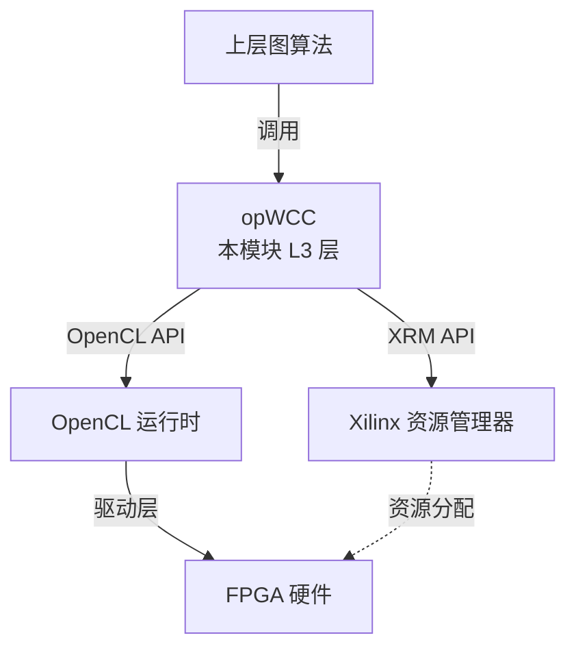

# 弱连通分量分析模块 (Weak Connectivity Analysis)

这个模块是 FPGA 加速图计算的基础设施层，扮演着"航空管制塔"的角色：它管理昂贵的 FPGA 硬件资源，将高层图算法描述翻译成底层硬件指令，并协调多个计算任务的并发执行。

## 架构全景

模块位于纯软件算法（L1/L2层）和原始硬件指令（OpenCL kernel）之间，承担**资源编排者**的角色。



### 核心抽象

FPGA 被抽象为一组可分配、可调度、可释放的**计算单元（Compute Units, CUs）**池：
- **多 CU 并发**：`cuPerBoardWCC` 管理多个物理 CU
- **设备无关性**：通过 `deviceID` 和 `cuID` 定位资源
- **负载均衡**：`dupNmWCC` 实现逻辑 CU 虚拟化

## 核心组件详解

### `opWCC` 类

资源生命周期管理者，封装 OpenCL 上下文、命令队列、内存缓冲区、Kernel 对象和 XRM 资源句柄。

#### 内存所有权模型

**Host 侧临时缓冲区**（`compute` 方法内）：
- 使用 `aligned_alloc` 分配（如 `indicesG2`, `offsetsG2`）
- **所有权**：由 `compute` 方法的栈帧拥有
- **生命周期**：从分配点到 `compute` 结束前的 `free` 调用
- **风险点**：如果 `compute` 中途抛出异常，内存会泄漏

**Device 侧缓冲区**（`cl::Buffer`）：
- 存储在 `clHandle.buffer` 数组中
- **所有权**：由 `clHandle` 对象拥有
- **生命周期**：从 `init` 中的 `new` 到 `freeWCC` 中的 `delete[]`

**XRM 资源句柄**（`xrmCuResource*`）：
- 通过 `malloc` 分配，存储在 `clHandle.resR`
- **风险点**：如果进程崩溃且 `freeWCC` 未被调用，CU 资源会泄漏

#### `createHandle` 方法

复杂的资源组装工厂，将分散的硬件能力组装成可用的执行单元：

1. **设备发现**：`xcl::get_xil_devices()` 枚举 Xilinx 设备
2. **上下文创建**：创建 OpenCL `Context`
3. **命令队列实例化**：创建带性能分析和无序执行标志的命令队列
4. **二进制加载**：导入 `.xclbin` 比特流，创建 `cl::Program`
5. **XRM 资源分配**：`xrm->allocCU` 申请物理 CU 资源
6. **Kernel 实例化**：提取 `wcc_kernel` kernel 对象

#### `init` 方法

构建整个"机队"，处理多节点、多 CU 的复杂拓扑：

```cpp
void opWCC::init(class openXRM* xrm, ..., uint32_t* deviceIDs, uint32_t* cuIDs, ...)
```

- **负载因子计算**：`dupNmWCC = 100 / requestLoad`
- **CU 分片**：`cuPerBoardWCC /= dupNmWCC`
- **句柄数组填充**：为每个逻辑 CU 调用 `createHandle`

**关键数据结构映射**：
`handles` 数组的索引计算：`channelID + cuID * dupNmWCC + deviceID * dupNmWCC * cuPerBoardWCC`

#### `compute` 方法

同步执行的完整工作流：

**阶段 1：地址计算与句柄解析**
```cpp
clHandle* hds = &handles[channelID + cuID * dupNmWCC + deviceID * dupNmWCC * cuPerBoardWCC];
```

**阶段 2：主机侧临时缓冲区分配**
使用 `aligned_alloc` 分配 `indicesG2`, `offsetsG2` 等。

**阶段 3：设备缓冲区初始化与内存拓扑映射**（`bufferInit`）
硬件感知的内存分配，使用 `cl_mem_ext_ptr_t` 指定内存拓扑偏好：
```cpp
mext_in[0] = {(unsigned int)(3) | XCL_MEM_TOPOLOGY, g.offsetsCSR, kernel0()};
```

**阶段 4：数据传输（Host -> Device）**
`migrateMemObj(hds, 0, num_runs, ob_in, nullptr, &events_write[0])`

**阶段 5：内核执行**
`cuExecute(hds, kernel0, num_runs, &events_write, &events_kernel[0])`

**阶段 6：结果回传（Device -> Host）**
`migrateMemObj(hds, 1, num_runs, ob_out, &events_kernel, &events_read[0])`

**阶段 7：同步与清理**
`events_read[0].wait()`，标记 CU 为空闲，释放主机临时缓冲区。

#### `addwork` 方法

异步任务队列抽象：

```cpp
event<int> opWCC::addwork(xf::graph::Graph<uint32_t, uint32_t> g, uint32_t* result) {
    return createL3(task_queue[0], &(compute), handles, g, result);
}
```

- **任务队列**：`task_queue[0]` 是 L3 级别的任务调度队列
- **函数指针绑定**：将 `compute` 方法作为工作项提交
- **Future/Promise 模式**：返回 `event<int>` 对象

## 依赖关系

### 上游依赖（谁调用此模块）

- [community_detection_louvain_partitioning](graph_analytics_and_partitioning-community_detection_louvain_partitioning.md)
- [l2_connectivity_and_labeling_benchmarks](graph_analytics_and_partitioning-l2_connectivity_and_labeling_benchmarks.md)
- [traversal_and_connectivity_operations](graph_analytics_and_partitioning-l3_openxrm_algorithm_operations-traversal_and_connectivity_operations.md)

### 下游依赖（此模块调用谁）

- **Xilinx XRM (Xilinx Resource Manager)**：`xrm->allocCU()`, `xrmCuRelease()`
- **Xilinx OpenCL 扩展 (XRT)**：`xcl::get_xil_devices()`, `cl::Context`, `cl::CommandQueue`, `enqueueMigrateMemObjects`, `enqueueTask`
- **L3 任务调度框架 (`createL3`)**：异步任务调度

## 关键设计权衡

### 1. 显式内存管理 vs. 智能指针

**选择**：显式手动管理（`new[]`, `aligned_alloc`, `malloc`）。

**理由**：
- 与 C API（XRM, OpenCL）的互操作性
- 性能敏感性（避免智能指针的原子操作开销）
- 确定性销毁（FPGA 资源需要立即释放）

**成本**：
- 异常安全性弱（异常发生时可能泄漏）
- 手动维护内存所有权心智负担重

### 2. 同步 vs. 异步 API 共存

**选择**：双模式 API（`compute` 同步 + `addwork` 异步）。

**理由**：
- `compute`：简单性优先，适合基准测试和顺序处理
- `addwork`：吞吐量最大化，适合流式图处理和生产级应用

**成本**：
- `addwork` 依赖 `createL3` 框架，增加耦合
- 异步模式下资源竞争需要上层调度器配合

### 3. 显式内存拓扑控制（HBM Bank 分配）

**选择**：硬编码 HBM bank ID（`XCL_MEM_TOPOLOGY`）。

**理由**：
- 性能确定性：分散缓冲区到不同 bank 实现并行访问，最大化聚合带宽
- Kernel 协同设计：与 FPGA kernel 代码中的 `ext_buffer_location` 属性匹配

**成本**：
- 可移植性丧失：代码与特定 FPGA 平台（U50、U280）的 HBM 架构紧密耦合
- 复杂性：开发者必须理解 FPGA 物理内存架构才能修改代码

## 使用模式与示例

### 基础使用模式：单次同步计算

```cpp
#include "op_wcc.hpp"
#include "xf_graph_L3.hpp"

int main() {
    // 1. 准备图数据（CSR格式）
    xf::graph::Graph<uint32_t, uint32_t> g;
    g.nodeNum = 1000000;
    g.edgeNum = 5000000;
    // 分配并填充 g.offsetsCSR 和 g.indicesCSR ...
    
    // 2. 结果缓冲区
    uint32_t* result = new uint32_t[g.nodeNum];
    
    // 3. 初始化 WCC 模块
    xf::graph::L3::opWCC wcc;
    xf::graph::L3::openXRM xrm;
    
    uint32_t deviceIDs[4] = {0, 0, 0, 0};
    uint32_t cuIDs[4] = {0, 1, 2, 3};
    
    wcc.setHWInfo(1, 4);  // 1 设备，最多 4 CU
    wcc.init(&xrm, "wcc_kernel", "wcc", "wcc.xclbin", 
             deviceIDs, cuIDs, 50);  // 50% 负载
    
    // 4. 执行计算（使用设备 0，CU 0，通道 0）
    xrmContext* ctx = NULL;  // 简化示例
    xrmCuResource resR;
    std::string instanceName = "wcc_inst";
    
    int ret = wcc.compute(0, 0, 0, ctx, &resR, instanceName, 
                          wcc.handles, g, result);
    
    // 5. 处理结果
    // result[i] 包含节点 i 所属的连通分量标签
    
    // 6. 清理
    wcc.freeWCC(ctx);
    delete[] result;
    return 0;
}
```

## 边缘情况与注意事项

### 1. 内存对齐要求

所有通过 `aligned_alloc` 分配的缓冲区**必须**满足 FPGA DMA 的对齐要求（通常是 4KB 页对齐）。未对齐的内存会导致 `cl::Buffer` 创建失败或数据损坏。

```cpp
// 正确：使用 aligned_alloc
uint32_t* indicesG2 = aligned_alloc<uint32_t>(numEdges);

// 错误：使用普通 new/delete
uint32_t* indicesG2 = new uint32_t[numEdges];  // 可能导致未对齐
```

### 2. 资源泄漏风险

如果 `freeWCC` 未被调用（如进程异常退出），XRM 资源可能无法自动释放，导致物理 CU 被永久占用（直到 XRM 守护进程重启或手动清理）。

**建议**：使用 RAII 包装器或 `try-finally` 模式确保 `freeWCC` 被调用。

### 3. 设备 ID 与 CU ID 映射复杂性

`init` 方法的 `deviceIDs` 和 `cuIDs` 数组必须与硬件拓扑严格匹配。错误的映射（如指定不存在的 CU ID）会导致 `createHandle` 中的 OpenCL 调用失败（如 `cl::Kernel` 创建失败）。

**调试建议**：启用 `NDEBUG` 宏以输出详细的调试信息（如 `resR.deviceId`、`cuId` 等）。

### 4. 缓冲区生命周期同步（异步模式）

使用 `addwork` 进行异步计算时，**必须**确保输入图数据（`g.offsetsCSR`、`g.indicesCSR`）和结果缓冲区（`result`）的生命周期覆盖到异步操作完成（即 `event.wait()` 返回）。

**危险模式**：
```cpp
{
    xf::graph::Graph<uint32_t, uint32_t> g;
    // 填充 g...
    uint32_t* result = new uint32_t[g.nodeNum];
    
    auto event = wcc.addwork(g, result);
    // 错误：g 和 result 在这里超出作用域被销毁，
    // 但 FPGA 可能还在访问它们！
}
event.wait();  // 为时已晚，数据已损坏
```

### 5. Kernel 参数版本不匹配

`bufferInit` 中硬编码了 13 个 kernel 参数（索引 0-12）。如果 FPGA kernel 代码（`.xclbin` 中的 HLS 源码）的参数列表发生变化（如添加新参数），而 host 代码未同步更新，会导致参数错位，表现为计算结果错误或 kernel 崩溃。

**维护建议**：将 kernel 接口定义（参数顺序、类型、语义）作为正式的 API 契约文档，host 和 kernel 代码同步版本号。

---

## 参考文献

- [traversal_and_connectivity_operations](graph_analytics_and_partitioning-l3_openxrm_algorithm_operations-traversal_and_connectivity_operations.md) - 父模块，包含其他图遍历算子
- [community_detection_louvain_partitioning](graph_analytics_and_partitioning-community_detection_louvain_partitioning.md) - 典型应用场景，使用 WCC 进行社区发现
- [l2_connectivity_and_labeling_benchmarks](graph_analytics_and_partitioning-l2_connectivity_and_labeling_benchmarks.md) - 连通性基准测试模块
- Xilinx XRM 文档：https://github.com/Xilinx/XRM
- Xilinx XRT 文档：https://xilinx.github.io/XRT/
