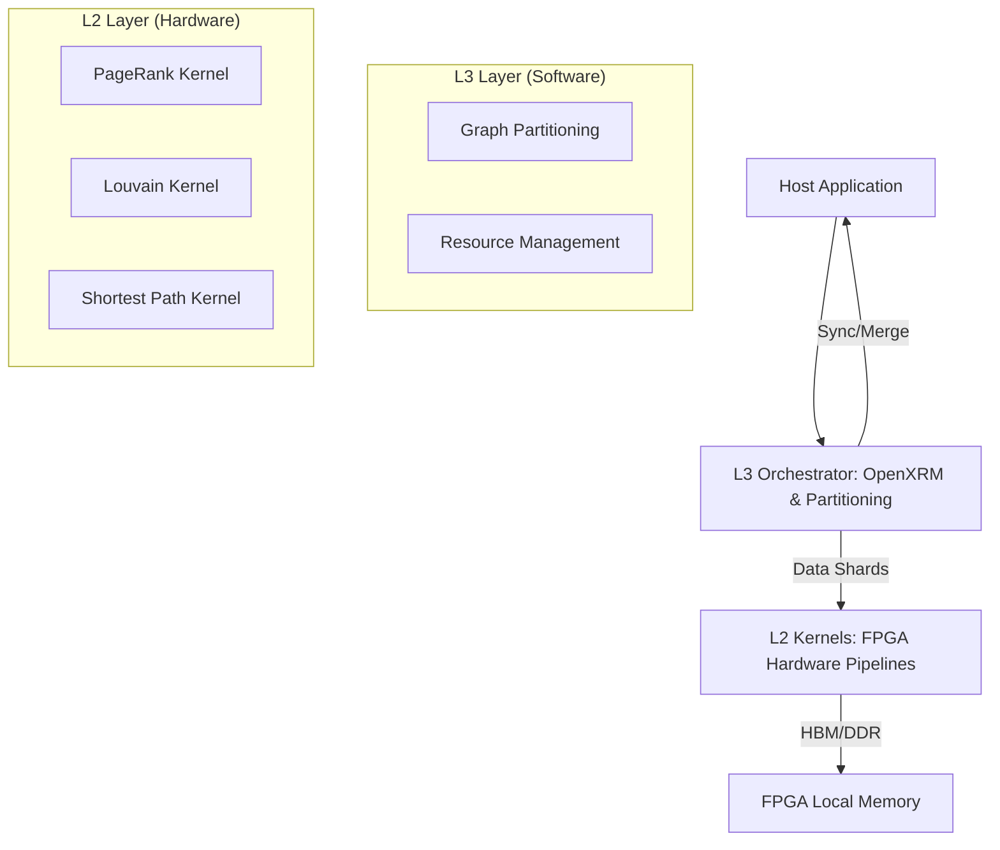

# Graph Analytics and Partitioning 模块深度解析

## 1. 为什么需要这个模块？

在处理大规模图数据（如社交网络、金融交易、生物信息）时，传统的 CPU 处理方案往往面临两个核心瓶颈：
1.  **内存带宽受限**：图算法通常具有高度随机的访存模式，CPU 缓存命中率极低，导致计算单元大部分时间在等待内存数据。
2.  **计算密度不均**：图的幂律分布（少数节点拥有大量连接）导致并行处理时负载极难平衡。

`graph_analytics_and_partitioning` 模块存在的意义在于：**利用 FPGA 的高带宽内存（HBM）和定制化流水线架构，将图算法的执行效率提升 10-100 倍。** 它不仅提供了核心算法的硬件加速实现（L2 层），还解决了一个关键的工程难题：**当图的规模超过单块 FPGA 显存容量时，如何通过分区（Partitioning）和多卡协同完成计算（L3 层）。**

## 2. 核心心智模型

理解本模块的最佳方式是将其视为一个**“分层协作的图处理引擎”**：

*   **L2 层（算法内核）**：这是“执行单元”。每个算法（如 PageRank, Louvain）都被实现为一个高度并行的硬件流水线。它假设数据已经准备好在 FPGA 的本地内存（DDR 或 HBM）中。
*   **L3 层（编排与分区）**：这是“指挥官”。它负责资源管理（通过 OpenXRM）、数据切分（Partitioning）以及跨卡/跨进程的结果合并。
*   **分区模型（Partitioning Model）**：对于超大规模图，模块采用“本地节点 + 影子节点（Ghost Nodes）”的模型。每个分区包含一部分核心节点及其一阶邻居的镜像。计算在各分区独立进行，随后通过同步机制更新全局状态。

### 类比：快递分拣中心
想象一个巨大的快递分拣中心。
*   **L2 内核**就像是自动分拣机，处理速度极快，但传送带（内存带宽）必须足够宽。
*   **L3 编排器**就像是调度员，当包裹太多一台机器放不下时，他将包裹按区域分成几堆（分区），分发给多台分拣机，最后再汇总报表。

## 3. 数据流向追踪

以 **Louvain 社区发现算法** 为例，观察数据如何穿梭：

1.  **初始化 (Host)**：
    *   从磁盘读取原始图数据（通常是 CSR 格式）。
    *   `LouvainPar::partitionDataFile` 根据 FPGA 数量和内存限制，将大图切分为多个 `.par` 文件。
2.  **任务分发 (L3 opLouvainModularity)**：
    *   `opLouvainModularity::addwork` 将计算任务推入任务队列。
    *   `openXRM` 分配可用的 FPGA 计算单元（CU）。
3.  **硬件执行 (L2 Kernel)**：
    *   `PhaseLoop_UsingFPGA_Prep` 将数据从 Host 内存搬运到 FPGA HBM。
    *   FPGA 运行 `kernel_louvain`，执行多轮迭代更新节点的社区 ID（CID）。
    *   `PhaseLoop_UsingFPGA_Post` 将更新后的 CID 读回 Host。
4.  **图压缩与迭代 (Host/CPU)**：
    *   CPU 根据 FPGA 计算出的社区结果，将属于同一社区的节点合并，构建“下一层”更小的图（Coarsening）。
    *   重复步骤 2-3，直到模块度（Modularity）不再显著提升。

## 4. 关键设计决策与权衡

### 4.1 CSR vs CSC 存储格式
*   **决策**：部分算法（如 Label Propagation）同时维护 CSR（压缩稀疏行）和 CSC（压缩稀疏列）。
*   **权衡**：虽然这增加了一倍的内存占用，但它允许硬件流水线同时高效地进行“推（Push）”和“拉（Pull）”操作，避免了在硬件中进行昂贵的坐标转换。

### 4.2 硬件剪枝（Pruning）
*   **决策**：在 `Louvain` 算法中引入了 `MD_FAST` 模式（见 `op_louvainmodularity.cpp`）。
*   **权衡**：该模式会跳过那些对模块度贡献极小的节点更新。这牺牲了一点点计算精度（最终模块度可能略低），但大幅减少了 FPGA 与 Host 之间的通信次数，显著提升了端到端速度。

### 4.3 静态分区 vs 动态分区
*   **决策**：目前主要采用基于节点范围的静态分区（见 `ParLV.cpp` 中的 `partition`）。
*   **权衡**：静态分区实现简单，适合离线预处理。虽然它可能导致某些分区因边数过多而产生负载不均，但通过 `NV_par_max_margin`（预留 20% 空间给 Ghost 节点）的设计，增强了系统对不规则图的容错性。

## 5. 开发者指南：避坑与进阶

### 5.1 内存对齐的“生死线”
在 `host/main.cpp` 中随处可见 `aligned_alloc<T>(num)`。
*   **坑**：FPGA 的 AXI 接口在进行突发传输（Burst Read/Write）时，要求地址必须对齐到 4KB 边界。如果使用普通的 `malloc`，数据传输效率会骤降，甚至导致驱动报错。

### 5.2 影子节点（Ghost Nodes）的 ID 映射
在 `ParLV.cpp` 的 `CheckGhost` 函数中，处理 Ghost 节点的全局 ID 到本地索引的映射是逻辑最复杂的地方。
*   **注意**：Ghost 节点的 ID 通常被编码为负数（如 `-v - 1`），以区别于本地节点。在修改分区逻辑时，务必保持这一约定，否则会导致合并阶段的内存越界。

### 5.3 硬件资源竞争
L3 层通过 `openXRM` 管理资源。
*   **注意**：如果你的应用是多线程的，`opLouvainModularity::compute` 中使用了 `std::lock_guard<std::mutex>`。这意味着虽然 L3 接口是异步的，但针对同一个 CU 的操作是串行的。不要试图绕过这个锁，否则会导致 FPGA 命令队列崩溃。

---

## 子模块详细文档

*   [L2 连接性与标记基准测试](graph_analytics_and_partitioning-l2_connectivity_and_labeling_benchmarks.md)：包含 WCC、SCC 和 Label Propagation 等算法。
*   [L2 PageRank 与中心性基准测试](graph_analytics_and_partitioning-l2_pagerank_and_centrality_benchmarks.md)：针对大规模网页排名优化的缓存与多通道实现。
*   [L2 图模式与最短路径基准测试](graph_analytics_and_partitioning-l2_graph_patterns_and_shortest_paths_benchmarks.md)：包含三角形计数与最短路径算法。
*   [L2 图预处理与转换](graph_analytics_and_partitioning-l2_graph_preprocessing_and_transforms.md)：用于节点重编号与图合并的硬件加速工具。
*   [社区发现与 Louvain 分区](graph_analytics_and_partitioning-community_detection_louvain_partitioning.md)：解析大规模图切分与多相位合并的数学逻辑。
*   [L3 OpenXRM 算法操作](graph_analytics_and_partitioning-l3_openxrm_algorithm_operations.md)：学习如何调用高级算子集成到生产系统。
