# 第五章：测量真正重要的事——基准测试、乒乓缓冲与计时基础设施

> **本章学习目标：** 掌握 Vitis Libraries 中衡量内核性能的标准模式——挂钟时间 vs OpenCL 事件计时、用乒乓双缓冲重叠数据传输与计算，以及基准测试主机程序如何构建其验证循环。

---

## 5.1 为什么"感觉很快"不够——计时的意义

想象你在一家餐厅厨房做饭。你知道"整顿饭"花了一个小时，但你不知道：
- 备菜用了多久？
- 炉火加热用了多久？
- 摆盘用了多久？

如果你想让整个过程更快，你首先需要知道时间花在哪里。**FPGA 加速也是一样的道理。**

在异构计算中（CPU + FPGA 协作），总的端到端时间由三部分叠加：

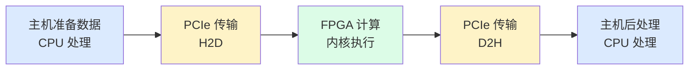

**蓝色**是纯 CPU 工作，**黄色**是 PCIe 总线传输，**绿色**才是 FPGA 真正的计算时间。

如果你只测量总时间，你可能会误以为 FPGA 很慢——但实际上 FPGA 跑得飞快，瓶颈在 PCIe 传输或 CPU 后处理。**Vitis Libraries 里的每个基准测试模块都把这三类时间分开报告**，这正是本章要讲的核心思想。

---

## 5.2 两种时钟，两种视角

在讲具体代码之前，我们先理解两种完全不同的计时工具，就像你有两块手表：

### 挂钟时间（Wall-Clock Time）

想象你拿着手机秒表，从按下"开始"到按下"停止"，测量的是**真实世界流逝的时间**。这就是挂钟时间。

在 C++ 中，使用 `gettimeofday` 函数来获取这种时间：

```cpp
struct timeval startE2E, endE2E;
gettimeofday(&startE2E, 0);   // 秒表开始
// ... 整个流程 ...
gettimeofday(&endE2E, 0);     // 秒表停止
```

**优点**：简单直接，能捕捉所有事情（包括 CPU 后处理）  
**缺点**：受操作系统调度影响，精度较低（通常微秒级），无法区分时间花在哪个环节

### OpenCL 事件时间（Event-Based Profiling）

想象工厂里每台机器都有自己的专属计时器，机器一开始干活就自动打卡，干完也自动打卡。这就是 OpenCL 事件计时。

每个发送给 FPGA 的命令（数据传输、内核执行）都会产生一个**事件对象**（`cl::Event`），你可以从中读取纳秒级精度的开始和结束时间：

```cpp
cl::Event kernel_event;
// ... 执行内核 ...
cl_ulong t_start, t_end;
kernel_event.getProfilingInfo(CL_PROFILING_COMMAND_START, &t_start);
kernel_event.getProfilingInfo(CL_PROFILING_COMMAND_END,   &t_end);
unsigned long exec_time = (t_end - t_start) / 1000; // 转换为微秒
```

**优点**：精度高（纳秒级），测量的是设备内部时间，不受主机 OS 干扰  
**缺点**：只能测量 OpenCL 命令的时间，看不到主机端 CPU 工作

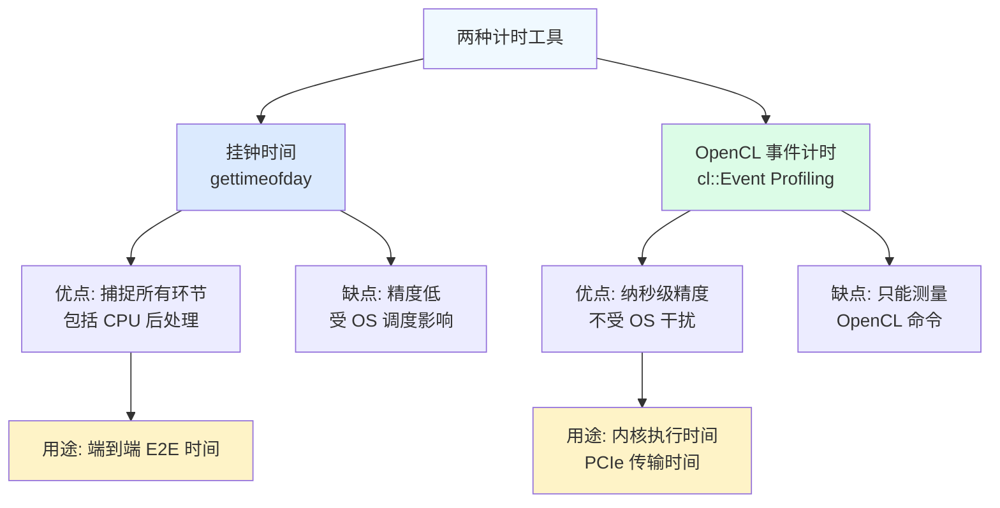

这两种工具组合使用，才能拼出完整的性能画面。

---

## 5.3 JPEG 解码器：一个精密的计时仪器

让我们用 `codec_acceleration_and_demos` 中的 JPEG 解码器基准测试作为第一个案例。这个模块的核心不是"如何解码 JPEG"，而是**如何精确测量解码过程的每一分每一秒**。

### 5.3.1 模块的双模式架构

这个模块支持两种运行方式，就像同一款相机既可以拍RAW格式（专业模式），也可以拍JPEG（普通模式）：

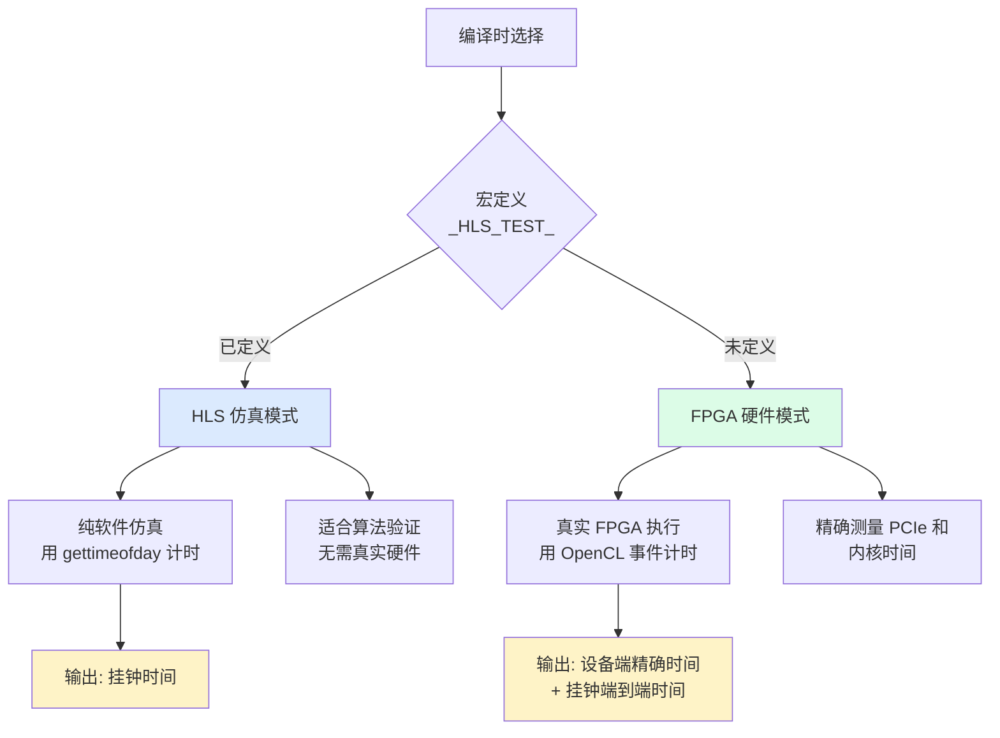

**仿真模式**适合快速验证算法是否正确，就像在纸上先检查食谱逻辑，再去厨房实际操作。**硬件模式**才是真正的性能基准测试。

### 5.3.2 `diff()` 函数——时间差的基本单位

库里有一个非常小但非常重要的工具函数：

```cpp
unsigned long diff(const struct timeval* newTime, const struct timeval* oldTime) {
    return (newTime->tv_sec - oldTime->tv_sec) * 1000000 
         + (newTime->tv_usec - oldTime->tv_usec);
}
```

这个函数把两个时间点的差值统一转换成**微秒（μs）整数**。为什么用整数而不是浮点？因为整数运算没有浮点误差，在高频计时中更可靠。你可以把它理解为秒表上的"圈数显示"——永远以固定单位呈现。

### 5.3.3 内存对齐：DMA 的必要条件

在讲时序之前，有一个基础概念必须理解：**页对齐内存**。

想象 PCIe DMA（直接内存访问）就像一辆只停在固定站点的公共汽车。这辆"DMA 公共汽车"只在 4096 字节的倍数地址停车。如果你的数据放在一个奇怪的中间地址，DMA 就需要先把数据搬到最近的"站点"，造成额外一次内存拷贝，性能骤降。

```cpp
template <typename T>
T* aligned_alloc(std::size_t num) {
    void* ptr = nullptr;
    if (posix_memalign(&ptr, 4096, num * sizeof(T))) {
        throw std::bad_alloc();  // 分配失败就报错，不能悄悄使用未对齐内存
    }
    return reinterpret_cast<T*>(ptr);
}
```

**4096 字节**正好是一个内存页（Memory Page）的大小。所有用于 FPGA DMA 的缓冲区都必须如此对齐，这是一条**硬性要求**，不是可选优化。

---

## 5.4 OpenCL 事件链：让命令之间互相"等待"

在 FPGA 加速中，你需要发出一系列命令：先把数据传给 FPGA（H2D），再执行内核，再把结果拿回来（D2H）。这些命令必须按顺序执行——内核不能在数据到达之前开始，读取不能在内核完成之前开始。

OpenCL 用**事件依赖**（Event Dependencies）来表达这种顺序关系，就像工厂里的"工序交接单"。

### 基本事件链（单次执行）

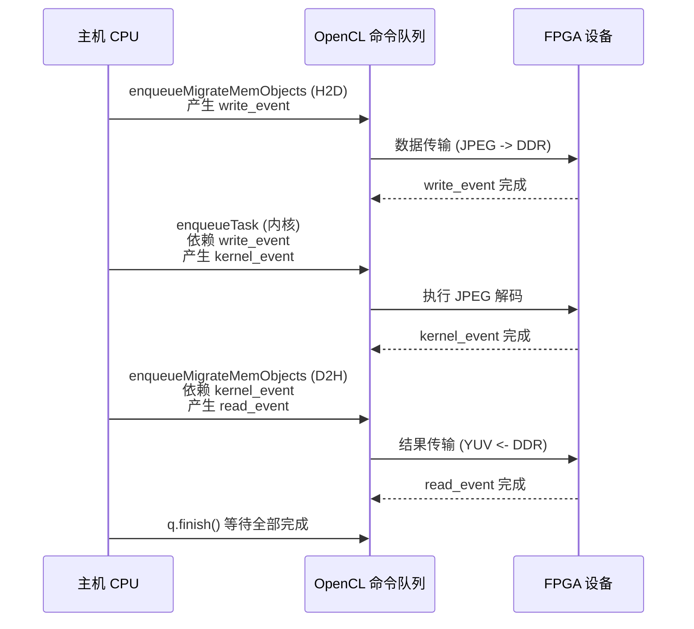

关键代码模式（伪代码）：

```cpp
// 步骤1: 传输输入数据，产生 write_event
q.enqueueMigrateMemObjects(input_buffers, 0, nullptr, &write_event);

// 步骤2: 执行内核，依赖 write_event 完成
std::vector<cl::Event> wait_for_write = {write_event};
q.enqueueTask(kernel, &wait_for_write, &kernel_event);

// 步骤3: 读回结果，依赖 kernel_event 完成
std::vector<cl::Event> wait_for_kernel = {kernel_event};
q.enqueueMigrateMemObjects(output_buffers, CL_MIGRATE_MEM_OBJECT_HOST,
                           &wait_for_kernel, &read_event);

// 等待全部完成
q.finish();

// 从事件中提取时间戳
cl_ulong t_start, t_end;
kernel_event.getProfilingInfo(CL_PROFILING_COMMAND_START, &t_start);
kernel_event.getProfilingInfo(CL_PROFILING_COMMAND_END, &t_end);
```

这种"事件链"模式是整个 Vitis Libraries 中**最普遍、最标准**的主机代码模式之一。

---

## 5.5 乒乓缓冲：让传输和计算同时发生

现在我们进入本章最重要的概念：**乒乓缓冲**（Ping-Pong Buffering），也称为**双缓冲**（Double Buffering）。

### 5.5.1 为什么需要乒乓缓冲？

想象一条单车道的公路：卡车送货（PCIe 传输）和工厂生产（FPGA 计算）共用一条路。如果只有一组缓冲区：

```
时间轴: [传输批次1] -> [计算批次1] -> [传输批次2] -> [计算批次2] -> ...
        传输时，FPGA 空闲
                         计算时，PCIe 空闲
```

PCIe 和 FPGA 轮流干活，有一半时间在"等"。

### 5.5.2 乒乓缓冲的直觉

想象你是一个餐厅服务员，有两个托盘：Ping 托盘和 Pong 托盘。
- 当厨师（FPGA）正在处理 Ping 托盘里的菜时，你（主机）正在向 Pong 托盘装新菜
- 厨师处理完 Ping，立刻切换到 Pong，你则去清理 Ping、装下一批菜
- 厨师永远不需要等你，你也永远不需要等厨师

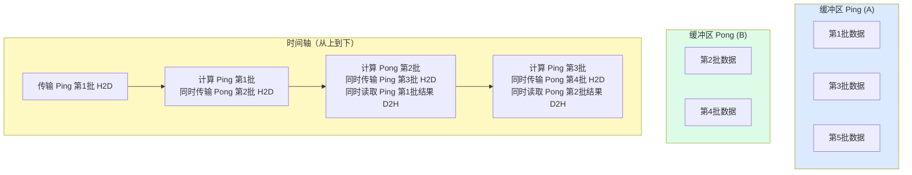

### 5.5.3 HMAC-SHA1 基准测试中的乒乓实现

`security_crypto_and_checksum` 中的 HMAC-SHA1 基准测试是乒乓缓冲最经典的实现。它有两组输出缓冲区 `hb_out_a` 和 `hb_out_b`，通过 `i & 1`（迭代次数的最低位）在两者之间切换：

```cpp
// 通过位运算交替选择缓冲区
// 偶数迭代用 A 组，奇数迭代用 B 组
for (int i = 0; i < num_rep; i++) {
    // 选择本次迭代用哪个缓冲区
    bool use_ping = (i % 2 == 0);
    auto& current_output = use_ping ? output_buffer_a : output_buffer_b;
    
    // 本次写入依赖前前次读取完成（避免覆盖还没读的数据）
    // write[i] 依赖 read[i-2] 完成
    q.enqueueMigrateMemObjects(input, 0, 
        (i >= 2) ? &read_events[i-2] : nullptr,
        &write_events[i]);
    
    // 内核执行依赖写入完成
    q.enqueueTask(kernel, &write_events[i], &kernel_events[i]);
    
    // 读取依赖内核完成
    q.enqueueMigrateMemObjects(current_output, CL_MIGRATE_MEM_OBJECT_HOST,
        &kernel_events[i], &read_events[i]);
}
```

**注意关键细节**：写入 `write[i]` 依赖的是 `read[i-2]`（前**前**次），而不是 `read[i-1]`（前次）。这是因为：
- `i=0` 时：Ping 缓冲区接收数据
- `i=1` 时：Pong 缓冲区接收数据，同时 FPGA 处理 Ping
- `i=2` 时：要再次用 Ping 缓冲区，必须等 `read[0]`（Ping 的结果被读回）完成，才能覆盖 Ping 缓冲区

这个"差 2"的依赖是乒乓缓冲的**核心约束**，改成"差 1"会导致数据竞争，产生难以复现的错误。

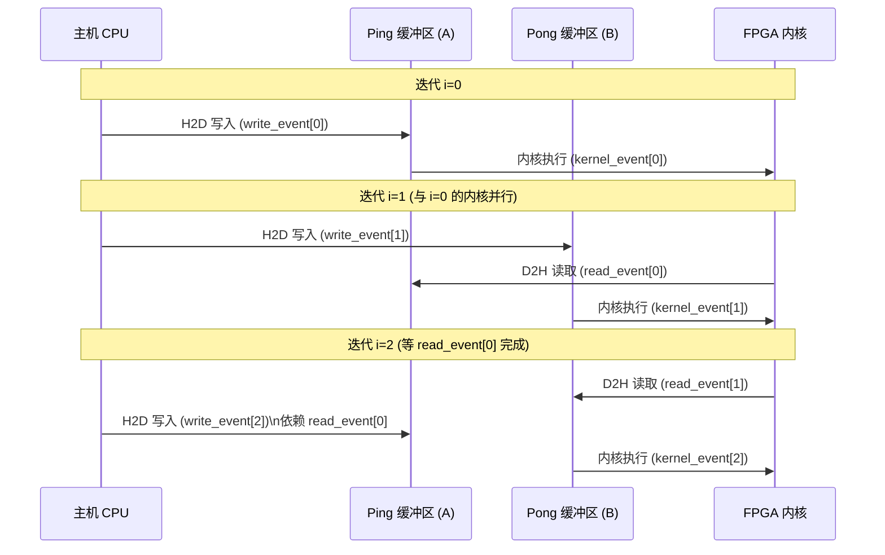

### 5.5.4 为什么乒乓需要至少 2 次迭代？

HMAC-SHA1 基准测试代码中有一行：

```cpp
if (num_rep < 2) num_rep = 2; // 强制最少 2 次迭代
```

这不是防御性编程，而是**架构约束**。乒乓缓冲就像双轮驱动——必须有两个轮子才能转起来。第一次迭代是"预热"（填充第一个缓冲区），从第二次迭代开始才真正进入流水线节奏。只跑一次，乒乓永远无法展开，意义全无。

---

## 5.6 四核并行：HMAC-SHA1 的完整架构

`hmac_sha1_authentication_benchmarks` 模块展示了乒乓缓冲结合多核并行的更完整图景。它实例化了 4 个完全相同的 FPGA 内核，每个连接独立的 DDR 内存组：

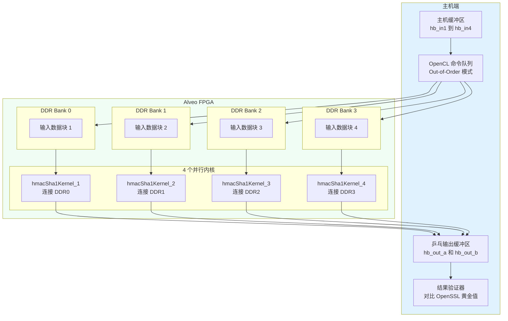

**为什么是 4 个 DDR Bank、4 个内核？** 因为 Alveo 卡上的 DDR 控制器有 4 个独立通道，每个通道能提供完整带宽。如果 4 个内核共用一个 DDR Bank，它们会互相抢带宽，实际只能得到 1/4 的带宽。**独立的存储器通道是实现线性扩展的关键**。

### 内核内部的流水线

每个 HMAC-SHA1 内核内部也是一条"装配流水线"：

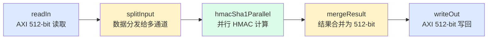

整个内核用 `#pragma HLS dataflow` 指令标记，这让 Xilinx HLS 工具把这五个函数变成**并发进程**（类似协程），数据通过 `hls::stream`（类似管道）流动，形成深度流水线。这就是 FPGA 高吞吐量的秘密——数据一直在流动，没有"等待"。

---

## 5.7 GQE 的线程化执行队列：L3 层的调度艺术

前面的例子都是 L1/L2 层的直接内核调用。到了 L3 层，复杂度更高——`database_query_and_gqe` 的 `l3_gqe_execution_threading_and_queues` 模块展示了更复杂的并发调度。

### 查询执行中的任务并行

想象一个大型超市的收银台系统：不同的收银员（CPU 线程）同时处理不同的购物车（查询任务），而同一时间后台 FPGA 在处理最重的计算部分（Hash Join、Aggregation）。

GQE 的 L3 层为三种操作（聚合、过滤、连接）分别维护独立的执行队列：

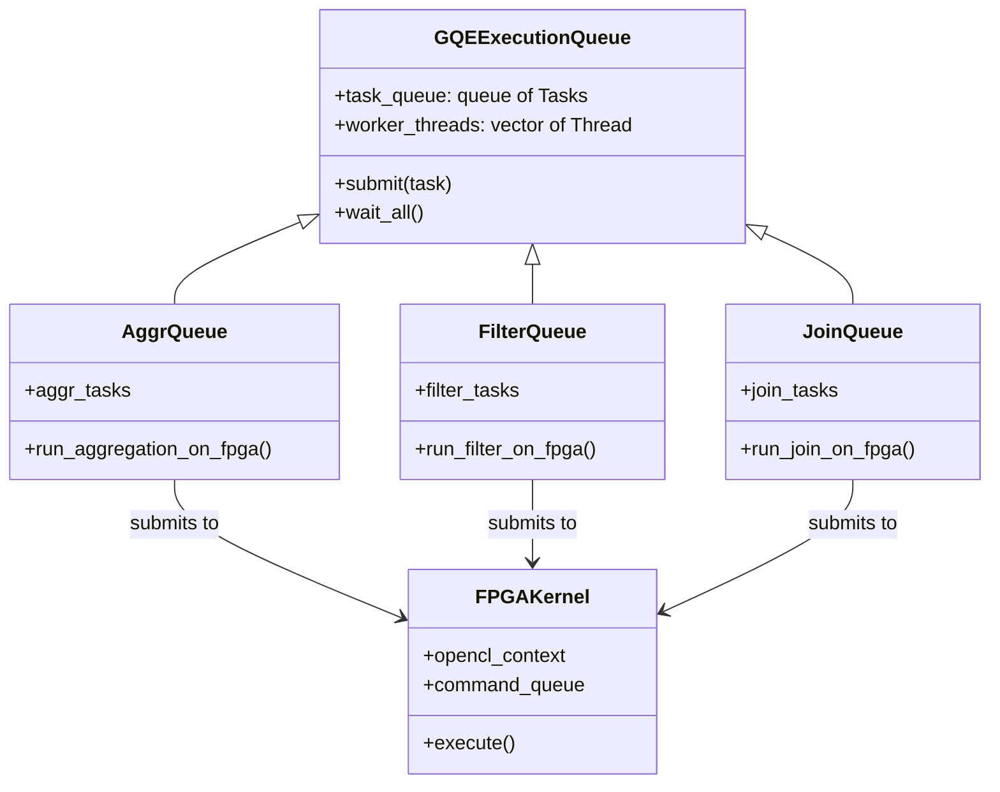

这种设计让不同类型的查询操作可以**同时在途**——过滤操作不需要等聚合完成，连接操作可以和过滤并发执行（只要 FPGA 资源允许）。这就是 L3 层的核心价值：把多个查询的执行重叠起来，提高硬件利用率。

### 线程队列与 FPGA 的关系

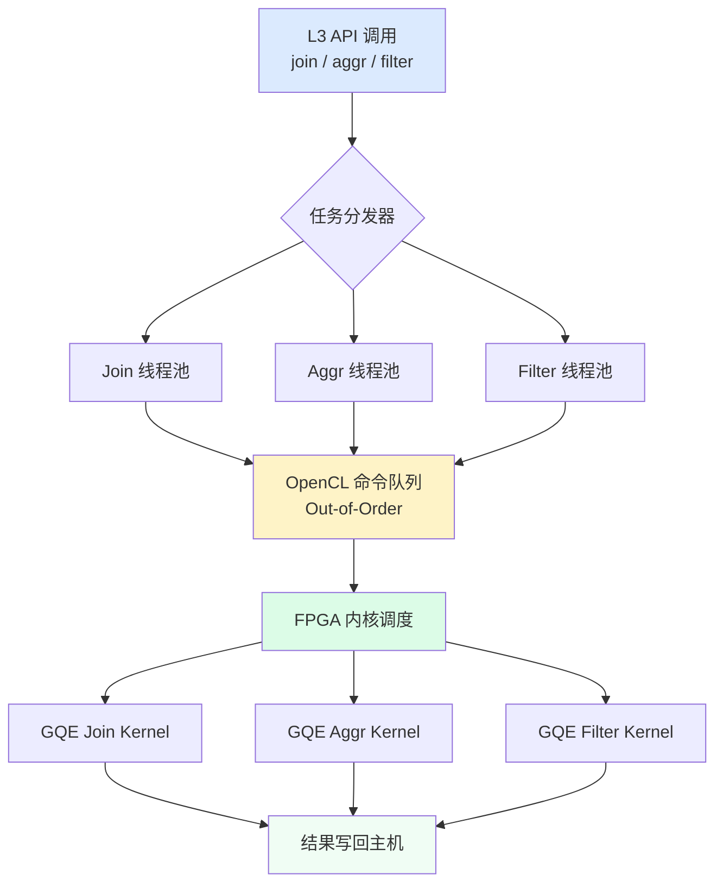

关键设计决策是使用 **Out-of-Order 命令队列**（乱序执行队列）。普通命令队列要求命令严格按提交顺序执行，而乱序队列允许 OpenCL 运行时在依赖关系满足的前提下自由调度命令顺序，最大化并发。

---

## 5.8 基准测试程序的标准结构

通读 Vitis Libraries 中的各类基准测试（JPEG、HMAC、GQE、Graph），你会发现它们遵循几乎一模一样的结构，就像餐厅的标准服务流程：

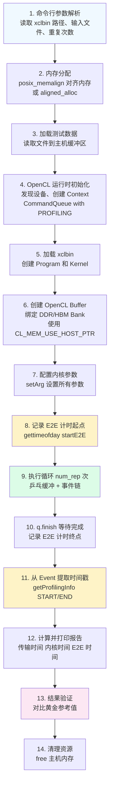

记住这 14 步，你就掌握了整个库中基准测试的通用模板。

---

## 5.9 读懂基准测试输出报告

基准测试最终输出的报告通常包含这几行关键数据：

```
INFO: Data transfer from host to device  (H2D): 120 us
INFO: Data transfer from device to host  (D2H):  85 us
INFO: Average kernel execution per run      :  450 us
INFO: End-to-end time per run               :  800 us
```

如何解读这份报告？用"时间拼图"的方式：

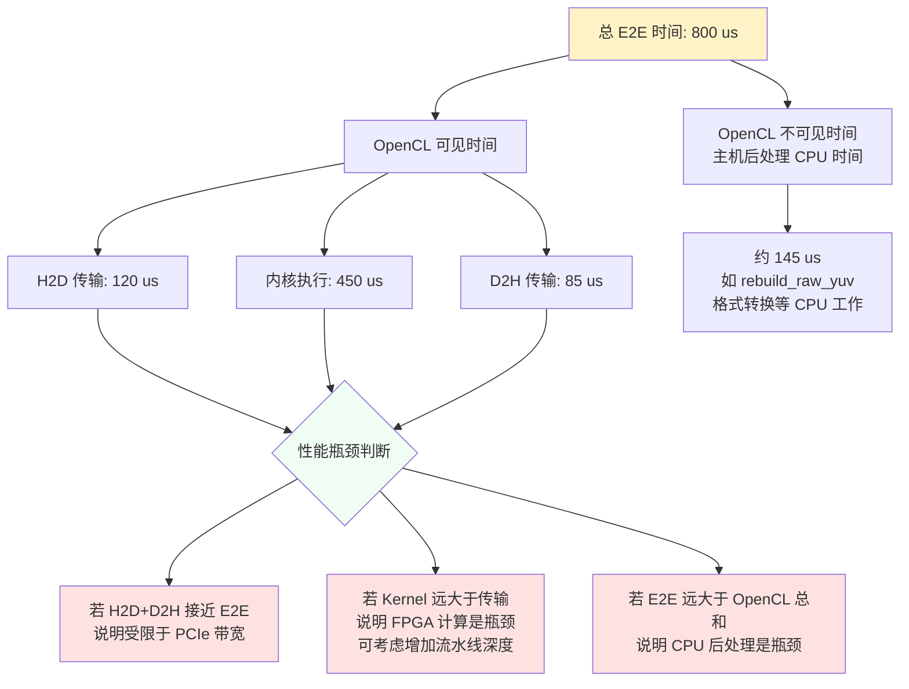

$$\text{CPU 后处理时间} = E2E - \max(H2D + \text{Kernel} + D2H)$$

这个公式能帮你找到那些"看不见的"主机端处理开销。对于 JPEG 解码器，`rebuild_raw_yuv`（MCU 格式转换为平面 YUV）往往就是这个隐形瓶颈。

---

## 5.10 黄金参考值验证：确保加速的正确性

测量速度只是一半，另一半是**确保结果正确**。Vitis Libraries 的基准测试模块通常配备一个"黄金参考"（Golden Reference）验证机制。

在 HMAC-SHA1 的例子中：
- 主机先用 **OpenSSL**（业界公认正确的 CPU 实现）计算出一批正确的 HMAC 值
- FPGA 计算出同样输入的 HMAC 值
- 逐比特对比两份结果

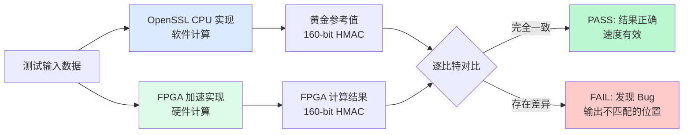

**重要陷阱**：黄金参考文件是预先生成的二进制文件（通过 `-gld` 参数指定）。如果你修改了测试用的密钥（`key[]`）或消息内容（`messagein`），**必须同步重新生成黄金参考文件**，否则验证永远失败，且错误原因令人困惑。

---

## 5.11 常见陷阱与最佳实践

本章涵盖了大量技术细节，以下是最容易踩坑的几个地方：

### 陷阱 1：用普通 `malloc` 替代 `aligned_alloc`

```cpp
// 错误的做法
char* buf = (char*)malloc(size);
cl::Buffer cl_buf(ctx, CL_MEM_USE_HOST_PTR, size, buf);

// 正确的做法
char* buf = aligned_alloc<char>(size); // 4096 字节对齐
cl::Buffer cl_buf(ctx, CL_MEM_USE_HOST_PTR, size, buf);
```

使用未对齐内存，XRT 会悄悄做一次额外拷贝，乒乓缓冲的收益消失殆尽，性能可能下降 50% 以上，且你根本不会看到任何报错。

### 陷阱 2：忘记开启 Profiling

```cpp
// 错误：普通队列无法获取 profiling 数据
cl::CommandQueue q(ctx, device, 0);

// 正确：必须显式开启 profiling
cl::CommandQueue q(ctx, device, CL_QUEUE_PROFILING_ENABLE);
```

不开 Profiling，调用 `getProfilingInfo` 会返回 0 或报错，计时数据全部失效。

### 陷阱 3：乒乓只跑一次

```cpp
// 错误：num_rep = 1 时乒乓无法展开
if (num_rep < 2) {
    num_rep = 2; // 必须强制最少 2 次
    printf("Warning: num_rep set to 2 for ping-pong to work\n");
}
```

### 陷阱 4：事件依赖写成 `i-1` 而不是 `i-2`

乒乓缓冲中，写入依赖必须是"前**前**次读取完成"（`read_events[i-2]`），写成 `read_events[i-1]` 会产生数据竞争，错误随机出现，极难调试。

### 最佳实践总结

| 实践 | 说明 |
|------|------|
| 总是用 `aligned_alloc` 或 `posix_memalign` | FPGA DMA 的硬性要求，4096 字节对齐 |
| 总是开启 `CL_QUEUE_PROFILING_ENABLE` | 否则无法获取内核时间 |
| 至少运行 `num_rep >= 5` 次 | 平均值能过滤冷启动异常，5 次以上才有统计意义 |
| 同时报告 E2E 和内核时间 | 只报告一个会造成误判 |
| 先跑验证，再跑性能 | 确认结果正确后，性能数据才有意义 |
| 单独的 DDR/HBM Bank 给每个内核 | 避免带宽争用，实现线性扩展 |

---

## 5.12 本章回顾：从仪器到洞察

本章我们从三个真实模块中学习了性能测量的核心思想：

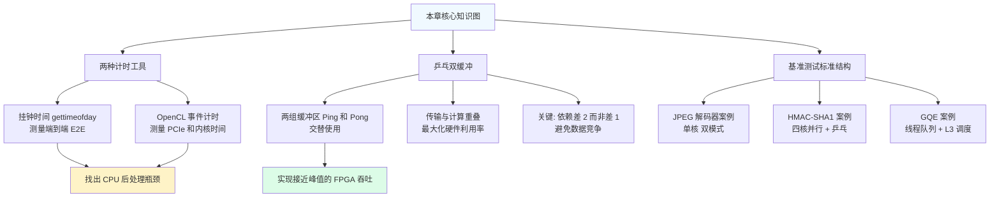

关键洞见总结：

1. **端到端时间 ≠ 内核时间**。混淆二者会导致严重误判——你可能以为 FPGA 慢，实际上是 PCIe 或 CPU 后处理在拖后腿。

2. **乒乓缓冲是隐藏 PCIe 延迟的标准武器**。只要 FPGA 计算时间 ≥ PCIe 传输时间，整体吞吐就等于 FPGA 峰值吞吐。

3. **页对齐内存是 DMA 的入场券**。`aligned_alloc` 不是可选优化，而是硬性要求。

4. **多核 + 独立内存通道 = 线性扩展**。4 个内核连 4 个 DDR Bank，不互相竞争，吞吐线性提升。

5. **验证先于性能**。先用黄金参考值确认结果正确，再关心跑得有多快——速度再快，错误结果毫无价值。

下一章，我们将深入数据库加速（GQE Hash Join）和图分析（PageRank、Louvain 社区检测）这两个最丰富的领域，看 L3 层如何把多设备调度和分区合并复杂性完全隐藏在简洁的 API 之后。