# 第八章：基准测试与验证——每个领域如何测试正确性和衡量性能

> **学习目标：** 掌握 Vitis Libraries 各领域通用的验证模式——黄金参考对比、双模式计时（墙钟时间 vs OpenCL 事件）、以及多次运行预热策略——让你能够自信地编写自己的基准测试。

---

## 8.1 为什么基准测试比你想象的更难？

想象你是一位厨师，想知道自己的新菜谱比旧菜谱快多少。你会怎么计时？

- 从"开始切菜"计时，还是从"点火"计时？
- 第一次做（锅还是冷的）和第十次做（锅已经热了）时间一样吗？
- 你测的是"菜做好的时间"，还是"端上桌的时间"？

FPGA 加速计算面临完全相同的困境。数据需要从 CPU 内存搬运到 FPGA 芯片（就像食材从冰箱搬到灶台），内核需要"预热"（就像锅需要加热），结果还要搬回来（就像菜要端上桌）。如果你不小心，你测到的可能是"搬运时间"而不是"烹饪时间"。

Vitis Libraries 的每个领域都发展出了一套**标准化的基准测试模式**来解决这些问题。本章就是这套模式的完整指南。

---

## 8.2 基准测试的三大核心挑战

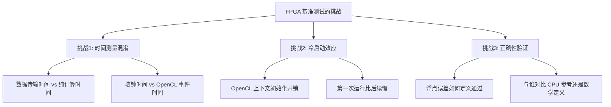

**挑战 1：时间测量混淆。** 就像你不能把"开车去超市的时间"算进"炒菜时间"一样，数据传输（H2D/D2H）和纯内核计算必须分开测量。

**挑战 2：冷启动效应。** 第一次加载 FPGA 程序（xclbin 文件）就像第一次启动汽车——需要额外的预热时间。如果只跑一次就记录结果，数据会严重偏高。

**挑战 3：正确性验证。** FPGA 计算的结果怎么知道是对的？不能只看"程序没崩溃"，必须有系统化的验证方法。

---

## 8.3 全局架构：一个通用的基准测试框架

Vitis Libraries 的所有领域——无论是线性代数求解器、密码学、图像处理还是图分析——都遵循同一个六步流程。

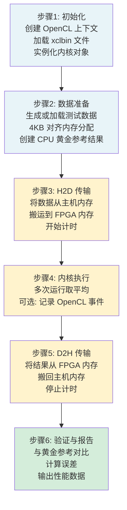

注意颜色的含义：**蓝色**（步骤 1-2）是初始化阶段，**不计入**性能计时；**黄色**（步骤 3-5）是真正被测量的部分；**绿色**（步骤 6）是验证阶段。

---

## 8.4 双模式计时：墙钟时间 vs OpenCL 事件

这是整个基准测试体系中最重要的概念，也是最容易混淆的地方。

### 8.4.1 两块"秒表"的比喻

想象你有两块秒表：

- **墙钟秒表**（`gettimeofday` / `clock_gettime`）：从你按下"开始"到按下"停止"，测量的是**真实世界经过的时间**，包括等待、传输、调度等一切开销。就像用手机计时你从家到公司的总时间。

- **OpenCL 事件秒表**（`cl::Event::getProfilingInfo`）：只测量 FPGA 芯片内部实际执行计算的时间，不包括数据传输和等待。就像只计算你在公司实际工作的时间，不算通勤。

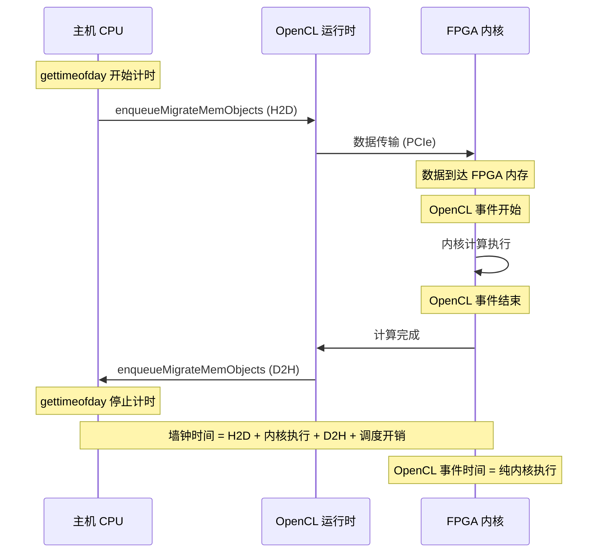

**关键公式：**

$$\text{数据传输开销} \approx \text{墙钟时间} - \text{OpenCL 事件时间}$$

这个差值告诉你：你的瓶颈是在数据搬运上，还是在计算本身上。

### 8.4.2 微秒级 vs 纳秒级：两种 POSIX 计时器

Vitis Libraries 中实际使用了两种 POSIX 标准计时工具，精度不同：

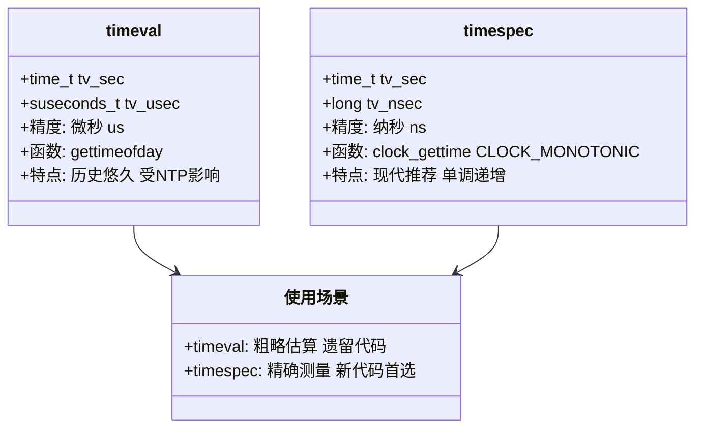

**`timeval` + `gettimeofday`：** 精度到微秒，是较老的写法。在 `solver_benchmarks` 和部分视觉库基准测试中使用。

**`timespec` + `clock_gettime(CLOCK_MONOTONIC)`：** 精度到纳秒，是现代推荐写法。`CLOCK_MONOTONIC`（单调时钟）的关键优势是：即使系统管理员调整了系统时间（比如 NTP 同步），它也**永远不会回跳**，不会产生负的时间差。

> **新贡献者守则：** 写新代码时，**始终使用 `timespec` + `clock_gettime(CLOCK_MONOTONIC)`**。只有在修改旧代码且改动范围过大时，才保留 `timeval`。

---

## 8.5 案例一：Solver Benchmarks 的计时实践

`solver_benchmarks` 模块为线性代数求解器（SVD 分解、三对角求解器）提供基准测试。它是"墙钟时间"计时策略的典型代表。

### 8.5.1 正确的计时范围

这是最容易犯错的地方。想象你在测试一辆赛车的速度——你应该从赛车**已经在跑道上**开始计时，而不是从"把赛车从车库推出来"开始。

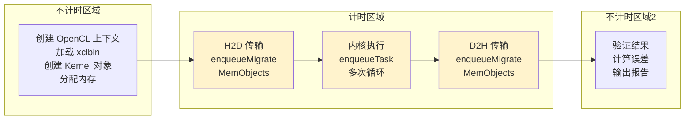

用代码来说明这个边界：

```cpp
// ✅ 正确的计时范围示例（来自 solver_benchmarks 的模式）

// === 不计时区域：初始化 ===
cl::Context context(...);
cl::Program program(context, xclbin_content);
cl::Kernel kernel(program, "kernel_gesvdj_0");
// 分配 4KB 对齐内存
double* matA;
posix_memalign((void**)&matA, 4096, size);

// === 开始计时 ===
struct timeval tstart, tend;
gettimeofday(&tstart, 0);

// H2D 传输
q.enqueueMigrateMemObjects(ob_in, 0);
q.finish();

// 内核执行（多次运行取平均）
for (int i = 0; i < num_runs; ++i) {
    q.enqueueTask(kernel);
}
q.finish();

// D2H 传输
q.enqueueMigrateMemObjects(ob_out, CL_MIGRATE_MEM_OBJECT_HOST);
q.finish();

// === 停止计时 ===
gettimeofday(&tend, 0);
int exec_time = diff(&tend, &tstart);  // 微秒

// === 不计时区域：验证 ===
// 重构验证、误差计算...
```

### 8.5.2 内存对齐：为什么要 4KB 对齐？

想象 FPGA 的 DMA（直接内存访问）控制器就像一辆只能在"整齐停车位"停车的大卡车——它要求数据必须从内存的特定边界开始存放。如果数据放在"奇怪的位置"，卡车就无法直接装货，必须先把货物搬到合适的位置，浪费时间。

```cpp
// 强制 4096 字节（4KB）对齐分配
double* matA;
if (posix_memalign((void**)&matA, 4096, dataSize) != 0) {
    throw std::bad_alloc();
}

// 使用 CL_MEM_USE_HOST_PTR 实现零拷贝
cl::Buffer buf(context,
               CL_MEM_USE_HOST_PTR | CL_MEM_READ_WRITE,
               dataSize,
               matA);
// 这样 FPGA DMA 可以直接访问 matA 指向的内存，无需额外复制
```

`CL_MEM_USE_HOST_PTR` 就像告诉卡车"直接从这个停车位装货"，避免了一次额外的数据复制。

---

## 8.6 案例二：HMAC-SHA1 基准测试的多实例并行模式

`hmac_sha1_authentication_benchmarks` 展示了一种更复杂的模式：同时运行**多个内核实例**，并用 OpenCL 事件精确测量每个实例的执行时间。

### 8.6.1 多内核实例的架构

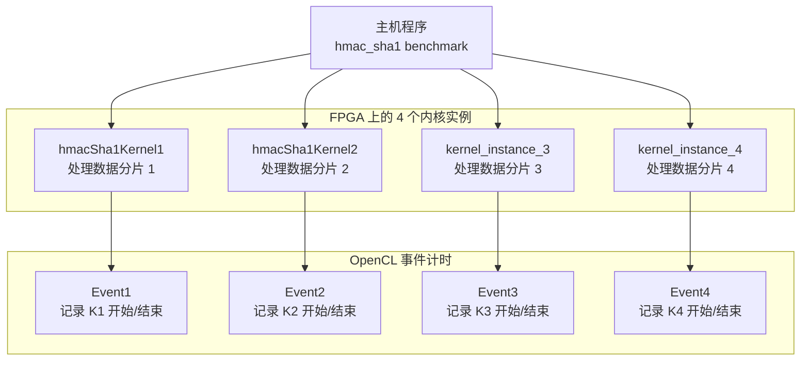

这就像一个工厂有 4 条流水线同时运行，每条流水线都有自己的计时器。主机程序同时启动所有 4 个内核，然后等待全部完成，最后取**最长的那个时间**作为总执行时间（因为它们是并行的，总时间由最慢的决定）。

### 8.6.2 OpenCL 事件计时的代码模式

```cpp
// 为每个内核创建事件对象
cl::Event event1, event2, event3, event4;

// 启动内核，传入事件对象用于记录时间
q.enqueueTask(kernel1, nullptr, &event1);
q.enqueueTask(kernel2, nullptr, &event2);
q.enqueueTask(kernel3, nullptr, &event3);
q.enqueueTask(kernel4, nullptr, &event4);
q.finish();

// 从事件中读取纳秒级时间戳
cl_ulong start1, end1;
event1.getProfilingInfo(CL_PROFILING_COMMAND_START, &start1);
event1.getProfilingInfo(CL_PROFILING_COMMAND_END, &end1);

// 计算内核执行时间（纳秒转毫秒）
double kernel_time_ms = (end1 - start1) / 1e6;
```

**OpenCL 事件时间的优势：** 精确到纳秒，完全排除了 PCIe 传输、OS 调度等外部因素，是测量"内核本身有多快"的最准确方式。

---

## 8.7 案例三：视觉库 L3 基准测试的双重计时

`vision_core_types_and_benchmarks` 中的 `l3_benchmark_timing_types` 展示了最完整的模式：**同时使用两种计时方式**，分别测量软件参考实现和硬件加速实现。

### 8.7.1 软件 vs 硬件的对比测量

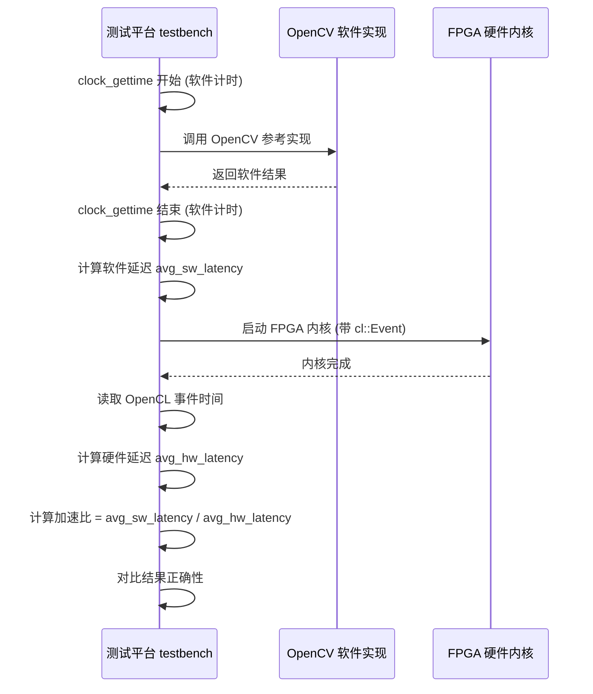

这就像同时给两位厨师计时——一位用传统方法，一位用新式设备——然后比较谁更快，以及做出来的菜是否一样好。

### 8.7.2 `timespec` 的正确使用方式

```cpp
#include <sys/time.h>

// 颜色检测基准测试中的实际模式
const int ITER = 100;  // 迭代次数
struct timespec start_time, end_time;

// 使用 CLOCK_MONOTONIC 确保时间单调递增
clock_gettime(CLOCK_MONOTONIC, &start_time);

for (int i = 0; i < ITER; i++) {
    // 软件参考实现（OpenCV）
    colordetect(in_img, ocv_ref, low_thresh.data(), high_thresh.data());
}

clock_gettime(CLOCK_MONOTONIC, &end_time);

// 计算平均延迟（秒）
// 注意：先算纳秒差再转换，避免大数相乘的精度损失
float diff_latency = (end_time.tv_nsec - start_time.tv_nsec) / 1e9
                   + (end_time.tv_sec - start_time.tv_sec);
float avg_latency = diff_latency / ITER;

printf("Software latency: %.3f ms\n", avg_latency * 1000.0f);
```

**为什么要迭代 100 次取平均？** 就像测量运动员的百米成绩，不能只跑一次——第一次可能因为紧张（冷启动）而偏慢，也可能因为顺风而偏快。跑 100 次取平均才能得到真实水平。

---

## 8.8 多次运行预热策略

"预热"（Warm-up）是基准测试中一个容易被忽视但至关重要的概念。

### 8.8.1 为什么需要预热？

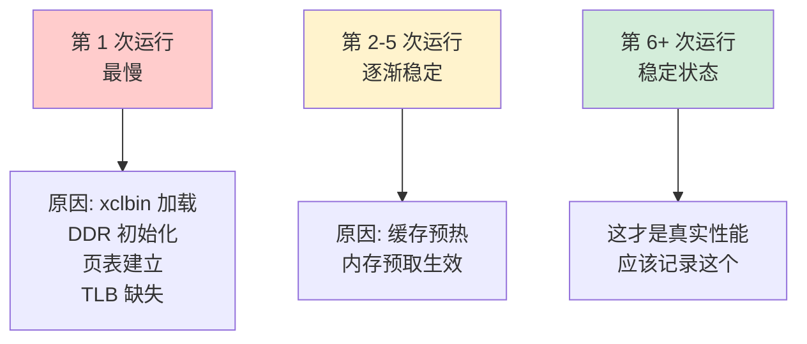

想象你第一次开车去一个新地方——你需要看地图、找路、可能走错几次。但第二次、第三次去，你已经熟悉路线，速度就快多了。FPGA 内核的"第一次运行"也有类似的"找路"开销。

### 8.8.2 预热策略的实现

Vitis Libraries 通过 `-runs` 参数支持多次运行：

```cpp
// solver_benchmarks 中的多次运行模式
int num_runs = 1;  // 默认值，可通过命令行参数修改

// 解析命令行参数
// 用法: ./benchmark -runs 10
for (int i = 0; i < argc; i++) {
    if (strcmp(argv[i], "-runs") == 0) {
        num_runs = atoi(argv[i+1]);
    }
}

// 多次运行，计时包含所有运行
gettimeofday(&tstart, 0);
for (int i = 0; i < num_runs; ++i) {
    q.enqueueTask(kernel);
    q.finish();
}
gettimeofday(&tend, 0);

// 计算平均时间
int total_time = diff(&tend, &tstart);
double avg_time = (double)total_time / num_runs;
printf("Average kernel time: %.2f us\n", avg_time);
```

**最佳实践：** 对于生产级基准测试，建议至少运行 10 次，丢弃第 1-2 次的结果（预热），用后续结果计算平均值和标准差。

---

## 8.9 黄金参考验证：如何证明结果是对的？

性能再好，结果错了也没用。Vitis Libraries 使用两种主要的验证策略。

### 8.9.1 策略一：重构验证（数学定义验证）

这是 `solver_benchmarks` 中 SVD 分解使用的方法。

**核心思想：** 不与 CPU 的结果逐元素对比，而是验证数学关系本身是否成立。

对于 SVD 分解 $A = U \Sigma V^T$，验证方法是：

$$\text{误差} = \|A - U \cdot \Sigma \cdot V^T\|_F$$

其中 $\|\cdot\|_F$ 是 Frobenius 范数（矩阵所有元素平方和的平方根）。如果误差小于阈值（通常是 `1e-4`），则认为通过。

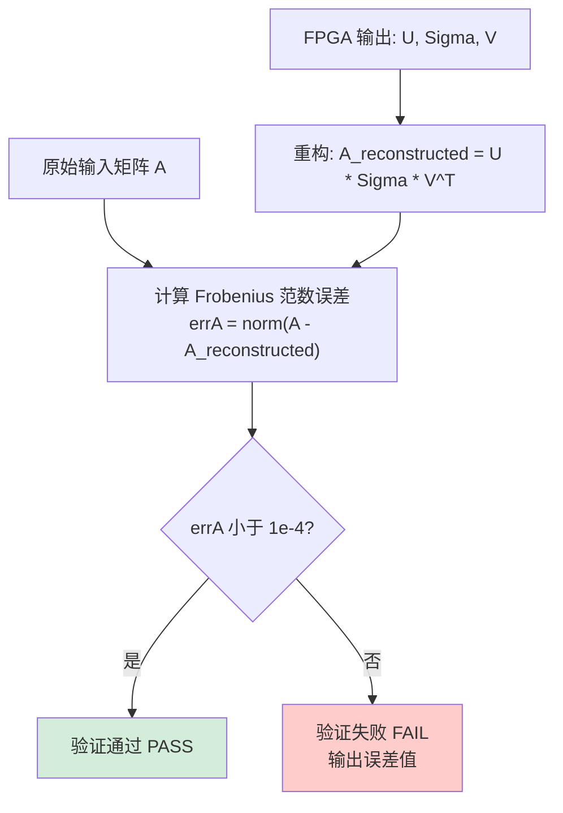

**为什么不直接对比 CPU 结果？** SVD 分解的结果不唯一——$U$ 和 $V$ 的列向量可以乘以 -1 仍然是合法解。如果 FPGA 选择了不同的符号约定，逐元素对比会失败，但数学上两个结果都是正确的。重构验证绕过了这个"哲学问题"。

### 8.9.2 策略二：CPU 参考对比（逐元素对比）

这是密码学（HMAC-SHA1）和图像处理（颜色检测）等领域使用的方法。

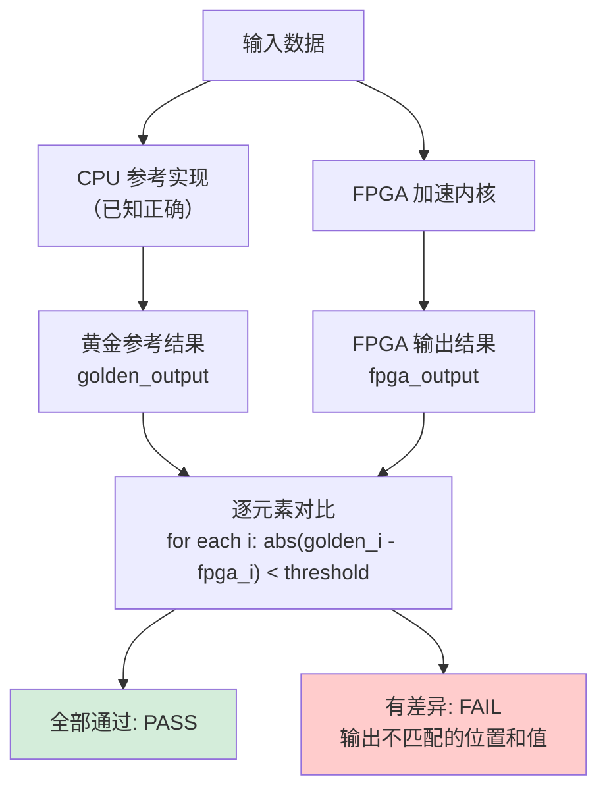

对于密码学操作（如 HMAC-SHA1），结果必须**完全一致**（比特级精确），因为哈希值的任何一位错误都意味着安全漏洞。对于图像处理，通常允许 1-2 个像素值的误差（因为浮点舍入）。

### 8.9.3 两种策略的选择指南

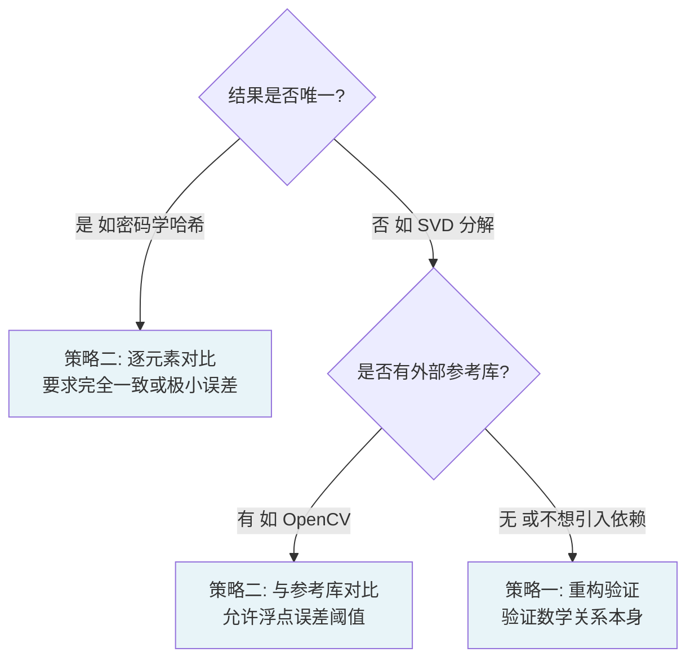

---

## 8.10 各领域验证模式速查表

不同领域根据其数学特性选择了不同的验证策略和误差阈值：

| 领域 | 验证策略 | 误差阈值 | 计时方式 |
|------|---------|---------|---------|
| **线性代数求解器** (SVD) | 重构验证 $\|A - U\Sigma V^T\|_F$ | `1e-4` | `gettimeofday` 墙钟 |
| **密码学** (HMAC-SHA1, AES) | 逐字节对比 | 0（完全一致） | OpenCL 事件 |
| **图像处理** (颜色检测) | 与 OpenCV 对比 | 像素值差 ≤ 1 | `clock_gettime` + OpenCL 事件 |
| **图分析** (PageRank) | 与 CPU 参考对比 | 相对误差 `1e-6` | `gettimeofday` 墙钟 |
| **数据压缩** (GZip) | 解压后与原文对比 | 0（完全一致） | 墙钟 + 吞吐量计算 |
| **量化金融** (Monte Carlo) | 与解析解对比 | 统计误差范围内 | OpenCL 事件 |

---

## 8.11 完整基准测试模板：从零开始写你自己的

综合前面所有知识，这里提供一个可以直接使用的完整模板：

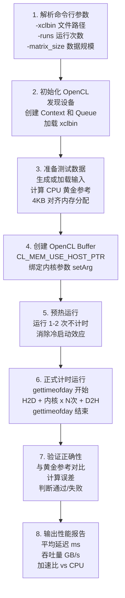

**关键代码片段：**

```cpp
#include <sys/time.h>
#include <xcl2.hpp>

int main(int argc, char* argv[]) {
    // === 步骤 1: 解析参数 ===
    std::string xclbin_path = argv[1];
    int num_runs = 10;  // 默认 10 次

    // === 步骤 2: 初始化 OpenCL ===
    auto devices = xcl::get_xil_devices();
    cl::Context context(devices[0]);
    cl::CommandQueue q(context, devices[0],
                       CL_QUEUE_PROFILING_ENABLE);  // 启用 profiling
    auto xclbin = xcl::read_binary_file(xclbin_path);
    cl::Program program(context, {devices[0]}, xclbin);
    cl::Kernel kernel(program, "my_kernel");

    // === 步骤 3: 准备数据（4KB 对齐）===
    float* input_data;
    posix_memalign((void**)&input_data, 4096, data_size);
    // 填充测试数据...
    // 计算 CPU 黄金参考...

    // === 步骤 4: 创建 Buffer ===
    cl::Buffer buf_in(context,
                      CL_MEM_USE_HOST_PTR | CL_MEM_READ_ONLY,
                      data_size, input_data);
    kernel.setArg(0, buf_in);

    // === 步骤 5: 预热（不计时）===
    q.enqueueMigrateMemObjects({buf_in}, 0);
    q.enqueueTask(kernel);
    q.finish();

    // === 步骤 6: 正式计时 ===
    struct timespec tstart, tend;
    clock_gettime(CLOCK_MONOTONIC, &tstart);

    q.enqueueMigrateMemObjects({buf_in}, 0);  // H2D
    q.finish();

    cl::Event kernel_event;
    for (int i = 0; i < num_runs; ++i) {
        q.enqueueTask(kernel, nullptr, &kernel_event);
    }
    q.finish();

    q.enqueueMigrateMemObjects({buf_out},
                               CL_MIGRATE_MEM_OBJECT_HOST);  // D2H
    q.finish();

    clock_gettime(CLOCK_MONOTONIC, &tend);

    // 计算墙钟时间（毫秒）
    double wall_ms = (tend.tv_sec - tstart.tv_sec) * 1000.0
                   + (tend.tv_nsec - tstart.tv_nsec) / 1e6;
    double avg_wall_ms = wall_ms / num_runs;

    // 计算 OpenCL 事件时间（纯内核，毫秒）
    cl_ulong k_start, k_end;
    kernel_event.getProfilingInfo(CL_PROFILING_COMMAND_START, &k_start);
    kernel_event.getProfilingInfo(CL_PROFILING_COMMAND_END, &k_end);
    double kernel_ms = (k_end - k_start) / 1e6;

    // === 步骤 7: 验证 ===
    bool pass = validate_results(output_data, golden_ref, threshold);

    // === 步骤 8: 报告 ===
    printf("Wall-clock time (avg): %.3f ms\n", avg_wall_ms);
    printf("Kernel-only time:      %.3f ms\n", kernel_ms);
    printf("Data transfer overhead: %.3f ms\n", avg_wall_ms - kernel_ms);
    printf("Validation: %s\n", pass ? "PASS" : "FAIL");

    return pass ? 0 : 1;
}
```

---

## 8.12 常见陷阱与调试指南

### 陷阱 1：指针生命周期问题（最常见！）

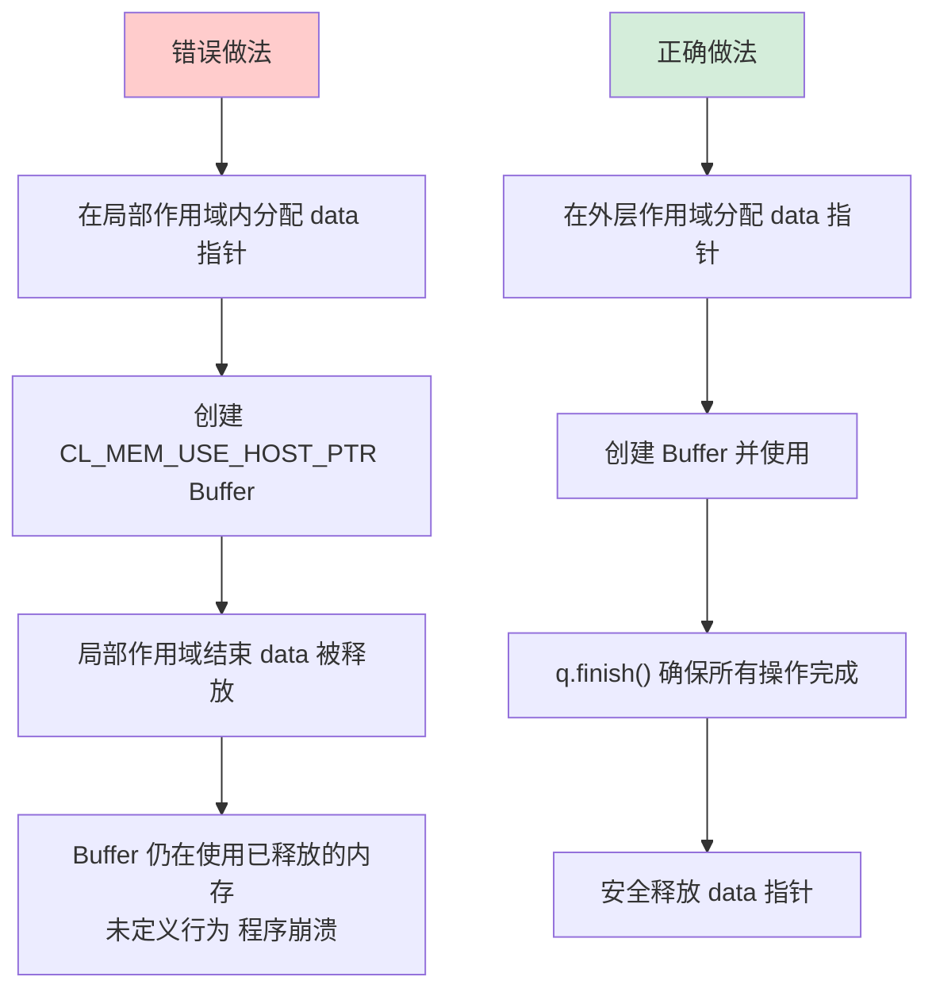

**记住：** 使用 `CL_MEM_USE_HOST_PTR` 时，主机指针的生命周期必须**长于** OpenCL Buffer 的生命周期。

### 陷阱 2：把初始化时间算进内核时间

```
❌ 错误：gettimeofday → [创建 Kernel 对象] → [H2D] → [执行] → gettimeofday
✅ 正确：[创建 Kernel 对象] → gettimeofday → [H2D] → [执行] → [D2H] → gettimeofday
```

创建 `cl::Kernel` 对象可能需要几毫秒，这是一次性开销，不应该算进每次运行的时间。

### 陷阱 3：使用 `CLOCK_REALTIME` 而非 `CLOCK_MONOTONIC`

```
❌ clock_gettime(CLOCK_REALTIME, &t)   // 可能被 NTP 回拨，产生负时间差
✅ clock_gettime(CLOCK_MONOTONIC, &t)  // 永远单调递增，安全可靠
```

### 陷阱 4：忘记启用 OpenCL Profiling

```cpp
// 必须在创建 CommandQueue 时启用 profiling，否则 getProfilingInfo 会失败
cl::CommandQueue q(context, device,
                   CL_QUEUE_PROFILING_ENABLE);  // 不能少这个标志！
```

---

## 8.13 调试工作流：从软件仿真到上板测试

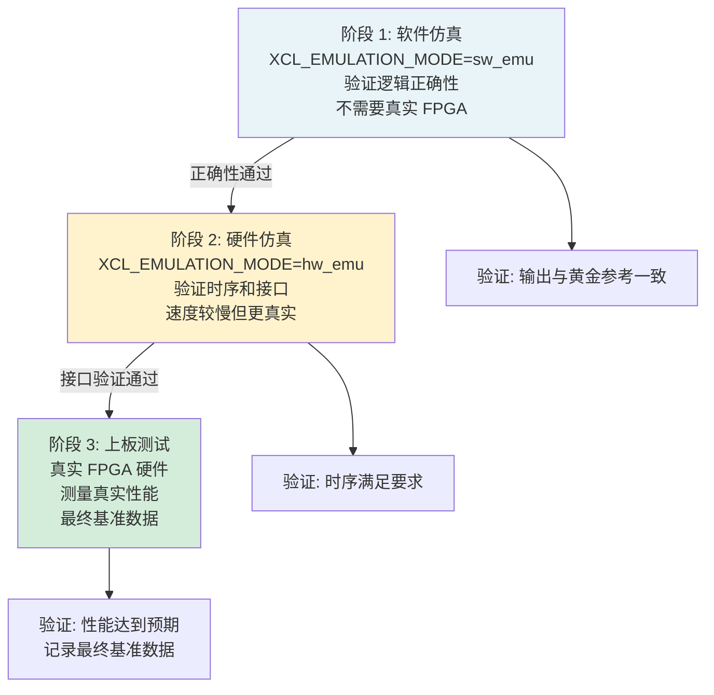

**黄金法则：** 永远先在软件仿真（`sw_emu`）中验证正确性，再上板测试性能。在真实硬件上调试逻辑错误的成本是软件仿真的 10 倍以上。

---

## 8.14 本章总结：基准测试的五条黄金守则

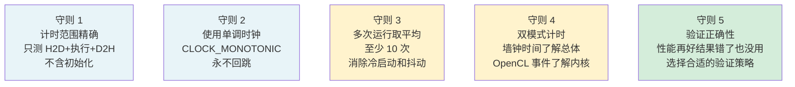

**守则 1：计时范围精确。** 只测量 H2D 传输 + 内核执行 + D2H 传输，不包含 OpenCL 上下文初始化和内核对象创建。

**守则 2：使用单调时钟。** 新代码始终使用 `clock_gettime(CLOCK_MONOTONIC, ...)` 而非 `gettimeofday`，避免 NTP 同步导致的时间回跳。

**守则 3：多次运行取平均。** 至少运行 10 次，可选择丢弃前 1-2 次预热结果，用稳定状态的数据计算平均值。

**守则 4：双模式计时互补。** 墙钟时间反映用户真实体验（含数据传输），OpenCL 事件时间反映内核计算效率。两者相减得到数据传输开销，这是优化方向的关键指标。

**守则 5：验证正确性不可省略。** 根据领域特性选择验证策略：密码学用逐字节对比（零误差），线性代数用重构验证（允许浮点误差），图像处理用与 OpenCV 对比（允许 1-2 像素误差）。

---

## 结语：你现在掌握了什么？

恭喜你完成了《Vitis Libraries 入门指南》的全部八章！

回顾一下这段旅程：

- **第 1 章**：你了解了 FPGA 加速计算的大局观，知道了为什么 Vitis Libraries 存在。
- **第 2 章**：你掌握了 L1/L2/L3 的分层架构，这是理解整个项目的骨架。
- **第 3 章**：你追踪了数据从 CPU 到 FPGA 再回来的完整旅程。
- **第 4 章**：你学会了读懂 `.cfg` 连接配置文件，理解了 HBM/DDR 内存映射。
- **第 5-7 章**：你深入探索了数据分析、图分析、编解码和量化金融四个具体领域。
- **第 8 章（本章）**：你掌握了贯穿所有领域的通用基准测试模式。

现在，你已经具备了：
- 读懂任何 Vitis Libraries 基准测试代码的能力
- 理解性能数字背后含义的能力
- 从零开始编写自己的 FPGA 加速基准测试的能力

FPGA 加速的世界等待着你去探索。每一个领域都有未被优化的算法，每一个应用都有可以加速的瓶颈。带着这本指南给你的知识，去构建更快的世界吧！

---

*"基准测试的目标不是证明我们有多快，而是理解我们在哪里慢。"*