# 第八章：添加你自己的加速器——模式、约定与从哪里开始

> **学习目标**：把前七章学到的所有知识融合成可操作的指导方案——如何为新工作选择正确的层次、遵循"内核-连接-主机-基准测试"四文件模式、使用 Python/BLAS 验证层，以及如何驾驭 DSP 元配置工具链。

---

## 8.1 你已经走了多远

想象你刚刚学完驾校的理论课：你知道方向盘是什么、油门踏板怎么用、交通规则是怎么回事。现在是时候真正上路了。

在前七章里，你已经理解了：
- FPGA 加速的大图景（第 1 章）
- L1/L2/L3 的三层架构（第 2 章）
- 数据如何从 CPU 流向 FPGA 再回来（第 3 章）
- 硬件连接配置文件的秘密（第 4 章）
- 基准测试与乒乓缓冲技巧（第 5 章）
- 数据库和图分析的深层机制（第 6 章）
- 编解码加速与量化金融引擎（第 7 章）

本章是**最终考试与实战手册**。我们将把这一切整合成一套清晰的行动指南：当你想添加自己的加速器时，从哪里下手，怎么一步步走下去。

---

## 8.2 先想清楚：你的工作属于哪一层？

添加加速器之前，最重要的第一步是**选层**。这就像建房子时先决定要建地基、墙体还是屋顶装饰——弄错了层次，后面的工作会事倍功半。

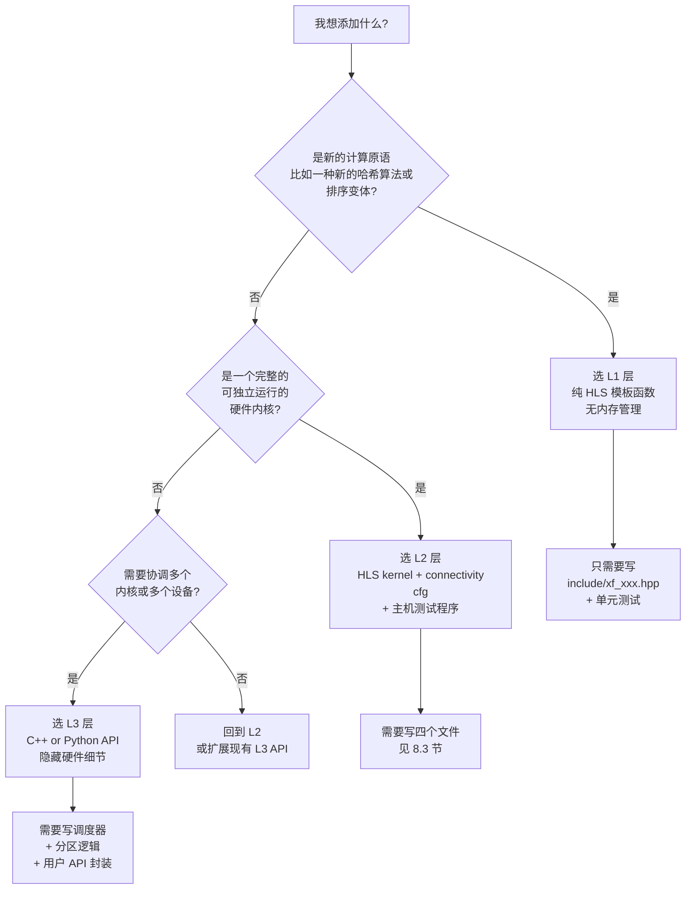

**走读这张图**：从顶部的问题出发，每个菱形代表一个决策点。如果你只是在已有 L2 内核的基础上重新组合逻辑，大多数时候选 L2 就够了。只有当你需要跨设备调度、自动分区或对用户隐藏硬件细节时，才需要动 L3。

### 三层的日常类比

把 Vitis Libraries 想象成一家餐厅：

- **L1 = 食材**：原料（面粉、鸡蛋、黄油），厨师才会直接用这些，普通顾客看不到。
- **L2 = 菜肴**：一道完整的菜，有配方（HLS kernel）、摆盘要求（connectivity.cfg）、上桌服务（host code）。
- **L3 = 套餐/外卖平台**：顾客只需要说"我要一份商务套餐"，背后的采购、烹饪、配送都被隐藏了。

---

## 8.3 四文件模式：L2 加速器的标准结构

如果你决定在 L2 层添加新内核，恭喜你掌握了整个 Vitis Libraries 中最常见的工作模式。每一个 L2 加速器，无论是 GZIP 压缩、数据库 Hash Join 还是图分析，都遵循同一套四文件约定。

把这四个文件想象成一支交响乐团的四个声部——缺了任何一个，乐曲就不完整。

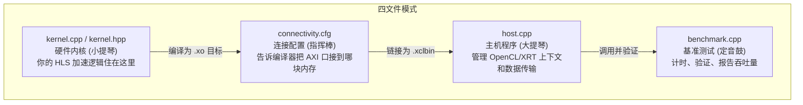

**走读这张图**：

1. **kernel.cpp** 是纯粹的 HLS C++ 代码，定义你的加速逻辑。它会被 Vitis 编译成硬件描述文件（.xo）。
2. **connectivity.cfg** 是"接线图"，告诉 Vitis 如何把内核的 AXI 内存端口绑定到 DDR/HBM 物理存储槽。内核再快，接错了线也白搭。
3. **host.cpp** 是 CPU 侧的指挥官，用 OpenCL 或 XRT API 加载 .xclbin、分配缓冲区、触发内核、等待完成。
4. **benchmark.cpp** 是性能检察官，用墙上时钟或 OpenCL 事件精确测量每一阶段的耗时，验证结果正确性。

### 真实目录布局

```
my_domain/
└── L2/
    └── benchmarks/
        └── my_accelerator/
            ├── kernel/
            │   ├── my_kernel.cpp       ← 硬件内核
            │   └── my_kernel.hpp
            ├── host/
            │   ├── main.cpp            ← 基准测试主程序
            │   └── xcl2.hpp            ← 复用自 common/
            ├── Makefile
            └── conn_u280.cfg           ← 连接配置
```

这个布局几乎在每个领域库里都能找到——压缩、数据库、图分析、安全，都用同样的骨架。

---

## 8.4 动手写你的第一个 Kernel

让我们用 `data_analytics_text_geo_and_ml` 下的 `regex_compilation_core_l1` 作为示范。正则表达式编译是一个很好的学习案例，因为它展示了 L1 原语如何被组装成更高层的功能。

### L1 原语的结构

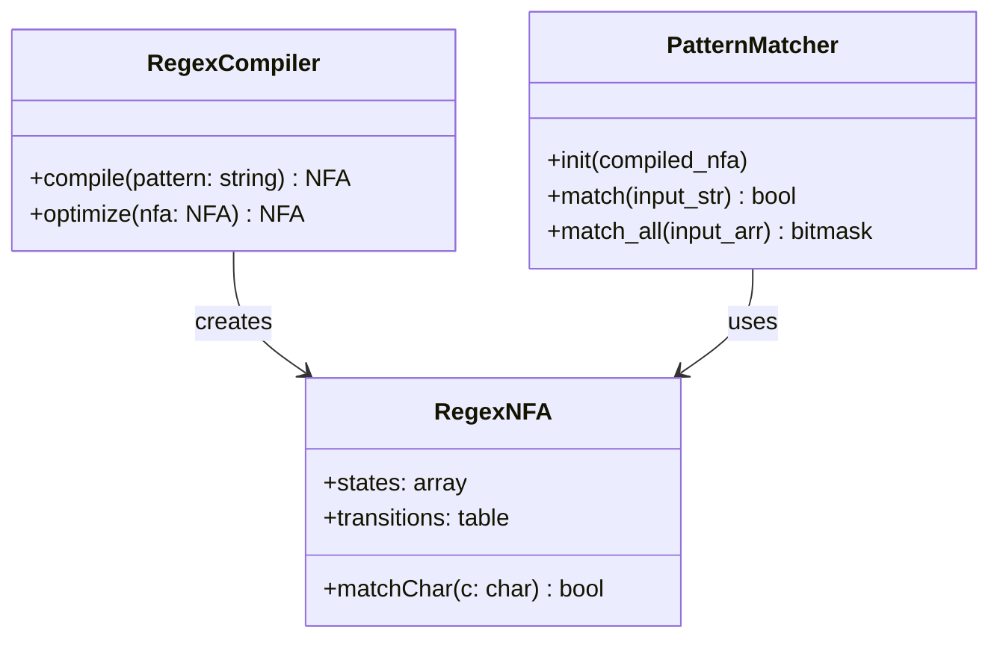

这个类图展示了三个核心概念的关系：`RegexCompiler` 把人类可读的正则表达式模式编译成 NFA（非确定性有限自动机，可以理解为一张"状态转移地图"），`PatternMatcher` 使用这张地图在输入文本上执行匹配。

### 写 L1 原语的三条铁律

**铁律一：只用 HLS 支持的语法**

L1 代码会被 Vitis HLS 综合成实际的逻辑门。这意味着：
- 不能用 `new` 和 `delete`（没有动态内存）
- 不能用 `std::vector`（大小必须在编译期确定）
- 所有循环都需要 `#pragma HLS PIPELINE` 或 `#pragma HLS UNROLL` 提示

```cpp
// L1 原语示例 —— 正确的写法
template<int MAX_STATES>
void regexMatch(
    ap_uint<8>* input,     // 输入字符流
    int input_len,
    ap_uint<MAX_STATES> transition_table[256][MAX_STATES], // 状态转移表
    bool& matched           // 输出：是否匹配
) {
#pragma HLS PIPELINE II=1   // 每个时钟周期处理一个字符
    ap_uint<MAX_STATES> current_state = 1; // 初始状态
    for (int i = 0; i < input_len; i++) {
        current_state = transition_table[input[i]][current_state];
    }
    matched = current_state[0]; // 状态 0 为接受状态
}
```

**铁律二：模板参数控制硬件规模**

注意上面的 `template<int MAX_STATES>`。在 FPGA 硬件里，你不能运行时决定"要多少状态"——硬件规模是编译时确定的。模板参数是控制这件事的标准方式。

**铁律三：流接口比块接口快**

如果你的数据是流式的（字节一个接一个到来），使用 `hls::stream<>` 接口，不要用数组。流接口允许内核在数据传输的同时进行计算，实现真正的流水线。

---

## 8.5 写 Connectivity 配置

回顾第 4 章——连接配置文件就像"接线工程师的施工图"。写好这个文件直接决定你的内核能发挥多少性能。

```mermaid
flowchart LR
    subgraph 你的内核
        P0["m_axi port: gmem0\n(读输入数据)"]
        P1["m_axi port: gmem1\n(写输出数据)"]
        P2["m_axi port: gmem2\n(读查找表)"]
    end
    
    subgraph HBM 物理存储
        B0["HBM[0]\n带宽 14 GB/s"]
        B1["HBM[1]\n带宽 14 GB/s"]
        B2["HBM[2]\n带宽 14 GB/s"]
    end

    P0 -->|sp=myKernel.gmem0:HBM[0]| B0
    P1 -->|sp=myKernel.gmem1:HBM[1]| B1
    P2 -->|sp=myKernel.gmem2:HBM[2]| B2
```

**走读这张图**：每个内核的 AXI 内存端口（gmem0、gmem1、gmem2）都应该连接到**不同的** HBM 存储槽。就像三个人同时去三个不同的书架取书，比三个人争抢同一个书架快得多。

### 最小可用的 connectivity.cfg 模板

```ini
[connectivity]
# 1. 声明你的内核实例数量（可选，默认 1 个）
nk=myKernel:1:myKernel_1

# 2. 把 AXI 端口绑定到 HBM 槽
# 格式：sp=<内核实例名>.<端口名>:<存储槽>
sp=myKernel_1.gmem0:HBM[0]
sp=myKernel_1.gmem1:HBM[1]
sp=myKernel_1.gmem2:HBM[2]

# 3. 可选：锁定内核到特定 SLR（超逻辑区域）以优化布线
# slr=myKernel_1:SLR0
```

### 常见错误：把多个高带宽端口绑定到同一个槽

```ini
# 错误示例 —— 读写都走 HBM[0]，带宽砍半！
sp=myKernel_1.gmem0:HBM[0]  # 输入
sp=myKernel_1.gmem1:HBM[0]  # 输出（错！应该换一个槽）
```

---

## 8.6 写 Host 程序

主机程序是你加速器的"经理人"——它负责招募员工（加载 .xclbin）、分配办公室（分配 OpenCL 缓冲区）、布置工作（把数据发给 FPGA）、等待汇报（同步结果）。

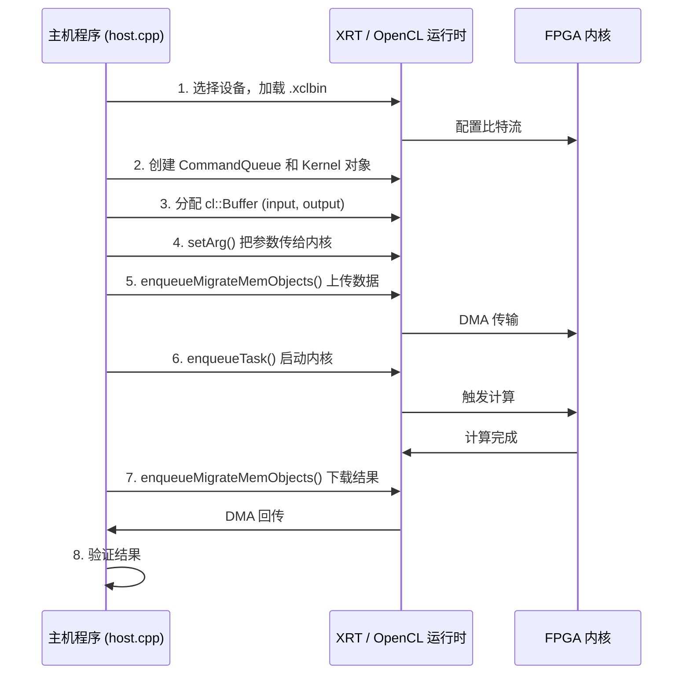

**走读这张图**：整个序列分成三大阶段——初始化（步骤 1-2）、数据传输+计算（步骤 3-7）、验证（步骤 8）。其中步骤 5 和 6 可以流水线化（回忆第 5 章的乒乓缓冲），让传输和计算重叠。

### 标准 Host 程序骨架

```cpp
#include "xcl2.hpp"        // Vitis 通用辅助函数
#include <vector>
#include <iostream>

int main(int argc, char* argv[]) {
    // --- 1. 初始化 ---
    std::string xclbinPath = argv[1];
    
    // 查找并选择 FPGA 设备
    auto devices = xcl::get_xil_devices();
    auto device = devices[0];
    
    // 创建 OpenCL 上下文和命令队列
    cl::Context context(device);
    cl::CommandQueue queue(context, device, 
        CL_QUEUE_PROFILING_ENABLE |    // 允许精确计时
        CL_QUEUE_OUT_OF_ORDER_EXEC_MODE_ENABLE); // 乱序执行
    
    // 加载 xclbin 并创建内核
    auto xclbin = xcl::import_binary_file(xclbinPath);
    cl::Program program(context, {device}, xclbin);
    cl::Kernel kernel(program, "myKernel");
    
    // --- 2. 准备数据 ---
    const int DATA_SIZE = 1024 * 1024; // 1M 元素
    std::vector<int, aligned_allocator<int>> input(DATA_SIZE);
    std::vector<int, aligned_allocator<int>> output(DATA_SIZE);
    // ... 填充测试数据 ...
    
    // --- 3. 分配设备缓冲区 ---
    // XCL_MEM_DDR_BANK0 指定连接到 DDR Bank 0（与 .cfg 文件对应！）
    cl_mem_ext_ptr_t inExt = {XCL_MEM_DDR_BANK0, input.data(), 0};
    cl::Buffer inputBuf(context, 
        CL_MEM_READ_ONLY | CL_MEM_EXT_PTR_XILINX | CL_MEM_USE_HOST_PTR,
        sizeof(int) * DATA_SIZE, &inExt);
    cl::Buffer outputBuf(context,
        CL_MEM_WRITE_ONLY, sizeof(int) * DATA_SIZE);
    
    // --- 4. 设置内核参数 ---
    kernel.setArg(0, inputBuf);
    kernel.setArg(1, outputBuf);
    kernel.setArg(2, DATA_SIZE);
    
    // --- 5. 执行 ---
    // 上传数据到 FPGA
    queue.enqueueMigrateMemObjects({inputBuf}, 0); // 0 = 主机到设备
    // 启动内核
    queue.enqueueTask(kernel);
    // 下载结果
    queue.enqueueMigrateMemObjects({outputBuf}, CL_MIGRATE_MEM_OBJECT_HOST);
    queue.finish(); // 等待所有操作完成
    
    // --- 6. 验证 ---
    // ... 比较 output 与 CPU 参考计算结果 ...
    
    return 0;
}
```

---

## 8.7 BLAS Python API：验证层的最佳实践

现在我们来看本章的第一个重点模块：`blas_python_api`。

把它想象成**一位严格的质检员**，站在 FPGA 加速器和真实应用之间。每当 FPGA 算完一批矩阵乘法，这位质检员就拿着 NumPy 算出来的"标准答案"，逐元素核对 FPGA 的输出是否正确。

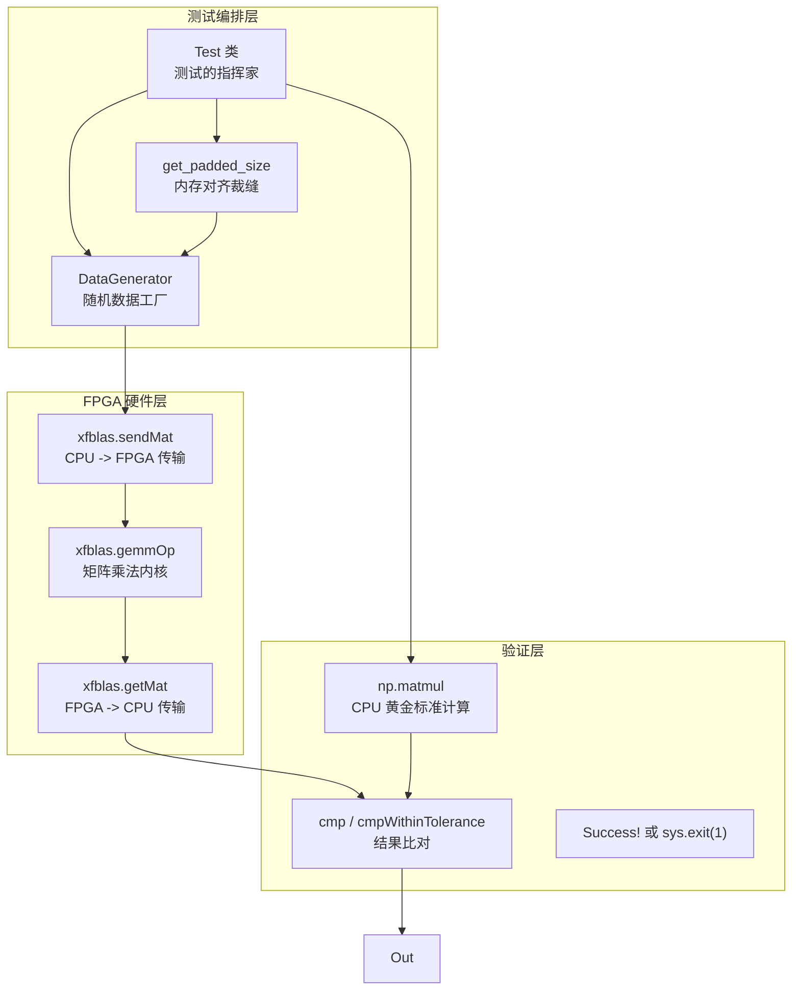

**走读这张图**：`Test` 类是中央协调者。它同时走两条路——左边走 FPGA 硬件路径（生成数据、填充对齐、上传、计算、下载），右边走 CPU 参考路径（NumPy matmul）。最后在验证层汇合，进行结果比对。

### 为什么需要两种比对策略？

这个设计体现了对**数值计算本质**的深刻理解：

```mermaid
flowchart TD
    A[FPGA 计算完成] --> B{数据类型是什么?}
    B -->|int16 整数| C["cmp: np.array_equal\n要求完全一致\n因为整数运算是确定性的"]
    B -->|float32 浮点| D["cmpWithinTolerance: np.allclose\nrtol=0.001, atol=0.00001\n允许浮点舍入误差"]
    C --> E{完全一致?}
    D --> F{在容差范围内?}
    E -->|是| G[打印 Success]
    E -->|否| H[保存 C.np 和 C_cpu.np\n然后 sys.exit(1)]
    F -->|是| G
    F -->|否| H
```

**整数比对**使用精确匹配，因为 16 位整数乘法在任何正确的硬件上结果都应该完全相同。如果不同，一定是真的 bug。

**浮点比对**使用容差匹配（`rtol=0.001` 允许 0.1% 的相对误差），因为 FPGA 浮点单元和 CPU SSE/AVX 单元的舍入行为可能有细微差别——这是正常的，不是 bug。

### 内存对齐：FPGA 的"穿衣规则"

FPGA 计算内核就像一位有强迫症的裁缝，要求衣服（数据）必须是固定尺寸的整数倍。`get_padded_size` 就是帮你"填充"数据到合适尺寸的工具：

```python
def get_padded_size(self, size, min_size):
    # 找到不小于 size 的最小 min_size 倍数
    size_padded = int(math.ceil(np.float32(size) / min_size) * min_size)
    return size_padded

# 示例：
# 原始矩阵 100x200，内核要求 64 的倍数
# padded_m = ceil(100/64) * 64 = 2*64 = 128
# padded_k = ceil(200/64) * 64 = 4*64 = 256
# 矩阵被"扩大"了，多出的元素填 0，不影响计算结果
```

### 完整的 GEMM 测试流程

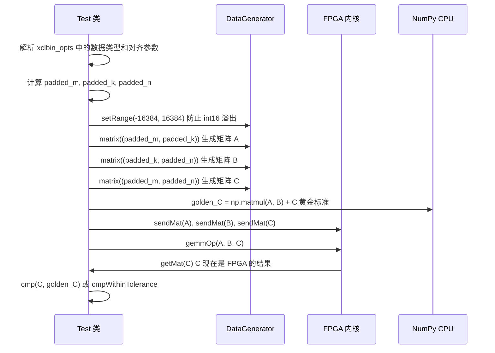

### 整数溢出：一个常见的陷阱

当你使用 `int16` 类型时，注意这个安全范围公式：

$$\text{max\_val} \leq \sqrt{\frac{32767}{K}}$$

其中 K 是矩阵的内维（累加次数）。如果 K=1024，则 max_val 约为 5。默认的 ±16384 在 K=1 时安全，但在 K=1024 时会造成溢出！

```python
import math
k = 1024
max_int16 = 32767
# 安全的数据范围
max_val = int(math.sqrt(max_int16 / k))
print(f"K={k} 时的安全范围: [-{max_val}, {max_val}]")  # 约 5
```

---

## 8.8 DSP 元配置：智能化的参数向导

现在是本章第二个重点：`dsp_meta_configuration`。

把它想象成一台**智能数控机床的配置向导**——不是普通的参数填写表格，而是一个能理解参数之间关联关系的对话式系统。当你修改 FFT 点数时，它会自动重新计算缓冲区大小的合法范围，就像电子表格里的公式自动重算一样。

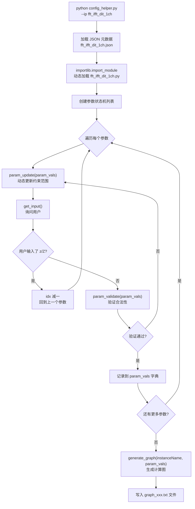

**走读这张图**：整个流程是一个状态机循环。关键是 `param_update` 在每个参数处理前都会被调用，实现**前向链式约束传播**——改变一个参数，后续参数的合法范围自动更新。

### 三阶段架构的类比

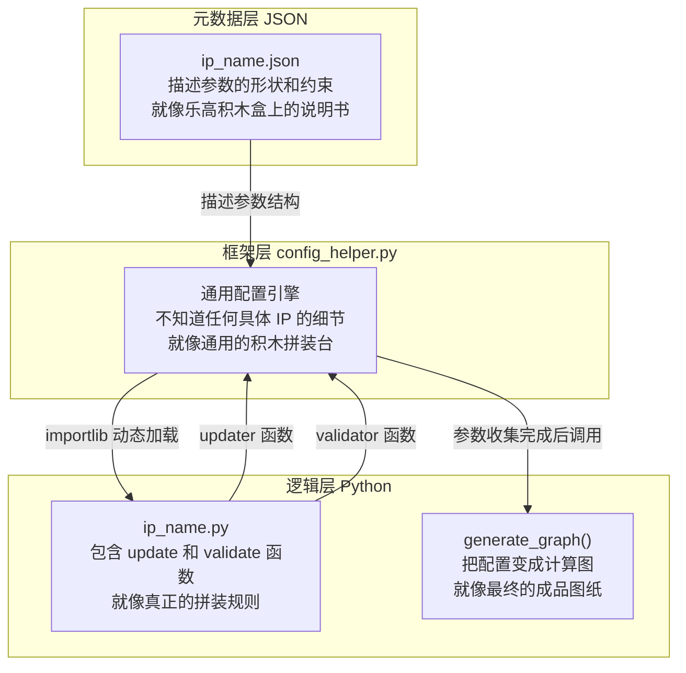

**这个设计的精妙之处**：`config_helper.py`（框架）完全不知道 FFT 或 FIR 是什么。它只知道"从 JSON 读参数列表，动态加载对应 Python 模块，然后询问用户"。具体的 IP 知识全部封装在各自的 JSON + Python 模块对里。这就是**开放-封闭原则**：对扩展开放（加新 IP 只需新增两个文件），对修改封闭（框架代码无需改动）。

### 动态约束传播：电子表格类比

想象一个电子表格，其中单元格 B1 包含公式 `=A1*2`。当你修改 A1 时，B1 自动重算。`dsp_meta_configuration` 的 `updater` 函数就是这个"公式"：

```python
def update_twiddle_type(param_vals):
    """
    根据已选的数据类型，动态计算旋转因子类型的合法值。
    就像 Excel 公式：当 DATA_TYPE 改变时，自动更新下拉选项。
    """
    data_type = param_vals.get("DATA_TYPE", "")
    
    if data_type == "cint16":
        # int16 数据只能用 cint16 旋转因子
        return {"enum": ["cint16"]}
    elif data_type == "cfloat":
        # float 数据可以用 cfloat 旋转因子
        return {"enum": ["cfloat"]}
    else:
        return {"enum": ["cint16", "cfloat"]}
```

### 回溯机制：配置过程中的"撤销"

`z/Z` 回溯就像文字处理器里的 Ctrl+Z。当你在配置第 10 个参数时突然意识到第 3 个参数填错了，不需要重启整个会话：

```
请输入 FFT_N 的值 [默认: 64]: 1024
请输入 twiddle_type 的值 [默认: cint16]: z    <- 输入 z
回退到上一个参数...
请输入 FFT_N 的值 [默认: 64, 当前: 1024]: 256  <- 修改
```

### 添加新 IP 的三步流程

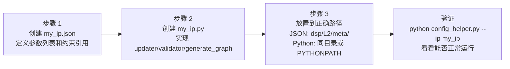

**步骤 1 - JSON 元数据**：

```json
{
  "parameters": [
    {
      "name": "MY_PARAM_N",
      "type": "int",
      "updater": {"function": "update_n"},
      "validator": {"function": "validate_n"}
    },
    {
      "name": "MY_PARAM_TYPE",
      "type": "typename",
      "updater": {"function": "update_type"},
      "validator": {"function": "validate_type"}
    }
  ]
}
```

**步骤 2 - Python 逻辑**：

```python
# my_ip.py

def update_n(param_vals):
    """返回 MY_PARAM_N 的合法值范围"""
    return {"enum": [16, 32, 64, 128, 256]}

def validate_n(param_vals):
    """验证用户输入的 MY_PARAM_N 是否合法"""
    n = param_vals.get("MY_PARAM_N")
    valid = n in [16, 32, 64, 128, 256]
    return {
        "is_valid": valid,
        "err_message": f"N 必须是 16/32/64/128/256，你输入了 {n}"
    }

def update_type(param_vals):
    """根据 MY_PARAM_N 的值，动态决定 TYPE 的合法选项"""
    n = param_vals.get("MY_PARAM_N", 64)
    if n >= 128:
        return {"enum": ["cint16", "cfloat"]}  # 大 N 时支持更多类型
    return {"enum": ["cint16"]}  # 小 N 时只支持整数

def validate_type(param_vals):
    t = param_vals.get("MY_PARAM_TYPE", "")
    valid_types = ["cint16", "cfloat"]
    valid = t in valid_types
    return {"is_valid": valid, "err_message": f"未知类型: {t}"}

def generate_graph(instance_name, param_vals):
    """用最终参数生成计算图描述"""
    n = param_vals["MY_PARAM_N"]
    t = param_vals["MY_PARAM_TYPE"]
    
    graph_str = f"""
// 自动生成 - 请勿手动编辑
// 实例: {instance_name}
myIP_{t}<{n}> {instance_name}(
    // 端口连接在此处填写
);
"""
    return {"graph": graph_str}
```

---

## 8.9 整合视角：四个关键决策树

在真实工作中，你会在每个阶段面临一系列决策。下面的图把最常见的决策点整合在一起：

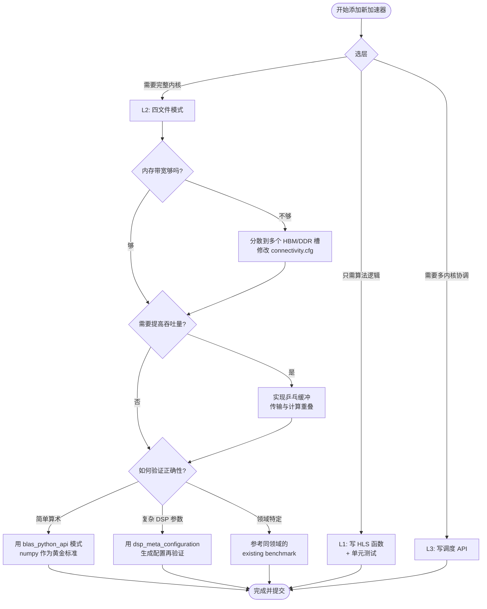

---

## 8.10 验证策略：从简单到严格

验证是整个流程的最后防线。参考 `blas_python_api` 的设计哲学，建立你自己的验证层：


**验证的黄金三原则**：

1. **始终有 CPU 参考实现**：不管你的 FPGA 内核多么复杂，总是先用 NumPy、C++ 标准库或其他可信实现算一遍"正确答案"，再和 FPGA 结果比对。

2. **整数用精确匹配，浮点用容差匹配**：参考 `blas_python_api` 的 `cmp` 和 `cmpWithinTolerance` 设计——不要对整数用容差（这会掩盖真正的 bug），也不要对浮点用精确匹配（这会产生大量假阳性）。

3. **失败时保存诊断文件**：当验证失败时，把实际结果和期望结果都保存到文件，并以非零状态码退出，方便 CI/CD 流水线自动检测失败。

---

## 8.11 常见反模式与如何避免

多年来，Vitis Libraries 的贡献者们踩过不少坑。这是一份"不要这样做"的清单：

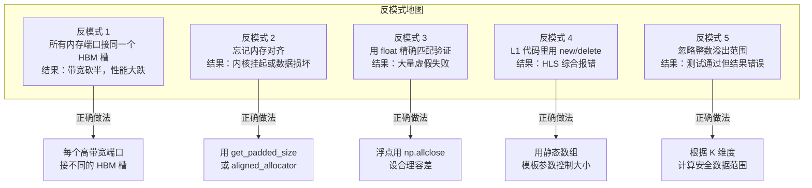

---

## 8.12 端到端示例：添加一个 1D FFT 加速器

让我们把所有知识串联起来，走一遍完整的流程，添加一个假设的 1D FFT 加速器：

### 第一步：选层和规划

```
目标：加速 1D FFT 变换
规模：支持 512 到 16384 点，float32 输入
需要：完整的硬件内核 + 主机程序
决策：选 L2 层，使用四文件模式
```

### 第二步：写内核（kernel.cpp）

```cpp
// fft_kernel.cpp
#include "hls_stream.h"
#include "ap_fixed.h"

// 使用 Vitis DSP Library 的 L1 FFT 原语
#include "vitis_fft/hls_ssr_fft.h"

template<int N>
void fft1d_kernel(
    hls::stream<ap_axiu<64,0,0,0>>& in_stream,   // 复数输入流
    hls::stream<ap_axiu<64,0,0,0>>& out_stream,  // 复数输出流
    int num_frames                                 // 处理帧数
) {
#pragma HLS INTERFACE axis port=in_stream
#pragma HLS INTERFACE axis port=out_stream
#pragma HLS INTERFACE s_axilite port=num_frames bundle=control
#pragma HLS INTERFACE s_axilite port=return bundle=control

    // 内部实现：调用 L1 FFT 原语
    for (int frame = 0; frame < num_frames; frame++) {
#pragma HLS LOOP_TRIPCOUNT min=1 max=100
        // 调用 xf::dsp::fft::fft1d<N>() ...
    }
}
```

### 第三步：写连接配置（conn_u280.cfg）

```ini
[connectivity]
nk=fft1d_kernel:2:fft1d_0,fft1d_1   # 两个并行内核实例

# 内核 0：输入来自 HBM[0]，输出去 HBM[1]
sp=fft1d_0.in_stream:HBM[0]
sp=fft1d_0.out_stream:HBM[1]

# 内核 1：输入来自 HBM[2]，输出去 HBM[3]
sp=fft1d_1.in_stream:HBM[2]
sp=fft1d_1.out_stream:HBM[3]

# 锁定到不同 SLR 优化布线
slr=fft1d_0:SLR0
slr=fft1d_1:SLR1
```

### 第四步：写主机程序（host.cpp）

参考 8.6 节的骨架，加入 FFT 特有的逻辑——生成测试信号（已知频率的正弦波），运行 FPGA FFT，然后和 CPU 的 FFT 结果比对。

### 第五步：写验证层（使用 BLAS 模式）

```python
# test_fft.py —— 模仿 blas_python_api 的验证模式
import numpy as np
import sys

class FFTTest:
    def test_fft1d(self, n, xclbin_opts):
        # 生成已知输入：1024 Hz 正弦波
        t = np.arange(n) / n
        input_signal = np.cos(2 * np.pi * 5 * t).astype(np.float32)
        
        # CPU 参考计算
        golden_output = np.fft.fft(input_signal)
        
        # FPGA 计算（通过 OpenCL）
        # ... 调用 xclbin ...
        fpga_output = ...
        
        # 浮点数用容差比对
        if np.allclose(np.abs(fpga_output), np.abs(golden_output), 
                       rtol=1e-3, atol=1e-5):
            print(f"FFT N={n}: 验证通过!")
        else:
            print(f"FFT N={n}: 验证失败!")
            np.savetxt("fpga_out.txt", np.abs(fpga_output))
            np.savetxt("cpu_out.txt", np.abs(golden_output))
            sys.exit(1)
```

### 第六步：如果是 DSP 类 IP，用 dsp_meta_configuration

如果你的 FFT 加速器有很多可配置参数（点数、数据类型、旋转因子精度等），按照 8.8 节的三步流程创建 `fft1d.json` 和 `fft1d.py`，然后运行：

```bash
python dsp/L2/meta/config_helper.py --ip fft1d --outdir ./output
```

系统会引导你逐个配置每个参数，并在你修改一个参数时自动更新其他参数的合法范围，最终生成 `graph_fft1d_myInstance.txt`。

---

## 8.13 提交前的检查清单

在把你的加速器提交到 Vitis Libraries 之前，逐条检查：

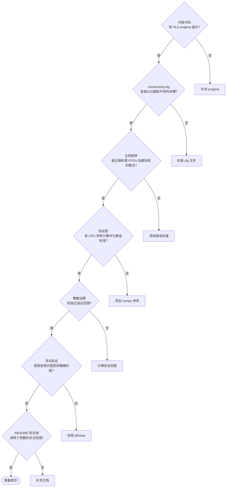

---

## 8.14 全书回顾：你已经掌握了什么

走到这里，你已经走完了整个 Vitis Libraries 的学习旅程。让我们用一张图把八章的知识点串联起来：

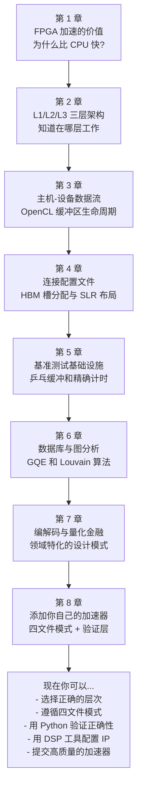

---

## 8.15 下一步：资源与社区

你的旅程并没有在这里结束。以下是继续深入的路径：

**官方资源**：
- [Vitis Libraries GitHub](https://github.com/Xilinx/Vitis_Libraries)：查看最新的内核实现和示例
- [AMD/Xilinx 文档中心](https://docs.amd.com)：HLS 用户指南、XRT API 参考
- Vitis HLS 用户指南：理解 `#pragma HLS` 指示的所有选项

**实践建议**：

1. **从复制开始**：找一个和你目标最接近的现有加速器（比如 GZIP 压缩或 AES 加密），完整地理解它的四个文件，然后以它为模板开始修改。

2. **先 CPU 后 FPGA**：总是先在 CPU 上实现你的算法，确保正确，然后再迁移到 HLS。

3. **从小 N 开始**：先用最小的参数（最小的矩阵、最短的数据）验证功能正确性，再测试大规模性能。

4. **利用 DSP 配置工具**：如果你在 DSP 领域工作，`dsp_meta_configuration` 会帮你避免大量参数配置错误。

5. **用 Python 验证**：参考 `blas_python_api` 的模式，为你的每个加速器建立 Python 验证脚本，集成进 CI/CD 流水线。

---

## 本章小结

在这最后一章，我们综合了整本书的知识，形成了可操作的行动指南：

**核心概念**：

- **选层决策**：新计算原语 → L1；完整可运行内核 → L2（四文件模式）；多内核协调 → L3。

- **四文件模式**：`kernel.cpp`（逻辑）+ `connectivity.cfg`（接线）+ `host.cpp`（指挥）+ `benchmark.cpp`（检测），缺一不可。

- **BLAS Python 验证层**：始终用 NumPy 作为 CPU 黄金标准；整数用精确匹配，浮点用容差匹配；失败时保存诊断文件并非零退出。

- **DSP 元配置**：JSON 描述"是什么"，Python 模块描述"怎么做"，`config_helper.py` 是通用框架；`z/Z` 回溯让探索参数空间像撤销键一样自然；动态约束传播让参数之间的联动关系自动生效。

- **验证金字塔**：功能正确性 → 随机统计测试 → 边界值测试 → 性能验证，层层递进。

现在，你已经准备好添加自己的加速器了。FPGA 的算力在等待你来解锁。

---

*《Vitis Libraries 初学者指南》完*