# 第七章：领域深度探索——编解码加速与量化金融定价引擎

> **本章学习目标：** 深入研究两个风格迥异的领域加速器——图像编解码流水线（JPEG、WebP、JXL）和金融定价引擎（蒙特卡洛期权、Hull-White 三叉树）——看清同一套"主机-内核"模式是如何适配截然不同的数学工作负载的。

---

## 7.1 两个世界，一套骨架

想象你开了一家"定制工厂"。无论你生产汽车零件还是精密手术器械，工厂的**管理流程**是相同的：下订单、领原材料、送上生产线、质检、出库。但两条生产线上的**机器和工艺**截然不同。

Vitis Libraries 里的编解码加速模块和量化金融模块正是这种关系：

- **管理流程（骨架）相同：** OpenCL 上下文初始化 → 内存对齐分配 → 数据搬运到 FPGA → 启动内核 → 结果读回 → 验证。
- **生产线（数学内核）不同：** 前者做 DCT 变换、霍夫曼编码；后者做随机数路径模拟、反向归纳定价。

本章我们就来把这两条"生产线"都拆开看清楚。

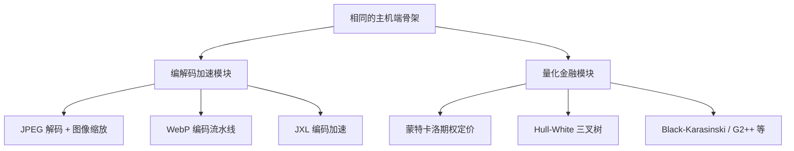

**图解：** 顶部的"相同骨架"向下分叉成两大领域，每个领域再各自展开为具体的算法实现。骨架是通用的，数学内核是专用的——这就是 Vitis Libraries 的精髓。

---

## 7.2 编解码加速：让图像处理像流水线工厂一样运转

### 7.2.1 问题：图像处理的三个计算瓶颈

你有没有用手机拍过一张 4K 照片，然后等了好几秒才看到它出现在相册里？或者用 CPU 服务器批量转换几千张图片时发现 CPU 被榨干？这些卡顿背后是三个计算密集的步骤：

**瓶颈一：变换域计算（DCT/IDCT）**

想象你要把一张图片"翻译"成数学语言。DCT（离散余弦变换）就是这个翻译过程——把像素值转换成频率分量。每个 8×8 的图像块需要 64 次乘法和大量加法。4K 图像有几十万个这样的块，CPU 要一个个算。

**瓶颈二：熵编码（霍夫曼编码 / ANS）**

把频率分量压缩成比特流，这个过程高度依赖上一步的结果（数据依赖性强），CPU 的 SIMD 并行加速效果有限。

**瓶颈三：像素级预处理（缩放、色彩空间转换）**

把 RGB 转 YUV，或者把 4K 图缩放到 1080P，每个像素都要做矩阵运算。


**图解：** 红色节点是 CPU 最吃力的计算密集步骤，橙色节点次之。`codec_acceleration_and_demos` 模块的使命就是把这些步骤搬到 FPGA 硬件流水线上。

### 7.2.2 心理模型：流水线工厂

理解这个模块最好的比喻是**汽车装配流水线**：

- **主机端（Host CPU）** = 工厂管理员：下采购订单（分配内存）、安排原材料入库（搬运图像数据到 FPGA）、下达生产指令（启动 Kernel）、最终质量检验（验证结果）。
- **FPGA 内核（Kernel）** = 装配流水线：每道工序（颜色转换 → DCT → 量化 → 霍夫曼编码）同时运行，一个工序处理当前图像块，下一工序处理前一个图像块，永远不闲着。
- **AXI Burst 数据总线** = 传送带：以大块突发传输的方式在工厂各区域（主机内存 ↔ FPGA HBM/DDR）之间高效搬运半成品。

### 7.2.3 整体架构

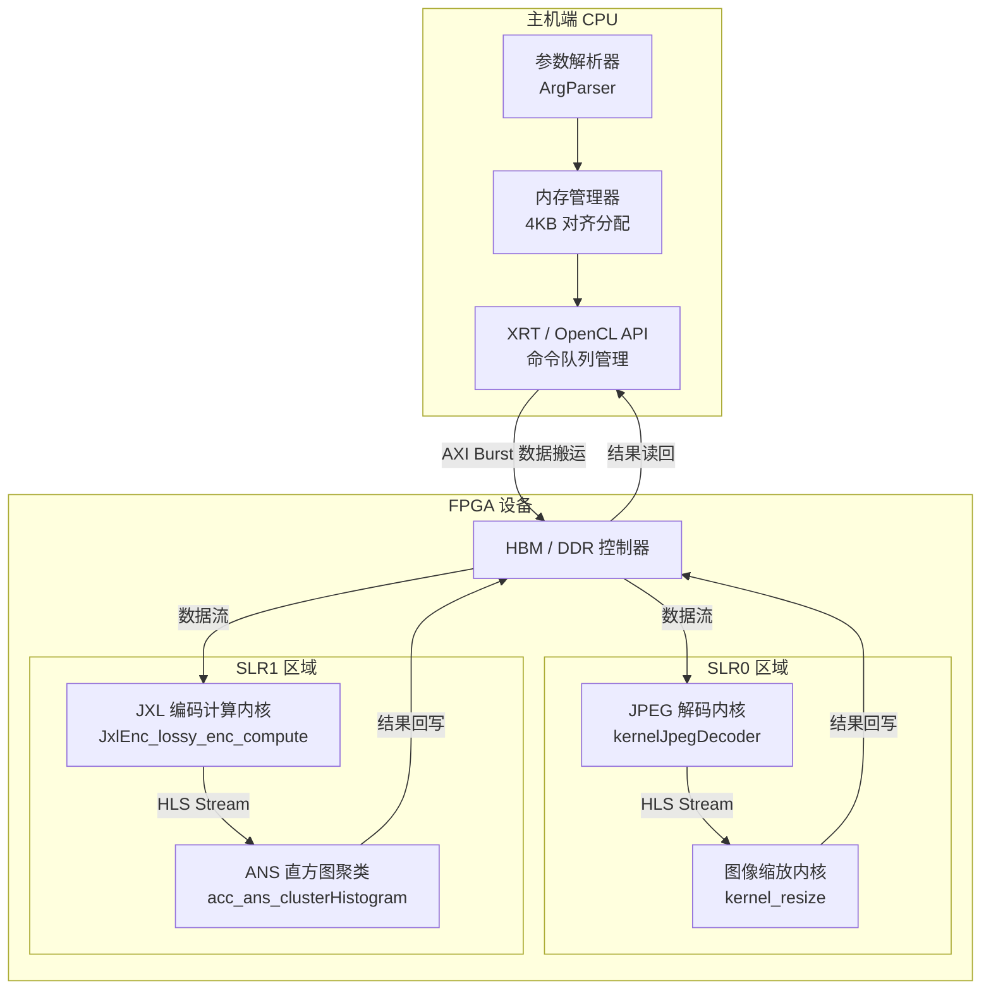

**图解：** 主机端（左侧）负责管理，FPGA 设备（右侧）负责计算。数据从主机出发，经过 AXI Burst 传输到 HBM/DDR，再流入计算内核，最后结果回写到内存再被主机读走。注意 JPEG 解码和 JXL 编码分布在不同的 SLR（Super Logic Region，可以理解为 FPGA 芯片上的物理分区）上，避免互相干扰。

### 7.2.4 子模块全景：四条专业生产线

`codec_acceleration_and_demos` 包含四条针对不同图像格式的生产线：

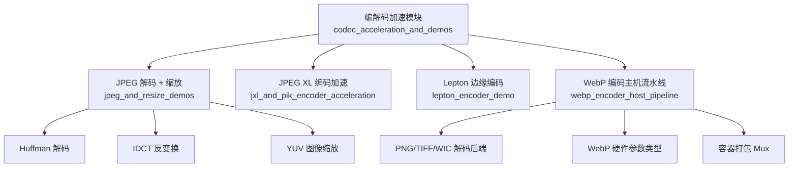

**图解：** 每条生产线都专门处理一种图像格式。它们共享相同的主机端管理逻辑，但硬件内核（中间的计算部分）各有不同。

### 7.2.5 JPEG 解码：从比特流到像素的旅程

以 JPEG 解码为例，我们来追踪数据的完整旅程：

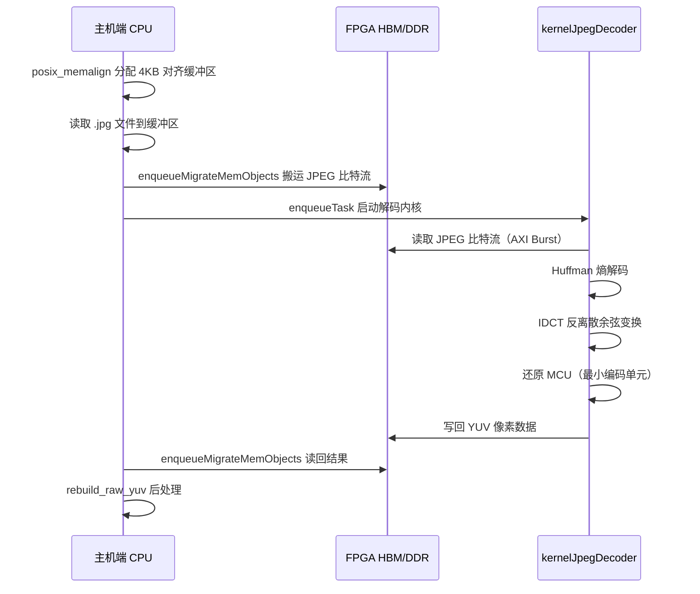

**图解：** 这个时序图展示了主机和 FPGA 内核之间的"对话"。关键点在于：主机在发出 `enqueueTask` 之后就可以做其他事情了（异步执行），直到需要结果时才调用 `finish()` 等待。

### 7.2.6 关键设计决策 A：内存对齐——为什么必须用 4KB 对齐？

想象快递公司要装箱发货，他们的集装箱只能装整数个标准托盘（1.2m × 1m）。如果你的货物形状怪异，无法整齐摆放，就会浪费大量空间，甚至无法发货。

FPGA 的 DMA（直接内存访问）控制器就是这个"快递公司"——它只能高效搬运页对齐（4096 字节边界）的内存块。

```cpp
// 正确做法：使用 aligned_alloc 分配对齐内存
ScanInputParam0* buf = aligned_alloc<ScanInputParam0>(1);  // 4KB 对齐

// 错误做法：普通 malloc（非对齐）
ScanInputParam0* buf = (ScanInputParam0*)malloc(sizeof(ScanInputParam0));
// 后果：DMA 报错，或吞吐量下降 80% 以上！
```

> **避坑提示：** 所有传递给 FPGA 的缓冲区必须用 `aligned_alloc`（而非 `malloc`）分配。非对齐内存会导致 DMA 控制器报错，或吞吐量暴跌超过 80%。

### 7.2.7 关键设计决策 B：哪些算法留在 CPU，哪些搬到 FPGA？

这是最有意思的架构决策。并不是所有逻辑都适合放在 FPGA 上。

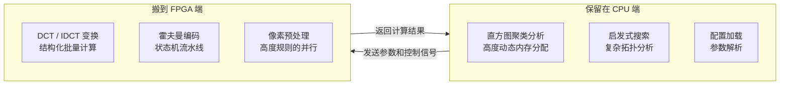

**图解：** FPGA 擅长"结构化、可预测、高度并行"的计算。而需要复杂动态内存分配（如直方图聚类）或启发式搜索的逻辑，放在 FPGA 上反而效率极低。混合模式（CPU 控制逻辑 + FPGA 计算内核）才是最优策略。

以 JXL 编码器为例，`acc_phase3.cpp` 中的直方图聚类保留在 CPU 端，而 `acc_lossy_enc_compute` 中的色彩空间变换和 DCT 策略选择则搬到了 FPGA。

### 7.2.8 关键设计决策 C：HBM vs DDR——平台适配

不同的 FPGA 板卡有不同的内存类型，就像有的工厂有高速传送带（HBM），有的只有普通货车（DDR）：

| 平台 | 内存类型 | 特点 | 策略 |
|------|---------|------|------|
| U50 / U280 | HBM（高带宽内存） | 多个独立通道，并发访问 | 不同内核端口映射到不同 HBM 伪通道 |
| U200 | DDR4 | 通道有限 | 通过 `sp` 命令显式隔离输入/输出端口的物理库 |

在 `conn_u50_u280.cfg` 和 `conn_u200.cfg` 中可以看到这些针对不同平台的定制化配置。

### 7.2.9 WebP 编码的主机驱动流水线

WebP 编码器是这个模块中主机端最复杂的部分。它需要支持多种输入图像格式（PNG、TIFF、WIC、普通 JPEG），就像一个瑞士军刀式的图像读取器：

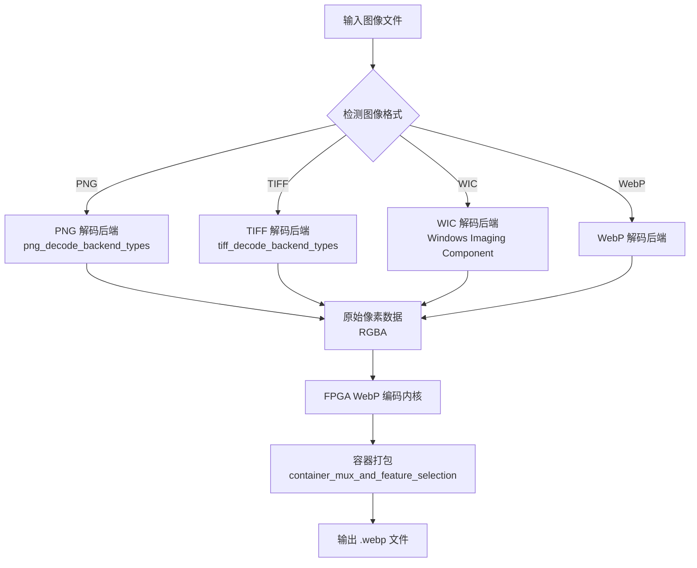

**图解：** 无论输入是什么格式，都先被解码成统一的原始像素（RGBA）表示，然后交给 FPGA 编码内核处理，最后打包成 WebP 容器输出。这种"标准化中间格式"的设计让主机端逻辑清晰解耦。

---

## 7.3 量化金融引擎：让定价像脉动阵列一样并行

### 7.3.1 问题：为什么利率衍生品定价这么慢？

想象你是一家银行的做市商，面对客户，你需要在**毫秒内**给出一份"百慕大互换期权"的报价。这个产品让客户可以在未来 5 年内的任意季末选择进入一个利率互换合约。

为了定价，你需要：
1. 把未来 5 年按季度切成 20 个时间节点
2. 在每个节点估计利率可能的分布（上涨、持平、下跌）
3. 从到期日**向后**推算每个节点的最优决策价值
4. 同时定价几千个不同参数的合约

这是个典型的"反向归纳"问题，传统 CPU 方案要几百毫秒，而市场要求毫秒级响应。这就是量化金融模块要解决的问题。

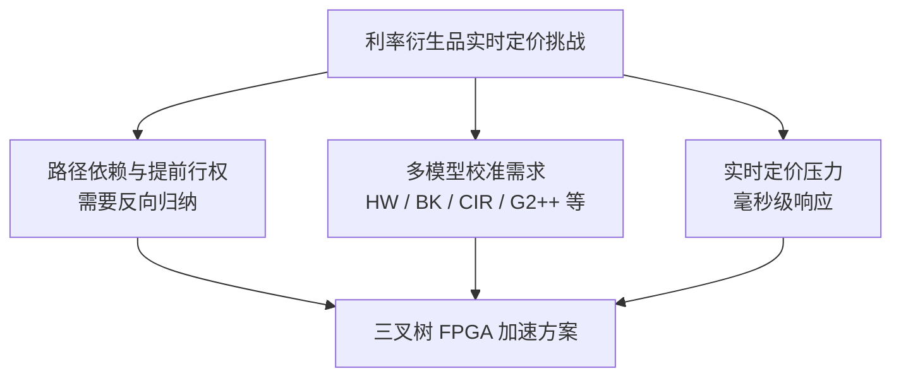

**图解：** 三个核心挑战汇聚到同一个解决方案——把三叉树计算映射到 FPGA 硬件流水线。

### 7.3.2 为什么选三叉树，不用蒙特卡洛？

这是个关键的架构选择。让我用三种方法打个比方：

- **蒙特卡洛（Monte Carlo）= 大量随机采样：** 就像让一万个人各自随机走迷宫，统计平均结果。路径随机，内存访问也随机，FPGA 很难高效执行。
- **有限差分（Finite Difference）= 数值解偏微分方程：** 就像用网格法解物理方程，需要求解大型稀疏矩阵，计算模式相对规则但内存需求大。
- **三叉树（Trinomial Tree）= 规则的时空网格：** 就像一棵有规律分叉的树，每个节点只和下一层的三个节点有关。计算顺序完全可预测，完美适合 FPGA 流水线！

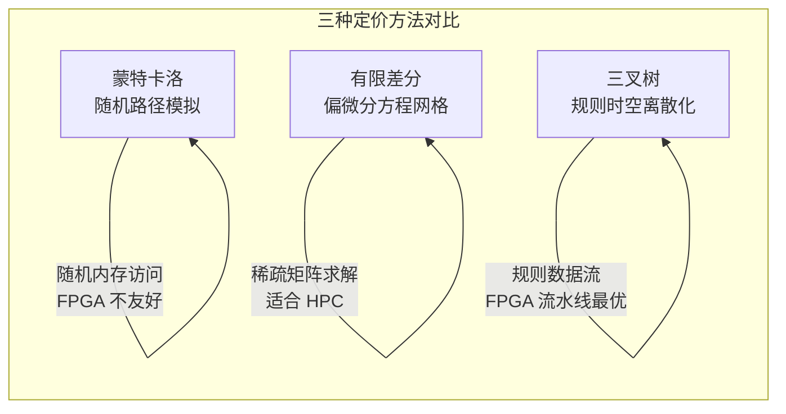

三叉树在处理美式/百慕大期权（可在多个日期提前行权）时具有天然优势：只需在每个节点比较"立即行权价值"和"继续持有价值"即可，无需像蒙特卡洛那样用最小二乘回归估计。

### 7.3.3 三叉树的数学直觉

不需要会写随机微分方程，只需要理解这个比喻：

**把利率的未来演变想象成一棵"利率树"。** 今天的利率是树根。每过一个时间步，利率可以：
- 向上跳（利率上升）
- 保持不变（利率持平）
- 向下跳（利率下降）

每种可能性都有一个概率，三个概率加起来等于 1。

$$V_{i,j} = e^{-r_{i,j}\Delta t} \left( p_{up} \cdot V_{i+1,j+1} + p_{mid} \cdot V_{i+1,j} + p_{down} \cdot V_{i+1,j-1} \right)$$

其中 $V_{i,j}$ 是第 $i$ 个时间步、第 $j$ 个利率节点的金融产品价值，$r_{i,j}$ 是对应的利率，$\Delta t$ 是时间步长，$p_{up}$、$p_{mid}$、$p_{down}$ 是三个分支的转移概率。

**反向归纳**就是从树的末梢（到期日）开始，一层层往回算，直到今天（树根），就得到了产品的现值（NPV）。

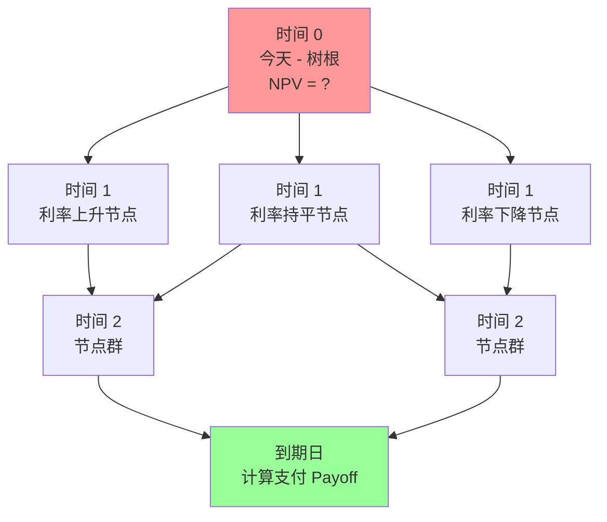

**图解：** 绿色节点（到期日）是起点，红色节点（今天）是终点。计算方向是从右到左（反向归纳）。FPGA 的流水线就是高效执行这个从右到左的批量计算。

### 7.3.4 量化金融模块整体架构

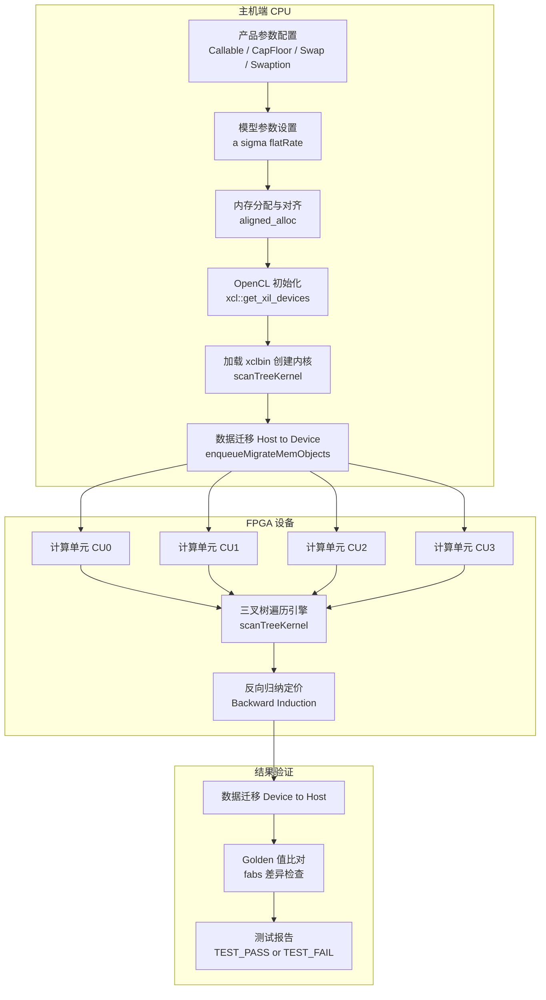

**图解：** 主机端（顶部）按顺序执行初始化步骤；FPGA 设备（中部）支持多个计算单元（CU）并行处理不同的定价任务；结果验证（底部）与前面章节介绍的 Golden Reference 模式完全一致。

### 7.3.5 模块全景：九种引擎，一个内核框架

量化金融的树模型模块支持多种利率模型和多种金融产品的组合。就像一家菜馆有固定的厨房（`scanTreeKernel`），但可以做各种菜（不同引擎）：

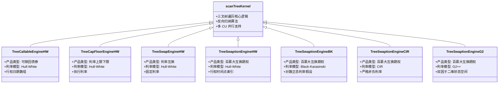

**图解：** 所有引擎（下方各类）都共享同一个 `scanTreeKernel` 底层核心（顶部），但通过不同的参数配置实现了不同的产品和利率模型组合。这是"算法内核复用"与"参数化定制"分离的最佳体现。

### 7.3.6 数据流：参数如何传递给 FPGA

量化金融模块用两个结构体分离"产品信息"和"模型信息"，就像订餐时分开填写"菜品"和"口味偏好"：

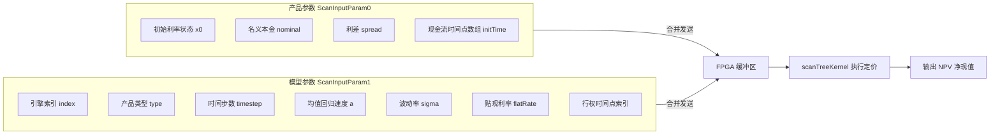

**图解：** 两个参数结构体分别承担"产品描述"和"模型校准"的职责，合并传入 FPGA 缓冲区，由 `scanTreeKernel` 统一处理。输出是一个浮点数 NPV（净现值）。

### 7.3.7 执行流程：从代码到定价结果

让我们追踪一个完整的定价任务：

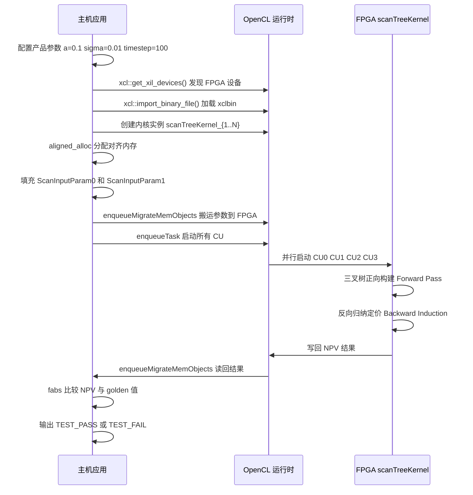

**图解：** 这个时序图完整展示了从配置参数到获得定价结果的全过程。和前几章的主机-内核模式一脉相承，只是这里的"内核计算"变成了三叉树遍历和反向归纳。

### 7.3.8 关键参数：timestep 的精度-性能权衡

`timestep` 是最重要的调优参数，就像摄影中的"快门速度"——时间步越多，图像（定价结果）越清晰，但曝光（计算）时间越长：

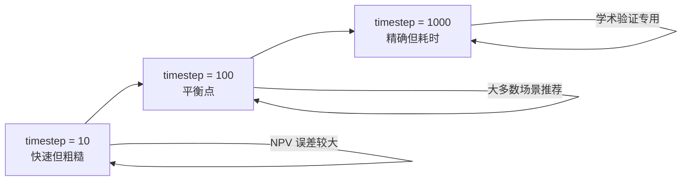

从模块文档的 Golden 值可以看出收敛行为：

| timestep | Hull-White Swaption NPV | 说明 |
|----------|------------------------|------|
| 10 | 13.668 | 快速估算，有一定误差 |
| 100 | ~13.3 | 趋向收敛 |
| 1000 | 13.201 | 高精度参考值 |

> **实用建议：** 生产环境中 `timestep=100~500` 是精度和速度的最佳平衡点。只有在做数值验证或学术研究时才需要 `timestep=1000`。

### 7.3.9 多计算单元（CU）并行：一锅多菜的策略

FPGA 支持在同一块芯片上运行多个相同内核的实例（CU，计算单元）。这就像一个厨房里开了四个灶——可以同时炒四道菜：

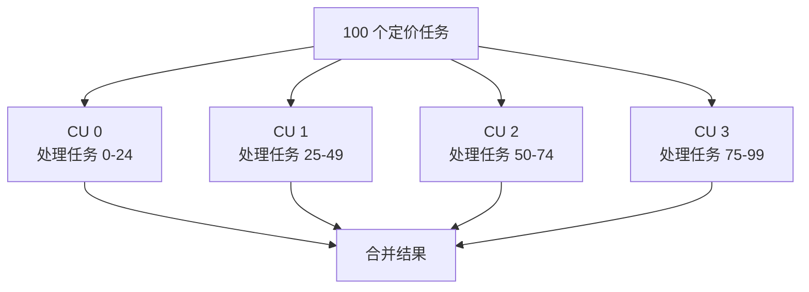

**图解：** 100 个定价任务被均匀分配到 4 个 CU，实现近 4 倍的吞吐量提升。代码中通过运行时检测 CU 数量：

```cpp
// 动态检测 FPGA 上实际可用的 CU 数量
cl_uint cu_number;
k.getInfo(CL_KERNEL_COMPUTE_UNIT_COUNT, &cu_number);

// 为每个 CU 创建独立的内核实例
for (cl_uint i = 0; i < cu_number; ++i) {
    std::string name = "scanTreeKernel:{scanTreeKernel_" + std::to_string(i+1) + "}";
    krnl_TreeEngine[i] = cl::Kernel(program, name.c_str());
}
```

---

## 7.4 蒙特卡洛期权引擎：当随机性遇见流水线

除了三叉树，量化金融模块还包含了蒙特卡洛（MC）期权定价引擎。这两种方法就像两种不同的天气预报手段：

- **三叉树** = 物理模型法：根据大气动力学方程精确推导，适合结构简单的衍生品。
- **蒙特卡洛** = 集成预报法：跑 10000 次模拟取平均，适合路径依赖性强的复杂期权（如亚式期权、障碍期权）。

### 7.4.1 蒙特卡洛引擎的 FPGA 挑战

蒙特卡洛在 FPGA 上的最大挑战是**随机数生成**和**流水线并行**。

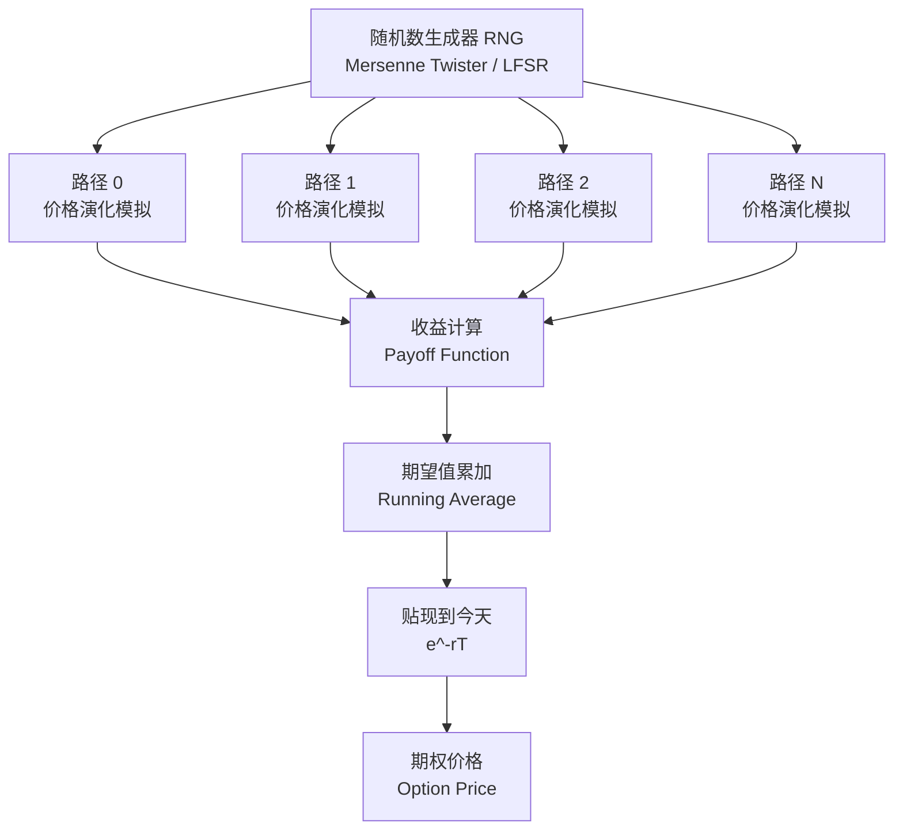

**图解：** FPGA 上的蒙特卡洛引擎同时生成并处理多条价格路径（并行计算），每条路径经过收益计算后累加到期望值，最后贴现得到期权价格。`european_engine_kernel_connectivity_profiles` 子模块配置了欧式期权引擎的内存连接。

### 7.4.2 欧式期权 vs. 美式期权：两种内核配置

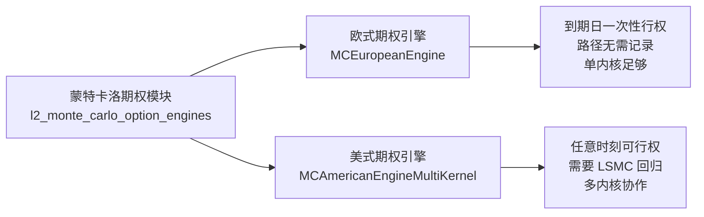

**图解：** 欧式期权只在到期日行权，每条蒙特卡洛路径彼此独立，单内核就够了。美式期权任意时刻可以行权，需要最小二乘蒙特卡洛（LSMC）估计"继续持有价值"，需要多个内核协作完成。

---

## 7.5 两个领域的对比：同样的骨架，不同的灵魂

现在让我们把编解码和量化金融放在一起对比，看清楚"相同骨架"下的深刻差异：

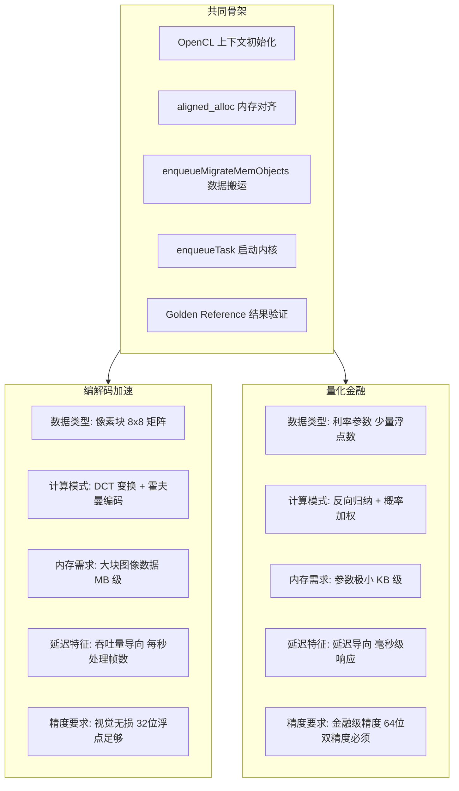

**图解：** 底部的共同骨架（蓝色）被两个领域共享，但两个领域在数据规模、计算模式、延迟要求和精度要求上都截然不同。这正是"通用框架 + 领域专用内核"设计模式的魅力所在。

| 维度 | 编解码加速 | 量化金融 |
|------|-----------|---------|
| 数据规模 | 兆字节级（图像文件） | 千字节级（参数结构体） |
| 计算特征 | 高吞吐量，批量像素处理 | 低延迟，单任务精确计算 |
| 并行策略 | 数据流水线（像素块并行） | 任务并行（多 CU 同时定价不同合约） |
| 精度要求 | 32 位浮点（视觉质量） | 64 位双精度（金融合规） |
| 内存访问 | 大块 AXI Burst 读写 | 零拷贝小参数传递 |
| 复杂度留在 CPU | 直方图聚类、启发式搜索 | 模型校准、曲线构建 |

---

## 7.6 避坑指南：两个领域的常见陷阱

### 7.6.1 编解码模块的陷阱

**陷阱 1：忘记内存对齐（最常见！）**

```cpp
// 危险！普通 malloc 不保证对齐
uint8_t* img_buf = (uint8_t*)malloc(img_size);

// 正确！使用对齐分配
uint8_t* img_buf = (uint8_t*)aligned_alloc(4096, img_size);
```

**陷阱 2：忘记 Event 依赖链**

模块默认启用乱序执行模式（`CL_QUEUE_OUT_OF_ORDER_EXEC_MODE_ENABLE`）。如果你在两个内核间没有正确设置 `cl::Event` 依赖关系，内核可能在数据还没搬完时就开始执行：

```cpp
// 正确做法：建立 Event 依赖链
cl::Event migrate_event, kernel_event;
q.enqueueMigrateMemObjects({input_buf}, 0, nullptr, &migrate_event);
std::vector<cl::Event> wait_list = {migrate_event};
q.enqueueTask(kernel, &wait_list, &kernel_event);  // 等待搬运完成再执行
```

**陷阱 3：SLR 布局溢出**

如果你向 SLR0 添加了太多逻辑，FPGA 布局布线会失败，报错通常是"routing congestion"。此时需要把部分逻辑迁移到 SLR1。

### 7.6.2 量化金融模块的陷阱

**陷阱 1：Golden 值 timestep 不匹配**

```cpp
// 错误：运行了 timestep=100，但对比的是 timestep=10 的 golden 值
DT golden = 13.668;  // 这是 timestep=10 时的参考值！
int timestep = 100;   // 但你跑的是 100 步
// 结果：数值对不上，误报 TEST_FAIL
```

每个 `timestep` 对应不同的 `golden` 值，确保两者匹配。

**陷阱 2：模型参数微小误差被指数级放大**

三叉树涉及大量指数运算（贴现因子 $e^{-r\Delta t}$）。参数 `a`、`sigma`、`flatRate` 哪怕差 0.0001，经过数百个时间步的累积，最终 NPV 误差可能达到 1% 以上。

```cpp
// 调试技巧：打印所有参数进行人工核对
printf("a=%.10f, sigma=%.10f, flatRate=%.10f, timestep=%d\n",
       param1.a, param1.sigma, param1.flatRate, param1.timestep);
```

**陷阱 3：CU 名称命名约定不匹配**

```cpp
// 内核实例名称必须与 xclbin 中的定义完全一致
std::string name = "scanTreeKernel:{scanTreeKernel_1}";  // 注意格式！
// 如果 xclbin 里叫 "scanTreeKernel:{scanTreeKernel_0}"（从 0 开始），就会找不到内核
```

诊断方法：
```bash
# 检查 xclbin 中实际的内核实例名称
xclbinutil --info -i your_kernel.xclbin | grep "KERNEL"
```

**陷阱 4：双精度 vs. 单精度**

金融计算必须用 `double`（64 位），不能用 `float`（32 位）。代码中通过 `DT` 宏定义数据类型：

```cpp
// 确保 DT 是 double，而不是 float
#define DT double  // 正确
// #define DT float  // 错误！会导致精度不足，Golden 值验证失败
```

---

## 7.7 本章小结：同一套骨架，两种截然不同的世界

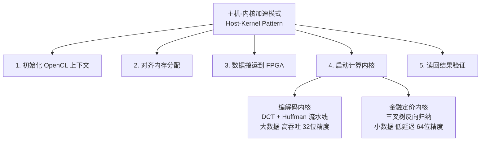

**图解：** 无论是处理 4K 图像还是定价百慕大互换期权，都经过同样的五个步骤。差异完全封装在"启动计算内核"这一步——这就是 Vitis Libraries 设计的精妙之处：**通用的基础设施，领域专用的计算内核**。

本章的核心洞见可以总结为三点：

1. **编解码加速** 是"大数据高吞吐"场景：像素数据以 MB 为单位流经 FPGA，关键挑战是内存对齐、数据流水线和 AXI Burst 效率。哪些算法留在 CPU（启发式搜索）、哪些搬到 FPGA（DCT/霍夫曼）的划分决策，决定了整体性能的上限。

2. **量化金融引擎** 是"小数据低延迟"场景：参数以 KB 为单位传入 FPGA，关键挑战是数值精度（必须用 64 位双精度）、timestep 与精度的权衡，以及多 CU 并行处理批量定价任务。三叉树的规则性天然适配 FPGA 流水线，这是它优于蒙特卡洛的核心原因。

3. **同一套主机-内核骨架** 连接两个截然不同的数学世界。理解了这套骨架，你就掌握了适配任何领域的钥匙。

---

## 7.8 延伸阅读与下一步

- **想深入编解码加速？** 查看 `codec/L2/demos/` 下的 `jpegDec`、`pikEnc`、`webpEnc` 目录，从最简单的 JPEG 解码示例开始。
- **想深入量化金融？** 从 `quantitative_finance/L2/tests/TreeEngine/` 开始，运行 Hull-White 可赎回债券的示例，调整 `timestep` 观察结果变化。
- **想了解如何为新算法添加 FPGA 加速？** 请看第八章——我们将介绍如何跨领域复用这套测试和验证框架。

> **思考题：** 如果你要加速一个"实时视频流的逐帧情感分析"任务（既有图像处理，又有复杂的神经网络推理），你会如何借鉴本章两个领域的设计思路？哪些部分会放在 FPGA，哪些保留在 CPU？