# 第五章：领域深度探索——数据分析、文本处理与机器学习

> **本章学习目标**：深入了解数据分析领域如何在 FPGA 上加速正则表达式匹配、模糊文本去重和量化决策树训练，亲眼看到 L1→L2→L3 的完整调用栈在一个具体问题中发挥作用。

---

## 5.1 本章地图：我们要探索什么？

想象你走进一家超级工厂，这座工厂专门处理"文字和数据"。工厂里有三条生产线：

1. **正则匹配流水线**——像一位极速邮局分拣员，每秒钟把数百万封信按格式规则分进不同的邮箱
2. **模糊去重流水线**——像一位经验丰富的档案管理员，即使面对拼写不一致的卡片，也能找出"同一个人"的所有档案
3. **决策树训练流水线**——像一座自动化考卷评阅机，把成千上万条数据"教"给一棵判断树，让它学会做决策

这三条生产线共同构成了 Vitis Libraries 里的 `data_analytics_text_geo_and_ml` 模块。本章我们从底层砖块（L1）到完整建筑（L2/L3）一层一层拆解它。

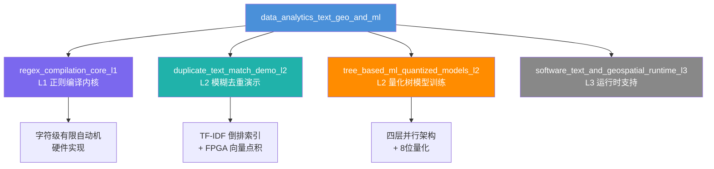

上图展示了本章的模块家谱。`data_analytics_text_geo_and_ml` 是总领域，下面挂着三个我们重点关注的子模块，每个子模块在不同的抽象层次解决不同的问题。

---

## 5.2 L1 基础砖块：正则表达式如何变成硬件电路

### 5.2.1 正则表达式是什么？

正则表达式就像一张"模式识别通缉令"。比如 `\d{3}-\d{4}` 这个规则，表示"三位数字、一个横线、四位数字"，可以用来识别电话号码格式。

在软件世界里，你写下这个规则，CPU 一个字符一个字符地对照检查。问题在于：如果你有 1 亿行日志，每行都要对照 50 条规则，CPU 就会被累垮。

### 5.2.2 FPGA 的秘密武器：有限自动机变成电路

Think of it as printing the regex rule onto a physical circuit board. Every state in the automaton (the intermediate states of matching) becomes a flip-flop register on the FPGA, and every transition arrow becomes a wire.

`regex_compilation_core_l1` 做的事情就是这个"印刷"过程——它把正则表达式**编译**成 FPGA 可以直接执行的硬件描述。

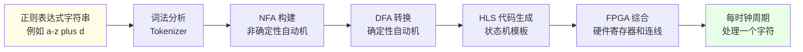

这个流程和编译器很像——就像 GCC 把 C 代码变成机器码，`regex_compilation_core_l1` 把正则规则变成硬件状态机。

**关键好处**：软件正则引擎每次运行都要解释规则，FPGA 状态机的规则已经"焊死"在电路里，每个时钟周期处理一个字符，速度比软件快 10-100 倍。

### 5.2.3 L1 的定位：单纯的积木块

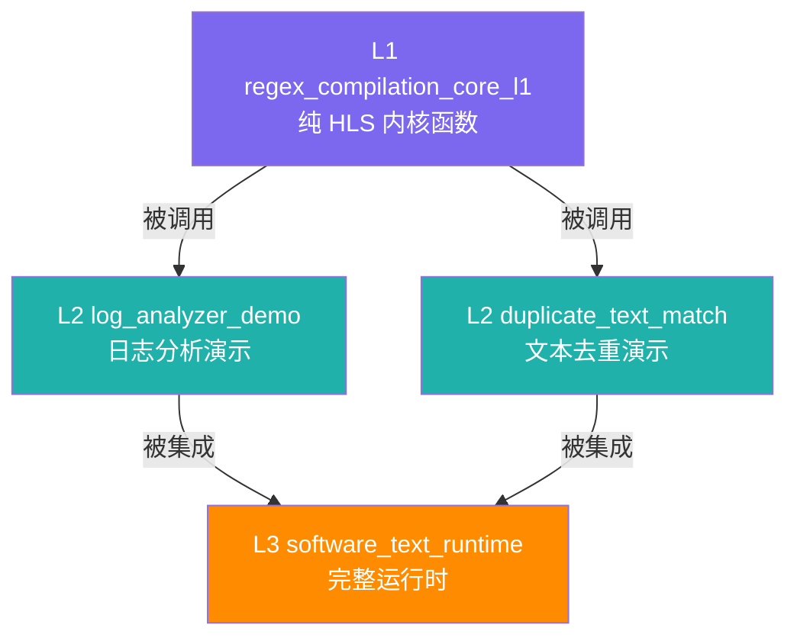

L1 就像乐高基础砖块——它本身不构成一个完整的玩具，但没有它，上面的每一层都无从搭建。L2 的演示程序调用 L1 提供的内核函数，L3 的完整运行时再把 L2 的功能包装成用户友好的 API。

---

## 5.3 L2 实战演示一：模糊文本去重系统

### 5.3.1 问题是什么？

想象你继承了一个客户数据库，合并自三个不同系统，里面有这样的记录：

| 记录 ID | 公司名称 |
|---------|---------|
| 001 | Xilinx Inc. |
| 002 | xilinx incorporated |
| 003 | Xlnx Corp |

这三条记录显然指向同一家公司，但精确字符串匹配完全失效。这就是**模糊去重**问题（Fuzzy Deduplication）——找出"相似但不完全相同"的重复项。

传统做法是两两比较：100 万条记录就要做 5000 亿次比较，CPU 需要跑好几天。

### 5.3.2 核心思路：指纹识别类比

You can picture this as a fingerprint identification system. 每条记录不是直接和其他记录比较原文，而是先提取"指纹"（数学特征向量），再用 FPGA 高速比较指纹。

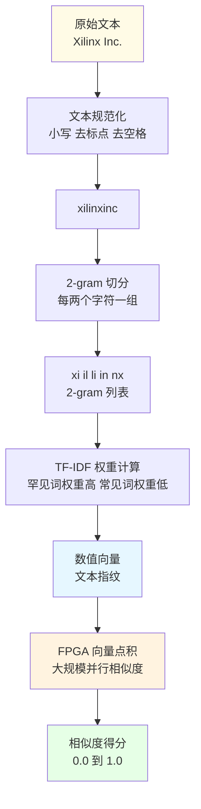

**什么是 2-gram？** 就是把文本按每两个字符切一刀，得到一串碎片。"xilinx" 变成 "xi", "il", "li", "in", "nx"。两条文本如果指向同一实体，它们的 2-gram 碎片会有很多重叠——就像同一个人的不同照片，五官特征总是相似的。

**什么是 TF-IDF？** TF（词频）衡量某个 2-gram 在这条记录里出现多少次，IDF（逆文档频率）衡量它在整个数据库里有多罕见。稀有的碎片权重更高，因为它们更有区分度——就像指纹里特殊的螺旋纹比常见的拱形纹更有价值。

### 5.3.3 系统架构：CPU + FPGA 协作

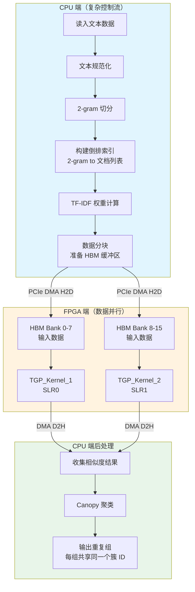

这个架构体现了一个重要原则：**把擅长的事交给擅长的人做**。

- CPU 端做**复杂的控制流**：建立倒排索引需要哈希表、动态数组、复杂分支——CPU 最拿手
- FPGA 端做**大规模并行计算**：把数百万条记录的向量两两做点积——FPGA 的并行数据通路远胜 CPU

### 5.3.4 双计算单元：两台机器同时开工

注意上图中 FPGA 端有两个内核：`TGP_Kernel_1` 和 `TGP_Kernel_2`。这叫做**双计算单元（Dual Compute Units）**配置。

想象一家工厂有两条完全相同的流水线，分别处理数据的前一半和后一半。这样理论上吞吐量翻倍。

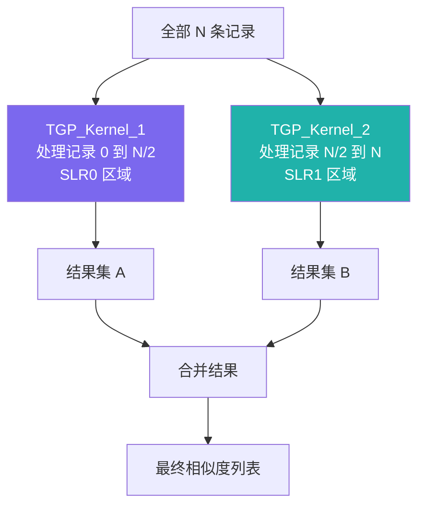

两个 CU 分别放置在 Alveo U50 芯片的 SLR0 和 SLR1（Super Logic Region，超级逻辑区域）——想象把 FPGA 芯片分成两个"大陆"，每台机器住在自己的大陆上，使用自己专属的 HBM 内存，互不干扰，路由走线更短，时序更好。

### 5.3.5 Canopy 聚类：不必两两比较的智慧

FPGA 算出相似度之后，CPU 还需要把相似的记录分组。朴素方法还是 $O(n^2)$，聪明的方法叫做 **Canopy 聚类**（Canopy Clustering）。

Think of it as an umbrella: pick one record, open an umbrella, all records similar enough to this one come under the same umbrella, then move on to find uncovered records.

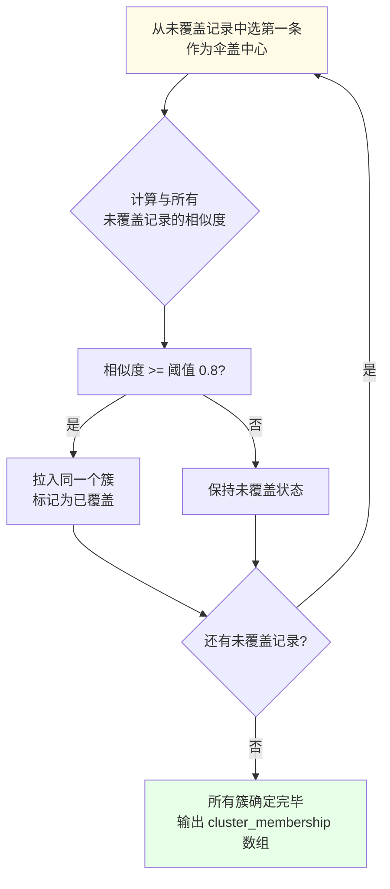

这个策略把复杂度从 $O(n^2)$ 降到大约 $O(n \times k)$，其中 $k$ 是每把伞平均覆盖的记录数，通常远小于 $n$。

### 5.3.6 子模块职责一览

`duplicate_text_match_demo_l2` 内部有三个子模块，分工明确：

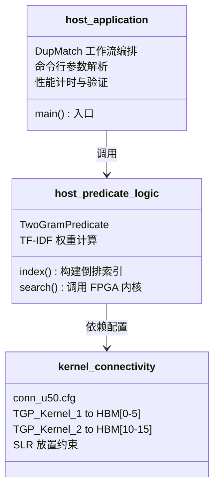

- **kernel_connectivity**：负责"接线图"——告诉 FPGA 综合工具哪根数据线连到哪块 HBM 内存
- **host_predicate_logic**：负责"翻译"——把文本变成 FPGA 能处理的数值，也负责收到结果后的聚类
- **host_application**：负责"管理"——用户打开终端，输入命令，看到结果，这一层是门面

### 5.3.7 端到端数据流时序

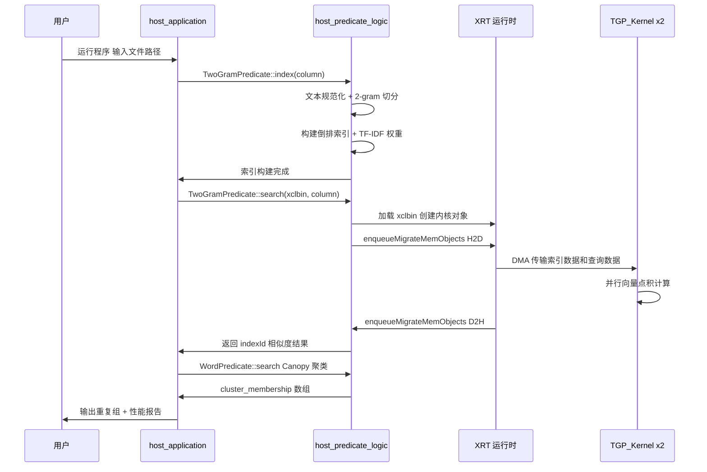

---

## 5.4 L2 实战演示二：量化决策树训练

### 5.4.1 决策树是什么？一棵"问答游戏"树

决策树就像"猜猜我是谁"的猜谜游戏。你站在树根，树问你第一个问题（比如"年龄大于 30？"），你回答是或否，走向不同的树枝，继续被问问题，直到走到叶子节点，叶子告诉你答案（"这个客户会流失"或"不会流失"）。

**训练**一棵决策树，就是从大量历史数据中自动找出"最佳问题序列"的过程。

### 5.4.2 为什么在 FPGA 上训练很难？

训练决策树有三个计算挑战，就像爬山的三道难关：

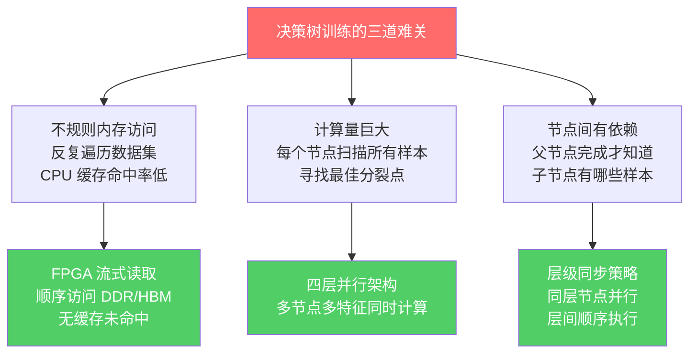

FPGA 通过定制化的数据流架构，针对性地解决了这三道难关。

### 5.4.3 量化是什么？八个桶装下所有数据

**量化**（Quantization）就像把温度计的读数从精确到 0.01 度简化成 256 个刻度。具体来说，把 32 位浮点特征值压缩为 8 位整数（只有 0-255 这 256 个值）。

想象你要判断"体重大于某个阈值"。你不需要知道精确体重是 72.38 公斤，只需要知道它落在第 156 个桶里，而阈值在第 143 个桶里——第 156 桶大于第 143 桶，走右枝。

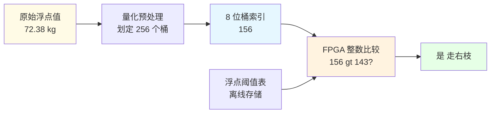

**量化为何可行？** 决策树只关心"大于"还是"小于"的布尔结果，不需要知道精确数值。只要桶的划分足够细（256 个桶通常已经够用），训练出来的树和浮点版本几乎一样。

**量化带来的红利**：

| 指标 | 32 位浮点 | 8 位量化 | 提升倍数 |
|------|-----------|----------|---------|
| 比较器 LUT 占用 | ~200 LUTs | ~50 LUTs | 4x 更省 |
| 同等存储容量的样本数 | 1x | 4x | 4x 更多 |
| 运算吞吐量 | 基准 | 4-8x | 显著提升 |

### 5.4.4 四层并行架构：工厂里的工厂

`tree_based_ml_quantized_models_l2` 的核心设计是一个**四层嵌套并行结构**，就像俄罗斯套娃，每一层打开里面还有并行：

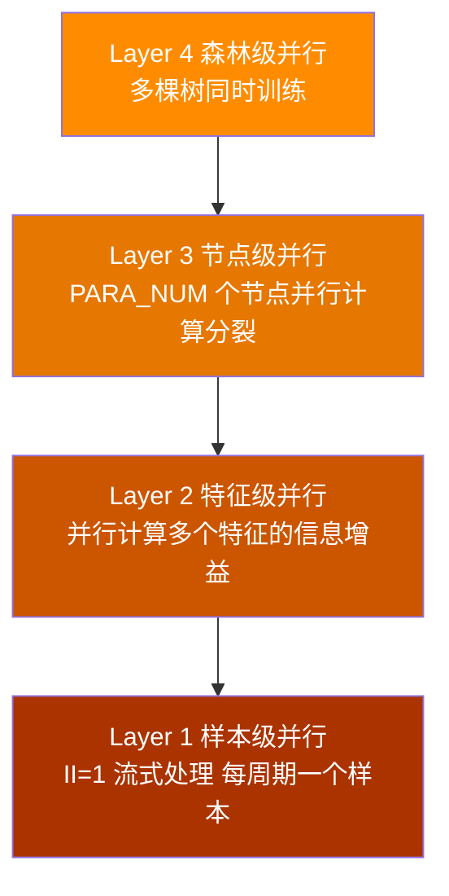

**什么是 II=1？** II 是 Initiation Interval（启动间隔）的缩写，就是流水线每隔多少时钟周期接受一个新输入。II=1 意味着每个时钟周期都能接受一个新样本——就像传送带每秒送出一个零件，速度拉满。

### 5.4.5 五站式工厂流水线

这五个处理阶段像工厂里的五个工位，通过 HLS `dataflow` 指令变成硬件上并行运行的流水线级：

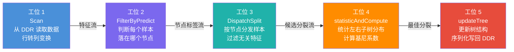

每个工位同时在处理不同批次的数据，就像：
- 工位 1 正在读取第 5 批数据
- 工位 2 正在判断第 4 批数据的节点归属
- 工位 3 正在分发第 3 批数据
- 工位 4 正在计算第 2 批数据的基尼系数
- 工位 5 正在把第 1 批数据的结果写回内存

五个工位并行，整体效率远超顺序执行。

### 5.4.6 节点结构：一张压缩档案卡

每个树节点在 FPGA 的 URAM 存储中是一张 136 位的压缩档案卡：

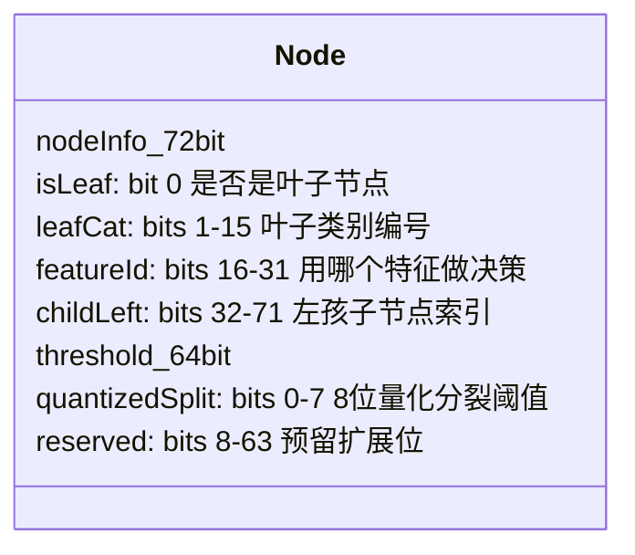

**为什么用 URAM 而不是 BRAM？** URAM（UltraRAM）是 Xilinx 高端 FPGA 上的大容量存储块，单块容量是 BRAM 的 9 倍。对于一棵最多 1023 个节点的树，一个 URAM 块就装得下，不需要多块 BRAM 拼接，布线更简单，时序更好。

### 5.4.7 三个子模块：同一套框架的三种变体

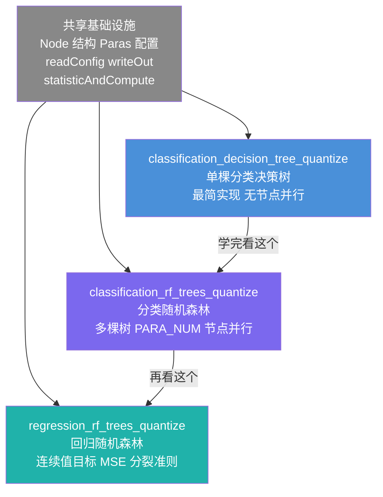

三个子模块就像同一辆汽车底盘上装了三种车身：

- **单棵决策树**：最简单，适合初学者理解整体框架
- **分类随机森林**：多棵树同时训练，节点级并行，面向分类问题（输出类别标签）
- **回归随机森林**：面向回归问题（输出连续数值，如房价预测），分裂准则从基尼系数改为均方误差（MSE）

---

## 5.5 L1-L2 协作：看一个完整请求的旅程

现在把两个 L2 演示放在一起，看看从用户数据到最终结果的完整旅程：

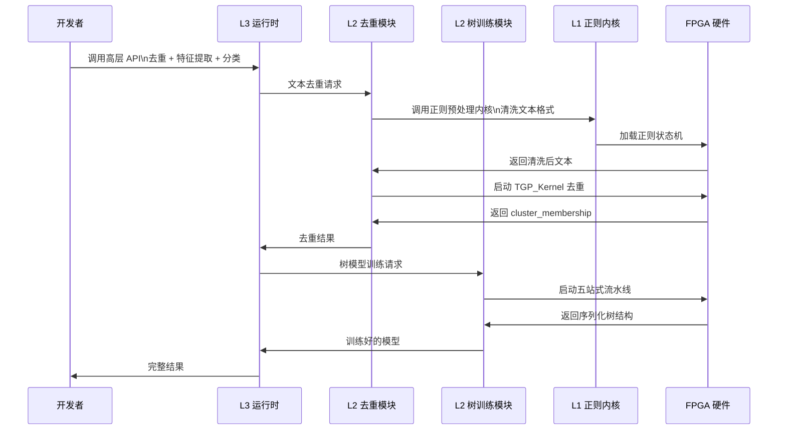

这个时序图展示了 L1、L2、L3 如何像接力赛一样配合工作。每一层只需要关心自己的抽象级别，下层的复杂性被完全封装起来。

---

## 5.6 关键设计决策对比

### 5.6.1 CPU 做什么，FPGA 做什么？

这个模块里有一个始终贯穿的设计原则：把正确的任务分配给正确的处理器。

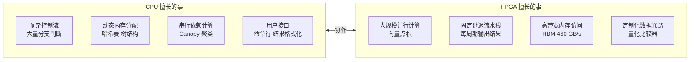

### 5.6.2 三个关键设计权衡

**权衡 1：2-gram vs 词级分词**

| 方案 | 优势 | 劣势 |
|------|------|------|
| 2-gram 字符级 | 对拼写错误容错、固定长度易并行 | 无语义理解 |
| 词级分词 | 保留词义 | 拼写错误即失配、变长处理复杂 |

数据清洗场景优先容错，所以选 2-gram。

**权衡 2：8 位量化 vs 32 位浮点**

决策树只需要比大小，不需要精确数值。8 位量化节省 4 倍资源，精度损失通常不足 1%。**混合策略最优**：样本存 8 位桶索引，实际阈值仍存浮点表，比较时查表转换。

**权衡 3：URAM vs BRAM 存储节点**

URAM 单块容量是 BRAM 的 9 倍，端口宽度（144 位）完美匹配节点结构（136 位），无带宽浪费，无需多块拼接。选 URAM 是正确答案。

---

## 5.7 常见陷阱与最佳实践

### 陷阱 1：内存对齐问题

XRT 运行时要求缓冲区必须 4KB 对齐。

```cpp
// 正确做法：使用 aligned_alloc
uint8_t* fields = aligned_alloc<uint8_t>(BS);  // BS 必须是 4KB 的倍数

// 错误做法：普通 malloc 可能导致未对齐，cl::Buffer 创建失败
uint8_t* fields = (uint8_t*)malloc(BS);
```

### 陷阱 2：HLS Dataflow 死锁

HLS 数据流要求每个流水线阶段在每条代码路径上都必须写出数据，否则下游永远等待，程序死锁——就像工位 3 的工人说"今天不想干活"，工位 4 就永远等不到零件。

```cpp
// 错误：条件写入，某些情况下流永远不被写
if (valid) {
    out_stream.write(data);  // 当 valid=false 时下游死锁
}

// 正确：每条路径都保证有输出
out_stream.write(valid ? data : dummy_data);
```

### 陷阱 3：数组完全分区导致资源爆炸

HLS 的 `array_partition complete` 指令会把整个数组展开成独立寄存器，对大数组而言资源消耗是灾难性的。

```cpp
// 危险：1024 个寄存器！
int arr[1024];
// pragma HLS array_partition variable=arr complete

// 推荐：循环分区，16 个 bank 已足够大多数场景
// pragma HLS array_partition variable=arr cyclic factor=16
```

### 陷阱 4：双 CU 负载不均衡

当前的数据分块按记录数平均切分：

```cpp
uint32_t blk_sz = column.size() / CU;  // 每个 CU 处理一半记录
```

如果某一半的记录平均长度远大于另一半，一个 CU 早早做完，另一个还在忙——就像两个工人分包裹，你给甲 50 个小包，给乙 50 个大包，甲很快喝茶等乙，总时间取决于乙。

**更好的方案**：按累计字节数而非记录数进行分块。

---

## 5.8 本章总结：三条流水线，一套模式

本章我们深入探索了 `data_analytics_text_geo_and_ml` 领域的三个核心组件：

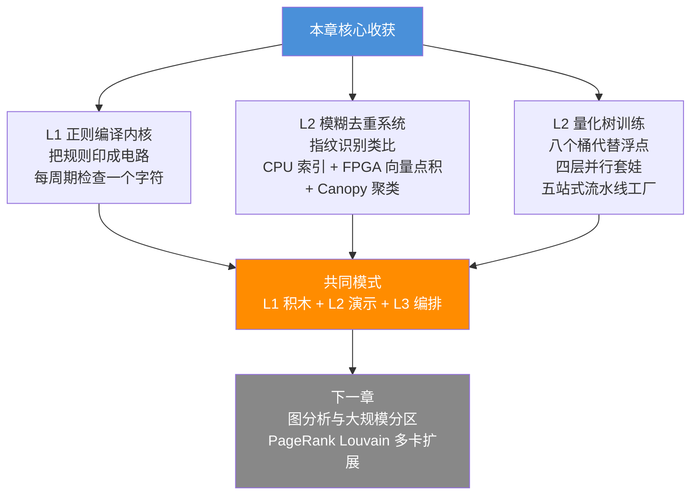

三条流水线背后有一套共同的设计哲学：

1. **分层解耦**：L1 提供原语，L2 组合功能，L3 封装接口
2. **职责分工**：复杂控制流留给 CPU，数据并行计算交给 FPGA
3. **资源对齐**：存储位宽（URAM 144 位）、数据结构（节点 136 位）精心匹配
4. **流水线优先**：所有计算密集的路径都追求 II=1 的流水线效率

掌握了这一章的内容，你就理解了数据分析领域从底层硬件到上层 API 的完整设计链。下一章，我们将转向另一个完全不同的领域——图分析，看看 PageRank、Louvain 社区检测这类算法如何被映射到 FPGA 硬件，以及当图大到一块 FPGA 装不下时，多卡分区如何解决问题。